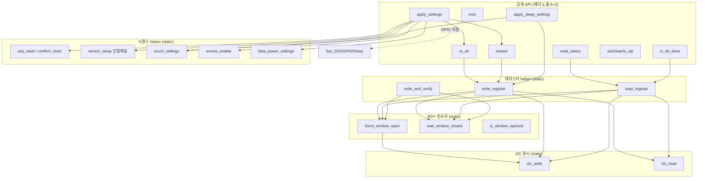

# 03 IQS323 I2C 직접 접근 설계 (Rev.2 간결)

**TL;DR**: 현 `tdc_drv_iqs323.c`(1291줄)는 운용에 안 쓰는 빌드 전용 도구 3종(ATI_CALIB_MODE·SLEEP_MEASURE_MODE·RTT_TUNING ≈ 540줄)과 FullATI가 폐기할 메커니즘(FIXED MULT/COMP write·CalCap 더미 채널·CRX0 방전·apply_sleep의 FIXED ATI)이 절반 이상을 차지한다. Rev.2는 이를 전부 버리고 **포트 vtable·어댑터 없이 직접 I2C**로 FullATI 6동작만 노출하는 `tdc_touch_iqs323.c/.h`(약 360줄)로 재작성한다. 내부는 평평한 static 헬퍼 3층(`i2c_write/read` → `force_window_open/wait_window_closed` → `write_register/read_register`)에 공개 API 6종 + 부팅 시퀀스 보조 2종. 핵심 전환: 0x36 ATI Setup `0x040C`(Full Mode), MULT/COMP write 폐기(IC 자동 산출), 단일채널(CRX1·방전 제거), `read_status`가 `(pressed·ati_error·ati_active·read_ok)` 4-tuple 반환(L2 단일 입력 채널), `re_ati`/`reseed`는 트리거 전용 논블로킹(완료 폴링 블로킹 제거). 시간상수·RDY 윈도우 타임아웃은 헤더 매크로. 한자 0, 코드 근거 [파일:라인].

---

## 1. 설계 목표·전제 정리

### 1.1 임무 경계

| 항목 | Rev.1(폐기) | Rev.2(본 설계) |
|---|---|---|
| 추상 | port vtable·mock·어댑터(`port_read_status` 등 01 §2 후보) | **없음** — 직접 I2C 함수 호출 |
| 파일 | `tdc_drv_iqs323` 유지 + port 레이어 신설 | `tdc_touch_iqs323.c/.h` 1쌍으로 평평화 |
| 노출 | 저수준 18+ 공개 API(현 헤더) | **6동작 + 부팅 보조 2** 만 |
| 빌드 전용 도구 | ATI_CALIB·SLEEP_MEASURE·RTT_TUNING 잔존 | **전부 삭제** |

> [!IMPORTANT]
> 본 노드는 **L1(HW I2C 직접) 레이어**만 설계한다. 순수 제어 FSM은 02 노드(`tdc_touch_fsm`), 얇은 연결·시간상수·main은 04 노드 소관. L1은 "레지스터를 읽고 쓰고 RDY 윈도우를 관리한다"는 단일 책임만 가진다. **L1에 제어 판정(게이트·stuck·롱터치)은 0건** — 그것은 02의 순수 FSM이 담당하고 L1은 FSM이 부르는 read/액션 동작만 제공한다.

### 1.2 정본 동작 (B99·99 종합 기준)

현 원점 코드(`tdc_drv_iqs323.c` 1291줄)는 **Full ATI 적용 이전**(FIXED MULT/COMP·CalCap 더미·방전 활성, ATI Mode=Disabled 0x08)이다. B99 동작분석·99 종합설계는 develop 버전(Full ATI 적용 후)의 동작을 정본으로 하며, 본 Rev.2는 그 정본 동작을 **간결한 직접 I2C 구조로 재구현**한다. 즉 현 원점에 없는 `read_status_full`·`reseed_only`·공개 `re_ati_trigger`·`apply_filter_power_settings`는 develop의 신규 동작이며 Rev.2가 직접 구현 대상으로 흡수한다.

---

## 2. 무엇을 버리는가 (직접화의 절반은 삭제)

### 2.1 빌드 전용 개발 도구 3종 — 전량 삭제 (약 540줄)

| 도구 | 빌드가드 | 코드 위치 [파일:라인] | 삭제 근거 |
|---|---|---|---|
| ATI Calibration | `TDC_TOUCH_ATI_CALIB_MODE` | `tdc_drv_iqs323.c:764~869` + `.h:405~431` | FullATI가 게인을 IC 자동 산출 → 후보 테이블 식별 도구 의미 소멸 |
| Sleep Measure | `TDC_TOUCH_SLEEP_MEASURE_MODE` | `.c:875~912` + `.h:439~444` | 1회성 절전 ATI 측정. 운용 무관 |
| RTT Tuning | `TDC_TOUCH_RTT_TUNING` | `.c:15~18·705~730·971~1008·1242~1291` + `.h:463~479` | MULT/COMP 런타임 조정. FIXED 폐기 시 무의미 |

> [!NOTE]
> 이 3종이 현 드라이버의 **상당 부분**을 차지한다. 밸리데이션 대상 운용 코드와 1회성 개발 도구가 한 파일에 섞여 추적성을 해친다. Rev.2는 운용 코드만 남긴다 — 개발 도구가 다시 필요하면 별도 파일·별도 빌드로 격리(본 레이어 비포함).

### 2.2 FullATI가 폐기하는 메커니즘 — 함수째 삭제

| 메커니즘 | 현 함수 [파일:라인] | 폐기 근거 (99 종합) |
|---|---|---|
| FIXED MULT/COMP write | `write_ati_compensation()` `.c:696~733`, 보드변종 매크로 `.c:650~694` | Full 자동 산출이 본질 [99 §2.1]. 보드별 MULT/COMP·SLEEP_ATI 12매크로 전량 삭제 |
| CalCap 더미 채널(CRX1) | `sensor_setup()` 내 `#elif DUMMY_ENABLE` `.c:479~510` | 단일채널 CRX0 단독 [99 §2.4]. CH1 더미 auto-ATI 수렴 실패가 무응답 80% 원인 |
| CRX0 주기 방전 | `discharge_crx0()` `.c:951~965`, `write_register_discharge()` `.c:203~225` | 정지 이슈 원천 소멸 [99 §1.1]. ESD는 Full 자동 Re-ATI로 전환 |
| 절전 FIXED ATI 재쓰기 | `apply_sleep_settings()` ATI MULT/COMP 부분 `.c:986~1021` | Full 시 재쓰기 폐기(자동 산출) [99 §3.4] |
| Touch margin 환산 read | `read_status` 외 `read_touch_margin()` `.c:1185~1240` | 개발 진단용. 운용 판정 무관(MARGIN_LOG는 디버그). 본 레이어 비포함 |

### 2.3 CRX1 분기 3종 → 삭제 (단일채널 단순화)

현 `sensor_setup()`은 `CRX1_REF_ENABLE`/`CRX1_VSS_ENABLE`/`CRX1_DUMMY_ENABLE`/else 4분기 [`.c:454~519`]. Rev.2는 **CRX0 단독**이라 CH1을 항상 Floating disable 1줄로 고정 → 4분기·관련 config 6종(`CRX1_*`·`CRX0_DISCHARGE_*`) 삭제.

### 2.4 삭제 요약 (라인 추정)

| 구분 | 현 라인 | Rev.2 |
|---|---|---|
| 빌드 전용 도구 3종 | 약 540 | 0 |
| FIXED ATI·보드변종 매크로·margin·방전 | 약 250 | 0 |
| CRX1 분기·dummy 관련 | 약 90 | 약 5(disable 고정) |
| **합계 삭제** | **약 880** | — |
| 유지·재작성(I2C·RDY·시퀀스·status) | 약 410 | 약 360 |

---

## 3. 무엇을 직접화하는가 (공개 6동작 + 보조 2)

FullATI 제어(02 FSM·04 연결)가 L1에 요구하는 동작은 6가지로 환원된다. 각각을 **추상 없이 직접 I2C**로 노출한다.

| # | 공개 동작 | 시그니처 | 현 대응 | 02/04 소비처 |
|---|---|---|---|---|
| 1 | 상태 read | `bool tdc_touch_iqs323_read_status(tdc_touch_iqs323_status_t *out)` | `read_status` `.c:1166` 확장(active 추가) | L2 단일 입력(02 §2.2 in) |
| 2 | 운용 설정 적용 | `void tdc_touch_iqs323_apply_settings(void)` | `apply_settings` `.c:1036` 재작성(Full·Beta·Power) | 04 부팅 READY |
| 3 | Re-ATI 트리거 | `bool tdc_touch_iqs323_re_ati(void)` | 공개 `re_ati_trigger`(develop) = static `.c:569` 공개화 | L3 게이트·stuck S2 |
| 4 | RESEED(순수) | `bool tdc_touch_iqs323_reseed(void)` | `reseed_only`(develop, 순수 bit3) | L3 stuck S1 |
| 5 | MCLR 하드리셋 | `void tdc_touch_iqs323_mclr(void)` | `mclr_reset` `.c:288`/wrapper `.c:921` | 04 부팅·stuck S3는 WDT |
| 6 | ATI 완료 1read | `bool tdc_touch_iqs323_is_ati_done(void)` | `is_auto_ati_done` `.c:926` | 04 부팅 폴링 |
| 보조1 | 절전 설정 | `void tdc_touch_iqs323_apply_sleep_settings(void)` | `apply_sleep_settings` `.c:967` 간결화 | 04 절전 진입 |
| 보조2 | ULP 플래그 | `void/bool tdc_touch_iqs323_set/clear/is_ulp(void)` | `tdc_set/clear/is_..._in_ulp_mode` `.c:20~33` | 04 시간축 선택 |

> [!IMPORTANT]
> **공개 6+2만 노출, 나머지 전부 static.** 현 헤더가 `mclr`·`is_auto_ati_done`·`apply_settings`·`read_status`·`read_touch_margin`·`reseed`·`discharge_crx0`·`apply_sleep_settings`·ULP 3종 + 빌드전용 다수를 공개했던 것을 6+2로 축소. RDY 윈도우·force comm·레지스터 helper·ack·confirm·sensor_setup 등은 **전부 `.c` 내부 static**(헤더에 노출 0).

### 3.1 status 4-tuple (L2 단일 입력 채널)

현 `read_status`는 2-out(pressed·ati_error)이나 [`.c:1166~1183`], FullATI 게이트는 `ati_active`도 필요(02 §2.2 `in.ati_active`, B99 §2.2 read_status_full 3-out). Rev.2는 0xEEEE 글리치 검출까지 흡수한 구조체 1개로 반환한다.

```c
/* tdc_touch_iqs323.h */
typedef struct
{
    bool ok;          /* read 성공(0xEEEE 글리치·통신실패 시 false) */
    bool pressed;     /* CH0 Touch (System Status MSB bit9) */
    bool ati_error;   /* ATI Error (LSB bit6) */
    bool ati_active;  /* ATI Active 진행 중 (LSB bit5) */
} tdc_touch_iqs323_status_t;
```

> [!NOTE]
> read 실패 시 L1이 `{ok=false, pressed=false, ati_error=false, ati_active=false}`로 채워 반환 → 02 §2.2의 "read 실패 입력 정규화(전역 캐시 제거·race 0)"가 L1 책임으로 자연 흡수된다. 현 코드의 `s_last_ati_error/active` 전역 캐시([01 §3] `tdc_touch.c:45·46`)는 **불필요해져 삭제** — L1이 매번 신선한 4-tuple을 주므로 캐시 0.

---

## 4. 파일 구조·내부 계층 (평평한 3층 + 공개)

### 4.1 파일

| 파일 | 내용 |
|---|---|
| `tdc_touch_iqs323.h` | 슬레이브 주소·RDY 핀·타임아웃 매크로, 레지스터 주소, status 구조체, 공개 6+2 프로토타입 |
| `tdc_touch_iqs323.c` | static 헬퍼 3층 + 공개 구현 |

> [!NOTE]
> 현 헤더의 비트필드 구조체 union(`reg_system_status_t`·`reg_sensor_setup_t`·`reg_touch_settings_t`·`reg_system_control_t`·`reg_events_enable_t`·`reg_i2c_settings_t`, `.h:170~365`)은 **유지하되 .c 내부로 이동**(헤더에서 비공개). 비트필드는 레지스터 의미를 명확히 해 밸리데이션에 유리하나, 외부 노출은 불필요. status read 1개만 union을 쓰고 나머지는 직접 바이트 write가 더 간결 → union은 status·system_control·sensor_setup 3개로 최소화.

### 4.2 내부 static 계층 (평평·직접)



레이어 호출은 **위에서 아래로만**(역방향 0). vtable·함수 포인터 0, 전부 직접 함수 호출.

---

## 5. 공개 API 상세 설계

### 5.1 read_status — 4-tuple 직접 read

```c
bool tdc_touch_iqs323_read_status(tdc_touch_iqs323_status_t *out)
{
    uint8_t lsb, msb;
    out->ok = out->pressed = out->ati_error = out->ati_active = false;

    if (!read_register(REG_SYSTEM_STATUS, &lsb, &msb))   /* 0x10 */
        return false;
    if (lsb == 0xEE && msb == 0xEE)                       /* 글리치 */
        return false;

    /* LSB: bit5 ati_active, bit6 ati_error / MSB: bit9 ch0_touch */
    out->ok         = true;
    out->ati_active = (lsb & (1u << 5)) != 0;
    out->ati_error  = (lsb & (1u << 6)) != 0;
    out->pressed    = (msb & (1u << 1)) != 0;   /* bit9 = MSB bit1 */
    return true;
}
```
근거: 현 `read_status` `.c:1166~1183`(pressed·ati_error)에 `ati_active`(LSB bit5, `.h:188`) 추가 + 0xEEEE 글리치 검출(현 `is_auto_ati_done_single_read` `.c:322`·`read_status_full` develop 동작 B99 §2.2). 비트필드 union 대신 마스크 직접 — 더 명시적.

### 5.2 apply_settings — Full ATI 운용 설정 (원자적)

```c
void tdc_touch_iqs323_apply_settings(void)
{
    SYS_WATCHDOG_REFRESH();
    ack_reset();              /* 0xC0 bit0 — System Control ACK */
    confirm_reset();          /* reset_event clear 폴링 */
    sensor_setup();           /* CRX0 단독, CH1·CH2 Floating disable */
    touch_settings();         /* 0x62 계수<32 (99 §4.3) */
    events_enable();          /* 0xD3 touch/ati/ati_error */
    beta_power_settings();    /* 0xB0/B1/B2/B4 Beta + 0x31/C0/C2/C5 Power */
    write_ati_setup_full();   /* 0x36 = 0x040C (Full Mode) — FIXED MULT/COMP write 0 */
    SYS_WATCHDOG_REFRESH();
    re_ati_internal();        /* 부팅 1회 명시 Re-ATI (99 §3.1 신규회귀1 차단) */
    reseed_internal();        /* 0xC0 bit3 — baseline 재동기 */
    tdc_touch_iqs323_clear_ulp();
    SYS_WATCHDOG_REFRESH();
}
```

핵심 차이 (현 `apply_settings` `.c:1036~1164` 대비):
- `write_ati_compensation()`(FIXED MULT/COMP, `.c:696`) → `write_ati_setup_full()`(0x36 = 0x040C 1회 write, MULT/COMP write 0). [99 §2.1]
- `beta_power_settings()` 신설 — 0xB0~0xB4 Beta 4종 + 0x31/C0/C2/C5 Power write [99 §2.2·2.3]. 현 코드엔 없음(POR 0).
- CH Timeout disable(현 `.c:1155` 0xC0 MSB 0x07)은 `beta_power_settings` 내 0xC0 write에 통합(Power Mode bits[6:4] + CH timeout 동시).
- 부팅 명시 Re-ATI(`re_ati_internal`) 추가 — FIXED 제거 시 게인 캘리 보장(99 §3.1).
- ATI_DUMP 분기(현 `.c:1040~1099`) 삭제.

> [!CAUTION]
> **원자성**: Full 전환(0x36 0x0C)·임계 계수 하향·부팅 Re-ATI는 한 함수에서 순서대로 [99 §5 원자적 3쌍]. 부분 적용 회귀 방지를 위해 빌드가드로 쪼개지 않고 단일 `apply_settings`에 묶는다(99 §7.3 P2 단일 가드 정신).

### 5.3 re_ati / reseed — 트리거 전용 논블로킹

```c
bool tdc_touch_iqs323_re_ati(void)   /* 0xC0 LSB bit2 — Re-ATI 트리거만 */
{
    return write_register(REG_SYSTEM_CONTROL, 0x04, 0x00);
}

bool tdc_touch_iqs323_reseed(void)   /* 0xC0 LSB bit3 — 순수 RESEED만 */
{
    return write_register(REG_SYSTEM_CONTROL, 0x08, 0x00);
}
```

> [!IMPORTANT]
> 둘 다 **트리거 후 즉시 반환**(완료 폴링 블로킹 없음). 완료 대기는 02 FSM이 다음 폴링 tick에서 `read_status`의 `ati_active==0`로 판정(논블로킹). 현 `wait_re_ati_done()`(`.c:581~623`, 10회×100ms 블로킹)·`apply_settings` 부팅 Re-ATI 완료 대기는 운용 폴링 경로에서 제거 — 부팅 apply_settings 내부 1회만 `wait_ati_done_blocking()`(static, 부팅 한정) 허용. **reseed는 99 §3.3 신설 `reseed_only`(순수 bit3) 의미** — 현 `reseed()`(`.c:931~949`)가 절전 감도·Prox를 동반하는 오염을 제거하고 순수 bit3만.

### 5.4 mclr / is_ati_done — 직접 GPIO·1read

```c
void tdc_touch_iqs323_mclr(void)   /* DIO16 OUTPUT→LOW→INPUT, 약 51ms 블로킹 */
{
    Sys_DIO_Config(RDY_PIN, RDY_PIN_CFG_OUTPUT);
    Sys_GPIO_Set_Low(RDY_PIN);
    Sys_Delay(DEFAULT_DELAY_MS * MCLR_HOLD_MS);     /* 1ms */
    Sys_DIO_Config(RDY_PIN, RDY_PIN_CFG_INPUT);
    Sys_Delay(DEFAULT_DELAY_MS * BOOT_WAIT_MS);     /* 50ms */
}

bool tdc_touch_iqs323_is_ati_done(void)   /* 1 read 논블로킹 */
{
    tdc_touch_iqs323_status_t st;
    if (!tdc_touch_iqs323_read_status(&st))
        return false;            /* read 실패·글리치 → 미완료로 재시도 */
    return (st.ati_active == false);
}
```
근거: `mclr_reset` `.c:288~298` 그대로(직접 GPIO, 추상 0). `is_ati_done`은 현 `is_auto_ati_done_single_read` `.c:312~331`을 read_status 재사용으로 간결화.

### 5.5 apply_sleep_settings — 절전 설정 간결화 (FIXED ATI 제거)

```c
void tdc_touch_iqs323_apply_sleep_settings(void)
{
    SYS_WATCHDOG_REFRESH();
    touch_settings_sleep();   /* 절전 감도 단일 write — 99 §3.4 이중 write 제거 */
    /* Full 시 절전 ATI MULT/COMP 재쓰기 폐기 (자동 산출, 99 §3.4) */
    write_register(REG_SYSTEM_CONTROL, 0x00, 0x07);  /* CH timeout disable 유지 */
    tdc_touch_iqs323_set_ulp();
    SYS_WATCHDOG_REFRESH();
}
```
현 `apply_sleep_settings` `.c:967~1034`에서 SLEEP_ATI MULT/COMP write 3블록(`.c:986~1021`) 삭제. 99 §3.4 "절전 감도 단일화" — 현 `apply_sleep`(255,255) → `reseed`(100,80) 이중 덮어쓰기를 절전 감도 1회로.

---

## 6. 헤더 매크로·상수 (시간상수는 04와 정합)

```c
/* tdc_touch_iqs323.h — 통신·타임아웃 상수 (L1 고유) */
#define TDC_TOUCH_IQS323_SLAVE_ADDR    0x44
#define TDC_TOUCH_IQS323_RDY_PIN       DIO16
#define TDC_TOUCH_IQS323_WIN_OPEN      0
#define TDC_TOUCH_IQS323_WIN_CLOSED    1
#define TDC_TOUCH_IQS323_MAX_WAIT_OPEN_MS   45
#define TDC_TOUCH_IQS323_MAX_WAIT_CLOSE_MS  20
#define TDC_TOUCH_IQS323_MCLR_HOLD_MS  1
#define TDC_TOUCH_IQS323_BOOT_WAIT_MS  50

/* 레지스터 주소 (현 .h:44~58 유지, 단일채널이라 SENSOR1/2 최소) */
#define REG_SYSTEM_STATUS    0x10
#define REG_SENSOR0_SETUP    0x30
#define REG_CONV_FREQ        0x31
#define REG_SENSOR0_ATI_SETUP 0x36
#define REG_CH0_TOUCH        0x62
#define REG_BETA_COUNTS      0xB0   /* 0xB0/B1/B2/B4 Beta */
#define REG_SYSTEM_CONTROL   0xC0
#define REG_LP_REPORT_RATE   0xC2
#define REG_PM_TIMEOUT       0xC5
#define REG_EVENTS_ENABLE    0xD3

/* ATI Setup Full: 0x36 = 0x040C (LSB 0x0C Mode=Full, MSB 0x04) */
#define ATI_SETUP_FULL_LSB   0x0C
#define ATI_SETUP_FULL_MSB   0x04

/* Touch 임계 계수 (99 §4.3: 계수<32) — config로 외부 주입 가능 */
#ifndef TDC_TOUCH_IQS323_THRESHOLD
#  define TDC_TOUCH_IQS323_THRESHOLD   16   /* 계수<32 + SNR (99 §4.3 [실측 게이트]) */
#endif
#ifndef TDC_TOUCH_IQS323_HYSTERESIS
#  define TDC_TOUCH_IQS323_HYSTERESIS  8    /* Threshold 계수의 약 50% */
#endif
```

> [!NOTE]
> 폴링·롱터치·stuck·쿨다운 등 **제어 시간상수는 L1 비포함** — 04 노드 `tdc_touch_time.h`(또는 config) 소유. L1은 RDY 윈도우 타임아웃·MCLR 타이밍 같은 **통신 HW 상수만** 가진다(경계 명확). Beta 레지스터 정수값(0xB0~0xB4 해석_A/B)은 [99 §4.1 실측 게이트] — 매크로로 두되 시험 write 1회 판별 후 고정.

---

## 7. 비트필드 union 최소화 결정

현 헤더는 6개 레지스터 union 비트필드를 정의([`.h:170~365`]). Rev.2는 사용처 기준으로 정리:

| union | 현 사용 | Rev.2 |
|---|---|---|
| `reg_system_status` | read_status·is_ati_done | **유지**(.c 내부) — read 비트 의미 명확 |
| `reg_system_control` | re_ati·reseed·ack·power | **직접 바이트 write로 대체** — `write_register(0xC0, 0x04, 0)` 한 줄이 union보다 간결 |
| `reg_sensor_setup` | sensor_setup | **유지**(.c 내부) — ctx0·enable 비트 조합 명확 |
| `reg_touch_settings` | touch_settings | **삭제** — LSB=threshold MSB=hyst 직접 write |
| `reg_events_enable` | events_enable | **삭제** — 고정 비트 마스크 1줄 write |
| `reg_i2c_settings` | (미사용) | **삭제** |

> [!NOTE]
> 비트필드 union은 read(상태 해석)·복잡 조합 write(sensor_setup)에만 유지하고, 단순 1~2비트 write(control·touch·events)는 직접 바이트가 더 짧고 추적 쉽다. 의료기기 밸리데이션은 "이 write가 어느 비트를 켜는가"가 주석 1줄로 자명한 쪽을 선호 — `write_register(0xC0, 0x04, 0x00) /* bit2 Re-ATI */`.

---

## 8. 미해결·결정 필요·실측 게이트

| # | 항목 | 분류 |
|---|---|---|
| 1 | 파일명 `tdc_touch_iqs323` vs `tdc_touch_hw` — 04/99 종합과 통일 | [결정 필요: 99 종합] |
| 2 | `apply_settings` 부팅 1회 Re-ATI를 **블로킹 완료대기**(static `wait_ati_done_blocking`) vs 비대기 후 다음 tick 판정 | [결정] 99 §3.1은 "1회 명시 Re-ATI" — 부팅 한정 블로킹 허용 권장 |
| 3 | Beta 레지스터 0xB0~0xB4 정수 해석_A(alpha×256) vs 해석_B(시프트지수) | [실측 게이트: 99 §4.1] |
| 4 | Touch Threshold 계수 12~24 중 확정값 — LTA 실측 환산 | [실측 게이트: 99 §4.3] |
| 5 | Power Mode 0xC0 bits[6:4]=101(No ULP)·0xC2 LP rate·0xC5 PM timeout 정수 | [실측 게이트: 99 §2.3] |
| 6 | t_ati(단일 CRX0 Full) — 부팅 wait·노말 ati_active 폴링 횟수 | [실측 게이트: 99 §6 #4] |
| 7 | 0x31 Conversion Freq 0x057F 방어 write 필요성(POR 동일이면 생략 가능) | [확인] |
| 8 | `write_and_verify`(read-back) — 운용 apply_settings에서 유지 vs 통신 부하로 생략 | [결정] 현 코드 verify 사용, 간결성·신뢰 trade-off |
| 9 | ULP 플래그(`g_..._in_ulp_mode`)를 L1 소유 vs 04 L3 이동 | [결정: 04 정합] 01 §3은 L3 권장 |
