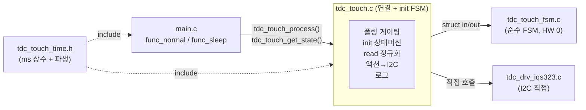

# 04 연결·시간상수·main (Rev.2 간결)

**TL;DR**: Rev.1 3레이어(포트 vtable·어댑터 분리 파일)를 폐기하고, 순수 FSM(`tdc_touch_fsm.*`)과 IQS323 직접 접근(`tdc_drv_iqs323_*`)을 잇는 **얇은 연결을 별도 어댑터 파일 없이 `tdc_touch.c` 안에** 둔다. 연결의 4책임 — ① 폴링 게이팅(`TDC_TOUCH_POLL_INTERVAL_MS <= 경과ms`), ② init(MCLR→auto-ATI 폴링→apply_settings→READY), ③ read 정규화(`read_status_full` 3-out → FSM 입력 구조체, read 실패 시 전부 false), ④ 액션→I2C 호출(`RE_ATI→re_ati_trigger`·`RESEED→reseed_only`·`MCLR→SYS_WATCHDOG_RESET`) + 로그(`state_changed`·boot 등 out 플래그를 `ci_printf`로). 시간 상수는 **신규 `tdc_touch_time.h` 1개**에 ms 5종 + 파생 매크로 `TDC_TIME_TO_CNT(ms,interval)`(올림 나눗셈) 집약 — 은수님이 ms만 바꾸면 카운트 자동 갱신(현 값 등가: 쿨다운 10·hold 10·ULP 11). **공개 API 3종 시그니처 불변**(`tdc_touch_init_begin`·`tdc_touch_process`·`tdc_touch_get_state`) → main.c 호출처 0변경. 절전 ULP는 현 구조대로 main.c `func_sleep` ULP 루프가 `tdc_touch_get_state` 직접 호출(시간상수만 time.h로 이전, 어댑터화 안 함 — 절전 미변경 요구사항). 코드 근거 전부 현 원점(develop 복원) 절대 라인.

---

## 0. 전제·정본 정합 (현 원점 코드 기준)

> [!IMPORTANT]
> **현 원점 코드는 develop 복원본**으로 FullATI가 아직 반영되지 않았다. 신규 공개 API(`read_status_full`·`re_ati_trigger`·`reseed_only`)·게이트·stuck은 **이 작업에서 신설**한다. B99·Rev.1 99 종합이 인용한 라인은 FullATI 구현 버전이라 현 원점과 다르므로, 본 노드는 **현 원점 절대 라인**으로 통일 인용한다.

| 심볼 | 현 원점 위치 | 상태 |
|---|---|---|
| `tdc_touch_process` | `tdc_touch.c:301` | 공개 API(불변) |
| `tdc_touch_get_state` | `tdc_touch.c:379` | 공개 API(불변, ULP 공유) |
| `tdc_touch_init_begin` | `tdc_touch.c:289` | 공개 API(불변) |
| `try_finish_init` | `tdc_touch.c:216` | static init 헬퍼 |
| `proc_long_touch` | `tdc_touch.c:78` | 롱터치(→FSM 흡수) |
| 폴링 게이팅 `POLL_INTERVAL<=Δ` | `tdc_touch.c:337` | 연결 책임(유지) |
| 부팅 무시 구간 | `tdc_touch.c:352~367` | 연결 책임(유지) |
| `read_status`(2-out) | `tdc_drv_iqs323.c:1166` | → `read_status_full`(3-out)로 03이 확장 |
| `reseed`(절전감도 동반) | `tdc_drv_iqs323.c:931` | → `reseed_only` 03이 신설 |
| `re_ati_trigger`(공개) | (현 원점 없음) | 03이 신설 |
| `apply_settings` | `tdc_drv_iqs323.c:1036` | 03이 Full ATI·Beta·Power 반영 |
| ULP 루프 | `main.c:967~1023` | 시간상수만 time.h 이전, 구조 유지 |
| `ULP_*` 매크로 | `main.c:794~805` | time.h로 이전 |

본 노드 입력 의존(병렬 fan-out): FSM 시그니처는 **02 Rev2 노드** 확정본, 신규 드라이버 API는 **03 Rev2 노드** 확정본을 따른다. 본 노드는 Rev.1 02·03을 근거로 **합의 가정**을 명시(§6)하고, 차이 시 종합 99가 조정한다.

---

## 1. 간결 구조 — 어댑터 파일 없음, tdc_touch.c가 연결

Rev.1은 연결을 `tdc_touch_adapter_normal.c/.h`·`tdc_touch_adapter_sleep.c/.h` 2쌍 별도 파일로 분리했다. **Rev.2는 이를 전부 폐기**한다. 연결 로직은 충분히 얇아(폴링 게이팅 1줄·액션 switch 1개·read 정규화 1블록) 별도 파일이 과잉 추상이다.



| 파일 | 역할 | 신규/기존 |
|---|---|---|
| `tdc_touch.c/.h` | **연결 + init 상태머신** + 공개 API 3종 | 기존(대폭 간결화) |
| `tdc_touch_fsm.c/.h` | 순수 운용 FSM(02 노드) | 신규 |
| `tdc_drv_iqs323.c/.h` | I2C 직접(03 노드) | 기존(API 확장) |
| `tdc_touch_time.h` | 시간 상수 1곳 | **신규** |
| `tdc_touch_config.h` | 기능 ON/OFF 빌드가드만 | 기존(시간수치 time.h 이관) |

> [!NOTE]
> 연결이 `tdc_touch.c` 한 파일에 모이면 **호출 흐름이 한 화면**에 보인다(밸리데이션 추적성). 어댑터 분리는 "노말/절전 두 시간축"을 위한 것이었으나, 절전은 어차피 main.c ULP 루프가 `get_state`만 직접 부르므로(현 구조) 어댑터 분리 가치가 없다. 노말 연결만 `tdc_touch.c`에 둔다.

---

## 2. 시간 상수 자동 파생 — `tdc_touch_time.h` (신규 1파일)

현 분산을 한 파일로 모은다. 노말 `tdc_touch.h:25~27`, ULP `main.c:794~805`, 신규 쿨다운·hold를 집약. **ms만 바꾸면 카운트 파생값이 따라온다.**

### 2.1 파일 전문 (구체)

```c
/* tdc_touch_time.h ? 시간 상수 한 곳. ms만 수정하면 카운트/임계 자동 파생.
 * 기능 ON/OFF 빌드가드는 tdc_touch_config.h, 시간 '수치'는 본 파일이 단일 소유. */
#ifndef TDC_TOUCH_TIME_H_
#define TDC_TOUCH_TIME_H_

/* ?? 핵심 파생 매크로: ms를 주기로 나눠 올림(최소 1회 보장) ?? */
#define TDC_TIME_TO_CNT(ms, interval_ms)  (((ms) + (interval_ms) - 1) / (interval_ms))

/* === (A) 노말 모드 ? ci_timer ms 차분 기준 === */
#define TDC_TOUCH_POLL_INTERVAL_MS   200    /* 폴링 주기 (ms) */
#define TDC_TOUCH_LONG_TOUCH_MS      2400   /* 롱터치 → 절전 (ms) */
#define TDC_TOUCH_INIT_TIMEOUT_MS    2500   /* 부팅 auto-ATI 대기 타임아웃 (ms) */
#define TDC_TOUCH_BOOT_WARN_MS       5000   /* 부팅 터치 5초 경고 (ms) ? 리터럴 승격 */
#define TDC_TOUCH_STUCK_TIMEOUT_MS   30000  /* stuck 단계 간격 (ms). 0이면 stuck 비활성 */

/* ms 기반 카운트형 상수 → ms 상수에서 자동 파생 (요구사항 핵심) */
#define TDC_TOUCH_RE_ATI_COOLDOWN_MS   2000  /* Re-ATI 재발행 금지 구간 (ms) */
#define TDC_TOUCH_READ_FAIL_HOLD_MS    2000  /* read 실패 롱터치 hold 구간 (ms) */

#define TDC_TOUCH_RE_ATI_COOLDOWN_CNT \
    TDC_TIME_TO_CNT(TDC_TOUCH_RE_ATI_COOLDOWN_MS, TDC_TOUCH_POLL_INTERVAL_MS)  /* @200=10 */
#define TDC_TOUCH_READ_FAIL_HOLD_CNT \
    TDC_TIME_TO_CNT(TDC_TOUCH_READ_FAIL_HOLD_MS, TDC_TOUCH_POLL_INTERVAL_MS)   /* @200=10 */

/* === (B) 절전 ULP ? 웨이크업 카운트 기준 === */
#define TDC_TOUCH_ULP_WAKE_MS         200   /* 웨이크업 주기 (ms) ? HW 타이머와 일치 */
#define TDC_TOUCH_ULP_LONG_TOUCH_MS   2200  /* 절전 롱터치 → 리셋 (ms) */

#define TDC_TOUCH_ULP_LONG_TOUCH_CNT \
    TDC_TIME_TO_CNT(TDC_TOUCH_ULP_LONG_TOUCH_MS, TDC_TOUCH_ULP_WAKE_MS)  /* @200=11 */

/* 절전 HW 타이머 ? ULP_WAKE_MS 변경 시 재계산 필요(자동 파생 불가, [실측 게이트]).
 * 공식: T[ms]=2^PRESCALE×(TIMEOUT+1)/40 (SLOWCLK 40kHz). 2^7×63/40=201.6ms. */
#define TDC_TOUCH_ULP_TIMER_PRESCALE       TIMER_PRESCALE_128
#define TDC_TOUCH_ULP_TIMER_TIMEOUT_VALUE  62

/* 빌드타임 0-division 가드(오타 방어) */
#if (TDC_TOUCH_POLL_INTERVAL_MS == 0) || (TDC_TOUCH_ULP_WAKE_MS == 0)
#  error "POLL_INTERVAL_MS / ULP_WAKE_MS must be > 0"
#endif

#endif /* TDC_TOUCH_TIME_H_ */
```

### 2.2 파생 등가성 (현 값 1:1 보존 검증)

| 호출 | 계산 | 결과 | 현 원점 값 | 등가 |
|---|---|---|---|---|
| `TDC_TIME_TO_CNT(2200,200)` | (2200+199)/200 | 11 | `ULP_LONG_TOUCH_COUNT`=11 `main.c:798` | 일치 |
| `TDC_TIME_TO_CNT(2000,200)` | (2000+199)/200 | 10 | 쿨다운 10 (신규, B99 권고) | 일치 |
| `TDC_TIME_TO_CNT(2000,200)` | 동일 | 10 | hold 10 (신규) | 일치 |

> [!CAUTION]
> **ms 차분 판정은 카운트로 바꾸지 않는다.** 폴링 게이팅·롱터치·stuck은 현 코드가 `ci_timer_get_tick()` ms 직접 비교(`tdc_touch.c:337·103`)라 폴링 지터 외 누적 오차 0. 카운트 비교로 바꾸면 회귀. 파생 카운트(`RE_ATI_COOLDOWN_CNT`·`READ_FAIL_HOLD_CNT`)는 **원래 폴링 카운터형**인 2종(매 tick 1증감)에만 적용. 롱터치·stuck은 ms 차분 그대로, 상수 출처만 time.h로 이동.

### 2.3 기존 매크로 이전·하위 호환

- `tdc_touch.h:25~27`(POLL_INTERVAL·LONG_TOUCH_MS·INIT_TIMEOUT_MS)는 time.h로 이동. 이름을 `_MS` 접미사로 통일(`TDC_TOUCH_POLL_INTERVAL`→`TDC_TOUCH_POLL_INTERVAL_MS`)하고 호출처 일괄 치환(현 `tdc_touch.c:337` 1곳).
- `tdc_touch.h`는 `#include <tdc_touch_time.h>`로 재노출 → 외부 include 깨짐 0.
- ULP `main.c:794~805` 매크로 → time.h로 이동, main.c는 `#include <tdc_touch_time.h>`만.
- `tdc_touch_config.h`는 **기능 ON/OFF 빌드가드만** 잔류, 시간 수치는 time.h가 단일 소유(역할 분리).

---

## 3. 노말 연결 — `tdc_touch_process()` 재작성 (tdc_touch.c)

현 `tdc_touch_process()`(`tdc_touch.c:301~377`)를 **간결 연결**로 재작성. 시그니처·반환 의미(롱터치 시 true) 불변. 내부는 init 상태머신 + 폴링 게이팅 + FSM 1회 호출 + 액션 변환.

### 3.1 모듈 static (연결 소유 — 최소)

```c
/* tdc_touch.c ? 연결이 소유하는 static (FSM 상태는 fsm_state에 격리) */
static tdc_touch_init_state_t s_init_state     = TDC_TOUCH_INIT_STATE_NONE;
static int                    s_mclr_done_tick = 0;     /* t3 tick 기준(현 :37) */
static int                    s_poll_tick_old  = 0;     /* 폴링 게이팅(현 s_touch_tick_old :40) */
static tdc_touch_fsm_state_t  s_fsm;                    /* 02 노드 FSM 상태 단일 구조체 */
```

> 현 분산 static 8종(`s_touch_state_old`·`s_boot_*`·`proc_long_touch`/`proc_re_ati_gate`/`proc_stuck` 내부 static)은 **전부 `s_fsm`으로 흡수**(02 노드 `tdc_touch_fsm_state_t`). 연결은 init·폴링게이팅 2개 static만 보유.

### 3.2 cfg 상수 빌드 (time.h → FSM 주입)

연결이 매 호출(또는 init 1회) FSM cfg를 time.h 상수로 채운다. 02 노드 `tdc_touch_fsm_cfg_t` 가정.

```c
static const tdc_touch_fsm_cfg_t s_fsm_cfg = {
    .long_touch_ms      = TDC_TOUCH_LONG_TOUCH_MS,
    .stuck_timeout_ms   = TDC_TOUCH_STUCK_TIMEOUT_MS,   /* 0이면 stuck 비활성 */
    .re_ati_cooldown_ms = TDC_TOUCH_RE_ATI_COOLDOWN_MS,
    .read_fail_hold_cnt = TDC_TOUCH_READ_FAIL_HOLD_CNT,
    .boot_warn_ms       = TDC_TOUCH_BOOT_WARN_MS,
};
```

> [!NOTE]
> cfg는 컴파일 상수라 `static const` 1개로 충분(런타임 변경 없음). 게이트/stuck ON/OFF는 cfg 값(`stuck_timeout_ms==0`)으로 표현 — 별도 bool 불필요. Re-ATI 게이트는 Full ATI 전제라 항상 평가하되, 발행 조건(노터치·미진행·Error·쿨다운)이 FSM 내부 분기.

### 3.3 `tdc_touch_process()` 본문 (간결)

```c
bool tdc_touch_process(void)
{
    /* ?? init 상태머신 (READY 전) ?? */
    switch (s_init_state)
    {
        case TDC_TOUCH_INIT_STATE_NONE:
            return false;                       /* begin() 전 no-op */
        case TDC_TOUCH_INIT_STATE_MCLR_DONE:
            try_finish_init();                  /* auto-ATI 폴링 → apply_settings → READY 전이 */
            return false;
        case TDC_TOUCH_INIT_STATE_READY:
        default:
            break;
    }

    /* ?? 폴링 게이팅 (연결 책임, ms 차분) ?? */
    int now = ci_timer_get_tick();
    if (TDC_TOUCH_POLL_INTERVAL_MS > (now - s_poll_tick_old))
        return false;
    s_poll_tick_old = now;

    /* ?? read 정규화 → FSM 입력 ?? */
    tdc_touch_fsm_in_t  in  = { .tick_ms = (uint32_t) now };
    bool pressed = false, ati_error = false, ati_active = false;
    in.read_ok = tdc_drv_iqs323_read_status_full(&pressed, &ati_error, &ati_active);
    if (in.read_ok)
    {
        in.pressed    = pressed;
        in.ati_error  = ati_error;
        in.ati_active = ati_active;
    }   /* read 실패 시 in.pressed/ati_* 는 false(초기값) 유지 ? 캐시 무효화 등가 */

    /* ?? 순수 FSM 1회 ?? */
    tdc_touch_fsm_out_t out;
    tdc_touch_fsm_step(&s_fsm, &s_fsm_cfg, &in, &out);

    /* ?? 로그 (out 플래그 → ci_printf) ?? */
    if (out.state_changed)
        ci_printv("[TOUCH] STATE: %s -> %s \r\n",
                  tdc_touch_state_name(out.prev_state),
                  tdc_touch_state_name(out.curr_state));
    if (out.boot_released_log)
        ci_printi("[TOUCH] BOOT TOUCH RELEASED ? sensing resumed \r\n");
    if (out.boot_ignore_led_request)
    {
        ci_printw("[TOUCH] BOOT TOUCH > 5s \r\n");
        led_request(LED_SRC_DBG, LED_ST_DBG_LONG_TOUCH_IGNORE);
    }

    /* ?? 액션 → I2C 직접 호출 (연결 책임) ?? */
    switch (out.action)
    {
        case TDC_TOUCH_ACTION_RE_ATI:
            (void) tdc_drv_iqs323_re_ati_trigger();
            break;
        case TDC_TOUCH_ACTION_RESEED:
            (void) tdc_drv_iqs323_reseed_only();
            break;
        case TDC_TOUCH_ACTION_MCLR:
            ci_printi("\r\n[TOUCH] STUCK ? MCLR RESET \r\n");
            delay_ms(20);                       /* RTT 드레인(부수효과는 연결) */
            SYS_WATCHDOG_RESET();
            break;
        case TDC_TOUCH_ACTION_HOLD:             /* read 실패 hold ? 무동작 */
        case TDC_TOUCH_ACTION_NONE:
        default:
            break;
    }

    if (out.long_touch_fired)
    {
        ci_printi("\r\n[TOUCH] EVENT: LONG TOUCH \r\n");
        return true;                            /* 절전 트리거 (현 :372 등가) */
    }
    return false;
}
```

> [!IMPORTANT]
> **연결의 4책임이 한 함수에 평평하게 보인다**: init switch → 게이팅 → read 정규화 → FSM 1회 → 로그/액션. HW 호출(`ci_timer_get_tick`·`read_status_full`·`re_ati_trigger`·`reseed_only`·`SYS_WATCHDOG_RESET`·`led_request`)은 전부 연결에 격리, FSM은 0건(순수). 부수효과(MCLR 전 20ms RTT 드레인)도 연결이 수행 ? FSM은 `MCLR` 액션만 반환(02 §3.3).

### 3.4 read 실패 정규화의 급소 (회귀 0)

현 코드는 read 실패 시 `tdc_touch_get_state` 내부에서 ATI 무시·곧장 NOT_TOUCH인데(`tdc_touch.c:393~402`), FullATI 전환 후엔 **read 실패 시 ati_error/active를 false로 정규화**해 FSM에 넘긴다. 이것이 "stale 캐시로 터치 중 Re-ATI 누출"을 입력 단계에서 차단(02 §1.3 핵심). 연결은 `in.read_ok=false`면 `pressed/ati_error/ati_active`를 건드리지 않아(초기값 false) 정규화 자동 보장. **전역 캐시 static 제거** = race 0.

---

## 4. init 상태머신 — `try_finish_init()` (tdc_touch.c, 유지+정리)

init은 HW 본질(MCLR·auto-ATI·apply_settings)이라 FSM 밖, 연결이 소유. 현 `try_finish_init()`(`tdc_touch.c:216~271`) 구조 보존, READY 전이 시 FSM 초기화 호출만 추가.

```c
static void try_finish_init(void)
{
    /* auto-ATI 완료 OR 타임아웃 전엔 다음 tick 재시도 */
    if (!tdc_drv_iqs323_is_auto_ati_done())
    {
        if (TDC_TOUCH_INIT_TIMEOUT_MS >= (tdc_timer_get_t3_tick() - s_mclr_done_tick))
            return;
        ci_printw("[TOUCH] AUTO-ATI: TIMEOUT, FORCING FINISH \r\n");
    }
    SYS_WATCHDOG_REFRESH();
    tdc_drv_iqs323_apply_settings();            /* Full ATI·임계·Beta·Power·부팅 Re-ATI (03 노드) */
    SYS_WATCHDOG_REFRESH();

    /* READY 전이 + FSM 초기화 */
    uint32_t now = (uint32_t) ci_timer_get_tick();
    tdc_touch_fsm_init(&s_fsm, now);            /* 02 노드: 분산 static 일괄 0 */
    s_poll_tick_old = (int) now;
    s_init_state    = TDC_TOUCH_INIT_STATE_READY;
    ci_printi("[TOUCH] INIT FINISH DONE \r\n");

    /* 누른 채 부팅 방어 ? 첫 read로 boot 터치 판정 → FSM에 boot_ignore 설정 */
    bool pressed = false, e = false, a = false;
    if (tdc_drv_iqs323_read_status_full(&pressed, &e, &a) && pressed)
    {
        tdc_touch_fsm_set_boot_ignore(&s_fsm, now);
        ci_printw("[TOUCH] BOOT TOUCH ? ignoring until released \r\n");
    }
}
```

> [!NOTE]
> 현 코드는 `tdc_touch_process()` MCLR_DONE 케이스에서 try_finish_init 성공 시 READY 전이·boot 판정을 인라인했다(`tdc_touch.c:312~326`). Rev.2는 이를 `try_finish_init()` 내부로 모아 process를 간결화(반환 void, 상태 전이 자체 수행). boot 판정은 `read_status_full` 직접 호출로 1회.

---

## 5. 절전 ULP 경로 — main.c 구조 유지(시간상수만 이전)

> [!IMPORTANT]
> **절전은 어댑터화하지 않는다.** 은수님 "절전 미변경" 요구사항 + B99 §2.3 "절전에 `tdc_touch_process`·`proc_*` 호출 0건". 절전 ULP 루프(`main.c:967~1023`)는 현 구조대로 `tdc_touch_get_state` **직접 호출**, 카운트 누적·리셋도 인라인 유지. 변경은 **시간 상수를 time.h로 이전**한 것뿐.

### 5.1 절전 변경점 (최소)

| 위치 | 현 | Rev.2 |
|---|---|---|
| `main.c:794~805` ULP 매크로 | main.c 로컬 #define | **time.h 이전**, main.c는 include만 |
| `main.c:954` `ci_timer_init_prescaled(ULP_TIMER_PRESCALE, ULP_TIMER_TIMEOUT_VALUE)` | 로컬 매크로 | `TDC_TOUCH_ULP_TIMER_*` (time.h) |
| `main.c:997` `touch_cnt >= ULP_LONG_TOUCH_COUNT` | 로컬 매크로 | `TDC_TOUCH_ULP_LONG_TOUCH_CNT` (time.h) |
| ULP 루프 구조(`get_state`·카운트·리셋) | 인라인 | **불변** |
| `func_sleep` 진입(`apply_sleep_settings`·`reseed`) | `tdc_drv_iqs323_*` 직접 | **불변** |

### 5.2 절전 진입 드라이버 호출 (직접, 어댑터 0)

`func_sleep`은 터치 외 절전 시퀀스(FPGA/PMIC OFF 등)와 섞여 있어 추출 무가치. 터치 관련 호출(`apply_sleep_settings`·`reseed`)은 **main.c가 드라이버 직접 호출** 유지. 단 03 노드가 Full ATI 시 `apply_sleep_settings`의 FIXED MULT/COMP 재쓰기를 폐기하고 절전 감도 단일화를 반영(03 책임, 연결 무관).

> [!CAUTION]
> **절전 stuck 30초 미구현 유지**: 현 ULP는 롱터치(2.2초→리셋)만. 절전 30초 SW 타임아웃은 ULP 2.2초 리셋이 선제 발동해 실효 0(B99 §6.2, 종합 게이트 13). Rev.2도 절전 stuck 미구현(요구사항 재확인 사항, 본 노드 범위 밖). FSM의 stuck은 노말 전용(cfg `stuck_timeout_ms` 노말만 주입, 절전은 ULP가 FSM 미사용).

---

## 6. main.c 인터페이스 (공개 API 불변)

> [!IMPORTANT]
> **공개 API 3종 시그니처 100% 불변** → main.c·initialize.c 호출처 **0변경**(시간상수 include 1줄 추가 외).

| 공개 API | 시그니처 | main.c 호출처 | 변경 |
|---|---|---|---|
| `tdc_touch_init_begin` | `void (void)` | `Initialize()` 내부 | 불변 |
| `tdc_touch_process` | `bool (void)` | `main.c:450` `powerButtonPushed = tdc_touch_process()` | 불변(내부만 재작성) |
| `tdc_touch_get_state` | `bool (tdc_touch_state_t*)` | `main.c:979` ULP 루프 | 불변(ULP 공유) |
| `tdc_touch_state_name` | `const char* (tdc_touch_state_t)` | ULP 로그 `main.c:984` | 불변 |

`tdc_touch_get_state`는 노말(현 코드엔 process 내부에서 호출)·절전 ULP가 공유하므로 **공개 유지**. FullATI 후 내부는 `read_status_full` 3-out을 받아 pressed만 상태로 환산(ati는 ULP에선 무시 — ULP는 게이트 없음). 시그니처는 불변이라 ULP 호출 깨짐 0.

```c
bool tdc_touch_get_state(tdc_touch_state_t *p_state)   /* 시그니처 불변 */
{
    bool pressed = false, e = false, a = false;
    if (!tdc_drv_iqs323_read_status_full(&pressed, &e, &a))
        return false;
    *p_state = pressed ? TDC_TOUCH_STATE_TOUCH : TDC_TOUCH_STATE_NOT_TOUCH;
    return true;
}
```

> [!NOTE]
> `get_state`는 ULP 전용 "즉시 상태 조회"로 단순화 ? 노말 폴링은 §3.3 process가 `read_status_full`을 직접 받아 FSM에 정규화 입력하므로 get_state를 경유하지 않는다(현 코드는 process가 get_state 경유했으나, Rev.2는 FSM 정규화 위해 process가 직접 read). get_state는 ULP·디버그용 얇은 wrapper로 잔류.

---

## 7. 합의 가정·미해결·실측 게이트

병렬 fan-out이라 02(FSM)·03(드라이버) Rev2 확정본과 정합이 필요. 본 노드의 **가정**과 차이 시 종합 99 조정 항목:

| # | 항목 | 가정(Rev.1 근거) | 분류 |
|---|---|---|---|
| 1 | FSM step 시그니처 `tdc_touch_fsm_step(state*,cfg*,in*,out*)` | Rev.1 02 §2.6 | 02와 합의 |
| 2 | in 구조체 `{tick_ms,read_ok,pressed,ati_error,ati_active}` | Rev.1 02 §2.2 | 02와 합의 |
| 3 | out 구조체 `{action,long_touch_fired,state_changed,curr/prev_state,boot_*}` | Rev.1 02 §2.3 | 02와 합의 |
| 4 | action enum `{NONE,HOLD,RE_ATI,RESEED,MCLR}` | Rev.1 02 §2.1 | 02와 합의 |
| 5 | `fsm_init`·`fsm_set_boot_ignore` 초기화 함수 존재 | Rev.1 02 §2.6 | 02와 합의 |
| 6 | 신규 드라이버 API 3종 시그니처(`read_status_full`(b*,b*,b*)·`re_ati_trigger`(void)·`reseed_only`(void)) | Rev.1 03 §4 | 03과 합의 |
| 7 | 쿨다운 절대시각화 vs 카운트(read hold 미세차) | Rev.1 02 §3.4 절대시각 권장 | [실측 게이트: 시뮬] |
| 8 | `RE_ATI_COOLDOWN_MS`·`READ_FAIL_HOLD_MS`=2000 적정성(t_ati·burst 2초 덮나) | Rev.1 04 §7-4 | [실측 게이트] |
| 9 | `ULP_WAKE_MS`(200)↔HW 실측(201.6ms) 오차 ? 파생 11회=2217.6ms | Rev.1 04 §7-5 | [실측 게이트] |
| 10 | 절전 30초 미구현(ULP 2.2초 선제) 요구사항 확인 | B99 §6.2 | [요구사항] |
| 11 | `tdc_touch.h` 재노출 vs 호출처 일괄 치환 | §2.3 | [결정] 재노출 권장 |
