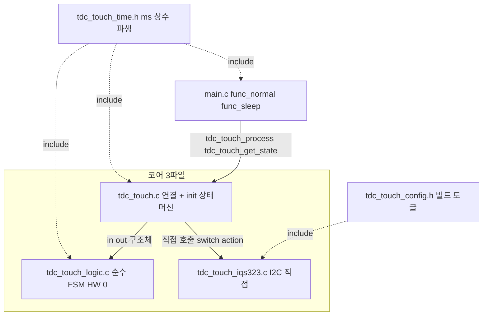
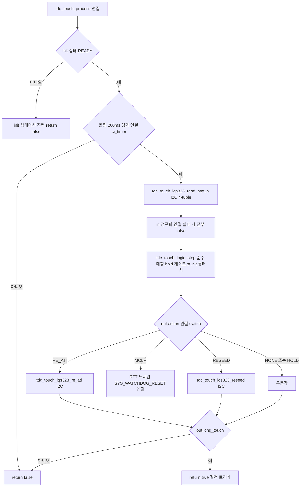

# 99 종합 간결 2~3파일 구조 (Rev.2)

**TL;DR**: Rev.2 간결 노드 01~05를 단일 수렴한다. **최종 구조는 3파일 + 헤더 2** — ① `tdc_touch_logic.c/.h`(순수 제어 FSM, HW·timer·printf include 0, 테스트 대상), ② `tdc_touch_iqs323.c/.h`(I2C 직접, 현 드라이버 1291줄 → 약 360줄, 빌드도구 3종·FIXED ATI·CalCap 더미·방전 삭제), ③ `tdc_touch.c/.h`(얇은 연결: init 상태머신·폴링 게이팅·read 정규화·액션 switch·로그, 공개 API 3종 불변), 헤더 `tdc_touch_time.h`(ms 상수 + `TDC_TIME_TO_CNT` 올림 파생)·`tdc_touch_config.h`(빌드 토글만). 추상은 vtable·mock·어댑터·L1/L2/L3 명명 **전부 0** — "추상의 전부"는 연결층 `switch(out.action)` 한 덩어리. **05 검증 봉합 4건 단일 확정**: (가) 시그니처 충돌 → **02 Rev.2 채택**(`step(state,in,out)` cfg 폐기·out 5필드·struct read·in `now_ms`·`TDC_TOUCH_ACT_*` 접두), 04 로그/디스패치를 `out.boot_event`·`out.curr_state` 기반 재작성; (나) `s_last_ati_*` 캐시 라인 인용 정정(현 원점 부존재 → 신설 안 함으로 자연 충족); (다) boot_ignore 해제에 `in->read_ok && curr!=TOUCH` 가드 명문화(현 원점 `T:355` 동등); (라) 절전 get_state struct API 위 동작. 제어방법 8대(부팅·노말폴링·게이트 급소·stuck 3단계·SW타임아웃·Beta/Power·단일채널·절전)가 파일·함수로 1:1 매핑되며 B99 §3 이벤트표(E1~E10·S1~S3) 전수 동등. 마이그레이션 6단계(time.h 추출 → logic 신설 → iqs323 슬림화 → 연결 재배선 → config 정리 → 빌드·실기 게이트). 한자 0, 코드 근거 [파일:라인].

---

## 0. 범례·수렴 기준

- 라벨: [확정]=코드 명시 · [추정]=정적 추론 · [실측 게이트]=빌드/실기 필요 · [결정]=본 99가 단일 확정.
- 코드 근거 [파일:라인]. 약어: `T`=tdc_touch.c, `Th`=tdc_touch.h, `D`=tdc_drv_iqs323.c, `Dh`=tdc_drv_iqs323.h, `Cfg`=tdc_touch_config.h, `M`=main.c.
- 제어방법 정본: 99 종합 §2(레지스터)·§3(시퀀스) [99_종합_설계수렴.md]. 동작 정본: B99 [B99_동작분석종합.md].
- 수렴 입력: 01_제어방법경계정리 · 02_순수FSM간결 · 03_IQS323직접접근 · 04_연결시간상수main · 05_검증_간결성보존.

> [!IMPORTANT]
> **이원 인용 규칙(05 §4.2 봉합-나 명문화)**: 현 원점 코드(`T` 426줄·`D` 1291줄, develop 복원본)는 **FullATI 미적용 베이스라인**이다. 게이트·stuck·read-fail hold·`read_status_full`·`re_ati_trigger`(공개)·`reseed_only`·`s_last_ati_*` 캐시는 **현 원점에 부존재**(05 §0 grep 재확인). 따라서 본 99에서 **현 원점 라인 = 신설/삭제 대상**, **FullATI(B99·99 정본) 라인 = 동작 정본**으로 이원 인용한다. Rev.2는 현 원점에 없는 전역 ATI 캐시를 **신설하지 않음**으로써 "전역 캐시 0 = race 0"을 자연 충족한다(캐시 삭제가 아니라 미신설).

---

## 1. 최종 2~3파일 구조 (단일 확정)

### 1.1 파일 구성 (3 코어 + 헤더 2)

| 파일 | 성격 | 책임 | include 규칙 | 현 대비 |
|---|---|---|---|---|
| **`tdc_touch_logic.c` / `.h`** | 순수 제어 FSM (HW 0) | 노말 폴링 운용 로직: 상태 매핑·read-fail hold·롱터치 엣지·Re-ATI 게이트·stuck 3단계·부팅 무시 판정 | `<stdbool.h>`·`<stdint.h>`·`tdc_touch_logic.h`·`tdc_touch_time.h`·`tdc_touch.h`(상태 enum) **만**. `hw.h`·`ci_timer.h`·`ci_printf.h`·`tdc_touch_iqs323.h` **금지**(컴파일러가 순수성 강제) | 신규 |
| **`tdc_touch_iqs323.c` / `.h`** | I2C 직접 (HW 종속) | 레지스터 read/write·RDY 윈도우·MCLR GPIO·부팅 시퀀스·Full ATI 설정·단일채널 setup·status 4-tuple·re_ati·reseed·절전 설정 | `hw.h`·`driver_i2c.h`·`ci_timer.h`·`ci_printf.h`·`tdc_touch_iqs323.h`·`tdc_touch_time.h` | `tdc_drv_iqs323` 흡수·평탄화(1291→약 360줄) |
| **`tdc_touch.c` / `.h`** | 얇은 연결 + 진입점 | init 상태머신(NONE→MCLR_DONE→READY)·폴링 게이팅·read 정규화·`logic_step` 1회 호출·액션 `switch`→I2C·로그·공개 API 3종 | `tdc_touch_logic.h`·`tdc_touch_iqs323.h`·`tdc_touch_time.h`·`ci_timer.h`·`hw.h`·`ci_printf.h`·`led.h` | 기존(대폭 간결화) |
| **`tdc_touch_time.h`** | 시간 상수 (무가드 헤더) | ms 정의(POLL·LONG·INIT·BOOT_WARN·STUCK·COOLDOWN·HOLD·ULP) + 올림 파생 `TDC_TIME_TO_CNT` | (헤더 전용) | 신규 |
| **`tdc_touch_config.h`** | 빌드 ON/OFF (토글만) | 보드 변종·기능 토글(`STUCK` 0 비활성 등). **시간 수치는 time.h로 이관** | (유지·역할 축소) | 기존(정리) |

> [!IMPORTANT]
> **3파일이 적정선**: ① 순수 FSM(테스트) ② I2C 직접(HW) ③ 연결(접착). 요구사항의 역할 분리를 **파일 추상이 아니라 파일 분리**로만 표현 — 포트 헤더·vtable·mock·어댑터 0. **FSM은 반드시 별도 파일**이어야 한다(`tdc_touch_iqs323.h` include 금지를 컴파일러가 강제 → 순수성의 구조적 보장). 합본 옵션(연결을 iqs323에 흡수한 2파일)도 가능하나, "init·로그가 한 화면에 보이는" 추적성을 위해 **연결은 별도 권장 → 3파일 확정**.

### 1.2 파일별 책임·함수 목록·시그니처

#### (1) `tdc_touch_logic.c/.h` — 순수 제어 FSM (HW 0, 테스트 대상)

근거: 02 §2 전체. 05 §4.1 봉합-가로 **cfg 폐기·out 5필드·in `now_ms`·`TDC_TOUCH_ACT_*` 접두** 확정.

```c
/* tdc_touch_logic.h ─ 액션 enum */
typedef enum
{
    TDC_TOUCH_ACT_NONE = 0,   /* 무동작 */
    TDC_TOUCH_ACT_HOLD,       /* read 실패 hold ─ 전이/게이트/stuck/롱터치 평가 동결 */
    TDC_TOUCH_ACT_RE_ATI,     /* Re-ATI 발행 (게이트 드리프트 또는 stuck stage1) */
    TDC_TOUCH_ACT_RESEED,     /* RESEED 발행 (stuck stage0) */
    TDC_TOUCH_ACT_MCLR        /* MCLR 재부팅 (stuck stage2) */
} tdc_touch_act_t;

/* 부팅 이벤트 enum (로그 플래그 3개 → 1 enum 압축, 02 §2.3) */
typedef enum
{
    TDC_TOUCH_BOOT_NONE = 0,  /* 정상 폴링 */
    TDC_TOUCH_BOOT_IGNORING,  /* 부팅 터치 무시 중 ─ 상위 입력 무시 */
    TDC_TOUCH_BOOT_RELEASED,  /* 이번 step에 무시 해제 ─ 호출측 1회 로그 */
    TDC_TOUCH_BOOT_WARN_5S    /* 5초 경과 1회 ─ 호출측 1회 로그 + 보라 LED */
} tdc_touch_boot_event_t;

/* 입력 구조체 (연결층이 채워 주입, 02 §2.4) */
typedef struct
{
    uint32_t now_ms;      /* 현재 절대시각 ms (연결층이 ci_timer_get_tick() 주입) ─ 시간 판정 단일 소스 */
    bool     read_ok;     /* read 성공 여부. false면 아래 3개 모두 false 정규화(연결층 책임) */
    bool     pressed;     /* read_ok=true 시 유효: CH0 터치 눌림 */
    bool     ati_error;   /* read_ok=true 시 유효: ATI Error (System Status bit6) */
    bool     ati_active;  /* read_ok=true 시 유효: ATI burst 진행 중(bit5) */
} tdc_touch_in_t;

/* 출력 구조체 (5필드, 02 §2.5) */
typedef struct
{
    tdc_touch_act_t        action;         /* 발행할 HW 액션 (연결층 → I2C) */
    bool                   long_touch;     /* 롱터치 발동 1회 (절전 트리거) */
    tdc_touch_state_t      curr_state;     /* 이번 step 산출 상태 (호출측 로그·디버그) */
    bool                   state_changed;  /* prev != curr (호출측 STATE 로그 트리거) */
    tdc_touch_boot_event_t boot_event;     /* 부팅 무시 이벤트 (호출측 로그/LED 분기) */
} tdc_touch_out_t;

/* 상태 구조체 (현 분산 static 통합, 단일 소유 ─ 연결층이 보관, 02 §2.6) */
typedef struct
{
    tdc_touch_state_t prev_state;               /* 폴링 레벨 직전 상태 (현 s_touch_state_old) */
    int               read_fail_cnt;            /* read 연속 실패 횟수 */
    bool              boot_ignore;              /* 부팅 터치 무시 중 (현 s_boot_touch_ignore) */
    uint32_t          boot_ready_ms;            /* READY 전이 시각 (현 s_boot_ready_tick) */
    bool              boot_5s_warned;           /* 5초 경고 1회 래치 (현 s_boot_5s_warned) */
    uint32_t          first_touch_ms;           /* 터치 진입 시각 (현 proc_long_touch static) */
    bool              long_latched;             /* 롱터치 발동 래치 */
    uint32_t          re_ati_cooldown_until_ms; /* Re-ATI 쿨다운 만료 절대시각 */
    uint32_t          stuck_anchor_ms;          /* stuck 단계 기준 시각 */
    uint8_t           stuck_stage;              /* 0/1/2 */
} tdc_touch_logic_state_t;

/* 공개 함수 3개 (cfg 인자 없음 ─ 시간상수는 .c가 매크로 직접 참조) */
void tdc_touch_logic_init(tdc_touch_logic_state_t *st, uint32_t now_ms);
void tdc_touch_logic_set_boot_ignore(tdc_touch_logic_state_t *st, uint32_t now_ms);
void tdc_touch_logic_step(tdc_touch_logic_state_t *st,
                          const tdc_touch_in_t    *in,
                          tdc_touch_out_t         *out);
```

내부 static: `stuck_eval(st, curr_state, now_ms)` 1개(3단계 anchor, 02 §3.2). 게이트(4조건 1식)·롱터치(엣지 1식)·상태매핑·read hold·부팅무시는 `step` 본문 인라인.

> [!CAUTION]
> **봉합-다 명문화**: `step` 본문 boot_ignore 해제 분기는 반드시 **`in->read_ok && curr_state != TOUCH`** 로 작성한다(현 원점 `T:354~355` `if (got_state && curr_state != TOUCH)` 동등). read 실패(E7 강제 NOT_TOUCH) 시 잘못 해제 차단 — 02 §6-5 자인·05 §4.3 봉합 항목 반영.

#### (2) `tdc_touch_iqs323.c/.h` — I2C 직접 (HW 종속)

근거: 03 §3·§5 전체. 05 §4.1로 **read API는 struct 4-tuple** 확정(3포인터 폐기).

```c
/* tdc_touch_iqs323.h ─ status 4-tuple */
typedef struct
{
    bool ok;          /* read 성공(0xEEEE 글리치·통신실패 시 false) */
    bool pressed;     /* CH0 Touch (System Status bit9) */
    bool ati_error;   /* ATI Error (bit6) */
    bool ati_active;  /* ATI Active 진행 중 (bit5) */
} tdc_touch_iqs323_status_t;

/* 공개 6동작 + 보조 2 (나머지 전부 .c static) */
bool tdc_touch_iqs323_read_status(tdc_touch_iqs323_status_t *out); /* 1 상태 read (4-tuple) */
void tdc_touch_iqs323_apply_settings(void);                        /* 2 Full ATI 운용 설정(원자) */
bool tdc_touch_iqs323_re_ati(void);                                /* 3 Re-ATI 트리거(논블로킹) */
bool tdc_touch_iqs323_reseed(void);                                /* 4 순수 RESEED bit3(논블로킹) */
void tdc_touch_iqs323_mclr(void);                                  /* 5 MCLR 하드리셋(약 51ms 블로킹) */
bool tdc_touch_iqs323_is_ati_done(void);                           /* 6 ATI 완료 1 read 판정 */
void tdc_touch_iqs323_apply_sleep_settings(void);                  /* 보조1 절전 설정(FIXED ATI 제거) */
void tdc_touch_iqs323_set_ulp(void);
void tdc_touch_iqs323_clear_ulp(void);
bool tdc_touch_iqs323_is_ulp(void);                                /* 보조2 ULP 플래그 */
```

내부 static 계층(평평 3층, 03 §4.2, 위→아래만): `i2c_write/read` → `force_window_open/wait_window_closed/is_window_opened` → `write_register/read_register/write_and_verify`. 시퀀스 보조 static: `ack_reset`·`confirm_reset`·`sensor_setup`(단일채널)·`touch_settings`·`events_enable`·`beta_power_settings`·`write_ati_setup_full`·`wait_ati_done_blocking`(부팅 한정). 비트필드 union은 `reg_system_status`·`reg_sensor_setup` 2개만 `.c` 내부 유지, 나머지는 직접 바이트 write(03 §7).

#### (3) `tdc_touch.c/.h` — 얇은 연결 + 진입점

근거: 04 §3·§4·§6. 05 §4.1 봉합-가로 **로그/디스패치를 02 Rev.2 out(`boot_event`·`curr_state`) 기반 재작성**.

```c
/* tdc_touch.h ─ 공개 API 3종 시그니처 100% 불변 (main.c 호출처 0변경) */
void        tdc_touch_init_begin(void);                  /* 현 Th:48 불변 */
bool        tdc_touch_process(void);                     /* 현 Th:55 불변 (내부만 재배선) */
bool        tdc_touch_get_state(tdc_touch_state_t *p);   /* 현 Th:59 불변 (ULP 공유) */
const char *tdc_touch_state_name(tdc_touch_state_t s);   /* 현 Th:62 불변 */
```

연결 소유 static(최소): `s_init_state`(NONE/MCLR_DONE/READY)·`s_mclr_done_tick`·`s_poll_tick_old`·`s_logic`(= `tdc_touch_logic_state_t`). 내부 static 함수: `try_finish_init`(auto-ATI 폴링→apply_settings→READY 전이→FSM init→부팅 터치 판정).

`tdc_touch_process` 본문 흐름(04 §3.3, 단 봉합 반영): init switch → 폴링 게이팅(ms 차분) → `read_status` 호출 → in 정규화(실패 시 false) → `tdc_touch_logic_step(&s_logic, &in, &out)`(cfg 인자 없음) → 로그(`out.state_changed`·`out.boot_event` switch·`out.curr_state`) → 액션 switch(`RE_ATI→re_ati`·`RESEED→reseed`·`MCLR→드레인+SYS_WATCHDOG_RESET`) → `out.long_touch` 시 return true.

> [!IMPORTANT]
> **봉합-가 재작성 핵심**: 04 원안의 로그 블록이 참조한 `out.prev_state`·`out.boot_released_log`·`out.boot_ignore_led_request`(Rev.1 8필드 가정)는 02 Rev.2 out에 **없다**. 연결층은 ① `state_changed` + `curr_state`(직전은 연결이 자체 보관)로 STATE 로그, ② `boot_event` enum `switch`로 RELEASED/WARN_5S 로그·LED를 산출한다. 미봉합 시 컴파일 에러(05 §4.1).

---

## 2. 제어방법 매핑 — FullATI 단순안 각 요소 ↔ 파일·함수

99 종합 §1.1 4대 축 + §3 시퀀스 + B99 §6의 8대 제어를 **어느 파일·함수가 담당하는지** 1:1 못박는다.

| # | 제어방법 (정본) | 파일 | 함수 | 근거 |
|---|---|---|---|---|
| 1 | **부팅 시퀀스** (MCLR→auto-ATI 폴링→ACK→setup→Full write→부팅 Re-ATI→READY→터치 재확인) | `tdc_touch.c`(상태머신) + `tdc_touch_iqs323.c`(HW) | `tdc_touch_init_begin`→`mclr` · `try_finish_init`→`is_ati_done`/`apply_settings`/`logic_init`/`set_boot_ignore` | 99 §3.1, 04 §4, 03 §5.2 |
| 2-a | **노말 폴링 게이팅** (200ms) | `tdc_touch.c` | `tdc_touch_process` 폴링 게이팅(ms 차분) | 99 §3.2, 04 §3.3 |
| 2-b | **상태 매핑 + read-fail hold** (pressed→TOUCH/NOT, 실패 N회 hold→NOT 강제) | `tdc_touch_logic.c` | `logic_step` 본문 인라인(read_ok 분기) | 02 §3, B99 §3 E6/E7 |
| 2-c | **롱터치 엣지** (2400ms 1회 래치→절전) | `tdc_touch_logic.c` | `logic_step` 롱터치 인라인(`out.long_touch`) | 02 §3.3, B99 §3 E3 |
| 3 | **Re-ATI 게이트 (급소)** (노터치 AND active==0 AND error AND 쿨다운, 터치 중 보류) | `tdc_touch_logic.c`(판정) + `tdc_touch.c`(발행) | `logic_step` 게이트 인라인 4조건 → `out.action=RE_ATI` → 연결 `re_ati` | 99 §3.2 CAUTION, 02 §3.1 |
| 4 | **stuck 3단계** (30/60/90초→RESEED/Re-ATI/MCLR, 각 30초 재카운트) | `tdc_touch_logic.c`(판정) + `tdc_touch.c`(발행) | `stuck_eval` static → `out.action` → 연결 `reseed`/`re_ati`/(드레인+WDT_RESET) | 99 §3.3, 02 §3.2, B99 §3 S1~S3 |
| 5 | **SW 타임아웃** (stuck의 ms 차분, IC Channel Timeout disable) | `tdc_touch_logic.c` | `stuck_eval` ms 차분(#4와 동일 함수) | 99 §2.3, 02 §3.2 |
| 6 | **Beta/Power write** (0xB0/B1/B2/B4 Beta·0xC0/C2/C5 Power·0x31 방어) | `tdc_touch_iqs323.c` | `beta_power_settings` static (apply_settings 내 1회) | 99 §2.2·2.3, 03 §5.2 |
| 7 | **단일채널** (CRX0 단독, CRX1 더미·CRX0 방전 폐기, 0x40/0x44/0x70 reset) | `tdc_touch_iqs323.c` | `sensor_setup` static(단일채널화), 방전 함수 삭제 | 99 §2.4, 03 §2.2·2.3 |
| 8 | **절전** (ULP 2.2초 카운트→리셋, 게이트·stuck 미관여, 감도 단일화) | `main.c`(ULP 루프, 구조 유지) + `tdc_touch_iqs323.c`(감도) | `func_sleep` ULP 인라인 + `get_state`/`apply_sleep_settings` | 99 §3.4, 04 §5, B99 §2.3 |

> [!NOTE]
> **게이트·stuck 배타성**(05 §2.3): 게이트=NOT_TOUCH 전용, stuck=TOUCH 전용이라 한 step에서 `out.action` 충돌 0(B99 §3 CAUTION) → **단일 action 필드 안전**. 롱터치는 action이 아닌 `out.long_touch` 불리언(현 코드 롱터치=`process` return true, HW 액션 아님). 부팅 무시 진입 시 게이트·stuck·롱터치 평가 0(early 반환, 02 §4 NOTE).

---

## 3. 시간 상수 파생 매크로 — `tdc_touch_time.h`

근거: 04 §2. 현 분산(`Th:25~27` 노말·`M:794~805` ULP)을 한 파일로. **ms만 수정하면 카운트 파생값이 따라온다**(요구사항 핵심).

```c
/* tdc_touch_time.h ─ 시간 상수 단일 소유. ms 수정 시 카운트 자동 파생.
 * 기능 ON/OFF 빌드가드는 tdc_touch_config.h, 시간 '수치'는 본 파일. */
#ifndef TDC_TOUCH_TIME_H_
#define TDC_TOUCH_TIME_H_

/* 핵심 파생 매크로: ms를 주기로 나눠 올림(최소 1회 보장) */
#define TDC_TIME_TO_CNT(ms, interval_ms)  (((ms) + (interval_ms) - 1) / (interval_ms))

/* === (A) 노말 모드 ─ ci_timer ms 차분 기준 === */
#define TDC_TOUCH_POLL_INTERVAL_MS   200    /* 폴링 주기 (ms) */
#define TDC_TOUCH_LONG_TOUCH_MS      2400   /* 롱터치 → 절전 (ms) */
#define TDC_TOUCH_INIT_TIMEOUT_MS    2500   /* 부팅 auto-ATI 대기 타임아웃 (ms) */
#define TDC_TOUCH_BOOT_WARN_MS       5000   /* 부팅 터치 5초 경고 (ms) */
#define TDC_TOUCH_STUCK_TIMEOUT_MS   30000  /* stuck 단계 간격 (ms). 0이면 stuck 비활성 */
#define TDC_TOUCH_RE_ATI_COOLDOWN_MS 2000   /* Re-ATI 재발행 금지 구간 (ms) */
#define TDC_TOUCH_READ_FAIL_HOLD_MS  2000   /* read 실패 hold 구간 (ms) */

/* 카운트형 파생 (매 tick 1증감하는 2종에만 적용 ─ 04 §2.2 CAUTION) */
#define TDC_TOUCH_RE_ATI_COOLDOWN_CNT \
    TDC_TIME_TO_CNT(TDC_TOUCH_RE_ATI_COOLDOWN_MS, TDC_TOUCH_POLL_INTERVAL_MS)  /* @200=10 */
#define TDC_TOUCH_READ_FAIL_HOLD_CNT \
    TDC_TIME_TO_CNT(TDC_TOUCH_READ_FAIL_HOLD_MS, TDC_TOUCH_POLL_INTERVAL_MS)   /* @200=10 */

/* === (B) 절전 ULP ─ 웨이크업 카운트 기준 === */
#define TDC_TOUCH_ULP_WAKE_MS        200    /* 웨이크업 주기 (ms) ─ HW 타이머와 일치 */
#define TDC_TOUCH_ULP_LONG_TOUCH_MS  2200   /* 절전 롱터치 → 리셋 (ms) */
#define TDC_TOUCH_ULP_LONG_TOUCH_CNT \
    TDC_TIME_TO_CNT(TDC_TOUCH_ULP_LONG_TOUCH_MS, TDC_TOUCH_ULP_WAKE_MS)  /* @200=11 */

/* 절전 HW 타이머 ─ 자동 파생 불가, ULP_WAKE_MS 변경 시 재계산 [실측 게이트].
 * 공식: T[ms]=2^PRESCALE×(TIMEOUT+1)/40 (SLOWCLK 40kHz). 2^7×63/40=201.6ms. */
#define TDC_TOUCH_ULP_TIMER_PRESCALE       TIMER_PRESCALE_128
#define TDC_TOUCH_ULP_TIMER_TIMEOUT_VALUE  62

/* 빌드타임 0-division 가드 */
#if (TDC_TOUCH_POLL_INTERVAL_MS == 0) || (TDC_TOUCH_ULP_WAKE_MS == 0)
#  error "POLL_INTERVAL_MS / ULP_WAKE_MS must be > 0"
#endif

#endif /* TDC_TOUCH_TIME_H_ */
```

### 3.1 파생 등가성 (현 값 1:1 보존)

| 호출 | 계산 | 결과 | 현 원점 | 등가 |
|---|---|---|---|---|
| `TDC_TIME_TO_CNT(2200,200)` | (2200+199)/200 | 11 | `ULP_LONG_TOUCH_COUNT`=11 [M:798] | 일치 |
| `TDC_TIME_TO_CNT(2000,200)` | (2000+199)/200 | 10 | 쿨다운 10 (신규) | 일치 |
| `TDC_TIME_TO_CNT(2000,200)` | 동일 | 10 | hold 10 (신규) | 일치 |

> [!CAUTION]
> **ms 차분 판정은 카운트로 바꾸지 않는다**(04 §2.2). 폴링 게이팅·롱터치·stuck은 `now_ms` ms 차분 직접 비교라 누적 오차 0. 카운트 비교로 바꾸면 회귀. 파생 카운트 2종(쿨다운·hold)도 본 99는 **쿨다운을 절대시각(`re_ati_cooldown_until_ms`)으로 통일**(02 §1 IMPORTANT-2) — `_CNT` 매크로는 hold 카운트(`read_fail_cnt`)에만 실사용, 쿨다운은 ms 절대시각 비교. [실측 게이트: read hold 중 시각 흐름 동등성 02 §6-2].

---

## 4. 테스트 경계 — 순수 FSM 유닛테스트 구조 (작성은 향후)

근거: 02 §5, 05 §3. **구조만 제공**, 테스트 작성은 밸리데이션 팀.

### 4.1 테스트 대상 경계

| 구분 | 대상 | 테스트 가능성 | 근거 |
|---|---|---|---|
| **순수 FSM** (`tdc_touch_logic.c`) | `logic_step`·`stuck_eval`·`logic_init`·`set_boot_ignore` | **호스트(PC) 컴파일·실행** — HW/timer/printf include 0, 전역·static 0, in→out 결정론 | 02 §5, 05 §3 |
| I2C 직접 (`tdc_touch_iqs323.c`) | 레지스터 write/read·RDY 윈도우 | HW 종속 — 유닛테스트 비대상(실보드 검증) | 03 §1.1 |
| 연결 (`tdc_touch.c`) init 상태머신 | `try_finish_init` | HW 본질(MCLR·auto-ATI·apply_settings) — **유닛테스트 비대상** | 05 §3 NOTE, 01 §2.4 |

> [!IMPORTANT]
> **init 상태머신은 유닛테스트 비대상**(05 §6-5 명시). 순수 FSM만 호스트 테스트. MCLR·auto-ATI·apply_settings는 HW 종속이라 순수화 이득이 적고 복잡도만 증가 → 연결층에 두고 실보드로 검증.

### 4.2 순수 FSM 테스트 골격 (mock 0)

```c
/* 밸리데이션 팀 작성 ─ mock·port 0, 구조체 주입만 */
tdc_touch_logic_state_t st;
tdc_touch_logic_init(&st, 0);

tdc_touch_in_t  in  = { .now_ms = 200, .read_ok = true, .pressed = true };
tdc_touch_out_t out = { 0 };
tdc_touch_logic_step(&st, &in, &out);
assert(out.curr_state == TDC_TOUCH_STATE_TOUCH);
assert(out.long_touch == false);
```

대표 케이스(02 §5, 밸리데이션 팀 확장):

| 케이스 | 주입 | 기대 out |
|---|---|---|
| 게이트 발행 | NOT_TOUCH, error=1, active=0, 쿨다운 만료 | action=RE_ATI |
| 게이트 차단(터치 중) | pressed=1, error=1 | action=NONE (curr=TOUCH) |
| stuck 3단계 | TOUCH 지속, now_ms를 STUCK_MS·2×·3× 주입 | RESEED → RE_ATI → MCLR 순차 |
| read hold | read_ok=0 N회 → N+1회 | HOLD×N, 이후 curr=NOT_TOUCH·long_latched=0 |
| 쿨다운 | 발행 후 now_ms < / ≥ until_ms | 차단 / 재발행 |
| 롱터치 엣지 | NOT→TOUCH, LONG_TOUCH_MS 도달 | long_touch=true 1회만 |
| **boot_ignore + read 실패** | boot_ignore=1, read_ok=0 | **해제 안 됨**(봉합-다 `read_ok && curr!=TOUCH`) |

> [!NOTE]
> `now_ms` 인자 직접 주입으로 시간 자유 조작(결정론). 전역·static 0이라 `st`만 매 테스트 재초기화하면 격리 완벽. Rev.1 mock 추상 없이 동일 테스트 — 이것이 Rev.2 간결 구조의 테스트 실익(05 §3).

---

## 5. 마이그레이션 단계 (현 원점 → 간결 구조)

현 원점(`T` 426줄·`D` 1291줄, FullATI 미적용)에서 3파일 간결 구조로. **단계마다 빌드 가능**하도록 점진.

| 단계 | 작업 | 산출 | 검증 |
|---|---|---|---|
| **M1** | `tdc_touch_time.h` 신설 — `Th:25~27`·`M:794~805` ms 상수 이전, `TDC_TIME_TO_CNT` 추가, 신규 ms(STUCK·COOLDOWN·HOLD·BOOT_WARN) 정의. `Th`·`M`은 include만 | `tdc_touch_time.h` | 빌드 통과·파생값 1:1 등가(§3.1) |
| **M2** | `tdc_touch_logic.c/.h` 신설 — 02 §2 구조체·enum·공개 3함수·`stuck_eval`. HW include 0(컴파일러 강제). 호스트 테스트 골격 1개 | `tdc_touch_logic.c/.h` | 호스트 컴파일·대표 케이스 7종(§4.2) green |
| **M3** | `tdc_touch_iqs323.c/.h` 슬림화 — `D` 흡수, 빌드도구 3종(RTT_TUNING·ATI_CALIB·SLEEP_MEASURE 약 540줄)·FIXED ATI·CalCap 더미·방전·margin 삭제(약 880줄). `read_status` 4-tuple·`re_ati`/`reseed` 논블로킹·`apply_settings` Full ATI·`sensor_setup` 단일채널·`beta_power_settings` 신설 | `tdc_touch_iqs323.c/.h`(약 360줄) | 빌드 통과·실보드 부팅 ATI 수렴 [실측 게이트] |
| **M4** | `tdc_touch.c` 연결 재배선 — `try_finish_init`(apply_settings·logic_init·set_boot_ignore)·`tdc_touch_process`(게이팅→read 정규화→`logic_step`→로그/액션 switch)·`get_state`(struct read wrapper). 공개 API 3종 시그니처 불변. **봉합-가/다 반영**(`out.boot_event`/`curr_state` 로그, `read_ok && curr!=TOUCH` 가드) | `tdc_touch.c/.h`(간결) | 빌드 통과·main.c 호출처 0변경 |
| **M5** | `tdc_touch_config.h` 정리 — 시간 수치 제거(time.h 이관), 빌드 토글만 잔류(STUCK 0 비활성 등). CRX1·방전 config 6종 삭제(03 §2.3) | `tdc_touch_config.h`(축소) | 빌드 통과·미사용 매크로 0 |
| **M6** | 실기 게이트 — 부팅 ATI 수렴·노말 폴링·게이트 드리프트·stuck 3단계·절전 ULP·롱터치 회귀 확인. 정량([실측 게이트]) 1곳 주입 봉인 | 실측 로그 | B99 §3 이벤트 13종 실기 동등 |

> [!NOTE]
> M1~M2는 HW 무관(헤더·순수 FSM)이라 안전·선행. M3가 가장 큰 삭제(약 880줄)로 실보드 검증 필수. M4가 봉합-가/다 적용점. **각 단계 빌드 통과를 게이트로** — 한 번에 갈아엎지 않는다(회귀 0). 절전(제어 8)은 main.c 구조 유지라 별도 단계 불요(M1 시간상수 이전·M3 감도 간결화에 흡수).

---

## 6. 구조 Mermaid

### 6.1 파일·의존 구조 (라벨 특수문자 금지)



> [!NOTE]
> `tdc_touch_logic.c`(L)는 `tdc_touch_iqs323.h`·`hw.h`·`ci_timer.h`·`ci_printf.h`를 include하지 않는다 — 화살표 부재가 순수성의 구조적 증명(컴파일러 강제).

### 6.2 노말 1 tick 흐름 (연결 ↔ 순수 FSM ↔ I2C)



---

## 7. 계획.md (Rev.2) 골격

본 99 종합을 분석.md·계획.md(Rev.2)로 반영할 골격(요구사항 4단계 ③).

### 7.1 Phase 구성 (마이그레이션 §5 매핑)

| Phase | 내용 | 산출 파일 | 빌드가드 | 의존 |
|---|---|---|---|---|
| P1 | 시간상수 추출 | `tdc_touch_time.h` | 없음(무조건) | — |
| P2 | 순수 FSM 신설 + 호스트 테스트 골격 | `tdc_touch_logic.c/.h` | 없음 | P1 |
| P3 | IQS323 슬림화(삭제 약 880줄 + Full ATI·단일채널·Beta/Power·논블로킹) | `tdc_touch_iqs323.c/.h` | `TDC_TOUCH_FULL_ATI_ENABLE`(단일 가드, 99 §7.3 P2 정신) | — (병렬 가능) |
| P4 | 연결 재배선 + 봉합-가/다 적용 | `tdc_touch.c/.h` | 없음 | P2·P3 |
| P5 | config 정리(시간 이관·CRX1/방전 삭제) | `tdc_touch_config.h` | — | P3·P4 |
| P6 | 실기 게이트(정량 봉인) | 실측 로그 | — | P1~P5 |

### 7.2 코드 위치 요약

| 변경 | 위치 | 종류 |
|---|---|---|
| 시간상수 단일화 | `tdc_touch_time.h`(신규), `Th:25~27`·`M:794~805` 이전 | 신설·이전 |
| 순수 FSM | `tdc_touch_logic.c/.h`(신규) | 신설 |
| Full ATI·단일채널·Beta/Power·status 4-tuple·논블로킹 re_ati/reseed | `tdc_touch_iqs323.c/.h`(현 `D` 흡수) | 신설·삭제 |
| 연결 재배선·로그·액션 switch | `tdc_touch.c`(현 `T` 간결화) | 재작성 |
| 빌드 토글만 잔류 | `tdc_touch_config.h` | 축소 |
| 공개 API 3종 불변 | `tdc_touch.h`·`main.c` 호출처 | 0변경 |

### 7.3 빌드가드·회귀 전략

- **단일 가드 `TDC_TOUCH_FULL_ATI_ENABLE`**: Full 전환·임계 하향·부팅 Re-ATI·Beta/Power를 한 가드로 묶어 부분 적용 회귀 차단(99 §7.3 P2, 03 §5.2 CAUTION 원자성).
- **stuck 비활성**: `TDC_TOUCH_STUCK_TIMEOUT_MS == 0`이면 `stuck_eval` no-op(02 §3.2 `#if`, B99 §0).
- **공개 API 3종 시그니처 불변** → main.c·initialize.c 호출처 0변경(요구사항 회귀 0).
- **점진 빌드 게이트**: P1~P5 각 단계 빌드 통과 필수, 한 번에 갈아엎지 않음.

### 7.4 봉합 4건 확정 결과 (구현 전 단일화 완료)

| 봉합 | 05 적출 | 99 확정 |
|---|---|---|
| 가 | 파일명·시그니처 4노드 불일치 | 파일명 `tdc_touch_logic`/`tdc_touch_iqs323`/`tdc_touch`. step `(state,in,out)` cfg 폐기. in `now_ms`. out 5필드. `TDC_TOUCH_ACT_*`. read API struct 4-tuple. 04 로그/디스패치 `out.boot_event`/`curr_state` 재작성 |
| 나 | `s_last_ati_*` 캐시 라인 인용 오류 | 현 원점 부존재 → Rev.2 신설 안 함으로 자연 충족(§0 이원 인용 규칙) |
| 다 | boot_ignore 해제 ↔ read 실패 | `step` boot_ignore 분기 `in->read_ok && curr!=TOUCH` 가드 명문화(§1.2 (1) CAUTION) |
| 라 | 절전 get_state struct API 정합 | `get_state`를 `read_status` struct 위 wrapper로(ati 무시, ULP 게이트 없음) |

---

## 8. 미해결·결정 필요·실측 게이트

| # | 항목 | 분류 | 처리 |
|---|---|---|---|
| 1 | 쿨다운 절대시각화 read hold 중 동등성 | [실측 게이트: 시뮬] | M2 호스트 테스트로 확인 |
| 2 | Beta 레지스터 0xB0~0xB4 정수 해석_A/B | [실측 게이트: 99 §4.1] | M6 시험 write 1회 판별 |
| 3 | Touch Threshold 계수 12~24 확정값 | [실측 게이트: 99 §4.3] | M6 LTA 실측 환산 |
| 4 | Power Mode 0xC0·0xC2·0xC5 정수 | [실측 게이트: 99 §2.3] | M6 |
| 5 | t_ati(단일 CRX0 Full) — 부팅 wait·노말 폴링 횟수 | [실측 게이트: 99 §6 #4] | M6 |
| 6 | 0x31 Conversion Freq 방어 write 필요성(POR 동일이면 생략) | [확인] | M3 |
| 7 | `write_and_verify`(read-back) 운용 apply_settings 유지 vs 생략 | [결정] | M3 — 부팅 1회라 verify 유지 권장(신뢰 > 부하) |
| 8 | `apply_settings` 부팅 Re-ATI 블로킹 완료대기(static) vs 비대기 | [결정] | M3 — 부팅 한정 블로킹 허용(99 §3.1 "1회 명시") |

> [!NOTE]
> 본 99는 **설계 차원 단일 확정**(파일명·시그니처·매핑·시간상수·테스트 경계·마이그레이션·봉합 4건)까지 완료한다. [실측 게이트] 항목(정량 8종)은 M6 실기 1회로 봉인 — 전부 상수 1곳 주입이라 구조에 영향 없다. 본 종합으로 계획.md(Rev.2)·분석.md 작성 및 구현(P1~P6) 착수 가능.
