> **TL;DR**: 전원 ON 후 `tdc_touch_init_begin()`이 MCLR 하드리셋(~51ms 블로킹)을 실행하고 `MCLR_DONE` 상태로 전환. 이후 `tdc_touch_process()` 폴링마다 `try_finish_init()`이 auto-ATI 완료를 비블로킹 폴링(타임아웃 2500ms). 완료 또는 타임아웃 시 `apply_settings()`로 Full ATI·임계·Beta/Power·부팅 Re-ATI(블로킹 ~1.25s)·RESEED를 순서대로 write. 직후 `tdc_touch_logic_init()`으로 순수 FSM 초기화 후 `INIT_READY` 전이. 부팅 중 누른 터치는 `boot_ignore`로 억제.

---

## 1. 호출 진입점

| 순서 | 호출처 | 함수 | 파일:라인 |
|------|--------|------|-----------|
| 1 | `Initialize()` | `tdc_touch_init_begin()` | `initialize.c:449` |
| 2 | `func_normal()` 루프 내 | `tdc_touch_process()` | `main.c:437` |

`initialize.c:443~450` 주석: "SPI init 직후로 이동(P11 Rev.4 patch). Auto-ATI 대기는 LED 버스트와 병렬 진행."

---

## 2. 부팅 시퀀스 흐름도

```mermaid
flowchart TD
    A([전원 ON / 워치독 리셋]) --> B["Initialize() 진입\n[initialize.c:244]"]
    B --> C["ci_power_normal() · DIO · I2C init\n[initialize.c:261~369]"]
    C --> D["tdc_touch_init_begin()\n[initialize.c:449]"]

    subgraph INIT_BEGIN ["init_begin() [tdc_touch.c:101~110]"]
        D --> D1["SYS_WATCHDOG_REFRESH()"]
        D1 --> D2["tdc_touch_iqs323_mclr()\n블로킹 ~51ms"]
        D2 --> D3["s_mclr_done_tick = t3_tick\ns_init_state = MCLR_DONE"]
    end

    subgraph MCLR ["iqs323_mclr() [tdc_touch_iqs323.c:386~393]"]
        D2 --> M1["DIO16 OUTPUT LOW\n(TDC_TOUCH_IQS323_MCLR_HOLD_MS = 1 단위 * DEFAULT_DELAY)\n실제 hold 시간: DEFAULT_DELAY_MS * 1"]
        M1 --> M2["DIO16 INPUT 전환"]
        M2 --> M3["Sys_Delay(DEFAULT_DELAY_MS * BOOT_WAIT_MS=50)\n약 50ms 대기 → IQS323 POR + auto-ATI 시작"]
    end

    D3 --> E["Initialize() 나머지 완료\nCFX trigger enable · interrupt enable\n[initialize.c:453~517]"]
    E --> F["func_normal() 루프 진입\n[main.c:308~312]"]

    F --> G["tdc_touch_process() 호출\n[main.c:437]"]

    subgraph PROCESS ["tdc_touch_process() [tdc_touch.c:112~131]"]
        G --> H{s_init_state?}
        H -- NONE --> H1["return false (nop)"]
        H -- MCLR_DONE --> H2["try_finish_init()"]
        H -- READY --> H3["폴링 게이팅 + FSM 루프"]
    end

    subgraph TRY_FINISH ["try_finish_init() [tdc_touch.c:70~99]"]
        H2 --> I{"is_ati_done()\n[tdc_touch_iqs323.c:395~404]"}
        I -- false + 경과 < 2500ms --> J["return (다음 tick 재시도)\n비블로킹 폴링"]
        I -- false + 경과 >= 2500ms --> K["ci_printw TIMEOUT FORCING\n[tdc_touch.c:78~79]"]
        I -- true --> L["계속"]
        K --> L

        L --> L1["SYS_WATCHDOG_REFRESH()\n[tdc_touch.c:81]"]
        L1 --> L2["tdc_touch_iqs323_apply_settings()\n[tdc_touch.c:82]"]
        L2 --> L3["tdc_touch_logic_init()\n[tdc_touch.c:86]"]
        L3 --> L4["s_init_state = READY\n[tdc_touch.c:89]"]
        L4 --> L5{"read_status → pressed?\n[tdc_touch.c:94]"}
        L5 -- true --> L6["logic_set_boot_ignore()\n[tdc_touch.c:96]"]
        L5 -- false --> L7["READY 완료"]
        L6 --> L7
    end

    subgraph APPLY ["apply_settings() [tdc_touch_iqs323.c:334~372]"]
        L2 --> AS1["SYS_WATCHDOG_REFRESH()"]
        AS1 --> AS2["ack_reset()\n0xC0 LSB=0x01 MSB=0x00\n[iqs323.c:215]"]
        AS2 --> AS3["confirm_reset()\nREG_SYSTEM_STATUS 0x10 폴링\nbit7==0 확인 (최대 10회)\n[iqs323.c:218~241]"]
        AS3 --> AS4["sensor_setup()\nCH2 disable 0x50=0x0000\nCH1 disable 0x40=0x0000\nCH0 enable+CRX0 0x30=LSB0x01 MSB0x01\n[iqs323.c:244~260]"]
        AS4 --> AS5["touch_settings(threshold=16, hysteresis=8)\n0x62 LSB=0x10 MSB=0x08\n[iqs323.c:262~265]"]
        AS5 --> AS6["events_enable()\n0xD3 LSB=0x52 MSB=0x00\nbit6 ati_error·bit4 ati_event·bit1 touch\n[iqs323.c:267~271]"]
        AS6 --> AS7["beta_power_settings()\n여러 레지스터 순차 write\n[iqs323.c:276~289]"]
        AS7 --> AS8["Full ATI 설정\n0x36 LSB=0x0C MSB=0x04\nMode=Full (0x040C)\n[iqs323.c:349~353]"]
        AS8 --> AS9["SYS_WATCHDOG_REFRESH()"]
        AS9 --> AS10["부팅 Re-ATI 트리거\n0xC0 LSB=0x54 MSB=0x07\nbit2 Re-ATI + Power No ULP + CH timeout disable\n[iqs323.c:359]"]
        AS10 --> AS11["wait_ati_done_blocking()\n최대 25회 × 50×DEFAULT_DELAY ≈ 1.25s\n[iqs323.c:293~308]"]
        AS11 --> AS12["RESEED 트리거\n0xC0 LSB=0x58 MSB=0x07\nbit3 RESEED\n[iqs323.c:365]"]
        AS12 --> AS13["clear_ulp()\nSYS_WATCHDOG_REFRESH()"]
    end

    L7 --> H3
```

---

## 3. 단계별 상세 설명

### 단계 1 — MCLR 하드리셋 (블로킹)

- **호출**: `initialize.c:449` → `tdc_touch.c:106` → `tdc_touch_iqs323.c:386`
- **동작**: DIO16을 OUTPUT으로 전환 후 LOW 유지, 이후 INPUT 전환 + 50ms 대기
- **시간 상수**:
  - `TDC_TOUCH_IQS323_MCLR_HOLD_MS = 1` [tdc_touch_iqs323.h:34] — `DEFAULT_DELAY_MS * 1` 단위로 블로킹
  - `TDC_TOUCH_IQS323_BOOT_WAIT_MS = 50` [tdc_touch_iqs323.h:35] — POR 후 auto-ATI 시작 대기
  - `DEFAULT_DELAY_MS = SystemCoreClock / 1000` [tdc_touch_iqs323.h:36]
  - 실질 총 시간: MCLR hold(~1ms 단위) + 50ms wait ≈ **~51ms 블로킹**
- **결과**: `s_init_state = TDC_TOUCH_INIT_MCLR_DONE` [tdc_touch.c:109]
- **워치독**: `SYS_WATCHDOG_REFRESH()` `tdc_touch.c:105` (init_begin 진입 시)

### 단계 2 — auto-ATI 완료 비블로킹 폴링

- **호출**: `tdc_touch_process()` 내 `try_finish_init()` [tdc_touch.c:122~123]
- **조건**: `s_init_state == TDC_TOUCH_INIT_MCLR_DONE`
- **폴링 함수**: `tdc_touch_iqs323_is_ati_done()` [tdc_touch_iqs323.c:395~404]
  - `REG_SYSTEM_STATUS(0x10)` read → `ati_active(bit5) == 0` 이면 완료
  - read 실패 또는 글리치(0xEEEE) → false (미완료 취급, 재시도)
- **타임아웃**: `TDC_TOUCH_INIT_TIMEOUT_MS = 2500ms` [tdc_touch_time.h:20]
  - 기준: `tdc_timer_get_t3_tick()` (t3 tick, ms 단위) [tdc_touch.c:74]
- **타임아웃 처리**: 경고 로그 출력 후 강제 진행 [tdc_touch.c:78~79] — **에러 중단 없음**
- **블로킹 여부**: 비블로킹 (tick 차분 비교, return으로 재진입 대기)

### 단계 3 — apply_settings() (부분 블로킹)

- **호출**: `tdc_touch.c:82` (try_finish_init 내부)
- **워치독**: 진입 시 [iqs323.c:336], Re-ATI 트리거 직전 [iqs323.c:354], 완료 후 [iqs323.c:371] — 총 3회

#### 3-1. ACK reset
- `REG_SYSTEM_CONTROL(0xC0)` write LSB=0x01 MSB=0x00 [iqs323.c:215]
- 목적: IQS323 reset 이벤트 acknowledgement

#### 3-2. confirm_reset
- `REG_SYSTEM_STATUS(0x10)` 반복 read (최대 10회) [iqs323.c:218~241]
- 조건: `lsb != 0xEE && bit7(reset_event) == 0` → 성공
- 실패 시: 경고 로그만, 진행 중단 없음

#### 3-3. sensor_setup (단일채널 CRX0)
| 레지스터 | 주소 | LSB | MSB | 의미 |
|----------|------|-----|-----|------|
| REG_SENSOR2_SETUP | 0x50 | 0x00 | 0x00 | CH2 disable |
| REG_SENSOR1_SETUP | 0x40 | 0x00 | 0x00 | CH1 disable |
| REG_SENSOR0_SETUP | 0x30 | 0x01 | 0x01 | CH0 enable + CRX0 활성 |

[iqs323.c:244~260]

#### 3-4. touch_settings
| 레지스터 | 주소 | LSB | MSB | 의미 |
|----------|------|-----|-----|------|
| REG_CH0_TOUCH | 0x62 | 0x10 (16) | 0x08 (8) | threshold=16, hysteresis=8 (FullATI 계수) |

[iqs323.c:262~265] / `TDC_TOUCH_IQS323_THRESHOLD=16`, `TDC_TOUCH_IQS323_HYSTERESIS=8` [tdc_touch_iqs323.h:46~49]

#### 3-5. events_enable
| 레지스터 | 주소 | LSB | MSB | 의미 |
|----------|------|-----|-----|------|
| REG_EVENTS_ENABLE | 0xD3 | 0x52 | 0x00 | bit6 ati_error·bit4 ati_event·bit1 touch_event 활성 |

[iqs323.c:267~271]

#### 3-6. beta_power_settings
| 레지스터 | 주소 | LSB | MSB | 의미 |
|----------|------|-----|-----|------|
| REG_BETA_COUNTS | 0xB0 | 0x02 | 0x02 | Counts beta NP/LP |
| REG_BETA_LTA_NORMAL | 0xB1 | 0x08 | 0x08 | LTA Normal NP/LP (느림) |
| REG_BETA_LTA_FAST | 0xB2 | 0x02 | 0x02 | LTA Fast NP/LP (빠름) |
| REG_FAST_FILTER_BAND | 0xB4 | 0x0A | 0x00 | Fast Filter Band 10cnt |
| REG_CONV_FREQ | 0x31 | 0x7F | 0x05 | 0x057F = 1MHz (self-cap 상한) |
| REG_SYSTEM_CONTROL | 0xC0 | 0x50 | 0x07 | Power Mode bits[6:4]=101 No ULP · CH0~2 timeout disable |
| REG_LP_REPORT_RATE | 0xC2 | 0x64 | 0x00 | LP report 100ms |
| REG_PM_TIMEOUT | 0xC5 | 0x88 | 0x13 | Power Mode timeout 5000ms |

[iqs323.c:276~289] — Beta 해석(damping=Beta/256 vs 시프트) 미확정, [실측 게이트] 표기 [iqs323.c:275]

#### 3-7. Full ATI 설정
| 레지스터 | 주소 | LSB | MSB | 의미 |
|----------|------|-----|-----|------|
| REG_SENSOR0_ATI_SETUP | 0x36 | 0x0C | 0x04 | 0x040C = Full ATI Mode (MULT/COMP IC 자동 산출) |

[iqs323.c:349~353]

#### 3-8. 부팅 Re-ATI (블로킹)
| 레지스터 | 주소 | LSB | MSB | 의미 |
|----------|------|-----|-----|------|
| REG_SYSTEM_CONTROL | 0xC0 | 0x54 | 0x07 | bit2 Re-ATI + Power No ULP(0x50) + CH timeout disable(0x07) |

[iqs323.c:359]

이후 `wait_ati_done_blocking()` [iqs323.c:293~308]:
- 최대 25회 반복, 매 회 `DEFAULT_DELAY_MS * 50` 대기
- 조건: `ati_active(bit5) == 0` → 완료
- 미완료 시: "BOOT RE-ATI: NOT CONFIRMED" 경고 로그 [iqs323.c:306] — **진행 차단 없음**
- 총 대기 상한: **약 1.25s 블로킹**

#### 3-9. RESEED
| 레지스터 | 주소 | LSB | MSB | 의미 |
|----------|------|-----|-----|------|
| REG_SYSTEM_CONTROL | 0xC0 | 0x58 | 0x07 | bit3 RESEED + Power No ULP + CH timeout disable |

[iqs323.c:365]

### 단계 4 — FSM 초기화 + READY 전이

- `tdc_touch_logic_init(&s_logic, now)` [tdc_touch.c:86] — 순수 FSM 초기화
- `s_init_state = TDC_TOUCH_INIT_READY` [tdc_touch.c:89]
- 로그: `[TOUCH] INIT FINISH DONE` [tdc_touch.c:90]

### 단계 5 — 부팅 터치 재확인 (boot_ignore)

- `tdc_touch_iqs323_read_status(&st)` 호출 [tdc_touch.c:94]
- `st.pressed == true` 이면 `tdc_touch_logic_set_boot_ignore(&s_logic, now)` [tdc_touch.c:96]
- 로그: `[TOUCH] BOOT TOUCH ignoring until released` [tdc_touch.c:97]
- 이후 운용 폴링에서 해제 감지 시 `TDC_TOUCH_BOOT_RELEASED` 이벤트 발생

---

## 4. 블로킹 / 비블로킹 구간 요약

| 구간 | 블로킹 여부 | 시간 | 워치독 위치 |
|------|------------|------|-------------|
| MCLR hold + boot wait | **블로킹** | ~51ms | `init_begin()` 진입 전 [tdc_touch.c:105] |
| auto-ATI 폴링 | **비블로킹** | 0~2500ms (tick 차분) | — |
| apply_settings 진입 | **블로킹** | — | [iqs323.c:336, 354] |
| 부팅 Re-ATI 완료 대기 | **블로킹** | 0~1.25s | [iqs323.c:354], 완료 후 [iqs323.c:371] |
| FSM init + READY 전이 | 즉시 | — | — |

---

## 5. 에러 처리 요약

| 에러 조건 | 처리 | 파일:라인 |
|-----------|------|-----------|
| auto-ATI 타임아웃 2500ms | 경고 로그 + 강제 진행 | tdc_touch.c:78~79 |
| ack_reset 실패 | 에러 로그만, 진행 | iqs323.c:338 |
| confirm_reset 실패 (10회) | 에러 로그만, 진행 | iqs323.c:339 |
| sensor/touch/events/beta 실패 | 에러 로그만, 진행 | iqs323.c:340~346 |
| Full ATI write 실패 | 에러 로그만, 진행 | iqs323.c:351~353 |
| 부팅 Re-ATI 미완료 1.25s | 경고 로그만, 진행 | iqs323.c:306 |
| 부팅 중 터치 감지 | boot_ignore 설정 | tdc_touch.c:96 |
| I2C write/read 실패 | false 반환, init_I2c() 재초기화 | iqs323.c:68~72, 96~99 |
| force_window_open 타임아웃 | 에러 로그 + false 반환 | iqs323.c:144~146 |

> [!NOTE]
> 부팅 시퀀스 내 모든 I2C 실패는 진행 중단 없이 경고만 출력한다. 완전 실패 시 운용 폴링 단계에서 read 실패 → `read_ok=false` → FSM이 `READ_FAIL_HOLD` 카운트로 처리한다.

---

## 6. 핵심 시간 상수 (코드 출처)

| 상수 | 값 | 파일:라인 |
|------|----|-----------|
| MCLR_HOLD_MS | 1 (단위) | tdc_touch_iqs323.h:34 |
| BOOT_WAIT_MS | 50 (단위) | tdc_touch_iqs323.h:35 |
| INIT_TIMEOUT_MS (auto-ATI) | 2500ms | tdc_touch_time.h:20 |
| Re-ATI 블로킹 상한 | ~1250ms (25 × 50단위) | tdc_touch_iqs323.c:293~308 |
| MAX_WAIT_OPEN_MS | 45ms | tdc_touch_iqs323.h:32 |
| MAX_WAIT_CLOSE_MS | 20ms | tdc_touch_iqs323.h:33 |
