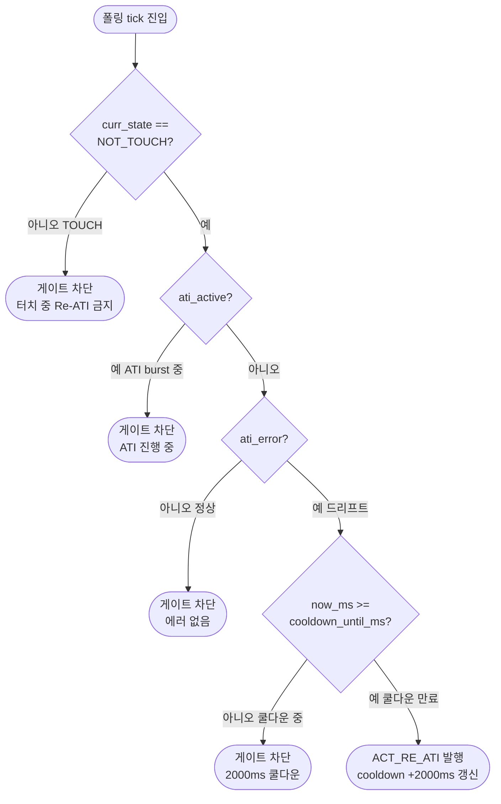
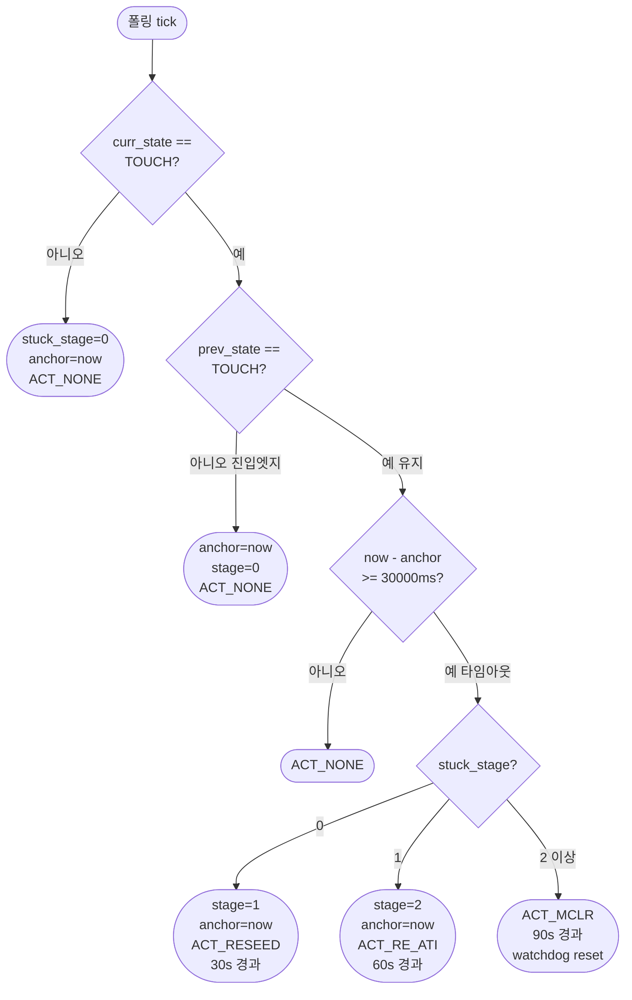

> **TL;DR**: tdc_touch_process / tdc_touch_logic_step 코드에서 추출한 노말 폴링 1 tick 흐름·이벤트표·에러 처리 완전 정리. 코드 기준 [파일:라인] 인용. Re-ATI 게이트 4조건, stuck 3단계(30/60/90s), 부팅무시, read 실패 hold 포함. (180자)

---

## 1. 노말 200ms 폴링 1 tick 전체 흐름

**진입 조건**: `s_init_state == TDC_TOUCH_INIT_READY` AND `(now - s_poll_tick_old) >= 200ms`

```
tdc_touch_process()              [tdc_touch.c:112]
  │
  ├─ [1] 폴링 게이팅              [tdc_touch.c:134-139]
  │      (now - s_poll_tick_old) < 200ms → return false
  │
  ├─ [2] IQS323 read             [tdc_touch.c:144]
  │      tdc_touch_iqs323_read_status(&st)
  │      → in.read_ok / in.pressed / in.ati_error / in.ati_active 채움
  │      → read 실패 시 pressed/ati_error/ati_active 전부 false 보장
  │
  ├─ [3] logic_step() 호출       [tdc_touch.c:152]
  │      tdc_touch_logic_step(&s_logic, &in, &out)
  │      (순수 FSM, 아래 §2~§5 상세)
  │
  ├─ [4] 로그                    [tdc_touch.c:155-179]
  │      out.state_changed → "[TOUCH] STATE: X -> Y"
  │      out.boot_event    → RELEASED / WARN_5S / IGNORING 분기
  │
  ├─ [5] 액션 실행                [tdc_touch.c:182-209]
  │      ACT_RE_ATI  → tdc_touch_iqs323_re_ati()
  │      ACT_RESEED  → tdc_touch_iqs323_reseed()
  │      ACT_MCLR    → delay_ms(20) + SYS_WATCHDOG_RESET()
  │      ACT_HOLD    → 무동작
  │      ACT_NONE    → 무동작
  │
  └─ [6] 롱터치 반환              [tdc_touch.c:211-216]
         out.long_touch == true → return true (절전 트리거)
         그 외 → return false
```

---

## 2. tdc_touch_logic_step 내부 실행 순서

`tdc_touch_logic_step` [tdc_touch_logic.c:83] 내부 6단계:

| 단계 | 위치 | 내용 |
|---|---|---|
| A | logic.c:95-111 | read 실패 hold / NOT_TOUCH 강제 |
| B | logic.c:113-114 | curr_state 확정, state_changed 계산 |
| C | logic.c:116-137 | 부팅 무시 구간 처리 (게이트/stuck/롱터치 차단) |
| D | logic.c:139-146 | Re-ATI 게이트 (노터치 전용, 4조건) |
| E | logic.c:148-155 | stuck 3단계 에스컬레이션 |
| F | logic.c:157-175 | 롱터치 엣지 (절전 트리거) |

---

## 3. 이벤트·상태 천이표

> **상태값**: RESET / NOT_TOUCH / TOUCH / CALIBRATION_ERROR (공개 enum, tdc_touch.h)
> FSM 실제 전이는 NOT_TOUCH ↔ TOUCH만 반복. RESET은 init 완료 전만. CALIBRATION_ERROR는 코드 미확인(enum 정의만 존재, logic_step 내 천이 없음).

| 이벤트 ID | 트리거 조건 | 이전 상태 | 이후 상태 | 출력 액션 | 코드 위치 |
|---|---|---|---|---|---|
| E1 | init READY + read 성공 + not pressed | RESET | NOT_TOUCH | ACT_NONE | logic.c:110, touch.c:87-89 |
| E2 | init READY + read 성공 + pressed | RESET | TOUCH (+ boot_ignore 진입 가능) | boot_ignore 설정 | touch.c:94-98 |
| E3 | NOT_TOUCH → pressed | NOT_TOUCH | TOUCH | ACT_NONE | logic.c:110 |
| E4 | TOUCH + pressed 지속 | TOUCH | TOUCH (유지) | ACT_NONE | logic.c:110 |
| E5 | TOUCH + pressed 해제 | TOUCH | NOT_TOUCH | ACT_NONE | logic.c:110 |
| E6 | TOUCH + 2400ms 경과 + !long_latched | TOUCH | TOUCH (유지) | out.long_touch=true (절전 트리거) | logic.c:166-169 |
| E7 | NOT_TOUCH + ati_error + !ati_active + 쿨다운 경과 | NOT_TOUCH | NOT_TOUCH | ACT_RE_ATI | logic.c:140-146 |
| E8 | read 실패 ≤ 10회 (hold) | 임의 | 임의 (동결) | ACT_HOLD | logic.c:98-103 |
| E9 | read 실패 > 10회 (hold 초과) | 임의 | NOT_TOUCH (강제) | ACT_NONE | logic.c:105 |
| E10 | boot_ignore 중 + not pressed + read_ok | 임의 | 임의 | boot_event=RELEASED | logic.c:119-123 |
| E11 | boot_ignore 중 + 5000ms 경과 + !warned | TOUCH (boot) | TOUCH (boot) | boot_event=WARN_5S + LED | logic.c:124-130 |

---

## 4. Re-ATI 게이트 4조건

**발행 조건 (AND 4개 전부)** [tdc_touch_logic.c:140-142]:

1. `curr_state == NOT_TOUCH` — 터치 중 발행 절대 금지 (급소)
2. `!in->ati_active` — ATI burst 진행 중 아님
3. `in->ati_error == true` — ATI Error 비트 검출 (드리프트 신호)
4. `in->now_ms >= st->re_ati_cooldown_until_ms` — 쿨다운 2000ms 경과

**발행 후**: `re_ati_cooldown_until_ms = now_ms + 2000ms` 갱신 [logic.c:145]

**급소 — 터치 중 Re-ATI 보류**: 조건 1이 이를 보장. 터치 중 ATI Error가 세팅되어도 NOT_TOUCH가 될 때까지 게이트가 막힌다. [logic.c:140]

---

## 5. stuck 3단계 에스컬레이션

**진입 조건**: `TDC_TOUCH_STUCK_TIMEOUT_MS > 0` (= 30000ms) [tdc_touch_time.h:22]

**TOUCH 진입 엣지**: `stuck_anchor_ms = now_ms`, `stuck_stage = 0` 으로 리셋 [logic.c:28-31]

**비TOUCH 상태**: `stuck_stage = 0`, anchor 리셋 → 즉시 초기화 [logic.c:21-26]

| stuck_stage | 경과 시간 | 발행 액션 | 코드 위치 |
|---|---|---|---|
| 0 → 1 | 30초 (1회차) | ACT_RESEED | logic.c:40-43 |
| 1 → 2 | 60초 (2회차) | ACT_RE_ATI (게이트 우회) | logic.c:44-47 |
| 2 → MCLR | 90초 (3회차) | ACT_MCLR → watchdog reset | logic.c:48-51 |

**단계 재카운트**: 각 단계 발행 직후 `stuck_anchor_ms = now_ms` 갱신 [logic.c:35] → 다음 30초 카운트 재시작.

**연결층 MCLR 실행**: ACT_MCLR → `delay_ms(20); SYS_WATCHDOG_RESET();` [tdc_touch.c:199-200]

---

## 6. 에러 상태 처리 상세

### 6-1. read 실패 (0xEEEE 글리치 등)

| 조건 | 처리 | 코드 |
|---|---|---|
| `!read_ok` + `read_fail_cnt <= 10` | ACT_HOLD 반환, prev_state 미갱신 (동결) | logic.c:98-103 |
| `!read_ok` + `read_fail_cnt > 10` | NOT_TOUCH 강제, 상태 천이 허용 | logic.c:105 |
| `read_ok` 복귀 | `read_fail_cnt = 0` 즉시 리셋 | logic.c:109 |

**hold 구간**: 10회 × 200ms = 2000ms [tdc_touch_time.h:31]

### 6-2. ATI Error 비트

- read 성공 시 `st.ati_error` 추출 → `in.ati_error` 로 FSM 주입 [touch.c:147-148]
- FSM: NOT_TOUCH 상태에서만 게이트 통과 → Re-ATI 발행 [§4 참조]
- TOUCH 상태: ati_error 무시 (게이트 조건 1에서 차단) [logic.c:140]

### 6-3. ATI Active (burst 진행 중)

- `in.ati_active == true` → Re-ATI 게이트 조건 2 불충족 → 발행 보류 [logic.c:141]
- ATI Active 해제 후 ati_error 여전히 세팅 + 쿨다운 경과 시 → 다음 tick에 자동 발행

### 6-4. 쿨다운 구간

- Re-ATI 발행 후 2000ms 동안 추가 발행 차단 [tdc_touch_time.h:25, logic.c:145]
- stuck 발행한 ACT_RE_ATI는 게이트 우회(stuck_eval 직접 반환) — 쿨다운 갱신 없음 [logic.c:148-155]

### 6-5. 부팅 무시 에러

- READY 후 터치 중이면 `set_boot_ignore()` 진입 [touch.c:94-98]
- 무시 구간 중: 게이트/stuck/롱터치 전부 차단 [logic.c:116-137]
- 해제 조건: `read_ok && curr_state != TOUCH` (read 실패 시 무시 구간 지속) [logic.c:119]
- 5초 경고: `boot_5s_warned` 래치 1회 → LED + 로그 [logic.c:124-130, touch.c:168-170]

---

## 7. Re-ATI 게이트 flowchart



---

## 8. stuck 3단계 에스컬레이션 flowchart



---

## 9. 시간 상수 요약

| 상수명 | 값 | 의미 | 파일:라인 |
|---|---|---|---|
| POLL_INTERVAL_MS | 200 ms | 폴링 주기 | tdc_touch_time.h:18 |
| LONG_TOUCH_MS | 2400 ms | 롱터치 → 절전 트리거 | tdc_touch_time.h:19 |
| INIT_TIMEOUT_MS | 2500 ms | 부팅 auto-ATI 대기 타임아웃 | tdc_touch_time.h:20 |
| BOOT_WARN_MS | 5000 ms | 부팅 터치 무시 경고 | tdc_touch_time.h:21 |
| STUCK_TIMEOUT_MS | 30000 ms | stuck 단계 간격 | tdc_touch_time.h:22 |
| RE_ATI_COOLDOWN_MS | 2000 ms | Re-ATI 재발행 금지 | tdc_touch_time.h:25 |
| READ_FAIL_HOLD_MS | 2000 ms | read 실패 hold (= 10회 × 200ms) | tdc_touch_time.h:26 |
| READ_FAIL_HOLD_CNT | 10 | hold 카운트 | tdc_touch_time.h:31 |
