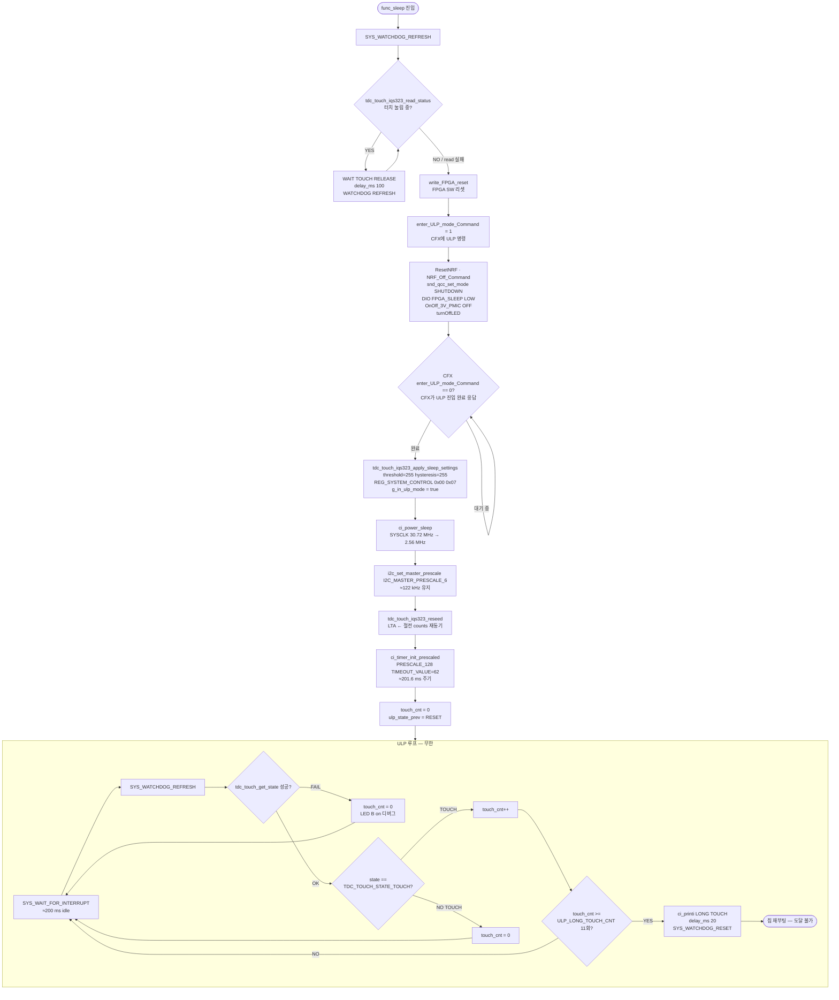

> **TL;DR**: 노말 롱터치(2.4 s) → systemOff → func_sleep 진입 후 터치 해제 대기 → 주변기기 셧다운 → apply_sleep_settings(둔감 + ULP 플래그) → ci_power_sleep(SYSCLK 강하) → reseed → 200 ms ULP 타이머 루프. ULP 중 터치 11회(≈2.2 s) 연속 감지 시 SYS_WATCHDOG_RESET()으로 칩 재부팅. 노말 FSM(게이트·stuck·process)은 ULP 루프에서 완전 비활성.

---

## 1. 노말 → 절전 트리거 경로

노말 롱터치(2.4 s) 조건은 `tdc_touch_logic.c`의 FSM이 판정하고, `tdc_touch.c`의 `tdc_touch_process()`가 `true`를 반환한다. `main.c`의 `func_normal()` 내부에서 이 값을 `powerButtonPushed`로 받아 `systemControl()`에 전달하고, `systemControl()`이 `systemState.systemOff = true`를 설정한다.

이후 `func_normal()` 메인 루프 하단의 가드 블록 [main.c:728~755]에서:
- BLE 매핑·페어링·OTA 활성 시 `systemOff = false`로 보류.
- 비활성 시 `led_force_fade_off()` 후 `break` → `func_normal()` 반환.
- `main()` while(1)에서 즉시 `func_sleep()` 호출 [main.c:311].

---

## 2. func_sleep 상세 흐름



---

## 3. 단계별 코드 근거

### 3-1. 터치 해제 대기 루프

```
[main.c:836~843]
while (tdc_touch_iqs323_read_status(&st) && st.pressed) {
    ci_printv("[TOUCH] SLEEP: WAIT TOUCH RELEASE \r\n");
    SYS_WATCHDOG_REFRESH();
    delay_ms(100);
}
```

`tdc_touch_iqs323_read_status()` [tdc_touch_iqs323.c:313]는 REG_SYSTEM_STATUS(0x10)의 MSB bit1(= 전체 bit9, CH0 Touch)을 읽어 `pressed`에 반영한다. read 실패(I2C 오류 또는 0xEE 글리치) 시 while 조건이 false가 되어 즉시 탈출 — 해제 상태와 동일하게 처리.

### 3-2. 주변기기 셧다운 순서

| 순서 | 동작 | 코드 위치 |
|------|------|-----------|
| 1 | FPGA SW 리셋 (`write_FPGA_reset()`) | main.c:851 |
| 2 | CFX에 ULP 명령 (`enter_ULP_mode_Command = 1`) | main.c:860 |
| 3 | nRF 리셋·비활성화 | main.c:862~863 |
| 4 | QCC 셧다운 | main.c:864 |
| 5 | FPGA SLEEP DIO LOW | main.c:865 |
| 6 | 3.3 V / 1.2 V PMIC OFF | main.c:866 |
| 7 | LED 끄기 | main.c:867 |
| 8 | CFX ULP 완료 대기 (폴링) | main.c:870~877 |

### 3-3. apply_sleep_settings

`tdc_touch_iqs323_apply_sleep_settings()` [tdc_touch_iqs323.c:409~425]:
- `touch_settings(255, 255)` → REG_CH0_TOUCH(0x62) LSB=0xFF MSB=0xFF. 절전 최둔감(오탐 방지).
- `write_register(REG_SYSTEM_CONTROL, 0x00, 0x07)` → 0xC0 LSB=0x00: Power Mode bits[6:4]=000(Normal, ULP 전환 전 IC 자체 PM은 Normal 유지), MSB=0x07 CH timeout disable.
- `tdc_touch_iqs323_set_ulp()` → `g_in_ulp_mode = true` [tdc_touch_iqs323.c:38]. 노말 폴링 게이트가 이 플래그로 차단된다.

> [!NOTE]
> 절전 설정은 **SYSCLK 강하(ci_power_sleep) 전**에 쓴다 [main.c:881]. 주석 "정상속도 I2C로 확실히 기록"이 그 이유.

### 3-4. SYSCLK 전환 및 I2C 재설정

```
[main.c:885~887]
ci_power_sleep();   /* SYSCLK 30.72 MHz → 2.56 MHz, SLOWCLK 유지 */
i2c_set_master_prescale(I2C_MASTER_PRESCALE_6);  /* SCL ≈ 122 kHz 유지 */
```

SYSCLK이 낮아지면 I2C 분주비가 달라지므로 PRESCALE을 재조정. 값 `I2C_MASTER_PRESCALE_6` 의 정확한 수치는 `driver_i2c.h` 참조(코드 내 선언부 별도 확인 필요 — 본 파일에서 직접 추출 미확인, 주석 "122 kHz 유지"로 의미 확인).

### 3-5. RESEED

```
[main.c:889]
tdc_touch_iqs323_reseed();
```

`tdc_touch_iqs323_reseed()` [tdc_touch_iqs323.c:380~383]: REG_SYSTEM_CONTROL(0xC0) LSB=0x58(bit3 RESEED + Power No-ULP 보존), MSB=0x07. LTA가 절전 환경의 counts로 재동기됨으로써 절전 진입 직후 오탐 방지.

### 3-6. ULP 타이머

```
[main.c:891]
ci_timer_init_prescaled(TDC_TOUCH_ULP_TIMER_PRESCALE, TDC_TOUCH_ULP_TIMER_TIMEOUT_VALUE);
```

`TDC_TOUCH_ULP_TIMER_PRESCALE` = `TIMER_PRESCALE_128`, `TDC_TOUCH_ULP_TIMER_TIMEOUT_VALUE` = 62 [tdc_touch_time.h:42~43].

공식: T[ms] = 2^128 × (62+1) / 40_kHz — 주석 "2^7 × 63 / 40 = 201.6 ms" [tdc_touch_time.h:41] (PRESCALE_128 = prescale 지수 7로 해석).

실질 웨이크업 주기 ≈ **201.6 ms** (≈ 200 ms).

### 3-7. ULP 루프 — 터치 감지 및 롱터치 카운트

```
[main.c:904~956]
while (1) {
    SYS_WAIT_FOR_INTERRUPT;     /* ≈200 ms idle */
    SYS_WATCHDOG_REFRESH();
    tdc_touch_state_t state = TDC_TOUCH_STATE_RESET;
    if (tdc_touch_get_state(&state)) {
        if (state == TDC_TOUCH_STATE_TOUCH) {
            touch_cnt++;
            if (touch_cnt >= TDC_TOUCH_ULP_LONG_TOUCH_CNT) {  /* 11회 */
                SYS_WATCHDOG_RESET();   /* 칩 재부팅 */
            }
        } else {
            touch_cnt = 0;   /* 손 뗌 → 카운터 초기화 */
        }
    } else {
        touch_cnt = 0;   /* read 실패 → 카운터 초기화 */
    }
}
```

`TDC_TOUCH_ULP_LONG_TOUCH_CNT` = `TDC_TIME_TO_CNT(2200, 200)` = 11 [tdc_touch_time.h:37~38].

터치가 **연속** 11회(≈2.2 s) 유지되어야 리셋 — 중간에 한 번이라도 NOTOUCH 또는 read 실패 시 `touch_cnt = 0`으로 초기화.

---

## 4. 노말 로직 관여 여부 (절전 경로)

| 노말 모듈 | 절전 경로 관여 여부 | 근거 |
|-----------|-------------------|------|
| `tdc_touch_process()` (폴링 게이트) | **비활성** | `g_in_ulp_mode = true` [tdc_touch_iqs323.c:423] 설정 후 호출 안 됨 — ULP 루프가 `tdc_touch_get_state()`를 직접 호출 |
| `tdc_touch_logic_step()` (FSM: stuck·Re-ATI·게이트) | **비활성** | ULP 루프에서 호출 없음 [main.c:904~956 전 범위] |
| `tdc_touch_iqs323_read_status()` | **직접 호출 없음** | ULP에서는 `tdc_touch_get_state()` 경유 |
| `tdc_touch_get_state()` | **활성** | ULP 루프 내 직접 호출 [main.c:912] — 단순 상태 반환만 |

결론: **절전 ULP 루프는 노말 FSM(게이트·stuck·Re-ATI·process)을 일절 사용하지 않는다.** 터치 raw 상태(`tdc_touch_get_state()`)만 직접 읽어 카운트 비교 후 리셋 판정.

---

## 5. 시간상수 요약

| 항목 | 값 | 근거 |
|------|----|------|
| 노말 롱터치 → 절전 트리거 | 2400 ms | tdc_touch_time.h:19 |
| 절전 진입 후 터치 해제 루프 간격 | 100 ms (delay_ms) | main.c:841 |
| SYSCLK 절전 전환 | 30.72 MHz → 2.56 MHz | main.c:885 주석 |
| ULP 웨이크업 주기 | ≈201.6 ms (설정값 200 ms) | tdc_touch_time.h:34,42~43 |
| ULP 롱터치 임계 | 2200 ms / 11회 연속 | tdc_touch_time.h:35,37~38 |
| 워치독 주기(참고) | 3.28 s 대비 매 웨이크업 refresh | main.c:908 주석 |
