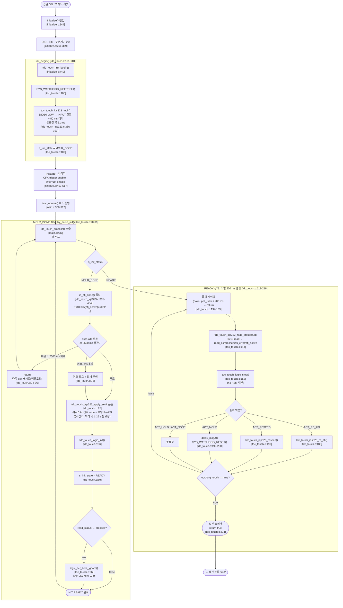
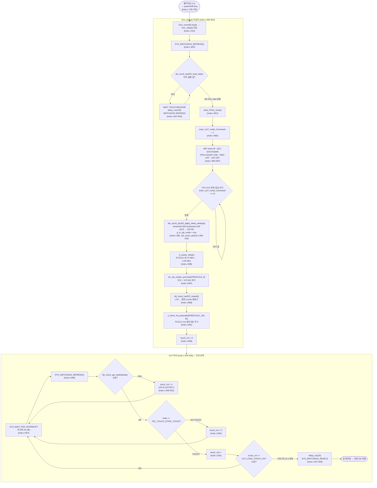
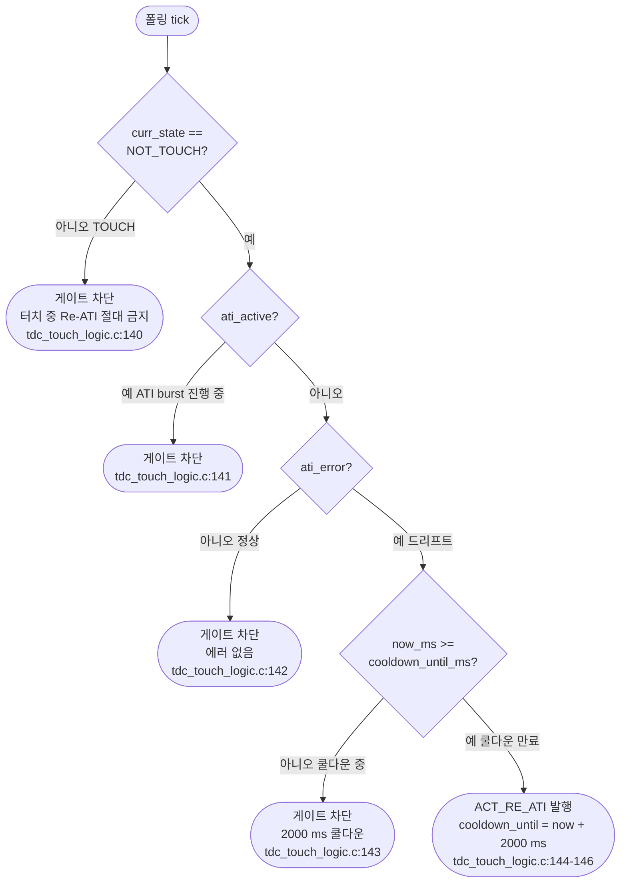
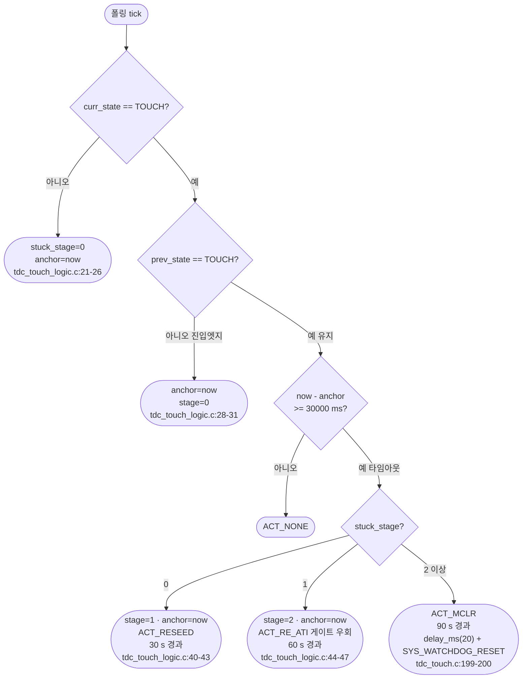

> **TL;DR**: IQS323(Azoteq 정전용량 IC) 전원 ON 후 MCLR 하드리셋(~51 ms) → auto-ATI 비블로킹 폴링(최대 2500 ms) → Full ATI 설정 레지스터 전수 write + 부팅 Re-ATI(~1.25 s 블로킹) → FSM READY 전이. 노말 200 ms 폴링에서 터치·롱터치·Re-ATI 게이트·stuck 3단계(30/60/90 s) 처리. 롱터치(2.4 s) → 절전 진입 → 감도 최둔감 + SYSCLK 강하 → ULP 200 ms 루프에서 롱터치(≈2.2 s/11회 연속) 감지 시 워치독 리셋으로 재부팅. 모든 값·시퀀스는 리팩토링 신규 3파일 소스 코드 인용.

---

## 1. 개요

| 항목 | 내용 |
|------|------|
| 대상 IC | IQS323 (Azoteq, 정전용량 터치·전원 스위치 겸용) |
| I2C 슬레이브 주소 | `0x44` [tdc_touch_iqs323.h:28] |
| I2C 데이터 순서 | little endian, 16-bit word (LSB 먼저) |
| Ground truth 범위 | `tdc_touch_iqs323.c/.h`, `tdc_touch_logic.c/.h`, `tdc_touch.c/.h`, `tdc_touch_time.h`, `tdc_touch_config.h`, `main.c`, `initialize.c` |
| 채널 구성 | CH0(CRX0) 단일채널 self-cap. CH1·CH2 비활성 |
| ATI 전략 | Full ATI — IC가 Compensation·Multiplier 자동 산출 |

구조 3파일: `tdc_touch_iqs323.c`(I2C·레지스터 직접 액세스) · `tdc_touch_logic.c`(순수 FSM) · `tdc_touch.c`(얇은 연결층).

---

## 2. 전체 동작 플로우차트

### 2-1. 부팅 + 노말 폴링 플로우

### 2-2. 절전 진입·ULP 루프 플로우

---

## 3. 이벤트·상태 천이표

> 상태 열거형: `TDC_TOUCH_STATE_RESET` / `TDC_TOUCH_STATE_NOT_TOUCH` / `TDC_TOUCH_STATE_TOUCH` / `TDC_TOUCH_STATE_CALIBRATION_ERROR` [tdc_touch.h].
> 실제 운용 전이는 `NOT_TOUCH` ↔ `TOUCH` 반복. `CALIBRATION_ERROR`는 enum 정의만 존재, logic_step 내 천이 코드 미확인.

| 이벤트 ID | 트리거 조건 | 이전 상태 | 이후 상태 | 출력 액션 / Side-effect | 코드 위치 |
|---|---|---|---|---|---|
| E1 | init READY + read 성공 + not pressed | RESET | NOT_TOUCH | ACT_NONE | tdc_touch_logic.c:110, tdc_touch.c:87~89 |
| E2 | init READY + read 성공 + pressed | RESET | TOUCH + boot_ignore 진입 | boot_ignore 설정 | tdc_touch.c:94~98 |
| E3 | NOT_TOUCH → pressed 감지 | NOT_TOUCH | TOUCH | ACT_NONE | tdc_touch_logic.c:110 |
| E4 | TOUCH + pressed 지속 | TOUCH | TOUCH (유지) | ACT_NONE | tdc_touch_logic.c:110 |
| E5 | TOUCH + pressed 해제 | TOUCH | NOT_TOUCH | ACT_NONE | tdc_touch_logic.c:110 |
| E6 | TOUCH + 2400 ms 경과 + !long_latched | TOUCH | TOUCH (유지) | out.long_touch=true → 절전 트리거 | tdc_touch_logic.c:166~169 |
| E7 | NOT_TOUCH + ati_error + !ati_active + 쿨다운 경과 | NOT_TOUCH | NOT_TOUCH | ACT_RE_ATI (드리프트 자동복구) | tdc_touch_logic.c:140~146 |
| E8 | read 실패 횟수 ≤ 10회 | 임의 | 임의 (동결) | ACT_HOLD (상태 천이 보류) | tdc_touch_logic.c:98~103 |
| E9 | read 실패 횟수 > 10회 | 임의 | NOT_TOUCH (강제) | ACT_NONE | tdc_touch_logic.c:105 |
| E10 | boot_ignore 구간 + not pressed + read_ok | TOUCH(boot) | TOUCH(boot) | boot_event=RELEASED → 무시 구간 해제 | tdc_touch_logic.c:119~123 |
| E11 | boot_ignore 구간 + 5000 ms 경과 + 미경고 | TOUCH(boot) | TOUCH(boot) | boot_event=WARN_5S + LED | tdc_touch_logic.c:124~130 |
| S1 | TOUCH 진입 후 30 s 경과 (stuck 1단계) | TOUCH | TOUCH | ACT_RESEED | tdc_touch_logic.c:40~43 |
| S2 | TOUCH 진입 후 60 s 경과 (stuck 2단계) | TOUCH | TOUCH | ACT_RE_ATI (게이트 우회) | tdc_touch_logic.c:44~47 |
| S3 | TOUCH 진입 후 90 s 경과 (stuck 3단계) | TOUCH | — | ACT_MCLR → watchdog reset → 재부팅 | tdc_touch_logic.c:48~51 |

### 3-1. Re-ATI 게이트 4조건 (AND 전부 충족 시만 발행)

### 3-2. stuck 3단계 에스컬레이션

---

## 4. 레지스터 설정 전수표

### 4-1. 레지스터 주소 정의

| 매크로 | 주소 (hex) | 코드 위치 |
|--------|-----------|-----------|
| REG_SYSTEM_STATUS | 0x10 | tdc_touch_iqs323.c:17 |
| REG_SENSOR0_SETUP | 0x30 | tdc_touch_iqs323.c:18 |
| REG_CONV_FREQ | 0x31 | tdc_touch_iqs323.c:19 |
| REG_SENSOR1_SETUP | 0x40 | tdc_touch_iqs323.c:20 |
| REG_SENSOR0_ATI_SETUP | 0x36 | tdc_touch_iqs323.c:21 |
| REG_SENSOR2_SETUP | 0x50 | tdc_touch_iqs323.c:22 |
| REG_CH0_TOUCH | 0x62 | tdc_touch_iqs323.c:23 |
| REG_BETA_COUNTS | 0xB0 | tdc_touch_iqs323.c:24 |
| REG_BETA_LTA_NORMAL | 0xB1 | tdc_touch_iqs323.c:25 |
| REG_BETA_LTA_FAST | 0xB2 | tdc_touch_iqs323.c:26 |
| REG_FAST_FILTER_BAND | 0xB4 | tdc_touch_iqs323.c:27 |
| REG_SYSTEM_CONTROL | 0xC0 | tdc_touch_iqs323.c:28 |
| REG_LP_REPORT_RATE | 0xC2 | tdc_touch_iqs323.c:29 |
| REG_PM_TIMEOUT | 0xC5 | tdc_touch_iqs323.c:30 |
| REG_EVENTS_ENABLE | 0xD3 | tdc_touch_iqs323.c:31 |

### 4-2. 노말 설정 — apply_settings() 순서 [tdc_touch_iqs323.c:334~372]

| # | 단계 | 주소 | 레지스터명 | LSB (hex) | MSB (hex) | 16-bit 값 | 비트 의미 | 데이터시트 근거 | 코드 [파일:라인] |
|---|------|------|-----------|-----------|-----------|-----------|----------|----------------|----------------|
| 1 | ack_reset | 0xC0 | System Control | 0x01 | 0x00 | 0x0001 | bit0=1 ACK Reset. bits[6:4]=000 Normal Power | DS A.30: bit0=ACK Reset | tdc_touch_iqs323.c:215 |
| 2 | confirm_reset (READ) | 0x10 | System Status | — | — | READ | bit7=Reset Event, bit5=ATI Active, bit6=ATI Error 폴링. bit7==0 → reset 완료 확인. 최대 10회 재시도 | DS A.2 | tdc_touch_iqs323.c:224 |
| 3 | sensor_setup CH2 disable | 0x50 | Sensor 2 Setup | 0x00 | 0x00 | 0x0000 | bit0(Enable Channel)=0 → CH2 비활성 | DS A.5: bit0=Enable Channel | tdc_touch_iqs323.c:246 |
| 4 | sensor_setup CH1 disable | 0x40 | Sensor 1 Setup | 0x00 | 0x00 | 0x0000 | bit0(Enable Channel)=0 → CH1 비활성 | DS A.5 동일 | tdc_touch_iqs323.c:251 |
| 5 | sensor_setup CH0 enable | 0x30 | Sensor 0 Setup | 0x01 | 0x01 | 0x0101 | LSB bit0=1 Enable Channel, MSB bit0=CTx0 활성 → CH0 단일채널 self-cap | DS A.5: bit0=Enable Channel(1), bit8=CTx0(1) | tdc_touch_iqs323.c:255 |
| 6 | touch_settings | 0x62 | CH0 Touch Settings | 0x10 (16) | 0x08 (8) | 0x0810 | LSB[7:0]=Threshold=16, MSB=Hysteresis=8 → 절대 임계=(16×LTA)/256=LTA×6.25%. 계수<32 필수(FullATI SNR 하한) | DS A.17: TOUCH_THRESHOLD LSB[7:0], TOUCH_HYSTERESIS MSB[15:12] ⚠ 비트 매핑 §6 참조 | tdc_touch_iqs323.c:264, tdc_touch_iqs323.h:46~50 |
| 7 | events_enable | 0xD3 | Events Enable | 0x52 | 0x00 | 0x0052 | bit6=ATI Error enable, bit4=ATI Event enable, bit1=Touch Event enable | DS A.32/A.33 | tdc_touch_iqs323.c:270 |
| 8 | beta_power — Counts Beta | 0xB0 | Counts Filter Betas | 0x02 | 0x02 | 0x0202 | LSB=NP_COUNTS_FILTER=2, MSB=LP_COUNTS_FILTER=2 | DS A.26: LSB=NP, MSB=LP | tdc_touch_iqs323.c:279 |
| 9 | beta_power — LTA Normal | 0xB1 | LTA Filter Betas | 0x08 | 0x08 | 0x0808 | LSB=NP_LTA=8, MSB=LP_LTA=8 → 느린 LTA 추적 [실측 게이트] | DS A.27 | tdc_touch_iqs323.c:280 |
| 10 | beta_power — LTA Fast | 0xB2 | LTA Fast Filter Betas | 0x02 | 0x02 | 0x0202 | LSB=NP_LTA_FAST=2, MSB=LP_LTA_FAST=2 → 빠른 LTA 복귀 | DS A.28 | tdc_touch_iqs323.c:281 |
| 11 | beta_power — Fast Filter Band | 0xB4 | Fast Filter Band | 0x0A | 0x00 | 0x000A | 16-bit = 10 cnt. 카운트 변화 ≥10이면 Fast LTA 전환 | DS §9: 16-bit value | tdc_touch_iqs323.c:282 |
| 12 | beta_power — Conv Freq | 0x31 | Conversion Frequency Setup | 0x7F | 0x05 | 0x057F | Period=5(MSB[14:8]) → 1.00 MHz, Fraction=127(0x7F, 고정) → self-cap 상한 준수 | DS A.6: Period=5→1.00 MHz(Table A.1) | tdc_touch_iqs323.c:283 |
| 13 | beta_power — Power Mode | 0xC0 | System Control | 0x50 | 0x07 | 0x0750 | LSB bits[6:4]=101=Automatic No ULP(NP↔LP 자동 전환, ULP 없음), MSB bits[10:8]=0x07 CH0~CH2 Timeout Disable(SW 타이머 대체) | DS A.30: bits[6:4]=101=Auto No ULP, bits[10:8]=CH Timeout Disable | tdc_touch_iqs323.c:285 |
| 14 | beta_power — LP Report Rate | 0xC2 | Low Power Mode Report Rate | 0x64 | 0x00 | 0x0064 | 16-bit(ms)=100 ms → LP 모드 리포트 주기 | DS §9: 16-bit(ms), 범위 0~3000 | tdc_touch_iqs323.c:286 |
| 15 | beta_power — PM Timeout | 0xC5 | Power Mode Timeout | 0x88 | 0x13 | 0x1388 | 16-bit(ms)=5000 ms → NP→LP 전환 유휴 시간 | DS §9: 16-bit(ms), 범위 0~65000 | tdc_touch_iqs323.c:287 |
| 16 | ATI Setup | 0x36 | Sensor 0 ATI Setup | 0x0C | 0x04 | 0x040C | bits[2:0]=100=Full ATI Mode(IC가 Compensation·Multiplier 자동 산출), bit3=1 Large Band(허용폭 1/8×TARGET), bits[15:4]=64=Resolution Factor → TARGET=BASE×4=400 | DS A.12: Mode=100=Full. 기본값과 동일 | tdc_touch_iqs323.c:349 |
| 17 | 부팅 Re-ATI (블로킹) | 0xC0 | System Control | 0x54 | 0x07 | 0x0754 | bit2=1 Re-ATI 트리거 + bits[6:4]=101 No ULP + bits[10:8]=0x07 CH timeout disable (Power 설정 보존 동시 write) | DS A.30: bit2=Re-ATI | tdc_touch_iqs323.c:359 |
| 18 | RESEED | 0xC0 | System Control | 0x58 | 0x07 | 0x0758 | bit3=1 RESEED + No ULP + CH timeout disable 보존 | DS A.30: bit3=Reseed | tdc_touch_iqs323.c:365 |

> [!NOTE]
> 부팅 Re-ATI 직후 `wait_ati_done_blocking()` [tdc_touch_iqs323.c:293~308]: 최대 25회 × 50×DEFAULT_DELAY 대기 ≈ **1.25 s 블로킹**. 미완료 시 경고 로그만 출력하고 진행 차단 없음.

### 4-3. 노말 운용 — re_ati / reseed (논블로킹 단독 호출)

| # | 함수 | 주소 | LSB | MSB | 16-bit 값 | 의미 | 코드 [파일:라인] |
|---|------|------|-----|-----|-----------|------|----------------|
| A | tdc_touch_iqs323_re_ati | 0xC0 | 0x54 | 0x07 | 0x0754 | Re-ATI 트리거(논블로킹). No ULP + CH timeout disable 보존 | tdc_touch_iqs323.c:377 |
| B | tdc_touch_iqs323_reseed | 0xC0 | 0x58 | 0x07 | 0x0758 | RESEED 트리거(논블로킹). No ULP + CH timeout disable 보존 | tdc_touch_iqs323.c:383 |

### 4-4. 절전 설정 — apply_sleep_settings() [tdc_touch_iqs323.c:409~425]

| # | 단계 | 주소 | 레지스터명 | LSB | MSB | 16-bit 값 | 비트 의미 | 데이터시트 근거 | 코드 [파일:라인] |
|---|------|------|-----------|-----|-----|-----------|----------|----------------|----------------|
| S1 | touch_settings 최둔감 | 0x62 | CH0 Touch Settings | 0xFF (255) | 0xFF (255) | 0xFFFF | Threshold=255 → (255×LTA)/256≈LTA (실질 무감). 오탐 방지 | DS A.17 | tdc_touch_iqs323.c:413 |
| S2 | SLEEP CH timeout disable | 0xC0 | System Control | 0x00 | 0x07 | 0x0700 | MSB bits[10:8]=0x07 CH timeout disable. LSB=0x00 Power Mode=000(Normal — IC 자체 PM은 Normal 유지) | DS A.30 | tdc_touch_iqs323.c:418 |

> [!NOTE]
> 절전 설정 write는 **SYSCLK 강하(ci_power_sleep) 전**에 실행 [main.c:881]. 정상속도 I2C로 확실히 기록하기 위함.
> 절전 후 RESEED 추가 호출: `tdc_touch_iqs323_reseed()` [main.c:889] — LTA를 절전 환경 counts로 재동기.

### 4-5. 상태 Read — tdc_touch_iqs323_read_status() [tdc_touch_iqs323.c:319~331]

| 주소 | 레지스터명 | 방향 | 추출 비트 | 의미 | 코드 [파일:라인] |
|------|-----------|------|----------|------|----------------|
| 0x10 | System Status | READ | LSB bit5=ati_active, LSB bit6=ati_error, MSB bit1=pressed(CH0 Touch=전체 bit9) | 터치·ATI 상태 4-tuple 추출. 0xEEEE 글리치 필터: LSB==0xEE이면 실패 처리 | tdc_touch_iqs323.c:319~331 |

### 4-6. 전체 레지스터 오름차순 요약

| 주소 | 레지스터명 | 방향 | 노말 설정값 | 절전 설정값 | 데이터시트 참조 |
|------|-----------|------|------------|------------|----------------|
| 0x10 | System Status | READ | — (read only) | — | DS A.2 |
| 0x30 | Sensor 0 Setup | WRITE | 0x0101 (CH0+CTx0 enable) | 변경 없음 | DS A.5 |
| 0x31 | Conv Freq Setup | WRITE | 0x057F (1 MHz, Fraction=127 고정) | 변경 없음 | DS A.6 |
| 0x36 | Sensor 0 ATI Setup | WRITE | 0x040C (Full Mode, Factor=64, Large Band) | 변경 없음 | DS A.12 |
| 0x40 | Sensor 1 Setup | WRITE | 0x0000 (CH1 disable) | 변경 없음 | DS A.5 |
| 0x50 | Sensor 2 Setup | WRITE | 0x0000 (CH2 disable) | 변경 없음 | DS A.5 |
| 0x62 | CH0 Touch Settings | WRITE | 0x0810 (Threshold=16, Hysteresis=8) | **0xFFFF** (Threshold=255, Hysteresis=255, 최둔감) | DS A.17 |
| 0xB0 | Counts Filter Betas | WRITE | 0x0202 (NP=2, LP=2) | 변경 없음 | DS A.26 |
| 0xB1 | LTA Filter Betas | WRITE | 0x0808 (NP=8, LP=8, 느림) [실측 게이트] | 변경 없음 | DS A.27 |
| 0xB2 | LTA Fast Filter Betas | WRITE | 0x0202 (NP=2, LP=2, 빠름) | 변경 없음 | DS A.28 |
| 0xB4 | Fast Filter Band | WRITE | 0x000A (10 cnt) | 변경 없음 | DS §9 |
| 0xC0 | System Control | WRITE | 0x0750 (Auto No ULP, CH timeout disable) / Re-ATI=0x0754 / RESEED=0x0758 | **0x0700** (Power=Normal, CH timeout disable, 트리거 없음) | DS A.30 |
| 0xC2 | LP Mode Report Rate | WRITE | 0x0064 (100 ms) | 변경 없음 | DS §9 |
| 0xC5 | Power Mode Timeout | WRITE | 0x1388 (5000 ms) | 변경 없음 | DS §9 |
| 0xD3 | Events Enable | WRITE | 0x0052 (ATI Error+ATI Event+Touch Event) | 변경 없음 | DS A.32/A.33 |

### 4-7. 미write 레지스터 (IC 기본값 사용)

| 주소 | 레지스터명 | IC 기본값 | 비고 |
|------|-----------|----------|------|
| 0x32 / 0x42 / 0x52 | Prox Control | 0x1290 (Self-cap, 80 pF Cs, 4095 Max, 7 µA Bias) | write 없음, 기본값 그대로 |
| 0x33 / 0x43 / 0x53 | Prox Input and Control | 0x01CF (CRx0, Dead Time enable, 32 cycles) | write 없음 |
| 0x34 / 0x44 / 0x54 | Pattern Definitions | 0x030A (VSS inactive) | write 없음 |
| 0x37 | ATI Base | 0x0064 (= 100) | write 없음 — Full ATI에서 TARGET=100×4=400 |
| 0x38 | ATI Multipliers/Dividers | — | Full ATI에서 IC 자동 산출, write 불필요 |
| 0x39 | Compensation | — | Full ATI에서 IC 자동 산출 |
| 0xC1 | Normal Power Report Rate | 0x0000 | write 없음 |
| 0xC3 | Ultra Low Power Report Rate | 0x0000 | write 없음 (ULP 모드 미사용) |

---

## 5. 핵심 타이밍 상수

| 항목 | 값 | 단위 | 의미 | 파일:라인 |
|------|----|------|------|-----------|
| MCLR_HOLD_MS | 1 | 단위 | MCLR 로우 유지 시간 (DEFAULT_DELAY 단위) | tdc_touch_iqs323.h:34 |
| BOOT_WAIT_MS | 50 | ms | MCLR 해제 후 POR + auto-ATI 시작 대기 | tdc_touch_iqs323.h:35 |
| MCLR 총 블로킹 | ~51 | ms | hold + boot_wait 합산 (DEFAULT_DELAY 환경 의존) | 02_부팅플로우.md §3 |
| INIT_TIMEOUT_MS | 2500 | ms | auto-ATI 비블로킹 폴링 타임아웃 (경과 > 2500 ms일 때 강제 진행) | tdc_touch_time.h:20 |
| 부팅 Re-ATI 블로킹 상한 | ~1250 | ms | 25회 × 50단위 wait_ati_done_blocking | tdc_touch_iqs323.c:293~308 |
| MAX_WAIT_OPEN_MS | 45 | ms | force_window_open 타임아웃 | tdc_touch_iqs323.h:32 |
| MAX_WAIT_CLOSE_MS | 20 | ms | force_window_close 타임아웃 | tdc_touch_iqs323.h:33 |
| POLL_INTERVAL_MS | 200 | ms | 노말 폴링 주기 | tdc_touch_time.h:18 |
| LONG_TOUCH_MS | 2400 | ms | 롱터치 판정 → 절전 트리거 | tdc_touch_time.h:19 |
| BOOT_WARN_MS | 5000 | ms | 부팅 터치 무시 경고 | tdc_touch_time.h:21 |
| STUCK_TIMEOUT_MS | 30000 | ms | stuck 단계 간격 (30/60/90 s) | tdc_touch_time.h:22 |
| RE_ATI_COOLDOWN_MS | 2000 | ms | Re-ATI 재발행 금지 쿨다운 | tdc_touch_time.h:25 |
| READ_FAIL_HOLD_MS | 2000 | ms | read 실패 hold 총 시간 (10회 × 200 ms) | tdc_touch_time.h:26 |
| READ_FAIL_HOLD_CNT | 10 | 회 | hold 카운트 상한 | tdc_touch_time.h:31 |
| 절전 터치 해제 확인 간격 | 100 | ms | func_sleep 진입부 delay_ms | main.c:841 |
| SYSCLK 노말 | 30.72 | MHz | 노말 동작 클럭 | main.c:885 주석 |
| SYSCLK 절전 | 2.56 | MHz | ci_power_sleep 후 | main.c:885 주석 |
| I2C SCL 절전 | ~122 | kHz | PRESCALE_6 재조정 후 유지 | main.c:887 주석 |
| ULP 웨이크업 주기 | ~201.6 | ms | PRESCALE_128, TIMEOUT=62 → 2^7×63/40 kHz | tdc_touch_time.h:34,42~43 |
| ULP_LONG_TOUCH_CNT | 11 | 회 | ULP 롱터치 임계 연속 감지 횟수 | tdc_touch_time.h:37~38 |
| ULP 롱터치 시간 | ~2200 | ms | 11회 × 200 ms | tdc_touch_time.h:35 |

---

## 6. 미확정([실측 게이트]) 항목

| 항목 | 현재 코드 기본값 | 불확정 사유 | 코드 근거 |
|------|--------------|------------|-----------|
| LTA Filter Beta NP/LP (0xB1) | 0x0808 (NP=8, LP=8) | "안전 기본값, 시험 판별 후 확정 예정" 주석 — 실제 SNR·드리프트 특성 미측정 | tdc_touch_iqs323.c:280, DS A.27 |
| Beta 해석 방식 | NP/LP 필드값으로 추정 | damping 계산식(Beta/256 vs 비트 시프트) 미확정 | tdc_touch_iqs323.c:275 주석 |
| Hysteresis 비트 매핑 (0x62 MSB) | MSB=0x08로 write | DS A.17: Hysteresis 필드=bits[15:12]=MSB 상위 4비트. MSB=0x08=0b00001000 → bits[15:12]=0000(=0). 코드 의도(Hysteresis=8)와 실제 비트 매핑 불일치 가능성 — **실측 검증 필요** | tdc_touch_iqs323.c:264, tdc_touch_iqs323.h:46~50 |
| ATI Base (0x37) | IC 기본값 0x0064(100), write 없음 | Full ATI에서 IC 내부 TARGET=Base×Factor=100×4=400 — 직접 확인 미수행 | tdc_touch_iqs323.c 전체(write 호출 없음) |
| I2C_MASTER_PRESCALE_6 수치 | "≈122 kHz" 주석 | driver_i2c.h 정의 미확인 — 실제 SCL 주파수 실측 보류 | main.c:886 주석 |
| DEFAULT_DELAY_MS 정확값 | SystemCoreClock / 1000 | SYSCLK에 따라 달라지므로 정확한 ms 환산은 빌드 환경 의존 | tdc_touch_iqs323.h:36 |

---

> [!NOTE]
> **Hysteresis 비트 매핑 불일치 주의**: `0x62` MSB=0x08 write 시 DS A.17 기준 실제 TOUCH_HYSTERESIS 필드(bits[15:12])에 기록되는 값은 0이 될 수 있음. Threshold=16 단독 적용 상태일 가능성 있음. 오동작 증상(채터링·바운스)이 없다면 IC 내부 기본 Hysteresis 적용 중일 수 있음 — 실측 검증 후 §4 레지스터표 값 확정 권고.
