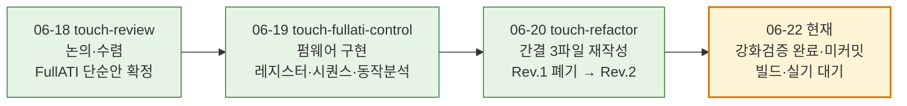
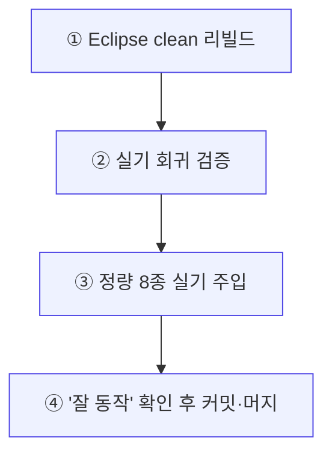

# 터치 FullATI 작업 종합 정리

**TL;DR**: 터치센서(IQS323) 제어를 **FullATI 타임아웃 단순안**으로 수렴(06-18)→펌웨어 구현(06-19)→**간결 3파일 구조로 전면 재작성**(06-20)까지 끝낸 상태. 핵심 = "공장 캘리·FIXED·CalCap·방전 다 버리고, Full ATI 자동캘리 + ATI 에러 능동 폴링 Re-ATI + SW 30초 타임아웃 + 사람 개입". 코드는 2848줄(2파일)→1148줄(3파일+헤더), HAL/driver 추상 0, net −1409줄. 강화검증으로 기본 빌드 결함 0(치명 3건 수정 완료, 진단변종 댕글링 C1 봉합 포함). **현재 전부 미커밋** — 다음은 ① Eclipse 빌드 → ② 실기 회귀 → ③ 정량 8종 주입 → ④ "잘 동작" 확인 후 커밋·머지.

---

## 1. 한눈에 보기

| 폴더 | 날짜 | 한 일 | 산출 |
|---|---|---|---|
| [20260618_touch-review](../20260618_touch-review/) | 06-18 | 누적 분석 9건 + 외부 앱노트 → 제어 방향 **수렴** | `브레인스토밍_FullATI타임아웃단순안.md` (정본) — **이미 커밋·머지(52e7831)** |
| [20260619_touch-fullati-control](../20260619_touch-fullati-control/) | 06-19 | FullATI를 펌웨어로 **구현** + 동작분석 | `99_종합_설계수렴.md`·`동작분석/B99_동작분석종합.md` — 미커밋 |
| [20260620_touch-refactor](../20260620_touch-refactor/) | 06-20 | **간결 3파일로 전면 재작성** + 강화검증 | `Rev2-간결/99_종합_간결구조.md`·`인수인계.md` — 미커밋 |

---

## 2. 무엇을 논의했나 (06-18 수렴)

### 2.1 출발점 — 누적된 문제의식
그동안 터치센서가 **먹통/드리프트**를 일으키는 원인을 9건의 분석으로 추적했고, 만장일치 결론은 **"Reseed 시점 baseline 오염 + FIXED ATI 게인 고착"** 이었습니다. 직전 v3 안은 이를 **공장 캘리브레이션(보드별 노터치 절대 기준 저장)** 으로 풀려 했는데, 은수님이 "보드별 절대값 측정·저장·관리 부담이 과하다"고 문제를 제기하셨습니다.

### 2.2 검토된 대안과 폐기 사유
| 대안 | 판정 | 사유 |
|---|---|---|
| FIXED MULT/COMP (보드별 게인 고정) | **폐기** | 게인 고착이 드리프트·카운트 변동의 원인. 자동캘리(Full ATI)로 전환 |
| 공장 캘리브레이션 (v3) | **폐기** | 보드별 절대 기준 저장·관리 부담 과다, 실측 의존 높음 |
| CalCap 더미(CRX1)·CRX0 주기 방전 | **폐기** | 정지(먹통) 이슈의 원천. 단일채널화로 소멸 |
| IC Channel Timeout (하드웨어 타임아웃) | **폐기** | ① 동작이 Reseed(Re-ATI 아님) ② ULP 모드와 공존 불가 ③ 발생 인지 비트 없음 → **SW 타임아웃이 우월** |
| **FullATI 타임아웃 단순안** (은수님 제시) | **채택** ✅ | 절대 기준 없이 자동캘리 + 사람 개입으로 stuck 사후 복구 |

### 2.3 수렴안 "FullATI 타임아웃 단순안"의 5대 골자
1. **Full ATI 전환** — IC가 게인을 자율 산출 + 밴드 이탈 시 자동 Re-ATI (FIXED/공장캘리 폐기)
2. **ATI 에러 능동 폴링 → Re-ATI** (게임체인저) — 펌웨어가 ATI Error 비트를 폴링해 즉시 Re-ATI, IC 자동 타임아웃(수십 초) 지연을 메인루프 주기로 축소
3. **SW 타임아웃 30초** — IC Channel Timeout 대신 펌웨어가 터치 지속을 카운트(ULP 유지·관측 가능)
4. **드리프트는 Re-ATI가 자동 커버** — 온도 드리프트(AZD125 §8.2.4, −18cnt/°C)도 자동 흡수
5. **Fixed/공장캘리/CalCap 폐기**

### 2.4 핵심 급소 (이때 식별)
- **터치 중 Re-ATI 경계** — Full ATI가 정상 손 터치를 노터치로 학습해버릴 위험. → "ATI 에러일 때만 + 터치 중 보류" 게이트가 단순안의 진짜 생명줄.
- **MCLR 포화 안전망** — counts 포화(큰 물체)는 타임아웃·재시도로 못 풀어 재부팅만이 유일 복구.
- 외부 레퍼런스(AZD004·AZD125·User Guide·예제코드) 통합으로 온도 드리프트 정량·Beta·임계 근거 보강.

---

## 3. 무엇을 했나 (06-19 FullATI 구현)

### 3.1 Full ATI 전환의 본질 (레지스터 4곳)
| 주소 | 항목 | 현재 | FullATI | 비고 |
|---|---|---|---|---|
| 0x36 | ATI Setup | `0x0408` (Disabled) | **`0x040C`** (Full, LSB 0x08→0x0C 1비트) | 핵심 |
| 0x38·0x39 | MULT·COMP | FIXED write | **write 폐기** | IC 자동 산출 |
| 0x62 | Touch Threshold | 계수 100 | **계수 16** | §3.3 단위오류 정정 |

### 3.2 구현된 제어 동작 8종
| # | 제어 | 동작 |
|---|---|---|
| 1 | 부팅 시퀀스 | MCLR(약 51ms)→auto-ATI 폴링(최대 2500ms)→ACK→setup→Full ATI write→부팅 Re-ATI 1회→READY→터치 재확인 |
| 2 | 노말 폴링 | 200ms 주기 상태 매핑 + read 실패 N회(10) hold 후 NOT_TOUCH 강제 |
| 3 | **Re-ATI 게이트 (급소)** | `노터치 AND ati_active==0 AND ati_error AND 쿨다운(2초/10tick) 경과` 일 때만 발행, 터치 중 보류 |
| 4 | stuck 3단계 | 터치 지속 30/60/90초 → `reseed_only` → `re_ati_trigger` → `MCLR 재부팅` (각 30초 재카운트) |
| 5 | 롱터치 | 2400ms 엣지 래치 1회 → 절전 트리거 |
| 6 | Beta/Power write | 0xB0~B4 Beta(비대칭) · 0xC0/C2/C5 Power(Automatic No ULP) · 0x31=0x057F(1MHz) |
| 7 | 단일채널 | CRX0 단독 (CRX1 더미·CRX0 방전 폐기) |
| 8 | 절전 | ULP 2.2초(11카운트) 연속 터치 → 칩 리셋. 게이트·stuck 미관여 |

### 3.3 검증으로 잡은 정정 (구현 중)
- **[09 단위오류]** Touch Threshold 레지스터값은 raw count가 아니라 `계수 × LTA / 256` **비율계수**. 올바른 부등식은 **계수 < 32**(LTA≈Target). Base 상향만으론 안 풀리고 **계수 하향이 본질** → 100 → **16** 으로.
- **[10 신규회귀 5건]** 부팅 Re-ATI 부재·reseed 감도 동반·절전 감도 이중 write·read 실패 hold-last·auto-ATI 3상태 미구분 → 선행 수정 필수. **원자적 3쌍**(Full 전환↔임계 하향 등)·**신규 API 2종**(`reseed_only`·`re_ati_trigger` 공개화).
- 동작분석(B99) 결과 **빌드 차단 정합 불일치 0건**, 폴링 200ms·롱터치 2400ms가 코드 정본(설계서 "100ms·3초" 표기는 정정).

---

## 4. 어떻게 했나 (06-20 간결 리팩토링)

### 4.1 Rev.1 폐기 → Rev.2 (은수님 정정)
1차에 **3레이어(포트 추상·vtable·mock·어댑터)** 로 설계했다가, 은수님이 **"의료기기 SW 밸리데이션 대비 작고 간결하게, HAL/driver 추상 탈피"** 로 정정 → Rev.1 폐기·git 되돌림 → **Rev.2 간결 3파일**로 전면 재작성.

### 4.2 최종 구조 (3파일 + 헤더 2)
| 파일 | 줄수 | 역할 | 핵심 |
|---|---|---|---|
| `tdc_touch_logic.c/.h` | 178+90 | **순수 제어 FSM** | HW include 0·전역 0 → **호스트 유닛테스트 대상**(mock 0) |
| `tdc_touch_iqs323.c/.h` | 425+96 | **I2C 직접** (추상 0) | 구 `tdc_drv_iqs323`(1291줄) 흡수·슬림화. 공개 6동작 |
| `tdc_touch.c/.h` | 230+58 | **얇은 연결** | init 상태머신·폴링 게이팅·read 정규화·logic_step·액션 switch. **공개 API 4종 불변** |
| `tdc_touch_time.h` | 50 | 시간상수 자동 파생 | ms만 바꾸면 카운트 자동(`TDC_TIME_TO_CNT`) |
| `tdc_touch_config.h` | 21 | 빌드 토글 | 현재 토글만 (수치는 time.h로 이관) |

- 순수 FSM이 `tdc_touch_iqs323.h`·`hw.h`를 **include하지 않음 = 컴파일러가 순수성을 강제**. 추상의 전부는 연결층 `switch(out.action)` 한 덩어리.
- **net −1409줄** (2420 삭제·1011 추가). 추상(포트·vtable·mock·어댑터) **0**.

### 4.3 폐기 완료 (FullATI라 불필요 — 코드 잔존 0)
보드 변종(`TDC_BOARD_VARIANT`) · FIXED MULT/COMP · CalCap 더미(CRX1) · CRX0 방전 · dev 모드(SLEEP_MEASURE·RTT_TUNING·ATI_CALIB·ATI_DUMP) · read_touch_margin · prox_settings · CRX1 변형 — **전부 삭제**. 삭제 파일 `tdc_drv_iqs323.c/.h`.

---

## 5. 지금 상태 (검증 결과 · 미커밋)

### 5.1 강화검증 결과 (정적, 빌드 전)
6노드(B1~B6) + 코드 직접 재검증으로:
- **기본 운용 빌드**(`SLEEP_MEASURE_MODE=0`): 컴파일/링크 차단 치명 **0**, 할루시네이션 치명 **0**, 계획 부합 **PASS**, 회귀 **0**.
- **할루시네이션 0**: 제어 6대(E1~E10·S1~S3)·레지스터 15주소·System Status 4비트·Power Mode 보존(0x54/0x58/0x50) 전부 코드 1:1 대조.

> [!IMPORTANT]
> **검증 verdict 흐름 (정확히)**: 강화검증의 원래 verdict는 **FAIL** 이었습니다 — 진단변종 빌드(`SLEEP_MEASURE_MODE=1`) 활성 시 정의 삭제된 2심볼(`consume_sleep_request`·`sleep_measure_dump`)이 댕글링하는 **치명 C1** 때문. **기본 운용 빌드는 결함 0**이고, 이 C1을 봉합한 것이 아래 "치명 3건 수정"의 ③입니다. 즉 **현재는 C1 봉합 후 PASS 상태**.

### 5.2 수정한 치명 3건
1. **Power Mode 0xC0 덮음** → re_ati 0x54·reseed 0x58 (데이터시트 A.30 확정)
2. **ui_command 삭제 헤더** 참조 제거
3. **SLEEP_MEASURE/RTT_TUNING dev 죽은 블록** 정리 (= 강화검증 치명 C1 봉합)

### 5.3 미커밋 현황 (이어가기 기준점)
- **브랜치**: `claude_feature_touch-fullati-control` (claude_develop 분기 후 커밋 0 = 미커밋만 얹힌 상태)
- **소스**: M 5 (`main.c`·`tdc_touch.c/.h`·`tdc_touch_config.h`·`tdc_ui_command.c`) · D 2 (`tdc_drv_iqs323.c/.h`) · 신규 5 (`tdc_touch_iqs323.c/.h`·`tdc_touch_logic.c/.h`·`tdc_touch_time.h`)
- **docs**: `20260619_touch-fullati-control/`·`20260620_touch-refactor/`·`작업 목록.md`(M)
- **빌드·실기 미수행 사유**: 직전 WSL 환경에 gcc/make 없음 → Eclipse/JLink(데스크톱) 필요

---

## 6. 이제 뭘 해야 하나 (데스크톱 체크리스트)

1. **Eclipse clean 리빌드 1회** — 신규 .c 3개 소스트리 재인덱싱. `Debug/subdir.mk` 스테일(삭제된 `tdc_drv_iqs323.c` 등재·신규 .c 미등재)은 clean 리빌드 시 자동 해소. 빌드 전 권고: `tdc_touch.c`에 `#include <ci_util.h>` 1줄(`delay_ms` 암시적 선언, `-Werror` 도입 대비).
2. **실기 회귀 검증** — 부팅 ATI 수렴 · 노말 200ms 폴링 · Re-ATI 게이트(드리프트) · stuck 3단계 · 절전 ULP · 롱터치 2400ms (B99 §3 이벤트 13종 기준).
3. **정량 8종 실기 1회 주입** (현재는 `[실측 게이트]` 주석 + 안전 기본값만 들어있음 — 실측으로 확정):
   - Touch 계수(현 16) · Beta 0xB0~B4 정수 해석(A/B 택1) · Power 0xC0/C2/C5 · t_ati(부팅 wait·노말 폴링 횟수)
   - 그 외 실측 게이트: 계수↔raw LTA 환산 · Hysteresis 비트폭 · ESD 복구 실효 · 단일채널 전류 · 온도 cnt/°C 등 (총 14항목, 전부 상수 1곳 주입이라 구조 영향 0)
4. **"잘 동작" 확인 후 커밋·머지**: `claude_feature_touch-fullati-control` → `claude_develop`(`--no-ff`) → push. Git identity `김은수 <eunsu.kim@to-doc.com>`, AI 트레일러 금지.
   - **커밋 단위 제안**: ① 소스 리팩토링(터치 3파일 + main/ui 정리) ② `작업 목록.md` 갱신 ③ docs(20260619·20260620 tasks). 또는 일괄 1커밋.

> [!NOTE]
> **요구사항 재확인 1건**: 절전 SW 30초 타임아웃은 현 구조상 ULP 롱터치 2.2초 리셋이 먼저 발동해 **실효 범위가 좁습니다**(설계 #13). 절전 stuck 처리를 2.2초 리셋에 맡길지 여부만 한 번 확인하면 됩니다.

---

## 7. 관련 폴더·정본 링크

- 논의·수렴: [20260618_touch-review/브레인스토밍_FullATI타임아웃단순안.md](../20260618_touch-review/브레인스토밍_FullATI타임아웃단순안.md)
- 구현 설계: [20260619_touch-fullati-control/에이전트-로그/99_종합_설계수렴.md](../20260619_touch-fullati-control/에이전트-로그/99_종합_설계수렴.md)
- 동작 분석: [20260619_touch-fullati-control/에이전트-로그/동작분석/B99_동작분석종합.md](../20260619_touch-fullati-control/에이전트-로그/동작분석/B99_동작분석종합.md)
- 간결 구조: [20260620_touch-refactor/에이전트-로그/Rev2-간결/99_종합_간결구조.md](../20260620_touch-refactor/에이전트-로그/Rev2-간결/99_종합_간결구조.md)
- 강화 검증: [20260620_touch-refactor/에이전트-로그/Rev2-검증강화/B99_강화검증종합.md](../20260620_touch-refactor/에이전트-로그/Rev2-검증강화/B99_강화검증종합.md)
- 인수인계: [20260620_touch-refactor/인수인계.md](../20260620_touch-refactor/인수인계.md)
