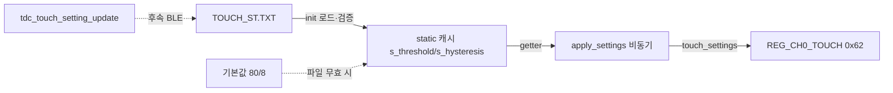

# 계획 — 터치 임계·히스테리시스 파일 영속화

**TL;DR**: 신규 `tdc_touch_setting.c/.h`(FS 계층)가 touch threshold/hysteresis를 `{magic+version+size+payload+magic_end+crc16}` 구조체로 파일에 저장/로드한다. `Initialize()`에서 로드해 런타임 캐시에 넣고, `tdc_touch_iqs323`의 `#define` 상수를 getter 참조로 전환해 `apply_settings()`가 파일값을 쓰게 한다. BLE 쓰기 트리거·절전 오버라이드는 범위 밖.

## 설계 결정 (은수님 승인 반영)

- 네이밍: `tdc_touch_setting` (tdc_ 원칙).
- 무결성: `magic_begin + version + size + payload + magic_end + crc16` (version·size·crc 모두).
- 절전 진입 threshold=255 오버라이드(main.c:850): **이번 범위 밖**, 그대로 둠.

## 산출물 (신규 2 + 수정 2)

| 파일 | 조치 | 내용 |
|---|---|---|
| `Gen1_5/FS/tdc_touch_setting.h` | 신규 | 구조체·매직·버전·기본값·범위 매크로 + 공개 API 선언 |
| `Gen1_5/FS/tdc_touch_setting.c` | 신규 | init(로드)·update(저장)·getter, crc16 검증, fallback |
| `Cortex-M3-src/systemControl/tdc_touch_iqs323.c` | 수정 | `apply_settings()`가 매크로 대신 getter 참조 |
| `Cortex-M3-src/systemControl/initialize.c` | 수정 | `tdc_touch_setting_init()` 로드 호출 삽입 |

## 세부 설계

### 단계_1: `tdc_touch_setting.h`

```c
#define TDC_TOUCH_SETTING_FILE_NAME    "TOUCH_ST.TXT"   /* 8.3, 사용자 드라이브 "1:" */
#define TDC_TOUCH_SETTING_MAGIC_BEGIN  0x54534342u      /* 'TSCB' 등 고유값 */
#define TDC_TOUCH_SETTING_MAGIC_END    0x54534345u      /* 'TSCE' 등 고유값 */
#define TDC_TOUCH_SETTING_VERSION      1u

/* 기본값 = 기존 하드웨어 상수 재사용(안전마진 일치) */
#define TDC_TOUCH_SETTING_THRESHOLD_DEFAULT   80u   /* = TDC_TOUCH_IQS323_THRESHOLD */
#define TDC_TOUCH_SETTING_HYSTERESIS_DEFAULT  8u    /* = TDC_TOUCH_IQS323_HYSTERESIS */
#define TDC_TOUCH_SETTING_THRESHOLD_MIN   0u
#define TDC_TOUCH_SETTING_THRESHOLD_MAX   255u
#define TDC_TOUCH_SETTING_HYSTERESIS_MIN  0u
#define TDC_TOUCH_SETTING_HYSTERESIS_MAX  15u        /* 4비트 필드 */

typedef struct
{
    uint32_t magic_begin;   /* 프레이밍 시작 */
    uint16_t version;       /* 스키마 버전 */
    uint16_t size;          /* sizeof(TDC_TOUCH_SETTING_T) 저장 = 20 */
    /* ---- payload ---- */
    uint8_t  threshold;     /* 0~255 */
    uint8_t  hysteresis;    /* 0~15  */
    uint8_t  reserved[2];   /* 확장 여유·정렬 */
    /* ---- */
    uint32_t magic_end;     /* 프레이밍 끝 */
    uint16_t crc16;         /* magic_begin~magic_end(18B) CRC16-CCITT */
    uint16_t pad;           /* 4바이트 정렬(총 20B) */
} TDC_TOUCH_SETTING_T;

int     tdc_touch_setting_init(void);                                  /* 부팅 로드 */
int     tdc_touch_setting_update(uint8_t threshold, uint8_t hysteresis); /* 파일 저장(BLE는 후속) */
uint8_t tdc_touch_setting_get_threshold(void);                         /* 캐시 getter */
uint8_t tdc_touch_setting_get_hysteresis(void);
```

- 레이아웃은 4바이트 정렬로 컴파일러 패딩 없이 20B 고정. `size` 필드에 `sizeof` 저장 → 읽기 시 현재 sizeof와 비교.
- crc16은 기존 `ci_crc`의 CCITT(`ci_crc_ccitt_calc`, 조사에서 존재 확인)를 재사용, 계산 범위 magic_begin~magic_end.

### 단계_2: `tdc_touch_setting.c` (ci_stim_mute 패턴 + 개선)

- **모듈 static 캐시**: `static uint8_t s_threshold, s_hysteresis;` (getter가 반환). ci_stim_mute의 공유메모리 대신 로컬 캐시 + getter (터치 도메인은 CFX 공유 불필요).
- `tdc_touch_setting_init()`:
  1. `f_open(FA_OPEN_ALWAYS|FA_READ|FA_WRITE)` + 4KB 확보 트릭 + `f_read`.
  2. 검증(하나라도 실패 → 무효): magic_begin/end 일치, `version==현재`, `size==sizeof`, crc16 재계산 일치, threshold/hysteresis 범위.
  3. 무효 시: 구조체를 기본값(80/8)으로 리셋 + crc 재계산 + `f_lseek(0)`·`f_write`·`f_sync`로 재기록(파일 실체화).
  4. **성공/실패/재기록 모든 경로에서 `s_threshold`/`s_hysteresis`를 확정값(로드값 또는 기본값)으로 세팅** — ci_stim_mute의 gap(open 실패 시 값 미정의) 보완. `f_open`조차 실패해도 캐시는 기본값으로.
  5. watchdog refresh 삽입, 실패 로그 `ci_printe`, 반환 0/-1.
- `tdc_touch_setting_update(thr, hys)`:
  1. 범위 검증(벗어나면 RET_FALSE, 쓰기 안 함).
  2. **현재 캐시와 동일하면 쓰기 skip**(NVM 마모 가드).
  3. 구조체 채우고 crc 계산 → `f_open(FA_OPEN_APPEND|...)`·`f_lseek(0)`·`f_write`·`f_sync`·`f_close`.
  4. 성공 시 캐시 갱신, 반환 0/-1.
  - 본 작업에선 **함수만 제공**(BLE 트리거는 후속 general debug option에서 호출).
- include: `ci_filesystem.h`(FatFs·g_ci_filesystem_ohdl), `ci_crc.h`, `ci_printf.h`, `hw.h`, 자체 헤더.

### 단계_3: `tdc_touch_iqs323.c` 매크로 → getter 전환

- `apply_settings()` 내 `touch_settings(TDC_TOUCH_IQS323_THRESHOLD, TDC_TOUCH_IQS323_HYSTERESIS)` (416행)를
  `touch_settings(tdc_touch_setting_get_threshold(), tdc_touch_setting_get_hysteresis())` 로 변경.
- `#define TDC_TOUCH_IQS323_THRESHOLD/HYSTERESIS`는 **기본값 상수로 잔존**(tdc_touch_setting 기본값 매크로가 이를 참조하거나 값 동기). `tdc_touch_iqs323.h`에 `#include "tdc_touch_setting.h"` 또는 getter 선언 가시화.
- 절전 경로 `main.c:850 public_touch_settings(255, 8)`은 **미변경**(범위 밖).

### 단계_4: `initialize.c` 로드 삽입

- 후보 B: `tdc_touch_init_begin()`(448행) **직전**에 `tdc_touch_setting_init();` + `ci_printi("[INFO] INIT : TOUCH SETTING\r\n");`.
- 근거: FS는 315행 이후 가용, 값은 apply_settings(비동기)가 나중에 참조하므로 init_begin 전 어디든 안전. B가 "설정 로드 → 터치 init" 의도를 코드로 명확히.

## 데이터 흐름 (요약)



## 검증 계획 (단계_4, 서브에이전트 fan-out + adversarial)

1. **회귀**: 파일 없음(첫 부팅) → 기본값 80/8 로드 → 기존 동작과 완전 동일(현행 하드코딩과 바이트 일치)한지.
2. **컴파일 정합**: 신규 파일 include·getter 선언·crc API·구조체 정렬(20B)·의존(tdc_touch_iqs323→tdc_touch_setting) 순환 없는지.
3. **무결성 로직**: magic/version/size/crc/범위 검증 분기, fallback 재기록, gap 보완(모든 실패경로 캐시 세팅) 정확성 — adversarial 노드로 "손상 파일에 값이 새는 경로" 추적.
4. **삽입 타이밍**: 로드가 apply_settings보다 먼저 실행 보장(Initialize 순서).

전수 PASS까지 루프(상한 3회). 빌드·실기 RTT는 은수님 환경.

## 리스크·완화

- **RISK**: 매크로→getter 전환으로 부팅 시 캐시 미초기화 상태서 apply_settings 호출 → 완화: init에서 어떤 경로든 캐시 기본값 보장(단계_2.4). getter는 항상 유효값 반환.
- **RISK**: 구조체 패딩으로 sizeof≠20 → 완화: 명시적 reserved/pad + 정적 assert(가능 시) + size 필드 자기검증.
- **RISK**: crc API 시그니처 불일치 → 완화: 검증2에서 ci_crc 실제 원형 확인.
- **RISK**: 절전 오버라이드(255)와 파일값 혼선 → 범위 밖 명시, 후속 별도 작업.

## 범위 밖 (후속)

- BLE general debug handle option으로 `tdc_touch_setting_update()` 호출(무선 쓰기).
- 절전 진입 threshold=255 오버라이드 재설계 + 주석 불일치 정리.
- version 마이그레이션 훅(현재는 version 불일치 시 기본값 리셋).

## Git

- 브랜치: `claude_feature_general_debug_protocol` 연속 또는 신규 `claude_feature_touch_setting_persist`(은수님 지정).
