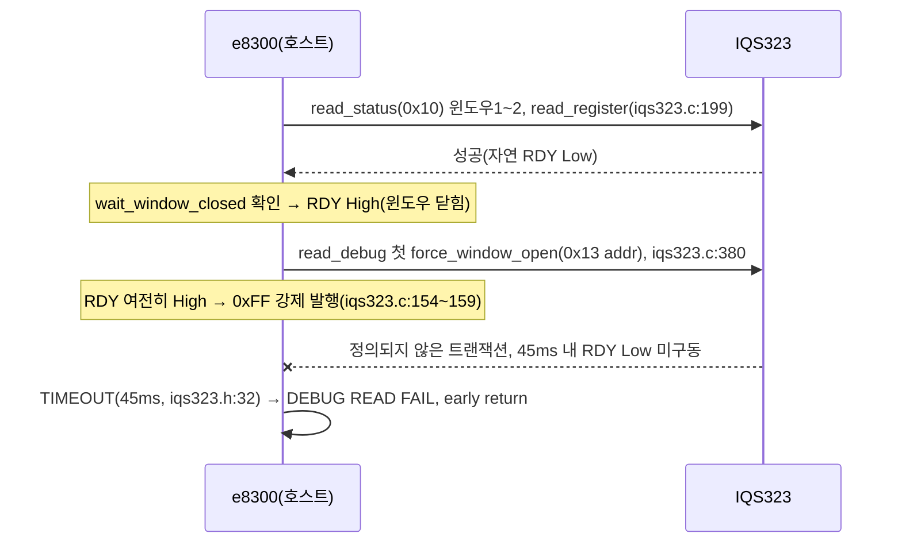

# 02 · P1 — 관측 탈침습 (read_debug, 구현-레디 스펙)

**TL;DR**: `fake_func_sleep()`(main.c:917)은 래퍼 `tdc_touch_sleep_log_debug`를 거치지 않고 `read_debug`를 직접 인라인 호출한다(확립) — 래퍼만 고치면 확정 재현경로가 빠진다. 39/40 판정의 combined_read(안 A)를 L1에 신설, 3개 호출부 전부 교체 필요. 안 B는 fake_func_sleep의 유일한 BLE 텔레메트리 공급원을 훼손해 진단용 폴백만 권고. 우선순위: 안 A.

---

## 0. 우선순위 결론 (요약)

| 기준 | 안 A (combined_read) | 안 B1 (계측 완전 비활성) | 안 B2 (S4-1 SPI조건부 skip) |
|---|---|---|---|
| 근본 원인(latch) 제거 | **완전 제거**[문서:40_판정§6] | 완전 제거(호출 자체 0건) | **미제거**(빈도만 감소)[문서:40_판정§6] |
| 텔레메트리 보존 | 보존 | **상실**(값 고정) | SPI 유휴 구간만 보존 |
| fake_func_sleep 반영 | 인라인 블록 직접 교체 필요(§3.2) | 매크로 1곳 | 변수 1개 + 조건 1개(main.c) |
| 변경 범위 | 3파일 호출부 + 신규 함수 1 | tdc_touch_config.h 1줄 | main.c 국소 |
| 회귀 리스크 | 중(호출부 구조 변경, §5) | 낮음 | 낮음 |

**권고**: 안 A를 1순위로 구현하고, 안 B1은 P0 실측 프로토콜의 **H2(read_debug 자체-애그레서) 이분법 진단 스위치**로 병행 보유한다(안 A 검증 지연 시 임시 폴백 겸용, §6). 안 B2(S4-1)는 이미 별도 목적(SPI/I2C 동시발생 저감)의 레버로 존재하며 본 latch 버그의 대체재가 아니다.

---

## 1. 확립 — fake_func_sleep 경로의 실제 호출 형태

| 경로 | read_status 호출 | read_debug 호출 | 경유 |
|---|---|---|---|
| 노말(`tdc_touch_process`) | tdc_touch.c:305 | tdc_touch.c:316 | 직접(래퍼 없음) |
| func_sleep(진짜 절전) | main.c:1233 | main.c:1042(내부) | `tdc_touch_sleep_log_debug()`(main.c:1037~1058) 경유, 호출부 main.c:1236 |
| **fake_func_sleep(확정 재현경로)** | main.c:909 | **main.c:917** | **직접 인라인**(래퍼 미경유) |

**확립(grep 전수 확인)**: `tdc_touch_sleep_log_debug`는 main.c 전체에서 **1236행 1곳**(func_sleep 내부)에서만 호출된다. fake_func_sleep(810~1031행)은 자체 `#if (TDC_TOUCH_DEBUG_PRINT_ENABLE)` 블록(912~943행)에서 `tdc_touch_iqs323_read_debug(&dbg)`를 **직접** 호출한다 — 2026-07-02 리팩토링이 func_sleep만 5개 static 헬퍼로 분리하고 fake_func_sleep은 제외한 결과(C2 §11 기존 발견과 일치). **래퍼 함수만 수정하는 접근은 확정 재현경로를 놓친다** — 본 스펙 최우선 반영 포인트.

**부수 확립**: fake_func_sleep 디버그 블록(934~940행)은 `tdc_touch_debug_set_recent_*` 세터(tdc_touch.h:42~54)를 호출해 `tdc_remote_general_debug.c:77~83`의 BLE 응답 getter가 소비하는 값을 채운다. func_sleep 래퍼(1037~1058행)는 세터를 **호출하지 않고 print만** 한다. 즉 **fake_func_sleep의 read_debug만이 BLE로 나가는 실시간 LTA/Counts 텔레메트리의 유일 공급원**이다(NRF가 살아있어 BLE가 서비스되는 절전류 경로가 fake_func_sleep뿐이므로) — 안 B가 텔레메트리를 희생시키는 대가를 정량화한다.

**범위 경계(확립)**: `tdc_touch_iqs323_read_status()`에는 read_debug과 무관한 호출부 3곳이 더 있다 — `is_ati_done()`(iqs323.c:487, 내부용) · `tdc_touch.c:173`(boot 판정) · `tdc_touch.c:427`. 이 3곳은 debug read와 짝을 이루지 않으므로 **combined_read 마이그레이션 대상이 아니다**(read_status/read_debug 원 함수는 폐기하지 않고 유지).

---

## 2. Root Cause [문서 근거, 39/40 판정 maturity:stable]



`read_status`(read_register 경유, iqs323.c:199~230) 완료 직후 RDY High 상태에서 read_debug의 첫 `force_window_open()`(iqs323.c:145~175)이 진입 → 0xFF 발행(§8.13 Force Comm 아닌 정의되지 않은 트랜잭션) → IC 무응답 → 45ms(`TDC_TOUCH_IQS323_MAX_WAIT_OPEN_MS`, iqs323.h:32) TIMEOUT → early return(iqs323.c:382,389). 다음 폴링도 read_status는 IC 자연 주기로 성공하지만 read_debug는 동일 조건을 반복 → **영구 latch**(40_판정 §3). read_status 자체는 실패 로그 0건으로 안전(양쪽 모두 확립).

---

## 3. 안 A — combined_read 구조 통합 (권고, 40_판정 §6~7 계승)

### 3.1 신규 함수 — `tdc_touch_iqs323.c`(read_debug 뒤, 398행 이후)에 추가 + `.h`(102행 부근)에 선언 추가

```c
bool tdc_touch_iqs323_read_combined(tdc_touch_iqs323_status_t *out_status, tdc_touch_iqs323_debug_t *out_debug);
```

**시퀀스**(40_판정 §7, 4윈도우 — 0x11/0x12 gap으로 6바이트 단순 연속read 불가 판정 계승[문서 근거 계승, 1차 재검증 아님]):
1. 윈도우1~2: `read_register(REG_SYSTEM_STATUS, &lsb, &msb)`(static, 같은 파일 내 재사용 — iqs323.c:199) → 오늘의 `read_status` 바디(iqs323.c:347~367)와 **바이트 단위 동일**하게 이식(0xEE 글리치·bit5/6/8/9 파싱 그대로). 실패 시 `out_status->ok=false`, **즉시 return false**(오늘의 호출부 `if(ok){read_debug...}` 게이트를 함수 내부로 흡수).
2. 윈도우3~4: `force_window_open()+i2c_write(REG_CH0_COUNTS,1)` → `wait_window_closed` → `force_window_open()+i2c_read(buf,4)` → `wait_window_closed` — 오늘의 `read_debug` 바디(iqs323.c:380~396) 그대로 이식.
3. 디버그 실패는 여전히 비치명(`out_debug->ok=false`만, 함수는 true 반환) — INV-X-3 유지.

**Before→After 값**: 레지스터 write 0건, read 대상(0x10/0x13/0x14)·`MAX_WAIT_OPEN_MS`=45·`MAX_WAIT_CLOSE_MS`=20 전부 불변. 변경은 **호출 경계 통합**뿐.

### 3.2 호출부 교체 — 3파일 전부 필수

| 파일:라인(현재) | 현재 | 교체 후 |
|---|---|---|
| tdc_touch.c:305 + 316 | `read_status(&st)` 후 `#if` 블록 내 `read_debug(&dbg)` | `tdc_touch_iqs323_read_combined(&st,&dbg)` 1회, `in.read_ok=st.ok` |
| main.c:1233 + 1236 | `read_status(&st)` 후 `tdc_touch_sleep_log_debug(ok,&st,state)`(내부 1042행 read_debug) | `read_combined(&st,&dbg)` 1회 + 래퍼를 **print 전용**으로 축소(dbg 인자로 전달받아 read 제거) |
| **main.c:909 + 912~943** | `read_status(&st)` 후 인라인 블록 내 `read_debug(&dbg)`(917행) | `read_combined(&st,&dbg)` 1회, printd(922)·세터(934~940)는 dbg 그대로 재사용(무변경) |

**fake_func_sleep 반영 확정**: 3번째 행이 확정 재현경로 수정 지점 — 909행 read_status 호출 삭제 + 917행 read_debug 호출을 read_combined 결과 재사용으로 치환(최소 diff, 나머지 918~943행 포맷/세터 로직 무변경).

---

## 4. 안 B — 프로파일링 중 스로틀/비활성 (보조)

**B1(계측 완전 비활성, 40_판정 옵션 "라")**: `tdc_touch_config.h:21~22`의 `#define TDC_TOUCH_DEBUG_PRINT_ENABLE 1`을 진단/프로파일링 빌드에서 `0`으로 오버라이드(`-DTDC_TOUCH_DEBUG_PRINT_ENABLE=0`). 효과: tdc_touch.c:311·main.c:912·main.c:1035 3개 `#if` 블록 전부 컴파일 제외 → read_debug 호출 0건, latch 완전 제거. 대가: `tdc_touch_debug_get_recent_*`가 마지막 값에 고정 → fake_func_sleep 프로파일링의 BLE 텔레메트리 자체가 정지(§1 부수 확립) — 프로파일링 목적과 정면 상충.

**B2(SPI 유휴 조건부 skip, 06_S4 §3 S4-1 그대로 계승)**: fake_func_sleep의 `bleCommunication(dummy_isd)` 호출(main.c:899) **직전**에 `EN__SPI_COMMU_STATE spi_before = get_spi_commu_state();` 추가 → 912~943행 블록 전체를 `if (spi_before == SPI_COMM_IDLE) { ... }`로 감싼다. 효과: 그 100ms 버킷에 SPI가 활성이었던 틱만 read_debug 스킵. 40_판정 §5 "(나) 계측 저빈도" 판정("미제거 — 호출 시 동일 조건 발생")이 그대로 적용 — **latch 자체는 제거 안 되고 발생 빈도만 감소**. S4의 원 목적(SPI/I2C 동시발생 저감)엔 부합하나 본 버그 수정의 대체재는 아니다.

---

## 5. C2 불변식별 회귀 체크 (안 A 기준)

| 불변식 | 영향 | 근거 |
|---|---|---|
| INV-①~③,⑤,⑥,⑧ | 무손상 | combined_read는 0xC0 write·FSM 게이트 로직 0건 접촉 |
| INV-④(터치 판정) | 무손상 — **바이트 단위 이식 검증 필수** | 상태 파싱(bit5/6/8/9, 0xEE 글리치)을 원문 그대로 복사해야 함(iqs323.c:362~365) — 재작성 금지, 이식만 |
| INV-⑦-1(L1 공유) | **본 레버 핵심 적용 대상** — 노말+func_sleep+fake_func_sleep 3곳 동시 영향, 3곳 전부 회귀 확인 필요 | §3.2 |
| INV-⑦-2(45/20ms 상수) | 무손상 | 값 불변, 재사용만 |
| INV-⑦-3(폴링 주기 비공유) | 무손상 | 호출 빈도(100ms) 변경 없음, 윈도우 내부 구조만 통합 |
| INV-X-3(디버그 계측 무해) | 무손상 | combined_read도 디버그 실패 시 `ok=false`만, FSM 미입력 유지 |

---

## 6. 리스크 · 실측 게이트

- **[미확인, 실측 게이트]** combined_read가 "호출 경계 통합"만으로 실제 RDY 타이밍을 바꾸는 정확한 메커니즘: 오늘의 read_status→read_debug 연속 호출과 combined_read 내부 4윈도우는 GPIO/I2C 트랜잭션 순서·개수가 **동일**하다(C 함수 호출 오버헤드는 45ms 스케일 대비 무시 가능). 이 재구성이 왜 위상 관계를 바꾸는지의 1차 메커니즘은 40_판정 §4도 "코드/데이터시트만으로 확정 불가"로 남겨두었다 — 40_판정의 실기 판별 방법(§7 판별_1~4, FORCE WINDOW OPEN TIMEOUT 0건 확인)이 유일한 확정 수단이며, **fake_func_sleep 컨텍스트에서 별도 재현·재검증 필요**(39/40 원 실측이 정확히 fake_func_sleep인지 func_sleep인지 문서에 명기 없음 — 폴더명 "sleep-ati"만 확인됨).
- **[확립]** `TDC_TOUCH_DEBUG_PRINT_ENABLE` 기본값 1(config.h:22) — 이 버그는 Heisenberg 프로파일링 전용이 아니라 **현재 모든 빌드(양산 포함 가능)에 잠재**하며, 별도 오버라이드 존재 여부는 [미확인](본 조사 범위 밖). 안 A는 이 잠재 결함도 함께 제거해 프로젝트 범위를 넘는 부가 가치가 있다.
- IQS323 0x11/0x12 레지스터 정체(왜 6바이트 단순 auto-increment read가 불가한지)는 40_판정 판단을 계승만 했고 본 스펙에서 데이터시트 원문 재검증은 하지 않았다.
- func_sleep 래퍼(`tdc_touch_sleep_log_debug`) 시그니처 변경은 유일 호출자(main.c:1236) 1곳뿐이라 회귀 범위 작음(grep 재확인 완료).
- 판별 프로토콜(재사용 권고): 40_판정 §7 판별_1~4를 fake_func_sleep 컨텍스트에서 200폴링 이상 RTT 관찰 — TIMEOUT 0건·터치 시 delta/threshold 정합 확인.
