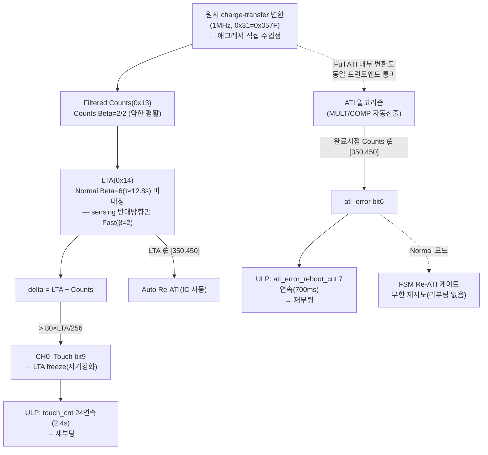

# 01 · C1 — 실패 메커니즘 특성화

**TL;DR**: 절전 ULP 루프(`func_sleep()`)는 두 개의 독립 워치독 리부팅 트리거를 가진다 — ① ati_error 7연속(≈700ms) → 리부팅, ② 게이트 해제 후 touch bit 24연속(2.4s) → 리부팅. 두 경로 모두 `read_status()`의 System Status(0x10) 비트만 사용하며, Normal 모드 FSM엔 ati_error 리부팅 자체가 없어(무한 재시도) **이 취약점은 절전 ULP 코드 경로 고유**다. 지배 애그레서는 미확정이나, 코드 근거상 두 가지 강한 자체-발견 가설이 있다 — (H1) 절전 중 SYSCLK를 30.72MHz로 유지한 채 절전용 I2C 프리스케일(÷6)이 그대로 쓰이면 SCL이 데이터시트 상한(1MHz)의 5배(≈5.12MHz)로 초과될 수 있고, (H2) 계측용 `read_debug()`가 매 폴링 `read_status()` 직후 별도 force_window_open+0xFF를 발행해(기존 39/40 판정에서 이미 진단된 미해결 버그) 그 자체가 CRX0 인접 I2C 버스에 추가 스위칭을 주입한다.

---

## 1. 확정/가설 표기 원칙

- **[확립]**: 현재 소스코드 직접 읽기 또는 데이터시트 원문 인용으로 검증됨.
- **[가설-강]**: 코드+데이터시트로 논리적으로 도출되나 실기 계측 없이는 확정 불가.
- **[가설-불확실]**: 개연성은 있으나 근거가 약하거나 프로파일링 하네스 소스 미확인.
- **[미확인]**: 실측/추가 확인 필요 항목.

---

## 2. 두 증상의 발생 경로 (요청 a)

### 2.1 "ATI 에러 반복" — 절전 ULP `tdc_touch_sleep_handle_ati_error()` [확립]

경로: `main.c` `func_sleep()` ULP 루프(100ms 웨이크, `TDC_TOUCH_ULP_TIMER_PRESCALE/TIMEOUT_VALUE`로 정확히 100.0ms 확인) → 매 tick `tdc_touch_iqs323_read_status()` → `tdc_touch_sleep_handle_ati_error()`(main.c:1062).

```
ati_error(bit6)=1 && ati_active(bit5)=0  → 지속 감지
  cnt<=5: tdc_touch_iqs323_re_ati() 발행(논블로킹) + cnt++   ← "복구 재시도" 로그 반복 = "ATI 에러 반복"
  cnt>5 (7번째 연속 감지, ≈700ms):  SYS_WATCHDOG_RESET() → 칩 리셋 → 재부팅
!ati_error && !ati_active: cnt=0 (정상 복귀 시 리셋)
```

- **트리거 비트**: System Status(0x10) bit6(ati_error) — 데이터시트 §5.11 [확립]: "ATI 알고리즘 완료 후 Counts가 Re-ATI 경계 밖이면 set. 자동 Re-ATI 없음, 마스터가 수동 트리거." 경계 = ATI Target(≈100×64/16=400) ± Band(Large=1/8×400=50) = **[350, 450]** (52_분석_ATI동작.md 인용).
- **반복의 의미**: 7회 연속(700ms) ati_error가 사라지지 않는다는 것은, `re_ati()`가 매번 재실행되어도 **바로 다음 폴링에 또 경계 밖**이라는 뜻 — 즉 방해가 1회성이 아니라 Re-ATI 실행 구간(내부적으로 다회 charge-transfer 변환 수행) 자체를 매번 오염시키는 지속적/반복적 애그레서라는 강한 정황증거.
- **비대칭 발견 [확립]**: Normal 모드 FSM(`tdc_touch_logic.c` L154~161)의 Re-ATI 게이트는 `NOT_TOUCH && !ati_active && ati_error && cooldown경과`시 `re_ati()`만 발행하고 **재부팅 카운터가 전혀 없다** — 쿨다운 2000ms마다 영구 재시도. 즉 **ati_error로 인한 리부팅은 절전 ULP 코드 경로에만 존재하는 취약점**이며 Normal 모드에서는 동일 방해가 발생해도 리부팅되지 않는다(단, false touch 90s 스턱 경로는 별개로 존재, §2.2 하단 참조).
- **경계 부작용 [가설-강]**: 부팅 시 `wait_ati_done_blocking()`(tdc_touch_iqs323.c:328)은 `ati_active==0`만 확인하고 **ati_error 여부를 확인하지 않는다**. 따라서 리부팅→재부팅 후 boot Full ATI도 동일 애그레서에 오염되면, "정상 복귀 없이 재부팅 루프"가 반복될 잠재적 경로가 있다(미확인 — 실기 로그로만 확정 가능).

### 2.2 "터치 오인식 → 노말 재부팅" — 절전 ULP `tdc_touch_sleep_handle_touch_reboot()` [확립, 시간값 재검산 완료]

```
sleep_ignore(진입 게이트, 최초 300ms 연속 NOT_TOUCH 확정 전) 해제 후:
  state==TOUCH 연속: touch_cnt++
    touch_cnt >= TDC_TOUCH_ULP_REBOOT_TOUCH_CNT(=24, 2400ms@100ms wake) → SYS_WATCHDOG_RESET()
  그 외: touch_cnt=0
```

> [!WARNING]
> `tdc_touch_time.h`의 `/* @200 = 2 */` 주석은 **낡은 값**이다. 실제 `TDC_TOUCH_ULP_WAKE_MS=100`(파일 내 명시 + HW 타이머 4000/40=100.0ms로 이중 확인)이므로 `TDC_TIME_TO_CNT(2400,100)=24`, 즉 실제 디바운스는 **2400ms(24회)**이지 주석의 200ms(2회)가 아니다. 계산 재검산 없이 주석만 신뢰하면 12배 틀린 값을 보고하게 된다.

- **트리거 비트**: System Status(0x10) bit9(CH0 Touch, `msb & (1<<1)`) [확립].
- **자기강화 메커니즘 [확립, 데이터시트 인용]**: touch 판정이 한번 서면 §5.5 "LTA is frozen during touch and proximity events"에 의해 LTA가 그 폴링부터 즉시 동결된다. 즉 최초 1개 샘플이 오탐으로 threshold를 넘으면, LTA가 그 자리에 얼어붙어 **다음 폴링도 같은 delta로 touch 유지**를 강제한다 — 방해가 순간적이어도 "터치 지속처럼 보이는" 상태가 자기강화된다.
- **방향 비대칭 [확립, 데이터시트 인용]**: Fast Filter Band(0xB4=10)는 §5.6 "counts가 LTA로부터 **sensing 반대 방향**(터치 방향의 반대)으로 10 이상 벗어날 때만" Fast Beta 적용. self-cap 터치 방향 = counts 감소(delta 증가). 애그레서가 counts를 낮추는 방향(터치를 모사하는 방향)으로 작용하면 **Fast filter가 개입하지 않고 Normal Beta(6, τ≈12.8s)만 적용** → LTA가 방해를 빠르게 흡수하지 못해 delta가 threshold 위에 오래 머무른다. 결과적으로 2.4s 연속 조건을 채우기 유리한 방향으로 편향되어 있다.
- **Normal 모드 대응 경로와의 비교 [확립]**: Normal 모드 FSM의 `stuck_eval()`은 TOUCH 상태가 `TDC_TOUCH_STUCK_TIMEOUT_MS=30000`(30s) 지속 시에만 1단계(RESEED) 시작, 60s에 2단계(Re-ATI), **90s에 3단계(MCLR 재부팅)**. 절전 ULP의 2.4s는 이 사다리의 첫 단계(30s)보다도 12.5배 짧다. 즉 **동일 크기의 방해라도 절전 프로파일링 중엔 Normal 모드라면 흡수됐을 지속시간(2.4s~90s 구간)에서 이미 재부팅된다** — 아키텍처적으로 절전 ULP 경로가 노이즈 라이드스루 여유가 훨씬 적다.

---

## 3. 지배 애그레서 후보 (요청 b)

| 후보 | 정상 절전과의 차이 | 근거 수준 | 비고 |
|---|---|---|---|
| **e8300 SYSCLK 12× (2.56→30.72MHz)** | `ci_power_sleep()` 미적용(또는 우회) — 전 파생 클럭 동시 12배 상승 | [확립: 클럭표 관측교란.md §5] / [가설-강: 지배 여부] | 메커니즘_1(결합임피던스∝f)과 직결. MCU 패키지 전역 스위칭 활동 동시 증가 |
| **I2C(SPI1) — NRF(BLE) 마스터 구동 SPI 엣지** | 정상 절전은 `NRF_Off_Command()`로 SPI 마스터 자체가 꺼짐(무신호). 프로파일링은 NRF 활성 → SPI1 토글 발생 | [확립: driver_SPI.h — `SPI_SELECT_SLAVE`, `NRF_SPI_CLK/CS/MOSI/MISO_PIN`, CM3가 슬레이브] | SPI 클럭은 **NRF가 마스터로 구동** — e8300 SYSCLK와 무관한 별도 주파수. "SPI 위해 30.72MHz 유지"는 CM3가 슬레이브 인터럽트/DMA(오버런 감시 존재, `SPI1_COM_IRQHandler`)를 놓치지 않기 위한 필요조건으로 읽힘 |
| **QCC 활성(SHUTDOWN→NORMAL)** | 정상 절전은 `snd_qcc_set_mode(SND_QCC_MODE_SHUTDOWN)` | [확립: 모드 존재] / [미확인: QCC 자체 클럭·버스 경로가 터치 전극에 결합하는지] | 본 코드베이스에서 QCC↔IQS323 물리적 인접성/공유버스 근거를 찾지 못함. PCB 근접도는 스키매틱 필요 — **미확인** |
| **BLE 방사/PA 전류 트랜지언트(공급단 결합)** | 정상 절전은 `OnOff_3V_PMIC_CM3_to_CFX(false)`로 3.3V/1.2V 자체 차단 | [가설-불확실, 관측교란.md 원 프레임 확장] | 2.4GHz 반송파 자체는 고주파 감쇠로 결합 가능성 낮으나, TX 버스트의 전류 서지가 VDD/VREG(§3.2)를 흔들면 "경로_1(기준 이동)"의 변형으로 카운트에 영향 가능 — 미확인 |

**정상 절전에서 안 나는 이유 [확립+가설 종합]**: 정상 절전은 위 4개 후보를 **동시에 전부 제거**한다(클럭 12배 하강 + SPI 마스터 자체가 꺼짐 + QCC OFF + PMIC OFF). 프로파일링은 이 넷을 모두 되돌리면서 동시에 "BLE·SPI로 상태를 내보낸다"는 **추가 통신 부하**까지 얹는다 — 애그레서 개수·주파수·듀티가 동시에 늘어나는 구성이라, 단일 변수 실험 없이는 4개 중 무엇이 지배적인지 코드만으로 분리 불가. 다만 메커니즘_1(결합임피던스∝f) 논리상 **SPI 엣지(마스터 구동, 일반적으로 MHz대 슬루가 빠른 디지털 신호)**가 단위 기생용량당 결합 전하가 가장 크고, **SYSCLK 12배**는 전역적으로 노이즈 바닥을 만성적으로 높이는 역할로 추정 — 둘 다 [가설-강], 우선순위 확정은 [미확인: 실측 필요].

### 3.1 자체 발견 — I2C 통신 자체의 잠재적 스펙 위반 [가설-강, 최우선 점검 권고]

`driver_i2c.h` 확인 공식: `SCL = SYSCLK / ((PRESCALE+1)×3)`.

| 모드 | SYSCLK | 프리스케일 | 계산 SCL | 근거 |
|---|---|---|---|---|
| 노말 | 30.72MHz | PRESCALE_240 | 128kHz | `CM3_I2C_CFG_VAL_AsMaster` 기본값 |
| 정상 절전 | 2.56MHz | PRESCALE_6(코드) | 426.7kHz | `func_sleep()` 내 `i2c_set_master_prescale(I2C_MASTER_PRESCALE_6)` — 설계 의도(주석)는 PRESCALE_21(≈122kHz)였는데 실제 코드는 PRESCALE_6. 기존 [FIXME] 잔존(별건, 본 조사 신규 아님) |
| **프로파일링(가정)** | **30.72MHz 유지** | PRESCALE_6 그대로 재사용 시 | **5.12MHz** | 데이터시트 §4.5 `f_SCL` 상한 **1000kHz**(FM+)를 **5배 초과** |

`func_sleep()`은 `ci_power_sleep()`(클럭 하강) 직후 곧바로 `i2c_set_master_prescale(I2C_MASTER_PRESCALE_6)`를 호출하는 **인접한 두 줄**이다. 프로파일링 하네스가 이 절전 진입 시퀀스를 변형하며 "클럭 하강 줄만 생략"하고 프리스케일 줄은 그대로 남겼다면, SCL은 IQS323 사양 상한을 5배 초과한 채로 통신하게 된다. 이는 sub-pF 관측교란(전하주입) 이야기와 무관한 **순수 프로토콜 타이밍 위반**이며, IQS323 슬레이브가 표준을 벗어난 SCL을 오샘플링해 **조용한 비트 오류**(read_status의 lsb/msb가 CM3 쪽에서는 "정상 완료"로 보이지만 실제로는 잘못된 값)를 만들 수 있다 — 이는 기존 0xEE/`i2c_state_Error` 체크로 걸러지지 않는 침묵 오염이라 위험도가 높다. **[미확인] 프로파일링 하네스 소스 확인 또는 실기 SCL 스코프 측정으로 즉시 검증·기각 가능** — 확정되면 ATI 에러·오인식 둘 다 이 단일 원인으로 설명 가능하다.

### 3.2 자체 발견 — 계측 인프라(`read_debug`) 자체가 추가 애그레서일 가능성 [가설-강]

`20260622_touch-instrumentation-sleep-ati/39_판정_RDYtimeout.md`·`40_판정_영구latch.md`(둘 다 maturity:stable)가 진단한 **미해결 버그**가 현재 코드에도 그대로 남아 있다 — 확인:

- `tdc_touch_iqs323_read_debug()`(tdc_touch_iqs323.c:369)는 `read_status()`와 **독립된 별도 force_window_open() 시퀀스**를 쓴다(39/40이 권고한 "0x10+0x13 통합 combined_read"는 미적용).
- 호출부(`tdc_touch.c` 311행대 `tdc_touch_process()`, `main.c` 1036행대 `tdc_touch_sleep_log_debug()` — **절전 ULP 루프에도 동일 패턴 존재**)는 `read_status()` 성공 **직후** `read_debug()`를 호출한다 — 39/40이 특정한 "RDY High 진입 + 0xFF 오발행 → 45ms 타임아웃" 조건과 정확히 일치.
- `TDC_TOUCH_DEBUG_PRINT_ENABLE`은 `tdc_touch_config.h`에서 **기본값 1**(활성) — 즉 별도 조치 없으면 이 계측 read는 절전 ULP 루프를 포함해 상시 실행 중이다.
- 39/40 결론: `read_status()` 자체는 이 버그의 영향을 받지 않는다(리부팅 판정 비트는 안전). 그러나 **실패한 매 시도마다 0xFF I2C 트랜잭션 1회 + RDY 폴링이 CRX0와 전기적으로 인접한 I2C 버스에 추가 발생**한다 — "터치 상태를 관측하기 위한 계측 자체가 그 관측 대상(전극) 근처에 매 폴링 추가 스위칭을 주입"하는 문자 그대로의 관측교란 후보다. 프로파일링이 이 LTA/Counts 텔레메트리를 BLE/SPI로 실어 나르는 것이라면(가장 유력한 용도), **계측 배선이 두 겹**(I2C 추가 트랜잭션 + BLE/SPI 전송)으로 겹친다.

---

## 4. 하이젠베르크 3메커니즘 중 주범 후보 (요청 c)

| 메커니즘 | 이 실패에 대한 적합도 | 근거 |
|---|---|---|
| **메커니즘_1 결합임피던스(∝f)** | **정상/비정상 전환의 "게이트" 설명** — 정상 절전=전 애그레서 제거(저주파+무통신)이므로 이 메커니즘이 꺼진다. 프로파일링=고주파(30.72MHz계열)+빠른 엣지(SPI) 동시 도입 → 결합 전하 증가 | [가설-강] 관측교란.md §4 메커니즘_1 + §5 클럭표 |
| **메커니즘_2 샘플링 윈도우 일치** | **급성 트리거(700ms/2.4s 내)의 근인** — Full ATI 내부 변환·NP 스트리밍 변환(1MHz, 0x31=0x057F)이 주기적 애그레서(SPI 바이트클럭·I2C 추가 트랜잭션)와 일정 위상으로 반복 중첩되면, ATI 착지점과 실시간 Counts가 "평균화되지 않는 체계적 편향"을 받는다 — ATI Error·false touch 둘 다 700ms~2.4s라는 **짧은 시간창**에서 발생하므로 이 메커니즘이 가장 직접적 | [가설-강] 관측교란.md 메커니즘_2 + §5.11(ATI 완료 시점 판정) |
| **메커니즘_3 에일리어싱/맥놀이** | **급성 트리거의 직접 원인이라기보단 배경 악화 요인** — 느린 맥놀이는 LTA 드리프트(수초~수분 스케일)에 적합한 설명이며, 700ms~2.4s의 급성 리부팅 자체를 1차로 설명하기엔 시간축이 맞지 않음. 다만 LTA baseline을 threshold 여유 없는 지점으로 서서히 밀어둔다면 메커니즘_1·2의 급성 이벤트가 문턱을 넘기 쉬워짐(복합 작용) | [가설-불확실] |

**종합 판단**: 메커니즘_1이 "왜 이 구성에서만"을 설명하는 필요조건, 메커니즘_2가 "왜 700ms~2.4s의 짧은 창 안에서 임계를 넘는가"를 설명하는 직접 기전, 메커니즘_3은 배경 드리프트로 문턱을 낮추는 보조 요인 — 3개가 배타적이지 않고 누적 작용한다고 보는 것이 가장 근거에 부합한다.

---

## 5. 오염 사슬 — counts→LTA→delta→판정 (요청 d)



- **공유 프런트엔드**: touch 판정(delta)과 ATI 판정(Counts 절대값/LTA)은 **동일한 원시 변환 결과**를 소비한다. 하나의 방해 이벤트가 타이밍에 따라 ATI Error·false touch 중 하나 또는 둘 다를 동시에 유발할 수 있는 구조 — 두 증상이 "따로 발생하는 두 버그"가 아니라 **같은 오염원의 서로 다른 발현**일 가능성이 높다.
- **필터 단계가 방어하지 못하는 지점**: Counts Beta=2(약한 평활, 실측 근거상 AZD004 해석 β작을수록 빠름/약평활 — 터치 임계·계수 레지스터 동작.md §6.2 [CAUTION] 채택 해석), LTA는 방향 비대칭(§2.2)으로 touch-모사 방향 방해를 못 거른다. 즉 **필터 체인이 코히런트·touch방향 방해에 대해 사실상 무방비**다.
- **판정 이후 소비처 비대칭**: 같은 오염된 비트(ati_error, CH0_Touch)라도 ULP 루프(짧은 문턱, §2)와 Normal FSM(긴 문턱/무한재시도)이 서로 다른 강건성으로 소비한다 — 해법 설계 시 "IC/필터 단에서 막을지 SW 판정 문턱에서 흡수할지" 두 층위가 분리되어 있음을 시사.

---

## 6. 해법 설계용 공격 표면 요약

| 층위 | 레버 지점 | 근거 |
|---|---|---|
| 클럭/통신 계획 | e8300 SYSCLK 유지 필요성 재검토, I2C 프리스케일이 실제 SYSCLK와 정합하는지(§3.1) | §3.1 |
| 계측 경로 | `read_debug()`를 39/40 권고안(combined_read)으로 통합 — 자체 애그레서 제거 + 부수적으로 윈도우 절약 | §3.2 |
| IQS323 필터/ATI 레지스터 | Counts/LTA Beta, Fast Filter Band, ATI Band 폭, Conversion Freq(0x31) 조정 여지 | §4, §5 |
| IQS323 내장 기능 | RDY 윈도우 타이밍과 SPI/BLE 트랜잭션을 조율할 여지(force_window_open 진입 타이밍) | §2.2, §5 |
| FSM/ULP 문턱 | ULP의 700ms/2.4s 문턱과 Normal의 30~90s 문턱 간 비대칭 — 노이즈 인지형 라이드스루 여지(단, 실터치/드리프트 무손상 제약) | §2 |
| ATI 무결성 확인 | `wait_ati_done_blocking()`이 ati_error 미확인 후 진행 — 재부팅 후 재오염 루프 가능성 방지 여지 | §2.1 |

---

## 핵심 결론 (3~5줄)

1. 절전 ULP에는 ati_error 7연속(≈700ms)과 touch 24연속(2.4s, 수정: 헤더 주석은 낡음)이라는 **두 개의 독립 워치독 리부팅 트리거**가 있고, 둘 다 Normal 모드 FSM보다 훨씬 짧은 문턱을 가져 **동일 방해에도 절전 프로파일링만 재부팅**되는 구조적 비대칭이 확인된다.
2. touch·ATI 판정은 **동일한 원시 변환/필터 체인**을 공유하므로 하나의 코히런트 방해가 두 증상을 동시에 또는 택일적으로 유발할 수 있다 — LTA의 방향 비대칭(sensing 반대방향만 Fast filter)이 touch-모사 방향 방해에 특히 취약하다.
3. 지배 애그레서는 SPI(NRF 마스터 구동)·SYSCLK 12배·QCC 중 코드만으로 확정 불가하나(실측 게이트), **결합임피던스 메커니즘_1**이 "왜 이 구성에서만"을, **샘플링 윈도우 일치 메커니즘_2**가 "왜 700ms~2.4s의 짧은 창 안에서"를 가장 직접적으로 설명한다.
4. 두 가지 자체 발견 — (H1) 절전용 I2C 프리스케일(÷6)이 30.72MHz 유지 중 재사용되면 SCL이 데이터시트 상한(1MHz)을 5배 초과할 수 있음, (H2) 계측용 `read_debug()`가 39/40에서 이미 진단된 미해결 latch 버그로 매 폴링 CRX0 인접 I2C 버스에 추가 스위칭을 주입 — 은 charge-injection 가설과 무관하거나 이를 증폭시키는 **즉시 점검 가능한(코드/실측으로 이분법적 기각 가능)** 후보이며, 우선 점검을 권고한다.
5. 부팅 시 `wait_ati_done_blocking()`이 ati_error 여부를 확인하지 않아, 애그레서가 지속되는 동안은 리부팅이 문제를 해결하지 못하고 재오염된 채 READY로 진행할 잠재적 재부팅-루프 경로가 있다(미확인, 실기 로그 필요).

## 리스크/불확실성

| 항목 | 상태 |
|---|---|
| 프로파일링 하네스의 정확한 소스(어떤 줄을 skip/유지하는지) | **미확인** — 본 조사 범위에 소스 없음. §3.1의 I2C 프리스케일 가설은 이 소스 확인만으로 즉시 검증/기각 가능 |
| ATI Base(0x37) 실제 POR 보존값(=100 가정) | [실측 게이트], 기존 문서(터치 임계·계수 레지스터 동작.md)에서도 미확정으로 이월 |
| Beta 계수 해석(데이터시트 β↑=빠름 vs AZD004 β↑=느림) | 기존 실측으로 AZD004 우세 판정, 그러나 β=1 단독 실측은 미시행 — 본 문서는 AZD004 해석 채택 |
| QCC 자체가 전극에 결합하는 물리 경로 | **미확인** — 스키매틱/보드 근접도 정보 없음. 인용 불가하여 [가설-불확실]로만 표기 |
| 700ms/2.4s 재부팅이 실기에서 실제로 이 경로로 발생하는지 | 코드 추적으로는 확정이나, RTT 로그(ATI ERROR/RE-ATI/reboot 문구 시퀀스) 실측 대조 권장 |
| 재부팅-루프(§핵심결론 5) 실재 여부 | 로그로만 확정 가능. 코드상 가능성만 확인 |
