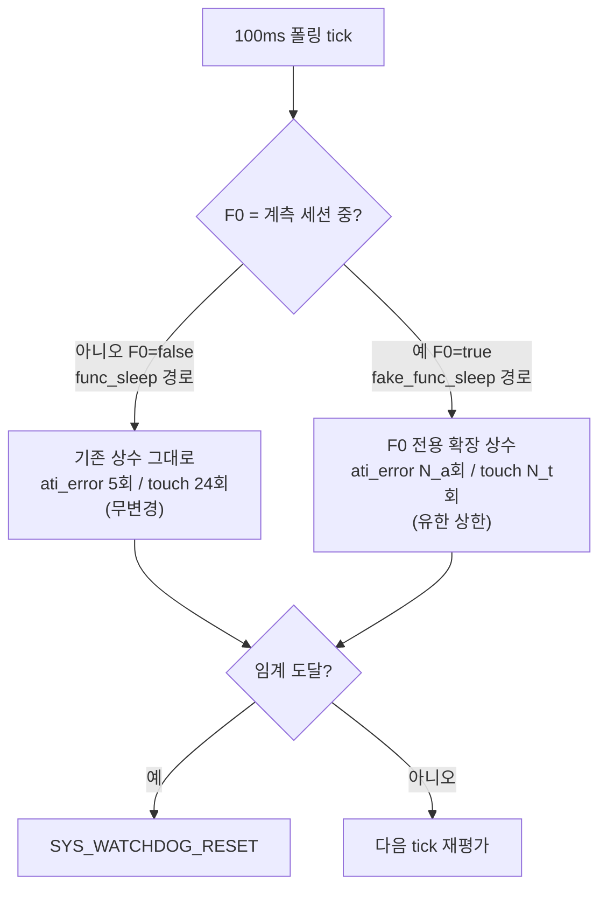

# 08 · S6 — FSM 판정 강건화 (노이즈 인지 라이드스루)

**TL;DR**: 절전 ULP의 두 워치독 리부팅(ATI-에러 7연속·700ms / 터치오인식 24연속·2.4s)에 "지금이 무선 계측 세션(F0)인지" 신호로 유한 상한 유예를 거는 SW-only 후보 4종(+기각 1종)을 도출했다. 오늘자 커밋(47a96d8·82e9d37)이 `fake_func_sleep()`을 계측 전담 경로로 확정해 후보 구현을 실제 절전(`func_sleep()`) 무변경으로 격리 가능함을 확인했다. 단 오염이 확률적이 아니라 체계적(C1 H1)이면 본 레버군 전체의 효과는 제한적이다 — 이 전제 조건을 반드시 §6에서 재확인할 것.

---

## 0. 표기 원칙

01_C1과 동일: **[확립]** 코드/데이터시트 직접 확인, **[가설-강]** 코드+데이터시트 논리적 도출, **[가설-불확실]** 근거 약함, **[미확인]** 실측 필요.

---

## 1. 선행 확인 — 오늘자 커밋으로 재확인된 구조

| 사실 | 상태 | 근거 |
|---|---|---|
| `fake_func_sleep()`이 실제 무선 계측(BLE·SPI 프로파일링) 전담 경로 | **[확립]** — C2 §11 가설을 커밋 메시지가 직접 확증 | 커밋 `82e9d37`(2026-07-03 11:04:40) 메시지: "절전 경로 환원(B): ci_fake_power_sleep→ci_power_sleep... **func_sleep은 실제 절전 유지, fake는 fake_func_sleep 전담**". 커밋 `47a96d8`(11:04:05) 메시지: "무선 계측(fake sleep) 중 ATI 에러 처리를... 직전 절전 재부팅 원인 분석 과정의 반영" |
| `func_sleep()`·`fake_func_sleep()`은 텍스트상 완전히 분리된 별도 함수(공유 헬퍼 없음, 인라인 중복) | **[확립]** | main.c 810~1031(`fake_func_sleep`) vs 1033~1252(`func_sleep`+5개 static 헬퍼). C2 §11과 일치 |
| 순수 FSM(`tdc_touch_logic_step`, tdc_touch_logic.c)은 절전계열 두 함수 어느 쪽에서도 호출 안 됨 | **[확립]** | `func_sleep()` main.c:1233, `fake_func_sleep()` main.c:909 — 둘 다 `tdc_touch_iqs323_read_status()`를 **직접** 호출, 자체 지역 카운터(`ati_error_reboot_cnt`/`touch_cnt`/`notouch_cnt`)로 판정. tdc_touch.c:12 주석("절전 ULP 는... 순수 FSM 미경유")과 일치 |
| `fake_func_sleep()`은 자체 `while(1)` 루프를 돌며 `func_normal()`에 제어를 반환하지 않음 | **[확립]** | main.c:889 `while (1) // ULP loop` — 진입 후 리부팅 전까지 Normal 모드 코드(FSM 포함)는 물리적으로 실행되지 않음 |
| 오늘 아침 이미 1차 완화가 `fake_func_sleep()`에 적용됨: ATI-에러 "즉시 리부팅"(디바운스 0)→"5회 재시도 후 리부팅" | **[확립]** | 커밋 `47a96d8` diff: 기존엔 `ati_error && !ati_active`이면 바로 `SYS_WATCHDOG_RESET()`, 지금은 `func_sleep()`과 동일한 5회 재시도 패턴 이식(`ati_error_reboot_cnt` 신규) |
| 같은 커밋에서 터치오인식 리부팅의 `SYS_WATCHDOG_RESET()`이 주석 처리됨(main.c:1011) | **[확립: 코드]** / 이유는 **[가설-불확실]**(커밋 메시지에 사유 미기재) | 계측 세션을 살려두려는 임시 진단 조치로 추정 — 원복 시 후보 S6-2가 적용 대상. 관측 시점이 이 커밋 이전/이후인지 확인 필요 |
| `public_touch_settings(255, HYSTERESIS)`(임계 255=사실상 터치 비활성화 시도)도 같은 커밋에서 새로 `#if 0` 처리됨 | **[확립: 코드]** | 과거 "임계값을 극단으로 올려 억제"하는 접근이 시도 후 방금 꺼진 상태 — 실터치까지 함께 죽이는 방식이라 본 노드의 목표(오탐만 거르고 실터치는 보존)와 방향이 다름 |

> [!IMPORTANT]
> **오케스트레이터 프레이밍 정정**: 00번 문서는 "현 FSM(tdc_touch_logic) 어디에 어떻게 훅"이라 서술하나, 실제 코드 확인 결과 절전계열 두 함수는 `tdc_touch_logic.c`를 아예 경유하지 않는다. S6의 실제 훅 지점은 **`tdc_touch_logic.c`가 아니라 `main.c`의 절전 헬퍼(`tdc_touch_sleep_handle_ati_error`/`tdc_touch_sleep_handle_touch_reboot`) 및 `fake_func_sleep()` 인라인 등가부**다.

---

## 2. 공통 전제 — 노이즈 윈도우 신호(F0)

**정의**: F0 = "지금 이 폴링 tick이 무선 계측(잡음 유발) 세션 중"임을 나타내는 불리언.

- **권장 바인딩**: F0 := `tdc_get_fake_op_mode() == 1`(main.c:94, 기존 함수, **신규 코드 0줄**). §1에서 확인했듯 `fake_func_sleep()` = 계측 전담이므로, **그 함수 내부에서는 F0가 사실상 상시 참**(그 함수에 진입해 있다는 것 자체가 F0 조건, 유일한 예외는 세션 종료를 감지해 리부팅하는 마지막 1회 폴링). 따라서 아래 후보들은 "런타임 F0 분기"가 아니라 **"`fake_func_sleep()` 전용 상수를 `func_sleep()`과 다르게 둔다"**로 단순화된다 — `func_sleep()` 코드는 한 글자도 안 건드려도 되어 실제 절전 경로 위험 표면이 **0**이다.
- **대안(미래 대비)**: 프로파일링이 향후 `func_sleep()` 경로로도 도입되면 F0를 명시적 매개변수로 스레딩해야 한다 — 이 경우도 SW-only, 여전히 상수만 조건부.
- S4가 다루는 마이크로초 단위 RDY 윈도우 회피와 달리 F0는 **세션 단위(초~분) 매크로 스코프**다 — 더 거칠지만 레지스터·타이밍 무관, 구현이 압도적으로 단순.
- **강점**: F0 기반 완화는 C1이 특정하지 못한 지배 애그레서(SPI·SYSCLK·QCC·I2C 프리스케일 위반 H1·read_debug 래치 H2, 01_C1 §3) 중 **무엇이 실제 원인이든 동일하게 유효**하다 — 애그레서 식별 실측 완료 전에도 선제 적용 가능.

---

## 3. 불변식 영향 매트릭스 (①~⑧, 후보별) — 핵심 산출물

| 후보 | ① FullATI | ② 최초터치해제 | ③ ATI에러Re-ATI | ④ 터치판정 | ⑤ 롱터치 | ⑥ 절전진입/기상 | ⑦ 공통폴링 | ⑧ 단일채널 |
|---|---|---|---|---|---|---|---|---|
| **S6-1** ATI리부팅 유예(F0) | 무손상 | 무손상 | **주의**¹ | 무손상 | 무손상 | 무손상 | 무손상 | 무관 |
| **S6-2** 터치리부팅 유예(F0) | 무손상 | 무손상 | 무손상 | 무손상 | **주의**² | 무손상 | 무손상 | 무관 |
| **S6-3** M-of-N 대체(약함) | 무손상 | 무손상 | **주의**¹ | 무손상 | **주의**² | 무손상 | 무손상 | 무관 |
| **S6-4** Re-ATI 쿨다운 이식 | 무손상 | 무손상 | 주의(경미)³ | 무손상 | 무손상 | 무손상 | 무손상 | 무관 |
| **S6-5** stuck 3단계 연장(기각) | — | — | — | — | — | — | — | — |

¹ ③은 이미 노말·절전 간 비대칭(INV-③-1, 02_C2)이 존재하는 항목 — 본 후보가 그 비대칭의 **폭을 F0 중에만 더 벌리는** 것이지 로직 골격(재시도→리부팅)은 그대로다. "충돌"이 아니라 "기존 비대칭을 의식적으로 확장"으로 문서화 필요.
² ⑤는 INV-⑤-1("2400ms가 노말→절전·절전→노말 양방향 대칭 UX")이 F0 중엔 **의도적으로 비대칭**해짐(절전→노말 웨이크 방향만 느려짐) — 일상 사용(F0=false)엔 무영향.
³ ③에 대해 "리부팅까지 회수(5)는 불변, 경과시간만 늘어남" 수준의 경미한 변경 — 사용자 체감 문서화 권고.

---

## 4. 후보 상세

### S6-1 — ATI-에러 리부팅 유예 확장 (F0 한정, 유한 상한)

- **메커니즘**: `fake_func_sleep()`의 `if (5 < ati_error_reboot_cnt)`(main.c:949) 리터럴 `5`를 F0 전용의 더 큰 상수로 대체. `func_sleep()`의 대응 헬퍼(`tdc_touch_sleep_handle_ati_error`, main.c:1062)는 무변경.
- **필요 변경**: e8300 SW만. (a) 현재 `5`가 `tdc_touch_time.h`의 "시간 상수 단일 소유" 관례를 안 따르는 **네이밍되지 않은 리터럴**임을 먼저 확인(main.c:949,1066 둘 다 raw `5`) — 이 기회에 `TDC_TOUCH_ULP_ATI_ERROR_RETRY_CNT` 류 매크로로 승격 후, `fake_func_sleep()` 전용 더 큰 상수(예: 기존 대비 수배, 구체값 **[미확인 — 실측 필요]**)를 병행 정의. (b) IQS323 레지스터 변경 없음 — `tdc_touch_iqs323_re_ati()` 그대로 재사용, 0xC0 조합(`0x50|bit2, 0x07`)은 불변(INV-X-1 자동 보존).
- **왜 유효한가**: (a) HW 워치독(3.28s) refresh는 안 건드림(`SYS_WATCHDOG_REFRESH()`는 매 100ms tick 무조건 호출 유지) — SW 자발 리부팅 트리거만 유예되는 것이지 firmware-hang 안전망은 그대로. (b) **계측 세션 자체가 관찰 목적**이므로, 조기 리부팅은 오탐 억제 이전에 진단 데이터 자체를 파괴한다(세션 강제 종료·BLE 재연결 필요) — 유예가 "오탐 억제"를 넘어 "계측 목적과의 정합"이라는 별도 가치를 가짐.
- **트레이드오프/리스크**: N값 미확정(**[실측 게이트]**). 아그레서 duty가 C1 §2.1 관찰("7회 연속 전부 오염")대로 ~100%에 가깝다면, 이 레버는 "신호와 잡음을 구분"하는 게 아니라 "통상 계측 세션 길이보다 오래 버티기"에 가깝다 — 세션 통상 길이 자체도 **[미확인]**. **핵심 한계**: 오염이 확률적·간헐적이라는 전제에서만 유효하다 — C1의 H1(I2C SCL 5.12MHz 스펙 5배 초과→조용한 비트오류, 01_C1 §3.1)이 사실이면 오염이 체계적(coherent)일 수 있어 재시도 횟수를 아무리 늘려도 저감되지 않는다(같은 방향으로 반복 왜곡). H1은 **[가설-강]**, 검증 전까지 본 후보 단독 유효성은 낮게 평가해야 한다.

### S6-2 — 절전→노말 웨이크(터치-리부팅) N 확장 (F0 한정)

- **메커니즘**: `TDC_TOUCH_ULP_REBOOT_TOUCH_CNT`(=24, tdc_touch_time.h:48-49, 2400ms 파생)를 F0 활성 중엔 더 큰 값으로 대체 — `fake_func_sleep()` 전용 지역 상수로.
- **필요 변경**: e8300 SW만. 값 미확정(**[미확인]**). 레지스터 없음.
- **주의(중요)**: 이 카운터는 §6·INV-⑤ 표에서 확인한 "절전⇄노말 대칭 롱터치(2400ms) 전원버튼 UX"의 **절전→노말 방향**이다. **노말 모드의 진짜 롱터치**(FSM `tdc_touch_logic_step`의 `out.long_touch`, `TDC_TOUCH_LONG_TOUCH_MS`=2400ms, 노말→절전 트리거, tdc_touch_logic.c:172-190)는 이 후보가 **전혀 건드리지 않는다** — 절전 ULP측 `touch_cnt`(웨이크 방향)만 대상. 일상 사용(F0=false, 대다수 시간)의 UX는 완전 무변화, F0 중(계측 세션)에만 웨이크 지연이 늘어남 — 이는 대칭성 훼손이 아니라 "계측 중에 한해 의도적 예외"로 스코프를 명확히 좁혀야 회귀가 아니라 승인된 예외로 방어 가능.
- **현황 참고**: `fake_func_sleep()`의 `SYS_WATCHDOG_RESET()`이 오늘 아침 이미 주석 처리(main.c:1011, §1)되어 이 리부팅 자체가 당장은 비활성 — 원복 시 본 후보가 적용 대상이 된다.

### S6-3 — 판정 입력 이력 다수결(M-of-N) 대체 — 근거 약한 후보

- **메커니즘**: 현재 두 카운터는 "연속 run"(단 1회 clean 샘플에도 0으로 리셋) 방식이다. 이를 최근 K회 폴링 이력(불리언 shift-register)에 대한 "K개 중 J개 이상" 다수결로 대체하면, 코히런트 아그레서가 매 폴링을 오염시키지 못하는 경우(간헐적 duty) 조기 오탐을 줄일 수 있다. **동일 폴링 tick 내 재조회는 배제**한다 — 그 자체가 추가 I2C 트랜잭션(새 애그레서, 관측교란.md §7 완화책_1·3 위반)이므로, 이미 존재하는 100ms 간격 폴링 이력만 시간축으로 재사용한다(추가 I2C 비용 0).
- **필요 변경**: e8300 SW만(uint8_t 비트마스크 등 소형 이력 버퍼). 레지스터 없음.
- **근거가 약한 이유(명시)**: C1 §2.1의 관찰("7회 연속 전부 오염")이 맞다면, 아그레서 duty가 이미 ~100%에 가까워 run-length든 M-of-N이든 결과 차이가 미미하다. 오히려 J/K 선택에 따라 **최악 지연이 run-length보다 길어질 수 있어** 복잡도 증가 대비 실이득이 불확실하다. 실측(아그레서 duty 분포, C1 §8 확인_1)으로 재평가 후 채택 여부 결정 권고.
- **불변식**: S6-1/S6-2와 동일한 카운터 위치를 대체 방식으로 바꾸는 것이므로 영향 범위도 동일(③·⑤ 주의).

### S6-4 — ULP Re-ATI 재시도 쿨다운 이식 (Normal 패턴, F0 무관 상시 권고)

- **메커니즘**: Normal FSM은 이미 `TDC_TOUCH_RE_ATI_COOLDOWN_MS`(=2000ms, tdc_touch_time.h:25, INV-①-4)로 Re-ATI 재발행 간 쿨다운을 둔다. 반면 절전계열(`func_sleep()`·`fake_func_sleep()` 둘 다)은 `ati_error && !ati_active`가 지속되면 **매 100ms 폴링마다 무조건** `tdc_touch_iqs323_re_ati()`를 재발행한다(쿨다운 없음, main.c:960·1084). 이를 Normal과 동일한 쿨다운 타임스탬프 변수로 게이팅하면, "리부팅까지 회수(5)"는 그대로 두고도 실제 경과 시간이 늘어나며, C1 §2.1이 지적한 "매번 재오염되는 Re-ATI burst를 낭비적으로 재시도"하는 비효율도 줄어든다.
- **필요 변경**: e8300 SW만. 절전 전용 쿨다운 타임스탬프 지역변수 추가(Normal의 `re_ati_cooldown_until_ms`와 동일 패턴). 레지스터 없음 — `0xC0` write **빈도만** 감소, 트리거 조합(0x50|bit2,0x07)은 기존 함수 그대로라 불변.
- **왜 F0 무관 상시 적용이 안전한가**: 신규 설계가 아니라 Normal에서 **이미 검증·승인된 패턴의 대칭 이식**일 뿐이다 — 정상 절전(F0=false)에서도 무해(오히려 I2C 트래픽 소폭 감소로 이롭다).
- **예외 — `func_sleep()`도 변경 대상**: S6-1/2/3과 달리 이 후보는 "func_sleep() 무변경" 원칙의 유일한 예외다(실제 절전 경로에도 쿨다운을 이식하는 것이 이롭다고 판단되면). 그만큼 **별도의 신중한 회귀 검증(실기)**을 권고 — Normal 이식이라는 근거는 강하지만 절전 경로를 만지는 유일한 후보라는 점은 명시해야 한다.
- **트레이드오프**: 쿨다운 값 산정은 Re-ATI 1회 소요시간 실측이 선행돼야 한다(02_분석_ReATI에러처리.md §6 미해결_1과 동일 게이트, **[실측 게이트]**).

### S6-5 — Normal stuck-eval 3단계 F0 연장 — 기각

- **판단**: 기각.
- **이유**: §1에서 확인한 **[확립]** 사실 두 가지가 이 후보를 무효화한다 — (1) 순수 FSM(`tdc_touch_logic_step`, stuck-eval 포함)은 절전계열 어디서도 호출되지 않는다. (2) `fake_func_sleep()`은 자체 `while(1)` 루프로 `func_normal()`에 제어를 반환하지 않으므로, 계측 세션 중엔 stuck-eval이 **물리적으로 실행되지 않는다**. 이 지점을 F0 조건으로 아무리 정교하게 손봐도 이 증상(ATI 에러·터치오인식→절전 리부팅)에 대한 효과는 0이다. "문제가 발생하는 무대가 아닌 곳"을 건드리는 억지 후보 — 근거 없음으로 명시하고 제외한다.

---

## 5. IQS323 레지스터 필요성 총괄

S6-1~4 전부 **e8300 SW(카운터 상수·쿨다운 타임스탬프)만**으로 구성된다 — Re-ATI 발행 자체는 기존 `tdc_touch_iqs323_re_ati()`를 그대로 재사용해 0xC0 조합(`0x50|bit2, 0x07`)이 불변이며(INV-X-1 자동 보존), IQS323 레지스터 신규 도입·값 변경이 **0건**이다. 따라서 S6은 S1~S5(변환주파수·필터/ATI밴드·전력모드·타이밍협조·GPIO드라이브 등 레지스터·클럭 레벨 레버)와 **직교(orthogonal)**해 자유롭게 조합 가능하다 — 이는 08_S8(조합) 노드에서 "최소변경 조합"을 짤 때 S6을 거의 리스크 없는 기반 레이어로 우선 포함할 수 있음을 시사한다.

---

## 핵심 결론 (3~5줄)

1. S6의 실제 훅 지점은 `tdc_touch_logic.c`(순수 FSM)가 아니라 `main.c`의 절전 헬퍼 함수들이다 — 절전계열은 순수 FSM을 아예 경유하지 않는다(오케스트레이터 프레이밍 정정, §1).
2. 오늘자 커밋(`47a96d8`·`82e9d37`)이 `fake_func_sleep()`을 계측 전담 경로로 명시적으로 확정해, F0(노이즈 윈도우) 신호를 기존 `tdc_get_fake_op_mode()`로 **신규 코드 0줄** 확보할 수 있고, S6-1~3의 구현을 실제 절전(`func_sleep()`) **무변경**으로 완전히 격리할 수 있다.
3. 4개 실질 후보(S6-1 ATI리부팅 유예·S6-2 터치리부팅 유예·S6-3 M-of-N 대체(약)·S6-4 Re-ATI 쿨다운 이식) 중 S6-4가 가장 안전(Normal 기존 패턴 이식, 8개 기능 전부 무손상급)하고, S6-1·S6-2가 초점("노이즈 인지 라이드스루")에 가장 직접 부합하되 각각 ③·⑤에 "주의"(기존 비대칭 확대·의도적 UX 비대칭)를 수반한다. S6-3은 근거가 약해 실측 후 재평가를 권고한다. S6-5는 무대 불일치로 기각한다.
4. S6 레버 전부 IQS323 레지스터 변경이 불요해 S1~S5와 직교 조합이 가능하다 — 최소 리스크로 우선 채택 가능한 기반 레이어다.
5. **중대 전제 조건**: 본 레버군은 오염이 확률적·간헐적이라는 가정에서 유효하다. C1의 H1(I2C SCL 스펙 위반→조용한 비트오류)이 체계적 오염으로 확인되면 다중샘플·디바운스 확장으로는 저감되지 않으므로, S6은 S4/S5(타이밍/클럭) 또는 H1 자체 수정과 **반드시 병행**해야 실효성이 있다.

## 리스크 / 불확실성

| 항목 | 상태 |
|---|---|
| S6-1·S6-2·S6-3의 F0 전용 임계값(N_a, N_t, K/J) 구체 수치 | **[미확인 — 실측 필요]**. 아그레서 duty·통상 계측 세션 길이 둘 다 미확정 |
| 오염이 확률적(본 레버군 유효) vs 체계적(H1, 본 레버군 무력)인지 | **[미확인]** — C1 H1 검증(I2C SCL 실측)이 S6 전체의 유효성을 좌우하는 선행 게이트 |
| C1 §2.1 "7회 연속 전부 오염" 관찰이 실기 재현에서도 성립하는지(즉 duty~100% 가정의 타당성) | **[미확인]** — RTT 로그 실측 대조 필요, 02_C2 §0 신선도 주의와 동일 맥락 |
| S6-2가 실제로 발동 가능한지 — `fake_func_sleep()`의 터치리부팅 `SYS_WATCHDOG_RESET()`이 원복될지, 왜 오늘 주석 처리됐는지 | **[미확인]** — 은수님 확인 필요(커밋 메시지에 사유 미기재) |
| S6-4의 절전측 Re-ATI 쿨다운 구체값 | **[실측 게이트]** — Re-ATI 1회 소요시간 실측 선행(02_분석_ReATI에러처리.md §6 미해결_1과 공유) |
| `fake_func_sleep()`이 100% 확정된 프로파일링 경로인지 | **[강한 확립]**(오늘 커밋 메시지 직접 근거)이나 은수님의 실제 무선 계측 하네스가 이 함수를 그대로 쓰는지 최종 확인은 은수님 환경에서만 가능 |
