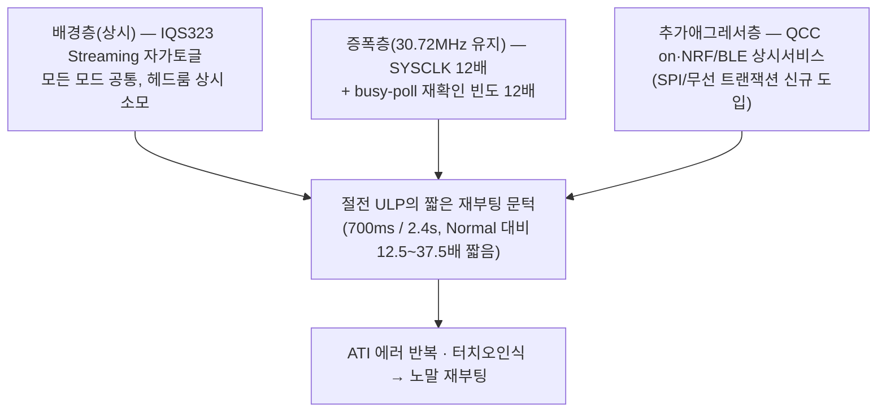

# 10 · S8 — 조합·시스템 전략

**TL;DR**: 코드 직접 재확인 결과 `fake_func_sleep()`이 실제 프로파일링 경로이며(S6·커밋 82e9d37로 확정), I2C SCL은 오히려 정상절전(426.7kHz)이 프로파일링(128kHz, 명시적 재설정 확인)보다 빠르다 — C1의 I2C 스펙위반 가설(H1)은 이 경로에서는 반증된다. 결정적 차이는 단일 원인이 아니라 (a) SYSCLK·QCC·NRF 3종 애그레서 동시 재도입 + (b) IQS323이 상시 Streaming 모드로 이벤트 유무와 무관히 고속 자가토글 중이라는 기존 배경조건(기존 문서 재확인) + (c) 절전 ULP 재부팅 문턱이 Normal 대비 12.5~37.5배 짧다는 구조적 비대칭(C1)의 중첩이다. S1·S2·S3·S6 기존 후보와 본 노드 자체도출(S4·S5·S7 영역) 후보를 6단계로 계층화해 배포하는 조합을 권고하며, 최우선 3단계는 IQS323 레지스터 변경이 0~1개뿐인 저위험 조합이다.

---

## 0. 참조 현황 — 이 노드 작성 시점의 가용 근거

| 노드 | 상태 | 본 노드에서의 취급 |
|---|---|---|
| 00 오케스트레이터·01 C1·02 C2 | 존재 | 1차 근거로 전량 활용 |
| 03 S1(변환주파수)·04 S2(필터/Beta/ATI밴드)·05 S3(IQS323 내장기능)·08 S6(FSM 강건화) | **작성 시점에 존재** | 각 노드의 권고·불변식 매트릭스를 **인용**(재도출 안 함), 상호 결합점만 신규 분석 |
| S4(e8300 타이밍 협조)·S5(GPIO 드라이브/슬루/주파수계획)·S7(관측 방식 재설계) | **작성 시점 부재** | 본 노드가 1차 근거(코드·데이터시트) 직접 재확인으로 **자체 도출**, "S8 자체도출" 라벨 명시 — 추후 해당 노드 생성 시 교차검증 필요 |

---

## 1. 근본 재조명 — "정상 절전은 통하는데 프로파일링만 깨지는" 결정적 차이

### 1.1 코드 재확인 — 정상절전(`func_sleep`) vs 프로파일링(`fake_func_sleep`, main.c)

| 항목 | 정상절전 `func_sleep()` (동작 정상) | 프로파일링 `fake_func_sleep()` (증상 발생) | 근거 |
|---|---|---|---|
| CM3 SYSCLK | 2.56MHz(`ci_power_sleep`) | **30.72MHz 유지**(`ci_fake_power_sleep`, 이름과 달리 SYSCLK 하강 없음) | ci_power.c:163-174, 176-186 |
| I2C SCL(터치 버스) | **426.7kHz**(PRESCALE_6, 기존 [FIXME] — 설계의도 122kHz 대비 오히려 빠름) | **128kHz**(`I2C_MASTER_PRESCALE_240` **명시 재설정**, main.c:864 — 노말과 동일) | main.c:864,1222; driver_i2c.h divisor 공식(SDK `sk5_hw_cid101.h` PRESCALE_6=divisor 6·PRESCALE_240=divisor 240 확인) |
| QCC | OFF(`SND_QCC_MODE_SHUTDOWN`) | **ON**(해당 호출 주석처리, main.c:828) | main.c:1199 vs 828 |
| NRF/BLE | OFF(`ResetNRF`+`NRF_Off_Command`) | **상시 ON**, 매 tick `bleCommunication()` 서비스 | main.c:1197-1198(호출 있음) vs 810-843(호출 없음), 899 |
| 절전ULP 재부팅 문턱 | ati_error 5회(~600ms)·touch 24회(2.4s) 둘 다 **활성** | ati_error 5회 **활성**(5회 초과 시 `SYS_WATCHDOG_RESET`), touch 재부팅은 `SYS_WATCHDOG_RESET()` **주석처리**(no-op, 로그만) | main.c:947-965(ati) vs 1002-1019(touch, 1011행 `// SYS_WATCHDOG_RESET()`) |

### 1.2 신규 발견 4건 (C1 가설 재검증·정정)

1. **[확립: 코드] I2C SCL 자체 스펙위반 가설(C1 H1)은 이 경로에서 반증된다** — 프로파일링 경로가 SCL을 128kHz(규격 내)로 **명시적으로 재설정**하는 반면, "정상 작동하는" 절전 베이스라인이 오히려 426.7kHz(기존 미해결 [FIXME], 그래도 무증상)로 더 빠르다. "I2C 통신 프로토콜 자체의 과속"이 프로파일링 실패의 원인이라는 가설은 방향이 반대다 — 이는 C1 §3.1을 정정하는 사실이며, C1이 "프로파일링 하네스 소스 미확인"으로 유보했던 부분을 본 코드 확인으로 해소한다.
2. **[확립: 코드, 재검증 필요 신호] 사용자가 관찰한 "터치 오인식→재부팅"은 `fake_func_sleep()` 경로에서는 문자 그대로 발생할 수 없다** — 해당 리부팅 트리거가 주석 처리돼 로그만 남기고 실제 리부팅은 하지 않기 때문이다. 실제 재부팅은 **ati_error 경로**(`"[TOUCH] SLEEP: ATI ERROR -> REBOOT"`)를 통해서만 일어난다. 사용자가 로그에서 본 것이 이 문구인지, 아니면 이미 원복(uncomment)된 다른 빌드인지 **RTT 로그 문구 1회 확인**으로 즉시 검증 가능 — S6도 동일 지점을 §1에서 독립적으로 지적했다(왜 주석 처리됐는지는 커밋 메시지 미기재, [미확인]).
3. **[가설-강, 기존문서 재확인] IQS323 자체가 상시 Streaming 모드로, 터치/ATI 이벤트 유무와 무관히 "측정 사이클 완료마다" RDY를 고속 자가토글 중이다** — 이는 정상/절전/프로파일링 **전부에 공통**인 배경조건이라 "차이"의 원인은 아니나, 상시적으로 노이즈 헤드룸을 깎아먹어 외부 애그레서가 조금만 추가돼도 문턱을 넘기 쉬운 취약한 배경을 만든다. `참고/touch/개선/RDY 윈도우 타이밍 분석/3_종합결론.md`(maturity: stable)가 "Report Rate=0 → 측정 사이클 시간마다 RDY Low, 대다수 창이 서비스 못 받고 닫힘"을 이미 확정했고, S3(§1·§5)가 동일 사실을 데이터시트로 독립 재확인했다.
4. **[가설-강, 본 노드 코드 직접 확인] `force_window_open()`/`wait_window_closed()`의 RDY 대기 루프는 딜레이 없는 busy-poll이다**(`tdc_touch_iqs323.c:128-175`, `while(1)`에 `Sys_GPIO_Read`만 반복) — 동일 실시간 대기 구간에서 CM3 내부 GPIO 버스 재확인 횟수가 SYSCLK에 **비례**한다. 30.72MHz 프로파일링은 2.56MHz 정상절전 대비 같은 대기 시간 동안 약 12배 많은 내부 버스 읽기를 발생시킨다 — 이는 C1의 추상적 "메커니즘_1: SYSCLK 12배"를 뒷받침하는 구체적 코드 사례다.

### 1.3 종합 판단 — 3층 중첩

I2C 프로토콜 자체(SCL 속도)는 반증되었고, 정확한 지배 애그레서(SPI 클럭·QCC 결합경로 등)는 C1·S1이 이미 밝혔듯 여전히 [미확인]이다. 그러나 위 3층은 전부 **e8300 SW만으로 저감 가능한 지점**을 갖고 있다는 것이 §2의 근거다.

---

## 2. 통합 SW-only 후보 (출처 표기, 상세는 원 노드 참조)

| ID | 출처 | 메커니즘 | 필요 변경(핵심) | 레지스터 | 실현성 |
|---|---|---|---|---|---|
| **R1** | 08 S6-4 | 절전 Re-ATI 재시도에 Normal과 동일한 쿨다운 이식 → 낭비적 재오염 재시도 감소 | e8300 SW만(타임스탬프 변수 1개, `func_sleep`+`fake_func_sleep` 둘 다) | 없음(0xC0 write 빈도만↓) | 강함(Normal 기존 패턴 이식) |
| **R2** | S8 자체(§4-도메인) | `fake_func_sleep()` 루프 내 `bleCommunication()`과 touch read를 시간적으로 이격 — 현재 인접 호출(main.c 894-910)이 메커니즘_2(샘플링 윈도우 일치) 위험을 높임 | e8300 SW만, 순수 재배치(레지스터·FSM 불변) | 없음 | 강함(무위험 재배치) |
| **R3** | S8 자체(§7-도메인, C1 H2 대응) | `read_status()`(0x10)+`read_debug()`(0x13-0x14)를 0x10~0x14 연속 5-word 단일 read로 통합 → 폴링당 강제개방(force-comm) 창 2회→1회 | e8300 SW(L1 함수 통합), 레지스터 주소 연속성은 §9 메모리맵으로 확립(자동증가 read는 §8.5로 확립) | 없음 | 강함(C1 §3.2 H2 직접 해소) |
| **R4** | S8 자체(§7-도메인) | `ati_active==1`인 동안 `read_debug()` 생략 — ATI 버스트 구간에 부가 I2C 미주입 | e8300 SW 1줄 조건 | 없음 | 강함 |
| **R5** | 05 S3 후보_2 | Normal Power Report Rate(0xC1) 명시 설정(POR 기본 0x0000 방치 중) | e8300 SW 레지스터 write 1곳 신규 | 0xC1 신규 write | 긍정(회귀위험 최소, 효과는 "0"의 정확한 의미 [미확인]) |
| **R6** | 03 S1-1 | Conversion Frequency 0x31 Period 5→12 (1.00MHz→500kHz, 자기용량 상한 경계→데이터시트 자체 typical점) | e8300 SW 1바이트 상수(`tdc_touch_iqs323.c:316`) | 0x31 값 변경 | 긍정하나 근거 약함(S1 자체 평가, 메커니즘_2엔 역방향) |
| **R7** | 05 S3 후보_3 | Interface Selection(0xC0 bit7) Streaming→Events — 이벤트 무발생 구간의 IQS323 자가 RDY토글 제거(§1.2 발견_3 직접 대응) | e8300 SW, **0xC0 write 5곳 전부**(§3.1 상세) 동시 수정 | 0xC0 bit7 추가(5곳) | 긍정하나 구현 시 누락 리스크(INV-X-1 확장) |
| **R8** | S8 자체(§4/§5-도메인, 발견_4 대응) | `force_window_open`/`wait_window_closed` busy-poll에 SYSCLK 무관 고정 실시간 지연 삽입(SLOWCLK/RTC 기반, SysTick busy-wait는 재발 우려로 배제) | e8300 SW, L1 대기루프 수정. 45ms/20ms 타임아웃 불변 | 없음 | 조건부([실측 게이트]: 이 루프의 반복빈도가 실제 유의미 애그레서인지 확인 선행) |
| **R9** | 08 S6-1 | `fake_func_sleep()` 전용 ati_error 재시도 상한(현 5)을 F0(`tdc_get_fake_op_mode()==1`) 한정으로 확장 — `func_sleep()` 무변경 | e8300 SW, 상수 승격+F0분기 | 없음 | 조건부(오염이 확률적일 때만 유효, S6 §4 명시) |
| **R10** | 08 S6-2 | `fake_func_sleep()` 전용 touch 재부팅 상한 확장 — 단 현재 이미 no-op(주석처리)라 원복 시에만 적용 대상 | e8300 SW | 없음 | 조건부(§1.2 발견_2 확인 후 재평가) |
| **R11** | 04 S2 | Counts Beta(0xB0) 2→3, LTA Normal Beta(0xB1) 6→7 병행 실측 | e8300 SW 레지스터 상수 2곳 | 0xB0·0xB1 값 변경 | 중간(S2 §2: ATI-error 레그엔 무직접효과, 터치오인식 레그·자동Re-ATI 진입빈도에만 간접효과) |
| **R12** | 04 S2 | Touch Threshold(0x62) 80→84~86 미세조정, SNR 재확인 후 | e8300 SW 1곳 | 0x62 LSB | 약함(마진 22%뿐, S2 §6) |
| **R13** | 05 S3 후보_1 **+ S8 신규 결합** | Prox(0x61) HW debounce를 Touch 1차 게이트로 활용 — **단 S3 자신이 명시하듯 이 레지스터 인가만으로는 미완성**이며, 현재 `prox` 필드를 소비하는 FSM 로직이 0곳(S3 §3 확인)이라 **신규 FSM 규칙**(S6의 4개 후보 목록에도 없음, 본 노드가 처음 지적하는 결합점)이 별도로 필요 | e8300 SW(레지스터 1곳 + **신규 FSM 로직**, S6·S3 어느 원 노드에도 없는 결합) | 0x61 값 재정의(Threshold+Debounce) | 조건부(별도 설계 작업 필요, §5 6단계) |

**기각/반대(원 노드 판정 인용, 재검토 불필요)**: LP/ULP Automatic 재도입(S3 §7, 기존 확정 회귀 재현 — 강한 반대), ATI Band/Target 확대(S2 §5, 이미 최댓값·스케일불변성 가설로 비권장), Hysteresis 확대(S2 §6, 효과 미미), S6-3 M-of-N(약함, 실측 후 재평가), S6-5 stuck-eval 연장(S6 §4, 무대 자체가 불일치해 기각), I2C Transaction Timeout 단축(S3 후보_4, 근거 약함).

---

## 3. C2 8대 불변식 — 권장 조합(1~4단계, §5) 통합 영향 매트릭스

> [!IMPORTANT]
> 개별 레버의 상세 근거·각주는 원 노드(S1 §4·S2 §8·S3 §9·S6 §3)에 이미 있다. 아래는 **여러 레버를 동시에 쌓았을 때** 상호작용으로 등급이 악화되는 지점이 있는지 확인하는 조합 전용 매트릭스다.

| 불변식(①~⑧) | 관련 레버(R#) | 조합 등급 | 비고 |
|---|---|---|---|
| ① Full ATI(드리프트회피) | R1,R3~R8 전부 | **무손상** | 0x36·경로_2 게이트·stuck 3단계 어느 레버도 미접촉. 서로 다른 레지스터/함수라 상호간섭 없음 |
| ② 최초 터치해제 게이트 | R6,R11(정착지연) | **무손상~경미 주의** | 필터 정착지연 요인이 R6(Fxfer)·R11(Beta) 둘뿐이라 누적돼도 디바운스 카운트(3폴링=300ms) 대비 미미할 개연성 — [실측 권고] |
| ③ ATI 에러 시 Re-ATI(비대칭) | **R1+R9 동시 적용 시 상호작용 주의** | **주의(복합)** | R1(쿨다운 이식)과 R9(F0 한정 재시도상한 확장)이 **같은 절전 ati_error 헬퍼**(`tdc_touch_sleep_handle_ati_error`류)를 함께 수정한다 — "쿨다운 대기 중엔 카운터를 올리지 않는지" 등 상호작용 규칙을 설계 단계에서 명시해야 함(§5 3단계 이후로 순서 분리 권고 사유) |
| ④ 터치판정(CH0 Touch) | R11,R12(정착·마진),R13(Prox 재정의) | **주의(누적, 충돌 아님)** | 서로 다른 레지스터(0xB0/B1 vs 0x62 vs 0x61)라 직접 간섭은 없으나 회귀시험 항목이 늘어난다 — 조합 배포 시 회귀셋에 세 항목 모두 포함 필요 |
| ⑤ 롱터치(2400ms) | R10(F0 한정) | **무손상(일상)** | F0=false(일상)엔 전 레버 영향 0. R10 자체가 현재 no-op이라 이번 권장 조합(§5 1~4단계)엔 **미포함** |
| ⑥ 절전 진입/기상 시퀀스 | R1(유일하게 `func_sleep()`도 수정) | **주의** | R1만 유일하게 실제 절전 경로를 건드림(S6 §4 명시 예외) — 별도 신중 회귀시험 대상으로 명시 격리 |
| ⑦ 공통 폴링 경로(L1) | **R2,R3,R4,R7,R8 다수 동시 접촉** | **주의(최다 접점)** | 본 조합에서 가장 많은 레버가 겹치는 층 — 장점(레버 1개당 노말+절전+프로파일링 3경로 동시 적용, INV-⑦-1)이자 위험(한 곳 실수가 3곳 동시 회귀). **이 층은 §5에서 레버를 한 번에 하나씩 순차 배포하도록 단계를 쪼갠 직접적 이유** |
| ⑧ 단일채널 구성 | 전 레버 | **무손상** | 어떤 레버도 CH1/CH2 활성화·레퍼런스채널 도입을 하지 않음(제약_3 범위 밖 유지) |
| X-① 0xC0 비트보존 | R1(트리거 재사용, 불변),R7(**5곳 동시 수정**) | **주의** | R7 채택 시 "0xC0 write는 트리거+PowerMode(101)+CHtimeout(0x07)+**Interface선택(bit7)**을 항상 함께 쓴다"로 INV-X-1이 확장된다 — 5개 write 지점 전수 그레핑으로 누락 검증 필수 |
| X-② READ_FAIL hold | R2,R8(타이밍) | **무손상** | hold 카운트(20폴링) 로직 자체 미접촉, L1 타이밍 변화는 45ms/20ms 캡 안에서만 허용 |
| X-③ 디버그계측 무해성 | R3,R4(계측 경로 자체를 다룸) | **무손상** | 계측은 FSM 입력이 아니므로(INV-X-3) 통합·생략 모두 판정 로직에 영향 0 — 오히려 이 불변식이 R3/R4를 "안전한" 레버로 만들어주는 근거 |

**결론**: 8대 불변식 + 3개 교차불변식 11개 중 **충돌 0건**, 무손상 다수, 주의 5건 — 그 중 4건은 서로 다른 레지스터/함수라 독립적 주의(합산 위험 낮음)이고, **①번(③번 항목의 R1+R9 상호작용)만 진짜 "조합 특유" 신규 주의사항**이라 설계 단계에서 명시 처리가 필요하다.

---

## 4. 상충 조정

| 상충 | 조정 방향 |
|---|---|
| 필터강화(R11 Beta상향) vs 응답성 | S2 §2가 이미 확인: Beta상향은 "터치오인식" 레그에만 유효하고 ATI-error 레그엔 무관 → **우선순위를 낮춰 5단계로 배치**(R1~R8로 먼저 승부, 부족분만 보충) — 상충 자체를 "발생 순서 뒤로 미뤄 회피" |
| 저드라이브(S5 영역, 부재) vs SPI 속도 | SPI는 NRF가 마스터 구동(C1 §3 확립)이라 e8300이 직접 손댈 지점이 아니다 — 본 노드는 **e8300이 직접 제어하는 GPIO(RDY=DIO16 등)에 한해서만 저드라이브/슬루제한을 검토하고 NRF측 SPI 자체 속도는 건드리지 않는다**는 원칙만 제시(S5 노드 생성 시 이 원칙 하에 구체화 필요) |
| R9(ATI 재시도 상한 확장) vs "빠른 복구를 통한 응답성" | 상한은 F0(계측 세션) 한정 + **유한값**(무한 유예 아님, S6 §4) — 일상 사용(F0=false)엔 영향 0이라 상충이 실질적으로 사용자 체감에 도달하지 않음 |
| R7(Event모드) vs Force-Comm t_wait 마진 | S3 §9 각주③이 지적한 대로 t_wait 상한(45ms)이 기존 `MAX_WAIT_OPEN_MS`와 동일 상한대라 여유가 좁을 수 있음 → **§5에서 3단계(중위험)로 격리**, 1·2단계 효과 확인 후 착수 |
| R1(쿨다운 이식)이 유일하게 `func_sleep()`도 수정 vs "실제 절전 경로 무변경" 원칙(S6) | R1은 예외로 명시 격리하고 **별도 회귀셋**(정상 절전 시나리오 전용)을 강제 — 나머지 레버는 전부 F0-격리 또는 L1 공유 경로만 사용해 원칙을 지킴 |

---

## 5. 단계적 롤아웃

| 단계 | 레버 | 위험 | IQS323 레지스터 변경 수 | 선행 게이트 |
|---|---|---|---|---|
| **0 확인** | RTT 로그 재부팅 문구 확인(§1.2 발견_2 검증), 프로파일링=`fake_func_sleep()` 최종 확인 | 무위험 | 0 | — |
| **1 순수배치** | R2(BLE/터치read 이격), R1(Re-ATI 쿨다운 이식 — `func_sleep()`도 포함 별도 회귀셋) | 극저 | 0 | R1: Re-ATI 1회 소요시간 실측(S6 §4) |
| **2 통합·저위험 레지스터** | R3+R4(read_debug 통합·ati_active중 skip), R5(0xC1 명시), R6(Fxfer 500kHz) | 저 | 최대 2곳(0x31·0xC1) | R6: 실측 스윕(S1-3) 권고 |
| **3 다곳 동시수정** | R7(Event모드, 0xC0 5곳), R8(busy-poll 지연) | 중 | 0xC0 bit7(5곳) | 실측게이트 2(기존 로드맵 `제어 재설계 분석·권고.md` Phase 3) — 전류+ATI에러/오탐 발생률 동시 측정으로 **확장** 권고 |
| **4 F0-격리(계측세션 한정)** | R9(ati_error 유예), R10(touch 유예, 원복 시) | 중(단 `func_sleep()` 완전 무영향) | 0 | §1.2 발견_2 재확인 후 R10 여부 결정 |
| **5 신중(방향불확실)** | R11(Beta), R12(Threshold) | 중~약한 근거 | 2곳(0xB0/B1·0x62) | SNR≥5·raw≥20cnt 재확인(S2 §6) |
| **6 협조설계(신규 결합)** | R13(Prox게이트+신규 FSM 소비규칙) | 별도 4단계 프로세스로 분리 권고 | 1곳(0x61) + FSM 신규 | S3·S6 협조 설계 필요, 본 조합의 핵심 미완성 지점 |
| **보류/기각** | LP/ULP 재도입(반대), ATI Band/Target 확대, Hysteresis 확대, S6-3, S6-5, I2C Timeout 단축 | — | — | 각 원 노드 판정 유지 |

1~3단계만으로도 IQS323 레지스터 변경은 최대 2~3개 값이며(0x31·0xC1·0xC0 bit7), 신규 FSM 로직·판정 문턱 변경은 0건이다 — "최소 변경"을 원한다면 이 3단계가 그 자체로 독립적인 1차 배포 단위가 된다.

---

## 핵심 결론 (3~5줄)

1. 코드 직접 확인 결과 프로파일링 경로(`fake_func_sleep()`)는 I2C SCL을 오히려 규격 내(128kHz)로 명시 재설정하므로 C1의 I2C 스펙위반 가설(H1)은 이 경로에서 반증되며, 실제 재부팅은 ati_error 경로로만 발생 가능하다(touch 재부팅은 현재 no-op) — 사용자 관찰과의 정합은 RTT 로그 문구 확인 1건으로 즉시 검증 가능하다.
2. "정상 절전은 통하는데 프로파일링만 깨지는" 결정적 차이는 단일 원인이 아니라 (a) 상시 존재하는 IQS323 Streaming 자가토글이라는 배경 헤드룸 소모 + (b) SYSCLK 12배가 busy-poll 재확인 빈도까지 12배로 증폭 + (c) QCC/NRF 신규 애그레서 도입 + (d) 절전 ULP 재부팅 문턱이 Normal 대비 극단적으로 짧다는 구조적 비대칭, 4개 층의 중첩이다.
3. S1(변환주파수)·S2(필터/Beta)·S3(IQS323 내장기능)·S6(FSM) 4개 선행 레버 노드의 후보와 본 노드 자체도출(read_debug 통합·타이밍 재배치·busy-poll 클럭무관화) 13개 후보(R1~R13)를 6단계로 계층화했으며, 1~3단계(R1~R8)만으로 C2 8대 불변식에 **충돌 0건**, IQS323 레지스터 값 변경 최대 2~3개로 최소변경·저위험 조합이 구성된다.
4. 유일한 "조합 특유" 신규 주의사항은 R1(Re-ATI 쿨다운)과 R9(ATI 재시도상한 F0확장)이 같은 절전 헬퍼 함수를 함께 수정할 때의 상호작용 설계이며, R1만 유일하게 실제 절전 경로(`func_sleep()`)도 건드리므로 별도 회귀셋이 필요하다 — 그 외 12개 후보는 전부 F0-격리 또는 공유 L1을 통해 위험을 통제할 수 있다.
5. R13(Prox HW 디바운스를 Touch 게이트로 결합)은 S3(레지스터)·S6(FSM) 어느 원 노드에도 없던 신규 결합점으로, C1이 지적한 "Touch에 디바운스가 없다"는 근본 구조적 약점에 가장 직접 대응하나 별도 협조 설계가 필요해 최소변경 1차 배포에는 포함하지 않는다.

## 리스크/불확실성

| 항목 | 상태 |
|---|---|
| §1.2 발견_2(터치 재부팅이 실제로 no-op인지)가 은수님이 관찰한 증상과 일치하는지 | **[미확인]** — RTT 로그 재부팅 직전 문구("ati_error -> reboot" vs 그 외) 1회 확인으로 즉시 검증·반증 가능, §5 0단계 |
| R1+R9 상호작용 설계 구체안 | **[미확인]** — 본 노드는 "설계 시 명시 필요"까지만 지적, 실제 규칙(쿨다운 중 카운트 정지 여부 등)은 4단계 프로세스 ②③에서 확정 필요 |
| R7(Event모드) 도입 시 `wait_ati_done_blocking()` 체감 속도(빨라짐 vs 느려짐) | **[미확인]** — ATI Event bit가 이미 활성화돼 있어 이벤트 기반 즉시 assert 가능성과, force-comm t_wait 상한(45ms) 재대기 가능성이 상충 방향으로 공존, 실측 필요 |
| R3(0x10~0x14 통합 read)의 실제 HW 동작 | **[가설-강]** — §8.5 auto-increment 원칙과 메모리맵 연속성(0x10~0x14 전부 Read-Only 연속 구간)으로 개연성은 높으나, 중간 레지스터(0x11 Gesture·0x12 Slider, Sound1 미사용)를 건너뛰지 않고 통과 read하는 것의 부작용 여부는 실기 확인 필요 |
| R8(busy-poll 클럭무관화)의 실질 효과 크기 | **[가설-강, 실측 게이트]** — 메커니즘 자체는 코드로 확립했으나 "이 정도 내부 버스 활동이 실제로 전극에 결합할 만큼 유의미한가"는 미확인, 오실로스코프로 CRX0 노드 관측 시 SYSCLK on/off 비교 권장 |
| S4·S5·S7 노드 부재로 인한 자체도출(R2·R8·R3·R4) 교차검증 미완료 | 해당 노드 생성 시 본 노드의 §2·§5 갱신 필요 — 특히 R8은 S5(GPIO/드라이브) 도메인과, R2는 S4(타이밍 협조) 도메인과 직접 중복 가능성 |
| 지배 애그레서(SPI 정확한 클럭·QCC 결합경로) 자체는 여전히 미확정 | C1·S1이 이미 명시한 기존 미해결 항목 — 본 노드의 조합은 "지배 애그레서가 무엇이든 유효한" 레버(R1·R2·R3·R4·R7·R8·R9)를 우선 배치해 이 불확실성을 우회하는 전략이나, 근본 확정은 실측 없이 불가 |
