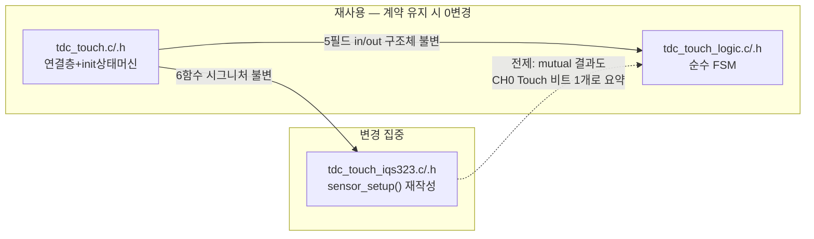

# 05 · P5 현설계·CRX1이력·마이그레이션

**TL;DR**: CRX1의 CalCap 더미·방전 이력은 과거형이다 — 현재 코드(FullATI 전환)는 이를 이미 폐기, CH1은 disable 상태다. 실전극화는 더미 폐기가 아닌 채널 재활성화다. 단일채널 정지 재발은 구조적 불가, 전역 ati_error 교차간섭은 완화 형태로 재발 가능(실측 필요). auto-ATI 타이밍 급소는 mutual에도 존재하나 현 FW의 명시 Re-ATI 패턴이 이미 대응하며, 마이그레이션은 iqs323 드라이버 1개 파일에 국한된다. (상세 근거·미확인 전제는 본문 §0~5)

> 범례: [확인됨]=코드/문서 직접 근거 · [추정]=정적 추론 · [실측 게이트]=실보드 필요 · [미확인]=근거 문서에 없어 확인 불가.

---

## 0. 핵심 정정 — 전제가 이미 바뀌어 있다 (현재 코드 실사실)

> [!IMPORTANT]
> 오케스트레이터 브리핑·이슈해결 문서가 서술한 "CRX1 CalCap 더미 + 외부 C52 + CRX0 방전"은 **과거 이력**이다. 현재 `claude_develop` 계열 실제 소스(`src/2__cm3/Cortex-M3-src/systemControl/`)는 이미 FullATI 리팩토링(git log: `65c83c7 Feat(touch): IQS323 Full ATI 리팩토링...`)을 병합해 **CalCap 더미·CRX0 방전을 완전히 폐기**했다.

| 항목 | 이슈해결 문서 시점(과거) | 현재 실제 코드([확인됨]) |
|---|---|---|
| CRX1(CH1) | CalCap 내부 더미, enable | `write_register(REG_SENSOR1_SETUP, 0x00, 0x00)` — 완전 disable [`tdc_touch_iqs323.c:272`] |
| CRX0(CH0) 방전 | 200ms마다 VSS 토글 | 방전 함수 자체 부존재(grep 0건) — `enable+ctx0` 고정 [`:277`] |
| 0x43/0x44/0x70 | 0x43 미수정, 0x44 CalCap=1pF, 0x70 Independent | **셋 다 write 자체가 코드에 없음** — reset 방치 [`tdc_touch_iqs323.c` 전체 grep] |
| ATI Mode | Disabled(0x08) + FIXED MULT/COMP | **Full(0x040C)**, MULT/COMP write 폐기 [`:437`, `06_레지스터레퍼런스.md` A.12 reset=0x040C] |
| ESD 대응 | discharge_crx0() 능동 방전 | Full ATI 밴드이탈 자동 Re-ATI + 게이트드 SW Re-ATI [`tdc_touch_logic.c:154~161`] |

**함의**: 본 노드가 답할 "실전극화 영향"은 "CalCap 더미를 걷어내는" 작업이 아니라 **"이미 완전히 죽어 있는 채널(0x40=0x0000)을 mutual RX로 새로 살리는"** 작업이다. 아래 (a)(b)(c)는 이 정정된 전제 위에서 답한다.

---

## 1. (a) CRX1 실전극화 시 과거 ESD·단일채널 문제 재발/변형 여부

### 1.1 CalCap 더미의 진짜 존재 이유 (재확인)

이슈해결 문서 자신이 명시: "CRX1 CalCap 더미는 ESD를 직접 방전하지 않는다. ESD 방전은 CRX0 자신이 하고, CalCap은 그 방전 동작이 IC를 정지시키지 않게 받쳐주는 짝" [`이슈해결-CRX1ESD §1·§3`]. 즉 더미의 목적은 "ESD 방어"가 아니라 **"CRX0 방전 중 measurement cycle 유지"**였다. 07분석도 동일 결론([`07분석-단일채널ESD §1·§6.1`]): "CRX1 폐기 = CRX0 방전 폐기와 한 묶음".

### 1.2 세 가지 하위 이슈별 재발 판정

| 과거 이슈([이슈해결-CRX1ESD]) | mutual 실전극화 시 재발 판정 | 근거 |
|---|---|---|
| §1 단일 활성채널 disable → IC 정지 | **재발 불가(구조적)** | 재발 조건은 "CH0을 잠깐 끄는 방전 동작"인데 그 코드 자체가 없다(§0). mutual 도입 시 CH1은 상시 활성 전극이 되므로 오히려 "활성 채널 ≥1" 조건을 자연 충족 — 정지 메커니즘의 전제가 이중으로 소멸 |
| §2 0x43 reserved 비트 위반 → 먹통 | **mutual과 무관, 코드 규율 문제** | 0x43(Prox Input, reset 0x01CF)을 reset 기준 없이 부분 write하면 여전히 위험하나, 이는 "레지스터는 reset 값 기준 산출"([이슈해결 §9 교훈2])이라는 일반 원칙 — mutual pairing 구현자가 이 교훈을 지키면 회피 가능. 실전극화가 자동으로 재현하는 문제 아님 |
| §4·§7 전역 ati_error 교차오염 | **변형된 형태로 재발 가능(완화됨)** — 아래 1.3 상술 | `ati_error`는 여전히 전역 비트(채널별 레지스터 없음). 이 아키텍처 사실은 안 바뀜 |

### 1.3 전역 ati_error 교차오염 — 과거와 다른 점

- **과거(2026-06)**: CH1 auto-ATI 실패 → 전역 `ati_error` SET → `tdc_touch_get_state()`가 `if(ati_error) → CAL_ERROR` **단락** → 터치 영구 인식 불가([이슈해결 §4·§7]). 치료 수단 부재로 **영구 lock**.
- **현재**: `CAL_ERROR` 단락 코드 자체가 없다(현 `tdc_touch.c:423~433` `get_state`는 `st.pressed`만 본다, [확인됨]). `ati_error`는 `tdc_touch_logic_step`의 게이트 조건 중 하나로만 쓰인다: `NOT_TOUCH && !ati_active && ati_error && 쿨다운경과 → Re-ATI 발행` [`tdc_touch_logic.c:154~161`], 쿨다운 `TDC_TOUCH_RE_ATI_COOLDOWN_MS`로 재발행 제한.
- **판정**: CH1이 실전극(외부 노출, ESD 환경에 CRX0와 함께 노출)이 되면 그 자체의 드리프트/ESD가 전역 `ati_error`를 흔들 수 있다는 구조는 남는다. 그러나 현재 로직은 그 신호를 "영구 lock"이 아니라 "게이트드 Re-ATI 트리거"로만 소비하므로, 최악의 경우도 **"Re-ATI 버스트 빈도 증가로 인한 CH0 안정성/전력 저하"**로 완화될 것으로 [추정]되지, 과거처럼 "터치 영구 불능"으로 재발할 근거는 현재 코드에 없다. 단 이는 CH1의 실측 ESD/드리프트 특성이 없는 상태의 추정이라 **[실측 게이트]**.

> [!NOTE]
> 07분석 §2.2가 지적한 Full ATI의 일반 자가복구 논리("ESD → LTA 밴드이탈 → 자동 Re-ATI")는 CH0 단독 기준으로 도출됐다. CH1이 실전극이 되면 "밴드이탈"이 CH0/CH1 중 어느 쪽 기준인지, mutual pairing이 단일 LTA/ATI 세트로 도는지 별도인지는 IC 능력 문제([IQS323 IC능력 페르소나] 소관) — 본 노드는 SW 이력·마이그레이션 관점만 답한다.

---

## 2. (b) auto-ATI가 sensor_setup보다 먼저 도는 타이밍 급소 — mutual에도 적용되는가

**결론: 하드웨어 거동 자체는 mutual과 무관하게 동일하게 적용되지만, 현재 FW는 이미 이 급소에 대한 "치료" 패턴을 갖고 있어 새 문제가 아니라 기존 해법의 확장 대상이다.**

| 구분 | 과거(이슈해결 §6) | 현재([확인됨]) |
|---|---|---|
| IC 거동 | MCLR 직후 IC가 SW 설정 이전에 auto-ATI 자동 수행 — **바뀔 수 없는 하드웨어 사실**(reset ATI Setup=0x040C=Full이 기본값이므로 별도 write 없이도 자동 수행, [`데이터시트06-레지스터레퍼런스` A.12]) | 동일 |
| SW 대응 | `sensor_setup`이 CH1을 ATI Disabled로 "예방"만 함 — **치료(이미 SET된 ati_error 클리어) 수단 없음** → 영구 잔류 [이슈해결 §6] | `apply_settings()`가 `sensor_setup()` 이후 **명시적 boot Re-ATI 트리거**(`0xC0` bit2, `0x54,0x07`) + `wait_ati_done_blocking()`으로 완료 대기 [`tdc_touch_iqs323.c:444~451`] |
| 순서 | MCLR → auto-ATI(전 채널 reset 상태) → sensor_setup(CH1 Disabled) → **끝(치료 없음)** | MCLR → auto-ATI(전 채널 reset 상태) → `sensor_setup`(CH1 disable/CH0 설정) → 임계·Beta·ATI Full write → **명시 Re-ATI 재발행 + 블로킹 대기** → RESEED [`:400~460`] |

- 현재 설계는 99종합-설계수렴이 "선행 수정 필수"로 격상했던 **[10 신규회귀 1] "부팅 시 1회 명시 Re-ATI 부재"** 문제를 이미 해결한 상태([`99종합-설계수렴 §1.2·§3.1`]가 요구한 두 대안 중 (ㄱ)"apply_settings 말미 명시 Re-ATI"를 채택). 즉 mutual 전환 이전에 이미 이 급소의 표준 대응 패턴이 코드에 확립돼 있다.
- mutual 전환 시 요구되는 것은 **동일 순서 원칙 유지**: (채널 설정 — 이제 CH0+CH1 페어링 — 먼저) → (명시 Re-ATI 트리거) → (완료 대기). 이 원칙만 지키면 급소는 "적용되지만 이미 있는 완화 패턴을 확장"하는 문제이지 새로 설계할 대상이 아니다.
- 단 두 가지는 [실측 게이트]/[미확인]으로 남는다: ① mutual pairing ATI 수렴이 self-cap보다 오래 걸려 현재 블로킹 예산(25회×50ms≈1.25초, [`:328~342`])을 초과하는지, ② CH0-CH1 동시 설정 시 두 채널 설정 순서(CH0 먼저 vs CH1 먼저)가 수렴 성공률에 영향을 주는지 — 둘 다 IC 능력/원리 페르소나 교차 확인 필요.

---

## 3. (c) 3파일 구조 마이그레이션 규모·리스크 — 무엇이 깨지고 무엇이 재사용되는가

### 3.1 파일별 영향 평가

| 파일 | 현재 역할 | mutual 전환 영향 | 근거 |
|---|---|---|---|
| **`tdc_touch_logic.c/.h`** | 순수 FSM, HW include 0(컴파일러 강제 순수성) | **재사용 ~100%(조건부)**. 입력이 `now_ms/read_ok/pressed/ati_error/ati_active` 5필드뿐이고 감지 방식에 불가지론적("HW 비의존"이 설계 목적, [`tdc_touch_logic.h:1~14`]) | mutual 결과가 동일 System Status "CH0 Touch" 비트로 요약 보고되는 한 문자 그대로 0줄 변경. **이 전제가 [미확인]** — 아래 §3.3 |
| **`tdc_touch_iqs323.c/.h`** | I2C 직접, 레지스터 write | **변경 집중**. `sensor_setup()`이 CH1 disable(`0x40=0x0000`)에서 mutual 활성 설정으로 전면 재작성 필요 | `sensor_setup` [`tdc_touch_iqs323.c:266~282`] |
| **`tdc_touch.c/.h`** | 연결층+init 상태머신 | **재사용 ~100%(조건부)**. `try_finish_init`·`tdc_touch_process`는 iqs323 6함수 시그니처(`read_status/apply_settings/re_ati/reseed/mclr/is_ati_done`)에만 의존, 내부 구현 교체는 무관 | [`tdc_touch.c:149~178, 273~421`] |
| **`tdc_touch_config.h`** | 빌드 토글(현재 거의 빈 상태) | 저위험. 단계적 롤아웃용 토글(`TDC_TOUCH_MUTUAL_ENABLE` 등) 추가만 | [`tdc_touch_config.h:1~25`] — CRX1/방전 토글은 이미 다 제거된 빈 상태 |

### 3.2 레지스터 위치 확인 — "0x70 재사용" 오해 정정

과거 CalCap 더미가 만졌던 `0x70`(Channel1 Setup, "Channel Mode=Independent")은 **mutual 전극 페어링과 무관한 별개 기능**임을 확인했다: `Channel Setup(0x60/0x70/0x80)` bits[3:0] "Channel Mode"는 **00 Independent · 01 Follower · 10 Reference** — 이는 Follow UI(온도 자동보정, [`적용가이드 §3.4`])류의 "채널 간 기준값 참조" 기능이지 TX/RX 전극 결합이 아니다 [`데이터시트06-레지스터레퍼런스` A.15]. 따라서 **"CRX1이 예전에 0x70을 만졌으니 mutual 전환도 그 연장"이라는 유추는 근거가 약하다.**

반대로 실제 TX 할당은 `Sensor Setup(0x30/0x40/0x50)` 레지스터 안에 이미 존재한다 — CTx0/CTx1/CTx2/TxA(어느 센서가 어느 TX로 구동되는지)·CalCap Rx/Tx·**Invert(bit3, 채널 로직 극성 반전)** 필드가 이 레지스터 하나에 모여 있다 [`데이터시트06-레지스터레퍼런스` A.5]. 이는 현재 `sensor_setup()`이 **이미 쓰고 있는 바로 그 레지스터**(`REG_SENSOR0_SETUP=0x30`, `REG_SENSOR1_SETUP=0x40`)다. 즉 mutual pairing에 필요한 비트가 위치할 자리는 구조적으로 바뀌지 않고(같은 함수·같은 레지스터), **값만 바뀐다** — 단 정확한 비트 조합은 [미확인, IC능력 페르소나 확인 필수]이며 본 노드는 가정하지 않는다.

### 3.3 극성·debug 표시 — 회귀 위험 낮은 이유

적용가이드는 "mutual 방식은 카운트 **증가** 방향(자기 커패시턴스의 감소와 반대)"이라 명시한다 [`적용가이드 §4.3 CAUTION`]. 이 극성 차이를 IC가 모드별로 내부 처리하는지, `Invert` 비트(§3.2) SW 개입이 필요한지는 **[미확인 — IC능력/원리 페르소나 교차 필요]**. 다만 회귀 위험 자체는 낮다고 판단하는 근거: 현재 FSM의 터치 판정(`in.pressed`)은 IC가 계산한 System Status의 "CH0 Touch" 비트를 그대로 읽을 뿐, 펌웨어가 자체적으로 counts-LTA 델타 부호를 계산해 판정하지 않는다([확인됨], `tdc_touch_iqs323.c:364` `out->pressed = (msb & (1u<<1))`). RTT 디버그 출력의 델타 공식(`tdc_touch.c:318~323` "self-cap: 터치 시 counts 감소" 주석)은 **판정 경로와 분리된 진단 전용**이라, 극성이 바뀌어도 판정 로직 회귀는 없고 디버그 주석/공식 갱신만 필요하다.

### 3.4 마이그레이션 규모 요약

실질 코드 변경은 원칙상 **`tdc_touch_iqs323.c` 1개 파일(주로 `sensor_setup` + 관련 임계·Beta 상수 재도출)에 국한 가능** — FSM·연결층 2개 파일은 "6함수 시그니처 + 5필드 FSM 입출력"이라는 계약이 유지되는 한 무변경. 다만 이 "국한 가능"은 **"mutual 결과가 CH0 Touch 비트 하나로 요약 보고된다"는 미확인 전제** 위에 서 있다. 전제가 깨져 CH1 자체 Touch/Prox를 별도로 읽어야 한다면(P3 확인 사항), `tdc_touch_iqs323_status_t`·`tdc_touch_in_t`에 필드가 추가되고 FSM 게이트 조건에 CH1 항이 늘어나는 정도로 파급되나 — 이는 "필드 추가" 수준이지 3파일 아키텍처 자체의 재설계는 아니다.

---

## 4. 핵심 결론 (요약)

1. 오케스트레이터 브리핑의 CRX1 CalCap 더미·C52·방전 전제는 **역사적 사실**이나, 현재 실제 코드는 FullATI 전환으로 이를 **이미 완전 폐기**했다(CH1=disable, 0x43/44/70 미기록). "실전극화"는 더미 폐기가 아니라 disable 채널의 재활성화다.
2. (a) 단일채널 정지 재발은 **구조적으로 불가**(방전 코드 자체 부존재 + CH1 상시 활성이 조건을 자연 충족). 전역 `ati_error` 교차간섭은 **변형된 형태로 재발 가능**하나 과거의 "영구 lock"이 아니라 "게이트드 Re-ATI 빈도 증가"로 완화될 것으로 추정([실측 게이트]).
3. (b) auto-ATI 선행 타이밍 급소는 IC 고유 거동이라 mutual에도 존재하나, 현 FW는 이미 "설정 후 명시 Re-ATI 트리거+블로킹 대기"라는 치료 패턴을 갖고 있어 **새 문제가 아니라 기존 해법의 확장 대상**이다.
4. (c) 마이그레이션은 원칙상 `tdc_touch_iqs323.c` 1개 파일(`sensor_setup`)에 국한 가능 — FSM·연결층은 계약 기반 설계라 무변경 유지가 구조적으로 가능하다. 단 "mutual 결과 = CH0 Touch 비트 1개" 전제가 깨지면 파급 범위가 소폭 늘어난다.
5. 과거 `0x70`(Channel Mode=Independent/Follower/Reference)은 mutual 페어링과 무관한 별개 기능(Follow UI용)임을 확인 — 이 부분의 유추 오류 가능성을 명시적으로 정정했다.

## 5. 이 페르소나가 본 리스크·불확실성

- **[실측 게이트]** CH1이 실전극(외부 노출)이 됐을 때 그 자체 ESD/드리프트가 전역 `ati_error`를 통해 CH0 Re-ATI 게이트를 실사용 수준에서 얼마나 자주 흔드는지 — 정량 데이터 없음.
- **[미확인 — IC능력/원리 페르소나 확인 필수]** mutual 결과가 System Status의 "CH0 Touch" 비트 하나로 요약되는지, CH1 자체 Touch/Prox 비트를 별도로 읽어야 하는지. 이 답에 따라 §3.4 "1파일 국한" 결론의 성립 여부가 갈린다.
- **[미확인]** mutual 극성(카운트 증가 방향) 처리가 IC 내부 자동인지 SW `Invert` 비트 개입이 필요한지.
- **[실측 게이트]** `wait_ati_done_blocking()`의 1.25초 예산이 mutual pairing ATI 수렴에 충분한지, CH0/CH1 설정 순서가 수렴 성공률에 영향을 주는지.
- **[범위 밖]** CRX0 ESD 보강(R31 등 HW)·D패드 프린징 필드 감도·mutual 원리 자체의 성립 가능성은 각각 전극물리·원리 페르소나 소관이며, 본 노드는 SW 이력·마이그레이션 영향만 다룬다.
