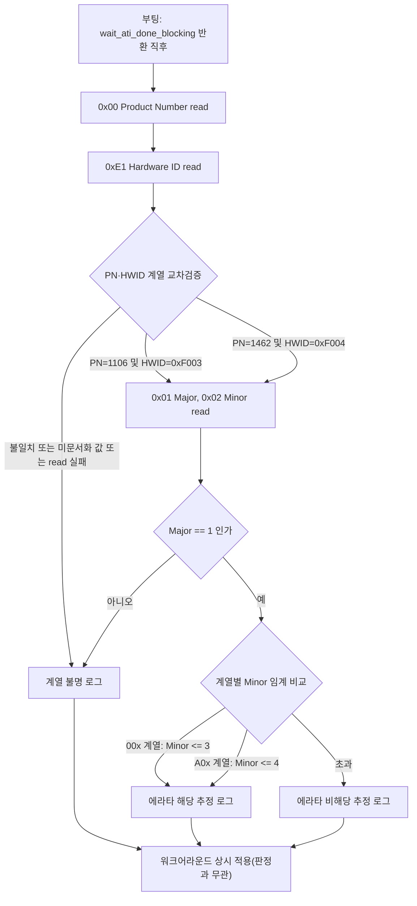

# 그라운드_1 · IC 버전·에라타 적용범위 실측 가능성

**TL;DR**: IQS323 부록A.1(0x00~0x02 버전)·A.37(0xE1 하드웨어ID)을 PDF·코드 원문으로 직접 대조해, 범용 read_register()로 추가 HW 없이 실측 가능함을 확인했다. 단 부록C 에라타 적용범위 표기(v1.3·v1.4)가 버전 레지스터값과 동일하다는 근거는 데이터시트에 미명시(정황적 추정)임을 확인했고, 부팅 1회 read+RTT 로그 판정 스펙과 판정 무관 상시 워크어라운드 적용을 제안한다.

> [!NOTE]
> 본 문서의 모든 데이터시트 인용은 `docs/참고/touch/iqs323_datasheet.pdf`를 `pdftotext -layout`(및 표 경계 확인용 `pdftotext -bbox`)로 직접 추출해 대조했다. 코드 인용은 `src/2__cm3/Cortex-M3-src/systemControl/tdc_touch_iqs323.c`(총 499줄)·`tdc_touch_iqs323.h`를 직접 읽어 확인했다. 확인 못 한 부분은 전부 **[미확인]**으로 명시했다.

---

## 확인_1 — 부록A.1 Version Information(0x00~0x09) 원문 대조

데이터시트 **PDF 49페이지**("Page 49 of 68" 푸터 직후, `A.1 Version Information (0x00 – 0x09)` 표제), `pdftotext -bbox`로 셀 좌표까지 교차검증한 결과:

| 주소 | 이름 | 오더코드 00x | 오더코드 A0x |
|---|---|---|---|
| 0x00 | Product Number | 1106 | 1462 |
| 0x01 | Major Version | 1 (원표에서 두 오더코드 값이 동일해 **1회만 병합 표기** — bbox 좌표상 "1" 텍스트가 00x·A0x 두 열 중간 x좌표에 단독 위치, 두 오더코드 모두 값 1) | |
| 0x02 | Minor Version | 3 | 4 |

- 0x03·0x04·0x05~0x09는 Reserved(값 없음).
- §8.5 Memory Map Addressing and Data(PDF 30페이지, `pdftotext -layout` 1742~1747행): "The memory map implements 8-bit addressing. Data is formatted as 16-bit words... The 16-bit data is sent in little endian byte order (least significant byte first)." → 각 주소는 16비트, LSB 먼저 전송. 이 규칙을 적용하면:
  - 0x00 Product Number: 00x=1106(0x0452, lsb=0x52·msb=0x04) / A0x=1462(0x05B6, lsb=0xB6·msb=0x05)
  - 0x01 Major Version: 1(0x0001, lsb=0x01·msb=0x00, 양쪽 공통)
  - 0x02 Minor Version: 00x=3(lsb=0x03·msb=0x00) / A0x=4(lsb=0x04·msb=0x00)

§9 메모리맵 주소표(PDF 35페이지, `pdftotext -layout` 2010행)에서도 "0x00 - 0x09 | Version details | - | See Appendix A.1"로 동일 범위를 Read Only로 명시 — 특수 언락이나 조건부 접근 규정 없음.

## 확인_2 — 부록A.37 Hardware ID(0xE1) 원문 대조

데이터시트 **PDF 64페이지**(`pdftotext -layout` 3794~3809행):

> "A.37 Hardware ID (0xE1)" ... "Bit 15-0: Hardware ID" · "0xF003: IQS3dd" · "0xF004: IQS3ed"

§9 메모리맵 주소표(PDF 37페이지, 2171행)에서도 "0xE1 | Hardware ID | - | See Appendix A.37"로 Read/Write 섹션("I²C Settings") 하위 표에 등재. 0x00~0x02와 마찬가지로 **표준 8비트 주소 + 16비트 word read**로 접근하는 일반 레지스터이며, 별도 잠금 해제·디버그 주소 요구 언급은 찾지 못했다(§8.2 I2C Address, PDF 30페이지: 디버그 I2C 주소는 "primary address의 LSB 반전" 규칙일 뿐, 특정 레지스터 접근 제한과는 무관).

> [!IMPORTANT]
> **발견_1 (00x/A0x ↔ IQS3dd/IQS3ed 교차 매핑은 단일 문장으로 명시되어 있지 않음, 정황 일치)**: A.1 표는 "00x/A0x" 열 이름을 쓰고 A.37은 "IQS3dd/IQS3ed" 이름을 쓴다 — 이 둘을 직접 등치하는 문장은 데이터시트에서 찾지 못했다[미확인]. 다만 A.7 "Prox Control **for IQS3dd**"·A.8 "Prox Control **for IQS3ed**"(같은 레지스터 0x32/0x42/0x52를 서로 다른 실리콘 리비전으로 설명, PDF 51~52페이지)와 §10.2 패키지 마킹 Figure 10.3(IQS3dd)·10.4(IQS3ed)를 볼 때 IQS3dd/IQS3ed가 "두 하드웨어 리비전"을 가리키는 이름이라는 점은 확인되나, 이것이 정확히 00x/A0x 오더코드 계열과 짝지어진다는 것은 오케스트레이터 공통 입력에 주어진 정보(및 정황적 일치)에 의존한다. 본 스펙에서는 아래 판정 로직대로 **Product Number(A.1)를 1차 판별 근거, Hardware ID(A.37)를 교차검증 근거**로 병행 사용해 이 개별 매핑 문장의 부재를 상호검증으로 보완한다.

## 확인_3 — read_register() 범용성: 코드 직접 대조

`tdc_touch_iqs323.c` 199~230행 `read_register()` 전문을 직접 읽었다.

```c
static bool read_register(uint8_t addr, uint8_t *p_lsb, uint8_t *p_msb)
{
    uint8_t reg = addr;
    uint8_t buf[2];

    if (!force_window_open()) { ... return false; }
    if (!i2c_write(&reg, 1)) { ... return false; }
    wait_window_closed(TDC_TOUCH_IQS323_MAX_WAIT_CLOSE_MS);

    if (!force_window_open()) { ... return false; }
    if (!i2c_read(buf, 2)) { ... return false; }
    *p_lsb = buf[0];
    *p_msb = buf[1];
    wait_window_closed(TDC_TOUCH_IQS323_MAX_WAIT_CLOSE_MS);
    return true;
}
```

`addr` 파라미터에 레지스터 주소별 분기·화이트리스트·범위 검사가 **전혀 없다** — 함수는 완전히 주소-불가지론적(register-address-agnostic)이다. 이미 이 함수는 0x10(REG_SYSTEM_STATUS)에 대해 `confirm_reset()`(246행)·`wait_ati_done_blocking()`(334행)·`tdc_touch_iqs323_read_status()`(353행)에서 반복 호출되고 있으므로, **0x00·0x01·0x02·0xE1을 인자로 넘기는 것만으로 추가 HW·프로토콜 변경 없이 즉시 동작**한다.

**결론**: 실측 가능성 — **가능(확정)**. 코드 수정 범위는 "새 호출 지점 추가"뿐이며 `read_register()` 자체·`force_window_open()`·`wait_window_closed()`·I2C 저수준 레이어는 무변경.

## 확인_4 — 현재 코드에 해당 read 부재 재확인(grep)

```
grep -n "0x00\b|0x01\b|0x02\b|0xE1\b|HARDWARE_ID|PRODUCT|VERSION" tdc_touch_iqs323.c tdc_touch_iqs323.h
grep -rn "0xE1|0xF003|0xF004|HARDWARE_ID" src/
```

- `tdc_touch_iqs323.c`의 `REG_*` 매크로 정의(17~34행) 목록: `REG_SYSTEM_STATUS(0x10)·REG_CH0_COUNTS(0x13)·REG_CH0_LTA(0x14)·REG_SENSOR0_SETUP(0x30)·REG_CONV_FREQ(0x31)·REG_SENSOR1_SETUP(0x40)·REG_SENSOR0_ATI_SETUP(0x36)·REG_SENSOR2_SETUP(0x50)·REG_CH0_PROX(0x61)·REG_CH0_TOUCH(0x62)·REG_BETA_COUNTS(0xB0)·REG_BETA_LTA_NORMAL(0xB1)·REG_BETA_LTA_FAST(0xB2)·REG_FAST_FILTER_BAND(0xB4)·REG_SYSTEM_CONTROL(0xC0)·REG_LP_REPORT_RATE(0xC2)·REG_PM_TIMEOUT(0xC5)·REG_EVENTS_ENABLE(0xD3)`. 0x00·0x01·0x02·0xE1는 **0건**.
- `src/` 전체에서 `0xE1`·`0xF003`·`0xF004`·`HARDWARE_ID` 리터럴 검색 결과 **0건**.
- 헤더(`tdc_touch_iqs323.h`) 공개 API(공개 6동작 + `public_touch_settings`)에도 버전/HWID 관련 항목 없음.

**결론**: 현재 코드에는 IC 버전·에라타 적용범위를 확인하는 로직이 **전무**함을 재확인.

## 확인_5 — 부록C "I²C Lock Up" 에라타 원문 대조

데이터시트 **PDF 67페이지**(`pdftotext -layout` 3911~3923행):

> "I²C Lock Up" · "Versions Affected: IQS323-00x v1.3 and below. IQS323-A0x v1.4 and below." · "Issue Description: In certain cases the IQS323 can enter a state in which all bytes read over I²C return a constant value. There is a higher likelihood of this occuring when using the force communications method described in Section 8.13." · "Recommended Workaround: At the end of every I²C communication, read one byte from a register that does not exist. If the returned value is not 0xEE, hard reset the IQS323 by following the guidelines in Section 6.6."

`docs/참고/touch/데이터시트/08_개정이력·이슈.md`의 기재 내용과 정확히 일치함을 확인했다.

> [!WARNING]
> **발견_2 (가장 중요) — "v1.3/v1.4" 적용범위 표기와 Major/Minor 버전 레지스터값의 등치는 데이터시트에 명시되어 있지 않음**: 부록B "Revision History"(PDF 65페이지)는 **데이터시트 문서 자체의 개정판**(v1.1 2022-08 ~ v1.11 2025-08, "Improve Sensor Setup section"·"Fix Swipe Enable description" 등 순수 문서/서술 변경 나열)이며 실리콘 변경 이력이 아니다 — `pdftotext -bbox`로 각 "vX.Y" 라벨의 y좌표가 자신의 변경사항 목록 블록 안에 위치(라벨이 자기 행 안에서 수직 중앙 정렬됨)함을 확인해, 이 문서 리비전 번호가 부록C의 "IQS323-00x v1.3"과 **같은 네임스페이스인지조차 datasheet 텍스트만으로는 직접 확정할 수 없음**을 재확인했다. 한편 A.1 표는 "Major Version=1(공통)·Minor Version=00x면 3, A0x면 4"를 명시한다. 부록C의 "v1.3"(00x)·"v1.4"(A0x)와 A.1의 "1.3"·"1.4"이 **자릿수까지 정확히 일치**하는 것은 강한 정황 증거이지만, 데이터시트 어디에도 "부록C의 vX.Y = 레지스터 0x01/0x02 값"이라고 명시한 문장은 없다[미확인]. 아래 스펙은 이 정황 일치를 **작업가설로 채택**하되, 판정 결과를 워크어라운드 적용 여부의 유일한 게이트로 쓰지 않도록 설계했다(하단 "한계 및 권고" 참조).

## 발견_3 — §8.10 "일반" 0xEE 규정과 부록C 에라타 워크어라운드의 구분

데이터시트 **PDF 31페이지**(`pdftotext -layout` 1815~1820행), §8.10 Invalid Communications Return:

> "The device will give an invalid communication response (0xEE) under the following conditions: The host is trying to read from a memory map register that does not exist. The host is trying to read from the device outside of a communication window (i.e. while RDY = high)."

이는 부록C 에라타와 **별개로 존재하는 일반 규정**이다. 현재 코드의 `confirm_reset()`(251행 `lsb == 0xEE && msb == 0xEE`)·`wait_ati_done_blocking()`(334행)·`tdc_touch_iqs323_read_status()`(357행)의 0xEE 글리치 검사는 **실재하는 레지스터(0x10)를 통신 윈도우 경계 부근에서 읽었을 때**(§8.10의 두 번째 조건, "윈도우 밖 read") 발생하는 정상적/일시적 현상에 대한 재시도 신호이며, 부록C 에라타의 "존재하지 않는 레지스터를 읽어 0xEE 아니면 하드리셋" 캐너리(§8.10의 첫 번째 조건을 의도적으로 이용하는 잠금 상태 탐지)와는 **서로 다른 메커니즘**이다. 후자(상시 캐너리 read)는 이번 역할(그라운드_1)이 아닌 후보_C2("Events + 에라타 워크어라운드 결합")의 스코프이므로 본 문서에서는 설계하지 않는다.

## 발견_4 (참고) — 현재 보드 I2C 주소로 본 오더코드 정황

`tdc_touch_iqs323.h` 28행: `#define TDC_TOUCH_IQS323_SLAVE_ADDR 0x44`. 데이터시트 Table 10.1 Ordering Code(PDF 38페이지, `pdftotext -layout` 2189~2198행)에 따르면 오더코드 "001"은 I2C 주소 0x58, "002"는 0x44(둘 다 Release UI, "00x" 계열), "A01"(Movement UI, "A0x" 계열)은 이 발췌 범위에서 주소가 확인되지 않았다[미확인]. 현재 코드의 슬레이브 주소 0x44는 오더코드 002와 일치 — **정황상 00x 계열일 가능성이 높으나, 이는 배선/주소 설정에 대한 간접 정황일 뿐 실제 실장 실리콘을 확정하지 않는다**(부품 대체·재작업 가능성 배제 못함). 최종 확정은 반드시 아래 레지스터 실측으로 이루어져야 한다는 점을 이 정황 자체가 뒷받침한다.

## 발견_5 — 진단 read 자체의 순환적 한계

`force_window_open()`(145~175행)은 RDY가 이미 OPEN이 아니면 §8.13 force communications(0xFF write)를 사용한다. 부록C는 "force communications 방법 사용 시 Lock-Up 발생 가능성↑"이라 명시하므로, 제안하는 진단 read 자체도 `read_register()`를 경유하는 한 **동일한 force-comm 경로**를 탄다. 만약 부팅 시점에 이미 Lock-Up 상태에 진입해 있다면, 이 진단 read가 반환하는 값도 신뢰할 수 없다(모든 read가 상수 반환되는 상태이므로 Product Number·Hardware ID도 실제 값이 아닌 그 상수를 반환할 수 있음). 즉 본 메커니즘은 **"평상시 어떤 실리콘 버전이 실장되어 있는가"를 SW만으로 확정**하는 것이지, **"지금 이 순간 Lock-Up 상태인가"를 탐지**하는 것이 아니다 — 후자는 매 통신 종료 시 비존재 레지스터 캐너리(발견_3, C2 스코프)가 전담해야 한다.

---

## 제안 스펙 — 부팅 1회성 IC 버전/에라타 적용범위 확인 메커니즘

### 레지스터 주소

| 주소 | 이름 | 판정 용도 |
|---|---|---|
| 0x00 | Product Number | 계열 1차 판별(1106=00x, 1462=A0x) |
| 0x01 | Major Version | 버전 임계 비교(공통값 1 확인) |
| 0x02 | Minor Version | 버전 임계 비교(00x 3 이하·A0x 4 이하 → 에라타 해당 추정) |
| 0xE1 | Hardware ID | 계열 교차검증(0xF003=IQS3dd/00x 추정, 0xF004=IQS3ed/A0x 추정) |

구현은 기존 `read_register(addr, &lsb, &msb)`를 **그대로 4회 호출**하는 것을 최소변경 기본안으로 제안한다(신규 저수준 코드 0줄). 0x00~0x02가 연속 주소이므로 §8.5의 auto-increment 규칙(2010행 "0x10 read → 다음 2바이트는 0x11")과 기존 `tdc_touch_iqs323_read_debug()`(369~398행, 0x13+0x14 4바이트 연속 read 선례)를 모사해 "0x00 주소 write 1회 + 6바이트 연속 read 1회"로 묶는 벌크 최적화안도 대안으로 제시하되, 이는 신규 저수준 코드가 필요하므로 **최소변경 기본안(4회 개별 호출) 우선을 권고**한다.

### 읽는 시점

두 후보를 검토했다.

- **옵션_1(권고)**: `tdc_touch_iqs323_apply_settings()`(400~460행) 내 `wait_ati_done_blocking()`(451행) 반환 **직후**, RESEED 트리거 write(453행, 0x58/0x07) **이전**. 이 시점은 `ati_active==0`이 실측으로 이미 확정된 뒤이므로 §8.4(PDF 30페이지, "Reset Event 비트가 set 아니면 ATI 진행 중 I2C 통신 disabled")의 제약과 전혀 무관하다 — INV-CTRL-1(Full ATI)이 이미 완결된 지점이라 간섭 여지가 구조적으로 없다.
- **옵션_2(대안)**: `confirm_reset()`(408행) 성공 직후, `sensor_setup()`(412행) 이전. 아직 어떤 ATI도 FW가 트리거하지 않은 시점이라 더 이른 안전지대이나, POR 직후 암묵적 Auto-ATI 가능성([미확인], 헤더 84행 주석 "IQS323 POR -> Auto-ATI"만 참고 가능)에 대한 완전한 배제까지는 확인하지 못했다.

**옵션_1을 권고한다** — ati_active==0이 실측으로 확정된 지점이라는 근거가 더 직접적이기 때문이다. 두 옵션 모두 "부팅 1회"이며 런타임 폴링 경로(`tdc_touch_iqs323_read_status()`)에는 절대 삽입하지 않는다.

### 판정 로직



의사코드(스펙 예시, 실제 구현은 별도 단계):

```c
/* 삽입 위치: wait_ati_done_blocking() 반환 직후, RESEED 트리거 이전 */
static void log_ic_version_once(void)
{
    uint8_t pn_l, pn_m, maj_l, maj_m, min_l, min_m, hw_l, hw_m;
    bool ok = true;

    ok &= read_register(0x00, &pn_l,  &pn_m);  /* Product Number */
    ok &= read_register(0x01, &maj_l, &maj_m); /* Major Version  */
    ok &= read_register(0x02, &min_l, &min_m); /* Minor Version  */
    ok &= read_register(0xE1, &hw_l,  &hw_m);  /* Hardware ID    */

    if (!ok)
    {
        ci_printw("[TOUCH] IC-ID: READ FAIL -> 판단불가, 워크어라운드 상시 적용 \r\n");
        return;
    }

    uint16_t pn  = (uint16_t) pn_l  | ((uint16_t) pn_m  << 8);
    uint16_t maj = (uint16_t) maj_l | ((uint16_t) maj_m << 8);
    uint16_t min = (uint16_t) min_l | ((uint16_t) min_m << 8);
    uint16_t hw  = (uint16_t) hw_l  | ((uint16_t) hw_m  << 8);

    ci_printi("[TOUCH] IC-ID: PN=%u MAJ=%u MIN=%u HWID=0x%04X \r\n", pn, maj, min, hw);

    bool family_00x = (pn == 1106) && (hw == 0xF003);
    bool family_A0x = (pn == 1462) && (hw == 0xF004);

    if (!family_00x && !family_A0x)
    {
        ci_printw("[TOUCH] IC-ID: 계열 불명(PN/HWID 불일치 또는 미문서화값) -> 판단불가 \r\n");
        return;
    }

    /* [미확인 전제] 부록C vX.Y == Major.Minor 레지스터값 이라는 가정 하의 잠정 판정 */
    bool maybe_affected = family_00x ? ((maj == 1) && (min <= 3))
                                      : ((maj == 1) && (min <= 4));

    ci_printi("[TOUCH] IC-ID: 계열=%s 에라타(I2C-LOCKUP) 추정=%s [주의: vX.Y=레지스터 매핑 미확인] \r\n",
              family_00x ? "00x(IQS3dd 추정)" : "A0x(IQS3ed 추정)",
              maybe_affected ? "해당" : "비해당");
}
```

`ci_printi`/`ci_printw`는 `ci_printf.h`(21행 `CI_PRINTF_INTERFACE_SEGGER_RTT`, 25행 `CI_PRINT_EABLE_INFO 1`)에서 이미 SEGGER RTT로 연결되어 있고 현재 빌드 설정에서 활성 상태임을 직접 확인했다 — "RTT 로그로 확정" 요건을 그대로 충족한다.

### 비용 추정

`read_register()` 1회는 내부적으로 `force_window_open()`(최악 `TDC_TOUCH_IQS323_MAX_WAIT_OPEN_MS`=45ms) + `wait_window_closed()`(최악 `TDC_TOUCH_IQS323_MAX_WAIT_CLOSE_MS`=20ms)를 addr-write·data-read 두 단계에서 각 1회씩, 총 2회 수행한다(헤더 32~33행 상수). 4회 개별 호출 시 이론적 최악값은 `4 × 2 × (45+20)ms ≈ 520ms`이나, RDY가 이미 열려 있으면 `force_window_open()`이 즉시 반환(149~152행)하므로 실측치는 이보다 훨씬 작을 것으로 예상된다[정밀 정량화는 그라운드_2 스코프]. 부팅 시 이미 `wait_ati_done_blocking()`(최대 약 1.25초, 332행 주석) 블로킹을 거친 뒤이므로, 이 진단이 추가하는 지연은 상대적으로 작다.

### 한계 및 권고

> [!IMPORTANT]
> 1. **판정 결과를 워크어라운드 적용 여부의 게이트로 쓰지 말 것을 권고한다.** 발견_2에서 밝힌 대로 "부록C vX.Y = 레지스터 값" 등치가 데이터시트에 명시되어 있지 않고, 발견_5에서 밝힌 대로 이미 Lock-Up 상태라면 진단 read 자체가 오염될 수 있다. 워크어라운드(매 통신 끝 비존재 레지스터 read + 0xEE 검사, C2 스코프) 비용이 낮으므로 **판정 결과와 무관하게 상시 적용**하고, 본 메커니즘은 순수 진단/가시성(어떤 실리콘이 실장되어 있는지 엔지니어가 RTT로 확인·감사할 수 있게 하는 용도)으로 한정할 것을 권고한다.
> 2. 계열 불명·read 실패 등 판단불가 상황에서는 **안전측(에라타 해당으로 간주)** 으로 폴백하는 것이 fail-safe 원칙에 부합한다.
> 3. Major Version이 1이 아닌 경우(현재 A.1 문서상 존재하지 않는 조합)는 신규 실리콘 리비전일 가능성이 있으므로 "판단불가"로 명시적으로 분리 로그하고 위 1항과 동일하게 처리한다.
> 4. INV-CTRL-1~3 코드훅과의 상세 교차검증은 그라운드_3·검증_3 스코프이며, 본 문서는 삽입 시점이 기존 코드의 ATI-완료 확인 지점 이후라는 사실관계만 근거로 제시했다.

---

## 결론 요약

| 항목 | 결론 |
|---|---|
| 0x00/0x01/0x02/0xE1 데이터시트 정의 | 원문 PDF(49·64페이지) 직접 대조로 확인 완료 |
| read_register()로 추가 HW 없이 실측 가능한가 | **가능** — 함수가 완전히 주소-불가지론적임을 코드 직접 대조로 확인 |
| 현재 코드에 해당 read 존재 여부 | **없음** — grep 재확인 완료 |
| 부록C 에라타 적용범위 원문 | "IQS323-00x v1.3 이하·IQS323-A0x v1.4 이하", PDF 67페이지 직접 대조로 확인 완료 |
| vX.Y ↔ Major/Minor 레지스터값 등치 | **[미확인]** — 정황(자릿수 일치)은 강하나 명시 문장 없음. 작업가설로만 채택 |
| 00x/A0x ↔ IQS3dd/IQS3ed 명칭 매핑 | **[미확인]** — 단일 문장 확인 못함, 정황 일치·오케스트레이터 공통 입력 근거로 사용 |
| 제안 메커니즘 용도 | 부팅 1회 진단/RTT 로그(가시성) — 워크어라운드 게이트로는 비권고 |
