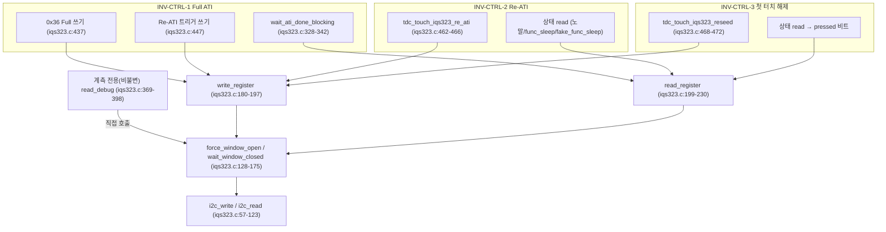

# 03 · G3 — 3불변식 코드훅 재확인 (이벤트 모드 채택 딥다이브)

**TL;DR**: 선행 G3 문서를 현재 코드로 재검증한 결과 INV-CTRL-1~3 인용 파일·라인은 전부 일치했으나, `TDC_TOUCH_ULP_FORCE_RESEED_CNT` 실제값은 100(선행 문서는 50으로 오인용)이다. `force_window_open`/`wait_window_closed`는 3불변식 전 경로가 예외 없이 경유하는 유일 관문이라, 재설계는 계약을 안 깨도 신뢰도·타이밍으로 간접 영향을 줄 수 있다는 위험 노트를 덧붙였다.

## 0. 결론 먼저

1. **선행 문서(`docs/tasks/touch/20260703_touch-heisenberg-config-reexplore/에이전트-로그/03_G3_3불변식코드훅.md`)를 맹신하지 않고 grep·Read·git log로 전부 독립 재검증**했다. 결과: 이 문서가 인용한 약 30여 개 파일:라인 좌표 중 **불변식 코드훅에 관한 것은 전부 현재 코드와 정확히 일치**한다(문자 그대로 같은 줄 번호). 최근 병합(`929ab16`, `89511f1` 등 무선 계측 인프라 추가)이 같은 파일들을 건드렸음에도 이 특정 라인들은 이동하지 않았다.
2. 단, 파생 시간 상수 하나에서 **잘못 인용된 수치**를 발견해 정정한다: `TDC_TOUCH_ULP_FORCE_RESEED_CNT`의 실제값은 **100**이다(선행 문서는 "50"으로 인용). 원인은 `tdc_touch_time.h`에 남아있는 stale 주석("@200 = 50")을 그대로 옮긴 것으로 추정된다(§5 발견_2 참조). 실시간 환산값(10초)은 선행 문서 서술이 맞다 — 틀린 것은 "카운트 100회" 대신 적은 "50회"라는 숫자뿐이다.
3. **위험 노트 결론**: `write_register()`/`read_register()`(그리고 최근 추가된 계측용 `read_debug()`)는 예외 없이 `force_window_open()`/`wait_window_closed()`를 경유하며, 이 레이어를 우회하는 코드 경로는 저장소 전체에 0건이다(grep 확인). 따라서 이번 작업이 제안하는 `force_window_open()`/`wait_window_closed()` 프로토콜 재설계는 3불변식의 "계약 문구"(§1~3 표) 자체를 깨지 않고도, **신뢰도(쓰기 성공률)·타이밍(디바운스 확정 지연)을 통해 간접적으로 영향을 줄 수 있는 구조**다. 코드는 전 구간에서 "실패 시 잘못된 행동을 하기보다 행동을 미루는" fail-safe 경향이 확인되므로 안전 방향의 오작동 위험은 낮지만, **가용성/응답성 저하**는 후보가 반드시 정량적으로 점검해야 한다(§6).

## 1. 검증 방법

지정 4개 대상(`tdc_touch_iqs323.c` 499줄·`tdc_touch.c` 433줄·`tdc_touch_logic.c` 193줄·`main.c` 1254줄, 관련 헤더 `tdc_touch_iqs323.h`·`tdc_touch_logic.h`·`tdc_touch_time.h`·`tdc_touch_config.h` 포함) 전체를 `Read`로 통독하고, 선행 문서가 인용한 모든 file:line을 `grep -n`으로 교차 확인했다. 시간 상수 파생값은 `TDC_TIME_TO_CNT` 매크로 정의(`(ms + interval_ms - 1) / interval_ms`)를 그대로 파이썬으로 재계산해 검증했다(gcc가 이 환경에 없어 전처리기 직접 실행은 불가, 수식 자체가 단순 정수 나눗셈이라 수동 재현으로 충분하다고 판단). 의심스러운 수치는 `git log -p`로 변경 이력을 추적해 근거를 확보했다. 데이터시트 원문(Streaming/Events RDY assert 의미, 부록C I²C Lock-Up)은 본 세션에서 재대조하지 않았다 — 공통 입력(선행 세션에서 원문 대조 완료로 명시된 배경)을 그대로 인용하며, 이는 G1 소관이다.

## 2. INV-CTRL-1 — Full ATI (재확인)

| 항목 | 위치 | 재확인 결과 |
|---|---|---|
| Full 모드 write (0x36=0x040C) | `tdc_touch_iqs323.c:437` | **일치**. `write_register(REG_SENSOR0_ATI_SETUP, 0x0C, 0x04)`. `REG_SENSOR0_ATI_SETUP`(=0x36) 관련 write는 코드 전체에서 이 한 곳뿐(재확인: `grep -n "0x36\|REG_SENSOR0_ATI_SETUP"` 결과 정의·주석 제외 write 호출 1건) |
| 부팅 Re-ATI 트리거 | `tdc_touch_iqs323.c:447` | **일치**. `write_register(REG_SYSTEM_CONTROL, 0x54, 0x07)` |
| 완료 블로킹 대기 | `wait_ati_done_blocking()` `:328~342`, 호출 `:451` | **일치**. `REG_SYSTEM_STATUS` 폴링, `ati_active`(bit5)==0 확인, 최대 25회×50배수 딜레이. 반환값은 `:451 (void) wait_ati_done_blocking();`로 명시적 폐기(실패해도 다음 단계 진행) |
| 컨테이너 함수 | `tdc_touch_iqs323_apply_settings()` `iqs323.c:400~460` | **일치**(줄 번호까지 동일). ack_reset→confirm_reset→sensor_setup→touch_settings→prox→events_enable→beta_power_settings→0x36 Full→Re-ATI 트리거→wait→RESEED(`:453`) 순서 고정 |

**부팅마다 재실행 호출 체인 재확인**(전부 일치):

| 단계 | 위치 | 인용 |
|---|---|---|
| 진입점 | `main.c:373` | `Initialize();` |
| MCLR 트리거 | `initialize.c:448` | `tdc_touch_init_begin();` |
| 폴링 진입 | `main.c:452` | `powerButtonPushed = tdc_touch_process();` |
| init FSM 분기 | `tdc_touch.c:282~286` | `case TDC_TOUCH_INIT_MCLR_DONE: { try_finish_init(); return false; }` |
| 완료 판정 함수 | `tdc_touch.c:149~178`(`try_finish_init`), 판정 `:151` | `if (!tdc_touch_iqs323_is_ati_done())` |
| 본체 호출 | `tdc_touch.c:161` | `tdc_touch_iqs323_apply_settings(); /* Full ATI / 임계 / Beta / Power / 부팅 Re-ATI */` |

"절전 기상 = 하드 리부팅(소프트 레주메 아님)"이라 위 체인이 절전 기상마다 처음부터 재실행된다는 선행 서술도 3곳 전부 재확인했다: `iqs323.c:497~499`("절전도 노말과 동일한 IQS323 설정...을 그대로 사용한다"), `main.c:845~846`(`fake_func_sleep`)·`main.c:1215~1216`(`func_sleep`)은 두 곳 모두 "절전 IQS323 설정은 노말과 동일하게 유지" 문구가 **글자 그대로** 동일하게 남아있다 — 3곳 취지는 같으나 iqs323.c 쪽만 표현이 다르다는 점을 정확히 밝혀둔다.

**자유/불변 경계**: 변경 없음. 0x36과 그 도달 시퀀스(437·447·451/453) 자체가 불변이고, `sensor_setup()`(266~282)·`touch_settings()`(284~290)·`beta_power_settings()`(309~325)는 별개 레지스터라 여전히 자유.

## 3. INV-CTRL-2 — ATI 에러 처리 Re-ATI (재확인)

**3개 독립 구현 사이트 — 전부 파일:라인까지 일치**:

| 사이트 | 게이트 조건 | Re-ATI 발행 | 재시도 상한 | 재확인 |
|---|---|---|---|---|
| 노말 FSM | `tdc_touch_logic.c:154~161` | `tdc_touch.c:380~393`(switch) → `:391` | 무제한(쿨다운 2000ms마다 재평가) | **일치** |
| `func_sleep()` | `tdc_touch_sleep_handle_ati_error()` `main.c:1062~1092`, 조건 `:1064` | `:1084` | 5회(`:1066`) 초과 시 `:1078 SYS_WATCHDOG_RESET()` | **일치** |
| `fake_func_sleep()` | 인라인 `main.c:945~972`, 조건 `:947` | `:960` | 5회(`:949`) 초과 시 `:953 SYS_WATCHDOG_RESET()` — 주석처리 안 됨, 살아있음 | **일치** |

저수준 공통 `tdc_touch_iqs323_re_ati()` = `iqs323.c:462~466`, `write_register(REG_SYSTEM_CONTROL, 0x54, 0x07)` — 재확인 완료.

**자유/불변 경계**: 변경 없음. 재시도 횟수(5)·쿨다운(2000ms)·비대칭(노말=`NOT_TOUCH`일 때만, 절전 2곳=터치 상태 무관 무조건)은 여전히 자유 레버, 불변은 "3개 사이트 각각 `ati_error && !ati_active` 감지 시 반드시 `tdc_touch_iqs323_re_ati()` 발행"이라는 사실 하나.

## 4. INV-CTRL-3 — 첫 터치 해제 감지 (재확인)

**3개 독립 구현 사이트 — 전부 파일:라인까지 일치**:

| 사이트 | 진입 | 해제(디바운스) | 해제 시 부수효과 | 재확인 |
|---|---|---|---|---|
| 노말 `boot_ignore` | `tdc_touch.c:172~177` → `tdc_touch_logic_set_boot_ignore()` `logic.c:77~83` | 게이트 로직 `logic.c:119~152`, 해제 판정 `:127~131`, 연속 not-pressed **3폴링** | 없음(로그만) | **일치** |
| `func_sleep()` `sleep_ignore` | 지역변수 `main.c:877`(무조건 true) | 헬퍼 `tdc_touch_sleep_handle_notouch_gate()` `main.c:1095~1122`, 해제 `:1102~1107`, 연속 NOT_TOUCH **3샘플** | RESEED 발행(`:1104`) | **일치** |
| `fake_func_sleep()` | 지역변수(`:877` 상당, 인라인) 무조건 true | 인라인 `main.c:974~1001`, 해제 `:981~986` | RESEED 발행(`:983`) | **일치** |

공통 안전장치도 재확인: 노말 5000ms 경고만(`TDC_TOUCH_BOOT_WARN_MS`, `logic.c:137~144`, 게이트 안 풂), 절전 2곳은 **10000ms마다 RESEED 반복**(`main.c:993~1000` / 헬퍼 `:1114~1121`) — 단 이 카운트 상수(`TDC_TOUCH_ULP_FORCE_RESEED_CNT`)의 실제값은 §0-2·§5 발견_2 참조(선행 문서 "50"은 정정 대상, 실제 100).

**불변**: (a) 디바운스 카운트 ≥1 유지, (b) 절전 2곳은 해제 확정 시 RESEED 반드시 동반, (c) 강제타임아웃 경로는 게이트를 열지 않고 RESEED만 반복 — 전부 코드로 재확인.

**신규 발견(선행 문서에 없던 비대칭)**: 노말 경로는 `tdc_touch_logic.c:97~107`의 read-fail hold(연속 실패 ≤20폴링=2000ms 이내면 `boot_release_cnt`를 건드리지 않고 그대로 얼림)가 boot_ignore 디바운스보다 앞단에서 짧은 통신 실패를 흡수한다. 반면 절전 `sleep_ignore`의 `notouch_cnt`는 이런 hold 없이 **매 사이클 `ok`(read 성공 여부)가 false이기만 해도 즉시 0으로 리셋**된다(`main.c:988~991`, 헬퍼 `:1109~1112`). 즉 절전측 첫-해제-확정 로직이 노말측보다 통신 신뢰도 저하에 구조적으로 더 취약하다 — §5 위험 노트 핵심 근거.

## 5. 선행 문서 대비 발견 사항

**발견_1 (전면 일치)**: 위 §2~4의 모든 인용 좌표(약 30여 개)가 현재 코드와 정확히 일치한다. `tdc_touch_iqs323.c`/`tdc_touch.c`/`tdc_touch_logic.c`/`main.c` 전체는 최근(2026-07-01~07-03) 무선 계측 인프라 커밋(`65c83c7`·`89511f1`·`aeaf46a`·`47a96d8`·`82e9d37`)으로 활발히 변경되었음에도, 불변식 코드훅 자체는 단 한 줄도 이동하지 않았다.

**발견_2 (수치 정정)**: `TDC_TOUCH_ULP_FORCE_RESEED_CNT` 실제값 = **100**(선행 문서 인용 "50"은 정정 필요). 근거:
- 정의: `tdc_touch_time.h:46~47` `TDC_TIME_TO_CNT(TDC_TOUCH_ULP_FORCE_RESEED_MS, TDC_TOUCH_ULP_WAKE_MS)`
- 현재 값: `TDC_TOUCH_ULP_FORCE_RESEED_MS = 10000`(`:41`), `TDC_TOUCH_ULP_WAKE_MS = 100`(`:37`, HW 타이머 `PRESCALE_1×(3999+1)/40=100.0ms`로 `:51~56`에 재확인 주석 있음)
- 계산: `(10000 + 100 - 1) / 100 = 100`(정수 나눗셈)
- 원인 추정: 같은 줄의 trailing 주석이 `/* @200 = 50 */`로 남아있다 — `git show 2064993`(2026-07-01, "노말·절전 폴링 100ms 통일") 확인 결과 이 커밋이 `TDC_TOUCH_ULP_WAKE_MS`를 200→100으로 바꾸며 "파생 CNT 자동 조정(ms 고정, 샘플수만 조정)"이라 명시했으나, 예시 trailing 주석은 갱신하지 않았다. 실제 계산값은 100인데 주석은 200 기준 예시(50)를 그대로 남긴 것 — 선행 문서가 이 주석을 그대로 인용한 것으로 추정된다. **실시간 환산(10초)은 불변이며 정정 대상이 아니다** — 정정 대상은 "카운트 100회"라는 숫자뿐이다.

**발견_3 (부가) — stale 주석 군집**: 같은 종류의 "`@200 = N`" 형태 trailing 주석이 `tdc_touch_time.h` 5곳(`:29~30` RE_ATI_COOLDOWN, `:33~34` BOOT_RELEASE_DEBOUNCE, `:44~45` ULP_NOTOUCH_DEBOUNCE, `:46~47` ULP_FORCE_RESEED, `:48~49` ULP_REBOOT_TOUCH)에 남아있고, 대응하는 산문 설명도 `tdc_touch_logic.c:123`("400ms = 2폴링")과 `main.c:873`·`:1167`(둘 다 "400ms(2폴링)")에 동일 패턴으로 남아있다. 이 문구들은 현재 매크로 실값(예: BOOT_RELEASE_DEBOUNCE는 300ms/3폴링, ULP_NOTOUCH_DEBOUNCE도 300ms/3폴링)과 다르다. **매크로 자체는 `TDC_TIME_TO_CNT`로 자동 파생되어 실제 동작은 정확하다** — 이 발견은 순수 주석/문서 신뢰도 문제이지 동작 결함이 아니다. 다만 사람이 코드를 읽고 수치를 인용할 때(이번처럼) 함정이 될 수 있어 명시해 둔다.

**발견_4 (부가) — 미사용 매크로**: `TDC_TOUCH_RE_ATI_COOLDOWN_CNT`(`time.h:29~30`)는 정의만 있고 `.c` 파일 전체에서 실사용처가 0건이다(재확인: `grep -rn` 결과 정의 위치만 매치). 실제 Re-ATI 쿨다운 게이트(`logic.c:157`)는 원시 ms 절대시각 비교(`in->now_ms >= st->re_ati_cooldown_until_ms`)를 쓰지, 이 카운트 매크로를 참조하지 않는다. 기능 영향은 없다.

**발견_5 (범위 확장 필요성) — `read_debug()`는 선행 문서 범위 밖이지만 위험 노트에는 포함 필요**: `tdc_touch_iqs323_read_debug()`(`iqs323.c:369~398`)는 커밋 `65c83c7`(2026-07-01)에서 추가된, LTA/Counts 계측 전용 함수다. 선행 20260703 문서가 이를 언급하지 않은 것은 타당하다(불변식이 아니므로). 그러나 이 함수도 `force_window_open()`/`wait_window_closed()`를 **직접 호출**하며(`:380`·`:385`·`:387`·`:392`), `TDC_TOUCH_DEBUG_PRINT_ENABLE` 기본값이 **1**(`tdc_touch_config.h:22`)이라 매 노말 폴링(`tdc_touch.c:311~338`)과 매 절전 웨이크(`main.c:1037~1050`, `fake_func_sleep` 인라인 `:912~943`)마다 이미 활성 상태로 호출되고 있다. 프로토콜 재설계의 트래픽 영향 분석에는 이 함수가 반드시 포함되어야 한다(§6-5).

## 6. 위험 노트 — force_window_open()/wait_window_closed() 프로토콜 재설계가 3불변식에 미치는 간접 영향

전제: `tdc_touch_iqs323.c` 자신의 헤더 주석(`:6~8`)이 이미 계층 구조를 명시한다 — "내부 static 3층(아래->위): i2c_write/read -> force_window_open/wait_window_closed -> write_register/read_register." 이 계층 구조를 코드로 재확인한 결과가 아래 위험 노트의 전제다.

**위험_1 (구조적 결합 — 안전한 우회로가 없다)**: `write_register()`/`read_register()`를 호출하는 코드는 저장소 전체에서 `tdc_touch_iqs323.c` 자신뿐이다(재확인: `grep -rn "write_register\|read_register" --include=*.c .` 결과 매치 파일이 `tdc_touch_iqs323.c` 하나). `REG_SYSTEM_CONTROL`(0xC0) write 6곳(`:237·318·447·453·465·471`) 전부, `REG_SENSOR0_ATI_SETUP`(0x36) write 1곳(`:437`), 상태 read(`read_status`, 3사이트 공용) 전부가 이 두 함수를 경유하고, 이 두 함수는 각각 force_window_open을 1회(write) 또는 2회(read, addr phase+data phase) 무조건 호출한다(재확인: `write_register` `:184`, `read_register` `:204`·`:216`). 즉 **3불변식 중 어느 것도 이 레이어를 우회할 수 없다** — 프로토콜을 재설계하면 예외 없이 3불변식 전부의 I/O 경로가 바뀐다.

**위험_2 (INV-CTRL-1, 단발성 write에 재시도가 없다)**: `apply_settings()`의 0x36 write(`:437`)·Re-ATI 트리거 write(`:447`)·RESEED write(`:453`)는 실패해도 `ci_printe` 로그만 남기고(`:438~440`,`:448~450`,`:454~456`) 다음 단계로 그대로 진행한다(재시도·중단 없음, 재확인). `wait_ati_done_blocking()`의 반환값 자체도 `:451`에서 `(void)`로 명시 폐기된다. → 프로토콜 재설계로 `force_window_open()`의 성공률이 지금보다 떨어지면, 부팅마다 실행되는 이 세 write 중 하나가 "조용히"(로그 한 줄 외에는 아무 신호 없이) IC에 도달하지 못할 확률이 지금보다 커진다. 이는 계약 위반(불변식 자체가 깨짐)으로 이어질 수 있는 유일한 위험 지점이다 — 나머지는 대부분 "지연"으로 열화된다.

**위험_3 (INV-CTRL-2, Events 모드 채택 시 에라타 노출 증가 가능성 + 감지·복구 로직 부재)**: `force_window_open()`의 조기반환(`:149~152`, RDY가 이미 OPEN이면 0xFF 강제쓰기 생략)은 현재 코드가 Streaming 모드로 남아있는 한, RDY가 Report Rate마다 자동 assert되어 자주 적중한다는 전제 위에서 성립한다. 0xC0 write 6곳의 현재 hex 리터럴 값(`:237`=0x01/0x00,`:318`=0x50/0x07,`:447`=0x54/0x07,`:453`=0x58/0x07,`:465`=0x54/0x07,`:471`=0x58/0x07, LSB/MSB 순)은 재확인했다 — 이 값들이 공통 입력이 서술한 "전부 bit7=0(Streaming)" 상태에 부합한다는 점은 공통 입력을 그대로 신뢰한 것이고, 16비트 레지스터 중 정확히 어느 바이트·어느 비트가 "bit7"에 해당하는지의 데이터시트 비트맵 재대조는 본 노드가 이번 세션에 직접 수행하지 않았다(G1 소관). Streaming/Events RDY assert 의미 자체도 공통 입력이 인용한 데이터시트 사실이다. 이벤트 모드로 전환하면 이 조기반환 적중률이 떨어져 0xFF 강제쓰기가 상시화될 가능성이 있고, 공통 입력은 이것이 부록C I²C Lock-Up 에라타 노출 증가와 연결된다고 명시한다. 본 노드가 코드 레벨에서 재확인한 사실은: **부록C 워크어라운드(통신 끝마다 비존재 레지스터 1바이트 read 후 0xEE 아니면 하드리셋)에 해당하는 로직이 현재 코드에 0건**이라는 것이다(재확인: `read_status`의 `:357`, `confirm_reset`의 `:251` 두 곳의 0xEE/0xEE 검사는 전혀 다른 용도의 기존 "글리치" 방어이지, 비존재 레지스터를 읽어 Lock-Up 여부를 판별하는 로직이 아니다 — 둘 다 REG_SYSTEM_STATUS라는 **실재하는** 레지스터를 읽는다). → [추론] Lock-Up이 발생하면 이후 read가 "정상 반환되지만 값이 고정"될 수 있어(공통 입력 인용: "모든 read byte가 상수 반환"), `ati_error`/`pressed` 비트가 고정값으로 굳을 가능성을 배제할 수 없고, 이 경우 INV-CTRL-2의 구제 수단(`re_ati()` 재발행)이 조건 자체(`ati_error` 비트)가 고정되어 발동하지 않거나, 발동해도 write가 도달하지 않아 무력화될 수 있다. 현재 코드의 유일한 최종 탈출구는 절전 2곳의 "5회 재시도 후 `SYS_WATCHDOG_RESET()`"(`:949~953`/`:1066~1078`)인데, 이마저 매 사이클 `ok && ati_error && !ati_active` 성립이 전제다(`:947`/`:1064`) — Lock-Up으로 `ati_error`가 고정 0으로 읽히면 이 조건 자체가 성립하지 않아 탈출 경로도 못 탄다[추론, 미확인 — 실제 Lock-Up 시 어느 비트가 어떤 값으로 고정되는지는 데이터시트 부록C 원문 재대조가 필요하며 이는 G1 소관].

**위험_4 (INV-CTRL-3, 절전측 디바운스가 노말측보다 통신 신뢰도에 더 취약)**: §4 "신규 발견"에서 확인한 비대칭 — 노말 `boot_ignore`는 read-fail hold(2000ms)가 짧은 통신 실패를 흡수(카운터를 얼릴 뿐 리셋 안 함)하지만, 절전 `sleep_ignore`의 `notouch_cnt`는 이런 hold 없이 매 사이클 `ok==false`만으로 즉시 0 리셋된다. → 프로토콜 재설계로 read 실패율이 오르면 절전측 "노터치 확정"이 노말측보다 훨씬 쉽게 지연된다. 실패율이 충분히 높아지면 `notouch_cnt`가 3(`TDC_TOUCH_ULP_NOTOUCH_DEBOUNCE_CNT`)에 도달하기 전에 계속 리셋되어 게이트가 사실상 열리지 않을 수 있다. 이때 10초 강제 리시드(`TDC_TOUCH_ULP_FORCE_RESEED_CNT`, 실제 100 — §0-2)는 RESEED만 반복 발행할 뿐 `sleep_ignore` 변수 자체는 여전히 건드리지 않는다(재확인: `main.c:993~1000`·헬퍼 `:1114~1121` 어디에도 `sleep_ignore = false` 대입 없음). 즉 "계약 위반(오탐)은 없지만 정상 기능이 무기한 지연"되는 실패 모드가 이론상 가능하다 — 이 값을 정량화(실패율 대비 지연시간)하는 것은 V3/C2·C3 소관이나, **어디를 봐야 하는지 좌표는 위 §4·§6-4가 제공한다**.

**위험_5 (부가 트래픽 — 계측 기능이 이미 기본 활성 상태로 같은 레이어를 두 배로 쓰고 있다)**: `TDC_TOUCH_DEBUG_PRINT_ENABLE` 기본값 1(`tdc_touch_config.h:22`)로, 매 노말 폴링과 매 절전 웨이크마다 `read_status()`(2쌍) 외에 `read_debug()`(추가 2쌍)가 이미 호출되어, force_window_open/wait_window_closed 왕복이 read 한정으로도 이미 사이클당 2배(4쌍)로 늘어나 있다(재확인: §5 발견_5). → 프로토콜 재설계·트래픽 정량화(G2 소관)는 이 "이미 기본 활성인 계측 부하"를 baseline에 반드시 포함해야 한다 — 순수 FSM 트래픽만 계산하면 실제 부하를 과소평가한다.

**위험_6 (종합)**: 위 위험_1~5 중 §1~3 표에서 정의한 "최소 계약" 문구 자체를 직접 깨뜨리는 것은 위험_2(단발성 write 무재시도) 하나뿐이다. 나머지(위험_3~5)는 코드가 광범위하게 채택한 "실패 시 행동을 잘못 취하기보다 미루는" fail-safe 패턴 덕에 **오작동보다는 지연·가용성 저하로 열화**되는 구조다. 그러나 계약 준수와 타이밍상 실용성은 별개다 — force_window_open()/wait_window_closed() 자체는 이번 작업 범위상 완전히 자유롭게 재설계 가능하지만(공통 입력이 명시), 어떤 재설계안이든 **위 6개 위험 지점 각각에 대해 "재설계 후 예상 실패율에서도 3계약이 실용적 시간 내에 이행되는가"**를 후보(C1~C5)가 명시적으로 답해야 하고, 검증(V3)이 반드시 재확인해야 한다.

## 7. 자유 변수 목록 (변경 없음, 재확인)

INV-CTRL-1~3의 코드훅(§2~4에 나열된 라인)을 건드리지 않는 한 아래는 여전히 전부 자유다 — force_window_open()/wait_window_closed() 프로토콜 자체(조기반환 유무·타임아웃 값·2-phase 구조·에라타 워크어라운드 추가 등)를 포함한다. 단, §6의 위험 노트가 지적하듯 "자유"는 "무해"를 뜻하지 않는다 — 계약을 문자 그대로 지키면서도 신뢰도·타이밍 열화를 통해 실질적 영향을 줄 수 있다.

- 레지스터값: 0x30/0x40/0x50, 0x61/0x62, 0xB0/B1/B2/B4, 0x31, 0xC2/0xC5, 0xD3(이벤트enable — 이번 작업의 직접 대상).
- 채널 수·측정 방식: 변경 없음(선행 문서 §5 그대로).
- **force_window_open()/wait_window_closed() 프로토콜 자체**: 조기반환 로직(`:149~152`)·타임아웃 상수(`TDC_TOUCH_IQS323_MAX_WAIT_OPEN_MS=45`·`MAX_WAIT_CLOSE_MS=20`, `iqs323.h:32~33`)·2-phase read 구조 전부 자유. 단 위험_1~6이 지적한 간접 영향을 재설계 시 반드시 고려.

## 8. 미확인 목록

- 0x36이 CH0 전용인지 전 채널 공용 ATI 모드 레지스터인지, CH1 전용 ATI 레지스터 존재 여부 — [미확인](G1/G2 소관, 선행 문서와 동일하게 미해결 상태 재확인).
- `ati_error` 비트가 "전역(채널 비구분)"이라는 서술 — 코드 근거는 "채널별 구분 로직이 전무하다"는 사실뿐이고, "전역"이라는 명명 자체는 데이터시트/문서 인용이다(본 세션 PDF 재대조 안 함).
- `wait_ati_done_blocking()`의 상한 25×50배수 딜레이의 실제 ms 값 — `TDC_TOUCH_IQS323_DEFAULT_DELAY_MS = SystemCoreClock/1000`(`iqs323.h:36`)에 의존하며, 본 세션에서 `SystemCoreClock` 실제값과 `Sys_Delay()`의 인자 단위(ms 인자인지 클럭사이클 인자인지)를 확인하려 했으나 이 프로젝트에 포함된 헤더에서 정의를 찾지 못했다(벤더 SDK 쪽 정의로 추정) — [미확인], 선행 문서와 동일하게 "코드 주석 인용치이지 재계산 검증치 아님" 상태 유지.
- Lock-Up 발생 시 IQS323이 System Status(0x10) read에 대해 구체적으로 어떤 고정값을 반환하는지(§6 위험_3의 전제) — [미확인], 데이터시트 부록C 원문 재대조 필요(G1 소관).
- `TDC_TOUCH_ULP_FORCE_RESEED_CNT` 외 나머지 stale 주석(§5 발견_3)이 정확히 언제·어느 커밋에서부터 실제값과 어긋나기 시작했는지의 완전한 개별 이력 — 대표 사례(`TDC_TOUCH_ULP_WAKE_MS` 200→100, 커밋 `2064993`)만 확정했고 나머지는 유사 패턴으로 추정할 뿐 각각 재구성하지는 않았다(본 노드 범위 밖 판단).
