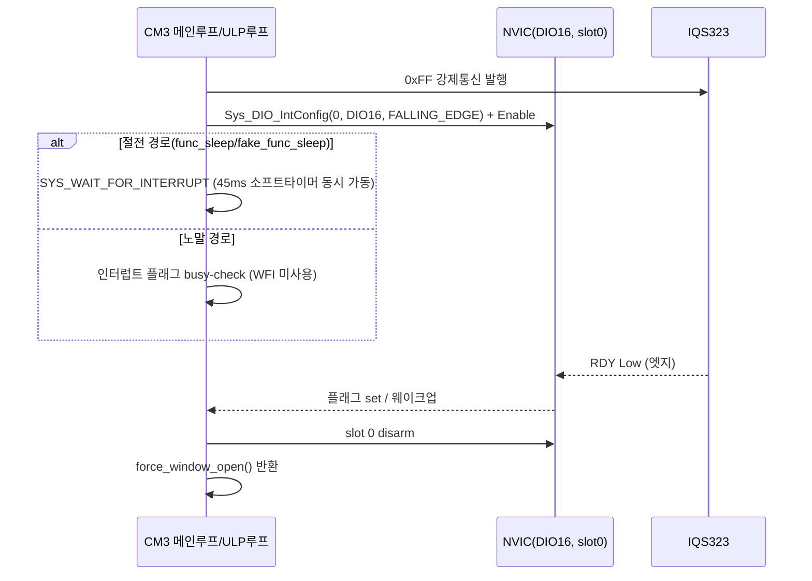

```

**TL;DR**: RDY(DIO16) 인터럽트화는 `Gen1_5/ci_dio.c`에 실재하는 2슬롯 DIO 인터럽트 인프라(현재 비활성·미소비)를 재사용해 SW-only로 가능하나, DIO16이 IQS323 MCLR과 배선 공유되는 점·L1 공유 구조상 노말모드 WFI 리스크가 새로 확인됐다. `MAX_WAIT_OPEN_MS=45ms`는 데이터시트 t_wait 상한과 정확히 같아 마진이 0이라 상향이 필요하고, `read_debug()` 호출빈도 축소는 세 호출부 모두 SW-only이며 다른 두 축의 이득을 배가시킨다.

---

## 0. 결론 요약 (한눈에)

| 재설계 축 | 실현 가능성 | SW-only 여부 | 핵심 근거 |
|---|---|---|---|
| 질문_1: RDY 엣지 인터럽트 전환 | **가능**(단, 범위 한정 설계 권고) | **예**(DIO16 배선 그대로) | `ci_dio.c`에 동형 인터럽트 인프라 실재(현재 비활성) |
| 질문_2: 타임아웃 값 조정 | **가능**(OPEN은 상향, CLOSE는 하향 검토) | **예**(상수 변경뿐) | 데이터시트 원문 대조로 OPEN 마진 0 확인 |
| 질문_3: read_debug 호출빈도 축소 | **가능** | **예**(카운터 로직뿐) | 3개 호출부 전부 무조건 호출, 소비처는 pull 방식 BLE 조회 |

세 축 모두 **PCB·소자·배선 변경 0건**으로 실현 가능하다고 판정한다. 근거는 아래 각 절 참조.

---

## 1. 질문_1 — RDY(DIO16) 엣지 인터럽트 전환 실현 가능성

### 1.1 코드베이스 전체 grep — GPIO/DIO 인터럽트 인프라 존재 여부

`src/2__cm3/Cortex-M3-src` 전체(터치 파일 국한 없이)와 `99_includeBoard`를 대상으로 `NVIC_EnableIRQ`·`_IRQn`·`IRQHandler`·`EXTI`·`GPIO_INT` 계열을 전수 grep했다.

- Cortex-M3-src 안에서 실제 사용 중인 인터럽트는 `I2C_0_IRQn`(`driver_i2c.c:141`)·`SPI1_COM_IRQn`/`DMA0_IRQn`/`DMA1_IRQn`(`driver_SPI.c`)·`CFX_0_IRQn`/`FIFO_5_IRQn`(`initialize.c:135~141`, `driver_timmer.c`)뿐이다. **Cortex-M3-src 범위 안에는 GPIO/DIO 전용 엣지 인터럽트 코드가 0건**이다.
- 그러나 **같은 2__cm3 프로젝트의 `Gen1_5/common/ci_dio.c`**(파일 헤더에 `OTE_1_5gen_DIO.c`로 표기)에서 GPIO 엣지 인터럽트 인프라를 발견했다. `ci_dio_configure_sleep()`(:102~151) 안에 다음이 존재한다(현재 `#if 0`로 비활성, :104~125):
  ```c
  Sys_DIO_IntConfig(0, (DIO_INT_SRC_DIO_34 | DIO_INT_DEBOUNCE_DISABLE | DIO_INT_EVENT_FALLING_EDGE), DIO_DEBOUNCE_SLOWCLK_DIV32, 0);
  Sys_DIO_IntConfig(1, (DIO_INT_SRC_DIO_28 | DIO_INT_DEBOUNCE_DISABLE | DIO_INT_EVENT_RISING_EDGE), DIO_DEBOUNCE_SLOWCLK_DIV32, 0);
  ```
  그리고 `#if 0` 블록 **밖**(:144~148, 즉 현재도 실행됨)에 `NVIC_ClearPendingIRQ`/`NVIC_EnableIRQ`(`DIO_0_IRQn`, `DIO_1_IRQn`)가 있고, `DIO_0_IRQHandler`/`DIO_1_IRQHandler`(:156~167)가 각각 `ci_dio_set_int_flag_acc_sensor()`/`ci_dio_set_int_flag_case_lid_open()`를 호출한다.
- 이 함수(`ci_dio_configure_sleep`)는 `initialize.c:206`에서 실제 호출되므로 **이 파일은 E8300(`2__cm3`) 빌드에 컴파일되는 살아있는 소스**다(죽은 폴더가 아니다).
- `DIO_2_IRQn` 등 3번째 이상 슬롯은 저장소 전체에서 **0건** — 이 플랫폼에서 코드로 확인 가능한 DIO 엣지 인터럽트 슬롯은 **정확히 2개**뿐이다(그 이상이 실리콘 차원에서 존재하는지는 벤더 레퍼런스 매뉴얼이 저장소에 없어 [미확인]).

**[미확인 — 중요]** 이 인터럽트 설정을 가능하게 하는 벤더 헤더 `hw.h`는 이 저장소에 없다. `.d` 의존성 파일 대조 결과 실제 경로는 `sdk\include\shared\hw.h`이며, `.cproject`의 include 경로도 `${eclipse_home}..\include\cm3`·`${eclipse_home}..\include\shared`(로컬 IDE 설치 경로)를 가리킨다 — **Eclipse IDE 설치본에 딸린 벤더 SDK로, git 추적 대상이 아니다.** 따라서 `DIO_INT_SRC_DIO_16`이라는 상수가 실제로 존재하는지는 이 저장소만으로는 확정할 수 없다. `DIO_INT_SRC_DIO_34`·`DIO_INT_SRC_DIO_28`이 핀 번호를 그대로 따르는 명명 패턴이므로 `DIO_INT_SRC_DIO_16`도 존재할 개연성은 높지만, 이는 **추정이지 확인된 사실이 아니다**.

### 1.2 DIO16의 이력 — "가속도 센서"에서 "터치 RDY"로 전용된 핀

`99_includeBoard/Board_OTE_ver1_5.h`(현재 컴파일되는 `#if 1 // Sullivan 1.5` 분기, :25)를 대조한 결과:

```c
#define DIO_PIN_INDEX_for_Accelerometer DIO16  // v0.35, NET: INTERRUPT_n (터치센서 rdyy)
```

이 주석이 DIO16 핀의 네트 이름이 원래 "INTERRUPT_n"이고 지금은 "터치센서 rdy"로 쓰인다고 **직접 명시**한다. 즉 `tdc_touch_iqs323.h:29`의 `TDC_TOUCH_IQS323_RDY_PIN = DIO16`은 과거 가속도 센서 인터럽트로 배선됐던 바로 그 핀을 재사용한 것이다.

이를 뒷받침하는 독립 증거 3가지를 추가로 확인했다.

1. `ci_dio.h:30,37`의 `OTE_1_5_GEN_DIO_CFG_NORMAL_ACCEL_INT`/`OTE_1_5_GEN_DIO_CFG_LP_ACCEL_INT`는 **비트 단위로** `(DIO_1X_DRIVE | DIO_LPF_ENABLE | DIO_NO_PULL | DIO_MODE_GPIO_IN)`이며, 이는 현재 RDY 핀 설정인 `TDC_TOUCH_IQS323_RDY_PIN_CFG_INPUT`(`tdc_touch_iqs323.h:39`)와 **완전히 동일하다.** 이름에 `_INT`가 붙어 있지만 실제로는 특수 핀 모드 비트가 따로 있는 게 아니라, 인터럽트 활성화는 전적으로 별도의 `Sys_DIO_IntConfig()` 뮤엑스 호출로만 이뤄진다는 뜻이다 — **RDY 핀의 현재 입력 설정 그대로 인터럽트 라우팅만 추가하면 된다**는 근거다.
2. `cfx_cm3_sharedMemory.c:123~143`의 `isPowerButtonPushed()`는 지금도 `Sys_GPIO_Read(DIO_PIN_INDEX_for_Accelerometer)`(=DIO16)를 "더블탭 감지" 용도로 읽는 코드가 남아 있다(:125~127 주석: "1.5세대에서는 가속도 센서 인터럽트 상태를 CM3가 직접 처리하기 때문에..."). 그러나 이 함수의 **유일한 호출부**(`main.c:449`)는 `// powerButtonPushed = isPowerButtonPushed();`로 **주석 처리돼 있다** — 현재 빌드에서 호출 0건, 완전히 죽은 경로다.
3. `main.c:452`는 `powerButtonPushed = tdc_touch_process();`로, 터치 FSM의 반환값을 옛 "파워버튼" 변수에 대입한다 — 터치 기능이 이 변수 슬롯 자체를 이어받은 흔적이다.
4. `ci_dio.c`의 `#if 0` 블록이 쓰는 `DIO_INT_SRC_DIO_34`(가속도)·`DIO_INT_SRC_DIO_28`(케이스덮개)은 **현재 보드 헤더의 어느 값과도 일치하지 않는다**(가속도=16, 케이스덮개=27). 다만 `Board_OTE_ver1_5.h:73` 주석이 "CASE_OPEN_n 핀이 25.09.30일 잠수함 패치 회로에서 DIO28에서 DIO27로 변경됨"이라고 밝혀, **케이스덮개=28은 2025-09-30 핀 변경 이전 값과 정확히 일치한다.** 이는 `ci_dio.c`의 이 인터럽트 블록이 그 핀 변경 이전에 작성된 뒤 갱신되지 않고 `#if 0`로 잠겨 있다는 정황 증거다(가속도=34의 유래는 이번 조사 범위에서 [미확인]).
5. `ci_dio_is_set_int_flag_acc_sensor()`/`case_lid_open()`(플래그 조회 함수)는 저장소 전체에서 **정의부 외 호출 0건** — 인터럽트가 살아나도 그 결과를 읽는 코드가 없다.
6. git 이력상 `ci_dio.c`의 가장 최근 실질 커밋(`37659ff`, 2026-05-06, SPI race 디버그)은 `ci_dio_configure_normal()`의 SPI CS 핀 설정만 건드렸고 **인터럽트 블록(:104~148)은 손대지 않았다** — 방치 기간 동안 별도 유지보수 흔적 없음.

종합하면: 오늘 시점 E8300 빌드에서 DIO16의 "가속도계/파워버튼" 해석은 **완전히 비활성·미소비 상태**이고, 2개뿐인 DIO 인터럽트 슬롯도 **기능적으로 비어 있다.** 다만 이 방치가 "일시 비활성"인지 "장차 재활성 계획이 있는 폐기 대기"인지는 코드로 판정 불가 — 이 점은 선행 조사(`06_S4_e8300타이밍협조.md` §5)도 동일하게 [미확인]으로 남겼고, 본 조사도 이를 뒤집을 근거는 찾지 못했다.

### 1.3 새로 발견한 리스크 — DIO16과 MCLR의 핀 공유

기존 문서들이 언급하지 않은 사실을 하나 확인했다. `tdc_touch_iqs323_mclr()`(`tdc_touch_iqs323.c:474~481`)는 다음과 같다.

```c
void tdc_touch_iqs323_mclr(void)
{
    Sys_DIO_Config(TDC_TOUCH_IQS323_RDY_PIN, TDC_TOUCH_IQS323_RDY_PIN_CFG_OUTPUT);
    Sys_GPIO_Set_Low(TDC_TOUCH_IQS323_RDY_PIN);
    Sys_Delay(TDC_TOUCH_IQS323_DEFAULT_DELAY_MS * TDC_TOUCH_IQS323_MCLR_HOLD_MS);
    Sys_DIO_Config(TDC_TOUCH_IQS323_RDY_PIN, TDC_TOUCH_IQS323_RDY_PIN_CFG_INPUT);
    Sys_Delay(TDC_TOUCH_IQS323_DEFAULT_DELAY_MS * TDC_TOUCH_IQS323_BOOT_WAIT_MS);
}
```

**DIO16(RDY 핀)은 평상시 입력이지만, IQS323 하드웨어 리셋(MCLR) 시에는 잠깐 출력으로 전환돼 LOW로 구동된다.** 만약 DIO16에 인터럽트를 상시 걸어두면, 이 출력 전환·LOW 구동·재입력 전환 자체가 하강/상승 엣지를 만들어 **자기 유발(self-triggered) 인터럽트**가 발생할 수 있다.

다행히 `tdc_touch_iqs323_mclr()`의 호출부는 저장소 전체에서 **`tdc_touch.c:185`(`tdc_touch_init_begin()`) 1곳뿐**이며, 이 함수는 초기화 상태머신에서 `TDC_TOUCH_INIT_NONE → TDC_TOUCH_INIT_MCLR_DONE`로 넘어가는 **부팅 1회성 단계**다(`tdc_touch_iqs323_apply_settings()`·인터럽트 설정 이전 시점). 즉 **부팅 시퀀스만 올바르게 지키면**(인터럽트 활성화를 mclr() 완료 이후로 배치) 이 리스크는 회피 가능하다 — 다만 순서를 지키지 않으면 부팅 시마다 스퓨리어스 인터럽트가 발생할 수 있는, 기존 문서에 없던 구체적 구현 주의사항이다.

### 1.4 실현 가능 설계 — 세부안_1 (범위 한정형)

내 역할(force_window_open/wait_window_closed **프로토콜 자체** 재설계)에 맞춰, 100ms 외곽 FSM 폴링 주기 자체를 건드리지 않는 **좁은 범위** 설계를 제안한다.

- **적용 지점**: `force_window_open()`의 45ms 대기 루프(:161~174)만 인터럽트 보조로 전환. `wait_window_closed()`(최대 20ms)는 제외 — 정상 상황 소요시간이 훨씬 짧고(§2.2) 현재 반환값도 버려지고 있어(§2.3) 이득 대비 구현 비용이 낮다.
- **메커니즘**: `0xFF` 강제 통신 발행 직후, DIO16을 슬롯 0에 하강엣지(`DIO_INT_EVENT_FALLING_EDGE`)로 **그 호출 동안만 armed**하고(§1.2에서 확인한 accel_int와 동일 핀설정 재사용), 대기 루프를 busy-spin 대신 `SYS_WAIT_FOR_INTERRUPT` 기반으로 전환한 뒤, 엣지 감지 또는 45ms 소프트 타이머 만료 중 먼저 오는 쪽으로 깨어나 즉시 slot을 disarm한다.
- **컨텍스트별 차등 적용**: 절전 두 경로(`func_sleep`/`fake_func_sleep`)는 이미 자체 100ms 틱을 `SYS_WAIT_FOR_INTERRUPT`(`main.c:891,1230`)로 대기하므로, force_window_open 안에서 WFI를 추가로 써도 기존 관행과 자연스럽게 맞는다. 반면 **노말 모드(`tdc_touch_process`, `main.c:452`)가 속한 메인 루프는 WFI 호출이 전혀 없다**(그 루프 부근 738·801·891·1230행 WFI는 전부 다른 루프 소속임을 grep으로 확인) — 즉 노말 경로에 WFI를 도입하는 것은 지금까지 한 번도 검증되지 않은 새로운 거동이며, 오디오/DSP 등 실시간 처리와의 상호작용이 [미확인]이다. **INV-⑦-1(L1 완전 공유) 때문에 이 변경은 세 경로 모두에 동시 적용된다** — 노말 모드에서는 WFI 없이 "GPIO 폴링 대신 인터럽트 플래그 폴링"만으로 낮춰 적용(이득은 작지만 안전), 절전 두 경로에서만 실제 WFI 이득을 취하는 **컨텍스트 분기형 구현**을 권고한다. 이는 2026-06-20 "3레이어 탈피 간결 재작성"이 세운 "L1 완전 공유·단순함" 기조와 다소 긴장 관계에 있음을 인지해야 한다(단순 공유냐 컨텍스트별 최적화냐의 트레이드오프).
- **타임아웃 병행 필수**: 인터럽트로 전환해도 IC 고장·글리치 시 엣지가 영영 안 올 수 있으므로, 소프트웨어 타이머 기반 상한(45ms, §2 참조)은 **그대로 유지**해야 한다 — "인터럽트로 대체"가 아니라 "폴링을 인터럽트+타임아웃 이중화로 보강"이다.



**스코프 밖 언급(참고용)**: 100ms 외곽 폴링 자체를 없애고 DIO16 인터럽트가 직접 FSM을 구동하는 "완전 이벤트 구동" 설계는 더 큰 재설계이며 본 역할(force_window_open/wait_window_closed 프로토콜)의 범위를 넘는다 — 언급만 하고 권고하지 않는다. 다만 이 완전 이벤트 구동은 Events 모드(0xC0 bit7) 채택 시 RDY 토글 자체가 드물어져 인터럽트 폭주 우려가 사실상 사라지므로, Events 모드와는 강하게 시너지가 있다는 점만 기록해 둔다. 본 절이 권고하는 세부안_1(호출 단위 arm/disarm)은 이 폭주 우려가 애초에 없어 Streaming/Events 어느 쪽이든 독립적으로 유효하다.

### 1.5 판정

**RDY 엣지 인터럽트 전환은 SW-only로 실현 가능하다고 판정한다.** 근거: (1) 코드베이스에 동형 인터럽트 인프라가 실재하고 컴파일 대상이다, (2) DIO16의 현재 입력 핀 설정이 과거 인터럽트 용도로 쓰인 설정과 비트 단위로 동일하다, (3) 그 2개 슬롯은 현재 기능적으로 비어 있다. 단서: 슬롯이 정확히 2개뿐이라는 것(3번째 필요 시 벤더 확인 필요, [미확인])·mclr() 핀 공유로 인한 시퀀싱 요구·L1 공유로 인한 노말모드 WFI 리스크는 구현 전 반드시 해소해야 하는 설계 제약이다.

---

## 2. 질문_2 — MAX_WAIT_OPEN_MS(45ms) / MAX_WAIT_CLOSE_MS(20ms) 조정 여지

### 2.1 MAX_WAIT_OPEN_MS = 45ms — 데이터시트 원문 직접 대조

`tdc_touch_iqs323.h:32`의 값 45를 데이터시트 PDF 원문(`pdftotext -layout` 직접 추출, §8.13 부근)과 대조했다.

> "The minimum and maximum time between the communication request and the opening of a RDY window (t_wait) is application specific. The typical values of t_wait are **0.1ms ≤ twait ≤ 45ms**."

**45라는 값은 데이터시트가 명시한 t_wait 상한(45ms)과 정확히 일치한다.** 즉 이 코드는 IC가 스펙 안에서 정상적으로 최대치에 가깝게 응답하는 경우조차 **여유(마진)가 이미 0에 가깝다** — 데이터시트 스펙 범위 안의 정상 동작만으로도 `FORCE WINDOW OPEN TIMEOUT`이 발생할 수 있는 구조다. 이 경계값 일치는 선행 조사(`04_P3_0xC0_bit7_RDY토글제거.md:71`)도 이미 지적한 사실이며, 본 조사는 이를 PDF 원문 재대조로 확인 확정했다.

**권고**: 이 값은 **낮출 여지가 없고(낮추면 스펙 내 정상 동작에서도 타임아웃이 늘어난다), 올릴 여지만 있다.** 예: 45ms → 60~80ms 등으로 상향해 데이터시트 자체 변동폭 위에 실질 마진을 두는 방향을 권고한다. 이는 본 조사에 주어진 공통 배경("§4.3 — func_sleep() 롱터치 재부팅 카운터가 read 실패 시 즉시 0 리셋")과도 맞물린다 — OPEN 타임아웃 스퓨리어스 발생이 줄면 그 카운터의 잦은 리셋도 개연적으로 완화된다(정량 효과는 [미확인], 실측 필요).

### 2.2 MAX_WAIT_CLOSE_MS = 20ms — 데이터시트에 명시적 상한 없음 (미확인 사례 기록)

동일한 방식으로 20ms의 근거를 찾았으나, **데이터시트 원문 전체 텍스트(pdftotext 추출본)에서 "STOP 이후 RDY가 언제까지 HIGH로 복귀해야 하는지"에 대한 명시적 수치를 찾지 못했다.** 참고 문서(`05_i2c인터페이스.md:243~244,257`)에 있는 "약 200µs" 수치는 그 문서 스스로 다이어그램 주석에 **"DS 미명시 — 실측 추정"**이라고 명시한, 데이터시트 인용이 아닌 **추정치**다. 따라서 20ms의 여유폭을 특정 배수로 단정하는 것은 [미확인]으로 남긴다.

다만 코드 사실관계로 확인되는 것은 있다. `wait_window_closed()`(`tdc_touch_iqs323.c:128~143`)의 반환값(`bool`)은 **호출부 5곳 전부(`write_register:195`, `read_register:214,228`, `read_debug:385,392`) 에서 버려진다** — 호출 후 결과를 확인하지 않고 그냥 다음 문장으로 진행한다. 즉 **이 타임아웃은 현재 어떤 게이팅도 하지 않고, 그저 "창이 안 닫히면 최대 몇 ms까지 도는가"라는 CPU 정체 상한 역할만 한다.**

**권고**: 반환값이 실질적으로 장식적이라는 사실과, IC 관점에서 STOP 감지는 통상 IC 자체 I2C 주변장치의 전기적 응답(서브 ms급으로 추정)이라는 정황을 근거로, **20ms를 줄이는 방향의 검토 여지가 있다**(예: 5ms 부근) — 단, 근거 수치가 데이터시트 확인치가 아니므로 축소 전 RTT 타임스탬프 실측으로 실제 닫힘 지연을 확인하는 것을 전제 조건으로 권고한다.

### 2.3 부수 발견 — 타임아웃 값과 무관하게 반환값이 버려지는 설계

§2.2에서 확인한 사실(`wait_window_closed()` 반환값 전체 미사용)은 45ms/20ms 조정과 별개로 그 자체로 기록할 가치가 있다 — 값을 아무리 정교하게 튜닝해도, 창이 안 닫힌 상태에서 다음 코드가 그대로 진행된다는 뜻이기 때문이다. 다만 이는 프로토콜 "재설계" 스코프에서 반환값을 실제로 소비하도록 바꾸는 문제이지 타임아웃 "값 조정" 문제는 아니므로, 여기서는 사실만 기록하고 별도 축으로 분리해 둔다(과욕 방지).

### 2.4 타임아웃 표 요약

| 상수 | 현재 값 | 데이터시트 근거 | 판정 |
|---|---|---|---|
| `TDC_TOUCH_IQS323_MAX_WAIT_OPEN_MS` | 45ms | §8.13 t_wait 상한 45ms와 **정확히 일치**(PDF 원문 확인) | 마진 0 — **상향 권고**, 하향 금지 |
| `TDC_TOUCH_IQS323_MAX_WAIT_CLOSE_MS` | 20ms | 데이터시트 명시 수치 없음(참고문서의 "~200µs"는 자체-표기 추정치) | 반환값 미사용 확인 — **실측 후 하향 검토 여지** |

---

## 3. 질문_3 — read_debug() 호출빈도 축소

### 3.1 현재 호출 구조와 빈도 (3개 호출부 전수 확인)

`tdc_touch_iqs323_read_debug()`(`tdc_touch_iqs323.c:369~398`)는 내부적으로 `force_window_open()`+`wait_window_closed()` 쌍을 **2회**(addr write 단계, data read 단계) 수행한다. `read_status()`가 경유하는 `read_register()`(:199~230)도 동일하게 2회다. 즉 **read_debug이 활성일 때 한 틱당 윈도우 수가 2개→4개로 2배가 된다.**

| 호출부 | 파일:라인 | 주기 | 게이트 조건 |
|---|---|---|---|
| 노말 모드 | `tdc_touch.c:311~338` | 100ms(`TDC_TOUCH_POLL_INTERVAL_MS`, `tdc_touch_time.h:18`) | `in.read_ok`일 때만, 그 외 무조건 |
| `fake_func_sleep()` | `main.c:912~943` | 100ms(재구성된 TIMER3, `tdc_touch_time.h:37,51~56` 공식 확인) | `ok`일 때만, 그 외 무조건 |
| `func_sleep()` 래퍼 | `main.c:1035~1051`(`tdc_touch_sleep_log_debug`) | 100ms(동일 타이머) | `ok`일 때만, 그 외 무조건 |

**부수 확인**: `main.c:868`의 인라인 주석은 "≈ 200 ms 주기"라 적혀 있으나, `tdc_touch_time.h:51~56`의 공식(`PRESCALE_1 × (3999+1) / 40 = 100.0ms`)과 `main.c:1224` 주석("100.0ms 정확")을 대조하면 **실제 값은 100ms이며 868행 주석이 최신화되지 않은 것으로 판단된다.** 참고 문서 `RDY 윈도우 타이밍 분석/3_종합결론.md:66`이 인용한 "200ms 폴링"도 같은 이유로 현재 코드값과 어긋난다 — 조정 전 반드시 `tdc_touch_time.h`를 1차 소스로 재확인해야 함을 실제로 보여주는 사례다.

세 호출부 **어디에도 호출 횟수를 줄이는 기존 로직(카운터·모듈로 등)은 없다** — 매 성공 폴링마다 무조건 호출된다.

### 3.2 소비처 특성 — pull 방식 BLE 조회

`read_debug()` 결과(`lta`/`counts`/`delta`/`abs_thr`)는 `tdc_touch_debug_set_recent_*` 세터를 거쳐(`tdc_touch.c:325~331`, `main.c:934~940`) `tdc_remote_general_debug.c:77~83`의 게터로 흘러간다. 이 게터는 `tdc_remote_general_debug_handle()`(:33) 안에서 소비되는데, 이 함수는 **BLE 원격 커맨드 패킷을 받았을 때만** 실행되는 **요청-응답(pull) 핸들러**다 — 주기적으로 자동 push되는 텔레메트리가 아니다. 또한 이 값은 `read_status`(FSM 입력)와 무관한 진단 전용 값(INV-X-3, FSM 비입력)이라는 점은 선행 조사에서 이미 확립돼 있다.

pull 방식이므로 "값이 최대 몇 폴링 전 것인가"라는 신선도 허용치는 사용자가 실제 조회하는 시점과 조회 빈도에 달려 있고, 조회 자체가 드물다면(폰 앱이 상시 폴링하지 않는 한) **N폴링당 1회로 낮춰도 실사용 체감 저하는 제한적**일 가능성이 높다(정확한 사용 패턴은 [미확인] — 은수님만 아실 수 있는 부분).

### 3.3 권고 — 세부안_3

3개 호출부 모두에 적용 가능한 **단순 모듈로 카운터**를 제안한다: 예) 정적 카운터를 두고 `count % N == 0`일 때만 `read_debug()`를 호출(N은 컴파일 타임 상수, 프로파일링 세션에서는 크게, 일반 운용에서는 1 또는 작게 설정 가능). 이는:

- FSM 입력 경로(`read_status`)를 전혀 건드리지 않으므로 INV-CTRL-1~3에 영향이 없다(§3.1의 게이트 조건이 이미 `read_ok`/`ok`만 참조하고 `read_debug` 성패와 무관함을 코드로 재확인했다).
- 선행 검증(`14_V4_S4검증.md`)이 반박한 것은 "SPI 상태를 조건으로 참조하는" **조건부 설계의 차별성**이지, "호출 빈도 자체를 줄이는" 바닥선 효과가 아니다 — 그 문서 자신이 "호출 빈도를 어떤 방식으로든 줄이는 것 자체는 0이 아닌 완화 효과가 있다"고 인정한 바 있다. 즉 SPI 상태를 보지 않는 **단순 모듈로 축소가 오히려 그 검증이 지목한 함정(조건부성의 근거 부재)을 피하는 더 방어 가능한 설계**다.

---

## 4. 세 재설계 축의 상호작용 — 왜 서로 배가되는가

- **질문_3(호출빈도 축소)은 질문_1(인터럽트화)의 설정 오버헤드 횟수를 줄인다.** `Sys_DIO_IntConfig` 호출·NVIC arm/disarm은 force_window_open을 부를 때마다 발생하므로(세부안_1), read_debug 호출이 줄면 이 오버헤드 발생 횟수도 비례해 준다.
- **질문_3은 질문_2(타임아웃)의 "실패 예산 소모 빈도"도 줄인다.** 창이 열리지 않는 예외 상황이 한 틱에 최대 45ms까지 걸릴 수 있는데(§2.1), 그 예외에 노출되는 호출 횟수 자체가 절반(또는 그 이하)로 준다.
- **질문_1과 질문_2는 서로 다른 대기 구간(열기 vs 닫기)을 다루므로 충돌하지 않고, 질문_1(열기 인터럽트화) 구현 시에도 질문_2가 확정한 45ms 소프트 타임아웃은 그대로 병행 필요**(§1.4) — 두 축은 겹치지 않고 보완적이다.
- 세 축 모두 `force_window_open`/`wait_window_closed`가 전 호출부(read_status·read_debug·apply_settings·re_ati·reseed 등)에 **L1로 완전 공유**되므로(INV-⑦-1), 어느 하나만 적용해도 전체 경로에 즉시 반영된다는 공통 장점이 있다 — 동시에 회귀 검증 범위도 전체 경로로 넓어진다는 공통 부담도 있다.

---

## 5. 질문_4 — SW-only 종합 판정

| 축 | PCB/소자 변경 | 배선 변경 | 필요 변경 범위 |
|---|---|---|---|
| 질문_1 (RDY 인터럽트) | 없음 | 없음(DIO16 그대로) | `tdc_touch_iqs323.c` 내 force_window_open 재작성, 신규 ISR 1~2개, 초기화 시퀀스에 인터럽트 설정 추가 |
| 질문_2 (타임아웃 조정) | 없음 | 없음 | `tdc_touch_iqs323.h` 상수 2개 값 변경 |
| 질문_3 (read_debug 축소) | 없음 | 없음 | 정적 카운터 변수 1개 + 조건문, 3개 호출부 |

**세 축 모두 현재 HW 배선(RDY=DIO16 고정) 그대로 SW-only로 실현 가능하다고 판정한다.** 질문_1이 유일하게 "펌웨어 설계 복잡도"가 높은 축이지만, 그 복잡도는 배선 변경이 아니라 (i) 2슬롯 제약, (ii) mclr() 핀 공유 시퀀싱, (iii) L1 공유로 인한 노말모드 WFI 신중 적용에서 온다 — 전부 소프트웨어 설계로 관리 가능한 범주다.

---

## 6. 리스크·미확인 목록 총괄

| 항목 | 상태 |
|---|---|
| `DIO_INT_SRC_DIO_16` 상수의 실제 존재 여부 | **[미확인]** — `hw.h`가 저장소 밖(벤더 SDK)이라 직접 확인 불가, 명명 패턴상 개연성만 있음 |
| DIO 인터럽트 슬롯이 정확히 2개인지(플랫폼 실리콘 차원) | **[미확인]** — 코드에서 관측되는 사용례는 2개뿐, 그 이상 여부는 벤더 문서 필요 |
| 가속도계/케이스덮개 인터럽트가 `#if 0`인 이유(임시 vs 폐기) | **[미확인]** — 선행 조사(S4)와 동일하게 미해소, 재활성 계획 있으면 슬롯 경합 우려 커짐 |
| 노말 모드에 WFI 도입 시 오디오/DSP 등 실시간 처리와의 상호작용 | **[미확인]** — 해당 루프에 WFI 사용 전례가 없어 실측 필요 |
| MAX_WAIT_CLOSE_MS의 실제 정상 소요시간 | **[미확인]** — 참고문서의 "~200µs"는 데이터시트 인용이 아닌 자체 추정치로 확인됨(§2.2) |
| MAX_WAIT_OPEN_MS 상향이 실제로 스퓨리어스 타임아웃을 줄이는 정도 | **[미확인, 실측 게이트]** — 마진 0 사실은 확정이나 정량 개선폭은 실측 필요 |
| read_debug BLE 조회의 실제 빈도(N 값 결정 근거) | **[미확인]** — 은수님 확인 필요 사항 |

---

## 핵심 결론 (3~5줄)

1. RDY(DIO16) 엣지 인터럽트 전환은 `Gen1_5/ci_dio.c`에 실재하는(현재 비활성·미소비) 2슬롯 DIO 인터럽트 인프라와, DIO16의 현재 입력 설정이 과거 인터럽트 용도 설정과 비트 단위로 동일하다는 사실 덕분에 **SW-only로 실현 가능**하다 — 다만 mclr()과의 핀 공유·L1 공유로 인한 노말모드 WFI 리스크는 이번 조사에서 새로 확인한, 반드시 설계에 반영해야 할 제약이다.
2. `MAX_WAIT_OPEN_MS=45ms`는 데이터시트 PDF 원문(§8.13 t_wait 상한)과 정확히 일치해 마진이 이미 0이다 — 조정 여지는 상향뿐이며, 하향은 금물이다. `MAX_WAIT_CLOSE_MS=20ms`는 데이터시트 명시 상한이 없고 반환값이 5개 호출부 전부에서 버려지는 장식적 타임아웃임을 확인했다 — 실측을 전제로 하향 검토 여지가 있다.
3. `read_debug()` 호출빈도 축소는 3개 호출부 전부에서 SW-only로 가능하며, FSM 비입력(INV-X-3)·pull 방식 BLE 소비 구조 덕분에 저위험이다. 선행 검증이 반박한 것은 "조건부(SPI 인지형)" 설계의 차별성이지 단순 빈도 축소 자체가 아니므로, 본 제안은 그 함정을 피한 더 방어 가능한 형태다.
4. 세 축은 서로 다른 구간(열기 인터럽트화·열기/닫기 타임아웃·호출 빈도)을 다뤄 충돌하지 않고, 호출빈도 축소가 나머지 두 축의 적용 횟수 자체를 줄여준다는 점에서 상호 배가 관계다.
5. 세 축 모두 현재 HW 배선(RDY=DIO16) 안에서 PCB·소자·배선 변경 없이 SW-only로 실현 가능하다고 최종 판정한다.

---

**주요 근거 파일 경로**:
- `/mnt/e/Claude/projects/Sound1/src/2__cm3/Cortex-M3-src/systemControl/tdc_touch_iqs323.c` (전체, 특히 :128~230, :369~398, :474~481)
- `/mnt/e/Claude/projects/Sound1/src/2__cm3/Cortex-M3-src/systemControl/tdc_touch_iqs323.h`
- `/mnt/e/Claude/projects/Sound1/src/2__cm3/Cortex-M3-src/systemControl/tdc_touch_time.h`
- `/mnt/e/Claude/projects/Sound1/src/2__cm3/Cortex-M3-src/systemControl/tdc_touch.c` (:160~338)
- `/mnt/e/Claude/projects/Sound1/src/2__cm3/Cortex-M3-src/main.c` (:440~452, :805~943, :1030~1058)
- `/mnt/e/Claude/projects/Sound1/src/2__cm3/Cortex-M3-src/systemControl/cfx_cm3_sharedMemory.c` (:123~143)
- `/mnt/e/Claude/projects/Sound1/src/2__cm3/Gen1_5/common/ci_dio.c`, `ci_dio.h`
- `/mnt/e/Claude/projects/Sound1/src/2__cm3/99_includeBoard/Board_OTE_ver1_5.h`
- `/mnt/e/Claude/projects/Sound1/docs/참고/touch/iqs323_datasheet.pdf` (pdftotext -layout 직접 대조)
- `/mnt/e/Claude/projects/Sound1/docs/참고/touch/데이터시트/05_i2c인터페이스.md`
- `/mnt/e/Claude/projects/Sound1/docs/참고/touch/개선/RDY 윈도우 타이밍 분석/1_분석_데이터시트타이밍.md`, `3_종합결론.md`
- `/mnt/e/Claude/projects/Sound1/docs/tasks/touch/20260703_touch-heisenberg-sw-mitigation/에이전트-로그/06_S4_e8300타이밍협조.md`, `14_V4_S4검증.md`
- `/mnt/e/Claude/projects/Sound1/docs/tasks/touch/20260703_touch-heisenberg-sw-impl/에이전트-로그/02_P1_관측탈침습_readdebug.md`
