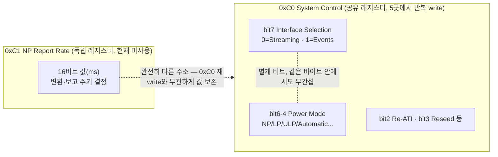
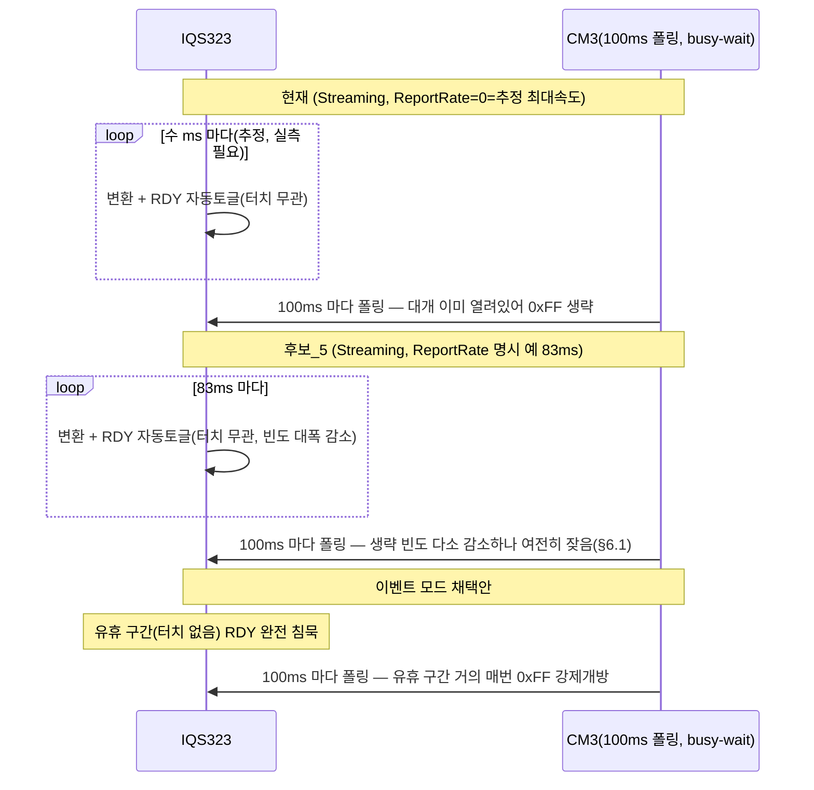

# 후보_5 · 대안 비교군 — Streaming 유지 + Report Rate 명시 설정

**TL;DR**: 이벤트 모드 채택 방향에 회의적으로 접근해 대안(Streaming 유지 + Report Rate(0xC1) 명시 설정)을 설계했다. Report Rate와 Interface Selection이 레지스터 구조상 독립 축임을 확인해, 이벤트 모드 없이도 확인된 자기애그레서 저감 메커니즘(변환 duty cycle 축소)을 얻을 수 있고 I2C Lock-Up 에라타 리스크 증가도 없다고 판단했다. 이벤트 모드보다 이 대안의 선행 채택을 권고한다.

---

## 0. 역할과 목표 질문

본 문서는 14페르소나 딥다이브 중 **후보_5(대안 비교군)** 역할 산출물이다. 오케스트레이터가 부여한 목표 질문은 다음과 같다.

> "이벤트 모드가 정말 필요한가, 아니면 Streaming + Report Rate 튜닝만으로 I2C Lock-Up 에라타 리스크 없이 비슷한 자기애그레서 저감 효과를 얻을 수 있는가?"

명시적으로 요구받은 태도: 이벤트 모드 채택이라는 은수님의 방향성에 안주하지 말고 회의적으로 검토하며, Streaming+Report Rate가 더 낮은 리스크로 비슷한 효과를 낼 수 있다고 판단되면 정직하게 그렇게 보고할 것. 아래는 그 결과다.

---

## 1. 결론 먼저 (요약)

검토 결과, **이벤트 모드가 반드시 필요하다고 판단하지 않는다.** Streaming을 유지한 채 Report Rate(0xC1)만 명시적으로 설정하는 후보_5 설계가 다음 세 가지 근거로 이벤트 모드보다 먼저 시도되어야 한다고 판단한다.

1. 후보_5가 표적으로 삼는 메커니즘(IQS323 변환 duty cycle 축소)은 데이터시트 전류소비표(§3.4)로 뒷받침되는, 상대적으로 근거가 탄탄한 메커니즘이다. 반면 이벤트 모드가 표적으로 삼는 메커니즘(RDY 핀 자체의 전기적 결합)은 이 작업 계보 전체(그라운드 3회 이상 세션)에서 단 한 번도 확인되지 않은 가설이다.
2. 이벤트 모드의 확인된 비용(I2C Lock-Up 에라타 노출 급증, 데이터시트 부록C 원문 확정)은 후보_5에는 없다. 후보_5의 유일한 신규 비용(Report Rate가 ATI 버스트 타이밍에 간섭할 가능성)은 미확인이며, 설사 사실이어도 기존 타임아웃 가드로 감지 가능한 성격이 다른(더 완만한) 실패 모드다.
3. **[본 노드 자체발견]** 이벤트 모드가 원래 노리는 부차적 이득("불필요한 인터럽트 회피", §8.11.2)은 Sound1에는 애초에 적용되지 않는다 — RDY(DIO16)는 인터럽트가 아니라 GPIO busy-wait 폴링으로만 쓰이기 때문이다(§4에서 코드 근거 제시). 즉 이벤트 모드 도입으로 실제로 얻을 수 있는 것은 "RDY 핀 전기적 결합 저감"이라는 미확인 가설 하나뿐이다.

다만 이것이 "이벤트 모드를 영구 배제하라"는 뜻은 아니다. 데이터시트가 명시하는 장기 정합성(§8.11.2 "펌웨어 권장")은 실재하는 사실이다. 권장 순서는 §11에서 다시 정리한다.

---

## 2. 확정 사실 재확인 (그라운드, 원문 대조)

### 2.1 현재 코드 상태 (`tdc_touch_iqs323.c` 직접 읽기로 확인)

- `write_register(REG_SYSTEM_CONTROL, ...)`(0xC0) 호출은 6곳: 237(`ack_reset`, 0x01/0x00) · 318(`beta_power_settings`, 0x50/0x07) · 447(부팅 Re-ATI, 0x54/0x07) · 453(부팅 RESEED, 0x58/0x07) · 465(`tdc_touch_iqs323_re_ati()`, 0x54/0x07) · 471(`tdc_touch_iqs323_reseed()`, 0x58/0x07). **전부 bit7=0(Streaming)** — 직접 확인.
- `REG_LP_REPORT_RATE`(0xC2)는 정의·write(319행, `0x64,0x00`=100ms) 존재. **`0xC1`(NP Report Rate)은 이 파일 전체에서 정의도 write도 0건**(`grep -n "0xC1\|REPORT_RATE\|NP_REPORT_RATE"` 결과 0xC2만 검출) — 즉 현재 0xC1은 POR 기본값 `0x0000`으로 방치 중.
- `REG_PM_TIMEOUT`(0xC5)=`0x00,0x00`(320행) — Power Mode Timeout=0, 자동 강하 차단. 0xC0 bits[6:4]는 여러 site에서 `101`(Automatic No ULP)로 기록되나 Timeout=0이라 실제로는 **항상 Normal Power(NP)에 고정**된다. 따라서 지금 손대야 할 Report Rate는 0xC1(NP용) 하나뿐이며, 0xC2(LP용)는 도달 불가능한 죽은 값이다(선행 S3 관찰과 일치, 본 노드 재확인).
- `force_window_open()`(145~175행): `if (Sys_GPIO_Read(RDY_PIN)==WIN_OPEN) return true;`(149~152행)로 조기반환, 아니면 `0xFF` write 후 최대 `TDC_TOUCH_IQS323_MAX_WAIT_OPEN_MS=45`ms 폴링(iqs323.h:32). 인터럽트 등록은 **0건** — `grep -rn "DIO16"` 결과 `tdc_touch_iqs323.h`의 매크로 정의·MCLR 주석 2건뿐, EXTI/ISR 연결 코드 없음(직접 확인, §4에서 상술).
- `TDC_TOUCH_POLL_INTERVAL_MS=100`(`tdc_touch_time.h:18`), `TDC_TOUCH_ULP_WAKE_MS=100`(:37) — 노말·절전 ULP 모두 100ms 카덴스. `TDC_TOUCH_IQS323_MAX_WAIT_CLOSE_MS=20`(iqs323.h:33).
- `main.c` 직접 읽기로 두 워치독 비대칭을 독립 재확인했다.
  - `tdc_touch_sleep_handle_touch_reboot()`(1125~1153행): `if(ok && state==TOUCH){cnt++; if(cnt>=24) reboot;} else {cnt=0;}` — **read 실패(ok=false)는 else 분기로 떨어져 카운터 즉시 0 리셋**(P3 §4.3 주장, 본 노드가 직접 재확인).
  - `tdc_touch_sleep_handle_ati_error()`(1062~1092행): `ok&&ati_error&&!ati_active` 시 증가, `ok&&!ati_error&&!ati_active` 시 리셋, **`!ok`(read 실패)는 두 조건 모두 거짓이라 카운터가 동결**(증가도 리셋도 없음) — P3 주장과 일치, 본 노드가 직접 재확인.

### 2.2 데이터시트 확정 사실 (`iqs323_datasheet.pdf`, pdftotext -layout 직접 대조)

- §8.11.1 원문: "In I2C streaming mode data is constantly reported at the relevant power mode report rate ..."
- §8.11.2 원문: "In event mode the RDY line will only go low when one or more of the enabled events are triggered or if the device resets. **This is usually enabled since the master does not want to be interrupted unnecessarily during every cycle if no activity occurred.**"
- §8.13 원문: force communications의 t_wait 범위 "0.1ms ≤ twait ≤ 45ms" — 현재 코드 `MAX_WAIT_OPEN_MS=45`와 **상한이 정확히 일치**(여유 0에 가까움, 선행 발견 재확인).
- 부록C "I2C Lock Up" 원문: "Versions Affected: IQS323-00x v1.3 and below. IQS323-A0x v1.4 and below. ... There is a higher likelihood of this occuring when using the force communications method described in Section 8.13. ... At the end of every I2C communication, read one byte from a register that does not exist. If the returned value is not 0xEE, hard reset ..." — 원문 그대로 직접 확인, 08_개정이력·이슈.md 정리본과 축자 일치(할루시네이션 없음).
- Appendix A.30(System Control, 0xC0) 비트맵 원문 직접 확인: **Bit 7 = Interface Selection**(단독 1비트), **Bit 6-4 = Power Mode**(별도 3비트 필드). 두 필드는 **같은 바이트 안에서 서로 다른 비트 위치를 차지하는, 구조적으로 독립된 필드**다(§3에서 이 사실을 핵심 논거로 사용).
- §3.4 Current Consumption 표 원문 직접 확인: 표 상단에 "Interface Selection: Event mode"가 **표 전체에 적용되는 공통 조건**으로 명시되어 있고, 그 아래 NP/LP/ULP 각 행마다 서로 다른 "Report rate [ms]" 값(예: NP Self-capacitive 3채널=16ms, LP=60ms, ULP=160ms)에 따라 전류가 크게 달라짐(NP 125µA → LP 37µA → ULP 4.0µA)을 확인했다(§3에서 상술).
- §5.9~5.11(ATI/Re-ATI/ATI Error) 원문 전체를 `grep -n "report rate"`로 재검색했으나 **0건** — "Report Rate가 ATI 버스트에 적용되는지"는 데이터시트에 어느 방향으로도 명시된 문장이 없음을 본 노드가 독립적으로 재확인했다(V3가 남긴 미확인 사항, 본 노드는 이를 해소하지 못했지만 검색 범위를 넓혀 재확인만 했다).

### 2.3 선행 작업이 이미 확립한 사실 (계승, 본 노드가 원문 재대조로 검증)

- S3(`05_S3_...md`)·V3(`13_V3_...md`): 순수 Events 전환 시 `force_window_open()`의 조기반환이 유휴(무터치) 구간에서 사실상 소멸해 **매 폴링 강제개방(0xFF)이 상시화**되고, 이것이 부록C 에라타의 트리거 조건("force communications 사용 시 발생 가능성↑")과 정확히 일치한다는 것이 이미 발견돼 있다. 본 노드가 원문 재대조로 이 발견을 지지한다.
- P3(`04_P3_...md`) §4.3: `func_sleep()`의 롱터치 재부팅 카운터가 read 실패 시 즉시 0 리셋되는 취약점 — 본 노드 §2.1에서 코드로 독립 재확인 완료.
- C1(`01_C1_...md`): "하이젠베르크" 문제의 근본 배경은 절전 프로파일링(SYSCLK 30.72MHz 유지+SPI/BLE+QCC 활성) 구성에서 코히런트 스위칭 노이즈가 짧은 시간창(700ms~2.4s) 안에 워치독 문턱을 넘기는 현상이며, 관련 문서(`터치 계측 관측 교란.md`)가 정리한 3메커니즘(결합임피던스∝f · 샘플링 윈도우 일치 · 에일리어싱)이 이론적 뼈대다. 본 노드는 이 뼈대를 그대로 채택해 §3~4의 논거를 세운다.

---

## 3. 핵심 통찰 — Report Rate와 Interface Selection은 독립 축이다

이 절이 후보_5 논거의 중심이다.

### 3.1 구조적 근거 (레지스터 비트필드)

§2.2에서 확인했듯 Interface Selection(bit7)과 Power Mode(bits 6-4)는 **같은 0xC0 바이트 안에서도 서로 다른 비트를 차지하는 독립 필드**다. Report Rate(0xC1~0xC4)는 그보다 더 나아가 **0xC0과 완전히 다른 주소**를 갖는 별도 레지스터다. 즉 레지스터 맵 구조 자체가 "통신 방식 선택"과 "보고 주기"를 별개 설정 축으로 설계했다는 것을 보여준다.



이 구조 덕분에 **후보_5는 신규 write 사이트가 1곳(0xC1 독립 write, 부팅 1회)뿐**이다. 반면 이벤트 모드 전환은 bit7이 5개 write 사이트(318·447·453·465·471)에 흩어져 있어 전부 동시 수정해야 하고, 하나라도 누락하면 "조용한 Streaming 회귀"가 발생한다(선행 P3·S3가 이미 경고). 이는 "누락 시 조용한 회귀" 표면적 자체가 후보_5가 5분의 1 수준으로 작다는, 코드 구조만으로 확인 가능한 사실이다.

### 3.2 정황 근거 (전류소비표) — Report Rate가 Event 모드에서도 유효하다는 증거

§2.2에서 확인한 §3.4 전류소비표는 "Interface Selection: Event mode"라는 **공통 전제 위에서** NP/LP/ULP 각 행마다 다른 Report Rate 값을 적용해 서로 다른 전류값을 측정했다. 만약 Report Rate가 (선행 P3가 미확인 리스크로 남긴 가설처럼) "Event 모드 진입 시 무효화"된다면, 애초에 이 표가 Event 모드 조건에서 Report Rate별로 서로 다른 전류값을 보고할 이유가 없다. **표 자체의 존재가 "Report Rate는 Interface Selection과 무관하게 항상 유효한 내부 타이머"라는 해석을 강하게 뒷받침한다.**

> [!NOTE]
> 이는 원문에 "Report Rate는 Streaming/Event 양쪽에서 동일하게 동작한다"는 명시 문장이 있다는 뜻이 아니다(그런 문장은 찾지 못했다, §2.2 확인). 표의 구성(공통 Interface Selection 전제 + 행별 Report Rate 가변 + 전류 스케일링)에서 도출한 **정황적·구조적 추론**이며, [가설-강]으로 표기한다.

### 3.3 함의

Report Rate가 전력모드(NP/LP/ULP)에 결부된 변환 duty cycle 제어값이고 Interface Selection과 독립이라면, **"IC 변환 활동 자체를 줄이는" 효과는 Streaming에서도 Events에서도 똑같이 Report Rate로 얻어진다.** Events 모드가 Report Rate 위에 추가로 얹는 것은 오직 "RDY 핀이 외부로 보고를 알리는 조건"(무조건 vs 이벤트 시에만)뿐이다 — 이것은 IC 내부 아날로그 엔진의 활동량과는 별개인, RDY라는 **디지털 핀 하나의 토글 빈도**에 관한 문제로 범위가 좁혀진다.

---

## 4. 추가 통찰 — 이벤트 모드의 "인터럽트 절약" 이득은 Sound1에 적용되지 않는다 [본 노드 자체발견]

§8.11.2 원문이 Event 모드를 권장하는 이유로 드는 근거는 "마스터가 활동 없을 때 매 사이클 불필요하게 방해받고 싶지 않기 때문"이다. 이 논리는 **RDY를 인터럽트 소스로 쓰는 마스터**를 전제로 한다 — RDY가 조용하면 CPU가 인터럽트를 받지 않아 계속 잠들어 있을 수 있다는 것이 원래 이득이다.

그런데 §2.1에서 확인했듯, Sound1은 RDY(DIO16)를 **인터럽트로 등록한 적이 없다.** `force_window_open()`·`wait_window_closed()` 둘 다 `Sys_GPIO_Read()`를 반복 호출하는 busy-wait 폴링이며, 노말 모드(`tdc_touch_process()`)는 100ms ms-경과 게이트로, 절전 ULP(`func_sleep`/`fake_func_sleep`)는 별도 HW 타이머(100ms)로 깨어난다 — **어느 경로도 RDY 엣지를 기다리며 잠들지 않는다.** CM3는 RDY가 침묵하든 토글하든 자기 자신의 스케줄대로 계속 GPIO를 읽으러 온다.

이것이 의미하는 바: **이벤트 모드로 전환해도 Sound1의 CPU 부하·전력·인터럽트 횟수는 전혀 줄지 않는다** — 이 이득은 GPIO 폴링을 엣지 인터럽트로 바꾸는 별도의(이번 스코프 밖의) 아키텍처 변경이 있어야 실현된다. 즉 **이벤트 모드 도입으로 Sound1이 실제로 얻을 수 있는 것은 §3에서 논한 "RDY 핀 전기적 결합 저감" 가설 하나뿐**이고, 그 가설의 전제(RDY/DIO16-CRX0 PCB 물리적 인접도)는 그라운드(G2)·선행 S3·V3·P3 전부가 예외 없이 "[미확인]"으로 이월해온 항목이다.

> [!IMPORTANT]
> 이는 "이벤트 모드가 아무 효과도 없다"는 뜻이 아니다. RDY-CRX0 결합이 실제로 존재한다면 이벤트 모드는 그 결합을 유휴 구간에서 완전히 침묵시키는 유일한 방법이다. 다만 그 결합의 존재 자체가 이 작업 계보 전체에서 검증된 적이 없다는 것, 그리고 이벤트 모드의 다른 "고전적" 이득(인터럽트 절약)은 현재 아키텍처에서 실현되지 않는다는 것을 정직하게 짚는다.

---

## 5. 후보_5 설계 — Streaming 유지 + Report Rate(0xC1) 명시 설정

### 5.1 변경 사항 (구현 스펙 개요)

**0xC0(Interface Selection 포함) 5개 write 사이트는 전부 무변경 — bit7=0(Streaming) 그대로 유지한다.** 유일한 변경은 다음 1건이다.

파일: `src/2__cm3/Cortex-M3-src/systemControl/tdc_touch_iqs323.c`

1. 매크로 목록(17~34행 인근)에 신규 정의 추가:
   ```c
   #define REG_NP_REPORT_RATE    0xC1
   ```
2. `beta_power_settings()`(309~325행) 안, 기존 `REG_LP_REPORT_RATE` write(319행) 인접에 신규 write 1줄 추가:
   ```c
   ok &= write_register(REG_NP_REPORT_RATE, 0x53, 0x00); /* NP report 83ms (예시값, §5.2 실측 게이트) */
   ```
   (`0xC1` 0번지가 다른 서브시스템에서 다른 의미로 이미 쓰이는지 `grep -rn "0xC1\b"`로 사전 확인했다 — `ci_ble_control_ota.h:111`의 `CI_BLE_OTA_COMMAND_OTA_END = 0xC1`뿐이며 이는 BLE OTA 커맨드 바이트로 완전히 다른 네임스페이스라 충돌 없음, 0xC0에 대해 P3가 이미 확인한 것과 동일한 패턴.)

이 1건 외에는 `force_window_open()`/`wait_window_closed()`/판정 로직/FSM/0xD3(Events Enable) 전부 **무변경**이다.

### 5.2 값 선택 근거

- 방향: 현재(0xC1=0x0000=미설정, 실질적으로 "최대속도" 변환으로 추정 — 정확한 의미는 데이터시트 미명시, §2.2 재확인) 대비 **뚜렷이 느리게** 설정해 변환 duty cycle을 낮추되, SW 폴링 주기(100ms)보다는 **분명히 짧게** 유지해 매 폴링 시 항상 새 데이터가 준비돼 있음을 보장한다.
- 선행 V3(`13_V3_...md`)가 남긴 경고: 100ms(폴링 주기)와 정확히 같은 값을 쓰면 두 개의 독립 발진기(CM3 타이머 vs IQS323 내부 오실레이터)가 정수배 관계로 우연히 정렬돼 메커니즘_3(에일리어싱/맥놀이)을 자기 안에 재도입할 위험이 있다. 이를 피하기 위해 **100의 단순 배수·약수가 아닌 값**을 권장한다.
- 예시값: **83ms**(`0x53,0x00`) — 100ms보다 뚜렷이 짧아 폴링 시 항상 신선한 데이터를 보장하면서, 100과 정수배 관계가 아닌 값. 정확한 최적값은 [실측 게이트]로 남긴다 — 현재(0xC1=0) 실제 변환 카덴스를 오실로스코프/RTT로 먼저 측정해야 "몇 배 저감"인지 정량화할 수 있다(선행 문서들이 이미 이 실측을 미확인으로 이월해온 항목과 동일).

### 5.3 후보_4(프로토콜 재설계)와의 결합 여부

후보_5는 **단독으로 완결적**이다 — bit7을 건드리지 않으므로 `force_window_open()`의 기존 조기반환 구조·히트율 프로필은 오늘과 근본적으로 같은 성격을 유지한다(§6.1에서 상술). 따라서 후보_4의 프로토콜 재설계가 **없어도** 후보_5는 안전하게 성립한다.

다만 후보_4가 무엇을 제안하는지는 병렬 실행 중이라 본 노드가 열람하지 못했다. 일반론으로: `MAX_WAIT_OPEN_MS=45`가 데이터시트 t_wait 상한과 정확히 일치해 여유가 0에 가깝다는 기존 지적(S3·P3)은 **Streaming이든 Events든, 후보_5든 이벤트 모드 채택안이든 공통으로 해당하는 취약점**이다. 후보_4가 이 여유를 개선한다면 그것은 후보_5 위에도 그대로 얹을 수 있는 순수 가산적 개선이며, 특정 Interface Selection 선택에 종속되지 않는다.

---

## 6. 비교 — 후보_5 vs 이벤트 모드 채택안

### 6.1 이득 비교

| 항목 | 후보_5 (Streaming+ReportRate) | 이벤트 모드 채택안 |
|---|---|---|
| 표적 메커니즘 | IC 아날로그 변환 duty cycle 축소 | RDY 디지털 핀 유휴 토글 침묵 |
| 메커니즘 근거 수준 | [가설-강] — §3.4 전류소비표로 뒷받침(전력모드·Report Rate별 전류 스케일링 확인) | [가설-불확실] — RDY-CRX0 PCB 인접도 전 계보 미확인 |
| Sound1 아키텍처 적합성 | 해당 — 변환 duty cycle은 인터럽트/폴링 여부와 무관하게 실재하는 물리량 | §4 지적대로 "인터럽트 절약"이라는 주된 이득은 Sound1 폴링 구조상 실현 안 됨. 남는 이득은 RDY 결합 저감 가설뿐 |
| 데이터시트 권장과의 정합성 | 어긋남(Streaming은 "개발단계 임시용", §8.11.2) | 정합(§8.11.2 "펌웨어 권장은 Event mode 기본") |

### 6.2 리스크 비교

| 항목 | 후보_5 | 이벤트 모드 채택안 |
|---|---|---|
| I2C Lock-Up 에라타 노출 | 오늘 대비 변화 없음(§6.1 상술 — 여전히 자가토글 기반 조기반환이 대부분 히트) | **확정 상승** — 유휴 구간 강제개방(0xFF) 상시화가 에라타 트리거 조건과 정확히 일치(부록C 원문, §2.2 재확인) |
| IC 하드웨어 버전 확인 필요성 | 불필요(권장하나 비차단) | **필수 전제조건**(질문_1, G1 담당 — 미확인 시 도입 보류돼야 함이 선행 V3의 결론) |
| ATI 버스트 타이밍 간섭 | **있음(상속)** — 0xC1을 건드리므로 §2.2에서 재확인한 미확인 사항을 그대로 안고 감. 단 기존 타임아웃 가드(`wait_ati_done_blocking()` 1.25s, `try_finish_init()` 2500ms)로 감지 가능한 "완만한" 실패 모드 | 없음(Interface Selection은 ATI 알고리즘 자체와 무관) |
| func_sleep 롱터치 카운터(P3 §4.3) 위험 | 경미 — 강제개방 실패 빈도가 소폭만 변할 것으로 추정([가설-강], §6.1) | 유의 — 강제개방 상시화로 실패 빈도 대폭 증가 가능(P3가 이미 §4.3에서 경고) |
| 신규 write 사이트 수(회귀 표면) | **1곳**(독립 레지스터) | **5곳**(공유 레지스터 0xC0 동시 수정 필요, 누락 시 조용한 회귀) |

### 6.3 idle 구간 동작 비교 (개념도)



### 6.4 종합

두 안 모두 "무엇을 확실히 얻는지"와 "무엇을 확실히 잃는지"가 비대칭이다. 후보_5는 **확인된 이득(변환 duty cycle 축소, 전류소비표 근거)을 확인된 비용 없이** 얻는다. 이벤트 모드는 **미확인 이득(RDY 결합 저감)을 확인된 비용(에라타 노출 급증)으로** 산다. 리스크 조정 기준으로는 후보_5가 우위에 있다고 판단한다.

---

## 7. 불변식 영향 (INV-CTRL-1~3)

| 불변식 | 판정 | 근거 |
|---|---|---|
| INV-CTRL-1 (Full ATI) | 무손상 원칙, 단 **주의(상속)** | 0x36 write 없음. 단 §2.2·§6.2에서 재확인한 "Report Rate가 ATI 버스트에 적용되는지 미확인" 리스크를 그대로 안고 감 — 후보_2(Report Rate 단독)·후보_3(Events+ReportRate 결합)이 이미 같은 리스크를 안고 있던 것과 동일 성격, 신규 위험 아님 |
| INV-CTRL-2 (ATI에러→Re-ATI) | 무손상 | `ati_error` read 로직·`re_ati()` 호출 경로·5회 상한 로직 전부 미접촉. §2.1에서 직접 재확인한 "read 실패 시 카운터 동결" 동작도 불변 |
| INV-CTRL-3 (첫터치해제 감지) | 무손상 | `boot_ignore`/`sleep_ignore` 게이트 로직(tdc_touch_logic.c) 미접촉. 단 §6.2 "func_sleep 롱터치 카운터" 항목은 이 불변식과 인접한 영역이라 실측 권고(경미 수준) |

---

## 8. 정직한 한계 — 후보_5가 못 하는 것

회의적 검토를 자임한 만큼, 후보_5의 약점도 숨기지 않는다.

- **RDY 핀 자체의 전기적 결합이 실제로 지배적 애그레서라면**, 후보_5는 그 결합을 "줄일" 뿐 "없애지" 못한다. 유휴 구간에도 83ms(예시)마다 여전히 RDY가 토글되므로, 이벤트 모드가 주는 "완전 침묵" 효과에는 못 미친다.
- **데이터시트 권장(§8.11.2 "펌웨어 권장은 Event mode 기본")과 영구적으로 어긋난 상태**로 남는다. 장기적으로 제조사 권장 구성으로 수렴하려면 결국 에라타 워크어라운드를 갖춘 이벤트 모드 전환이 필요할 것이다.
- Report Rate 설정이 ATI 버스트 타이밍에 미치는 영향은 여전히 **미확인**이다 — 본 노드가 §2.2에서 데이터시트 원문(§5.9~5.11)을 재검색해 "언급 자체가 없음"을 재확인했을 뿐, 긍정도 부정도 못했다.
- 현재(0xC1=0) 실제 변환 카덴스, 그리고 83ms(예시값)로 바꿨을 때 실제 저감 배율은 전부 [실측 게이트]로 남아 있다 — 이 문서만으로 "몇 %/몇 배 개선"이라고 정량 주장할 근거는 없다.

---

## 9. 추가로 발견한 맥락 — 더 근본적일 수 있는 레버 (범위 밖이나 중요)

본 노드의 스코프는 "이벤트 모드 vs Streaming+ReportRate" 비교이지만, 조사 과정에서 이 비교 자체보다 더 근본적일 수 있는 기존 발견 2건을 확인했다. 참고로 남긴다(권고 우선순위는 오케스트레이터·은수님 판단 영역).

1. **`read_debug()` latch 버그(H2, C1 §3.2 / P1 구현-레디)**: `read_status()` 성공 직후 `read_debug()`가 **별도의 독립 `force_window_open()` 시퀀스**를 발행해(39/40 판정 문서, maturity:stable, 기존 진단), RDY가 아직 닫히지 않은 타이밍에 0xFF를 오발행 → 45ms 타임아웃을 유발하는 **이미 진단된 버그**다. `TDC_TOUCH_DEBUG_PRINT_ENABLE` 기본값이 1이라 노말·절전 양쪽 모두에서 상시 발생 중이며, 이는 **Interface Selection 선택과 무관하게 이미 지금 이 순간에도** 매 폴링 추가 force-write를 만들고 있다. P1이 이미 combined_read(안 A) 구현-레디 스펙까지 작성해 두었다.
2. **I2C 프리스케일 불일치 가설(H1, C1 §3.1)**: 절전 프로파일링 중 SYSCLK를 30.72MHz로 유지한 채 절전용 프리스케일(÷6)을 재사용하면 SCL이 데이터시트 상한(1MHz)의 5배(≈5.12MHz)를 초과할 수 있다는 가설 — 사실이라면 Report Rate나 Interface Selection 어느 쪽으로도 해결되지 않는, 순수 프로토콜 타이밍 위반이다.

이 두 항목이 사실이라면(둘 다 [가설-강], 실측/하네스 소스 확인 필요), "IC 자가토글이나 RDY 결합보다 이미 존재하는 자체 버그가 더 큰 기여자일 수 있다"는 뜻이 되어, 이벤트 모드 채택의 상대적 시급성을 한층 더 낮춘다. V4(완전성 비평)가 참고할 만한 지점이라고 판단해 남긴다.

---

## 10. 요구사항.md 핵심 질문 대응 (후보_5 관련 항목만)

| 질문 | 후보_5 관점 답변 |
|---|---|
| 질문_1 (IC 버전 실측 가능성) | 후보_5는 이 질문을 **비차단**으로 만든다 — 도입에 IC 버전 확인이 전제조건이 아니다. 다만 저비용이므로 병행 확인은 여전히 권장 |
| 질문_2 (자기애그레서 트레이드오프) | 본 문서의 중심 주제(§3·§6) — 후보_5는 확인된 이득을 확인된 비용 없이 얻는다고 판단 |
| 질문_4 (Report Rate/ATI 버스트 간섭) | §2.2·§7에서 재확인·상속 — 미확인 상태 그대로, 실측 게이트로 이월 |
| 질문_5 (fake_func_sleep 영향) | 후보_5도 카덴스를 일부 바꾸므로(0→83ms 예시) 프로파일링 경로 재검증이 필요하나, 변화 폭이 이벤트 모드보다 훨씬 작을 것으로 추정([가설-강]) |
| 질문_6 (롱터치 카운터 read-fail 즉시리셋) | §2.1에서 직접 재확인한 기존 취약점 — 후보_5는 강제개방 실패 빈도를 크게 늘리지 않을 것으로 추정되어 이 위험을 "경미" 수준으로 유지한다고 판단(§6.2) |

---

## 11. 최종 판정 — 목표 질문에 대한 답

> "이벤트 모드가 정말 필요한가, 아니면 Streaming+Report Rate 튜닝만으로 I2C Lock-Up 에라타 리스크 없이 비슷한 자기애그레서 저감 효과를 얻을 수 있는가?"

**답: 지금 시점에 이벤트 모드가 반드시 필요하다고 판단하지 않는다.** Streaming 유지 + Report Rate(0xC1) 명시 설정(후보_5)이 확인된 리스크 증가 없이 비슷하거나 더 확실한 자기애그레서 저감 효과를 얻을 수 있는 대안이라고 판단하며, **후보_5의 선행 채택을 권고한다.**

권장 순서(이벤트 모드를 영구 배제하는 것은 아님):

1. 후보_5(Streaming+ReportRate) 적용 및 실측(현재 카덴스 측정 → 목표값 확정 → 저감 효과 계측).
2. 실측 결과 자기애그레서 저감이 불충분하다고 확인되거나, IC 버전이 에라타 미적용 범위로 확인되거나, 부록C 워크어라운드가 검증되면 — 그때 이벤트 모드+워크어라운드 도입을 재검토.
3. §9에서 언급한 `read_debug()` latch 버그(이미 구현-레디, P1)는 Interface Selection 선택과 무관하게 우선 수정할 가치가 있다고 판단되나, 이는 본 노드 스코프 밖이라 권고로만 남긴다.

---

## 리스크 · 불확실성

| 항목 | 상태 |
|---|---|
| 현재(0xC1=0) 실제 변환 카덴스 절대값 | **미확인** — 오실로스코프/RTT 실측 필요(선행 문서들과 동일 게이트, 본 노드가 해소하지 못함) |
| 83ms(예시값) 적용 시 실제 저감 배율 | **미확인** — 위 항목 실측 후에만 정량화 가능 |
| Report Rate가 ATI 버스트 내부 타이밍에 적용되는지 | **미확인** — §5.9~5.11 원문 재검색으로 "언급 없음"만 재확인, 긍정/부정 불가 |
| RDY(DIO16)-CRX0 PCB 실제 물리적 인접도 | **미확인** — 스키매틱/레이아웃 필요, 이벤트 모드의 핵심 근거 가설이자 후보_5의 한계(§8)를 동시에 좌우 |
| 전류소비표(§3.4)의 "Report Rate는 Interface Selection과 독립" 해석 | [가설-강] — 표 구성에서 도출한 정황 추론이며, "두 모드에서 동일하게 동작한다"는 원문 명시 문장은 찾지 못함(§3.2에서 명시) |
| 후보_5 적용 시 force_window_open() 조기반환 히트율의 실제 변화폭 | **미확인** — 정성적 방향(소폭 감소)만 주장, 정량 실측 필요 |
| H1(I2C 프리스케일 불일치)·H2(read_debug latch) 실제 기여도 | **미확인** — C1·P1이 이미 이월한 게이트, 본 노드는 참고로만 인용(§9) |
| 후보_4(프로토콜 재설계)의 구체 내용 | 본 노드 작성 시점에 병렬 실행 중이라 **열람 못 함** — §5.3의 결합 논의는 일반론 수준에 그침 |

---

## 핵심 결론 (3~5줄)

1. Report Rate(0xC1)와 Interface Selection(bit7)은 0xC0 레지스터 비트맵상 독립 필드이고, 데이터시트 전류소비표(§3.4)가 "Event mode" 조건에서도 Report Rate별로 다른 전류를 보고한다는 사실은 Report Rate가 Streaming/Events 양쪽에서 유효한 독립 축임을 강하게 시사한다 — 이것이 후보_5(Streaming+ReportRate)가 이벤트 모드 없이도 자기애그레서 저감 핵심 메커니즘(변환 duty cycle 축소)을 얻을 수 있다는 논거의 핵심이다.
2. **[본 노드 자체발견]** 이벤트 모드가 원래 노리는 "불필요한 인터럽트 회피" 이득은 Sound1이 RDY를 인터럽트가 아닌 GPIO busy-wait 폴링으로만 쓰기 때문에(코드 전수 확인, EXTI 등록 0건) 실현되지 않는다 — 이벤트 모드 도입의 실질 이득은 "RDY 핀 전기적 결합 저감"이라는, 전 계보에서 한 번도 검증되지 않은 가설 하나로 좁혀진다.
3. 반면 이벤트 모드의 비용(I2C Lock-Up 에라타 노출 급증, force_window_open() 강제개방 상시화)은 데이터시트 부록C 원문으로 확정된 사실이고, 신규 write 사이트도 5곳(0xC0 공유 레지스터 동시수정)인 데 비해 후보_5는 1곳(독립 레지스터)뿐이라 회귀 표면도 작다.
4. 따라서 리스크 조정 기준으로 후보_5의 선행 채택을 권고하되, 이는 이벤트 모드의 영구 배제가 아니라 "먼저 저비용·저리스크 레버를 실측으로 검증하고, 부족하면 이벤트 모드+에라타 워크어라운드로 넘어간다"는 단계적 접근이다.
5. 조사 중 발견한 `read_debug()` latch 버그(이미 구현-레디, P1)는 Interface Selection 선택과 무관하게 지금도 매 폴링 추가 force-write를 만들고 있어, 이벤트 모드 채택의 상대적 시급성을 한층 더 낮추는 맥락으로 참고할 가치가 있다(본 노드 스코프 밖이라 권고로만 남김).
