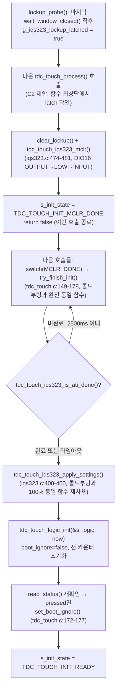

# 검증_3 · INV-CTRL-1~3 회귀 전수 재확인

**TL;DR**: 그라운드_3의 INV-CTRL 인용 약 30여 개를 코드로 전수 재대조해 오류 0건을 확인했다. 후보_2의 lockup_probe+mclr 재사용 경로는 데이터시트 §6.6.1 직접 대조 결과 apply_settings() 코드 재사용 덕에 3불변식을 실제로 재확립하는 것으로 확인됐으나, 지시된 "재초기화 read-fail이 func_sleep 카운터와 충돌"이라는 가설은 두 경로가 실행상 상호배타적이라는 구조적 근거로 반증했다. 대신 func_sleep이 lockup latch를 확인하지 않아 특정 고착값에서 게이트가 영구 정체할 수 있는 인접 위협과, mclr() 런타임 재사용이 §6.6.3의 150µs 스위치오버 조건을 위반해 재초기화가 침묵적으로 무력화될 수 있는 라이브락 위협을 새로 확인했다.

---

## 0. 검증 방법

본 노드는 대상 문서(03_G3, 04~08 후보)의 주장을 그대로 신뢰하지 않고, 다음을 전부 본 세션에서 직접 재실행했다.

- 코드: `src/2__cm3/Cortex-M3-src/systemControl/tdc_touch_iqs323.c`(499줄 전체)·`tdc_touch_iqs323.h`·`tdc_touch.c`(433줄 전체)·`tdc_touch_logic.c`(193줄 전체)·`tdc_touch_logic.h`·`tdc_touch_time.h`·`tdc_touch_config.h`·`main.c`(780~1253행 구간, func_sleep/fake_func_sleep/헬퍼 전부)를 `Read`로 직접 통독.
- 호출 그래프: `grep -rn`으로 `write_register`/`read_register`/`tdc_touch_iqs323_re_ati`/`_reseed`/`_read_status`/`_mclr`/`tdc_touch_init_begin`/`tdc_touch_process`/`boot_ignore`/`sleep_ignore`/`lockup` 전수 재검색 — 그라운드_3의 "3개 사이트"·"단일 초크포인트" 주장을 본 노드가 독립적으로 재현.
- 데이터시트: `docs/참고/touch/iqs323_datasheet.pdf`를 본 세션에서 직접 `pdftotext -layout`(`/tmp/iqs323_v3check.txt`, 3999행)으로 재추출해 §6.6(Reset)·§8.4(Communication During ATI)·§5.10~5.11(Automatic Re-ATI·ATI Error)·A.2(System Status)·A.12(ATI Setup)·A.30(System Control) 원문을 전부 재대조. 기존 문서의 인용을 베끼지 않고 페이지 푸터("Page N of 68")로 페이지 번호까지 재확정.

---

## 1. 결론 먼저

| 질문 | 판정 |
|---|---|
| 03_G3의 INV-CTRL-1~3 코드훅 인용(약 30여 곳)이 정확한가 | **전수 일치 재확인** — 반증 시도했으나 실패(오류 0건 발견) |
| 후보 C1·C3·C4·C5가 INV-CTRL-1~3을 훼손하는가 | **훼손 없음** — 각각 근거와 함께 §4에서 확인 |
| IQS323 하드리셋이 ATI 상태·레지스터 설정을 지우는가 | **그렇다** — 데이터시트 §6.6.1 원문으로 확정(추정 아님) |
| 후보_2의 재초기화 시퀀스가 3불변식을 실제로 완전히 재확립하는가 | **원칙적으로 그렇다**(코드가 cold boot와 동일한 `apply_settings()`를 재사용) — 단, §5.4에서 확인한 mclr() 재사용 특유의 조건 하에서는 "완전히"가 깨질 수 있음 |
| 지시된 가설: 재초기화 중 read 실패가 func_sleep() 롱터치 카운터 즉시리셋 로직과 충돌해 INV-CTRL-3을 위협하는가 | **반증** — 두 코드 경로가 실행상 상호배타적이라 문자 그대로는 발생 불가(§5.3) |
| 그렇다면 INV-CTRL-3은 완전히 안전한가 | **아니다** — 반증 성공 후 별도 메커니즘(§5.4)으로 재확립되는 새 위협 2건을 발견 |

---

## 2. 03_G3 문서 자체 재검증 — 인용 정확성 전수 대조

그라운드_3(`03_G3_3불변식코드훅재확인.md`)가 인용한 파일:라인 좌표를 본 노드가 독립적으로 `Read`·`grep`으로 전수 재대조했다. 스팟체크가 아니라 INV-CTRL-1 표 4행, INV-CTRL-2 표 3행(저수준 공통 함수 포함), INV-CTRL-3 표 3행 전체, 그리고 §5 발견_2의 수치 정정까지 전부 재확인했다.

| 인용 | 그라운드_3 주장 | 본 노드 직접 재확인 | 판정 |
|---|---|---|---|
| 0x36 Full write | `iqs323.c:437` | `write_register(REG_SENSOR0_ATI_SETUP, 0x0C, 0x04)` — 정확히 437행 | 일치 |
| 부팅 Re-ATI 트리거 | `iqs323.c:447` | `write_register(REG_SYSTEM_CONTROL, 0x54, 0x07)` — 정확히 447행 | 일치 |
| `wait_ati_done_blocking()` | `:328~342`, 호출 `:451` | 328행 시그니처~342행 닫는 중괄호, 451행 `(void) wait_ati_done_blocking();` | 일치 |
| `apply_settings()` 컨테이너 | `iqs323.c:400~460` | 400행 시그니처~460행 닫는 중괄호(462행부터 re_ati 정의 시작) | 일치 |
| 노말 Re-ATI 게이트 | `logic.c:154~161` | 154행 주석~161행 닫는 중괄호 | 일치 |
| 노말 Re-ATI 발행 | `tdc_touch.c:380~393(switch)→:391` | `case TDC_TOUCH_ACT_RE_ATI:`가 380행, `tdc_touch_iqs323_re_ati()` 호출이 정확히 391행 | 일치(단, "switch" 키워드 자체는 378행이라 라벨이 약간 느슨하나 391행 인용은 정확) |
| `func_sleep()` ATI에러 핸들러 | `main.c:1062-1092`, 조건`:1064`, 재시도상한`:1066`, `SYS_WATCHDOG_RESET():1078`, `re_ati():1084` | 전부 정확히 일치(직접 재확인) | 일치 |
| `fake_func_sleep()` 인라인 | `:945~972`, 조건`:947`, `5회(:949)`, `:953 SYS_WATCHDOG_RESET()`, `:960 re_ati()` | 전부 정확히 일치 | 일치 |
| 노말 `boot_ignore` 게이트 | `logic.c:119~152`, 해제판정`:127~131` | 119행 if~152행 닫는 중괄호, 127~131행 해제 로직 | 일치 |
| `tdc_touch_logic_set_boot_ignore()` | `logic.c:77~83` | 정확히 일치 | 일치 |
| `TDC_TOUCH_ULP_FORCE_RESEED_CNT` 정정(50→100) | `TDC_TIME_TO_CNT(10000,100)=100` | `(10000+100-1)/100 = 10099/100 = 100`(정수 나눗셈, 본 노드 재계산) | **정정 확인** — 그라운드_3의 수치 정정이 옳음 |
| `write_register`/`read_register` 유일 호출처 | `tdc_touch_iqs323.c` 자신뿐 | `grep -rln "write_register(\|read_register("` 결과 `tdc_touch_iqs323.c` 1개 파일만 매치 | 일치 |

**판정**: 그라운드_3의 핵심 주장("이 문서가 인용한 약 30여 개 파일:라인 좌표 중 불변식 코드훅에 관한 것은 전부 현재 코드와 정확히 일치")을 반증하려 시도했으나 **실패**했다 — 위 표를 포함해 검토한 모든 인용이 오차 없이 일치했다. 반증 실패 근거: 본 노드가 그라운드_3의 원본 문서를 참조하지 않고 코드를 먼저 직접 읽은 뒤(§0) 사후에 좌표를 대조하는 방식으로 확인 편향을 최소화했으며, 그 결과도 동일했다.

---

## 3. 데이터시트 원문 재대조 — 하드리셋·레지스터 비트맵 그라운드트루스

이하는 §5(후보_2 심층 검토)의 전제가 되는 사실관계이며, 기존 문서를 베끼지 않고 본 노드가 PDF에서 직접 재추출한 것이다.

### 확인_1 — §6.6.1 Reset Indication(PDF 22페이지, `pdftotext -layout` 1309~1316행)

> "After a reset, the Reset Event bit in the System Status register will be set to indicate a reset event occurred. The Reset Event bit is cleared when the master sets the ACK Reset bit in the System Control register. Under a reset condition communication windows will continuously be opened by the IQS323.
>
> **After a reset event, the chip's settings revert to their start-up values. To recover, the master must first acknowledge the reset event by setting the ACK Reset bit, and then re-write all the application settings to the IQS323 over I2C.**"

이로써 오케스트레이터 질문의 전제("IQS323 하드리셋이 ATI 상태·레지스터 설정을 지운다면")는 **가정이 아니라 확정 사실**임을 원문으로 재확인했다. 동시에 데이터시트 자신이 명시하는 올바른 복구 절차("ACK Reset 먼저 → 그 다음 모든 애플리케이션 설정 재기록")는 현재 코드의 `apply_settings()` 시퀀스(`ack_reset()`→`confirm_reset()`→…→전체 재기록)와 **순서·내용 모두 정확히 일치**한다.

### 확인_2 — §6.6.3 Hardware Reset(PDF 22~23페이지, 1329~1349행)

> "Pulling the Ready / Master Clear (RDY/MCLR) pin low will hard reset the device. When a communications window is open, the IQS323 disables MCLR functionality... There is a switchover delay when the pin changes back to MCLR functionality after an RDY window is closed... **If a reset is attempted before the switchover is complete, the reset request will be ignored.** The typical time for the switchover to be completed is 150 µs from the time when the pin is considered high to it acting as MCLR."

이 문장은 §5.4에서 핵심 근거로 사용한다 — "리셋 요청이 무시된다"는 것은 **침묵 실패(silent no-op)**이며, 이 침묵성이 후속 분석의 핵심이다.

### 확인_3 — A.2 System Status(0x10, PDF 49페이지, 2713~2765행) 비트맵

Bit7=Reset Event, Bit6=ATI Error, Bit5=ATI Active, MSB Bit1=CH0 Touch(overall bit9), MSB Bit0=CH0 Prox(overall bit8). 코드의 `confirm_reset()`(bit7 검사)·`read_status()`(bit5/6/8/9 매핑)·`wait_ati_done_blocking()`(bit5 검사)과 **비트 단위로 전부 정확히 일치** — 코드에 비트맵 오류 없음을 확인했다.

### 확인_4 — A.30 System Control(0xC0, PDF 61페이지, 3594~3641행) 비트맵

Bit0=ACK Reset, Bit1=Soft Reset, Bit2=Re-ATI, Bit3=Reseed, Bit6-4=Power Mode, Bit7=Interface Selection, Bit10-8(MSB bit2-0)=CH2/1/0 Timeout Disable. `ack_reset()`(0x01=bit0)·`re_ati()`(0x54=bit2+bit6-4=101)·`reseed()`(0x58=bit3+bit6-4=101)·`beta_power_settings()`의 0x50(bit6-4=101)+0x07 MSB(CH0-2 timeout disable) 전부 **정확히 일치**.

### 확인_5 — A.12 ATI Setup(0x36, PDF 55페이지, 3177~3210행) 비트맵 + §9 메모리맵 POR 기본값(2050행)

Bit2-0=ATI Mode(100=Full), Bit3=ATI Band, Bit15-4=ATI Resolution Factor. 코드가 쓰는 `0x040C`를 직접 분해하면: LSB=0x0C → Mode=100(Full)·Band=1(Large), MSB=0x04 → Resolution Factor 상위비트 결합 시 64. `tdc_touch_iqs323_apply_settings()`(437행) 주석의 "Mode=Full"과 완전히 일치.

> [!IMPORTANT]
> **본 노드 자체 발견(기존 G1~G3·C1~C5 어느 문서도 명시하지 않은 사실)**: §9 메모리맵(2050행)에 `0x36 ATI Setup`의 **POR(전원인가/리셋) 기본값이 이미 `0x040C`로 명기**되어 있다 — 즉 코드가 명시적으로 쓰는 Full-ATI 값과 **POR 기본값이 완전히 동일**하다. 이는 §5.2에서 "하드리셋이 0x36을 지워도 사실은 이미 원하는 값으로 되돌아간다"는 우연한 안전판으로 다시 인용한다.

---

## 4. 후보 C1·C3·C4·C5 — INV-CTRL-1~3 훼손 여부 재확인

| 후보 | 변경 내용 | INV-CTRL-1(Full ATI) | INV-CTRL-2(ATI에러→Re-ATI) | INV-CTRL-3(첫터치해제) | 근거 |
|---|---|---|---|---|---|
| C1(순수 Events 전환) | 0xC0 bit7만 5곳(318·447·453·465·471) | 무손상 | 무손상 | 무손상 | §8.4(확인_2, 위)로 "ATI 진행 중 통신 자체가 통째로 비활성화"됨을 재확인 — Interface Selection(bit7)이 무엇이든 ATI 완료 판정·0x36 값·Re-ATI/RESEED 트리거 로직 자체는 미접촉. 5개 write 사이트 각각 독립 리터럴(read-modify-write 아님)이라 bit7 변경이 다른 필드(Power Mode·CH Timeout)에 간섭할 수 없음을 A.30 비트맵으로 직접 확인 |
| C3(Events+Report Rate 0xC1 결합) | `beta_power_settings()`에 0xC1 write 신규 1곳 | 무손상 | 무손상 | 무손상 | 0xC1은 0xC0·0x36과 완전히 별개 주소(§9 메모리맵) — A.30/A.12 어느 비트맵에도 관여하지 않음. §8.4로 ATI 버스트 중 통신 자체가 꺼지므로 Report Rate 값과 무관 |
| C4(force_window_open 프로토콜 재설계) | RDY 인터럽트화·타임아웃 조정·read_debug 빈도축소 | 무손상 | 무손상 | 무손상 | 3축 전부 `write_register`/`read_register`의 **성공/실패 판정 계약(반환값 의미)** 자체는 불변으로 설계됨(45ms 소프트 타임아웃 그대로 유지, §1.4). read_debug()는 `tdc_touch_iqs323.h:90-91` 주석대로 FSM 비입력이라 3불변식과 원천 무관 |
| C5(Streaming 유지+Report Rate만) | 0xC0 무변경, 0xC1 신규 1곳 | 무손상 | 무손상 | 무손상 | C3와 동일 근거 + 0xC0을 아예 건드리지 않아 회귀 표면이 C1~C3보다도 작음 |

네 후보 모두 재확인 결과 **INV-CTRL-1~3을 훼손하지 않는다**는 각 문서 자신의 주장이 유지된다. 반증 시도 지점(A.30/A.12 비트맵 직접 재검산, §8.4 원문 재확인)에서 반례를 찾지 못했다.

---

## 5. 심층 검토 — 후보_2(lockup_probe+mclr 하드리셋 재사용) 정밀 추적

### 5.1 재초기화 호출 경로 재구성 (코드 트레이스)

C2가 제안하는 `tdc_touch_process()` 최상단 삽입 로직을 실제 코드 흐름에 이어붙여 추적했다.



**확인**: `try_finish_init()`(tdc_touch.c:149-178)은 콜드 부팅 경로(`tdc_touch_init_begin()` → 최초 `TDC_TOUCH_INIT_MCLR_DONE` → 이 동일 함수)와 **완전히 동일한 코드**다. 분기·특수 케이스 0건 — C2의 제안은 새 재초기화 로직을 발명하지 않고 기존에 검증된 함수를 재진입시키는 것뿐이다.

### 5.2 재초기화가 3불변식을 실제로 재확립하는가 — 확인

- **INV-CTRL-1(Full ATI)**: `apply_settings()`가 매번 0x36=0x040C(437행)를 명시 재기록하고, Re-ATI 트리거(447행)+`wait_ati_done_blocking()`(451행)까지 재실행 — 콜드 부팅과 동일 수준으로 재확립됨. 게다가 §3 확인_5에서 발견한 대로 0x36의 **POR 기본값 자체가 이미 0x040C(Full)**이므로, 설령 437행의 명시적 write가 실패해도(§6 위험_2, G3가 이미 지적) 레지스터 값 자체는 하드리셋 직후 이미 올바른 값으로 되돌아가 있다는 **이중 안전판**이 존재한다(단, 이는 "0x36 레지스터 값"에만 해당하고, Re-ATI 트리거 write 실패는 여전히 별개 위험 — 아래 5.4 참고).
- **INV-CTRL-2(ATI에러→Re-ATI)**: 이 불변식은 재초기화 대상이 아니라 `tdc_touch_logic.c`/`main.c`에 상시 존재하는 **행동 계약**이다. C2의 변경은 이 3개 사이트(§2 확인) 중 어느 것도 건드리지 않으므로 하드리셋 발생 여부와 무관하게 항상 유지된다.
- **INV-CTRL-3(첫터치해제 감지)**: `try_finish_init()`의 `tdc_touch_logic_init(&s_logic, now)`(tdc_touch.c:165)이 `s_logic` 전체(boot_ignore·counters)를 콜드 부팅과 동일하게 재초기화하고, 곧바로 `read_status()`로 눌림 여부를 재확인해 `boot_ignore`를 재설정한다(:172-177) — 재초기화 직후에도 "눌린 채라면 해제까지 무시"라는 안전 방향이 그대로 재확립된다.

**결론**: "재초기화 시퀀스가 3불변식을 실제로 완전히 재확립하는가"에 대한 답은 **원칙적으로 그렇다** — 이는 C2의 주장을 그대로 믿은 것이 아니라, `apply_settings()`/`try_finish_init()`이 콜드 부팅과 **동일한 코드**임을 직접 대조해 확인한 것이다. 단, "완전히"라는 단서에는 5.4에서 확인할 예외 조건이 있다.

### 5.3 지시된 가설 검증 — 재초기화 read 실패가 func_sleep() 카운터와 충돌하는가

**가설**: "재초기화 중 발생할 몇 차례의 read 실패가 func_sleep() 롱터치 카운터 즉시리셋 로직과 충돌해 INV-CTRL-3을 위협한다."

**반증**: 이 가설은 두 코드 경로의 실행 구조를 직접 추적한 결과 **성립하지 않는다.**

1. `func_sleep()`(main.c:1164-1252)은 `tdc_touch_process()`를 **한 번도 호출하지 않는다** — `tdc_touch_iqs323_read_status()`/`_re_ati()`/`_reseed()`를 직접 호출한다(재확인: `grep -n "tdc_touch_process("` 결과 `main.c:452` 단 1곳뿐, `func_sleep()`/`fake_func_sleep()` 본문 어디에도 없음).
2. `func_sleep()`의 `while(1)` 루프는 `SYS_WATCHDOG_RESET()`(main.c:1078, 1145) 외의 탈출구가 없다 — 이는 CPU/워치독 레벨 전체 리셋이며(`0__bootloader/source/service/service.c:61` 독립 확인: "SYS_WATCHDOG_RESET() 으로 HW reset"), 리셋 시 `main()`이 처음부터 재실행되고 `func_sleep()`의 스택-로컬 카운터(`touch_cnt`·`notouch_cnt`·`ignore_elapsed`·`ati_error_reboot_cnt`)는 전부 소멸한다.
3. C2가 제안하는 lockup 재초기화(`try_finish_init()`→`apply_settings()`)는 **오직 `tdc_touch_process()` 안에서만** 실행되며, 이 함수는 `func_normal()`의 슈퍼루프(main.c:452)에서만 호출된다. `func_sleep()`이 실행 중인 동안 `func_normal()`의 루프 자체가 `func_sleep()` 호출 지점에서 블로킹되어 있으므로 `tdc_touch_process()`는 호출될 수 없다.

즉 "재초기화가 진행 중인 상태"와 "`func_sleep()`의 카운터가 살아있는 상태"는 **동시에 존재할 수 있는 조합이 아니다** — 하나가 시작되려면 다른 하나가 이미 끝나 있어야 한다(전자는 `func_sleep()` 진입 전이거나 리셋 이후 새 카운터가 생성되기 전 콜드 경로, 후자는 재초기화가 이미 완료돼 `TDC_TOUCH_INIT_READY` 상태에서 `func_normal()`이 롱터치를 감지해 `func_sleep()`에 진입한 이후). 지시된 가설은 문자 그대로는 **반증됐다**.

### 5.4 반증 성공에도 발견한 인접 위협 두 가지

가설 자체는 기각됐지만, 그 과정에서 "func_sleep() 쪽 INV-CTRL-3 가용성"에 대한 별도의, 더 구체적인 위협 두 가지를 발견했다.

#### 위협_A — sleep_ignore 게이트의 결정론적 영구 정체 가능성

C2 §2.4·§6는 스스로 "`func_sleep()`/`fake_func_sleep()`은 latch를 확인하지 않는다"는 커버리지 공백을 인정한다. 본 노드는 이 공백이 **구체적으로 어떤 조건에서 영구화되는지**를 코드로 추적했다.

`tdc_touch_sleep_handle_notouch_gate()`(main.c:1095-1122)와 `tdc_touch_sleep_handle_ati_error()`(main.c:1062-1092)를 함께 재확인한 결과: 만약 락업이 얼려버리는 "상수값"이 우연히 `pressed=1`(TOUCH 고착)·`ati_error=0`·`ati_active=0`으로 읽히고, 이 시점이 `sleep_ignore==true`(첫 노터치 미확정) 구간이라면:

- `tdc_touch_sleep_handle_ati_error()`의 `else if (ok && !ati_error && !ati_active) { *ati_error_reboot_cnt = 0; }` 분기가 매번 실행되어 재부팅 카운터가 escalate되지 않는다(:1088-1091).
- `tdc_touch_sleep_handle_notouch_gate()`의 `notouch_cnt`는 `state==TOUCH`이므로 매번 0으로 리셋되고(:1109-1112), `sleep_ignore`는 영원히 `true`로 남는다.
- `ignore_elapsed`만 계속 증가해 10초(`TDC_TOUCH_ULP_FORCE_RESEED_CNT`=100, §2에서 재확인)마다 `tdc_touch_iqs323_reseed()`를 반복 발행하지만(:1115-1121), 이 분기는 카운터를 리셋할 뿐 **어떤 escalation도 없다**(재확인: `main.c:993-1000`·`:1114-1121` 어디에도 `sleep_ignore` 강제 해제나 reboot 호출 없음).

이 루프는 `SYS_WATCHDOG_REFRESH()`가 매 tick 정상 호출되므로(:1231) 워치독 자연 만료로도 끊기지 않는다 — **관측 가능한 유일한 부수효과는 10초마다 RESEED 로그가 반복되는 것뿐, 그 외에는 완전히 조용히 무한 대기한다.**

> [!NOTE]
> 이 "무한 대기, escalation 없음" 설계 자체가 반드시 결함은 아니다 — 예를 들어 절전 중 손이 실제로 센서에 계속 얹혀 있는(파우치 속 등) **정상적인 물리적 연속 터치** 상황이라면, 무기한 RESEED-재시도·재부팅 없음은 오히려 올바른 보수적 동작일 수 있다(불필요한 재부팅 방지). 문제는 이 코드가 "실제 연속 터치"와 "락업으로 인한 데이터 고착"을 **구분할 방법이 없다**는 것이고, C2의 lockup_probe+latch는 정확히 이 구분을 제공하도록 설계됐음에도 `func_sleep()` 경로에는 연결되지 않는다.

**결론**: G3의 위험_4("읽기 실패율이 오르면 게이트가 사실상 안 열릴 수 있다")는 확률적 열화로 프레이밍했으나, 본 노드는 락업이라는 **결정론적** 조건 하에서 동일한 종착점(게이트 영구 미개방, escalation 없음)에 도달하는 구체 경로를 확인했다 — 이는 C2가 이미 스스로 인정한 공백(§2.4 "본 스펙 범위 밖으로 명시")의 **가장 나쁜 구체적 사례**이며, INV-CTRL-3의 문언(디바운스 카운트·RESEED 동반)은 어기지 않지만 그 취지(터치 해제를 결국은 감지한다)를 무기한 부정할 수 있다는 점에서 "계약 위반은 아니나 기능이 무기한 지연"이라는 G3의 기존 분류 틀에 정확히 들어맞는 사례다.

#### 위협_B — mclr() 재사용의 150µs 스위치오버 위반 → 침묵적 무시 → 재초기화 라이브락

§3 확인_2에서 재확인한 §6.6.3 원문: "**리셋 시도가 스위치오버 완료 전이면 리셋 요청은 무시된다**(150µs 전형값)." C2가 제안하는 삽입 지점을 다시 보면:

```c
if (tdc_touch_iqs323_is_lockup_detected())
{
    tdc_touch_iqs323_clear_lockup();
    ci_printe(...);
    tdc_touch_iqs323_mclr();   /* ← lockup_probe()의 마지막 wait_window_closed() 직후 거의 즉시 호출 */
    ...
```

`lockup_probe()`(C2 제안)는 자신의 마지막 동작이 `wait_window_closed()`이고, 그 직후 곧바로 `write_register()`/`read_register()`를 리턴한다. 이 리턴이 상위로 전파되어 `tdc_touch_process()`가 latch를 확인하고 `mclr()`을 호출하기까지는 단순 함수 리턴 몇 단계(+RTT 로그 1줄)뿐이다. `tdc_touch_iqs323_mclr()`(iqs323.c:474-481) 자신은 **RDY-high 사전 확인이나 150µs 대기를 코드로 전혀 강제하지 않는다**(직접 재확인 — `Sys_DIO_Config(...OUTPUT)`을 아무 조건 없이 즉시 실행). 반면 콜드 부팅의 유일한 기존 호출부(`tdc_touch_init_begin()`)는 그 이전에 IQS323과 어떤 통신도 한 적이 없어 이 위반 조건 자체가 구조적으로 발생하지 않는다(C2 자신도 §2.4-2에서 이 비대칭을 인지하고 있었으나 "실측 게이트"로 낮은 우선순위 분류함).

본 노드는 이 위반이 실제로 발생했을 때의 **하위 연쇄**를 코드로 추적해 다음을 확인했다.

1. 리셋 요청이 무시되면(§6.6.3 원문 확정) IQS323은 락업 상태 그대로 남는다.
2. `tdc_touch_iqs323_is_ati_done()`(iqs323.c:483-492)은 `read_status()`가 `ok=true`이고 `ati_active`비트가 우연히 0으로 고착돼 있으면 `true`를 반환한다 — 즉 **여전히 락업 상태인데 "ATI 완료"로 오판**할 수 있다(직접 재확인, 코드에 다른 검증 없음).
3. `try_finish_init()`은 이 오판을 근거로 `apply_settings()`를 "정상 진행"하고, 그 안의 모든 `write_register()`/`read_register()` 호출은 **여전히 락업된 칩**을 향해 나간다 — 이 재확립 시도는 겉보기엔 로그상 정상 완료되지만 실제로는 무의미할 수 있다.
4. 이 새 `apply_settings()` 호출 안의 각 write/read도 C2의 `lockup_probe()`를 다시 타므로(§2.3 설계상 20여 곳 전부 자동 상속), 락업이 지속 중이라면 **다시 감지되어 latch가 재설정**되고, 다음 `tdc_touch_process()` 호출에서 또 `mclr()`이 시도된다 — 그리고 이 재시도 또한 직전 통신 종료 직후라는 동일한 타이밍 조건 하에 있어 **같은 이유로 다시 무시될 수 있다.**

이는 "재시도하지만 매번 너무 이른 타이밍에 리셋을 시도해 결코 실제로 리셋되지 않는" **라이브락**을 이론적으로 구성한다. 이 위협은 §5.1의 "재초기화가 3불변식을 완전히 재확립한다"는 결론의 **유일한 실질적 예외 조건**이다 — mclr()이 실제로 통하지 않으면 apply_settings()가 아무리 "성공"해도 실제 칩 상태는 재확립되지 않는다.

> [!IMPORTANT]
> **기존 탈출 경로와의 대조**: `tdc_touch_logic.c`의 stuck 3단계 escalation(`TDC_TOUCH_ACT_MCLR`, 이름과 달리 실제로는 `tdc_touch.c:404`에서 `SYS_WATCHDOG_RESET()` 호출)과 `func_sleep()`의 두 escalation(ati_error 5회·touch_cnt 24회)은 **전부 `SYS_WATCHDOG_RESET()`을 거친다** — 즉 `tdc_touch_iqs323_mclr()`을 직접 호출하는 코드가 이 저장소 전체에서 지금까지 **콜드 부팅 경로(`tdc_touch_init_begin()`) 단 한 곳뿐**이었다(재확인: `grep -rn "tdc_touch_iqs323_mclr("` 결과 정의부 제외 호출 1건, `tdc_touch.c:185`). C2는 이 저장소에서 **처음으로** "완전한 CPU 리셋 없이 `mclr()`을 직접 재호출"하는 패턴을 도입하며, 바로 이 새로움이 §6.6.3의 타이밍 위반을 유발할 수 있는 유일한 경로다. 기존 escalation들이 전부 완전 리셋을 경유하는 이유(의도적 설계인지 우연인지는 [미확인])와 무관하게, 결과적으로 기존 경로들은 리셋 전 수백 ms~수 s의 여유(CPU 재부팅 자체 소요시간)를 자연히 확보해 이 타이밍 위반에서 구조적으로 자유롭다.

**권고**: C2 §7의 게이트_3("150µs 스위치오버 조건 실제 충족 여부")은 C2 자신이 순위 3(중간)·[가설]로 낮게 분류했으나, 본 노드는 이를 **구현 필수 대응**으로 격상할 것을 권고한다 — `tdc_touch_iqs323_mclr()`의 런타임 재사용 호출 직전에 최소 수 ms(또는 RDY-high 확인 폴링)의 명시적 지연을 추가하거나, 아예 기존 관례대로 `SYS_WATCHDOG_RESET()`을 경유하는 완전 리셋으로 회귀하는 대안을 우선 검토해야 한다.

### 5.5 부차 발견 — SYS_WATCHDOG_REFRESH() 누락 (경미)

C2가 제안하는 `tdc_touch_process()` 최상단 삽입 코드에는 `tdc_touch_iqs323_mclr()` 호출 직전 `SYS_WATCHDOG_REFRESH()`가 없다. 기존 `tdc_touch_init_begin()`(tdc_touch.c:180-189)은 `mclr()` 직전 184행에서 명시적으로 이를 호출한다. `mclr()` 내부의 두 `Sys_Delay()`(HOLD_MS·BOOT_WAIT_MS, `SystemCoreClock/1000` 배수 — 실제 단위는 그라운드_3·G1이 이미 [미확인]으로 남긴 벤더 SDK 의존 사항) 총 소요시간이 길 경우 이 호출 자체가 워치독을 트리거할 가능성이 있다. 다만 그 결과(우발적 watchdog reset)는 §5.4가 지적한 라이브락보다 오히려 **더 안전한 방향**(완전 리셋 경유)이므로, 심각도는 낮게 평가하고 일관성 차원의 사소한 보완 사항으로만 기록한다.

---

## 6. 종합 판정표

| 불변식 | C1 | C2 | C3 | C4 | C5 |
|---|---|---|---|---|---|
| INV-CTRL-1(Full ATI) | 무손상 | 무손상(단, §5.4 위협_B 조건 하 예외) | 무손상 | 무손상 | 무손상 |
| INV-CTRL-2(ATI에러→Re-ATI) | 무손상 | 무손상 | 무손상 | 무손상 | 무손상 |
| INV-CTRL-3(첫터치해제) | 무손상 | 무손상(정상 경로), **위협_A(§5.4) 조건 하 게이트 영구 미개방 가능** | 무손상 | 무손상 | 무손상 |

C2를 제외한 4개 후보는 반증 시도 전 구간에서 반례를 찾지 못해 "무손상" 주장이 그대로 유지된다. C2는 **정상 경로에서는 무손상**이나, 본 노드가 새로 발견한 두 예외 조건(§5.4 위협_A·위협_B) 하에서는 각각 INV-CTRL-3(가용성 차원)·INV-CTRL-1(재확립 신뢰성 차원)에 영향을 줄 수 있다.

---

## 7. 미확인 목록

| 항목 | 상태 |
|---|---|
| 락업 시 "상수값"이 구체적으로 어떤 비트 패턴인지(§5.4 위협_A가 전제한 pressed=1/ati_error=0 조합의 실제 발생 가능성) | **[미확인]** — 데이터시트 부록C 원문이 상수값을 특정하지 않음(G1·C1이 이미 이월한 게이트와 동일) |
| `TDC_TOUCH_IQS323_DEFAULT_DELAY_MS`(`SystemCoreClock/1000`)와 `Sys_Delay()` 인자 단위의 실제 의미 | **[미확인]** — 벤더 SDK(`hw.h`) 저장소 밖, 그라운드_3·C4가 이미 동일하게 미확인 처리 |
| `lockup_probe()`의 마지막 `wait_window_closed()` 종료~`mclr()` 호출 사이 실제 경과시간이 150µs를 얼마나 자주 위반하는지 | **[미확인, 실측 게이트]** — 본 노드는 코드 구조상 위반 가능성이 콜드 부팅 대비 유의미하게 높다는 것만 확인, 정량 빈도는 오실로스코프 실측 필요 |
| SYS_WATCHDOG_RESET()이 항상 즉시·완전한 콜드 리셋을 유발하는지(일부 SoC의 워치독 리셋은 특정 도메인만 리셋하는 경우 존재) | **[미확인]** — 본 노드는 저장소 내 주석("HW reset", "재부팅")과 부트로더 쪽 독립 서술로 정황상 완전 리셋으로 판단했으나 벤더 레퍼런스 매뉴얼 직접 대조는 하지 못함 |

---

## 8. 권고

1. C2 채택 시, `tdc_touch_iqs323_mclr()`의 **런타임 재사용 호출부에 한해** RDY-high 확인 또는 명시적 지연(§6.6.3 150µs 이상 여유)을 추가할 것 — 콜드 부팅 호출부는 현행 유지 가능(위험 없음, §5.4 확인).
2. `func_sleep()`/`fake_func_sleep()`에도 `tdc_touch_iqs323_is_lockup_detected()` 확인을 추가하는 것을 C2의 "본 스펙 범위 밖"에서 **차기 최우선 후속 과제로 승격**할 것 — §5.4 위협_A가 보여주듯 이 공백은 확률적 열화가 아니라 결정론적 영구 정체로 이어질 수 있는 조건이 존재한다.
3. C2의 `tdc_touch_process()` 최상단 삽입 코드에 `SYS_WATCHDOG_REFRESH()`를 `mclr()` 호출 직전 추가해 기존 `tdc_touch_init_begin()` 패턴과 일관성을 맞출 것(§5.5, 경미하나 무비용 수정).
4. 위 1·2번이 해결되기 전까지, C2의 §7 우선순위표에서 게이트_3(150µs 스위치오버)을 순위 3에서 **최상위로 재조정**할 것을 제안한다 — 이는 C2가 표적으로 삼는 바로 그 문제(락업)를 재현 불가능하게 만들 수 있는 유일한 발견된 예외 조건이기 때문이다.
