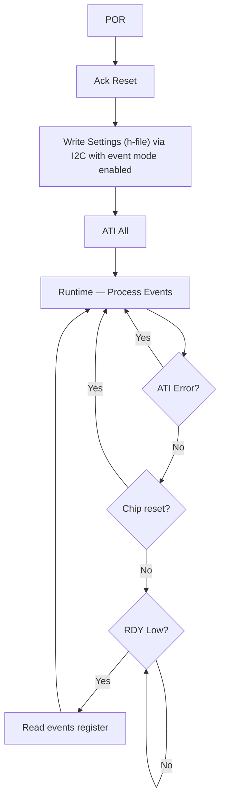
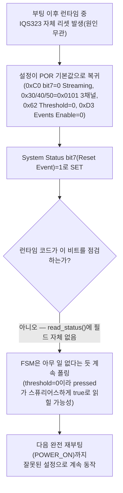

# 검증_4 · 완전성 비평 — 부록C·런타임 라이브 토글·bit7 이후 거동

**TL;DR**: 데이터시트·azd004·azd125 재검토로 그라운드_1~3·후보_1~5의 공백을 찾았다. 부록C Known Issue는 2건으로 재확인(신규 없음)했으나, azd004 고유의 강제개방-이벤트 경합 레이스와, IQS323 내장 255ms 통신 워치독을 런타임 코드가 전혀 점검 안 하는 구조적 공백을 새로 찾았다. Streaming↔Events 런타임 토글은 명시 금지는 없으나 벤더 참고 흐름 두 종 모두 부팅 1회성 설계였다.

> [!NOTE]
> 본 문서는 지시받은 3개 원문(`docs/참고/touch/iqs323_datasheet.pdf`·`azd004_azoteq_sensing_v1.1.pdf`·`azd125-capacitive_sensing_design_guide_v1.2.pdf`)을 전부 `pdftotext -layout`으로 직접 재추출(각 3999·1877·2057행)해 재검토했고, 코드는 `tdc_touch_iqs323.c`·`tdc_touch.c`·`tdc_touch.h`·`initialize.c`를 grep·직접 Read로 대조했다. 역할 지시대로 **그라운드_1~3·후보_1~5(문서 01~08) 전체를 먼저 통독**해 이미 다뤄진 내용을 확인한 뒤, 겹치지 않는 항목만 아래에 보고한다. 확인 못 한 부분은 전부 **[미확인]**으로 표기했다. 저장소에 있는 `IQS323_User_Guide_v1.1.pdf`·`azd115`·`azd135`는 지시받은 스코프 밖이라 열지 않았다.

---

## 질문_1(a) — 부록C에 I2C Lock Up·I2C Settings Register 외 다른 Known Issue가 있는가

**결론: 없다. 신규 없음.** `iqs323_datasheet.pdf` 목차(추출본 282행 `C Known Issues .... 67`)가 하위 항목 나열 없이 단일 페이지 번호만 표기하는 것부터, 실제 페이지 67(추출본 3896~3923행) 전문까지 직접 대조한 결과 **정확히 2건**만 존재한다.

| Known Issue | 적용 버전 | 원문 요지(추출본 3896~3923행) |
|---|---|---|
| I2C Settings Register | IQS323-00x v1.3 이하만 | "Once set, the bits in the I2C Settings register cannot be cleared." — 리셋(§6.6)으로만 해소 |
| I2C Lock Up | IQS323-00x v1.3 이하·A0x v1.4 이하 | "all bytes read over I2C return a constant value" — force comm(§8.13) 사용 시 가능성↑ |

페이지 67 다음은 바로 "Contact Information"(추출본 3934행)·법무 면책조항으로 넘어가 문서가 끝난다 — 숨겨진 3번째 항목은 없다. 그 밖에 "malfunction"·"erratum"·"known limitation"·"does not work" 등으로 전체 문서를 재훑었으나 부록C 밖에서 발견되는 별도 결함 서술도 없었다(면책조항 상투구 1건 제외).

두 항목 모두 이미 후보_1(C1)이 발견해 정확히 구분해 두었다(존재 자체는 새로운 사실이 아님). 본 검증이 추가하는 것은 다음 코드 확인뿐이다.

> [!IMPORTANT]
> **부가 확인**: `I2C Settings Register` 에라타가 관여하는 레지스터는 0xE0(A.36, Stop Bit Disable=bit0·Read/Write Check Disable=bit1)이다. `grep -rn "0xE0\b|I2C_SETTINGS|STOP_BIT|READ_WRITE_CHECK" src/2__cm3/Cortex-M3-src/systemControl/` 결과 **0건** — Sound1 코드는 0xE0을 전혀 건드리지 않는다. 즉 이 에라타는 C1이 확인한 "버전대역이 00x뿐이라 A0x면 무관"이라는 조건에 더해, **Sound1이 애초에 이 레지스터를 쓰지 않으므로 어느 버전이든 이중으로 무관**하다 — 이 코드 레벨 교차확인은 신규다.

---

## 질문_2(b) — Streaming↔Events를 런타임 중 라이브로 토글 가능한가, 아니면 특정 초기화 시점 전용인가

**결론**: 데이터시트 원문 어디에도 "런타임 재토글 금지"라는 명시 문장은 없다 — 그러나 **벤더의 독립된 두 참고 흐름(IQS323 자체 프로그램 흐름도 + azd004의 범용 프로그램 흐름도) 모두 Interface Selection을 "설정 1회성" 단계에서만 다루고, Runtime 루프에는 재설정 분기가 전혀 없다.** 이는 그라운드_1~3·후보_1~5 어느 문서도 인용하지 않은 두 도표(§8.15 Figure 8.3, azd004 §12.7 Figure 12.9)에서 나온 사실이다.

### 근거_1 — IQS323 데이터시트 자체 프로그램 흐름도 (§8.15, 추출본 1944~1996행, PDF 34페이지)

Figure 8.3 "Program Flow Diagram"은 다음 순서를 보인다(추출본 원문 그대로):



"event mode enabled"는 **Write Settings 단계에 포함된 일회성 속성**으로만 등장하고, 우측의 "Runtime" 루프(ATI Error?·Chip reset?·RDY Low? 순환)에는 Interface Selection을 다시 쓰는 분기가 없다.

### 근거_2 — azd004 범용 프로그램 흐름도 (§12.7, 추출본 1710~1789행, PDF 31페이지)

azd004(IQS323 한정이 아닌 Azoteq 제품군 공통 앱노트)의 Figure 12.9도 동일한 패턴이다: POR → Wait For RDY → Read Product Number → Wait For RDY → Acknowledge Reset(+ Setup Device/Write Settings, 같은 창에서 병행 가능) → ATI All → Runtime(Process Event Data / ATI Error? / Reset Event? 순환). 12단계 서술(추출본 1776~1789행) 중 7~12단계가 런타임 루프인데, 여기에도 인터페이스 모드 재설정 절차는 없다. 원문(추출본 1797행): "The acknowledge reset and ATI all commands can be applied when writing the device settings."— 이 역시 "설정 일괄 작성" 단계에 한정된 서술이다.

### 근거_3 — 게이트 조건의 정확한 성격 (§6.6.1, 추출본 1308~1324행, PDF 22페이지)

그라운드·후보 문서들은 §8.12("Reset Event bit이 set이면 안 됨")만 인용했는데, **§6.6.1에 더 직접적인 문장이 있다**:

> "While the Reset Event bit is set: **The device will not be able to enter I2 C event mode**"

이 문장 자체는 이미 알려진 게이트(§8.12)와 같은 조건을 가리키지만, **이 게이트가 "매 리셋 이후 1회성" 조건이지 "초기화 구간에서만 유효한 특수 모드"가 아니라는 점**이 중요하다. Ack Reset(코드 237행)으로 Reset Event bit가 한 번 clear되면, 그 이후 새로운 리셋이 발생하지 않는 한 이 조건은 런타임 내내 계속 충족된 상태로 남는다 — 즉 데이터시트 문언만 보면 **"부팅 시점에만 쓸 수 있다"가 아니라 "리셋 직후 상태에서만 못 쓴다"**는 훨씬 약한 제약이다. 이론적으로는 런타임 중 언제든 bit7을 다시 써도(Reset Event bit가 clear 상태이기만 하면) IC 쪽에서 거부할 근거가 없다.

> [!IMPORTANT]
> **종합 판정**: "금지되어 있다"와 "벤더가 그렇게 하는 것을 한 번도 보여주지 않았다"는 다른 주장이다. 본 검증은 후자만 확정할 수 있었다. 데이터시트·azd004 어디에도 Interface Selection이 런타임 중 재토글되는 예시·경고·주의사항이 없으므로, C4가 검토 중인 것과 같은 향후의 "런타임 중 Streaming으로 일시 전환 후 복귀" 같은 설계가 나온다면 이는 **양쪽 벤더 문서 어디에도 전례가 없는 미검증 영역**으로 취급해야 한다. Sound1의 현재 설계(5개 write 사이트 전부 부팅 시 apply_settings() 경로 안에서만 실행, `grep`으로 재확인 시 런타임 폴링 경로에는 0xC0 write가 전혀 없음)는 이미 두 벤더 참고 흐름과 정확히 같은 패턴(1회성 설정)이므로 이 문제와 무관하게 안전하다.

---

## 질문_3(c) — bit7=1 전환 후 기존에 논의되지 않은 다른 레지스터 거동 변화가 있는가

전체 데이터시트에서 "Interface Selection"·"Streaming"·"Event Mode"·§8.11~8.13 관련 전체 언급을 재검색(추출본 상 12개 지점)해 교차 확인한 결과, RDY 어서션 타이밍 외에 **직접적인 레지스터 거동 변화**는 찾지 못했다(OutA §7.1 마스크 레지스터·Halt Mode 진입 절차·Follower Event Mask(A.15) 등은 전부 확인했으나 Interface Selection과 무관함을 그렙으로 확인, Sound1도 전부 미사용). 다만 **다른 두 축에서 놓쳤던 연결점**을 찾았다.

### 발견_1 — Automatic Re-ATI(§5.10)가 유휴 구간 "RDY 완전 침묵" 가정에 예외를 만든다

G2가 "완전 유휴(터치 없음, ATI 정상) 구간엔 조기반환 히트율 ≈ 0%"라고 결론지은 근거는 §8.11.2/8.12(활성 이벤트 없으면 RDY 불변)였다. 그런데 §5.10 Automatic Re-ATI(추출본 1114~1131행, PDF 19페이지)는 **사용자 터치와 무관하게** 동작하는 별도 메커니즘이다:

> "The IQS323 automatically detects when a channel drifts out of it's design time operating range. To place the channel back into it's expected operating range, a re-ATI is automatically triggered... When a re-ATI occurs the ATI Event bit in the System Status register will be set."

이것은 §5.11 ATI Error(그라운드·후보가 이미 충분히 다룬, `re_ati()` 수동 재트리거 대상)와는 **다른 메커니즘**이다 — §5.10은 순전히 IC 내부에서 LTA가 ATI Band를 벗어나면 **마스터 개입 없이 자동으로** 재수행되고, 성공 여부와 무관하게 "ATI Event" 비트(bit4)를 세운다. Sound1의 `events_enable()`(0xD3=0x52)은 이 ATI Event를 **이미 활성화**해 두었다(코드 300~304행, 기존 문서들이 이미 확인). 즉 사용자 터치가 전혀 없어도 온도·습도 등 환경 드리프트로 LTA가 밴드를 벗어나면 이벤트 모드에서 RDY가 자연 assert된다 — G2의 "유휴=조기반환 거의 0%" 결론을 뒤집는 정도는 아니지만(이런 드리프트는 분·시간 단위로 드물 것으로 추정, 100ms 폴링마다 발생하는 현상이 아님), **완전히 0%는 아니라는 예외 사례를 명시적으로 인정해야 정확하다.** 부수적으로 이 자연발생 RDY 어서션은 아래 추가발견_1(강제개방 레이스)이 실제로 맞물릴 수 있는 구체적 트리거 후보이기도 하다.

`read_status()`(iqs323.c:347~366)는 ati_active(bit5)·ati_error(bit6)·pressed(msb bit1)·prox(msb bit0)만 추출하고 **ati_event(bit4)는 아예 읽지 않는다** — 코드가 이 비트를 무시하는 것 자체는 문제없다(§8.12상 레지스터를 읽기만 해도 글로벌 이벤트 플래그가 clear되므로, 굳이 값을 안 봐도 다음 판정에 지장 없음). 다만 완전성 관점에서 이 메커니즘의 존재 자체가 그라운드·후보 어느 문서에도 언급되지 않았기에 기록해 둔다.

### 발견_2 — CH Timeout Disable(0xC0 MSB=0x07)의 기능적 의미와 5-사이트 동기화 요구의 확장

후보_1(C1)이 이미 "CH Timeout Disable(MSB 0x07)은 불변"이라는 **산술적 사실**은 확인해 두었다(63행). 본 검증이 추가하는 것은 **이 필드가 실제로 무엇을 하는지**다.

§5.8 Channel Timeouts(추출본 1056~1061행, PDF 17페이지):

> "A channel will be reseeded and therefore exit a proximity or touch state if it has been in a proximity or touch state for longer than the relevant time specified by the timeouts in the Event Timeouts register... They can be disabled on a per channel basis using the **CHx Timeout Disable** bits in the **System Control register**."

즉 이 필드는 **IC 자신이 "너무 오래 눌려있다"고 판단하면 스스로 reseed해 터치 상태를 강제로 풀어버리는 기능**을 채널별로 끄는 스위치이며, Interface Selection(bit7)과 **같은 레지스터(0xC0)의 같은 바이트 페어(MSB, bit10-8)**에 있다. Sound1의 6개 write 사이트 중 ack_reset(237행) 제외 나머지 5곳 전부가 MSB=0x07(CH0/1/2 Timeout Disable 전부 set)로 **이 IC 자체 자동 reseed 기능을 명시적으로 꺼 두었음**을 코드에서 직접 재확인했다 — Sound1의 롱터치 로직(`TDC_TOUCH_LONG_TOUCH_MS` 등, 이미 여러 문서가 다룸)은 전적으로 펌웨어 쪽에서만 처리하고, IC 자체의 경쟁 메커니즘과 충돌하지 않도록 이미 잘 설계되어 있다는 **긍정적 확인**이다.

다만 A.31 Event Timeouts(0xD2, 추출본 3646~3662행, PDF 62페이지)의 POR 기본값은 0x0000이고, "Touch Event Timeout = 값 × 512ms"라는 명문 공식만 있을 뿐 "0"이 정확히 무엇을 뜻하는지(0ms 즉시 reseed vs 타임아웃 비활성)는 §8.11.1의 Report Rate=0과 **동일한 패턴의 모호성**이다. Sound1은 CHx Timeout Disable로 이 필드 자체를 무력화해 두었으므로 이 모호성이 실질적으로 영향을 주지 않는다는 점까지 확인했다 — 즉 이것은 새로운 리스크가 아니라 **기존 설계가 이미 안전함을 뒷받침하는 재확인**이다. 다만 이 사실이 의미하는 바는: **향후 어느 후보(C1~C5)가 0xC0에 새 write 사이트를 추가한다면, bit7(Interface Selection)뿐 아니라 MSB=0x07(CH Timeout Disable)도 함께 이월해야 한다**는 동기화 요구가 LSB에 이미 알려진 것과 대칭적으로 MSB에도 적용된다는 것이며, 이 대칭성은 어느 문서도 명시적으로 짚지 않았다.

---

## 추가발견 — 지시된 3항목을 넘어 찾은 것 (완전성 비평 취지상 보고)

역할 지시가 "새로 찾은 것만 보고하라"고 명시했으므로, 지시된 (a)(b)(c) 3항목에 정확히 들어맞지는 않지만 같은 재검토 과정에서 발견한 항목 2건을 덧붙인다. 둘 다 8개 문서 전체를 재확인(grep)했으나 어디에도 없었다.

### 추가발견_1 — 강제개방과 자연발생 이벤트의 경합 레이스 (azd004 §12.6, PDF 30페이지, iqs323_datasheet.pdf에는 없음)

`iqs323_datasheet.pdf`에는 없고 **azd004에만 있는** 내용이라 그라운드·후보 문서(전부 `iqs323_datasheet.pdf`만 원문으로 인용) 어디에도 등장하지 않는다. 원문(추출본 1703~1708행):

> "A force communication request should be avoided while RDY is in the active state. If a communication request is sent at the exact moment when an event causes RDY to go low, the window will close again after sending the I2 C STOP signal. In such a scenario, the device will provide an invalid communication response (0xEE) because the master is attempting to read from the device outside of a communication window (i.e., while RDY is high). **To prevent this issue, it is recommended to read the product number during each ready window to ensure that the response received is valid.**"

**메커니즘 재구성**: §8.9/§8.13이 공유하는 "0xFF" 와이어 패턴(이미 후보_2가 다른 목적으로 확인한 사실 — "터미네이트"와 "포스"가 같은 바이트값)이 여기서는 **레이스 컨디션**을 만든다. 마스터가 "RDY=high(닫힘)"를 확인하고 0xFF(강제개방)를 보내는 바로 그 순간, IC 쪽에서 독립적으로 실제 이벤트가 발생해 RDY를 low로 만들면 — 마스터의 0xFF+STOP은 "이미 열린 창을 닫으라"(터미네이트)로 오인되어, 방금 진짜 이벤트가 연 창을 도로 닫아버린다. 마스터가 이어서 데이터를 읽으려 하면 창 밖 read가 되어 0xEE를 받는다. 부록C의 I2C Lock-Up(실리콘 결함, 특정 구버전 한정)과 달리 **이것은 프로토콜 자체의 정상 동작이며 버전과 무관하게 모든 IQS323에서 발생 가능**하다.

Sound1과의 연결점:
- `force_window_open()`(iqs323.c:145~175)이 정확히 이 패턴이다 — RDY 확인 후 조건부로 0xFF를 보낸다. RDY 확인 시점과 실제 0xFF 바이트가 IC에 도달하는 시점 사이(수~수십 마이크로초, I2C 버스 속도에 따라 다름)에 발견_1(Automatic Re-ATI)이나 실제 터치 이벤트가 끼어들 여지가 이론적으로 있다.
- Events 모드는 이 경합의 **분모(강제개방 시도 횟수)를 G2가 이미 정량화한 대로 급증**시키므로, 이 레이스의 노출 빈도도 비례해 늘어난다. 이는 부록C 에라타(그라운드_1이 이미 버전 게이트로 다룬 리스크)와는 **독립적으로 존재하는 별개의 원인**이라, 그라운드_1의 IC 버전이 에라타 미해당으로 확인되어도 이 레이스 자체는 사라지지 않는다.
- 발생 시 결과(0xEE)는 Sound1의 기존 글리치 검사(`lsb==0xEE && msb==0xEE`, `read_status()` 357행)에 걸려 "읽기 실패"로 처리될 가능성이 높다 — 즉 이 레이스는 이미 여러 문서(그라운드_1·후보_1·후보_2)가 우려한 "강제개방 실패율 상승 → 롱터치 카운터 즉시 리셋" 사슬에 **또 하나의 원인을 추가**한다.
- 벤더의 권고 완화책("매 ready window마다 product number를 읽어 유효성 검증")은 어느 문서도 검토하지 않았다. 다만 이를 문자 그대로 매 통신마다 적용하면 통신량이 또 늘어나 후보_2(C2)가 이미 우려한 "워크어라운드 자체가 자기애그레서" 문제를 재현한다 — 그라운드_1의 부팅 1회성 Product Number read(계열 판별용)와는 **다른 용도**(매 창마다 유효성 검증)이므로 그대로 재사용할 수 없고, 별도 트레이드오프 검토가 필요하다는 점만 표시해 둔다.

> [!WARNING]
> 이 레이스의 실제 발생 확률·충돌창 폭은 **[미확인]**이다 — CM3측 I2C 드라이버(`driver_i2c.c`)의 실제 바이트 전송 소요시간, Automatic Re-ATI/실제 터치 이벤트의 실제 발생 빈도 모두 오실로스코프·RTT 실측이 필요하다. 본 발견은 "메커니즘이 원문에 존재하고 Sound1 코드 구조와 정확히 들어맞는다"는 것까지만 확정한다.

### 추가발견_2 — IQS323 내장 255ms 통신 워치독 + 런타임 전체가 Reset Event 비트를 점검하지 않는 구조적 공백

**§7.6 Watchdog Timer**(추출본 1693~1705행, PDF 29페이지) 원문:

> "The IQS323 implements a hardware watchdog timer. **The watchdog timer is set to expire after 255ms if not kicked and will trigger a software reset upon expiration.** During I2 C communication the IQS323 kicks the watchdog timer whenever a byte level read or write occurs. Therefore, if the master initiates communication by sending an I2 C START condition and does not complete the I2 C transaction, the IQS323 will reset after 255 ms."

이 워치독은 **Sound1의 CM3측 `SYS_WATCHDOG_RESET()`(main.c, 여러 문서가 이미 다룬 보드 리부팅 안전장치)와는 완전히 다른, IQS323 칩 내부에만 있는 별개의 자체 리셋 메커니즘**이다 — 어느 그라운드·후보 문서도 언급하지 않았다.

이것이 왜 완전성 관점에서 중요한지 확인하기 위해 **코드 전체를 grep**했다.

```
grep -n "reset_event|RESET_EVENT|(1u << 7)|bit7" tdc_touch_iqs323.c
  → 256행 confirm_reset() 단 1곳(부팅 시 apply_settings() 경로 전용)

grep -rn "reset_event|RESET_EVENT|ResetEvent" src/2__cm3/
  → 전체 저장소 통틀어 위 1곳뿐

tdc_touch_iqs323_status_t 구조체(헤더 61~66행): ok/pressed/prox/ati_error/ati_active
  → reset_event 필드 자체가 없음

tdc_touch_iqs323_apply_settings() 호출부: tdc_touch.c:161 단 1곳
tdc_touch_init_begin() 호출부: initialize.c:448 단 1곳 (tdc_touch.h:11 주석: "POWER_ON 진입 시 1회")
```

이 네 가지 확인을 결합하면: **Reset Event 비트(System Status bit7)를 점검하는 코드는 저장소 전체에서 부팅 1회성 `confirm_reset()` 단 한 곳뿐이고, 런타임 폴링이 쓰는 `read_status()`는 이 비트를 아예 구조체에 담지도 않는다.** §6.6.1(추출본 1311~1317행, 이미 후보_2가 다른 맥락에서 인용)이 명시하듯 "리셋이 발생하면 칩의 설정은 시작값(POR 기본값)으로 되돌아간다" — 즉 부팅 이후 어떤 이유로든(이 255ms 워치독이든, ESD든, 순간 전원 흔들림이든, 혹은 부록C 에라타 자체와 무관한 진짜 정상 리셋이든) IQS323이 스스로 리셋되면:



**자체 반증 시도**: (1) 기존 `re_ati()` 복구 경로(INV-CTRL-2)가 우연히 이를 구제하지 않는가? — POR 복귀로 3채널이 다시 활성화되면서 ati_error가 우연히 set될 가능성은 있으나, `re_ati()`는 0x36(채널 비활성화)·0x61/0x62(임계값)·0xD3(Events Enable)를 다시 쓰지 않고 Re-ATI 트리거 비트만 세우므로(465행, "0x54,0x07"만 write) **부분적·불완전한 복구**에 그친다 — 나머지 설정(3채널 활성·임계값 0)은 그대로 깨진 채 남는다. (2) 후보_2(C2)의 `lockup_probe()`가 이를 잡지 않는가? — C2의 프로브는 존재하지 않는 레지스터(0xF0) read가 0xEE를 반환하는지만 본다. 정상적인(Lock-Up이 아닌) 리셋 직후에는 0xF0 read가 §8.10 규정대로 여전히 정확하게 0xEE를 반환하므로 **C2의 메커니즘도 이 시나리오를 탐지하지 못한다** — 직접 코드로 재확인한, C2 스펙의 사각지대다. (3) 글리치 검사(`lsb==0xEE && msb==0xEE`)가 우연히 걸리지 않는가? — 정상 리셋 후 System Status(0x10)는 실재하는 레지스터라 정상적인 (그러나 의미상 잘못된) 값을 반환하지, 0xEE0xEE를 반환할 이유가 없다 — 걸리지 않는다. 세 가지 기존 안전장치 전부 이 시나리오를 통과시킨다는 것을 확인했다 — 반증에 실패했고, 그 실패 근거를 위에 남긴다.

이 발견이 이벤트 모드 채택과 맞물리는 지점은: 이 워치독은 Interface Selection과 무관하게 항상 존재하는 위험이지만, **Events 모드가 강제개방(force-comm) 빈도를 그라운드_2가 이미 정량화한 만큼 늘리면, "START는 보냈으나 트랜잭션을 못 끝내는" 상황에 노출되는 횟수도 비례해서 늘어난다** — 즉 이 사전조건(§7.6)과 노출빈도 증가(G2)가 결합해, 지금까지 논의된 "부록C 에라타"와는 **버전 독립적으로 별도 존재하는** 추가 위험 경로를 이룬다.

> [!WARNING]
> 이 워치독이 실제로 Sound1의 I2C 드라이버에서 트리거된 사례가 있는지는 **[미확인]**이다 — `driver_i2c.c`가 START 후 실패 시 항상 정상적으로 STOP까지 마무리하는지는 이번 조사 범위에서 확인하지 않았다(별도 코드 검토 필요). 본 발견이 확정하는 것은 (1) 이 워치독 메커니즘이 데이터시트에 실재한다는 것, (2) 런타임 코드가 Reset Event 비트를 구조적으로 점검하지 않는다는 것, (3) 기존에 제안된 세 안전장치(re_ati 복구·C2 lockup_probe·기존 글리치 검사) 전부 이 시나리오를 놓친다는 것까지다 — "실제로 몇 번 발생했는가"는 실측 게이트로 남긴다.

---

## 결론 요약

| 항목 | 결론 | 신규 여부 |
|---|---|---|
| (a) 부록C 추가 Known Issue | 없음 — 정확히 2건(I2C Lock Up·I2C Settings Register) 확정 | 존재확인은 기존(C1), 0xE0 코드 미사용 교차확인은 신규 |
| (b) 런타임 라이브 토글 | 명시적 금지 문장 없음, 그러나 IQS323·azd004 두 참고 흐름 모두 부팅 1회성 설계 — "미검증 영역"으로 취급 권고 | 신규(§8.15 Fig 8.3·azd004 §12.7 Fig 12.9 최초 인용) |
| (c) bit7=1 이후 기타 레지스터 거동 | 직접적 거동 변화는 없음. Automatic Re-ATI(§5.10)가 유휴 가정에 예외를 만들고, CH Timeout Disable(MSB)의 기능적 의미와 5-사이트 동기화 확장을 확인 | 신규(두 항목 모두) |
| 추가발견_1 | 강제개방-자연이벤트 경합 레이스(azd004 §12.6), 버전 무관, 부록C와 별개 원인 | 신규(azd004 고유, 원 데이터시트엔 없음) |
| 추가발견_2 | IQS323 내장 255ms 통신 워치독 + 런타임 전체 Reset Event 비트 미점검 구조적 공백. 기존 3개 안전장치(re_ati·C2 프로브·글리치검사) 전부 미탐지 확인 | 신규(가장 중요도 높음으로 판단) |

## 미확인 목록 (실측·후속 확인 게이트)

| 항목 | 상태 |
|---|---|
| azd004 §12.6 레이스의 실제 발생 확률·충돌창 폭 | [미확인] — I2C 버스 속도·이벤트 발생빈도 실측 필요 |
| §7.6 워치독이 Sound1 I2C 드라이버에서 실제 트리거된 이력 | [미확인] — `driver_i2c.c` START-미완료 시 STOP 처리 여부 별도 코드 검토 필요 |
| Automatic Re-ATI(§5.10)의 실제 발생 빈도(환경 드리프트 주기) | [미확인] — 장시간 RTT 로깅 필요 |
| Interface Selection 런타임 재토글이 실제로 IC에서 거부되는지(이론상 가능해 보이나 실기 미검증) | [미확인] — 벤더 문의 또는 실기 테스트 필요 |
| A.31 Event Timeouts(0xD2)의 POR 값 "0"이 0ms인지 비활성인지 | [미확인] — Sound1은 CH Timeout Disable로 이 필드를 무력화해 실질 영향 없음을 확인했으나 값 자체의 의미는 미확정 |
