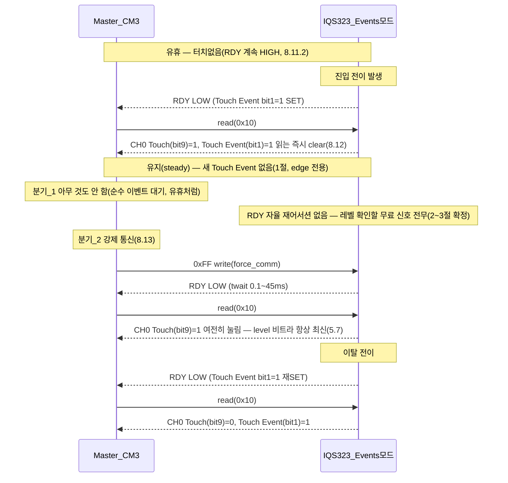

# 그라운드_8 · 이벤트 모드 edge 대 level — 터치 유지 재확인 가능성 정밀 재확인

**TL;DR**: §8.11~8.12·Table 8.1 원문 대조 결과, Touch 이벤트는 진입/이탈 전이(edge)에만 발생하고 유지 중 재발생하지 않음을 확정한다. §8.12 "계속 창 제공"은 미해결 플래그의 반복 재고지일 뿐 RDY 연속 low가 아니다. ATI OR경로는 실재하나 LTA 동결로 희박하고, 채널 타임아웃 자동해제는 Sound1이 비활성화했다. CHx Touch(bit9)는 레벨 비트라 강제통신으로 언제든 읽히나 자율 신호는 없다.

---

## 0. 조사 방법·근거

- 데이터시트: `docs/참고/touch/iqs323_datasheet.pdf`를 본 노드가 직접 `pdftotext -layout`으로 재추출(`/tmp/iqs323_g8.txt`, 3999행, 선행 노드들의 추출본과 별개로 독립 재생성). §5.7~5.11·§7.4·§7.6·§8.5~8.14·부록 A.2(System Status)·A.30(System Control)·A.31(Event Timeouts)·A.32/A.33(Events Enable)을 원문 그렙(grep)+직접 통독으로 대조했다.
- 코드: `src/2__cm3/Cortex-M3-src/systemControl/tdc_touch_iqs323.c` 전체(500행)를 본 노드가 직접 재통독하고, `0xD2`·`0xC5`·`REG_SYSTEM_CONTROL` 관련 write 6곳 전부를 grep으로 재확인했다(선행 문서의 주장을 재신뢰하지 않고 독립 재검증).
- 선행 문서(`02_G2_...`·`07_C4_...`·`10_V2_...`)는 출발점으로만 참고하고, 본 노드의 결론은 전부 위 1·2차 소스 직접 대조로 재도출했다.

---

## 1. 질문_1 — Table 8.1 "Touch" 트리거 조건의 정확한 원문 서술

### 1.1 원문 (직접 재확인)

`Table 8.1: Events Descriptions`(§8.12 직후, PDF Page 32 of 68, `/tmp/iqs323_g8.txt:1866~1883`) 전 6행을 그대로 인용한다.

| Event | Trigger Condition (원문 그대로) |
|---|---|
| ATI Error | There has been an error during the ATI process |
| ATI Event | ATI has been triggered |
| Power | Power mode has changed |
| Slider | A slider gesture has been detected |
| Prox | Any channel has entered or exited a proximity state |
| **Touch** | **Any channel has entered or exited a touch state** |

Touch 행의 정확한 문구는 **"Any channel has entered or exited a touch state"**다 — "is in a touch state"나 "remains touched" 류의 상태(state) 서술이 아니라, "entered or exited"라는 **전이(transition) 동사**로만 서술된다. 이는 오케스트레이터 원 서술("진입/이탈 전이에만 발생")과 **축자 일치**한다.

> [!NOTE]
> Table 8.1의 6행 전부가 동일한 문법 구조("has been an error", "has been triggered", "has changed", "has been detected", "has entered or exited" ×2)를 쓴다 — 전부 현재완료 시제의 **1회성 발생(occurrence)** 서술이며, 지속 상태(level)를 서술하는 행은 **단 하나도 없다**. Events Enable/System Status의 "System Flags" 바이트(하위 8비트) 전체가 구조적으로 edge 전용임을 뒷받침한다.

### 1.2 System Status 레지스터 비트 구조 대조 — edge 플래그와 level 비트의 분리 확인 (본 노드 핵심 발견)

`A.2 System Status (0x10)`(PDF Page 49~50 of 68, `/tmp/iqs323_g8.txt:2713~2771`) 비트맵을 직접 재확인한 결과, 이 16비트 레지스터는 **성격이 다른 두 그룹**으로 명확히 나뉜다.

| 비트 그룹 | 비트 위치 | 내용 | clear 조건(원문) |
|---|---|---|---|
| Channel Flags (level) | 15-14 Current Power Mode, 13 CH2 Touch, 12 CH2 Prox, 11 CH1 Touch, 10 CH1 Prox, **9 CH0 Touch**, 8 CH0 Prox | "0: CHx not in Touch / 1: CHx in Touch" | **읽어도 안 지워짐** — §5.7 원문(`:1015~1016`): "Once a channel enters a proximity or touch state, the relevant CHx Prox or CHx Touch bits will be set in the System Status register, **and will remain set until the channel leaves its proximity or touch state**." |
| System Flags (event) | 7 Reset Event, 6 ATI Error, 5 ATI Active, 4 ATI Event, 3 Power Event, 2 Slider Event, **1 Touch Event**, 0 Prox Event | "0: No X occurred / 1: X occurred" | §8.12(`:1863~1864`): "The global event flags are cleared when the master reads them via I2C." |

**Bit 9(CH0 Touch)는 level, Bit 1(Touch Event)은 edge다 — 완전히 별개의 두 비트이며, 서로 다른 clear 규칙을 갖는다.** 이 구분은 선행 문서(02·07·10)가 Table 8.1의 "Touch" 항목을 인용할 때 명시적으로 짚지 않은 지점이라 본 노드가 추가한다.

**코드 교차검증**(`tdc_touch_iqs323.c:347~367`, `tdc_touch_iqs323_read_status()`):
```c
out->pressed = (msb & (1u << 1)) != 0; /* bit9 = MSB bit1, CH0 Touch */
```
Sound1의 FSM이 실제로 소비하는 `out->pressed`는 **bit9(level, CH0 Touch)이지 bit1(edge, Touch Event)이 아니다.** 코드 주석도 "CH0 Touch"라고 명시해 이 매핑이 datasheet A.2와 정확히 일치함을 자체 확인하고 있다. Touch Event(bit1)·Prox Event(bit0)·Power Event(bit3)·Slider Event(bit2)는 `read_status()`가 애초에 **추출조차 하지 않는다**(ati_active=bit5, ati_error=bit6만 추출).

### 1.3 판정

Table 8.1의 Touch 트리거 조건은 원문 그대로 edge(진입/이탈 전이) 전용이며, 이는 System Status 레지스터의 비트 구조(clear-on-read edge 플래그 vs 상시-반영 level 비트가 물리적으로 분리된 별개 비트)로도 이중 확인된다. **오케스트레이터 서술 (a)는 원문과 정확히 일치한다.**

---

## 2. 질문_2 — §8.12 "continuously provide ready windows"의 정확한 의미

### 2.1 원문 (직접 재확인)

§8.12(PDF Page 32 of 68, `/tmp/iqs323_g8.txt:1856~1864`) 전문:

> "To enter event mode, the Reset Event bit in the System Status register must not be set... Enabled events are reported in the System Status register when triggered. Global events can be individually enabled by setting the relevant bit in the Events Enable register. **The global event flags are cleared when the master reads them via I2C. When they are set, the IQS323 will continuously provide ready windows.**"

### 2.2 "RDY가 연속 low로 유지"인가 "한 번 low였다 high로 복귀 후 반복 재개방"인가 — 인접 조항으로 재구성

§8.12 자체는 RDY의 전기적 파형(연속 low vs 반복 펄스)을 직접 서술하지 않는다. 그러나 §8.7~8.9(모드 무관, 통신창 개폐의 **일반 규칙**)를 §8.12와 결합하면 답이 좁혀진다.

- §8.9(`:1786~1787`): **"A standard I2 C STOP will close the current communication window."** — 통신창은 마스터가 정상 서비스(STOP)하면 **반드시 닫힌다**(RDY high 복귀). 이는 모드 무관의 일반 규칙이다.
- §8.8(`:1773~1780`): 서비스 안 되면 I2C Transaction Timeout(기본 200ms, `/tmp/iqs323_g8.txt:2160`, `0xD1=0x00C8`) 경과 후 **"the communications window is closed (RDY goes high)"** — 마스터가 아예 응답하지 않아도 200ms 후 창은 강제로 닫힌다.
- §8.11.1(Streaming, `:1837~1839`) "data is constantly reported at the relevant power mode **report rate**" — Streaming은 report rate 간격으로 **반복적으로 재단언(assert)**하는 구조임이 명시된다.

이 세 조항을 종합하면, "continuously provide ready windows"(창을 **복수형**으로, "계속 제공한다")는 **RDY가 한 번 low로 어서트된 후 다음 서비스/타임아웃까지 하나의 창으로 계속 이어지다가 다시 열리지 않는 단일 연속 저전위**를 뜻하는 것이 아니라, **읽히지 않아 아직 clear되지 않은 이벤트 플래그가 존재하는 한, IC가 (Streaming의 report-rate 재단언과 유사한 방식으로) 창을 반복적으로 다시 열어 마스터에게 서비스 기회를 계속 재제공한다**는 뜻으로 읽는 것이 §8.7~8.9의 일반 개폐 규칙과 정합적이다. 이는 **직접 인용이 아니라 인접 조항 종합 추론**이며, 정확한 재개방 주기(내부 몇 ms마다 재시도하는지)는 **[미확인]**으로 남긴다 — 선행 문서(`02_G2_...`§2.2)가 Report Rate=0 의미를 명문화하지 못한 것과 동일한 유형의 게이트다.

### 2.3 "재제공"이 뜻하지 않는 것 — 새 정보 생성이 아니라 동일 플래그의 재고지

가장 중요한 재확인 지점은 다음이다: §8.12의 "continuously provide ready windows"는 어디까지나 **§8.12 서두의 "the global event flags"**, 즉 **이미 set된 채 아직 안 읽힌 그 플래그**를 다시 고지하는 재시도(retry) 메커니즘이지, 시간이 흐른다고 해서 **새로운 Touch 이벤트를 생성**하는 메커니즘이 아니다. Table 8.1(§1)이 이미 확정했듯 Touch Event는 진입/이탈 전이에만 set되므로, "재제공"이 아무리 반복되어도 그 재제공이 실어나르는 정보는 **최초 진입 전이 그 자체**이며, 마스터가 (언제든) 그 창을 서비스해 읽으면 플래그는 그 즉시 clear되고(§8.12 원문) 다음 전이 전까지는 재발생하지 않는다.

**Sound1의 실사용 맥락에 대입**: 현재 100ms 폴링 FSM(`tdc_touch.c:296`)은 터치 진입 시 열린 창을 **다음 폴링(≤100ms 후)에서 바로 서비스**하므로(200ms 타임아웃 이내), "재제공" 메커니즘이 실질적으로 작동할 기회조차 거의 없다 — 첫 서비스에서 곧바로 clear되기 때문이다. **"유휴 시 폴링을 아예 끊는" 하이브리드 설계에서**는 이 재제공이 실제로 여러 차례 일어날 수 있지만(마스터가 실제로 아무것도 안 읽으므로), 그래도 매번 재고지되는 내용은 "터치가 (과거 어느 시점에) 진입했다"이지 "터치가 **지금 이 순간도** 유지되고 있다"가 아니다.

### 2.4 판정

RDY는 **연속 저전위로 유지되는 것이 아니라, 미해결 이벤트가 있는 한 반복적으로 (닫힘→재개방을) 재시도하는 구조**로 읽는 것이 §8.7~8.9의 일반 규칙과 가장 정합적이다(간접 종합, 재개방 정확한 주기는 [미확인]). 그리고 이 재시도는 **동일한 과거 전이 정보의 재고지**일 뿐, 터치 유지라는 **새 레벨 정보를 생성하지 않는다** — 이것이 오케스트레이터 질문 (b)에 대한 가장 정밀한 답이다.

---

## 3. 질문_3 — 다른 이벤트와의 OR·워치독 등 재개방 메커니즘의 존재 여부 (전수 점검)

### 3.1 OR 조건의 명문 근거

§8.11.2(`:1850~1854`) 원문: **"In event mode the RDY line will only go low when one or more of the enabled events are triggered or if the device resets."**

"**one or more**"이 OR 결합을 명문으로 확정한다 — 활성화된 이벤트 중 **어느 것이든** 트리거되면 RDY가 어서트된다. 추가로 **"or if the device resets"**가 이벤트 마스킹과 무관한 **무조건 OR 항**으로 명시된다.

Sound1의 Events Enable(`0xD3=0x52`, `events_enable()`, `tdc_touch_iqs323.c:300~304`) 설정을 `A.33 Events Enable (0xD3)`(PDF Page 63 of 68, `/tmp/iqs323_g8.txt:3688~3719`) 비트 정의와 직접 대조했다(0x52 = 0b0101_0010, 아래 표). 참고로 0xD3 주소는 order code에 따라 두 변형(A.32 Release UI용·A.33 Movement UI용)이 있으나, 하위 바이트(EVENTS_ENABLE, bit7-0) 필드 배치는 두 표에서 **동일**함을 직접 대조 확인했다 — 상위 바이트(bit15-8, Activation Threshold vs Reserved)만 다르고 Sound1은 그 자리에 어느 쪽이든 `0x00`을 쓰므로 본 대조는 order code 변형과 무관하게 유효하다.

| 비트 | 이벤트 | Sound1 활성화 여부(0x52 기준) | 터치 유지 중 실제 재발생 가능성 |
|---|---|---|---|
| 6 | ATI Error | **활성(1)** | 존재하나 우발적 — §3.2 참조 |
| 4 | ATI Event | **활성(1)** | 존재하나 우발적, §3.2에서 더 낮음을 재확인 |
| 3 | Power Event | 비활성(0) | 해당 없음(§3.3에서 이중 차단 확인) |
| 2 | Slider Event | 비활성(0) | 해당 없음 |
| 1 | Touch Event | **활성(1)** | 이것 자체가 진입/이탈 edge — "유지 재확인"의 대상이 아니라 대상이 되어야 할 그 사건 |
| 0 | Prox Event | 비활성(0) | 해당 없음(Prox 임계값이 Touch와 동일하게 맞춰져 있어도 이벤트 자체가 마스킹됨, `apply_settings()` 주석 대조 확인) |
| 7 | Reset Event | (마스킹 무관, §8.11.2 무조건 OR) | 존재하나 정상 동작이 아닌 장애 상황(재초기화 필요) |

### 3.2 ATI Error/Event OR — 실재하나 터치 유지 중엔 오히려 더 희박함 (본 노드 추가 발견)

`§5.10 Automatic Re-ATI`(`:1114~1131`) 원문: "A re-ATI is executed when **the LTA** of a channel drifts outside of the ATI Band" (Re-ATI Boundary = ATI Target ± ATI Band).

그런데 `§7.4 Release UI`(`:1615~1619`) 원문: **"Unlike the standard LTA, the Activation LTA is continuously updated, even when the channel is in a proximity or touch state... When a touch or proximity event is detected the LTA is frozen but the Activation LTA is still updated."**

**표준 LTA는 터치 유지 중 동결(freeze)된다.** Re-ATI의 트리거 조건(§5.10)이 바로 이 "표준 LTA의 드리프트"이므로, **터치가 유지되는 동안은 그 트리거 조건 자체가 성립하기 어렵다** — LTA가 얼어붙어 있으니 ATI Band 밖으로 "드리프트"할 수가 없다. 즉 §8.12(V2 검증노드가 이미 지적한 "ati_error/ati_event 빈발 시 Events도 자주 열림")의 논리는 원문상 **실재하는 OR 경로가 맞지만, 정확히 "터치 유지 중"이라는 조건에서는 그 발생 가능성이 (드리프트 자체가 억제되므로) 선행 검증이 다룬 것보다 한층 더 낮다**는 것이 본 노드의 추가 재확인이다.

> [!NOTE]
> §7.4/A.32/A.33이 "For order codes with Release UI"라고 조건부 표기하는 점을 확인했다 — Sound1 실장 IQS323의 정확한 order code(Hardware ID 0xE1 실측)는 선행 조사(`20260703_touch-heisenberg-config-reexplore`)에서 이미 **[미확인]**으로 남아 있다. 다만 데이터시트 §10(`:2212~2213`) 원문 "**IQS323-00x refers to all versions with the Release UI**"를 확인했다 — 본 문서 전체가 참조하는 기본/일반 order code 계열(00x) 자체가 Release UI를 포함하므로, 이 LTA 동결 메커니즘이 Sound1에 적용될 개연성은 높으나 **확정은 아니다**(선행 미확인과 동일 게이트, 재확인만 하고 해소하지는 못함).

### 3.3 채널 타임아웃 자동해제 — 존재하나 Sound1이 명시적으로 비활성화 (본 노드 신규 발견)

§5.8 Channel Timeouts(`:1056~1058`) 원문: **"A channel will be reseeded and therefore exit a proximity or touch state if it has been in a proximity or touch state for longer than the relevant time specified by the timeouts in the Event Timeouts register."**

이는 오케스트레이터가 예시로 든 "워치독 등"에 정확히 해당할 수 있는 후보다 — IC 자체가 "너무 오래 눌려있으면" 강제로 touch 상태를 이탈시켜(reseed) **Touch Event(진입/이탈 edge)를 스스로 재발생**시킬 수 있는 잠재 경로이기 때문이다. 그러나 두 가지 원문·코드 근거로 **이 경로는 Sound1에서 실제로 차단돼 있음**을 확인했다.

1. **`Event Timeouts (0xD2)` 레지스터**(A.31, PDF Page 62, `/tmp/iqs323_g8.txt:3646~3662`): POR 기본값 `0x0000`(메모리맵 `:2162`). Touch Event Timeout 필드(bit15-8) = "Touch Event Timeout × 512ms"이며, 코드 전체(`tdc_touch_iqs323.c`)에 **`0xD2` 리터럴 0건**(본 노드 독립 grep 재확인) — 즉 이 레지스터는 POR 그대로 미기록 상태다.
2. **`System Control (0xC0)`의 CHx Timeout Disable 비트**(A.30, bit10-8, PDF Page 61, `/tmp/iqs323_g8.txt:3596~3612`): "1: Global prox and touch timeouts disabled for channel". Sound1의 0xC0 write 6곳을 코드에서 직접 재확인한 결과:

   | 코드 위치 | write 값(LSB,MSB) | MSB(=bit15-8, CH2/CH1/CH0 Timeout Disable) | 시점 |
   |---|---|---|---|
   | `:237` `ack_reset()` | 0x01, **0x00** | 전체 0(enabled) | 부팅, IC 리셋 직후 ACK 1회성 — 아직 sensor_setup 이전 |
   | `:318` `beta_power_settings()` | 0x50, **0x07** | 전체 1(disabled) | 부팅, 운용 설정 확정 |
   | `:447` 부팅 Re-ATI 트리거 | 0x54, **0x07** | 전체 1 | 부팅 |
   | `:453` 부팅 Reseed 트리거 | 0x58, **0x07** | 전체 1 | 부팅 |
   | `:465` `tdc_touch_iqs323_re_ati()` | 0x54, **0x07** | 전체 1 | 운용 중(INV-CTRL-2 경로) |
   | `:471` `tdc_touch_iqs323_reseed()` | 0x58, **0x07** | 전체 1 | 운용 중 |

   `:237`(ack_reset, MSB=0x00)만 예외이나 이는 IC 리셋 직후 확인응답 단계로 아직 터치 감지가 시작되기 전이며, 그 직후 `:318`에서 곧바로 MSB=0x07(전 채널 disable)로 재설정되고, 이후 운용 중 발생하는 모든 0xC0 write(:447/453/465/471)가 예외 없이 MSB=0x07을 유지한다. **즉 실제 터치가 발생할 수 있는 모든 운용 구간에서 CH0/1/2 Timeout Disable = 1(비활성화)이 상시 유지된다.**

**판정**: §5.8의 채널 타임아웃 자동해제 메커니즘은 원문상 실재하고 오케스트레이터가 예시로 든 "워치독형" OR 경로의 가장 근접한 후보이지만, Sound1은 이를 **명시적으로 disable**해 사용하지 않는다 — 아마도 IC가 자체 판단으로 임의 시점에 touch 상태를 강제 이탈(reseed)시키면 Sound1 자체 SW 판정(INV-CTRL-3, 첫 터치 해제 감지)과 충돌할 수 있어 **의도적으로 차단**한 것으로 추정된다(코드에 직접적 사유 주석은 없어 이 "의도"는 추정, [미확인]). 따라서 이 경로는 Sound1의 실제 구성에서는 **활용 불가**하다.

### 3.4 워치독 타이머(§7.6) — 무관함 확인

§7.6(`:1693~1705`) 원문: "The IQS323 implements **a hardware watchdog timer**. The watchdog timer is set to expire after 255ms if not kicked and will trigger **a software reset** upon expiration... Outside of a communications window, the IQS323 will automatically kick the watchdog every cycle."

이 워치독은 IC 자체의 내부 오동작 방지(리셋)용 메커니즘이며, RDY 어서션이나 터치 레벨 재고지와는 **전혀 무관**하다 — "매 cycle마다 자동으로 kick"되는 대상은 워치독 자신이지 RDY가 아니다. 오케스트레이터가 예시로 든 "워치독"이 문자 그대로의 §7.6 워치독을 가리킨 것이라면, **이 메커니즘은 터치 유지 재확인과 무관하다는 것이 원문으로 확정**된다.

### 3.5 Power/Reset — 이중으로 무관

Power Event(bit3)는 애초에 Events Enable(0x52)에서 마스킹돼 있을 뿐 아니라, `REG_PM_TIMEOUT`(0xC5) write가 `0x00, 0x00`(코드 `:320`, 본 노드 독립 grep 재확인)이고 §5.3 원문(`:930~931`) "**Setting the power mode timeout to '0x00' will prevent the chip from lowering the power mode**"이 코드 주석과 정확히 일치함을 직접 대조 확인했다 — 즉 파워모드 자체가 바뀌지 않도록 이중으로 잠겨 있어, 설령 마스킹이 풀려도 발생할 조건이 아니다. Reset Event는 §8.11.2상 무조건 OR 항이 맞으나, 실제 디바이스 리셋은 정상 동작이 아닌 장애/전원이상 상황에 해당해 "터치 유지 확인 수단"으로 취급할 수 없다.

### 3.6 종합 판정표

| 검토한 경로 | 원문상 실재 여부 | Sound1 실제 활용 가능성 |
|---|---|---|
| Touch Event 자체 재발생(레벨 유지로) | **부재**(§1, edge 전용 확정) | 불가 |
| §8.12 재제공(retry) | 실재 | 있으나 **동일 과거 정보의 재고지**일 뿐(§2.3) |
| ATI Error/Event OR | 실재 | 우발적, 터치 중 LTA 동결로 오히려 **더 희박**(§3.2, 본 노드 신규) |
| Prox/Slider/Power Event OR | 코드상 마스킹으로 부재 | 불가 |
| 채널 타임아웃 자동해제(§5.8) | 실재(원문) | Sound1이 **명시적 disable**로 불가(§3.3, 본 노드 신규) |
| 워치독 타이머(§7.6) | 실재하나 RDY 무관 | 애초에 무관한 메커니즘 |
| Reset Event OR | 실재(무조건) | 장애 상황 전용, 활용 대상 아님 |

**어느 경로도 "터치 유지 중 RDY가 자율적으로 다시 열려 레벨 정보를 재고지"하는 신뢰 가능한 수단을 제공하지 않는다.**

---

## 4. 핵심 구분 — "확인할 방법이 없다"의 정확한 범위 (레지스터 정보 vs 자율 신호)

여기서 반드시 구분해야 할 지점이 있다. 위 §1~3이 확정하는 것은 **"RDY 라인이 스스로(마스터 개입 없이) 다시 low로 내려가 '아직 눌려있다'를 무료로 알려주는 신호가 없다"**는 것이지, **"System Status 레지스터를 읽으면 그 순간의 눌림 여부를 알 수 없다"**는 것이 아니다.

§1.2에서 확인했듯 **CH0 Touch(bit9)는 이벤트 플래그와 완전히 분리된 level 비트**이며, "채널이 touch 상태를 벗어날 때까지 계속 set 상태를 유지"한다(§5.7 원문). 이 비트는 **레지스터 주소 0x10을 읽는 모든 순간에 항상 그 시점의 실제 값을 담고 있다** — 그 read가 (i) Touch Event로 자연 개방된 창을 통한 것이든, (ii) §8.13 Force Communication(`0xFF` write, 현재 `force_window_open()`이 이미 수행 중인 바로 그 경로)으로 강제 개방한 창을 통한 것이든 상관없다. §8.13 원문(`:1893~1899`) 자체가 "In event mode it may be required to change device settings **or query the device immediately**"라 명시해, 강제 개방 후의 조회가 정상적인 조회와 동등하게 취급됨을 뒷받침한다.



**결론적으로 "정보의 부재"가 아니라 "무료 신호의 부재"다.** 강제 통신으로는 **언제든 정확한 레벨을 읽을 수 있으나**, 그 행위 자체가 마스터 주도 I2C 트래픽(0xFF write + read, 지금의 `force_window_open()`과 동일 비용)이므로 "유휴 시 폴링을 아예 끊는다"는 하이브리드 설계의 전제와 정면으로 배치된다. 이는 후보_6(C6)이 이미 채택한 "진입/ATI에러 이벤트 수신 시 활성 폴링(100ms)으로 전환"이라는 설계가 **선택지 중 하나가 아니라 유일하게 성립 가능한 경로**임을 원문·코드 교차검증으로 뒷받침한다 — 대안(순수 이벤트 대기만으로 레벨 추적)은 존재하지 않는다.

> [!NOTE]
> 부가로, 이 결론은 롱터치 재부팅 카운터(공통입력 코드기준점, `main.c` `tdc_touch_sleep_handle_touch_reboot()`)와도 연결된다 — 이 카운터는 100ms 주기의 **성공적인 반복 read**로 24회 누적돼야 2400ms 롱터치를 판정하므로, "유휴 시 폴링을 끊고 진입 이벤트만 기다린다"는 설계에서도 진입 이벤트 수신 **즉시** 활성 폴링(강제 read 포함)을 재개해야만 이 카운터가 정상 작동한다 — 이 또한 §2~4의 결론과 같은 방향을 가리킨다.

---

## 5. 최종 확정 판정

오케스트레이터의 최종 질문 — **"순수 이벤트 기반으로는 '터치가 아직 눌려있는가'를 유휴처럼(폴링·마스터 개입 없이) 확인할 방법이 없다"**는 명제에 대해:

**확정한다 — 원문·코드 교차검증으로 참이다.**

근거 요약:
1. Touch Event는 Table 8.1·System Status 비트구조 이중 확인으로 **edge 전용**(§1) — 유지 중 재발생 없음.
2. §8.12의 "계속 창을 제공"은 **미해결 과거 이벤트의 반복 재고지**일 뿐 새 레벨 정보를 만들지 않는다(§2).
3. ATI Error/Event OR·채널 타임아웃 자동해제·워치독 등 검토 가능한 모든 대안 경로를 전수 점검했으나, 신뢰 가능한 대체 신호는 **없다**(§3) — 특히 채널 타임아웃 자동해제는 Sound1이 명시적으로 꺼두었고, ATI 경로는 터치 중 LTA 동결로 오히려 더 희박하다는 것을 원문 교차대조로 새로 확인했다.
4. 다만 이 "불가능"은 **자율(RDY 자체 재어서션) 신호의 부재**를 뜻하는 것이지 **레지스터 정보 자체의 부재가 아니다** — 강제 통신(§8.13)으로는 언제든 정확한 현재 레벨(CH0 Touch, bit9)을 읽을 수 있다(§4). 다만 그 행위는 마스터가 능동적으로 I2C를 흔들어야 하는 것이라 "유휴"의 정의를 벗어난다.

따라서 하이브리드 설계(후보_6·7)가 "터치 진입/ATI 이벤트 수신 시 활성 폴링으로 전환해 레벨·롱터치·해제를 추적"하는 방향을 취하는 것은 **선택이 아니라 필연**이며, 그 근거는 본 노드가 원문·레지스터 비트·코드 write 값을 직접 대조해 확정했다.

---

## 6. 리스크·미확인 목록

| 항목 | 상태 |
|---|---|
| §8.12 "계속 재제공"의 정확한 내부 재시도 주기(몇 ms 간격으로 재개방을 시도하는지) | **[미확인]** — §2.2, 원문이 수치를 명시하지 않음. Report Rate와 동일 주기라는 유추는 구조적 정합성은 있으나 명문 근거 없음 |
| Sound1 실장 IQS323의 정확한 order code(Release UI 탑재 여부, Hardware ID 0xE1) | **[미확인]** — 선행 조사(`20260703_touch-heisenberg-config-reexplore`)에서 이미 확인 불가로 남은 것을 본 노드가 재확인만 함, 해소하지 못함. §7.4 LTA 동결 적용 여부에 직결 |
| 강제 개방(§8.13)으로 연 창과 자연 개방(이벤트)으로 연 창 사이에 read/clear 동작상 실질적 차이가 있는지 | **[미확인, 낮은 위험으로 추정]** — §8.13 원문("query the device immediately")이 동등 취급을 시사하나, 명시적으로 "두 경로가 완전히 동일하다"고 서술한 문장은 찾지 못함 |
| CHx Timeout Disable=1이 Sound1에 의도적으로 설정된 이유(코드 주석에 직접적 사유 없음) | **[미확인, 추정]** — INV-CTRL-3(첫 터치 해제 감지)과의 충돌 회피가 개연적 이유이나 코드·커밋 이력에 명시적 근거를 찾지 못함(본 노드 범위에서 git log 미조사) |
| ATI Error 경로(§5.11, LTA 동결과 무관하게 발생 가능한 경로)가 터치 유지 중에도 발생 가능한지 | **[미확인]** — §5.11 "Counts are outside the Re-ATI Boundary upon completion of the ATI algorithm"이 ATI 실행 자체를 전제로 해, ATI가 터치 중 아예 실행되지 않는다면(재확인 안 함) 이 경로도 §3.2와 동일하게 억제될 가능성이 있으나 본 노드가 직접 검증하지 못함 |
