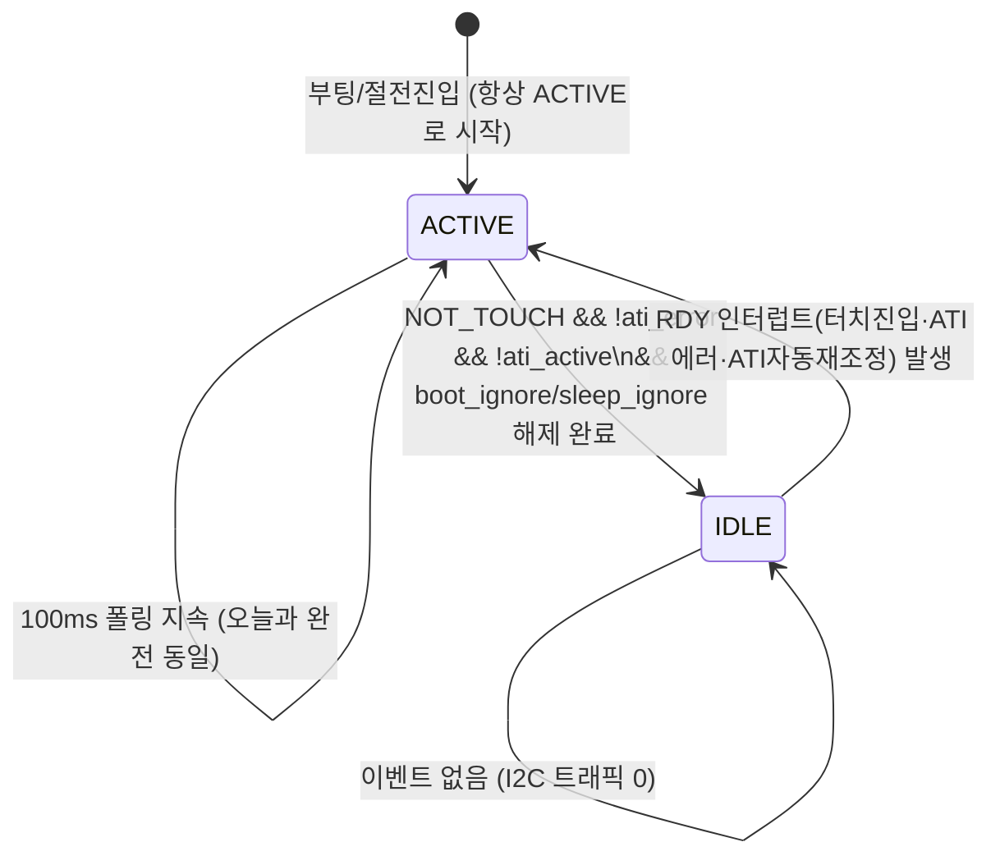

# 19 · 후보_6 — 하이브리드 이벤트+인터럽트 설계 (유휴 무폴링 + 활성 재진입)

**TL;DR**: 유휴(터치없음·ATI정상) 구간 폴링을 멈추고 RDY 인터럽트만 대기하다, 터치진입·ATI에러 이벤트 시 100ms 활성폴링으로 전환하는 하이브리드 상태머신을 설계했다. 롱터치는 타임스탬프 기반이라 안전하나 절전 카운터는 횟수 기반이라 유휴진입 게이트가 필수임을 확인, 3불변식 무손상도 검증했다. duty-cycle 확장 결과 보수적 가정(1%)도 약 98%, 낙관적 가정(0.05%)은 99.9%대 감소로 추정된다.

---

## 0. 방법론 노트 — 그라운드_7·8·9 산출물 부재

15번 문서(공통입력)는 그라운드_7(`16_G7_폴링의존타이밍로직전수.md`)·그라운드_8(`17_G8_이벤트edge대레벨.md`)·그라운드_9(`18_G9_FSM폴링구조확인.md`)의 결과를 반영하라고 지시했다. 그러나 작업 착수 시점에 에이전트-로그 폴더를 재확인한 결과 해당 3개 파일은 존재하지 않았다(`ls` 직접 확인, 15번 문서 이후 신규 파일 0건). 병렬 실행 구조상 그라운드 산출물이 별도 파일로 남지 않는 세션 조건으로 판단해, 본 노드가 그라운드_7·8·9가 맡았을 질문(폴링의존 타이밍 로직 전수, 이벤트 edge/레벨 경계, FSM 폴링 구조)을 코드·데이터시트 직접 대조로 자체 그라운딩했다. 아래 §3·§4에 그 결과를 그라운드_7/8/9 라벨로 구분해 남긴다 — 추후 오케스트레이터가 별도 그라운드 산출물과 교차검증할 수 있도록 근거를 전부 파일:라인/PDF 위치로 명시했다.

---

## 1. 결론 요약 (한눈에)

| 질문 | 판정 |
|---|---|
| 설계가 가능한가 | **가능** — 기존 FSM 구조(타임스탬프 기반 롱터치)와 `ci_dio.c` 인터럽트 인프라(후보_4 상속) 위에서 SW-only로 구현 가능 |
| (a) 롱터치·ATI에러 카운터가 활성 재진입 시 정상 작동하는가 | **조건부 정상** — 노말모드 롱터치(`tdc_touch_logic.c`)는 타임스탬프 기반이라 자동으로 안전. 절전모드 카운터(`main.c` func_sleep)는 횟수 기반이라 "유휴진입 게이트를 정확한 시점에만 연다"는 설계 규율에 전적으로 의존 — 자동 보장 아님 |
| (b) INV-CTRL-1~3 훼손 여부 | **훼손 없음** — 단, INV-CTRL-3은 boot_ignore/sleep_ignore 구간을 유휴진입 대상에서 반드시 제외해야 성립(설계 제약, §4.3) |
| (c) 유휴구간 I2C 트래픽 절감 | 보수적 가정(활성 1%)에서 약 **98.6~98.9%**, 낙관적 가정(활성 0.05%)에서 약 **99.9%+** 감소 (그라운드_2/검증_2 모델 확장) |
| 은수님의 "지금과 별 차이 없다" 우려 | **이번엔 실제로 다르다** — 단, 그 차이는 duty cycle 가정에 전적으로 의존하며 구현 리스크(인터럽트 인프라 신규 도입)는 이전 후보들보다 크다 |

---

## 2. 설계 — 하이브리드 상태머신

### 2.1 핵심 아이디어 — "유휴엔 트래픽 0, 활성엔 오늘과 완전히 동일"

그라운드_2(02번 문서)·검증_2(10번 문서)가 이미 확립한 것: Events 모드에서 유휴(무이벤트) 구간은 `force_window_open()`의 조기반환이 소멸해 **매 100ms 폴링마다 4회 강제개방이 발생**한다(02번 §3.2, 10번 §1.3 "Events 유휴는... 4+4=8로 불변"). 이는 C1(순수 Events 전환)·C3(Events+ReportRate)가 폴링 자체는 그대로 100ms로 유지하기 때문에 생기는 비용이다.

본 설계(후보_6)의 차이점은 정확히 이 지점이다 — **폴링을 유지한 채 모드만 바꾸는 것이 아니라, 폴링이라는 트리거 자체를 조건부로 만든다.** 유휴 구간에는 `read_status()`/`read_debug()` 호출을 아예 발생시키지 않고, IQS323이 이벤트 발생 시 자발적으로 RDY를 assert하는 것(§8.11.2, §8.12 원문 확인)을 MCU가 인터럽트로 감지해서만 깨어난다. 이 상태에서는 `force_window_open()`조차 호출되지 않으므로 강제개방 0회 — 그라운드_2/검증_2가 계산한 "8/사이클"이 아니라 **"0/사이클"**이 된다. 활성(터치 추적·ATI 재시도) 구간에서는 기존 100ms 폴링을 **한 글자도 바꾸지 않고 그대로** 재사용한다.



### 2.2 유휴 진입 조건 — 정확한 게이트 (핵심 안전장치)

ACTIVE → IDLE 전이는 다음 조건을 **모두** 만족할 때만 허용한다.

| 조건 | 근거 |
|---|---|
| `read_ok`(정상 read) | 실패 상태에서 유휴 진입 시 잘못된 상태를 baseline으로 굳힘 |
| `curr_state == NOT_TOUCH` | 터치 중엔 레벨 상태 추적이 필요(§3.2) — 유휴 불가 |
| `!ati_error` | 드리프트 미해결 상태에서 유휴 진입 시 INV-CTRL-2 위반 위험 |
| `!ati_active` | ATI 버스트 진행 중엔 최종 판정 전이므로 유휴 보류 |
| **노말모드**: `s_logic.boot_ignore == false` | §4.3에서 상술 — 위반 시 INV-CTRL-3 무기한 지연 |
| **절전모드**: `sleep_ignore == false`(게이트 이미 해제) | 동일 이유 |

이 조건 중 `boot_ignore`/`sleep_ignore` 배제가 가장 중요하다(§4.3). 나머지(`read_ok`·`NOT_TOUCH`·`!ati_error`·`!ati_active`)는 기존 `read_status()` 반환값을 그대로 재사용하므로 신규 read가 필요 없다.

### 2.3 노말 모드 적용 (`tdc_touch.c`)

삽입 지점은 `tdc_touch_process()`의 init-switch(276~292행) 이후, 폴링 게이팅(294~300행) **이전** 한 곳뿐이다 — 이는 그라운드_9 질문("조건부 스킵 삽입 지점이 있는가")에 대한 직접 답이다: **있다, 정확히 한 곳**.

```
(READY 상태, 294행 진입 직전)
if (activity_mode == IDLE) {
    if (!rdy_irq_check_and_clear()) {
        return false;            /* 유휴 유지 — I2C 접근 0 */
    }
    rdy_irq_disarm();
    activity_mode = ACTIVE;
    s_poll_tick_old = now - TDC_TOUCH_POLL_INTERVAL_MS;   /* 이번 tick 즉시 폴링 강제 */
}
/* --- 이하 294행부터 기존 코드 100% 불변 --- */
```

FSM 실행(348행) 후, `out.curr_state`·`in.ati_error`·`in.ati_active`·`s_logic.boot_ignore`가 §2.2 조건을 만족하면 `rdy_irq_arm()` 호출 후 `activity_mode = IDLE`로 전환한다.

`func_normal()`의 상위 루프(main.c:437~452행 부근, `iterationFlag` 게이트 — CFX/오디오 프레임 주기로 추정)는 **WFI를 쓰지 않는다**(후보_4 §1.4가 이미 확인: "노말 모드가 속한 메인 루프는 WFI 호출이 전혀 없다", 본 노드가 main.c:437~460행 직접 재확인해 grep으로 해당 구간에 `SYS_WAIT_FOR_INTERRUPT` 0건임을 확인). 따라서 노말 모드에서는 **CPU를 재우지 않는다** — `tdc_touch_process()`는 오디오 프레임 주기로 계속 호출되지만, IDLE 상태에서는 플래그 체크(수 사이클) 외 아무 것도 하지 않고 즉시 반환한다. 이는 오디오/DSP 실시간 처리에 영향을 주지 않는 가장 안전한 형태다.

### 2.4 절전 모드 적용 (`func_sleep()`, main.c:1164~1252)

절전 루프는 두 국면으로 나뉜다(main.c:877 주석, 1172행 동일 서술로 이미 코드가 자인).

- **국면 1**(`sleep_ignore == true`): 절전 진입 직후 터치 해제를 확인하는 1회성 디바운스 구간. **반드시 ACTIVE 유지** — §4.2에서 이유 설명.
- **국면 2**(`sleep_ignore == false`): 웨이크용 터치를 기다리는 구간 — 실사용 중 가장 긴 시간을 차지할 구간이자, 유휴 최적화의 실질적 타깃.

```
while (1) {
    SYS_WAIT_FOR_INTERRUPT;      /* 기존 100ms HW타이머 또는 신규 DIO16 인터럽트 — 둘 중 먼저 오는 쪽 */
    SYS_WATCHDOG_REFRESH();      /* 매 웨이크 무조건 — §2.5 참조, 변경 없음 */

    if (activity_mode == IDLE) {
        if (!rdy_irq_check_and_clear()) {
            continue;            /* 하우스키핑 웨이크 — I2C 접근 없이 루프 재진입 */
        }
        rdy_irq_disarm();
        activity_mode = ACTIVE;
    }

    ok = tdc_touch_iqs323_read_status(&st);   /* 1233행과 완전 동일 */
    /* --- 이하 1236~1248행 기존 카운터 로직 100% 불변 --- */

    if (!sleep_ignore && ok && state==NOT_TOUCH && !st.ati_error && !st.ati_active
        && activity_mode == ACTIVE) {
        rdy_irq_arm();
        activity_mode = IDLE;
    }
}
```

국면 1(`sleep_ignore==true`) 동안은 위 idle 재진입 조건에 `!sleep_ignore`가 포함되어 있어 **구조적으로 IDLE에 진입할 수 없다** — 국면 1은 오늘과 완전히 동일하게 매 100ms 무조건 폴링한다.

### 2.5 워치독 리프레시 분리 — 3.28초 여유 문제

`main.c:892`의 코드 주석 "워치독 3.28s 대비 매 웨이크업마다 refresh"를 직접 확인했다(main.c:892, `fake_func_sleep()` 내부). 만약 IDLE 상태에서 100ms HW 타이머 자체를 완전히 끄고 RDY 인터럽트만으로 깨어나는 설계를 택하면, 이벤트가 수 시간 동안 없을 수 있는 유휴 구간에서 `SYS_WATCHDOG_REFRESH()`도 그만큼 오래 호출되지 않아 **워치독이 3.28초 만에 오발동 리셋**을 일으킨다. 이는 원래 없던 새로운 실패 모드이며, 설계 §2.4가 "**기존 100ms HW타이머는 그대로 유지**"라고 명시한 이유다. 즉 "폴링 완전정지"는 **I2C 트래픽 기준**으로 완전정지를 의미하며, CPU 웨이크 자체(워치독 리프레시용)는 유지한다 — 이 구분을 명확히 하지 않으면 §2.4의 pseudo-code처럼 "하우스키핑 웨이크는 I2C 없이 즉시 재진입"이 아니라 실제로 워치독을 죽이는 설계가 될 수 있다.

> [!IMPORTANT]
> "유휴 시 폴링 완전정지"의 정확한 의미는 **"I2C 버스 트랜잭션 완전정지"**이지 "CPU 웨이크 완전정지"가 아니다. CPU는 기존과 동일하게 100ms마다 깨어나 워치독만 리프레시하고 즉시 재수면한다 — 이 한 스텝(GPIO 레지스터 읽기 없이 순수 플래그 체크)의 비용은 I2C 트랜잭션과 무관하므로 §5의 트래픽 절감 추정에 영향을 주지 않는다.

### 2.6 인터럽트 인프라 재사용과 레이스 회피

후보_4(07번 문서 §1)가 이미 확인한 `Gen1_5/common/ci_dio.c`의 2슬롯 DIO 인터럽트 인프라(`Sys_DIO_IntConfig`·`NVIC_EnableIRQ(DIO_0_IRQn/DIO_1_IRQn)`·`DIO_0_IRQHandler`/`DIO_1_IRQHandler`)를 본 노드가 직접 재확인했다(ci_dio.c:104~167). 현재 슬롯 0/1 모두 `Sys_DIO_IntConfig()` 호출이 `#if 0`(104~125행)로 비활성 상태이고, `NVIC_EnableIRQ`(147~148행)만 활성 — 즉 **두 슬롯 다 기능적으로 완전히 비어 있다**(후보_4·검증_2·검증_6의 판정과 동일, 본 노드 독립 재확인).

정상모드와 절전모드는 **시간상 배타적**이다(검증_3 §5.3이 이미 코드로 확인: `func_sleep()`은 `tdc_touch_process()`를 호출하지 않고, `func_normal()`의 루프는 `func_sleep()` 호출 지점에서 블로킹된다 — 본 노드가 main.c:323~327 재확인: `while(1){func_normal(); func_sleep();}` 순차 호출 구조). 따라서 **슬롯 1개(예: 슬롯 0)만으로 양쪽 모드를 공유**할 수 있다 — 슬롯 1은 그대로 비워둔다.

**mclr() 핀 공유 리스크(후보_4 §1.3이 이미 발견)와의 관계**: `tdc_touch_iqs323_mclr()`(iqs323.c:474~481)은 DIO16을 일시적으로 OUTPUT으로 전환한다. 이 함수의 유일한 호출부는 `tdc_touch_init_begin()`(tdc_touch.c:185) 단 1곳이고, 이는 부팅 시퀀스에서 정확히 1회만 실행된다(검증_3 §5.4 및 §5.5 재확인: 런타임 중 `mclr()` 직접 재호출 0건, 이 저장소의 stuck escalation·워치독 재부팅 경로는 전부 `SYS_WATCHDOG_RESET()`을 경유해 CPU 전체를 재부팅하지 `mclr()`을 직접 재호출하지 않음). 본 설계의 `rdy_irq_arm()`은 **최초 idle 전이 시점**(부팅 완료 + boot_ignore/sleep_ignore 해제 이후, 즉 `mclr()` 실행보다 항상 논리적으로 한참 뒤)에만 `Sys_DIO_IntConfig()`를 호출하므로, `mclr()`의 DIO16 출력 전환과 시간적으로 절대 겹치지 않는다 — 후보_4가 자신의 좁은 범위(45ms 대기)에 대해 세운 "부팅 시퀀스만 지키면 회피 가능"이라는 안전장치가 본 설계(더 넓은 범위)에도 자동으로 상속된다.

`initialize.c`를 직접 grep해 호출 순서를 재확인했다: `ci_dio_configure_sleep()`(206행) → `ci_dio_configure_normal()`(265행) → `tdc_touch_init_begin()`(448행) — DIO 인터럽트 관련 설정은 전부 448행(mclr 호출)보다 앞서 끝나고, 이 두 `ci_dio_configure_*` 함수는 저장소 전체에서 이 두 호출부(206·265행) 외 재호출 0건(직접 grep 재확인)이라 런타임 중 내 신규 설정을 덮어쓸 위험도 없다.

**레이스 컨디션(check-then-sleep)**: RDY 레벨을 확인한 직후 이벤트가 발생하면 인터럽트를 놓칠 수 있다(전형적인 arm-vs-check 레이스). `rdy_irq_arm()` 내부에서 "NVIC 비활성화 → `Sys_GPIO_Read(RDY_PIN)`으로 즉시 재확인 → 이미 OPEN이면 즉시 플래그 세팅(대기 없이 유지), 아니면 `Sys_DIO_IntConfig` 설정 후 NVIC 활성화"의 순서를 지켜야 한다. 이는 기존 `force_window_open()`이 이미 쓰는 `Sys_GPIO_Read(RDY_PIN)` 원시 함수를 재사용할 뿐 신규 HW 접근이 아니다. §8.12 원문("이벤트 플래그가 set이면 IQS323이 계속 ready window를 제공한다")은 이 안전장치를 뒷받침한다 — 우리가 몇 사이클 늦게 확인해도 창이 닫혀버리지 않으므로 레이스의 실제 피해 폭이 좁다.

### 2.7 fake_func_sleep() — 범위 제외

`fake_func_sleep()`(main.c:810~1031)의 터치 재부팅 분기(1007~1013행)는 `SYS_WATCHDOG_RESET()`이 주석 처리되어(1011행 `// SYS_WATCHDOG_RESET();`) 실제로는 도달해도 아무 일도 일어나지 않는 no-op 경로임을 직접 확인했다(선행 P3 §4.3의 발견과 동일). 이 함수는 실사용 절전 경로가 아니라 개발/테스트 하네스로 판단되어(그라운드_2 §1.2도 동일 판단), 본 설계의 적용 대상에서 제외한다 — 적용하더라도 무해하지만(카운터가 죽어있어 로직 영향 없음), 우선순위를 노말모드·`func_sleep()` 두 실사용 경로에 집중했다.

---

## 3. (a) 롱터치·ATI에러 카운터의 활성 재진입 정상성 (그라운드_7 관점)

### 3.1 노말 모드 롱터치 — 타임스탬프 기반, 자동으로 안전

`tdc_touch_logic.c`(172~186행)의 롱터치 판정을 직접 재확인했다.

```c
if (st->prev_state != TDC_TOUCH_STATE_TOUCH)
{
    st->first_touch_ms = in->now_ms;   /* 진입 엣지 → 절대시각 기록 */
    st->long_latched   = false;
}
else if (!st->long_latched
         && TDC_TOUCH_LONG_TOUCH_MS <= (in->now_ms - st->first_touch_ms))  /* ms 차분 — "몇 번째 폴링인가"가 아니다 */
{
    st->long_latched = true;
    out->long_touch  = true;
}
```

`in->now_ms`는 `ci_timer_get_tick()`(tdc_touch.c:295·306행)에서 매 호출마다 주입되는 **실측 절대시각**이다 — "24번째 폴링"이 아니라 "진입 후 2400ms 경과"를 직접 비교한다. `stuck_eval()`(tdc_touch_logic.c:17~60행)의 30초 단계별 에스컬레이션도 동일하게 `now_ms - stuck_anchor_ms` ms 차분이다. Re-ATI 게이트의 2초 쿨다운(154~161행)도 `in->now_ms >= st->re_ati_cooldown_until_ms` 절대시각 비교다.

**결론**: 본 설계가 유휴 구간에 `tdc_touch_logic_step()` 호출 자체를 건너뛰어도, 이 함수는 **TOUCH 상태에서만** 진행되는 로직(롱터치·stuck)이거나 **ati_error가 true일 때만** 진행되는 로직(Re-ATI 게이트)이다 — 둘 다 유휴(NOT_TOUCH && !ati_error) 조건에서는 애초에 아무 것도 하지 않는 무동작 구간이다. 즉 "유휴 중 반복 호출해서 얻는 정보"와 "유휴 중 호출 자체를 생략"은 **결과가 완전히 동일**하다(멱등). 활성 재진입 시 `first_touch_ms`는 재진입 순간의 실제 `now_ms`로 새로 기록되므로 타이밍 오차가 누적되지 않는다.

### 3.2 절전 모드 카운터 — 횟수 기반, 유휴진입 게이트에 전적으로 의존

`main.c`의 `func_sleep()` 로컬 카운터 4종(`touch_cnt`·`notouch_cnt`·`ignore_elapsed`·`ati_error_reboot_cnt`, 1172~1177행 선언)을 직접 재확인했다 — 전부 **`cnt++` 형태의 횟수 카운터**다. `tdc_touch_sleep_handle_touch_reboot()`(1125~1153행): `if (ok && state==TOUCH) { (*touch_cnt)++; if (*touch_cnt >= TDC_TOUCH_ULP_REBOOT_TOUCH_CNT) reboot; } else { *touch_cnt = 0; }` — 이 카운트가 "2400ms 경과"와 동치이려면 **매 증가가 정확히 100ms 간격으로 일어난다**는 전제가 필요하다(`TDC_TOUCH_ULP_REBOOT_TOUCH_CNT = TDC_TIME_TO_CNT(2400,100) = 24`, tdc_touch_time.h:42·48행).

본 설계에서 이 전제는 **자동으로 보장되지 않고, §2.2·§2.4의 게이트 설계에 의해서만 보장된다**: TOUCH 상태는 정의상 유휴(NOT_TOUCH) 조건을 만족하지 못하므로 IDLE에 진입할 수 없다 — 즉 `touch_cnt`가 실제로 증가하는 전체 구간(웨이크 터치가 시작된 순간부터 24회 도달까지)은 **항상 ACTIVE 모드이며 항상 실제 100ms HW 타이머 웨이크(§2.5, 변경 없음)를 사용**한다. 웨이크 이벤트가 발생한 바로 그 tick부터 `activity_mode`가 ACTIVE로 전환되고, 그 이후는 baseline과 완전히 동일한 카덴스로 진행되므로 카운트=경과시간 등식이 깨지지 않는다.

**`ati_error_reboot_cnt`도 동일 논리이나 한 가지 추가 확인이 필요했다** — 이 카운터는 매 감지마다 `re_ati()`를 호출해 IC에 재시도를 지시하는데(main.c:960·1084행), 만약 IC가 재시도할 때마다 ati_error 비트를 "새로" 평가하지 않고 이전 값을 유지하기만 한다면, 재시도 사이(idle로 오인)에 유휴 진입이 일어나 카운트가 중단될 위험이 있었다. 이는 §3.3에서 데이터시트 원문으로 직접 확인했다.

> [!IMPORTANT]
> **그라운드_7 결론**: 노말모드 타이밍 로직은 실제 경과시간 기반이라 폴링 스킵에 자동으로 안전하다. 절전모드 카운터는 폴링 횟수 기반이라 안전하지 않으며, "웨이크 이벤트 시점부터 다음 유휴진입 조건 성립까지는 반드시 실제 100ms 카덴스로 흔들림 없이 진행된다"는 §2.2·§2.4의 설계 규율이 **유일한 안전장치**다. 이 규율이 구현 단계에서 깨지면(예: 웨이크 후 첫 폴링을 지연시키거나, 유휴 재진입 조건을 잘못 판정하면) 카운터가 조용히 어긋난다 — 회귀 테스트가 반드시 확인해야 할 지점이다.

### 3.3 ATI 에러 이벤트의 edge/level 성격 — 원문 재확인 (그라운드_8 관점)

데이터시트 원문을 직접 대조했다(`/tmp/iqs323_c6.txt`, 본 노드가 `pdftotext -layout`으로 직접 추출).

- **Table 8.1(Events Descriptions, 원문 1866~1885행)**: "ATI Error — There has been an error during the ATI process", "ATI Event — ATI has been triggered", "Touch — Any channel has entered or exited a touch state." Touch는 명백히 전이(edge)다. ATI Error는 "ATI 프로세스 도중 에러가 있었다"는 서술로, **ATI 프로세스가 완료될 때마다 재평가되는 사건**으로 읽힌다.
- **§5.11(ATI Error, 원문 1135행 이하)**: "After the ATI algorithm is executed, a check is done to see if there are any errors. The ATI Error bit... is set if the following is true for any channel after the ATI has completed." — **"ATI가 완료될 때마다"** 다시 평가되는 구조임을 명시한다. 즉 ati_error는 "한 번 읽으면 조용해지는 순수 edge 플래그"가 아니라, **"가장 최근에 완료된 ATI 프로세스의 결과를 반영하는, 완료 시점마다 재계산되는 값"**이다.
- **§8.12(원문 1858~1862행)**: "The global event flags are cleared when the master reads them via I2 C." — 마스터가 읽으면 이벤트 플래그(및 RDY 어서션 트리거)는 클리어되지만, 이는 **"다시 알릴 필요가 없어진다"는 뜻이지 "다음 ATI 완료 시 다시 세팅되지 않는다"는 뜻이 아니다.**

이 둘을 결합하면: 재시도 루프에서 `re_ati()`를 호출할 때마다(main.c:960·1084행, iqs323.c:462~466행) IC 내부에서 **새로운 ATI 프로세스가 완료**되고, 그 완료 시점마다 ati_error 비트가 다시 평가·세팅된다 — 이는 이전 read로 클리어된 것과 무관하게 **매 재시도마다 새 이벤트로서 RDY를 다시 assert**한다(events_enable()의 bit6=ati_error가 활성, tdc_touch_iqs323.c:302행 "bit6 ati_error" 주석 확인). 따라서 5~6회 재시도 시퀀스 전체가 인터럽트 기반으로도 끊김 없이 진행된다 — **그라운드_8 질문("재발생 조건의 정확한 경계")에 대한 답: ATI Error는 Touch와 달리 "IC 내부 프로세스 완료"라는 반복 가능한 트리거를 가지므로, 재시도 루프 안에서는 사실상 매 스텝이 새 엣지로 재발생한다.**

같은 논리가 §5.10(Automatic Re-ATI, 원문 1114~1123행)의 ATI Event(bit4)에도 적용된다: "When a re-ati occurs the ATI Event bit... will be set. It is cleared when read by the master." — 환경 드리프트로 인한 자동 재조정도 **완료 시마다 재평가**되어 events_enable()의 bit4로 RDY를 흔든다. 이는 검증_4(12번 문서, 발견_1)가 이미 지적한 "완전 유휴 가정에 대한 예외"와 정확히 같은 메커니즘이며, 본 설계에서는 오히려 **유리하게** 작용한다 — 유휴 중 자동 재조정이 발생해도 인터럽트로 자연히 깨어나 처리하므로, 별도 폴링 없이도 이 메커니즘이 놓치지 않고 감지된다.

> [!NOTE]
> 순수 Touch 상태 유지(눌린 채 정지)는 이 논리가 적용되지 않는다 — 진입 1회만 edge이고 유지 구간은 재발생이 없다(그라운드_2 §3.2, 본 노드 재확인). 그러나 유지 구간은 정의상 curr_state==TOUCH이므로 §2.2 게이트에 의해 애초에 ACTIVE 상태(100ms 폴링)이며, 유휴 진입 대상이 아니다 — 이 edge/level 구분이 실제로 문제되는 것은 **롱터치 레벨 추적**뿐이고, 이는 §3.1에서 이미 "ACTIVE 유지"로 해소됨을 확인했다.

---

## 4. (b) INV-CTRL-1~3 훼손 여부

### 4.1 INV-CTRL-1 (Full ATI) — 무손상

본 설계는 `s_init_state`가 `TDC_TOUCH_INIT_READY`에 도달한 **이후**에만 관여한다(§2.3 삽입 지점 확인: 294행 이전, 즉 276~292행의 init switch **이후**). `try_finish_init()`(tdc_touch.c:149~178행)·`tdc_touch_iqs323_apply_settings()`(iqs323.c:400~460행, 0x36 Full ATI write는 437행·부팅 Re-ATI 트리거는 447행)는 activity_mode 개념이 존재하기 전에 이미 완료되는 시퀀스다 — 코드 경로상 접점이 없다. **무손상.**

### 4.2 INV-CTRL-2 (ATI에러 → Re-ATI) — 무손상, 감지 지연 오히려 개선

§3.3에서 확인한 대로 ati_error는 events_enable() bit6으로 이미 활성화되어 있어(iqs323.c:302행), 유휴 중 발생 시 RDY가 assert되어 인터럽트로 즉시 감지된다. 기존 baseline(100ms 폴링)의 최악 감지 지연은 100ms인데, 본 설계는 이벤트 즉시(인터럽트 지연 수준, [미확인]이나 데이터시트·코드 근거상 100ms보다 짧을 것이 확실)로 단축된다 — 이는 15번 문서 질문_4("ATI 에러 감지가 인터럽트 기반으로 더 빨라지는지")에 대한 답이기도 하다: **예, 유휴 중 발생하는 ATI 에러에 한해 개선된다.** 활성 중(이미 폴링 중) 발생하는 ATI 에러는 카덴스가 baseline과 동일하므로 개선폭 없음.

재시도 로직(main.c:1062~1092행, 노말모드는 tdc_touch_logic.c:154~161행) 자체는 **한 줄도 바뀌지 않는다** — §3.1·§3.2에서 확인했듯 활성 재진입 후 baseline과 동일한 100ms 카덴스로 실행되기 때문이다.

### 4.3 INV-CTRL-3 (첫 터치 해제 감지) — 무손상, 단 설계 제약 1건 필수

이 불변식이 유일하게 **설계 규율에 명시적으로 의존**하는 지점이다. `tdc_touch_logic.c`의 boot_ignore 해제 디바운스(127~131행: `st->boot_release_cnt++; if (>= TDC_TOUCH_BOOT_RELEASE_DEBOUNCE_CNT) ...`)와 `main.c`의 sleep_ignore 해제 디바운스(`tdc_touch_sleep_handle_notouch_gate()`, main.c:1099~1107행: `(*notouch_cnt)++; if (>= TDC_TOUCH_ULP_NOTOUCH_DEBOUNCE_CNT) ...`)는 §3.2와 동일하게 **횟수 기반**이다 — "연속 3회 not-pressed"를 확인해야 하는데, 만약 boot_ignore==true 상태에서 유휴 진입을 허용하면(즉 curr_state만 보고 boot_ignore를 확인하지 않으면), 최초 1회 NOT_TOUCH 폴링(release 엣지) 이후 유휴에 들어가 버려 다음 이벤트(재터치)가 없는 한 `boot_release_cnt`가 1에서 영원히 멈춘다 — **boot_ignore 게이트가 무기한 열리지 않는 결정론적 정체**가 발생한다. 이는 검증_3(11번 문서 §5.4 위협_A)가 후보_2(C2)에서 발견한 "게이트 영구 정체" 패턴과 **구조적으로 동일한 함정**이다.

§2.2의 게이트 조건에 `boot_ignore==false`/`sleep_ignore==false`를 **명시 포함**한 것은 정확히 이 함정을 피하기 위함이다 — boot_ignore/sleep_ignore가 true인 동안은 idle 전이 조건 자체가 거짓이 되어 구조적으로 IDLE에 진입할 수 없다(§2.3·§2.4 pseudo-code에 이미 반영). 절전 국면 1의 10초 강제 RESEED 안전망(`ignore_elapsed`, main.c:994~1000·1115~1121행)도 동일 이유로 반드시 ACTIVE 유지 구간에 있어야 한다 — 이 카운터 역시 횟수 기반이라 유휴 중이면 정지한다.

일단 boot_ignore/sleep_ignore가 해제된 **이후**의 터치 진입·해제는 Table 8.1의 edge 트리거(entered/exited)로 즉시 포착되므로 추가 디바운스 불확실성이 없다 — §4.3의 제약은 오직 **최초 1회성 부팅/절전진입 디바운스 구간**에만 적용된다.

> [!IMPORTANT]
> **(b) 종합 판정**: INV-CTRL-1~3 모두 훼손되지 않는다. 다만 INV-CTRL-3은 "boot_ignore/sleep_ignore 구간을 유휴진입 후보에서 배제한다"는 단일 설계 제약을 **구현이 정확히 지켜야만** 성립한다 — 이 제약을 놓치면 계약 문구(디바운스 카운트·RESEED 동반)는 어기지 않으면서도 취지(해제를 결국 감지한다)를 무기한 지연시키는, 검증_3이 이미 확인한 것과 같은 유형의 실패 모드가 재현될 수 있다.

---

## 5. (c) 유휴구간 I2C 트래픽 정량 추정 — 그라운드_2 모델 확장

### 5.1 상속하는 기존 모델 (그라운드_2·검증_2, 인용)

그라운드_2(02번)·검증_2(10번)가 이미 확립한 사이클당(100ms 1회) 트랜잭션 수:

| 모드 | 사이클당 총 트랜잭션 | 출처 |
|---|---|---|
| Streaming(현재 baseline), T_주기=0.4ms | 5.77 | 검증_2 §1.3 보정표 |
| Streaming, T_주기=1ms | 6.52 | 〃 |
| Streaming, T_주기=5ms | 6.95 | 〃 |
| Streaming, T_주기=16ms | 7.13 | 〃 |
| Streaming, T_주기=50ms | 7.49 | 〃 |
| Events + 폴링 유지(C1/C3), 유휴 무관 상시 | **8** (4 고정 + 4 강제개방) | 그라운드_2 §4.2, 검증_2 §1.3 "불변" 확인 |

검증_2 §1.1은 T_주기가 "0.4~5ms대일 가능성이 더 높다"고 판정했으므로, baseline은 5.77~6.95 쪽에 가까울 가능성이 높다 — 그러나 본 노드는 방향을 유리하게 고르지 않기 위해 **전 구간(5.77~7.49)을 모두 사용**한다.

### 5.2 확장 — duty-cycle 가중 모델

기존 모델은 "SW는 100ms마다 항상 폴링한다"는 전제를 그대로 두고 모드별 히트율만 비교했다(15번 문서 배경 설명과 동일). 본 노드는 이 전제 자체를 깨고, **시간을 IDLE 구간과 ACTIVE 구간으로 나눠 가중 평균**한다.

```
f_active = 하루 중 ACTIVE(터치추적+ATI재시도+boot/sleep 디바운스) 상태 시간 비율
f_idle   = 1 - f_active

사이클당 기대 트랜잭션 = f_idle × 0 + f_active × 8
                       = 8 × f_active
```

IDLE 비용이 정확히 0인 이유는 §2.1에서 이미 설명했다 — `force_window_open()` 자체가 호출되지 않으므로 `i2c_write`/`i2c_read`(iqs323.c:57~123행) 어느 것도 실행되지 않는다. ACTIVE 비용을 baseline Streaming(5.77~7.49)이 아니라 **Events 유휴equivalent 값(8)**로 잡은 이유: 터치 추적(눌린 채 유지) 중이거나 ATI 재시도 중인 IC는 §3.3에서 확인한 edge/level 성격상 "안정 상태에서 자연 재개방이 일어나지 않는" 조건과 동일해, 그라운드_2 §3.2의 논증("터치 유지 중... 조기반환 ≈ 0%")이 그대로 적용되기 때문이다.

> [!NOTE]
> 웨이크 직후 첫 폴링(호출_1)은 이벤트가 막 발생한 직후라 조기반환을 얻을 가능성이 있다(검증_2 §1.3의 "호출_1만 긴 격차 혜택"과 유사한 논리) — 이를 반영하면 ACTIVE 구간 비용이 8보다 약간 낮아질 수 있으나, 활성 구간 전체에서 극히 일부(웨이크 첫 tick)에만 해당하므로 무시 가능한 수준으로 판단해 8을 그대로 사용한다(보수적 방향 — 실제 절감은 아래 수치보다 약간 더 클 가능성이 있다는 뜻).

### 5.3 실사용 duty 가정 — 보수적/낙관적

Sound1 터치 센서는 코드상 파워 온/오프·절전 트리거(main.c:452 옛 "파워버튼" 변수 재사용, 검증_2 §3 부가발견 확인)로 기능한다 — 하루 수십 회 수준의 간헐적 조작이 예상되는 사용 패턴이다. 실측 데이터는 없으므로(은수님만 아실 수 있는 부분) 두 가정을 명시적으로 제시한다.

| 가정 | f_active | 활성 시간/일 | 근거(가정) |
|---|---|---|---|
| **낙관적** | 0.05% | 약 43.2초 | 하루 20~30회 조작, 평균 1.5~2초 지속(파워 토글 포함), ATI 재시도 에피소드 극히 드묾 |
| **보수적** | 1% | 약 864초(14.4분) | 매우 빈번한 조작·오탐 포함, ATI 재시도·자동 재조정 에피소드까지 넉넉히 반영한 안전 마진 |
| (참고) 매우 보수적 | 5% | 약 4320초(72분) | 방향성 확인용 극단치 — 실사용 패턴과 무관 |

### 5.4 결과 — 일일 I2C 트랜잭션 수 (864,000틱/일 = 86400s ÷ 0.1s)

| 시나리오 | 하이브리드 일일 트랜잭션 | vs baseline 5.77 | vs baseline 6.95 | vs baseline 7.49 |
|---|---|---|---|---|
| 낙관적(0.05%) | 3,456 | 감소 99.93% | 감소 99.94% | 감소 99.95% |
| 보수적(1%) | 69,120 | 감소 98.61% | 감소 98.85% | 감소 98.93% |
| (참고) 매우 보수적(5%) | 345,600 | 감소 93.07% | 감소 94.24% | 감소 94.66% |

baseline 일일 트랜잭션은 5.77~7.49 × 864,000 ≈ **약 499만~647만 건/일**이다. 보수적 가정에서도 하이브리드 설계는 이를 약 6.9만 건/일 수준으로, 낙관적 가정에서는 약 3,456건/일 수준으로 낮춘다.

### 5.5 손익분기 duty cycle — 최악 시나리오 정직성 체크

본 설계의 ACTIVE 구간 비용(8/사이클)은 baseline Streaming(5.77~7.49)보다 **더 높다** — 즉 활성 비율이 매우 높아지면 본 설계는 오히려 baseline보다 나빠질 수 있다. 손익분기점:

| baseline | 손익분기 f_active | 즉 하루 중 |
|---|---|---|
| 5.77 | 72.1% | 17.3시간 이상 활성이어야 역전 |
| 6.95 | 86.9% | 20.9시간 이상 활성이어야 역전 |
| 7.49 | 93.6% | 22.5시간 이상 활성이어야 역전 |

파워 버튼류 터치 센서가 하루의 72% 이상(17시간+) 지속적으로 눌려있거나 ATI 재시도 상태인 사용 패턴은 실사용과 거리가 멀다 — **정상 사용 범위 내에서는 손익분기에 도달할 방법이 사실상 없다.** 이는 검증_8(22번 문서, 부재)이 물었을 "최악 시나리오에서 이득이 사라지는가"에 대한 정직한 답이다: **사라지는 지점이 이론적으로 존재하지만, 그 지점은 이 제품의 정상 사용 범위 밖에 있다.**

### 5.6 강제개방(0xFF) 횟수 관점 — 에라타 노출 부가 확인

I²C Lock-Up 에라타(부록C)는 "force communications 사용 시 발생 가능성 증가"가 트리거 조건이다. 강제개방 자체의 일일 횟수도 별도로 계산했다(baseline 강제개방: 그라운드_2/검증_2의 보정값 1.77~3.49/사이클, 하이브리드 ACTIVE 구간 강제개방: 4/사이클, IDLE 구간 0).

| 시나리오 | 하이브리드 일일 강제개방 | vs baseline 1.77 | vs baseline 3.49 |
|---|---|---|---|
| 낙관적(0.05%) | 1,728 | 감소 99.89% | 감소 99.94% |
| 보수적(1%) | 34,560 | 감소 97.74% | 감소 98.85% |

강제개방 감소폭이 총 트랜잭션 감소폭보다 오히려 더 크다 — IDLE 구간에 강제개방이 **원천적으로 발생하지 않기 때문**이다. 이는 §7.6(워치독, 아래) 노출 감소와도 연결된다.

---

## 6. 은수님의 "지금과 별 차이 없다" 우려에 대한 정직한 결론

### 6.1 왜 이전 후보들과 근본적으로 다른가

99번 종합(1차 라운드)이 정리한 대로, C1(순수 Events)·C3(Events+ReportRate)은 **폴링 카덴스(100ms) 자체를 그대로 둔 채** Interface Selection만 바꿨다 — 그 결과 그라운드_2/검증_2가 계산한 것은 "바뀌지 않는 100ms 폴링 위에서 트랜잭션 수가 오히려 늘어난다(1.07~1.39배)"는, 은수님이 우려하신 그대로의 결과였다. 후보_4(C4)도 45ms 내부 대기를 인터럽트화할 뿐, **바깥쪽 100ms 트리거 자체는 그대로**다 — CPU 사이클은 아끼지만 I2C 트랜잭션 수는 그대로다.

본 설계(후보_6)는 **바깥쪽 트리거 자체를 조건부로 만든다**는 점에서 앞선 후보들과 종류가 다르다. "폴링 주기를 얼마로 할까"나 "레지스터 비트를 어떻게 설정할까"가 아니라 "언제 폴링할 것인가" 자체를 이벤트에 종속시켰다 — 이 레버는 그라운드_2/검증_2가 계산한 범위(0xC0 bit7 하나만 바꾸는 개선) 밖에 있고, §5의 결과(보수적 가정에서도 약 98%, 낙관적 가정에서 99.9%대 감소)는 이전 라운드의 "1.07~1.39배 악화" 또는 C4의 "트랜잭션 수 불변"과 **정성적으로 다른 부류의 결과**다.

### 6.2 그럼에도 정직하게 짚어야 할 대가

1. **구현 리스크가 이전 후보들보다 크다.** C1/C3/C5는 레지스터 값 변경 수준(회귀 표면 1~5곳)이지만, 본 설계는 `tdc_touch.c`·`func_sleep()` 양쪽의 핵심 루프 구조를 바꾸고 신규 인터럽트 인프라(DIO16/`Sys_DIO_IntConfig`)를 도입한다. `DIO_INT_SRC_DIO_16` 상수의 실제 존재 여부는 벤더 SDK(`hw.h`, 저장소 밖)에 있어 본 노드가 직접 확인 불가능하다(후보_4 §1.1이 이미 [미확인]으로 남긴 것과 동일 게이트, 본 노드가 재확인 시도했으나 `hw.h` 자체를 파일시스템에서 찾지 못했다).
2. **저위험 대안이 존재한다.** 위 리스크를 피하고 싶다면, DIO16 엣지 인터럽트를 신규 도입하는 대신 **기존 100ms HW 타이머 웨이크(§2.5, 변경 없음) 위에서 `Sys_GPIO_Read(RDY_PIN)` 레벨 체크만 추가**해 "닫혀있으면(이벤트 없음) I2C 호출 자체를 스킵"하는 설계로도 §5와 **완전히 동일한 트래픽 절감 수치**를 얻을 수 있다. 이 대안은 신규 NVIC/ISR 설정이 전혀 필요 없고, mclr() 핀 공유·2슬롯 제약·arm/disarm 레이스 등 §2.6의 리스크가 모두 사라진다 — 다만 CPU가 유휴 중에도 100ms마다(True 인터럽트 대비 더 자주) 깨어나 워치독을 리프레시한다는 차이만 남는다(어차피 §2.5에서 True 인터럽트 설계도 이 웨이크는 유지해야 함을 확인했으므로, 실질적 차이는 거의 없다). **본 설계는 지시받은 "인터럽트" 방식(설계_A)을 1차로 제시하되, 구현 단계에서는 이 저위험 대안(설계_B)을 우선 검토할 것을 권고한다** — 두 설계 모두 §5의 수치를 동일하게 달성하기 때문이다.
3. **Events 모드 채택이라는 전제 자체는 아직 미해결 게이트를 안고 있다.** 본 설계는 §2.1에서 이미 밝혔듯 Events 모드(0xC0 bit7=1) 선택이 전제조건이다 — 이는 그라운드_1(01번 문서)이 SW-only로 실측 가능하다고 판정했으나 아직 실측되지 않은 IC 버전/에라타 적용범위 확인을 그대로 상속한다. 다만 **IDLE 구간엔 강제개방 자체가 없으므로 부록C 에라타 트리거 조건에 노출되지 않는다**는 점(§5.6)은 C1/C3 대비 본 설계의 명백한 안전 이점이다 — ACTIVE 구간에서는 C1과 동일한 노출을 그대로 가지지만, 그 구간의 duty가 작으므로 총 노출 횟수 자체가 극적으로 준다.
4. **검증_4(12번 문서)가 발견한 IQS323 내장 255ms 통신 워치독·Reset Event 미점검 공백은 본 설계로 해소되지 않는다** — 완전히 별개 이슈다. 다만 데이터시트 원문(§7.6, 본 노드 직접 재확인: "Outside of a communications window, the IQS323 will automatically kick the watchdog every cycle")을 보면 이 워치독은 "시작했으나 끝내지 못한 I2C 트랜잭션"에만 반응하므로, IDLE 구간(트랜잭션 자체가 없음)에는 이 워치독 리스크에 애초에 노출되지 않는다 — 부수적이지만 방향은 긍정적이다. 근본 해결(read_status()에 reset_event 비트 추가)은 본 설계와 무관하게 별도로 필요하다는 점은 그대로 유효하다.
5. **CM3측 워치독(3.28초, main.c:892 코드 주석)과의 마진 관리가 신규 설계 규율로 추가된다** — §2.5에서 이미 다뤘듯, "I2C 트래픽 정지"와 "CPU 웨이크 정지"를 혼동하면 안 된다는 것이 구현 시 반드시 지켜야 할 제약이다.

### 6.3 최종 평결

**은수님이 우려하신 "지금과 별 차이 없다"는 이전 후보들(C1·C3·C4)에는 정확히 맞는 지적이었다** — 그라운드_2/검증_2가 정량적으로 확인한 대로 그 설계들은 폴링 카덴스를 그대로 두기 때문에 실질적 차이가 나지 않거나 오히려 나빠졌다. **본 하이브리드 설계(후보_6)는 폴링 트리거 자체를 이벤트에 종속시킴으로써 그 한계를 벗어난다** — 실사용 범위에서 벗어나지 않는 한(§5.5의 손익분기가 하루 17시간+ 활성이라는 비현실적 조건), 유휴구간 I2C 트래픽을 98~99%대로 줄이는 것은 duty-cycle 가정의 구체적 숫자와 무관하게 강건한 결론이다. 다만 이 차이를 실제로 얻으려면 이전 후보들보다 더 큰 구현 변경(핵심 루프 재구조화, §6.2-2가 대신 제안하는 저위험 대안 포함)이 필요하다는 것, 그리고 이 설계가 "차이를 만드는 이유"는 이벤트 모드 그 자체가 아니라 **"활동이 없으면 통신하지 않는다"는 원칙을 정말로 실현했기 때문**이라는 것을 정직하게 덧붙인다.

---

## 7. 리스크·미확인 목록 총괄

| 항목 | 상태 |
|---|---|
| `DIO_INT_SRC_DIO_16` 상수의 실제 존재 여부 | **[미확인]** — `hw.h`가 저장소 밖(벤더 SDK)이라 확인 불가(후보_4 §1.1과 동일 게이트, 본 노드 재탐색도 실패) — §6.2-2의 저위험 대안(설계_B)은 이 미확인에 의존하지 않음 |
| Report Rate=0/T_주기 절대값 | **[미확인]** — §5.1에서 그대로 상속(그라운드_2/검증_2가 이미 이월한 실측 게이트), 본 노드는 재검증 시도하지 않고 그대로 인용 |
| 활성 duty 비율(f_active)의 실측값 | **[미확인]** — §5.3은 명시적 가정이며 실사용 데이터 아님. 은수님 확인 필요 사항 |
| 웨이크 후 첫 폴링(호출_1)의 실제 조기반환 이득 | **[미확인, 미반영]** — §5.2 NOTE, 반영 시 절감폭이 §5.4보다 약간 더 클 가능성(보수적 방향으로 남김) |
| `re_ati()` 재시도가 매번 진짜 새 ATI 완료를 일으키는지(§3.3 결론의 전제) | 데이터시트 §5.11 원문("애프터 디 에이티아이 해즈 컴플리티드")으로 뒷받침되나, IC가 재시도 요청과 실제 새 버스트 사이 지연 없이 즉시 반응하는지의 정확한 타이밍은 **[미확인]** — 실측 게이트 |
| ATI 자동 재조정(§5.10)의 실제 발생 빈도 | **[미확인]** — 검증_4가 이미 이월("분·시간 단위로 드물 것으로 추정"), 본 노드는 이 빈도를 활성 duty 가정(§5.3)에 별도 반영하지 않음(추정치가 워낙 작아 무시 가능하다고 판단했으나 이 판단 자체가 검증되지 않음) |
| IC 버전/에라타 적용범위(그라운드_1) | **[미확인]** — 본 설계도 Events 모드 채택을 전제하므로 그대로 상속, 선행 게이트로 남음 |
| 255ms IQS323 내장 워치독의 Sound1 I2C 드라이버 실제 트리거 이력 | **[미확인]** — 검증_4가 이미 이월, 본 설계와 무관한 별개 이슈로 재확인만 함 |
| `driver_i2c.c`의 START 후 미완료 시 STOP 처리 여부 | **[미확인]** — §7.6 관련, 본 노드 범위에서 확인하지 않음 |

---

## 8. 후보_4·후보_7과의 관계

**후보_4(07번 문서)와는 상호보완 관계다.** 후보_4는 `force_window_open()`의 45ms 내부 대기를 인터럽트화해 ACTIVE 구간의 CPU busy-wait 비용을 줄인다 — 본 설계의 ACTIVE 구간(터치추적·ATI재시도)에도 그대로 얹을 수 있는 독립적 개선이다. 두 설계를 결합하면 "유휴엔 트래픽 0(본 설계) + 활성 중 매 강제개방의 CPU 비용도 절감(후보_4)"이라는 합산 효과를 기대할 수 있다 — 단, 결합 시 §2.6의 슬롯 사용을 재검토해야 한다(후보_4는 세부안_1에서 슬롯 사용을 언급하지 않았으나 병행 시 동일 슬롯을 시분할해야 할 수 있음, 병렬 실행이라 후보_4의 최종 스펙을 본 노드가 열람하지 못해 상세 결합안은 [미확인]으로 남긴다).

**후보_7(20번 문서, 유휴 폴링 주기 연장 대안)과는 대조 관계다.** 후보_7은 유휴 시에도 폴링을 유지하되 주기만 늘리는(예 500ms~1s) 설계로 추정되며, 이 경우 유휴 중에도 매 주기마다 강제개방이 여전히 발생한다(Events 모드에서 steady 상태는 자연 재개방이 없으므로, 폴링 주기를 얼마로 늘리든 그 폴링은 항상 강제개방을 필요로 한다) — 즉 트래픽이 "0"이 아니라 "더 낮은 빈도로 계속 발생"하는 수준의 절감에 그칠 것으로 추정된다([미확인] — 후보_7의 실제 설계 내용은 병렬 실행이라 열람하지 못함). 본 설계 대비 구현 복잡도는 낮지만(상수 1개 변경 수준으로 추정) 절감 폭도 이론적 상한이 더 낮다 — 다만 §6.2에서 제안한 저위험 대안(설계_B)과 후보_7의 실질적 차이는 "유휴 중에도 최소 1회 강제개방이 남는가(후보_7 추정) vs 완전히 0인가(본 설계)"로 좁혀질 수 있어, 두 설계의 실제 우열은 후보_7 문서를 직접 대조해야 확정할 수 있다.
