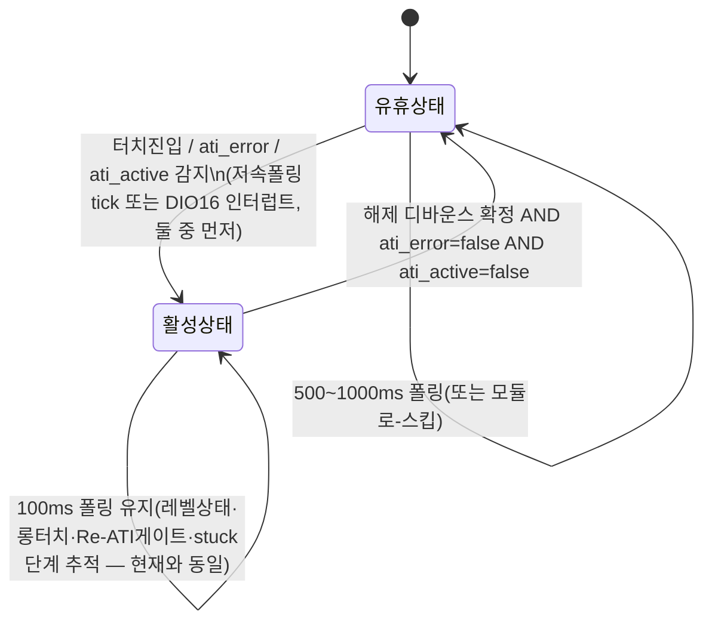

# 후보_7 · 유휴 폴링주기 연장 — 후보_6(완전정지 하이브리드)과의 비교

**TL;DR**: 후보_7(유휴 시 폴링주기만 연장, 100ms→500~1000ms, 이벤트 발생 시 인터럽트로 즉시 100ms 복귀)을 설계하고 후보_6(완전정지)과 3축 비교했다. 문자 그대로의 사양(인터럽트+저속유휴, 이하 "본안")은 후보_6과 동일한 DIO16 인터럽트 인프라를 그대로 상속해 구현복잡도가 후보_6보다 낮지 않으나, "정지 후 재개 실패"라는 후보_6 고유의 단일장애점이 없어 회귀위험은 명확히 더 낮다. 트래픽 절감은 duty 가정에 따라 후보_6 대비 1.1~20.8배 더 남아 격차가 duty에 크게 좌우됨을 확인했다(저duty=실사용 근접일수록 격차 급증). 인터럽트를 아예 뺀 변형(변형_1)은 Events 전환조차 불요해 가장 단순하면서도 절감효과는 본안과 대등한 수준임을 발견했다.

---

## 0. 전제·선행 의존성 고지

- 필독 지시에 따라 `15_보충입력_결합시나리오.md`(공통 배경·질문 4개·역할분담표)를 1차 소스로, `02_G2_강제개방프로토콜분석.md`(트래픽 모델)·`07_C4_프로토콜재설계.md`(인터럽트 인프라 실현가능성)·`10_V2_자기애그레서트레이드오프반증.md`(EXTI 0건·보정 트래픽 모델)를 참고로 직접 통독했다.
- **후보_6(`19_C6_하이브리드이벤트인터럽트.md`)은 본 문서 작성 시점에 병렬 작성 중이라 존재하지 않는다.** 이하 후보_6에 대한 서술은 15번 문서의 역할분담표(§역할 분담: "유휴(무이벤트) 시 폴링 완전정지+인터럽트 대기, 터치진입/ATI에러 이벤트 수신 시 활성폴링(100ms) 재개해 레벨 상태·롱터치·해제 추적, 해제/정상복귀 시 유휴 복귀")와, 07_C4·10_V2가 이미 코드로 확립한 인터럽트 인프라 사실에 근거한 **유추**다. 후보_6 확정본과 세부가 다를 수 있으며, 검증_7(21번 문서)이 최종 정합성을 재확인해야 한다.
- 코드는 `tdc_touch_time.h`(전체)·`tdc_touch.c`(전체)·`tdc_touch_logic.c/h`(전체)·`tdc_touch_iqs323.c/h`(전체)·`main.c`(437~460, 690~740, 805~955, 1030~1255)·`ci_dio.c`(전체)·`driver_i2c.h`(발췌)·`tdc_touch_config.h`(발췌)를 본 노드가 직접 Read했다. 데이터시트는 `docs/참고/touch/iqs323_datasheet.pdf`를 본 노드가 별도로 `pdftotext -layout` 재추출(`/tmp/iqs323_c7.txt`, 3999행)해 §8.11.2·§8.12·Table 8.1·§9 메모리맵(0xC1~0xC4)·§8.13 twait를 직접 그렙 재대조했다(G2·V2가 이미 확인한 것을 재신뢰하지 않고 독립 재확인).
- **선행 문서 정정 1건 발견** — §5에서 상세 서술.

---

## 1. 배경 요약

1차 딥다이브(99_종합) 결론: 이벤트 모드 단독·인터럽트 전환 단독은 각각 "지금과 별 차이 없음". 이번 라운드(15번 문서)는 "이벤트모드로 RDY 침묵 + 인터럽트로 유휴 시 폴링 자체를 끊는" 결합 시나리오를 정량화하는 것이 목적이며, 후보_6이 그 "완전 정지"형이다. 본 문서(후보_7)는 그 비교 대안 — **폴링을 끊는 대신 늦추기만 하는** 설계다.

현재 코드 상태(본 노드 직접 재확인):
- `TDC_TOUCH_POLL_INTERVAL_MS=100`(`tdc_touch_time.h:18`), 노말모드 게이트는 `tdc_touch.c:296` `if (TDC_TOUCH_POLL_INTERVAL_MS > (now - s_poll_tick_old)) return false;` — **순수 SW ms차분 비교**(HW 타이머 재설정 아님).
- `TDC_TOUCH_ULP_WAKE_MS=100`(`tdc_touch_time.h:37`), ULP모드(`func_sleep()`, `main.c:1164~1252`)는 `ci_timer_init_prescaled(TDC_TOUCH_ULP_TIMER_PRESCALE=TIMER_PRESCALE_1, TDC_TOUCH_ULP_TIMER_TIMEOUT_VALUE=3999)`로 **HW 타이머를 100.0ms 정확히 재현하도록 사전 설정한 뒤 `SYS_WAIT_FOR_INTERRUPT`로 매 tick 깨어난다**(`main.c:1224,1230`) — 노말모드와 근본적으로 다른 메커니즘.
- `events_enable()`(`tdc_touch_iqs323.c:300~304`): `0xD3=0x52`(bit6 ati_error·bit4 ati_event·bit1 touch_event) 기록 완료. 그러나 `0xC0`(System Control) write 6곳(237·318·447·453·465·471, 본 노드 직접 재확인) **전부 bit7=0(Streaming) 유지 중** — Events 모드로의 전환(bit7=1)은 아직 코드에 반영되지 않았다.

---

## 2. 후보_7 설계 — 본안(과제 문언 그대로: 인터럽트+저속유휴)

### 2.1 핵심 아이디어

유휴(터치없음·ATI정상)일 때 폴링을 **끊지 않고 늦춘다**(100ms→500~1000ms). 터치진입·ati_error 발생을 DIO16 인터럽트로 즉시 감지해 활성폴링(100ms)으로 전환, 해제+정상복귀 확정 시 유휴로 복귀한다. 후보_6과의 유일한 구조적 차이는 **"유휴상태의 정의"** — 후보_6은 유휴=폴링 0, 후보_7은 유휴=폴링 저속. 활성상태 동작(레벨상태·롱터치·Re-ATI게이트 추적)은 두 후보 모두 현재 100ms 폴링과 동일해야 하므로 본 절 이후 설계는 후보_6과 상당 부분 공유된다.



### 2.2 왜 인터럽트에도 Events 모드가 필요한가

Streaming 상태에서 RDY는 IC 자체 주기(T_주기, [미확인] 0.4~50ms 범위, G2 §2.3~2.4)로 계속 자가토글한다(§8.11.1). 이 상태에서 DIO16 하강엣지 인터럽트를 걸면 **실제 터치와 무관하게 T_주기마다 인터럽트가 발생**해 "인터럽트 폭주"가 된다 — "유휴 시 저빈도로 유지"라는 목적 자체가 무의미해진다. §8.11.2 원문(본 노드 재확인, `/tmp/iqs323_c7.txt:1852`): "In event mode the RDY line will only go low when one or more of the enabled events are triggered or if the device resets." — **Events 모드(0xC0 bit7=1)로 전환해야 RDY가 실이벤트에만 반응**해 인터럽트가 의미를 가진다. 따라서 후보_7 본안도 후보_6과 마찬가지로 **0xC0 bit7=1 전환(5개 write 지점, C1과 동일 스펙)이 선행조건**이다 — "더 단순한 대안"이라는 이름과 달리 이 전제 자체는 후보_6과 다르지 않다.

### 2.3 활성 진입 트리거·유휴 복귀 조건

| 구분 | 조건 |
|---|---|
| 활성 진입(즉시) | `pressed==true` **또는** (`ati_error==true && ati_active==false`) **또는** `ati_active==true`(방어적 포함 — 위 조건의 직접 결과라 사실상 중복이나 명시) |
| 유휴 복귀 | `pressed==false`가 디바운스 확정(기존 `TDC_TOUCH_BOOT_RELEASE_DEBOUNCE_MS`/`TDC_TOUCH_ULP_NOTOUCH_DEBOUNCE_MS`=300ms 관행 재사용) **AND** `ati_error==false` **AND** `ati_active==false` |

> [!NOTE]
> 이 규칙은 15번 문서가 서술한 후보_6의 "해제/정상복귀 시 유휴 복귀"와 동일한 조건이다. 차이는 오직 유휴상태 자체의 정의에 있다 — 공정한 비교를 위해 본 절을 두 후보의 공유 전제로 명시해 둔다.

### 2.4 노말모드 구현 지점 — `tdc_touch.c:296`

현재 게이트:
```c
int now = ci_timer_get_tick();
if (TDC_TOUCH_POLL_INTERVAL_MS > (now - s_poll_tick_old))
{
    return false;
}
```
`TDC_TOUCH_POLL_INTERVAL_MS`(컴파일타임 매크로)를 런타임 변수(`s_poll_interval_ms`, 유휴 시 500~1000·활성 시 100)로 교체하면 끝나는 **순수 비교식 치환**이다. 이 게이트는 이미 "ms 차분" 방식이라(HW 타이머 재설정이 아님) 가변화에 구조적 장벽이 없다.

### 2.5 ULP모드 구현 지점 — `func_sleep()` 및 4개 카운터의 시간기반성 재확인

ULP모드는 HW 타이머(`ci_timer_init_prescaled`)로 100ms tick을 만들고 `SYS_WAIT_FOR_INTERRUPT`로 깨어나는 구조라(`main.c:1224,1230`), 유휴 시 이 HW 타이머 자체를 재설정하는 것은 위험도가 높다(주석 `tdc_touch_time.h:53`: "PRESCALE_128 격자는 100ms 불가(최근접 99.2)" — prescale/timeout 조합이 임의 ms값에 정확히 맞지 않을 수 있음을 코드 스스로 경고). **본 노드는 HW 타이머는 100ms로 고정하고, 유휴 시 실제 I2C 작업(`read_status`+`read_debug`)만 모듈로 카운터로 스킵(N틱 중 1회만 수행)하는 방식을 권고한다** — CPU는 여전히 100ms마다 깨지만(워치독 리프레시 등 기존 이유 그대로), I2C 폴링 자체는 N배 늦춘다.

이 방식을 안전하게 하려면 `func_sleep()`이 소유한 **4개 카운터의 시간기반 여부**를 정확히 알아야 한다(본 노드가 코드를 직접 재확인 — 15번 문서가 그라운드_7에 위임한 것과 같은 질문이나, 본 설계의 정합성에 직결되므로 독립 확인했다):

| 카운터 | 코드 위치 | 실제 방식 | 현재 매크로 재계산(100ms 기준) |
|---|---|---|---|
| `notouch_cnt`(첫 노터치 확정) | `tdc_touch_sleep_handle_notouch_gate()`, `main.c:1101` | **폴링횟수 카운트** | `TDC_TOUCH_ULP_NOTOUCH_DEBOUNCE_CNT`=CNT(300,100)=**3**(헤더 주석 "@200=2"는 200ms 시대 잔재, 현재 매크로로 재계산 시 3 — 주석 자체가 신뢰 불가함을 확인) |
| `ignore_elapsed`(강제 RESEED 탈출) | 동 함수, `main.c:1097` | **폴링횟수 카운트** | `TDC_TOUCH_ULP_FORCE_RESEED_CNT`=CNT(10000,100)=**100** |
| `touch_cnt`(웨이크 제스처 확정) | `tdc_touch_sleep_handle_touch_reboot()`, `main.c:1129` | **폴링횟수 카운트** | `TDC_TOUCH_ULP_REBOOT_TOUCH_CNT`=CNT(2400,100)=**24** |
| `ati_error_reboot_cnt`(에러 지속 시 재부팅 에스컬레이션) | `tdc_touch_sleep_handle_ati_error()`, `main.c:1066` | **폴링횟수 카운트**(리터럴 `5`, 매크로조차 아님) | 5회 연속(≈500~600ms@100ms) |

**네 개 전부 "ms 경과"가 아니라 "폴링 횟수"를 센다.** 노말모드 FSM(`tdc_touch_logic.c`)의 롱터치·Re-ATI쿨다운·stuck단계가 전부 `now_ms` 타임스탬프 차분(가변주기에 자동 안전)인 것과 **정반대**다. 만약 이 카운터들이 유휴 저속폴링 구간에서도 그대로 누적된다면, 폴링주기를 5~10배 늦출 때 이 안전판들의 실제 발동 시각도 5~10배 늦춰진다 — 특히 `touch_cnt`(웨이크 제스처, 원래 2.4초)가 유휴 저속상태에서 그대로 누적되면 웨이크 제스처가 최대 24초까지 굼떠지는 심각한 사용자 체감 회귀가 된다.

**그러나** §2.3의 활성 진입 규칙이 정확히 이 위험을 차단한다 — `notouch_cnt`/`touch_cnt`/`ignore_elapsed`는 전부 "release 진행 중" 또는 "wake 제스처 진행 중"이라는, 정의상 이미 **활성상태**(100ms 고정)에 속하는 구간에서만 누적되므로, 유휴 저속폴링과 물리적으로 겹치지 않는다. `ati_error_reboot_cnt`만 이 규칙 밖에서 매 tick 무조건 체크되는데, ati_error 최초 감지 자체가 활성 진입 트리거이므로 **첫 감지 이후의 재확인은 자동으로 100ms 주기로 복귀**해 5회 카운트도 원래와 같은 ≈500~600ms 안에 완결된다. 즉 **네 카운터의 코드는 한 글자도 안 바꿔도 되고, 바뀌는 것은 오직 바깥의 "언제 I2C 작업을 실행하는가" 스킵 로직뿐이다.**

> [!IMPORTANT]
> 이는 본 노드의 독립 발견이다 — 15번 문서가 그라운드_7에 위임한 "폴링 횟수 기반 vs 경과시간 기반" 질문에 대해, 최소한 본 설계(후보_7)의 정합성 판정에 필요한 만큼은 스스로 답을 냈다. 그라운드_7의 전수조사가 완료되면 교차검증 대상이다.

### 2.6 이벤트를 "놓치지" 않는 근거 — §8.12 래치, 정확성과 지연시간의 분리

§8.12 원문(본 노드 재확인, `/tmp/iqs323_c7.txt:1863~1864`): "The global event flags are cleared when the master reads them via I2C. When they are set, **the IQS323 will continuously provide ready windows**." 즉 이벤트 플래그는 **마스터가 읽어 clear하기 전까지 유지되며, 그동안 ready window가 계속 제공**된다. 이는 유휴 폴링주기가 아무리 길어도(변형_1처럼 인터럽트가 아예 없어도) **다음 폴링에서 반드시 발견된다** — 원리적으로 이벤트를 "영영 놓치는" 경로는 없다. 인터럽트의 유일한 가치는 **"몇백 ms~1초 더 일찍 알아채는" 지연시간 단축**이지, "놓치지 않음"이라는 정확성 보장이 아니다(정확성은 인터럽트 유무와 무관하게 §8.12 래치 메커니즘으로 이미 확보돼 있다). 이 구분이 §3(변형_1)의 안전성 논거와 §6.2(회귀위험)의 핵심 축이다.

### 2.7 `fake_func_sleep()` 처리

`main.c:810~1031`은 `tdc_get_fake_op_mode()`로 진입 여부가 갈리는 개발/테스트 경로이며, G2가 이미 "실질 비활성 경로"로 판정했다(본 노드가 `tdc_get_fake_op_mode` 호출부를 재확인한 결과 `main.c` 밖 참조 0건 — 다른 노드에서도 이 변수를 세팅하는 곳을 찾지 못했다. 정확한 활성화 트리거는 [미확인]). `func_sleep()`과 동일한 4-카운터 패턴(`main.c:882~885`, 독립 인라인 구현)을 갖고 있어 §2.5의 논리가 그대로 적용되지만, 요구사항.md가 INV-CTRL-2를 "노말/절전/fake 3사이트" 전부로 정의하므로 **본 설계를 적용하려면 fake 경로도 동일한 스킵 로직을 미러링해야 한다** — 실사용 경로가 아니라는 이유로 방치하면 두 경로가 다시 벌어져(§06_C3가 이미 경고한 유형의 문제) 향후 유지보수 부담이 된다는 점만 기록하고, 본 노드는 이를 §9 리스크 목록으로 넘긴다.

---

## 3. 변형_1 — 완전 무인터럽트형 (과제 범위 확장, 명시적 라벨링)

과제 문언은 "이벤트 발생 시 인터럽트로 즉시 전환"을 명시하므로 §2가 본안이다. 그러나 §2.6의 발견(이벤트 래치가 정확성을 이미 보장) 때문에, **인터럽트를 아예 빼고 유휴 폴링주기 자체가 지연시간 상한이 되는** 한 단계 더 단순한 변형이 자연스럽게 도출된다. 이는 과제의 "훨씬 단순한 대안" 정신을 극한까지 밀어붙인 것이라 판단해 별도 절로 명시한다.

**변형_1의 차이점**:
- Events 모드 전환(0xC0 bit7=1) **불필요** — Streaming 그대로 유지 가능. §2.2의 "인터럽트 폭주" 우려 자체가 없다(인터럽트를 안 쓰므로).
- DIO16 인터럽트 재배선(`ci_dio.c` 재작성·ISR·2슬롯 제약·MCLR 시퀀싱) **전부 불필요**.
- 유휴 감지는 오직 저속폴링 tick 자체가 담당 — 지연시간 상한이 인터럽트 없이 그대로 유휴주기(500~1000ms)가 된다.
- §2.3~2.5의 상태전이 규칙·카운터 시간기반성 분석은 **동일하게 적용**(인터럽트 유무와 무관한 부분이었음).

**트레이드오프**: ATI 에러 감지가 최악의 경우 현재(≤100ms)보다 최대 900ms 늦어질 수 있다(§7에서 정량화). 그러나 §2.6에 의해 "놓치는" 일은 없고 "늦게 잡는" 것뿐이며, 그 지연 자체도 `tdc_touch_iqs323_re_ati()` 호출(INV-CTRL-2의 핵심 요구)이 유휴폴링 tick에서 정상적으로 트리거되는 것을 막지 않는다 — 최초 감지 시점 자체가 늦춰질 뿐, "감지했는데 Re-ATI를 안 한다"는 위반은 어느 경우에도 발생하지 않는다.

---

## 4. INV-CTRL-1~3 자체평가

요구사항.md의 정의(직접 재확인, `요구사항.md:34~36`)를 기준으로 본안·변형_1을 함께 평가한다.

| 불변식 | 정의 | 본안 영향 | 변형_1 영향 |
|---|---|---|---|
| INV-CTRL-1(Full ATI) | 0x36 ATI Mode 설정·부팅 Full ATI 경로 불변 | 무손상 — 본 설계는 `write_register(REG_SENSOR0_ATI_SETUP, ...)`(`tdc_touch_iqs323.c:437`)를 포함한 어떤 ATI 레지스터도 건드리지 않는다. Events 전환(bit7)이 ATI 내부 타이밍에 영향을 준다는 근거는 없다(G2 §5: Interface Selection이 charge-transfer 활동 자체를 제어한다는 근거 없음) | 무손상 — Events 전환 자체가 없어 이 논점 자체가 성립하지 않음(더 안전) |
| INV-CTRL-2(ATI에러→Re-ATI, 3사이트) | `ati_error`→`tdc_touch_iqs323_re_ati()` 불변 | 무손상 — §2.5에서 논증한 대로 최초 감지는 100ms(유휴폴링 tick 또는 인터럽트) 이내, 이후 재확인도 활성전환으로 원래 주기 유지. 다만 fake 사이트(§2.7) 동기화는 별도 구현 필요 | 무손상이나 **최초 감지 지연**(최대 유휴주기, §7에서 정량화) — Re-ATI 호출 자체는 여전히 보장됨 |
| INV-CTRL-3(첫 터치해제 감지, `boot_ignore`/`sleep_ignore`) | 게이트 로직 불변 | 무손상 — §2.5에서 확인한 대로 `notouch_cnt`/`boot_release_cnt` 등은 전부 활성구간(디바운스 진행 중)에서만 누적되어 유휴 저속폴링과 겹치지 않음 | 무손상(동일 근거) |

**공통 결론**: 두 변형 모두 3대 불변식을 코드 레벨에서 위반하지 않는다고 판단한다. INV-CTRL-2에서 변형_1이 갖는 "최초 감지 지연"은 불변식 **위반이 아니라 반응속도 저하**이며, 이는 §6.2·§7에서 후보_6 대비 정량 비교한다. 검증_7(21번 문서)의 재확인을 전제로 한다.

---

## 5. 선행 문서 정정 — "노말모드 WFI 부재" 주장 재확인

07_C4 §1.4는 "노말 모드(`tdc_touch_process`, `main.c:452`)가 속한 메인 루프는 WFI 호출이 전혀 없다(그 루프 부근 738·801·891·1230행 WFI는 전부 다른 루프 소속임을 grep으로 확인)"고 서술했다. 본 노드가 `main.c`를 직접 Read하고 중괄호 매칭을 프로그램으로 재현한 결과(재현 가능한 방법: 437행 `while (1)`부터 중괄호 깊이를 추적), **이 주장은 현재 코드와 불일치한다.**

- `main.c:452`(`tdc_touch_process()` 호출)와 `main.c:738`(`SYS_WAIT_FOR_INTERRUPT`)은 **동일한 `while(1)` 루프 본문**(437~739행, 닫는 중괄호 739행 `}  // 끝, while`) 안에 있다 — 중괄호 깊이 추적으로 재확인 완료.
- 즉 노말모드 메인루프는 **매 iteration 끝에 이미 WFI를 호출한다.** 07_C4가 우려한 "노말 경로에 WFI를 신규 도입"이라는 리스크는 **성립하지 않는다** — 이미 존재하는 관행이다.
- [미확인]: 이 WFI가 실제로 몇 ms 단위로 깨어나는지(무엇이 이 루프를 주기적으로 깨우는지, 오디오/DSP 관련 인터럽트로 추정되나 본 노드는 추적하지 않았다)는 별도 확인이 필요하다. 구조적 사실(WFI가 이미 이 루프의 정상 동작 일부)만 확정한다.

> [!IMPORTANT]
> 이 정정은 후보_6·후보_7 본안 모두에게 **유리한 방향**이다 — DIO16을 이 WFI의 추가 웨이크소스로 등록하는 것은 "이 루프에 WFI를 처음 들여오는" 구조 변경이 아니라 "이미 있는 웨이크소스 목록에 하나를 더 추가하는" 국소 변경이 된다. 검증_10(24번 문서, 할루시네이션 감사)이 이 정정 자체를 재검증해야 한다 — 본 노드의 브레이스 매칭 방법론에 오류가 없는지 교차확인 권고.

---

## 6. 후보_6 대비 3축 비교

### 6.1 구현 복잡도

| 구성요소 | 후보_6(완전정지) | 후보_7 본안(인터럽트+저속유휴) | 후보_7 변형_1(무인터럽트) |
|---|---|---|---|
| Events 모드 전환(0xC0 bit7, 5곳) | 필요 | 필요(동일) | **불필요** |
| DIO16 인터럽트 재배선(`ci_dio.c` 재작성·ISR·arm/disarm) | 필요 | **필요(동일)** — §2.2 근거로 본안도 인터럽트가 의미 있으려면 Events 필수 | **불필요** |
| 2슬롯 NVIC 제약·MCLR 핀공유 시퀀싱(07_C4 §1.3) | 리스크 있음 | **리스크 있음(동일)** | 리스크 없음 |
| 노말모드 WFI 신규 도입 리스크 | (§5 정정으로) **낮음 — 이미 존재하는 관행 확장** | 동일(§5 정정 적용) | 해당 없음(인터럽트 자체 불요) |
| SW 폴링 게이트 가변화(`tdc_touch.c:296`) | 불필요(폴링 자체를 끄는 다른 종류의 분기 필요) | 필요(임계값 변수화, §2.4 — 수 줄) | 필요(동일, 수 줄) |
| ULP 모듈로-스킵/재개 로직(`func_sleep`) | 필요(정지→재개 상태머신 **신규 설계**) | 필요(모듈로 카운터, §2.5 — 소규모) | 필요(동일, 소규모) |
| "정지 후 확실히 재개됨" 정합성 보증 | **필요** — 새 리스크 범주(§6.2) | **불필요** — 폴링이 멈춘 적이 없음 | **불필요**(동일) |
| fake 경로(§2.7) 동기화 | 필요 | 필요(동일) | 필요(동일) |

**판정**: 후보_7 본안은 후보_6이 필요로 하는 모든 것(Events 전환·DIO16 인터럽트·2슬롯 제약·핀공유 시퀀싱)을 **그대로 상속**하면서, 이중속도 상태로직을 추가로 얹는 상위집합에 가깝다 — **"본안"만 놓고 보면 후보_6보다 구현 복잡도가 낮다고 말하기 어렵다.** 복잡도를 극적으로 낮추고 싶다면 변형_1을 채택해야 하며, 이 경우 Events 전환·인터럽트 인프라·2슬롯 제약·MCLR 시퀀싱 리스크를 **전부 원천 회피**한다. 이는 과제가 던진 "훨씬 단순한 대안"이라는 목표에 문자 그대로 부합하는 것은 본안이 아니라 변형_1임을 의미한다.

### 6.2 회귀위험

핵심 비대칭은 **"정지→재개 정합성"이라는 리스크 범주의 유무**다.

- 후보_6은 유휴 시 폴링을 완전히 끊고 DIO16 인터럽트에만 의존한다. 만약 인터럽트 경로에 결함(엣지 미스, arm/disarm 레이스, 2슬롯 경합, mclr() 시퀀싱 오류)이 있으면 — **재개를 보장하는 대안 경로가 전혀 없다.** 이는 §2.5에서 확인한 4개 ULP 카운터·Re-ATI 게이트·boot/sleep_ignore 게이트가 **전부 다시는 평가되지 않는** 무한 정지로 이어질 수 있다. 이는 INV-CTRL-2·INV-CTRL-3 모두에 대한 **단일장애점(single point of failure)** 이다.
- 후보_7(본안·변형_1 공통)은 유휴에도 폴링이 계속되므로, 인터럽트가 있든 없든(§2.6의 §8.12 래치 근거로) **최악의 경우에도 다음 유휴폴링 tick(≤500~1000ms)에서 반드시 재확인된다.** 이는 구조적으로 유계(bounded)된 열화이지, 무계(unbounded) 장애가 아니다.

| 항목 | 후보_6 | 후보_7(본안·변형_1 공통) |
|---|---|---|
| 인터럽트 결함 시 최악 결과 | 무한 정지(재개 경로 없음) | 다음 유휴 tick(≤500~1000ms)에서 회복 |
| 새로 필요한 검증 범주 | "정지→재개 100% 보장" — 신규 | 없음(기존 폴링 구조의 파라미터 변경) |
| ULP 4개 카운터에 대한 근본 전제 | 유휴 중 아예 실행되지 않음(§2.5 규칙과 다른 방식으로 정지) | §2.5 규칙 그대로 적용, 코드 불변 |

**판정**: 회귀위험 축에서는 **후보_7이 후보_6보다 명확히 낮다** — 과제가 던진 질문("이 대안이 후보_6보다 안전한지")에 대한 답은 **그렇다**이며, 이는 duty 가정에 의존하지 않는 구조적 결론이다(§6.3의 트래픽 비교와 달리 회귀위험 비교는 "폴링이 물리적으로 멈추는가"라는 이분법적 사실에 근거하므로 가정 민감도가 낮다).

### 6.3 트래픽 절감효과 (정량)

기준 모델은 V2(10번 문서) 보정모델(사이클당 4회 `force_window_open()` 호출의 비균질성 반영, 128kHz I2C 클럭 기반 — 본 노드가 `driver_i2c.h:17`의 `I2C_MASTER_PRESCALE_240`=128kHz를 직접 재확인)을 그대로 사용한다. Events 유휴(또는 §8.12에 의해 신선 이벤트가 없는 모든 구간 — "활성"이라도 재전이 없는 정상상태 포함, §6.3 하단 근거)는 T_주기 가정과 무관하게 사이클당 8회(4실통신+4강제개방)로 **고정**이다(G2 §4.2·V2 §1.3 공통).

**표 1 — 유휴구간 단독(초당 트랜잭션, 활성구간 기여 제외)**

| 설계 | 유휴 폴링 | 초당 트랜잭션 |
|---|---|---|
| 현재(Streaming, 상시 100ms, 미변경) | 100ms | 58~75(중심 ≈65, V2 §1.3 표) |
| Events 단독 도입(하이브리드 없음, 상시 100ms) | 100ms | 80(고정) |
| **후보_6**(Events+완전정지) | 폴링 0 | **0** |
| **후보_7 본안**(Events+인터럽트, 유휴 500ms) | 500ms | **16** |
| **후보_7 본안**(Events+인터럽트, 유휴 1000ms) | 1000ms | **8** |
| **후보_7 변형_1**(Streaming 유지, 무인터럽트, 유휴 500ms) | 500ms | 11.6~15(중심≈13) |
| **후보_7 변형_1**(Streaming 유지, 무인터럽트, 유휴 1000ms) | 1000ms | 5.8~7.5(중심≈6.5) |

> [!NOTE]
> §8.12("신선 이벤트 없으면 ready window 제공 안 함")는 최초 진입엣지 이후 정지된 채 유지되는 터치(재전이 없는 안정 구간)에도 그대로 적용된다 — 즉 "활성" 구간이라도 재전이가 없으면 Events 강제개방율은 유휴와 동일하게 8/cycle이다. 본 표의 8이라는 값은 유휴·활성 어느 쪽에도 자연스럽게 적용되는 값이라 보수적 가정이 아니라 §8.12 자체의 귀결이다.

**표 2 — 듀티가중 총합(초당 트랜잭션, Events 채택 전제 = 본안 대상, 활성=80/sec 고정)**

| 듀티_활성 | Events단독(하이브리드없음) | 후보_6 | 후보_7 본안(500ms) | 후보_7 본안(1000ms) |
|---|---|---|---|---|
| 1% | 80 | 0.8 | 16.64 | 8.72 |
| 10% | 80 | 8.0 | 22.4 | 15.2 |
| 50% | 80 | 40.0 | 48.0 | 44.0 |

**표 3 — 후보_7/후보_6 잔존 트래픽 배율**

| 듀티_활성 | 본안(500ms) 배율 | 본안(1000ms) 배율 |
|---|---|---|
| 1% | **≈20.8배** | **≈10.9배** |
| 10% | ≈2.8배 | ≈1.9배 |
| 50% | ≈1.2배 | ≈1.1배 |

**변형_1과의 비교(참고, Streaming 유지·활성=65/sec 기준)**: 듀티 1%에서 변형_1의 초당 트랜잭션은 1000ms 유휴 시 ≈7.1, 500ms 유휴 시 ≈13.5 — **본안(8.72/16.64)과 거의 같은 자릿수**이면서 §6.1이 확인한 대로 Events·인터럽트 인프라가 전혀 필요 없다. 즉 **절감효과 관점에서 본안이 변형_1보다 우위인 부분은 미미하고, 복잡도·리스크는 변형_1이 압도적으로 낮다.**

**과제의 핵심 질문에 대한 정량 답**: "유휴 시에도 저빈도로 계속 폴링하는 이 대안이 후보_6보다 안전하지만 절감효과가 작은지, 아니면 큰 차이가 없는지"

**답: duty에 강하게 의존하며, 실사용에 가까운 낮은 duty(1% 부근)일수록 격차가 크다(10.9~20.8배).** duty가 높아질수록(활성 비율이 높은 헤비유즈) 격차는 급격히 좁혀져 duty 50%에서는 1.1~1.2배로 사실상 무시할 수준이 된다. **"거의 차이 없음"이라는 결론은 duty가 높을 때만 성립하고, 실제 터치버튼처럼 대부분의 시간 유휴 상태일 것으로 예상되는 실사용 환경([미확인] — 실측 duty 데이터 없음, 은수님만 아실 수 있는 부분)에서는 배율 격차가 상당하다.** 다만 절대치로 보면 두 설계 모두 "Events 단독 도입"(80/sec 고정) 대비 대부분의 트래픽을 제거한다는 공통점은 유지된다(듀티 1%에서 후보_6은 99%, 후보_7 본안(1000ms)은 89% 감소).

---

## 7. 질문_4 답변 — ATI 에러 감지 속도

15번 문서의 질문_4: "ATI 에러 감지가 인터럽트 기반으로 더 빨라지는지(현재는 최대 100ms 지연 후 감지, 이벤트 기반이면 즉시) — 이게 오히려 개선점인지."

| 설계 | ATI 에러 최초 감지 지연(최악) | 현재(≤100ms) 대비 |
|---|---|---|
| 현재(Streaming, 상시 100ms) | ≤100ms | 기준 |
| 후보_6 | §8.11.2/§8.12에 의해 사실상 즉시(RDY가 이벤트 즉시 어서션, 인터럽트로 바로 인지) | **개선** |
| 후보_7 본안(인터럽트 포함) | 후보_6과 동일 — 즉시 | **개선(동일)** |
| 후보_7 변형_1(인터럽트 없음, 500ms) | ≤500ms | 최대 400ms **악화** |
| 후보_7 변형_1(인터럽트 없음, 1000ms) | ≤900ms | 최대 800ms **악화** |

**본안은 질문_4가 시사하는 "개선"을 후보_6과 동등하게 달성한다.** 변형_1은 이 개선을 포기하는 대신(§6.1의 복잡도 이득과 교환) 최초 감지가 유휴주기만큼 늦어질 수 있다 — 다만 §4에서 확인했듯 이는 INV-CTRL-2 **위반이 아니라 반응속도 저하**이며, `ati_error_reboot_cnt`의 "5회 연속 시 재부팅" 안전판(§2.5)은 첫 감지 이후 활성전환으로 정상 100ms 페이스를 회복하므로 에스컬레이션 자체의 신뢰성은 그대로 유지된다.

---

## 8. 종합 판정

| 축 | 후보_6 | 후보_7 본안 | 후보_7 변형_1 |
|---|---|---|---|
| 구현 복잡도 | 기준 | **후보_6과 같거나 근소하게 큼**(상위집합) | **압도적으로 낮음**(Events·인터럽트 인프라 전체 불요) |
| 회귀위험 | 단일장애점 있음(정지→재개 미보장 시 무한 정지) | **후보_6보다 낮음**(유계 열화로 자연 회복) | **후보_6보다 낮음**(동일 근거, 인터럽트 결함 리스크마저 없음) |
| 트래픽 절감 | 최대(이론상 유휴 100% 제거) | duty 1%에서 후보_6 대비 10.9~20.8배 잔존, duty 50%에서 1.1~1.2배 잔존 | 본안과 거의 대등(참고 계산 §6.3) |
| ATI에러 감지속도 | 즉시(개선) | 즉시(개선, 동일) | 최대 500~900ms 지연(악화, 단 INV-CTRL-2 위반 아님) |

**직접 답변**: 과제가 제시한 두 가설("안전하지만 절감효과가 작다" vs "큰 차이 없다") 중 어느 하나로 단순 귀결되지 않는다. **회귀위험 축에서는 후보_7이 duty와 무관하게 항상 더 안전하다**(구조적 사실). **트래픽 절감 축에서는 격차가 duty에 강하게 의존한다** — 저duty(실사용 근접 추정)에서는 배율 격차가 10~20배로 작지 않고, 고duty에서는 1.1~1.2배로 사실상 없다. 실제 절감 "효과가 작은지 큰지"는 **duty 실측치([미확인]) 없이는 확정할 수 없다**는 것이 가장 정직한 결론이다.

**부가 판정**: 과제가 "훨씬 단순한 대안"을 요구한 근본 취지에는 본안보다 **변형_1이 더 정확히 부합**한다 — 본안은 후보_6의 인터럽트 인프라·리스크를 그대로 상속해 "단순함"의 이득을 거의 취하지 못하는 반면, 변형_1은 Events 전환조차 생략해 복잡도·리스크를 모두 최소화하면서 트래픽 절감은 본안과 대등하다. 다만 ATI 에러 감지속도(질문_4)의 "개선" 효과는 변형_1에서 사라진다.

---

## 9. 리스크·미확인 목록

| 항목 | 상태 |
|---|---|
| 실사용 duty(터치 활성 비율) 실측치 | **[미확인]** — §6.3·§8의 배율 판정 전체가 이 값에 좌우됨. 은수님만 아실 수 있는 부분 |
| 노말모드 WFI(`main.c:738`)를 실제로 깨우는 인터럽트 소스·주기 | **[미확인]** — §5에서 구조적 사실(같은 루프)만 확정, 실측 주기는 미추적 |
| `fake_func_sleep()`의 실제 활성화 트리거(`tdc_get_fake_op_mode`) | **[미확인]** — 본 노드가 grep한 범위에서 세터 호출부를 찾지 못함 |
| Report Rate(0xC1)=0의 정확한 의미 | **[미확인]**(G2·V2와 동일 게이트, 본 설계는 0xC1을 건드리지 않으므로 직접 영향은 없음) |
| T_주기(IC 자가토글 주기) 절대값 | **[미확인]**(G2·V2 민감도 범위 0.4~50ms 그대로 승계, 표 1의 변형_1 범위에 반영됨) |
| §5 정정(브레이스 매칭 재확인)의 교차검증 | 검증_10(할루시네이션 감사) 대상으로 명시 위임 |
| ULP 모듈로-스킵 구현이 `ci_timer_init_prescaled`의 실제 하드웨어 동작과 충돌 없는지 | **[미확인, 실측 게이트]** — 논리적 설계는 §2.5에서 제시했으나 실기 검증 전까지 확정 아님 |
| DIO16 인터럽트 실배선 시 `DIO_INT_SRC_DIO_16` 상수 실존 여부 | **[미확인]**(07_C4가 이미 동일하게 남긴 게이트, 본안·후보_6 공통 전제) |

---

## 핵심 결론

1. 후보_7 "본안"(과제 문언 그대로: Events+인터럽트+저속유휴)은 후보_6과 **동일한 DIO16 인터럽트 인프라·Events 전환을 그대로 상속**하므로 구현 복잡도가 후보_6보다 낮다고 말하기 어렵다 — 상위집합에 가깝다.
2. 그러나 후보_7은 (본안·변형_1 공통으로) 유휴 중에도 폴링이 물리적으로 계속되므로 **"정지→재개 정합성"이라는 후보_6 고유의 단일장애점이 없다** — §8.12의 이벤트 래치 근거(마스터가 읽을 때까지 ready window 유지)로 인해 이벤트를 "놓치는" 일은 어느 설계에서도 없고, 차이는 오직 "얼마나 늦게 잡는가"뿐이다. 회귀위험 축에서는 후보_7이 duty와 무관하게 항상 더 안전하다.
3. 트래픽 절감 격차는 duty에 강하게 의존한다 — 저duty(1%)에서 후보_6 대비 10.9~20.8배 더 남고, 고duty(50%)에서는 1.1~1.2배로 사실상 무시할 수준이다. "차이가 크다/작다"는 질문에 대한 단일한 답은 없으며, 실사용 duty 실측치가 확정 게이트다.
4. 인터럽트를 아예 뺀 **변형_1**(Streaming 유지, 순수 폴링주기 연장)은 Events 전환·DIO16 인터럽트·2슬롯 NVIC 제약·MCLR 핀공유 리스크를 전부 회피하면서, 트래픽 절감은 본안과 거의 대등하다(§6.3) — 과제가 요구한 "훨씬 단순한 대안"의 취지에는 본안보다 변형_1이 더 부합하며, 대가는 ATI 에러 감지속도의 "즉시" 개선(질문_4)을 포기하는 것뿐이다(단, INV-CTRL-2 위반은 아님).
5. `main.c` 직접 재확인 결과 07_C4의 "노말모드 WFI 부재" 주장은 현재 코드와 불일치함을 발견했다(§5) — 검증_10의 교차확인을 명시적으로 요청한다.

---

**주요 근거 파일 경로**:
- `/mnt/e/Claude/projects/Sound1/src/2__cm3/Cortex-M3-src/systemControl/tdc_touch_time.h`(전체)
- `/mnt/e/Claude/projects/Sound1/src/2__cm3/Cortex-M3-src/systemControl/tdc_touch.c`(전체, 특히 :294~300)
- `/mnt/e/Claude/projects/Sound1/src/2__cm3/Cortex-M3-src/systemControl/tdc_touch_logic.c`, `tdc_touch_logic.h`(전체)
- `/mnt/e/Claude/projects/Sound1/src/2__cm3/Cortex-M3-src/systemControl/tdc_touch_iqs323.c`, `.h`(전체)
- `/mnt/e/Claude/projects/Sound1/src/2__cm3/Cortex-M3-src/main.c`(:437~460, :690~740, :805~955, :1030~1255)
- `/mnt/e/Claude/projects/Sound1/src/2__cm3/Gen1_5/common/ci_dio.c`(전체)
- `/mnt/e/Claude/projects/Sound1/src/2__cm3/Cortex-M3-src/systemControl/driver_i2c.h`(:17)
- `/mnt/e/Claude/projects/Sound1/src/2__cm3/Cortex-M3-src/systemControl/tdc_touch_config.h`(:21~22)
- `/mnt/e/Claude/projects/Sound1/docs/참고/touch/iqs323_datasheet.pdf`(본 노드가 `pdftotext -layout`으로 재추출·직접 대조: §8.11.2, §8.12, Table 8.1, §9 메모리맵 0xC1~0xC4, §8.13 twait)
- `docs/tasks/touch/20260705_touch-event-mode-adoption/에이전트-로그/15_보충입력_결합시나리오.md`, `00_오케스트레이터-입력.md`, `02_G2_강제개방프로토콜분석.md`, `07_C4_프로토콜재설계.md`, `10_V2_자기애그레서트레이드오프반증.md`
- `docs/tasks/touch/20260705_touch-event-mode-adoption/요구사항.md`(:34~36, INV-CTRL-1~3 정의)
