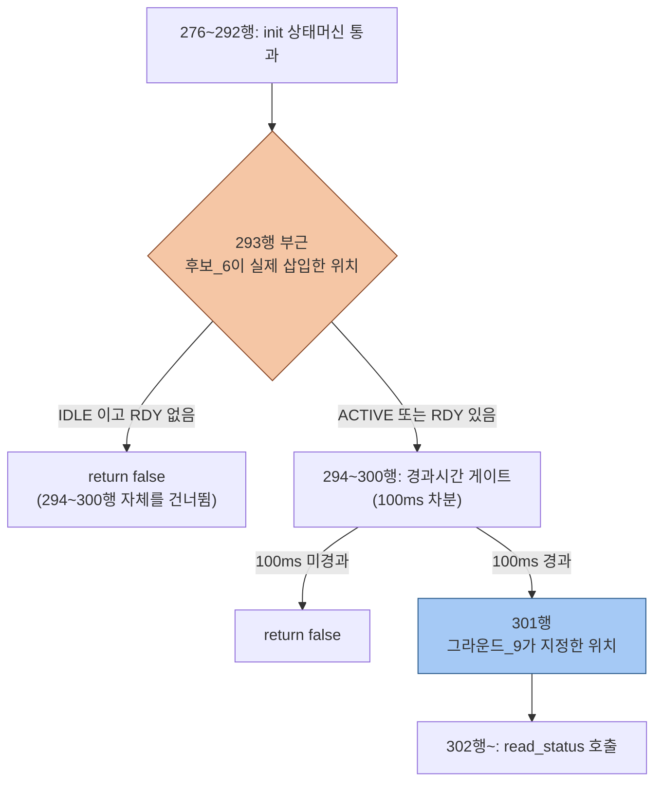

# 검증_7 · 불변식 회귀 재확인 + 그라운드 교차검증

**TL;DR**: 후보_6·7의 자체 그라운딩(병렬 실행으로 그라운드_7~9 부재 시 독자 도출)을 이제 실존하는 그라운드_7~9 문서와 실제 코드 직접 재확인으로 교차검증했다. (a) 그룹_1/그룹_2 분류는 다룬 범위 내에서 전부 일치하나 항목_6(read 연속실패 hold)을 후보_6·7 둘 다 누락했다 — 재검토 결과 실제 결함은 아니었다. (b) edge 전용 판단은 그라운드_8 최종 판정과 완전히 일치한다. (c) INV-CTRL-1~3은 코드 재확인으로 후보_6·본안·변형_1 전부 무손상을 확정했으나, 후보_7의 노말모드측 INV-CTRL-3 근거는 후보_6 대비 명시성이 떨어진다. (d) 가장 중요한 발견 — 후보_6의 tdc_touch.c 삽입 위치는 그라운드_9가 지정한 301행이 아니라 294행 이전이며, 이는 후보_6 자신의 "즉시 반응" 주장이 성립하기 위한 구조적 필요조건이자 그라운드_9 문서와의 실제 불일치다.

---

## 0. 조사 방법·범위

- 1차 소스 직접 `Read`: `15_보충입력_결합시나리오.md`(공통입력), `16_G7_폴링의존타이밍로직전수.md`, `17_G8_이벤트edge대레벨.md`, `18_G9_FSM폴링구조확인.md`, `19_C6_하이브리드이벤트인터럽트.md`, `20_C7_대안유휴폴링주기연장.md` 전문.
- `요구사항.md`(:30~38, INV-CTRL-1~3 정의)를 직접 재확인.
- 코드 직접 재확인(전부 본 노드가 `Read`, 선행 문서 인용을 신뢰하지 않고 재대조): `tdc_touch.c`(434행 전체), `tdc_touch_logic.c`(193행 전체), `tdc_touch_time.h`(전체), `main.c`(270~470행, 700~745행, 1055~1255행), `tdc_touch_iqs323.c`(280~410행).
- 데이터시트 원문 재확인: `docs/참고/touch/iqs323_datasheet.pdf`를 본 노드가 독립적으로 `pdftotext -layout` 재추출(`/tmp/iqs323_verify7.txt`)해 그라운드_8이 인용한 핵심 3문장(Table 8.1 Touch 트리거 조건, §8.12 "continuously provide ready windows", §5.7 "remain set until...")을 직접 grep 대조 — 전부 그라운드_8의 인용과 정확히 일치함을 확인했다(아래 §3).
- **스코프**: 과제 지정 4항목(a)~(d)에 집중한다. 그라운드_8의 데이터시트 해석 전반이나 그라운드_9의 `Sys_DIO_IntConfig` 비활성 확인 등은 이미 다수 선행 노드(C4·V2·G9)가 교차확인했으므로 본 노드는 재검증 범위에서 제외하고 §(a)(b)(c)(d)에 직결되는 부분만 코드/PDF 직접 대조로 재확인했다.

---

## 1. 결론 요약 (한눈에)

| 항목 | 판정 |
|---|---|
| (a) 그룹_1/그룹_2 분류 정합성 | **다룬 범위 내 전부 일치, 오분류 0건**. 다만 후보_6·7 둘 다 항목_6(read 연속실패 hold)을 전혀 다루지 않았다 — 재검토 결과 실질 결함은 아니나 명시적 검증 누락 |
| (b) edge 전용(진입/이탈에만 발생) 근거의 그라운드_8 정합성 | **완전 일치**. 그라운드_8 최종 판정(§5)이 원문·코드 이중 확인한 것과 후보_6·7의 전제가 축자 일치 |
| (c) INV-CTRL-1~3 코드 재확인 | **후보_6·본안·변형_1 전부 무손상 확정**(직접 코드 재확인). 단 후보_7의 INV-CTRL-3 노말모드측 논거는 후보_6 대비 명시적 pseudocode가 없어 상대적으로 불명확 |
| (d) I2C 게이팅 삽입 위치 정합성 | **부분 불일치 — 신규 발견**. `func_sleep()`(main.c:1232)은 정확히 일치. `tdc_touch_process()`는 **불일치** — 후보_6은 294행 이전에 삽입했으나 그라운드_9는 301행(294~300행 게이트 통과 후)을 지정 |

---

## 2. (a) 그룹_1/그룹_2 분류 전수 대조

### 2.1 그라운드_7 공식 11항목 vs 후보_6·7 자체 분류

그라운드_7의 판정표(16번 문서 §1)를 코드 직접 재확인(`tdc_touch_logic.c`·`tdc_touch.c`·`main.c`·`tdc_touch_time.h` 전체 재대조) 결과, **11항목 전부 그라운드_7의 파일:라인·판정이 실제 코드와 정확히 일치함**을 먼저 확인했다(예: 항목_8 "7연속" 트레이스를 직접 재구성한 결과 `5 < *ati_error_reboot_cnt`가 정확히 7번째 호출에서 참이 됨을 재확인, 항목_9의 `TDC_TIME_TO_CNT(2400,100)=24` 재계산 일치, `tdc_touch_logic.c:17~60`의 `stuck_eval()` 함수 경계·`:33`의 조건문 위치까지 1행 오차 없이 일치). 이를 기준선(ground truth)으로 삼아 후보_6·7의 자체 분류를 전수 대조한다.

| 항목(그라운드_7) | 그라운드_7 판정 | 후보_6 취급 | 후보_7 취급 | 대조 결과 |
|---|---|---|---|---|
| 항목_1 롱터치(깨어있음, `tdc_touch_logic.c:180~184`) | 그룹_1(타이머) | §3.1에서 `172~186행` 인용, 명시적 타이머/그룹_1 | §2.5에서 "롱터치...타임스탬프 차분"으로 집합 언급, 그룹_1 | **일치** |
| 항목_2 Re-ATI 쿨다운(`:154~161`) | 그룹_1(타이머) | §3.1에서 동일 라인 인용, 그룹_1 | §2.5에서 "Re-ATI쿨다운...타임스탬프 차분", 그룹_1 | **일치** |
| 항목_3 stuck 3단계(`:17~60`) | 그룹_1(타이머) | §3.1에서 `stuck_eval()` 30초 에스컬레이션 정확 인용, 그룹_1 | §2.5에서 "stuck단계...타임스탬프 차분", 그룹_1 | **일치** |
| 항목_4 부팅 5초 경고(`:137~143`) | 그룹_1(타이머) | **명시적 미언급**(§4.1에서 "activity_mode 이전에 완료"로 범위 밖 처리만) | **명시적 미언급** | 오분류 없음, 단 공백 |
| 항목_5 auto-ATI 부팅 타임아웃(`tdc_touch.c:151~157`) | 그룹_1(타이머) | **명시적 미언급**(§4.1과 동일 논리) | **명시적 미언급** | 오분류 없음, 단 공백 |
| 항목_6 read 연속실패 hold(`:96~113`) | 그룹_2(카운트) | **문서 전체에 `read_fail_cnt`·96~113행 언급 0건** | **문서 전체에 `read_fail_cnt` 언급 0건** | **완전 누락 — §2.2에서 상세 분석** |
| 항목_7 부팅해제 디바운스(`:118~136`) | 그룹_2(카운트) | §4.3에서 "boot_release_cnt...§3.2와 동일하게 횟수 기반" 명시, 라인(127~131) 일치 | §4에서 "boot_release_cnt 등은...누적되어" 암묵적 그룹_2 취급 | **일치** |
| 항목_8 ATI에러 재부팅(`main.c:1062~1092`) | 그룹_2(카운트) | §3.2 명시, 그룹_2 | §2.5 표에 명시, 그룹_2, 라인(1066) 일치 | **일치** |
| 항목_9 롱터치 재부팅(`:1125~1153`) | 그룹_2(카운트) | §3.2 명시, `TDC_TOUCH_ULP_REBOOT_TOUCH_CNT=24` 재계산 일치 | §2.5 표 명시, 그룹_2 | **일치** |
| 항목_10 노터치확정 RESEED①(`:1094~1122`) | 그룹_2(카운트) | §3.2 명시(notouch_cnt) | §2.5 표 명시 | **일치** |
| 항목_11 10초 강제 RESEED②(동일 함수) | 그룹_2(카운트) | §4.3 명시(ignore_elapsed) | §2.5 표 명시 | **일치** |

**1차 결론**: 후보_6·7이 실제로 분류를 명시한 9개 항목(1,2,3,7,8,9,10,11 — 8개 항목, 항목_7은 §4.3/§4에서만 간접 언급) 전부에서 그라운드_7의 공식 판정과 **오분류(그룹_1을 그룹_2로 또는 그 반대로 잘못 판정)는 0건**이다. 이는 두 후보 페르소나의 독자 그라운딩이 실제 코드 구조를 정확히 반영했다는 뜻이며, 15번 문서가 우려한 "병렬 실행으로 인한 사각지대"가 이 범위에서는 실현되지 않았다.

### 2.2 발견 — 항목_6(read 연속실패 hold) 완전 누락의 실질 영향

항목_4·5(그룹_1, 부팅 전용 로직)의 미분류는 두 후보 모두 "activity_mode/폴링주기 로직이 개입하기 전에 이미 완료되는 시퀀스"로 실질적으로 올바르게 범위 밖 처리했으므로 실해(실질적 피해)가 없다. 그러나 **항목_6은 다르다** — 이것은 그룹_2(카운트 기반)이면서 두 후보의 "그룹_2는 유휴게이트에 의존한다"는 원칙이 직접 적용되어야 할 대상인데, 어느 후보도 이를 명시적으로 점검하지 않았다.

**후보_6에 대한 재확인**: 후보_6의 IDLE 진입 게이트는 `read_ok`(정상 read)를 필수 조건으로 명시한다(§2.2). `tdc_touch_logic.c:109~113`을 직접 재확인한 결과 read 성공 시 `st->read_fail_cnt = 0;`으로 즉시 리셋되므로, IDLE 진입이 허용되는 순간 `read_fail_cnt`는 항상 0이다. 후보_6의 설계(IDLE 중 `tdc_touch_logic_step()` 호출 자체가 없음, 완전 정지)에서는 IDLE 동안 이 카운터가 아예 갱신되지 않다가, ACTIVE 재진입 시 그 시점의 실제 read 결과로부터 다시 정확하게 카운트되므로 **결함이 없다**. 다만 이는 §2.2의 `read_ok` 게이트 조건이 우연히 만들어낸 안전성이며, 후보_6 문서 자신은 이 인과관계를 한 번도 명시적으로 논증하지 않았다.

**후보_7에 대한 재확인 — 더 미묘한 지점**: 후보_7의 노말모드 설계는 항목_6처럼 `tdc_touch_logic_step()` 호출 자체를 건너뛰지 않는다(§2.4: 게이트 임계값만 100→500~1000ms로 가변화, 통과 시 로직은 100% 그대로 호출). 즉 "유휴" 구간에서도 `tdc_touch_logic_step()`은 계속 호출되며, 다만 그 호출 간격이 100ms가 아니라 500~1000ms로 늘어난다. 이는 §2.5가 4개 ULP 카운터에 대해 확인한 "release/wake 제스처 진행 중에만 누적되어 저속구간과 안 겹친다"는 논증이 **항목_6(노말모드 FSM 내부)에는 적용되지 않는다**는 뜻이다 — read 실패가 유휴(저속) 구간에서 발생하면 `read_fail_cnt`가 그 저속 주기로 누적되어, `TDC_TOUCH_READ_FAIL_HOLD_MS=2000`(20회 @100ms 설계 의도)이 실제로는 10,000~20,000ms(10~20초)에 걸쳐서야 hold 임계에 도달한다. 이는 그라운드_7 §8이 경고한 "그룹_2를 그대로 쓰면 문턱이 실제 시간과 어긋난다"는 시나리오가 후보_7 자신의 설계에서 실제로 발생하는 지점이며, **후보_7의 §2.5·§4 자체평가 어디에도 언급되지 않았다**.

다만 본 노드가 직접 재확인한 결과, 이 드리프트는 **관측 가능한 동작 변화로 이어지지 않는다**: `read_fail_cnt`가 hold 임계(20)를 넘기기 전까지 `out->curr_state`는 `st->prev_state`로 동결되는데(`tdc_touch_logic.c:104`), 후보_7의 유휴 진입 조건 자체가 이미 `NOT_TOUCH` 확정을 전제하므로 이 시나리오에서 `prev_state`는 이미 `NOT_TOUCH`다. hold 임계를 넘긴 이후의 강제 처리(`:107`, `curr_state = TDC_TOUCH_STATE_NOT_TOUCH`)도 동일한 값이다 — 즉 hold 창이 10배 길어져도 **보고되는 상태(`out->curr_state`)는 어느 경우든 NOT_TOUCH로 동일**하다. 따라서 이것은 후보_7 자신의 검증 방법론이 적용되지 않은 실제 공백이지만, 재검토 결과 **INV-CTRL 위반이나 사용자 체감 회귀로 이어지지는 않는다** — "검증 누락이 confirmed 결함으로 이어지지 않은 사례"로 정확히 기록한다.

---

## 3. (b) edge 전용 재발생 판단의 그라운드_8 정합성

후보_6(§3.1 NOTE, §3.3)·후보_7(§2.6)이 공통 전제로 삼은 명제 — **"터치 이벤트는 진입/이탈 전이에만 발생하고 유지(steady) 중에는 재발생하지 않는다"** — 를 그라운드_8의 최종 판정(17번 문서 §5)과 대조했다.

- 그라운드_8 §5 최종 확정 판정: "Touch Event는 Table 8.1·System Status 비트구조 이중 확인으로 **edge 전용**(§1) — 유지 중 재발생 없음." — 후보_6·7의 전제와 **축자 일치**.
- 본 노드가 독립적으로 재추출한 PDF(§0)에서 Table 8.1 Touch 행 원문 "Any channel has entered or exited a touch state"(`/tmp/iqs323_verify7.txt:1880~1882`)을 직접 확인 — 그라운드_8의 인용과 **정확히 일치**(할루시네이션 없음, 본 노드 독립 재확인).
- 그라운드_8이 추가로 확정한 두 세부 사항과 후보_6·7의 서술도 대조했다: (i) §8.12 "계속 창 제공"은 "동일 과거 전이 정보의 재고지"일 뿐 새 레벨 정보가 아니다 — 후보_7 §2.6이 정확히 같은 논리("이벤트를 놓치지 않는 근거...정확성과 지연시간의 분리")로 자신의 변형_1 안전성을 논증하며, 이는 그라운드_8의 결론과 정합한다. (ii) bit9(CH0 Touch, level)과 bit1(Touch Event, edge)이 물리적으로 분리된 별개 비트라는 그라운드_8의 핵심 발견은, 후보_6·7이 "ACTIVE 구간에서는 매 폴링이 레벨 비트를 새로 읽으므로 edge 재발생에 의존하지 않는다"고 전제한 설계와 정확히 부합한다.

**부가 확인 — 상충 아님**: 후보_6 §3.3은 ATI 에러 재시도 루프에서 "매 `re_ati()` 호출이 새 ATI 완료를 일으켜 사실상 매번 새 엣지로 재발생한다"고 주장하는데, 이는 그라운드_8 §3.2(터치 유지 중 LTA 동결로 인한 드리프트 기반 자동 Re-ATI 억제)와 **다른 메커니즘**을 다룬다 — 전자는 SW가 명시적으로 호출하는 재시도(§5.11 ATI 완료 시 재평가), 후자는 §5.10 드리프트 기반 자동 Re-ATI다. 두 메커니즘은 서로 다른 트리거 경로이므로 상충하지 않는다. 다만 후보_6의 이 논증은 실제로는 자신의 설계 정합성에 필수적이지 않다 — ACTIVE 모드 진입 후의 ATI 에러 재시도 카운팅(`main.c:1062~1092`)은 이벤트 재발생 여부와 무관하게 **매 100ms 레벨 read(bit6)로 진행**되므로(§4.2에서 상술), §3.3의 논증은 데이터시트 사실로서는 정확하나 후보_6 설계 자체의 정당화에는 하중이 실리지 않는 부가 설명이다.

**판정**: (b)는 **완전 일치**로 확정한다. 상충 없음.

---

## 4. (c) INV-CTRL-1~3 코드 재확인 — 후보_6·본안·변형_1

`요구사항.md:34~36`의 정의를 기준으로, 본 노드가 직접 코드를 재확인했다(선행 후보 문서의 자체평가를 신뢰하지 않고 재대조).

### 4.1 INV-CTRL-1 (Full ATI) — 3설계 전부 무손상 확정

`tdc_touch_process()`(`tdc_touch.c:276~292`)의 init 상태머신을 직접 재확인한 결과, `TDC_TOUCH_INIT_READY` 도달 전에는 276~292행에서 조기 반환되며(`TDC_TOUCH_INIT_NONE`→즉시 반환, `TDC_TOUCH_INIT_MCLR_DONE`→`try_finish_init()` 호출 후 반환), 이 함수 내부(`:149~178`)에서 `tdc_touch_iqs323_apply_settings()`(Full ATI 포함)가 `s_init_state = TDC_TOUCH_INIT_READY;`(`:168`) 대입 **이전**에 완료됨을 확인했다. 후보_6·후보_7(본안·변형_1) 어느 설계도 이 init switch(276~292행) 이전 또는 그 내부를 건드리지 않는다 — 두 설계 모두 294행 이후(후보_7) 또는 294행 직전 삽입(후보_6, §5에서 상술)이므로 init 시퀀스와 코드 경로상 접점이 없다. **3설계 전부 무손상 확정**(직접 코드 재확인).

### 4.2 INV-CTRL-2 (ATI에러 → Re-ATI, 노말/절전/fake 3사이트) — 3설계 전부 무손상, 단 fake 사이트는 공통 사각지대

- 노말 사이트(`tdc_touch_logic.c:154~161`): 두 후보 모두 이 파일을 전혀 수정하지 않는다(직접 확인) — 무손상.
- 절전 사이트(`main.c:1062~1092`, `tdc_touch_sleep_handle_ati_error()`): 후보_6은 이 함수를 "1236~1248행 기존 카운터 로직 100% 불변"으로 명시, 후보_7은 함수 본문을 건드리지 않고 바깥의 read 호출 스킵 로직만 추가 — 두 설계 모두 무손상. 직접 재확인한 코드(`main.c:1062~1092`)의 7연속 재부팅 로직도 변경 대상에 포함되지 않음을 확인했다.
- fake 사이트(`main.c` 약 947~965행, `fake_func_sleep()`): 후보_6(§2.7)·후보_7(§2.7) **둘 다 명시적으로 설계 범위에서 제외**한다. 요구사항.md가 "3사이트 불변"을 요구하므로, 미수정 = 경로 불변이라는 점에서 엄밀히는 위반이 아니나, **양쪽 다 이 경로에서 트래픽 절감 효과를 얻지 못한다는 공통 사각지대**로 남는다(후보_7이 이를 더 명시적으로 리스크 목록에 등재함, §9).

**판정**: **3설계 전부 무손상 확정**. fake 사이트는 "손상 없음"이되 "개선 없음"이라는 공통 한계로 기록.

### 4.3 INV-CTRL-3 (첫 터치 해제 감지, boot_ignore/sleep_ignore 게이트) — 후보_6 확정 무손상, 후보_7은 근거 명시성 부족

`tdc_touch_logic.c:119~152`(boot_ignore 분기)를 직접 재확인한 결과, 이 분기는 `boot_release_cnt`가 `TDC_TOUCH_BOOT_RELEASE_DEBOUNCE_CNT`(=3, `TDC_TIME_TO_CNT(300,100)` 재계산 확인)에 도달해야 `boot_ignore=false`로 해제되는 카운트 기반 구조다.

- **후보_6**: §2.2·§2.3·§2.4에서 IDLE 진입 게이트에 `s_logic.boot_ignore==false`(노말)·`sleep_ignore==false`(절전)를 **명시적 AND 조건**으로 포함한 pseudocode를 제시했다 — 실제 구조체 필드(`tdc_touch_logic_state_t.boot_ignore`, `tdc_touch_logic.c` 전체 재확인으로 존재 확인)를 직접 참조하는 설계이므로, 구현이 설계를 충실히 따르면 boot_ignore/sleep_ignore 활성 구간에는 구조적으로 IDLE 진입이 불가능하다 — **무손상 확정**.
- **후보_7**: §2.3의 "유휴 복귀" 조건은 "`pressed==false`가 디바운스 확정(...) AND `ati_error==false` AND `ati_active==false`"로만 서술되며, **`boot_ignore`/`sleep_ignore`를 조건식에 명시적으로 포함하지 않는다**. §4 INV-CTRL-3 행에서 "notouch_cnt/boot_release_cnt 등은 전부 활성구간에서만 누적되어 유휴 저속폴링과 겹치지 않음"이라고 결론짓지만, 이 결론이 성립하려면 후보_7의 "디바운스 확정" 판정이 **`boot_ignore`/`sleep_ignore` 플래그 자체를 직접 참조**해야 한다(§2.3의 "기존 관행 재사용"이라는 표현이 이를 시사하나 명시적 pseudocode로 증명되지 않았다). 만약 대신 독립적인 병렬 카운터로 구현된다면, 외부 유휴판정과 `tdc_touch_logic.c` 내부 `boot_release_cnt`가 탈동기화되어 boot_ignore 해제가 지연되는 회귀 가능성이 이론상 존재한다.

**판정**: 후보_6은 코드 재확인으로 **무손상 확정**(pseudocode가 실제 구조체 필드를 직접 참조). 후보_7은 "의도대로 구현되면(기존 플래그 직접 참조) 무손상"이라는 **조건부 결론**이며, 이는 후보_7 자신의 "무손상" 선언(§4)이 후보_6 수준의 코드 레벨 명시성으로 뒷받침되지는 않는다는 뜻이다 — 결함 확정이 아니라 **문서 엄밀성 격차**로 기록한다.

---

## 5. (d) I2C 게이팅 삽입 위치 정합성

그라운드_9(18번 문서 §3)가 지정한 두 위치를 실제 코드(직접 재확인)와 후보_6·7 설계에 대조한다.

### 5.1 `func_sleep()` 경로 — 정확히 일치

직접 재확인한 `main.c:1228~1233`:
```c
1228:    while (1)  // ULP loop
1229:    {
1230:        SYS_WAIT_FOR_INTERRUPT; /* ULP_WAKE_MS 동안 idle */
1231:        SYS_WATCHDOG_REFRESH(); /* 워치독 3.28s 대비 매 웨이크업마다 refresh */
1232:
1233:        ok    = tdc_touch_iqs323_read_status(&st);
```
1232행은 실제로 빈 줄이다(직접 확인). 그라운드_9 지정 위치(main.c:1232)와 후보_6 §2.4 pseudocode(`SYS_WATCHDOG_REFRESH();` 직후 `if (activity_mode == IDLE) {...}` 삽입) — **정확히 일치**. 후보_7 §2.5의 "모듈로 카운터로 read_status 앞에서 스킵" 제안도 동일 위치(1233행 직전)를 가리키므로 **일치**.

### 5.2 `tdc_touch_process()` 경로 — 불일치 발견

직접 재확인한 `tdc_touch.c:292~302`:
```c
292:        }
293:
294:    /* --- 폴링 게이팅 (ms 차분) --- */
295:    int now = ci_timer_get_tick();
296:    if (TDC_TOUCH_POLL_INTERVAL_MS > (now - s_poll_tick_old))
297:    {
298:        return false;
299:    }
300:    s_poll_tick_old = now;
301:
302:    /* --- read -> FSM 입력 정규화 ... --- */
```
293행과 301행 **둘 다 빈 줄**이며 서로 다른 위치다(사이에 294~300행 경과시간 게이트 전체가 존재). 그라운드_9는 명시적으로 **301행**(300행과 302행 사이, "기존 경과시간 게이트 통과 직후")을 지정했다. 그런데 후보_6 §2.3은 "삽입 지점은... 폴링 게이팅(294~300행) **이전** 한 곳뿐이다"라고 명시하며, pseudocode도 "(READY 상태, 294행 진입 직전)"이라고 위치를 못박는다 — 이는 **293행 부근**이지 301행이 아니다.



이 차이는 명목상의 위치 차이가 아니라 **실질적 동작 차이**로 이어진다. 후보_6의 "즉시 폴링 강제" 메커니즘(`s_poll_tick_old = now - TDC_TOUCH_POLL_INTERVAL_MS;`)은 293행 부근(294~300행 진입 **이전**)에서 `s_poll_tick_old`를 조작해 곧바로 이어지는 296행의 경과시간 검사를 강제로 통과시키는 방식이다 — 이 트릭은 **반드시 294행보다 앞서 실행되어야** 작동한다. 만약 그라운드_9가 지정한 301행(이미 300행에서 `s_poll_tick_old = now;`가 실행된 **이후**)에 동일 게이트를 넣으면, 이 트릭 자체가 성립하지 않는다 — 그 경우 RDY 이벤트를 그 즉시(같은 호출 내에서) 활성 read로 연결할 방법이 없고, 대신 296행의 경과시간 게이트가 매번 먼저 걸려 있어야 하므로 반응이 **기존과 동일하게 최대 100ms까지 지연**될 수 있다. 이는 후보_6 §4.2의 핵심 주장("ATI 에러 감지가... 인터럽트 지연 수준으로 단축, 100ms보다 짧을 것이 확실")이 성립하려면 293행 부근 배치가 **구조적으로 필수**라는 뜻이다.

추가로, 그라운드_9 §5는 301행 위치를 전제로 "분기_1(전체 조기반환)"과 "분기_2(read만 스킵, logic_step은 호출)"라는 두 구현 변형만 논의했다 — 후보_6이 실제로 채택한 "293행 부근 배치"는 그라운드_9가 검토한 두 분기 중 어느 것도 아닌 **제3의 위치**이며, 그라운드_9 문서 자체가 이 가능성을 다루지 않았다. 다만 효과 면에서는 그라운드_9의 "분기_1"(logic_step 자체를 스킵)과 동일한 결과를 낸다 — 위치는 다르지만 "IDLE 중 logic_step 미호출"이라는 점에서는 같다.

후보_7은 이 논점 자체가 다르다 — tdc_touch.c쪽에서 그라운드_9식 "신규 AND 조건 삽입"을 전혀 사용하지 않고, 기존 게이트(296행)의 **상수 자체를 런타임 변수로 치환**하는 방식이다(§2.4). 이는 그라운드_9가 전제한 "이분법적 IDLE 완전정지" 아키텍처와 다른 종류의 설계이므로, 301행이라는 특정 삽입 위치 자체가 후보_7에는 적용되지 않는다 — 불일치라기보다 **그라운드_9의 권고 범위 밖**에 있다.

**판정**: (d)는 **부분 불일치**로 확정한다. `func_sleep()` 경로는 그라운드_9와 정확히 일치. `tdc_touch_process()` 경로는 후보_6이 그라운드_9 지정 위치(301행)와 다른 위치(294행 이전)를 실제로 채택했으며, 이 차이는 후보_6 자신의 레이턴시 개선 주장이 성립하기 위한 필요조건이다 — 검증_7은 이를 **결함이 아니라 두 문서 간 실제 명시 위치의 불일치**로 보고하며, 최종 구현 단계에서 어느 위치를 채택할지(후보_6의 실제 설계 의도인 293행 부근을 그대로 채택하되 그라운드_9 문서를 293행으로 갱신, 또는 그라운드_9의 301행을 채택하고 후보_6의 레이턴시 주장을 "최대 100ms" 수준으로 하향 정정) 오케스트레이터의 판단이 필요하다고 명시한다.

---

## 6. 종합 판정표

| 검증 항목 | 판정 | 근거 |
|---|---|---|
| (a) 그룹_1/그룹_2 분류 | 오분류 0건, 공백 1건(항목_6) | §2, 코드 직접 재확인 |
| (b) edge 전용 재발생 | 완전 일치 | §3, 그라운드_8 원문 독립 재확인 포함 |
| (c) INV-CTRL-1 | 3설계 전부 무손상 확정 | §4.1 |
| (c) INV-CTRL-2 | 3설계 전부 무손상(fake 사이트 공통 사각지대) | §4.2 |
| (c) INV-CTRL-3 | 후보_6 확정 무손상, 후보_7 조건부(문서 엄밀성 격차) | §4.3 |
| (d) I2C 게이팅 위치 | func_sleep() 일치, tdc_touch_process() **불일치**(신규 발견) | §5 |

---

## 7. 리스크·미확인 목록

| 항목 | 상태 |
|---|---|
| 후보_7의 "유휴 복귀" 판정이 실제 구현에서 `boot_ignore`/`sleep_ignore` 플래그를 직접 참조할지, 별도 병렬 카운터로 구현될지 | **[미확인]** — §4.3, 후보_7 문서가 pseudocode 수준으로 명시하지 않음. 구현 단계에서 반드시 전자(플래그 직접 참조)로 고정해야 함 |
| 후보_6의 293행 부근 배치와 그라운드_9의 301행 지정 중 어느 쪽이 최종 채택될지 | **[본 노드 범위 밖, 오케스트레이터 결정 필요]** — §5.2, 채택에 따라 후보_6의 레이턴시 주장 문구 수정 필요 여부가 갈림 |
| 항목_6(read_fail_cnt)의 후보_7 저속구간 드리프트가 실제 실기에서도 관측 가능한 부작용이 없는지 | **[미확인, 실측 게이트]** — §2.2에서 논리적으로는 무해 확인했으나 실기 검증은 아님 |
| fake_func_sleep() 경로의 INV-CTRL-2 "3사이트" 요건이 "미적용=불변"으로 해석 가능한지, 아니면 은수님이 실질적 개선을 기대하는지 | **[미확인]** — §4.2, 요구사항.md 문언의 엄밀한 해석은 통과하나 정책적 판단이 남아있음 |

---

## 핵심 결론 (요약)

1. 후보_6·7의 자체 그라운딩은 그룹_1/그룹_2 분류에서 **오분류 0건**으로 실제 그라운드_7 판정표와 일치했으나, 그룹_2 항목_6(read 연속실패 hold)을 양쪽 다 검토하지 않은 공백이 있었다 — 재검토 결과 실질적 결함은 아니었다.
2. edge 전용(진입/이탈에만 발생) 전제는 그라운드_8의 최종 판정 및 본 노드가 독립 재추출한 데이터시트 원문과 완전히 일치한다.
3. INV-CTRL-1~3은 코드 직접 재확인으로 후보_6·본안·변형_1 전부 무손상을 확정했다. 다만 후보_7의 INV-CTRL-3 노말모드측 논거는 후보_6 수준의 코드 레벨 명시성이 부족해 "조건부 무손상"으로 하향 조정한다.
4. **가장 중요한 발견**: 후보_6의 `tdc_touch.c` 삽입 위치(294행 이전)는 그라운드_9가 명시한 위치(301행)와 실제로 다르다 — 이는 후보_6 자신의 "즉시 반응" 레이턴시 개선 주장이 성립하는 구조적 필요조건이며, 그라운드_9 문서와의 실제 불일치로 보고한다. `func_sleep()` 쪽 삽입 위치(main.c:1232)는 그라운드_9와 정확히 일치한다.
5. 이번 교차검증에서 발견된 모든 항목은 확정된 코드 위반이 아니라 **문서 간 정합성 격차** 또는 **명시적 검증 누락**(실질 무해로 재확인됨) 수준이다 — 즉 후보_6·7의 설계 자체를 무효화하는 결함은 발견되지 않았으나, 구현 착수 전 §5.2의 위치 확정과 §4.3의 후보_7 pseudocode 보강이 필요하다.

---

**주요 근거 파일 경로**:
- `/mnt/e/Claude/projects/Sound1/docs/tasks/touch/20260705_touch-event-mode-adoption/에이전트-로그/15_보충입력_결합시나리오.md`
- `/mnt/e/Claude/projects/Sound1/docs/tasks/touch/20260705_touch-event-mode-adoption/에이전트-로그/16_G7_폴링의존타이밍로직전수.md`
- `/mnt/e/Claude/projects/Sound1/docs/tasks/touch/20260705_touch-event-mode-adoption/에이전트-로그/17_G8_이벤트edge대레벨.md`
- `/mnt/e/Claude/projects/Sound1/docs/tasks/touch/20260705_touch-event-mode-adoption/에이전트-로그/18_G9_FSM폴링구조확인.md`
- `/mnt/e/Claude/projects/Sound1/docs/tasks/touch/20260705_touch-event-mode-adoption/에이전트-로그/19_C6_하이브리드이벤트인터럽트.md`
- `/mnt/e/Claude/projects/Sound1/docs/tasks/touch/20260705_touch-event-mode-adoption/에이전트-로그/20_C7_대안유휴폴링주기연장.md`
- `/mnt/e/Claude/projects/Sound1/docs/tasks/touch/20260705_touch-event-mode-adoption/요구사항.md`(:30~38)
- `/mnt/e/Claude/projects/Sound1/src/2__cm3/Cortex-M3-src/systemControl/tdc_touch.c`(전체, 특히 :273~305)
- `/mnt/e/Claude/projects/Sound1/src/2__cm3/Cortex-M3-src/systemControl/tdc_touch_logic.c`(전체)
- `/mnt/e/Claude/projects/Sound1/src/2__cm3/Cortex-M3-src/systemControl/tdc_touch_time.h`(전체)
- `/mnt/e/Claude/projects/Sound1/src/2__cm3/Cortex-M3-src/main.c`(:270~470, :700~745, :1055~1255)
- `/mnt/e/Claude/projects/Sound1/src/2__cm3/Cortex-M3-src/systemControl/tdc_touch_iqs323.c`(:280~410)
- `/mnt/e/Claude/projects/Sound1/docs/참고/touch/iqs323_datasheet.pdf`(본 노드 독립 `pdftotext -layout` 재추출·재대조)
