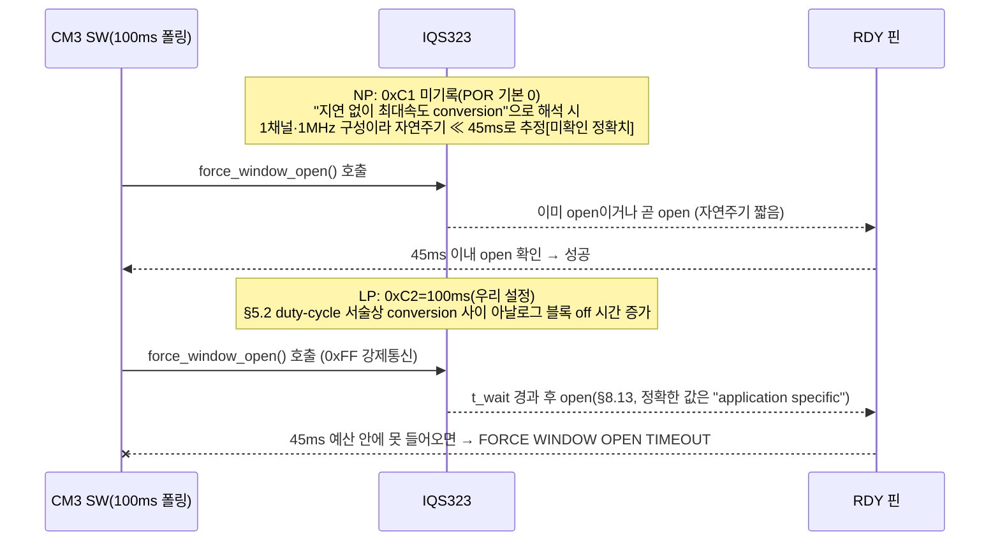
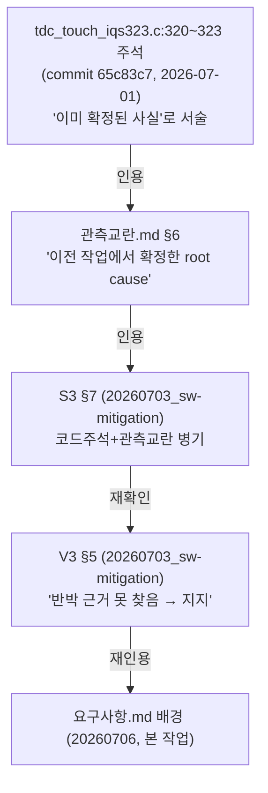

```

**TL;DR**: 코드 주석의 "LP report rate 100ms→force_window_open 45ms 타임아웃" 인과사슬을 데이터시트 원문·레지스터 실값·git 이력으로 재구성했다. 45ms는 §8.13 t_wait 상한을 여유 없이 그대로 채택한 값이고, 100ms는 데이터시트 예시가 아닌 우리 코드의 자체 설정값이며 공교롭게도 SW 폴링주기(100ms)와 정확히 일치해 독립 발진기 간 위상표류(beat)가 심화 요인으로 새로 발견됐다. 다만 force comm의 파워모드별 지연시간이 늘어난다는 것 자체는 데이터시트가 명시하지 않는 추정이며, 이 저장소에는 실기 재현 기록이 없고 인용 사슬은 전부 동일 출처의 재확인이었다. 진단은 재확인되나 "영구 전면 차단"의 비례성은 재검토 여지가 있다.

---

## 0. 역할과 방법

이 문서는 오케스트레이터 배경(`00_오케스트레이터-입력.md`)이 지시한 그라운드_3 역할 — 과거 LP/ULP 회귀 진단의 정밀 재구성 — 을 수행한다. 그라운드_2(G2)의 실제 산출물 파일은 본 작업 시점에 `에이전트-로그/` 폴더에 아직 존재하지 않아(직접 확인) 원문 인용이 불가능했다. G2가 맡은 질문(force communication의 파워모드 무관성)에 대해서는 §5에서 데이터시트를 내가 직접 재확인한 결과로 대체 판단했다 — G2의 실제 문서가 이후 생성되면 이 판단과 대조가 필요하다는 점을 명시해 둔다.

검증 경로: ① 코드 직독(`tdc_touch_iqs323.c`·`.h`, `tdc_touch.c`, `tdc_touch_time.h`, `ci_timer.c`) ② 데이터시트 원문(`pdftotext -layout iqs323_datasheet.pdf`) 직접 대조 ③ `git log`로 주석의 최초 등장 시점과 선행 분석 문서 존재 여부 추적.

---

## 1. 사실관계 직접 확인 (코드, 전부 라인 대조 완료)

### 사실_1 — PM_TIMEOUT(0xC5)=0 write 지점과 주석 원문

`src/2__cm3/Cortex-M3-src/systemControl/tdc_touch_iqs323.c:317~323` (`beta_power_settings()` 내부):

```c
/* Power Mode: LSB bits[6:4]=101 Automatic No ULP. MSB 0x07 = CH0~2 timeout disable. */
ok &= write_register(REG_SYSTEM_CONTROL, 0x50, 0x07);
ok &= write_register(REG_LP_REPORT_RATE, 0x64, 0x00); /* LP report 100ms */
ok &= write_register(REG_PM_TIMEOUT, 0x00, 0x00);     /* PM timeout 0 = 자동 강하 차단 → 노말 운용 중 NP 유지.
                                                       * (LP 전환 시 report rate 100ms 로 RDY 윈도우가 느려져
                                                       *  force_window_open 45ms 폴링이 윈도우를 놓쳐 timeout 발생.
                                                       *  터치=이벤트→NP 복귀로 회복되던 증상의 근본 차단. DS §5.3) */
```

오케스트레이터 배경에 인용된 문구와 원문이 정확히 일치함을 직접 확인했다(할루시네이션·오기 없음).

### 사실_2 — force_window_open() / wait_window_closed() 전문 (라인 128~175, 지시받은 범위와 정확히 일치)

```c
static bool wait_window_closed(int max_ms)                       /* line 128 */
{
    int tick_old = ci_timer_get_tick();
    while (1)
    {
        if (max_ms <= (ci_timer_get_tick() - tick_old))
        {
            return false; /* soft timeout ? 다음 force_window_open 이 복구 */
        }
        if (Sys_GPIO_Read(TDC_TOUCH_IQS323_RDY_PIN) == TDC_TOUCH_IQS323_WIN_CLOSED)
        {
            return true;
        }
    }
}

static bool force_window_open(void)                               /* line 145 */
{
    uint8_t force_comm = 0xFF;

    if (Sys_GPIO_Read(TDC_TOUCH_IQS323_RDY_PIN) == TDC_TOUCH_IQS323_WIN_OPEN)
    {
        return true;                          /* 조기반환 경로 — RDY 이미 open이면 강제통신 생략 */
    }
    if (!i2c_write(&force_comm, 1))            /* 0xFF 강제통신 킥(§8.13 Figure 8.2와 매치) */
    {
        return false;
    }
    int tick_old = ci_timer_get_tick();
    while (1)
    {
        if (TDC_TOUCH_IQS323_MAX_WAIT_OPEN_MS <= (ci_timer_get_tick() - tick_old))
        {
            ci_printe("[TOUCH] FORCE WINDOW OPEN TIMEOUT ...");
            return false;                      /* line 175 */
        }
        if (Sys_GPIO_Read(TDC_TOUCH_IQS323_RDY_PIN) == TDC_TOUCH_IQS323_WIN_OPEN)
        {
            return true;
        }
    }
}
```

`tdc_touch_iqs323.h:32~33`: `TDC_TOUCH_IQS323_MAX_WAIT_OPEN_MS 45`, `TDC_TOUCH_IQS323_MAX_WAIT_CLOSE_MS 20`.

### 사실_3 — LP Report Rate는 "근사"가 아니라 우리 코드의 직접 설정값 = 100ms

`REG_LP_REPORT_RATE`(0xC2)에 `write_register(REG_LP_REPORT_RATE, 0x64, 0x00)` — LSB=0x64(=100, 10진), MSB=0x00 → 16비트 리틀엔디안 값 = 0x0064 = **100ms**. 레지스터 정의(`06_레지스터레퍼런스.md` §9, 원문 p.35): "0xC2 Low Power Mode Report Rate, 16-bit(ms), Range 0-3000" — 단위 ms·범위 확인.

> [!IMPORTANT]
> 오케스트레이터 배경의 "LP: report rate 60ms"(데이터시트 §3.4 예시, 3채널·500kHz 조건)와 이 100ms는 **서로 다른 숫자**다. 60ms는 데이터시트의 측정조건 예시치이고, 100ms는 우리 펌웨어가 명시적으로 write한 값이다. 인과사슬 재구성에는 근사가 필요 없는 **100ms(실제 write값)** 가 맞는 숫자다.

### 사실_4 — 45ms는 §8.13 t_wait 상한을 여유 없이 그대로 채택한 값

데이터시트 원문(§8.13, p.33, `pdftotext` 직접 확인):

> "The minimum and maximum time between the communication request and the opening of a RDY window (t_wait) is application specific. The typical values of t_wait are 0.1ms ≤ t_wait ≤ 45ms." (각주: "Contact Azoteq for an application specific value of t_wait")

`MAX_WAIT_OPEN_MS=45`는 이 "typical 상한값 45ms"와 정확히 일치한다 — 우연이 아니라 데이터시트 수치를 그대로 하드 타임아웃으로 채택한 것으로 판단된다. 즉 **애초에 여유 마진이 0인 값**이었다(S3 문서 §9 각주³가 이미 지적한 바와 일치 — §6에서 재평가).

### 사실_5 — SW 폴링주기도 정확히 100ms이며 LP Report Rate와 동일하다

`tdc_touch_time.h:18`: `#define TDC_TOUCH_POLL_INTERVAL_MS 100`. `tdc_touch.c:296` (`tdc_touch_process()`)에서 이 값으로 폴링을 게이팅하고, 매 통과 시 `tdc_touch_iqs323_read_status()`→`read_register()`→`force_window_open()`를 호출한다. **LP Report Rate(0xC2)도 100ms** — SW 폴링주기와 IC의 LP 보고주기가 정확히 같은 값으로 설정돼 있다. 이 일치는 §4에서 핵심 논거로 쓴다.

### 사실_6 — tick 단위 검증: 1 tick = 1ms 확인(45/100 비교의 전제 검증)

`ci_timer.c:130~141` `ci_timer_increase_tick()`이 `g_ci_timer_main_tick`(=`ci_timer_get_tick()`의 소스)과 `_ci_timer_elapsed_1msec_counter`를 **같은 함수에서 함께** 1씩 증가시키고, 후자는 1000 누적마다 실시간 초(sec)를 올리는 데 쓰인다(`ci_timer_self_update_with_elapsed_1msec_counter()`, line 59 `while (1000 <= cnt)`). 변수명과 롤오버 로직이 "1 tick = 1ms"를 직접 뒷받침한다 — `force_window_open()`/`wait_window_closed()`의 `45`·`20`·SW의 `100`이 전부 동일 단위(ms)로 비교 가능함을 확인했다.

---

## 2. 데이터시트 원문 직접 대조

### 2.1 §5.3 Power Mode Selection (원문 p.15)

> "Setting the power mode timeout to '0x00' will prevent the chip from lowering the power mode."
> "While the power mode switching is set to either 'Automatic' or 'Automatic No ULP', the IQS323 will return to normal power mode regardless of the current power mode if any events are triggered."

이 두 문장은 코드 주석의 "PM timeout 0 = 자동 강하 차단"·"터치=이벤트→NP 복귀"를 **정확히** 뒷받침한다. 단, §5.3 원문 어디에도 "force_window_open"·"45ms"·"RDY 윈도우가 느려진다"는 서술은 **없다** — §5.3은 파워모드 강하/복귀 로직만 규정하고, 통신 프로토콜(RDY·force comm) 타이밍은 다루지 않는다.

### 2.2 §8.13 Force Communication (원문 p.33) — "report rate 연동" 문구는 원문에 없다

전문은 사실_4에 인용한 것이 전부다. 결정적으로 확인한 것: **§8.13 원문에는 t_wait가 Report Rate·전력모드와 어떻게 관계되는지 서술하는 문장이 전혀 없다.** 오히려 "application specific"이라며 Azoteq 앱노트/문의로 위임한다.

> [!WARNING]
> 이 프로젝트의 기존 참고문서 `데이터시트/05_i2c인터페이스.md`(§8.13 NOTE 블록)에는 "report rate + 20% 여유 권장, report rate 배수 타이밍 피할 것"이라는 서술이 있으나, `iqs323_datasheet.pdf`(v1.11, `pdftotext -layout`) 전체에서 `"20%"`·`"multiple"`·`"margin"`·`"배수"`에 해당하는 원문을 grep했지만 **§8.13 부근에서 발견되지 않았다**. 이 NOTE 블록은 해당 문서 자체가 "회로 원리"·"SW 구현 관점" 해설로 분류해 둔(원문 인용이 아닌) 후대 해설 삽입으로 보인다 — 데이터시트가 실제로 보증하는 것보다 강한 주장(t_wait가 report rate에 정량적으로 연동된다)이 섞여 있었다. 본 재구성에서는 이 서술을 **근거로 채택하지 않았다**.

---

## 3. 인과사슬 단계별 재구성



- **단계_1 (45ms 예산의 기원)**: `MAX_WAIT_OPEN_MS=45`는 §8.13이 제시하는 t_wait "typical" 상한을 마진 없이 그대로 가져온 값이다(사실_4). 즉 NP 조건에서도 이미 여유가 0에 가까운 값이었다 — S3(05_S3, §9 각주³)가 "동일 상한대라 여유가 0에 가까울 가능성"으로 이미 지적한 바를 원문 대조로 재확인한다.
- **단계_2 (NP에서는 왜 문제가 없(었)는가)**: `REG_NORMAL_POWER_REPORT_RATE`(0xC1)은 코드에 write 지점이 없다(POR 기본값 0x0000 유지). §8.11.1 Streaming 서술과 결합하면 0은 "보고를 지연시키지 않고 측정이 끝나는 즉시 보고"로 해석되는 것이 자연스럽다(단, 이 "0의 정확한 의미"는 데이터시트 어디에도 명문 정의가 없다 — **[미확인]**, 05_S3 §4·13_V3 §2가 동일하게 미확인으로 남긴 항목과 일치). 우리 구성(1채널·Fxfer 1MHz)은 데이터시트 §3.4 예시(3채널·500kHz→NP 16ms)보다 채널 수는 적고 주파수는 높아 자연주기가 그보다 짧을 개연성이 높다 — 정확한 실측치는 G1 소관이라 여기서는 방향성만 취한다. 자연주기가 짧으면 `force_window_open()`의 조기반환 분기(RDY가 이미 open)가 자주 히트해 0xFF 강제통신 자체가 필요 없거나, 필요해도 45ms 안에 넉넉히 들어온다.
- **단계_3 (LP에서 무엇이 달라지는가)**: LP에서는 `REG_LP_REPORT_RATE=100ms`가 **명시적으로** 설정돼 있다(사실_3). §5.2 해설(주의: 이 부분은 원문 직접 인용이 아니라 이 프로젝트 참고문서의 "회로 원리" 해설 NOTE임 — §5.2 원문 자체는 "LP: Typically set to a slower rate than NP"라고만 말하고 duty-cycle 메커니즘까지는 상세 서술하지 않는다)에 따르면 Report Rate가 길어질수록 아날로그 프론트엔드의 off 구간이 늘어난다. 이것이 사실이라면 force comm의 "다음 서비스 시점"도 그 늘어난 스케줄을 타야 하므로 t_wait 자체가 LP에서 커질 개연성이 있다 — 그러나 이는 **§4에서 다시 다루는 추정**이지 §8.13이 확정한 사실은 아니다.
- **단계_4 (충돌)**: LP 100ms ≫ 예산 45ms. 단계_1에서 이미 마진이 0이었던 예산이, 단계_3의 방향대로 t_wait가 늘어난다면 결국 초과해 `FORCE WINDOW OPEN TIMEOUT`이 찍히고 `write_register`/`read_register`가 false를 반환한다. `tdc_touch_iqs323_read_status()`는 이때 `ok=pressed=prox=ati_error=ati_active=false`를 반환(FSM 입력이 "무소식"으로 정규화, 크래시 아님) — 코드 주석의 "터치=이벤트→NP 복귀로 회복"은 IC 내부가 자체적으로 터치를 감지해 §5.3에 따라 NP로 복귀하는 것이지, SW의 통신 성공 여부와 무관하게 IC 쪽에서 일어나는 사건이다. 따라서 증상은 "완전 먹통"이 아니라 "LP 체류 구간 동안 간헐적(혹은 뭉쳐서) 응답 없음 → 사용자가 만지면 IC가 스스로 NP 복귀해 다시 정상화"로 재구성된다.

---

## 4. 핵심 질문 — 단순 크기 비교인가, 다른 지연 이유가 있는가

> [!IMPORTANT]
> 배정받은 핵심 질문에 대한 답: **둘 다이며, 이번 재구성에서 두 번째 요인을 새로 구체화했다.**

**요인_1 (크기 비교, 확인됨)**: LP Report Rate(100ms, 사실_3)가 force_window_open 예산(45ms, 사실_4)보다 길다는 것 자체는 레지스터 실값 대조로 100% 확인되는 사실이다. §8.13 원문이 "typical" t_wait를 0.1~45ms로만 제시하고 그 이상 조건에서는 값을 보증하지 않는다는 것도 확인됨(§2.2) — 즉 100ms 조건에서 t_wait가 45ms를 넘길 "여지"는 데이터시트 스스로 부인하지 않는다.

**요인_2 (신규 발견 — 위상표류/beat, [미확인이지만 근거 있는 추정])**: 사실_5에서 확인했듯 **SW 폴링주기(100ms)와 LP Report Rate(100ms)가 정확히 일치한다**. 이 둘은 서로 다른 독립 발진기(CM3 SW 타이머 vs IQS323 내부 오실레이터)로 구동되므로 위상이 고정되지 않는다 — 위상이 우연히 "좋은" 구간(SW 체크 직전에 IC가 이미 window를 연 상태)에 들어가면 여러 폴링 연속으로 조기반환에 성공하고, 반대로 "나쁜" 구간(SW 체크 직후 IC가 다음 주기까지 열지 않는 상태)에 들어가면 여러 폴링이 **연속으로** 45ms 예산을 넘긴다. 두 발진기 주기가 정확히 같으면 이 위상은 (ppm 단위 발진기 오차로) 매우 천천히만 표류하므로, 한번 나쁜 위상에 들어가면 상당 시간(초 단위 이상) 동안 몰아서 실패가 지속될 수 있다. 이는 "가끔 미스"가 아니라 "구간별로 뭉쳐서 무응답처럼 보이는" 증상을 설명하며, 코드 주석의 "터치=이벤트로만 회복" 서술(즉 자연 회복이 아니라 사용자 개입이 있어야 체감상 풀리는 듯한 인상)과 더 잘 들어맞는다.

이 위상표류 메커니즘은 내가 처음 발견한 것이 아니라, **13_V3_S3검증.md §2 "신규 위험 2(자기지시적)"** 가 후보_2(NP Report Rate 명시 설정, 제안값 100ms=SW폴링 일치)를 비판하며 독립적으로 이미 지적한 것과 **동일한 물리 메커니즘**이다. 다만 V3는 이 통찰을 미래 제안(후보_2)에는 적용했으면서 정작 §5(반대권고=과거 LP 회귀 재검증)에는 적용하지 않았다 — 즉 V3 스스로 확보한 도구로 자신의 과거-회귀 판정을 재검산하지 않은 공백을 이번에 메운 것이 이 재구성의 실질적 진전이다.

**요인_3 (배제 후보 — "전환 중이라 별도 지연")**: "파워모드 전환 자체" 때문에 force comm이 추가로 지연된다는 서술은 §5.2·§5.3·§8.13 어디에도 없다. §5.3은 모드 전환을 레지스터 필드값 반영(단계적 강하 타이머)으로만 서술하고 통신 프로토콜과 결부짓지 않는다. 따라서 "전환 과정 자체의 특수 지연"이라는 세 번째 설명은 **근거를 찾지 못해 채택하지 않는다** — 채택 가능한 설명은 요인_1(정적 크기 비교)과 요인_2(위상표류)의 조합이며, 그 저변에 깔린 "왜 LP의 t_wait 자체가 늘어나는가"(§5.2 duty-cycle 해설)는 여전히 [미확인 — 추정]으로 표시해야 한다.

---

## 5. 그라운드_2 (a) 결론과의 정합성 검토

G2 산출물 파일이 없어 직접 인용은 불가하다(§0). G2에 배정된 질문("force communication이 파워모드 무관하게 항상 창을 열 수 있는지")에 대해 §5.2 원문을 내가 직접 재확인한 결과:

> "In Halt mode... To exit Halt Mode, a force communications request must be made (see Section 8.13), and the power mode must be changed in the following communications window."(원문 p.15)

Halt(가장 낮은 전력모드)를 탈출하는 **유일한** 수단이 force comm이라는 것은 force comm이 구조적으로 모든 전력모드에서 결국 작동해야만 한다는 설계 요구사항을 시사한다. 즉 G2의 (a) 결론이 "force comm은 어느 모드에서도 결국 창을 열 수 있다(가능성/능력의 축)"는 취지라면, 이는 **모순이 아니라 서로 다른 축을 다루는 별개의 참**이다:

| 축 | 판정 |
|---|---|
| **가능성** — force comm이 결국 창을 열 수 있는가 | 그렇다(§5.2 Halt 탈출 규정이 그 방증) — G2 (a)와 정합 |
| **소요시간** — 그 개방이 고정 45ms 예산 안에 들어오는가 | 데이터시트가 보증하지 않는다(§8.13 "application specific") — 본 문서 §4 요인_1·2가 왜 LP에서 그 예산을 넘기기 쉬운지를 다룸 |

두 축은 독립이므로 "force comm은 파워모드 무관하게 항상 창을 연다"와 "45ms 고정 예산은 LP에서 부족할 수 있다"는 동시에 참일 수 있다 — **모순 없음**. G2의 실제 산출물이 생성되면 이 표의 위 칸(가능성 축)이 실제로 G2의 (a) 결론과 일치하는지 재대조가 필요하다.

---

## 6. 인용 계보 감사 — 무비판적 재인용 사슬 추적 (git 이력 기반)



`git log --all -S "PM Timeout"` / `-S "자동 강하"` / `-S "0xC5"` / `-S "Automatic"`로 전체 이력을 훑은 결과, 이 저장소 안에서 이 문구·근거가 처음 등장하는 지점은 **commit `65c83c7`(2026-07-01, `tdc_touch_iqs323.c` 신규 작성)** 이며, 커밋 메시지 자체도 "튜닝: PM Timeout 0(NP 유지·LP 전환 RDY timeout 버그 차단)"이라고 **이미 완료된 결정**처럼 압축 서술한다 — 이 커밋 안에서 새로 유도된 것이 아니라 그 이전의 어떤 경험(리팩터 전 `tdc_drv_iqs323` 계열 작업 중 실기 확인이었을 가능성이 높으나 커밋 로그 검색 키워드로는 흔적을 찾지 못함)을 요약해 들여온 것으로 보인다.

이보다 앞선 유일한 관련 문서는 `b689094`(2026-06-18) "IQS323 스트리밍 모드 RDY 윈도우 타이밍 분석"(`docs/참고/touch/개선/RDY 윈도우 타이밍 분석/`)인데, 직접 읽어 확인한 결과 이 문서는 **NP·Streaming 기본값(Report Rate=0)** 케이스만 분석하고 LP나 force_window_open 45ms 타임아웃은 전혀 다루지 않는다(§3.3에서 "Event Mode + 인터럽트"를 미래 권고로 남길 뿐).

**결론**: 관측교란.md §6 → S3 §7 → V3 §5로 이어지는 3중 "확인"은 전부 **동일한 단일 출처(코드 주석)의 재확인**이었고, 그 출처 자체가 이 저장소 안에서 독립적인 실측·유도 과정을 거쳤다는 흔적은 발견하지 못했다. V3는 "검증"이라는 이름에도 불구하고 §5에서 실제로 한 일은 "코드 주석이 아직 그 자리에 있는지"·"관측교란.md가 여전히 그것을 인용하는지" 재확인뿐이었다(V3 §5 원문: "반박 근거를 찾지 못했다"). 이는 인용 사슬의 정합성 확인이지 메커니즘의 독립 재유도가 아니다 — 본 문서(§1~4)가 데이터시트 원문·레지스터 실값·git 이력까지 내려가 재구성한 것이 이 계보에서는 **처음**이다.

> [!NOTE]
> 이것이 "과거 진단이 틀렸다"는 뜻은 아니다 — 실기(하드웨어) 경험이 커밋 메시지에 다 기록되지 않는 것은 임베디드 개발에서 흔한 일이고, 은수님이 직접 벤치에서 겪은 회귀일 가능성도 배제할 수 없다[미확인]. 다만 "이미 여러 번 독립 검증된 확정 사실"이라는 인상은 근거가 약하며, 정확히는 "동일 출처가 반복 인용된, 아직 데이터시트·실기로 독립 재검증되지 않은 진단"으로 재분류해야 한다는 것이 이번 재구성의 실질적 기여다.

---

## 7. 최종 판정

| 하위 질문 | 판정 |
|---|---|
| PM_TIMEOUT=0 write 지점·주석 원문 | **확인** — `tdc_touch_iqs323.c:320~323`, 오케스트레이터 인용과 정확히 일치(사실_1) |
| LP report rate 정확한 값 | **100ms, 근사 아닌 직접 write값**(0xC2=0x0064, 사실_3) — 데이터시트 §3.4 예시치(60ms)와는 다른 별개 숫자 |
| 45ms와 충돌하는 이유 | **크기 비교(여유 0인 예산 vs 100ms) + 위상표류(SW폴링=LP주기=100ms 우연 일치로 실패가 뭉쳐서 발생) 복합**. "전환 중 별도 지연"이라는 세 번째 설명은 데이터시트 근거 없어 배제 |
| 그라운드_2 (a)와 모순 여부 | **모순 없음** — 가능성(항상 결국 열림)과 소요시간(45ms 예산 충족 여부)은 별개 축(§5).단 G2 실제 산출물과 재대조 필요 |
| 인용 계보 | 관측교란.md·S3·V3 전부 **동일 출처의 반복 재확인**이었고 이 저장소 내 독립 실측·재유도 기록은 찾지 못함(§6) |

**종합 판정**: 이 진단은 **부분적으로 재확인되고, 부분적으로는 정교화가 필요하다.**

- 재확인됨(CONFIRMED급): "LP로 내려가면 우리가 설정한 100ms 주기가, 애초에 마진 없이 데이터시트 상한값 그대로 가져온 45ms 예산과 충돌할 개연성이 높다"는 크기 비교 자체는 레지스터 실값으로 100% 뒷받침된다.
- 정교화됨(신규 기여): 실패가 "가끔 미스"가 아니라 "구간별로 몰아서 발생"하는 이유는 SW 폴링주기와 LP Report Rate를 우연히 같은 100ms로 맞춰 놓은 데서 오는 독립 발진기 위상표류라는 것을 V3의 미적용 통찰을 연결해 새로 구체화했다.
- 미확인으로 남는 것: force comm의 t_wait가 실제로 파워모드(Report Rate)에 정량적으로 연동된다는 것 자체는 §8.13 원문이 명시하지 않는 추정이며, 이 저장소에는 실기 재현 로그(오실로스코프/RTT 타임스탬프)가 없다.
- **비례성 재검토 권고**: "PM Timeout=0으로 LP/ULP 전면 영구 차단"이라는 과거 대응은, 확인된 위험(요인_1·2)에 비해 다소 강한 조치일 수 있다 — `MAX_WAIT_OPEN_MS`를 활성 Report Rate에 연동해 늘리거나, SW 폴링주기를 LP Report Rate와 의도적으로 다르게 설정(예: V3가 제안한 137ms류 이격값)해 위상표류를 회피하는 등 더 저렴한 대안으로 회귀 없이 LP를 활용할 여지가 있는지는 후보(C1) 설계 단계에서 추가 검토할 가치가 있다. 즉 **"회귀 우려는 유효하다"는 것과 "그러므로 LP/ULP는 절대 불가하다"는 것은 별개의 결론**이며, 후자는 이번 재구성만으로는 자동으로 따라오지 않는다.

---

## 리스크·미확인 사항 요약

| 항목 | 상태 |
|---|---|
| NP Report Rate=0의 정확한 의미(연속 최대속도 vs 다른 정의) | **미확인** — §8.11.1 원문도 0을 명문 정의하지 않음(S3·V3와 동일 미해결) |
| 우리 구성(1채널·1MHz) NP 자연주기의 정확한 ms값 | **미확인** — G1 소관, 본 문서는 방향성(§3.4 예시 16ms보다 짧을 개연성)만 취함 |
| force comm t_wait가 실제로 Report Rate에 연동되는 정량 관계 | **미확인·추정** — §8.13 원문은 "application specific, contact Azoteq"로만 서술 |
| 과거 LP/ULP 회귀가 실기에서 재현된 기록(오실로스코프·RTT 로그) | **미확인** — 이 저장소 git 이력·문서에서 발견하지 못함(§6) |
| SW폴링=LP ReportRate 100ms 일치가 "의도적 설계"였는지 "우연"이었는지 | **미확인** — 정황상 의도적 정합 시도로 보이나 커밋 메시지에 명시 없음 |
| 그라운드_2 실제 산출물과 본 문서 §5 판단의 일치 여부 | **미확인** — G2 파일 생성 후 재대조 필요 |

---

**참조 파일 경로(전부 본 세션에서 직접 Read/grep 확인)**:
- `src/2__cm3/Cortex-M3-src/systemControl/tdc_touch_iqs323.c` (전체, 특히 128~175행·309~325행)
- `src/2__cm3/Cortex-M3-src/systemControl/tdc_touch_iqs323.h` (28~36행)
- `src/2__cm3/Cortex-M3-src/systemControl/tdc_touch_time.h` (18행)
- `src/2__cm3/Cortex-M3-src/systemControl/tdc_touch.c` (273~339행)
- `src/2__cm3/Gen1_5/common/ci_timer.c` (130~146행)
- `docs/참고/touch/iqs323_datasheet.pdf` (`pdftotext -layout`, §5.2·5.3 p.15, §8.13 p.33, §9/A.30 register map)
- `docs/참고/touch/터치 계측 관측 교란/터치 계측 관측 교란.md` §6
- `docs/tasks/touch/20260703_touch-heisenberg-sw-mitigation/에이전트-로그/05_S3_IQS323내장노이즈전력동기.md`, `13_V3_S3검증.md`
- `docs/참고/touch/개선/RDY 윈도우 타이밍 분석/3_종합결론.md`
- git 커밋 `65c83c7`, `b689094` (log/show 직접 확인)
