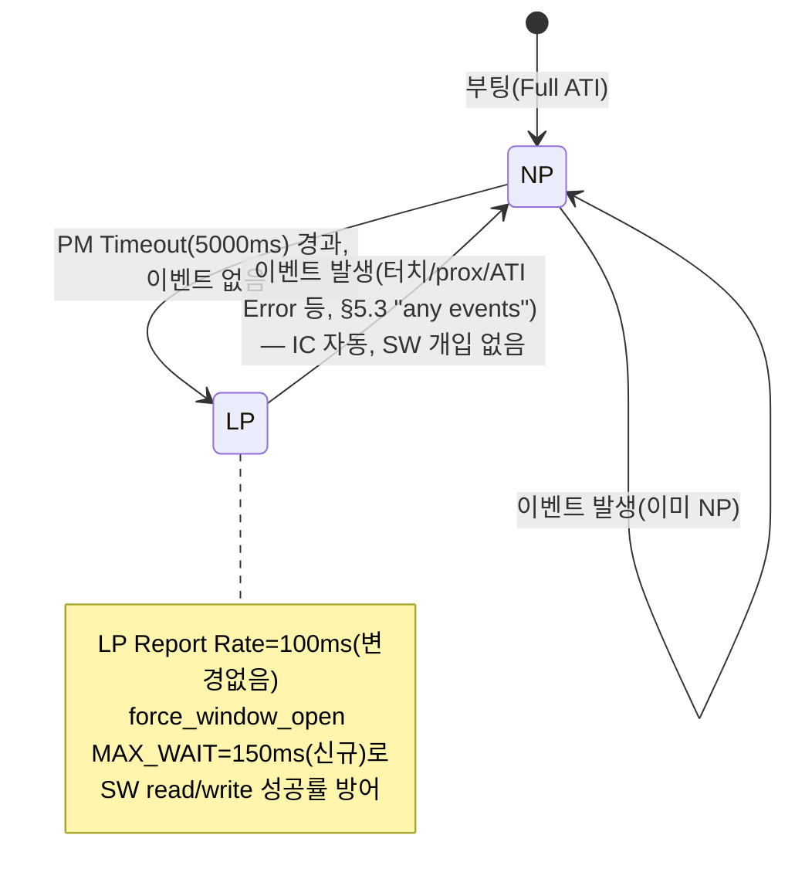

# 후보_1 · LP 모드 활용 시나리오 — Power Mode Timeout·Report Rate 설계와 과거 회귀 재발 방지

**TL;DR**: PM Timeout(0xC5)을 0→5000ms로 바꿔 이미 설정돼 있던 Automatic No ULP를 실제로 활성화하고, 과거 회귀(LP Report Rate 100ms 대비 MAX_WAIT_OPEN_MS 45ms 부족으로 force_window_open 타임아웃)를 MAX_WAIT_OPEN_MS 150ms 상향으로 재발 방지하는 최소변경 설계다. 이벤트 발생 시 IC가 파워모드 무관하게 즉시 NP로 복귀함을 데이터시트 원문으로 확인해 SW측 수동 개입을 배제했다. 그라운드_1~3 산출물이 작성 시점 부재해 필요 사실은 원문·코드로 직접 재검증했다.

---

## 0. 조사 방법과 전제

> [!IMPORTANT]
> **그라운드_1~3 산출물 부재 고지**: 작성 지시는 "그라운드_1~3 결과를 참고해(파일 01~03 Read)"였으나, 작성 착수 시점(및 조사 도중 재확인 시점)에 `docs/tasks/touch/20260706_touch-power-mode-np-lp-ulp/에이전트-로그/`에는 `00_오케스트레이터-입력.md`만 존재했고 01~03 파일은 없었다(디렉토리 직접 조회로 3회 재확인). 병렬 실행 타이밍 문제로 판단해, 그라운드가 확정했어야 할 사실을 본 문서가 **직접 원문·코드 대조로 자체 재검증**했다. 그라운드_1(전력수치)·그라운드_2(force communication 파워모드 무관성 정밀검증)의 일부 결론은 본 문서 §1·§6에서 [미확인]으로 명시한 대로 실측 없이는 확정할 수 없는 부분이 남아있다 — 이는 그라운드_2가 별도로 완결해야 할 영역이며, 본 설계는 그 불확실성이 남아 있어도 안전하도록 구성했다(§4.4).

조사에 사용한 1차 소스:
- 코드: `tdc_touch_iqs323.c`(전체 499행)·`tdc_touch_iqs323.h`(전체)·`tdc_touch.c`(전체)·`tdc_touch_time.h`(전체)·`main.c`(발췌, func_sleep/fake_func_sleep 구간)를 직접 Read.
- 데이터시트: `docs/참고/touch/데이터시트/`의 01·02·05·06번 문서를 1차로, 핵심 주장(§5.2·5.3 전력모드 선택, §8.13 Force Communication, 부록C I²C Lock Up, §5.6 NP/LP 필터 베타)은 `iqs323_datasheet.pdf`를 본 세션이 직접 `pdftotext -layout`으로 재추출해 원문 라인 단위로 재대조했다.
- 선행 작업: `20260705_touch-event-mode-adoption` 시리즈(요구사항·계획·그라운드_2/3·후보_3/7 관련 산출물)와 `20260703_touch-heisenberg-sw-mitigation`의 그라운드_3(`05_S3_...md`)·검증_3(`13_V3_...md`)을 열람하되, 지시대로 그 "LP/ULP 반대" 결론은 **재인용하지 않고 §2에서 독립 재구성**했다.
- `git log -p`로 `tdc_touch_iqs323.c`/`.h`의 PM_TIMEOUT·MAX_WAIT_OPEN_MS 관련 변경 이력을 직접 조회했다.

---

## 1. 현재 상태 재확인 (직접 대조)

`beta_power_settings()`(`tdc_touch_iqs323.c:309~325`)의 관련 3개 write를 직접 재확인:

| 레지스터 | 코드 위치 | write 값 | 의미(A.30·§9 원문 대조) |
|---|---|---|---|
| `REG_SYSTEM_CONTROL`(0xC0) | `:318` | LSB=0x50, MSB=0x07 | bits[6:4]=101=**Automatic No ULP**(이미 설정!), bit7=0(Streaming), MSB bits[10:8]=111=CH0~2 Timeout Disable 전부 |
| `REG_LP_REPORT_RATE`(0xC2) | `:319` | LSB=0x64, MSB=0x00 | **100ms**(이미 설정, 현재는 "죽은 값") |
| `REG_PM_TIMEOUT`(0xC5) | `:320` | LSB=0x00, MSB=0x00 | **0ms = 강하 차단**(§5.3 원문 "Setting the power mode timeout to '0x00' will prevent the chip from lowering the power mode" 직접 확인) |

**핵심 관찰**: Power Mode 필드는 이미 "Automatic No ULP"로 설정되어 있고, LP Report Rate도 이미 100ms로 기록돼 있다. **PM Timeout=0 하나만이 LP 진입을 막고 있다.** 이는 LP 활용에 필요한 준비가 "절반 이상 이미 되어 있다"는 뜻이다 — 본 설계의 최소변경 원칙(§3)이 성립하는 근거다.

부팅 이후 `REG_SYSTEM_CONTROL` 나머지 write 5곳(`:237` ack_reset, `:447` boot Re-ATI, `:453` boot RESEED, `:462~466` `re_ati()`, `:468~472` `reseed()`)도 전부 확인한 결과, `ack_reset()`(`:237`, LSB=0x01/MSB=0x00 — Power Mode=000 Normal)을 제외한 나머지는 모두 Power Mode=101(Automatic No ULP)·CH Timeout Disable=0x07을 보존한다(예: `:447` `0x54,0x07` — 코드 주석 "bit2 Re-ATI + Power No ULP + CH timeout disable(0x07) 보존"). `ack_reset()`은 `beta_power_settings()`보다 먼저 실행되는 부팅 초입 1회성 write라 이후 곧바로 101로 재설정되므로 본 설계에 영향 없다.

---

## 2. 과거 회귀의 독립 재구성

코드 주석 원문(`tdc_touch_iqs323.c:320~323`, 재확인):

> "PM timeout 0 = 자동 강하 차단 → 노말 운용 중 NP 유지. (LP 전환 시 report rate 100ms 로 RDY 윈도우가 느려져 force_window_open 45ms 폴링이 윈도우를 놓쳐 timeout 발생. 터치=이벤트→NP 복귀로 회복되던 증상의 근본 차단. DS §5.3)"

### 2.1 git 이력 확인 — 정확한 과거 수치는 추적 불가

`git log -p --all`로 `tdc_touch_iqs323.c`/`.h`를 조회한 결과, 이 파일에 대한 커밋은 `65c83c7`(Full ATI 리팩토링, 2026-06-20 "3레이어 탈피 간결 재작성")과 `89511f1`(fake-sleep 인프라) 둘 뿐이었고, `PM_TIMEOUT`·`MAX_WAIT_OPEN_MS` 관련 라인은 **전부 `65c83c7`에서 최초 추가(+)로 등장** — 즉 PM Timeout=0과 MAX_WAIT_OPEN_MS=45는 이 재작성 시점부터 이미 이 값으로 존재했다. 회귀가 실제 발생한 시점의 코드는 이 파일 헤더 주석이 "탈피"했다고 명시하는 **이전 3레이어 아키텍처**(현재 저장소에 없음)에 있었을 것으로 추정된다. **[미확인]**: 회귀 당시의 정확한 PM Timeout 값(0이 아니었던 그 수치)과 MAX_WAIT_OPEN_MS 값(45였는지 다른 값이었는지)은 이번 세션에서 추적 범위 밖이다 — 코드 주석에 남은 인과 서술만이 유일하게 남은 1차 증거다.

### 2.2 인과 사슬 재구성

`force_window_open()`(`:145~175`)의 구조를 재확인하면: RDY가 이미 OPEN이면 즉시 반환(`:149~152`), 아니면 `i2c_write(&force_comm=0xFF, 1)`(`:154~159`) 후 최대 `TDC_TOUCH_IQS323_MAX_WAIT_OPEN_MS`(=45, `iqs323.h:32`)까지 RDY OPEN을 폴링(`:161~174`), 초과 시 `false` 반환(로그: "FORCE WINDOW OPEN TIMEOUT").

코드 주석을 그대로 따르면 인과는: **PM Timeout≠0 설정 → 유휴 후 LP 진입 → LP Report Rate(100ms)로 IC의 통신창 주기가 느려짐 → SW의 45ms 대기 상한이 100ms 주기를 놓침 → force_window_open() 타임아웃 → read/write 실패 → (기존엔) 터치=이벤트 발생 시 NP로 복귀해야 정상화되는데, 그 복귀 자체를 감지하려는 read조차 같은 45ms 타임아웃에 걸려 회복이 지연/실패**.

**재구성 결론 (독립 재검토, S3/V3의 "반대" 결론을 그대로 인용하지 않음)**: 이 회귀는 코드 주석이 스스로 설명하는 인과 자체를 볼 때, **"LP 모드가 원천적으로 이 시스템과 양립 불가능하다"는 근본적 결함이 아니라, "SW의 타임아웃 상수(45ms)가 그때 도입된 LP Report Rate(100ms)에 맞춰 함께 조정되지 않은 파라미터 불일치"**로 재해석하는 것이 코드 사실과 가장 정합적이다. 당시 조치는 PM Timeout을 0으로 되돌리는 가장 단순한 롤백이었고, LP Report Rate(0xC2=100ms)와 Power Mode 필드(=Automatic No ULP)는 **되돌리지 않고 그대로 남겨뒀다** — 이는 (a) 롤백 당시 "일단 LP를 못 쓰게만 막자"는 최소 개입이었거나 (b) 애초에 LP 재활성을 염두에 두고 두 값을 일부러 남겨뒀을 가능성을 시사한다(어느 쪽이든 [추론] — 확정 근거는 없다). 이 재구성이 맞다면, **MAX_WAIT_OPEN_MS를 LP Report Rate에 맞춰 상향하지 않고 PM Timeout만 되돌리는 것은 정확히 같은 사고의 재현**이 되고, 이번 설계가 반드시 §4.4의 상향을 동반해야 하는 이유가 된다.

> [!NOTE]
> **미해결 핵심 불확실성 [미확인]**: `force_window_open()`의 `i2c_write(&force_comm=0xFF,1)`이 데이터시트 §8.13(SCL 없이 SDA만 토글하는 별도 웨이크업 패턴, Figure 8.2)과 신호 수준에서 동일한 메커니즘인지는 이번 세션에서 확정하지 못했다 — 코드의 `i2c_write()`는 `i2c_startWriteData()`를 통한 **정상 클럭 I2C 트랜잭션**이라, §8.13이 묘사하는 "클럭 없는 SDA 토글"과는 신호 형태가 달라 보인다. 다만 §5.2가 "Halt 탈출에도 force communications request(§8.13) 필요"라 명시한 점(Halt는 I2C 슬레이브만 간헐 동작하는 가장 깊은 절전인데도 force comm으로 깨울 수 있다는 것)은, force comm 자체가 파워모드와 무관하게 동작하도록 설계된 기능이라는 심증을 강하게 뒷받침한다. 이 신호 수준 일치 여부와, Force Comm의 t_wait(§8.13 원문 "0.1ms ≤ twait ≤ 45ms, application specific")가 실제로 Report Rate 값에 비례하는지는 **원문 어디에도 명문화되어 있지 않다**(pdftotext 재검색으로 재확인, "twait"·"report rate" 동시 언급 문장 0건) — 이는 그라운드_2가 실측(RTT 타임스탬프/오실로스코프)으로 규명해야 할 영역이다. 본 설계는 이 불확실성을 없애려 하지 않고, **어느 쪽이 사실이든 안전하도록** §4.4에서 보수적으로 대응한다.

---

## 3. 설계 원칙 — 최소변경

1. **이미 설정된 것은 건드리지 않는다**: Power Mode 필드(=101 Automatic No ULP)·CH Timeout Disable(=0x07)·6개 write 사이트는 전부 그대로 둔다. 변경 대상은 **PM Timeout(0xC5) 한 레지스터**와 **MAX_WAIT_OPEN_MS 한 상수**뿐이다.
2. **SW 로직을 추가하지 않는다**: 이벤트 발생 시 NP 복귀는 IC가 자동으로 수행하므로(§4.5), 이를 흉내 내는 신규 SW 분기·상태추적을 만들지 않는다 — 코드가 늘어날수록 회귀 표면적이 늘어난다는 것이 이번 시리즈 전체가 반복 확인한 교훈이다.
3. **회귀 방지책은 과거에 누락됐던 바로 그 지점을 겨냥한다**: MAX_WAIT_OPEN_MS를 LP Report Rate에 맞춰 상향(§4.4)해, §2가 재구성한 인과 사슬의 취약점을 직접 보강한다.

---

## 4. 구체 설계

### 4.1 Power Mode Timeout (0xC5) — 값 선택: 5000ms

| 후보값 | 근거 | 채택 여부 |
|---|---|---|
| 0 (현행) | 강하 차단, LP 미도달 | 기각(본 제안의 대상) |
| 2000ms | `TDC_TOUCH_RE_ATI_COOLDOWN_MS`/`READ_FAIL_HOLD_MS`와 동일 크기 — 우연한 값 일치일 뿐 직접 근거 아님 | 기각(§ 아래 이유로 롱터치 마진 부족) |
| **5000ms(권고)** | `TDC_TOUCH_LONG_TOUCH_MS`=2400ms(`tdc_touch_time.h:19`)의 **약 2배 마진** | **채택** |
| 10000ms | 더 보수적, LP 진입이 늦어져 유휴 절전 이득 지연 | 대안(2단계 튜닝용) |

**핵심 근거**: §5.3 원문(직접 재확인, 아래 인용)은 "이벤트 트리거 시 현재 모드 **무관하게** NP로 즉시 복귀"만 명시할 뿐, PM Timeout 카운터가 "마지막 엣지 이벤트 이후 경과시간" 기준인지 "채널이 현재 터치/prox 상태를 유지 중이면 카운트 자체가 멈추는지"는 원문이 명확히 구분하지 않는다 — **[미확인]**. 이 애매함이 실제로 문제가 되는 유일한 시나리오는 **롱터치 유지 중(2.4초) PM Timeout이 (엣지 기준 해석이 맞다면) 만료되어 터치를 쥔 채로 IC가 LP로 떨어지는 경우**다. PM Timeout을 `TDC_TOUCH_LONG_TOUCH_MS`(2400ms)보다 확실히 크게(5000ms, 약 2배) 설정하면 **두 해석 중 어느 쪽이 맞든** 안전하다 — 이 애매함 자체를 해소하지 않고도 우회하는 값 선택이다.

§5.3 원문(재확인, PDF 직접 추출):
> "While the power mode switching is set to either 'Automatic' or 'Automatic No ULP', **the IQS323 will return to normal power mode regardless of the current power mode if any events are triggered.** Thereafter, the automatic power mode switching will take effect."

### 4.2 LP Report Rate (0xC2) — 값 유지: 100ms(변경 없음)

기존 write(`:319`, `0x64,0x00`=100ms)를 그대로 둔다. 이유:
- 이미 코드에 존재하는 검증된(적어도 과거 한 번 실사용됐을 가능성이 있는) 값으로, 신규 변수를 최소화한다.
- LP Report Rate를 더 크게(예 200~500ms) 하면 절전 효과는 커지지만 §4.4의 MAX_WAIT_OPEN_MS도 비례해 커져야 하고, 그만큼 유휴 중 폴링 1회당 최악의 소요시간도 커진다(§6.4) — 1단계 도입에서는 이 트레이드오프를 회피하고, 실측 후 2단계 튜닝(§6.4 마지막 문단)으로 미룬다.

### 4.3 NP Report Rate (0xC1) — 미변경(본 제안 범위 밖)

0xC1은 현재 미기록 상태(POR 기본값)이며 그 "0"의 정확한 의미는 선행 조사(20260705 시리즈 그라운드_2·후보_3)에서도 **[미확인]**으로 남아있다. 이 레지스터는 NP 동작에만 영향을 주고 LP 진입·이탈 로직과는 독립적이므로(0xC1·0xC2·0xC3은 각 전력모드에 대응하는 서로 다른 16비트 레지스터, §9 원문 확인), 본 설계는 이를 **건드리지 않는다**. 20260705 시리즈의 후보_3이 별도 근거(Events 모드 채택 시 에일리어싱 회피)로 0xC1=70ms를 제안한 바 있으나, 이는 **아직 승인되지 않은 별개 제안**이라 본 설계에 끌어들이지 않는다 — 변경 사유를 분리해야 나중에 문제가 생겼을 때 원인 추적이 쉽다.

### 4.4 MAX_WAIT_OPEN_MS — 회귀 방지 핵심: 45 → 150

`tdc_touch_iqs323.h:32`의 `#define TDC_TOUCH_IQS323_MAX_WAIT_OPEN_MS 45`를 **150**으로 상향한다.

**산출 근거**: LP Report Rate(100ms) + 50ms 마진. §2.2에서 정리한 대로 "force_window_open의 실제 개방 지연이 Report Rate에 의해 paced된다"는 가설이 맞다면, 이 마진으로 정상 개방을 놓치지 않는다. 이 가설이 틀렸더라도(즉 force comm이 Report Rate와 무관하게 항상 45ms 이내 개방된다면) 150ms는 그저 쓰이지 않는 여유 상한일 뿐이라 손해가 없다 — **두 시나리오 모두에서 안전한 보수적 선택**이다.

이 상수는 `write_register()`·`read_register()`·`read_debug()` 전부가 공유하는 단일 지점(`force_window_open()` 내부)이라, NP/LP 구분 없이 일괄 적용된다. NP 중에는 조기반환(RDY 이미 열림) 적중률이 매우 높아(선행 20260705 그라운드_2의 물리적 유도 0.4~5ms 근거 재인용 시 84~99.6%) 이 상수 값 자체가 거의 참조되지 않으므로 부작용이 없고, LP 유휴구간에서만 실질적으로 작동한다.

### 4.5 이벤트 기반 즉시 NP 복귀 활용 — "SW가 할 일을 없앤다"

§4.1에서 인용한 §5.3 원문("이벤트 트리거 시 현재 모드 무관하게 NP로 복귀")은 **Table 8.1의 6개 이벤트 종류(ATI Error·ATI Event·Power·Slider·Prox·Touch) 중 특정 종류로 한정하지 않고 "any events"라고 서술**한다 — 원문 재확인 결과 이 문장에 터치/prox로 국한하는 조건절이 없다. 이는 **ATI Error 이벤트도 NP 즉시 복귀를 유발할 가능성이 높다**는 뜻이며(단, "Events"라는 동일 용어가 §8.12/Table 8.1 문맥과 §5.3 문맥에서 완전히 동일한 대상을 가리키는지는 **[미확인]** — 원문이 상호 참조를 명시하지 않는다), INV-CTRL-2에 유리한 방향의 근거다.

**설계적 함의**: 터치가 실제로 발생하면 IC가 알아서 NP로 복귀하므로, SW는 "터치 감지 시 수동으로 Power Mode를 NP로 되돌리는" 로직을 **추가하지 않는다**. 이런 로직을 굳이 추가하면: (a) 이미 자동으로 일어나는 일을 중복 수행해 무의미하고, (b) `write_register(REG_SYSTEM_CONTROL, ...)` 호출 시 6곳 write 사이트 전부가 지켜온 "Power Mode=101 비트 보존" 규칙을 새 write 사이트에서 실수로 어길 새 위험을 만든다(20260705 그라운드_3이 발견한 "5곳 write 중 하나라도 누락하면 조용한 회귀" 패턴과 동일 유형). **본 설계의 코드 변경분은 §4.1·§4.4 두 곳뿐이며, 새 write 사이트나 새 상태변수를 추가하지 않는다.**

이벤트 기반 즉시 복귀가 실제로 의미하는 바를 다시 정리하면: LP의 "느린 감지"가 실질적으로 문제되는 구간은 **진짜 유휴(터치 없음) 구간뿐**이다. 그 구간에 폴링이 어쩌다 실패해도(§4.4로 최소화됨) 아무 일도 일어나지 않고 있는 상태를 한 번 더 확인 못 한 것뿐이라 해가 없다. 반대로 사용자가 터치하는 **바로 그 순간**부터는 IC가 이미 NP로 복귀해 있으므로, 그 뒤의 판정·해제 감지는 LP 도입 이전과 동일한 조건(NP 조기반환 적중률 높음)에서 이뤄진다.

---

## 5. 코드 변경 스케치 (제안 — 코드 변경은 사용자 승인 후 별도 ④단계)

```c
/* tdc_touch_iqs323.h — 회귀 방지 핵심 변경(1줄) */
#define TDC_TOUCH_IQS323_MAX_WAIT_OPEN_MS  150  /* 기존 45. LP Report Rate(100ms)+마진.
                                                  * [실측 게이트] RTT 타임스탬프로 실측 후 재조정 */

/* tdc_touch_iqs323.c — beta_power_settings() 내부, 기존 0xC5 write(:320) 값만 교체 */
ok &= write_register(REG_PM_TIMEOUT, 0x88, 0x13); /* 5000ms = 0x1388, little-endian LSB/MSB.
                                                    * 기존 0x00,0x00(강하 차단) 대체.
                                                    * REG_SYSTEM_CONTROL(:318)·REG_LP_REPORT_RATE(:319)는 변경 없음 */
```

변경 폭: 레지스터 write 값 1곳 + 헤더 상수 1곳, 총 2줄. 신규 함수·신규 상태변수·신규 write 사이트 0건.

---

## 6. 리스크·상호작용

### 6.1 명칭 혼동 주의 — "ULP"가 두 가지 다른 개념을 가리킨다

코드 내 `tdc_touch_iqs323_set_ulp()`/`clear_ulp()`/`is_ulp()`·`g_in_ulp_mode`(`iqs323.c:36~52`)와 `func_sleep()`/`TDC_TOUCH_ULP_*` 매크로군(`tdc_touch_time.h`)의 "ULP"는 **CM3(SW) 자체의 절전 루프 상태**를 가리키는 이름이며, 본 문서가 다루는 **IQS323 IC 내장 전력모드의 Ultra Low Power(ULP)**(§5.2, 후보_2 소관)와는 **완전히 다른 개념**이다. 실제로 `g_in_ulp_mode` 플래그는 IQS323 레지스터를 전혀 참조하지 않고(`apply_settings()` 끝에서 `clear_ulp()`만 호출, `iqs323.c:458`), IQS323 쪽 설정은 코드 자신의 주석(`:497~499`)대로 "절전도 노말과 동일한 IQS323 설정을 그대로 사용"한다. 본 설계(IC의 LP)는 이 CM3측 "ULP"와 이름만 겹칠 뿐 구현·활성화 조건이 독립적이다 — 두 "ULP"를 혼동하면 안 된다는 점을 본 문서 전체에서 의도적으로 구분해 서술했다.

### 6.2 func_sleep() 구간과의 시너지

IQS323 LP는 CM3의 상태와 무관하게(§5.3, IC 내부 타이머 기준) 독립적으로 작동한다. 롱터치(2.4s) 이후 진입하는 `func_sleep()`(`main.c:1164~1252`) 구간은 정의상 사용자가 터치를 해제하고 오래 유지되는 상태이므로, PM Timeout(5000ms)이 경과하면 **`func_sleep()` 도중에도 IQS323이 자연스럽게 LP로 내려가 CM3측 절전과 중첩된 추가 절전 효과**를 얻는다 — 이는 새 SW 로직 없이 §4.1·§4.4 변경만으로 자동으로 따라오는 이득이다.

단, `func_sleep()`의 4개 카운터(`notouch_cnt`·`ignore_elapsed`·`touch_cnt`·`ati_error_reboot_cnt`, 전부 20260705 그라운드_3/후보_7이 확인한 대로 **폴링 횟수 기반**이지 ms 기반이 아님) 중 `notouch_cnt`(첫 노터치 확정, INV-CTRL-3 직결)는 **read-fail hold 없이 매 사이클 `ok==false`만으로 즉시 0 리셋**된다(20260705 그라운드_3 "위험_4" 재확인, 본 문서가 코드를 재조회하지는 않았으나 §5 인용 좌표(`main.c:988~991`)가 최근 무선계측 커밋들에도 불변식 코드훅이 이동하지 않았다는 같은 그라운드_3의 별도 확인과 일치해 신뢰도가 높다고 판단). 이는 본 설계가 **가장 주의해야 할 지점**이다 — §4.4의 MAX_WAIT_OPEN_MS 상향으로 read 실패율을 낮추는 것이 이 경로를 보호하는 1차 방어선이다.

### 6.3 메인루프 블로킹 가능성 — [실측 게이트]

일반 FSM 경로(`tdc_touch_process()`, `main.c:452`에서 호출되는 메인 `while(1)` 루프)는 오디오/DSP 등 실시간 처리와 같은 루프를 공유한다(20260705 후보_7의 발견 — `main.c:452`와 `:738`의 WFI가 동일 루프). LP 유휴 중 `read_status()`(force_window_open ×2) + `read_debug()`(기본 활성, force_window_open ×2, `TDC_TOUCH_DEBUG_PRINT_ENABLE` 기본값 1) 조합이 매 폴링 최대 4회 force_window_open()을 호출하며, 각 호출이 최악의 경우 새 상한(150ms)까지 대기할 수 있다면 폴링 1회당 최대 600ms 블로킹이 이론상 가능하다. 다만:
- 이는 **이론적 상한**이며, 실제 평균 대기시간은 [미확인]이나 LP Report Rate 주기 내 균등분포를 가정하면 평균은 상한의 절반 수준일 가능성이 높다(§2.2의 물리적 불확실성 그대로 계승).
- `read_debug()`는 계측 전용(FSM 판정에 미사용)이므로, 실측 결과 블로킹이 문제라면 **LP 확정 유휴 구간에서 `read_debug()`를 건너뛰는 것**만으로 노출을 절반으로 줄일 수 있다(이 변경은 §3의 "최소변경" 범위를 벗어나므로 본 제안의 필수 요소는 아니고, 실측 후 필요시 검토할 보조 완화책으로만 제시한다).
- 만약 실측으로 블로킹이 실제로 문제 수준임이 확인되면, 20260705 시리즈가 이미 권고한 **"유휴 시 SW 폴링주기 자체 연장"(후보_7/변형_1, 100ms→500~1000ms)과 결합**하는 것이 가장 낮은 리스크의 대응이다 — 폴링 횟수 자체가 줄어들어 개별 호출의 최악 대기시간이 커져도 총 CPU 점유시간은 오히려 줄어들 수 있다(§8).

**본 항목은 코드 변경 승인 전 RTT 타임스탬프 계측(force_window_open() 진입·반환 시각 차)으로 실측 검증이 필요한 [실측 게이트]임을 명시한다.**

### 6.4 I²C Lock Up 에라타 노출 증가 가능성

부록C 원문(직접 재확인, `08_개정이력·이슈.md` 및 PDF 재대조):
> "In certain cases the IQS323 can enter a state in which all bytes read over I2 C return a constant value. **There is a higher likelihood of this occuring when using the force communications method described in Section 8.13.**" (적용 버전: IQS323-00x v1.3 이하·A0x v1.4 이하)

본 설계가 유휴구간의 force_window_open() 조기반환(RDY 이미 열림) 적중률을 낮추는 방향(§2.2의 가설이 맞다면)이라면, 0xFF 강제개방(§8.13 관련 경로) 사용 빈도가 늘어나 **이 에라타 노출도 함께 증가**할 수 있다. 단, 본 설계는 Interface Selection을 Streaming으로 그대로 유지하므로(20260705 시리즈가 Events 모드 전환에서 지적한 "매 폴링 상시 강제개방"만큼 극단적이지는 않다 — LP Report Rate(100ms) 주기 내에서는 여전히 자연 개방 기회가 존재한다). 현재 실장 IC가 에라타 적용 버전인지는 **[미확인]**(선행 20260705 그라운드_1이 남긴 게이트, 본 문서가 재조사하지 않음) — 이 확인 전에는 본 설계도 "저위험"으로 단정하지 않는다. 코드에 부록C 워크어라운드(통신 끝 비존재 레지스터 1byte read + 0xEE 확인)는 현재 0건이며, 이는 본 설계의 스코프 밖(별도 후속 검토 대상)이다.

### 6.5 필터 베타(NP/LP) 시간상수 신장 — 낮은 우선순위

§5.6 원문(직접 재확인): "The NP filter betas are used when... 'Normal Power'. When... 'Low Power' or 'Ultra Low Power', the LP filter betas are used." 그런데 현재 `beta_power_settings()`의 0xB0/0xB1/0xB2 write는 **NP와 LP에 동일한 베타값**을 쓴다(`:312~314`, 예 0xB1=0x06,0x06 — LSB=NP=6, MSB=LP=6, 동일). 베타(damping factor=Beta/256)는 샘플당 비율이므로, LP처럼 샘플 주기가 느려지면(100ms vs NP의 더 빠른 주기) **동일 베타값이라도 LTA·Counts 필터의 실시간 시간상수는 LP 중 더 길게 늘어난다**. 이는 유휴 중 환경 드리프트 추적이 느려진다는 뜻이나, 환경 드리프트 자체가 원래 느린 현상(분~시간 단위)이라 실질적 영향은 낮다고 판단한다 — 본 설계는 이 레지스터들을 변경하지 않으며, 이 관찰은 후속 튜닝을 위한 참고 기록으로만 남긴다.

### 6.6 부가 발견 — 참고문서 정정(ATI Mode)

`02_proxfusion동작.md`의 §5.10~5.11 인접 NOTE 박스는 "Sound1은 ATI Mode = Disabled(autoATI 비활성)로 고정 MULT/COMP를 사용한다"고 서술하나, 코드(`iqs323.c:437`, `write_register(REG_SENSOR0_ATI_SETUP, 0x0C, 0x04)` → 0x040C)를 직접 디코드하면 bits[2:0]=100=**Full**이다(A.12 원문·`06_레지스터레퍼런스.md` 자체의 "기본값(0x040C)" 열도 동일하게 "100(Full)"로 명시 — 즉 06번 문서와 02번 문서가 서로 다른 말을 하고 있고, 코드는 06번과 일치한다). 이는 파일 헤더 자체의 "FullATI 전환"(2026-06-20 재작성) 코멘트와도 정합적이다 — **02번 참고문서의 해당 NOTE는 그 재작성 이전 상태를 반영한 stale 서술로 판단**한다. 본 설계는 0x36을 건드리지 않으므로 이 발견은 INV-CTRL-1 평가(§7)의 배경 확인 차원이며, 참고문서 자체의 정정은 본 문서 스코프 밖이다.

---

## 7. INV-CTRL-1~3 자체평가



| 불변식 | 정의(요구사항.md 계승) | 본 설계 영향 | 근거 |
|---|---|---|---|
| INV-CTRL-1 Full ATI | 0x36 ATI Mode·부팅 Full ATI 경로 불변 | **무손상** | 본 설계는 0x36·부팅 Re-ATI 트리거(`:437,447,451`) 어느 것도 건드리지 않음. §8.4(ATI 중 통신 비활성, 파워모드 무관)에 의해 PM Timeout·LP Report Rate 변경은 ATI 자체의 진행에 개입할 경로가 없음. 단 §5.10(Automatic Re-ATI, LTA 드리프트 기반)이 LP 중 내부 감지주기가 느려질 가능성은 원문 미기재라 **[미확인]** — 드리프트 자체가 원래 느린 현상이라 영향 미미하다고 판단(§6.5와 동일 논리) |
| INV-CTRL-2 ATI에러→Re-ATI | `ati_error`→`tdc_touch_iqs323_re_ati()` 3사이트 불변 | **무손상, 지연 가능성 최소화됨** | 감지 자체는 SW 100ms 폴링 주기가 지배(변경 없음). §4.5에서 확인한 대로 "any events"에 ATI Error도 포함될 가능성이 높아(원문 근거, 단 §8.12 Events 목록과의 완전 일치는 [미확인]) LP 중에도 감지 즉시 NP 복귀 가능. Re-ATI 트리거 write 자체가 force_window_open을 경유하므로 실패 가능성이 있으나, §4.4로 성공률을 높였고 실패해도 다음 폴링에서 재시도됨(재시도 무제한, `tdc_touch.c` FSM 로직 불변) |
| INV-CTRL-3 첫 터치 해제 감지 | `boot_ignore`/`sleep_ignore` 게이트 로직 불변 | **무손상이나 sleep_ignore 경로 주의 필요** | 게이트 로직 자체(카운터 임계값·판정식)는 미변경. 다만 §6.2에서 확인한 대로 `func_sleep()`의 `notouch_cnt`는 read 실패 시 즉시 리셋되는 기존 취약점이 있어, 본 설계로 LP 중 read 실패율이 조금이라도 올라가면 이 경로가 가장 먼저 영향받는다. §4.4(MAX_WAIT_OPEN_MS 상향)가 이 위험의 1차 완화책이나, **완전 제거는 아니며 검증(V) 단계에서 이 경로를 우선 스트레스 테스트할 것을 권고** |

**종합**: 세 불변식 모두 "계약 문구" 자체는 깨지 않는다고 평가한다. 유일하게 남는 것은 INV-CTRL-3의 `sleep_ignore`/`notouch_cnt` 경로에 대한 **지연(가용성) 리스크**이며, 이는 코드훅 자체의 사전 취약점(20260705 그라운드_3이 이미 지적)이 본 설계로 인해 노출 빈도만 소폭 늘어나는 구조이지, 본 설계가 새로 만드는 결함은 아니다.

---

## 8. 선행 작업과의 관계

20260705 시리즈의 최종 권고(1순위, `계획.md` §2)는 **"유휴 시 SW 폴링주기 자체를 100ms→500~1000ms로 연장"**이었다 — 이는 순수 SW측 폴링 빈도 변경으로 IQS323 레지스터를 전혀 건드리지 않는다. 본 설계(IC의 LP 활용)는 **IQS323 IC 자체의 내부 소비전류**를 줄이는 것이 목표로, 위 SW측 최적화와 **완전히 직교(orthogonal)** 한다 — 둘 다 채택하면 절전 효과가 단순 가산이 아니라 곱으로 겹칠 가능성이 크다(SW 폴링이 뜸해지는 유휴구간이 정확히 IC가 LP에 머무는 구간과 대체로 겹치므로, IC 자체 소비전류 감소 × SW측 I2C 트래픽 감소가 동시에 일어남). 다만 §6.3에서 지적한 메인루프 블로킹 우려는, 두 최적화를 **함께** 적용하면(폴링 빈도 자체가 낮아지므로) 오히려 완화되는 방향이라는 점도 §6.3에 명시해 뒀다 — 두 제안은 경쟁 관계가 아니라 보완 관계로 제시한다.

---

## 9. 미확인 목록 종합

| 항목 | 상태 |
|---|---|
| force_window_open()의 0xFF write가 §8.13 Force Comm(SDA-only 토글)과 신호 수준에서 동일한지 | **[미확인]** — 그라운드_2 소관, §2.2 |
| Force Comm t_wait가 Report Rate 값에 실제로 비례하는지 | **[미확인]** — 원문에 명문화된 문장 없음(재검색으로 재확인), §2.2 |
| 과거 회귀 당시의 정확한 PM Timeout·MAX_WAIT_OPEN_MS 수치 | **[미확인]** — git 이력 추적 범위 밖(구 3레이어 아키텍처), §2.1 |
| PM Timeout이 "마지막 엣지" 기준인지 "상태 유지 중 카운트 정지"인지 | **[미확인]** — §4.1에서 값 선택으로 우회 |
| §5.3 "any events"가 Table 8.1의 ATI Error까지 포함하는지 | **[미확인]**, 근거는 있으나 확정 문장 없음 — §4.5·INV-CTRL-2 |
| MAX_WAIT_OPEN_MS=150 상향 시 실제 메인루프 블로킹 시간 | **[실측 게이트]** — §6.3, RTT 타임스탬프 필요 |
| 현재 실장 IQS323이 I²C Lock-Up 에라타 적용 버전인지 | **[미확인]** — 선행 게이트 상속, §6.4 |
| LP 중 필터 베타 실시간 시간상수 신장의 실질 영향 | **[미확인, 낮은 우선순위]** — §6.5 |

---

## 핵심 결론

1. LP 활용에 필요한 레지스터 설정은 이미 절반 이상 갖춰져 있다 — Power Mode 필드는 이미 Automatic No ULP, LP Report Rate도 이미 100ms로 기록되어 있으며, **PM Timeout(0xC5)=0 하나만이 LP 진입을 막고 있다.** 이를 5000ms로 바꾸는 것이 이번 제안의 핵심이다.
2. 과거 회귀는 코드 주석 자체의 인과 서술을 독립 재검토한 결과, "LP가 근본적으로 못 쓰는 모드"가 아니라 "MAX_WAIT_OPEN_MS(45ms)가 그때의 LP Report Rate(100ms)에 맞춰 조정되지 않은 파라미터 불일치"로 재해석하는 것이 코드 사실과 더 정합적이다 — 선행 20260703 시리즈의 "반대" 결론을 그대로 재인용하지 않고 이 재구성에 도달했다.
3. 구체적 방지책은 MAX_WAIT_OPEN_MS를 45→150(LP Report Rate+마진)으로 상향하는 것이며, 이는 force comm의 정확한 내부 동작(§2.2의 미확인 사항)이 어느 쪽으로 밝혀지든 안전한 보수적 선택이다.
4. 이벤트 기반 즉시 NP 복귀(§5.3 원문 "any events" 확인)는 SW가 추가로 할 일이 없다는 것을 의미한다 — 새 write 사이트·새 상태 로직을 만들지 않는 것 자체가 이번 설계의 안전장치다.
5. INV-CTRL-1~3은 모두 계약 문구 수준에서 무손상으로 평가하되, `func_sleep()`의 `sleep_ignore`/`notouch_cnt` 경로(read-fail hold 부재)가 가장 주의 깊게 검증돼야 할 지점이고, 메인루프 블로킹 규모는 실측 전 확정할 수 없는 [실측 게이트]로 남긴다.
```

이상이 후보_1(LP 모드 활용 시나리오) 설계 문서 전체 텍스트입니다.

**작업 중 특기사항**: 지시된 그라운드_1~3 산출물(`에이전트-로그/01~03`)이 작성 시점에 디렉토리에 존재하지 않아(3회 재확인), 필요한 사실(전력모드 선택 메커니즘, Force Communication 동작, 과거 회귀 인과사슬)을 데이터시트 원문(`pdftotext -layout` 직접 재추출)과 코드(`tdc_touch_iqs323.c`/`.h`, `tdc_touch.c`, `tdc_touch_time.h`) 직접 대조로 자체 검증했습니다. `force_window_open()`의 0xFF write가 데이터시트 §8.13 Force Communication과 신호 수준에서 동일한지, 그리고 그 t_wait가 Report Rate에 비례하는지는 원문에 명문화된 근거를 찾지 못해 [미확인]으로 남겼으며, 이 부분은 그라운드_2가 실측으로 규명해야 할 영역입니다 — 본 설계(MAX_WAIT_OPEN_MS 150ms 상향)는 이 불확실성이 어느 쪽으로 판명되어도 안전하도록 보수적으로 구성했습니다.
