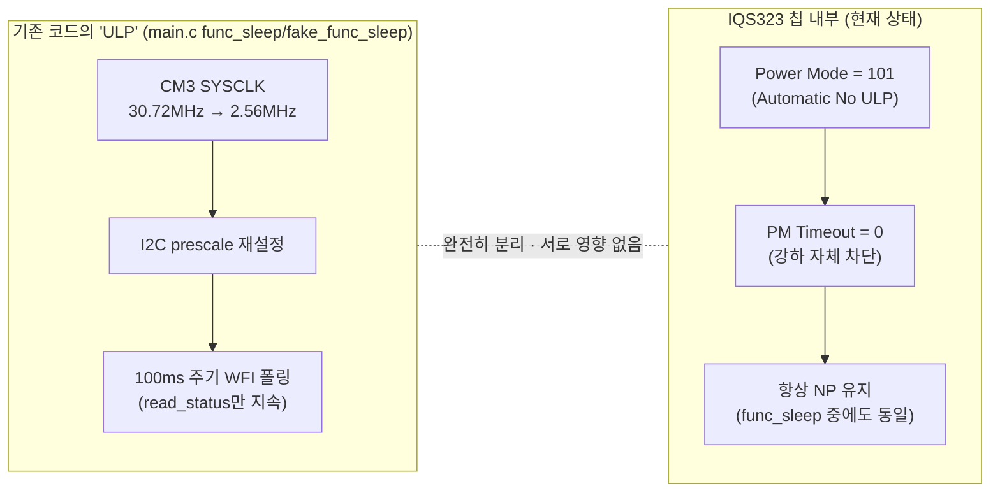
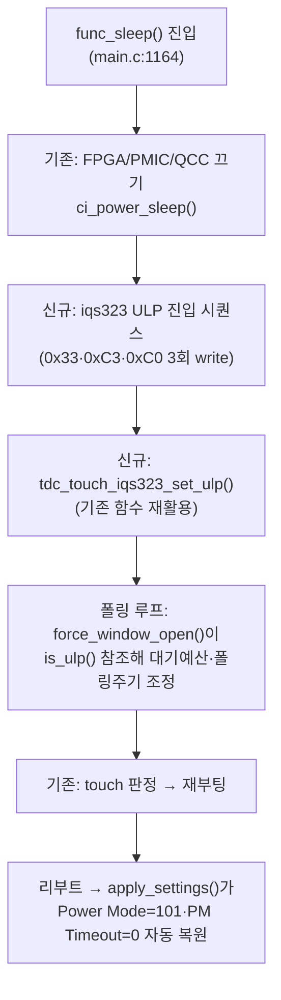

```

**TL;DR**: 은수님의 "ULP는 터치 발생시에만 통신 가능, 평상시 I2C 통신 실패" 가설을 데이터시트 원문(§8.13·§5.2·§5.3)과 실제 코드로 정면 판정한 결과 **틀림**. Force Communication은 파워모드와 무관하게 항상 동작(Halt 탈출에도 사용되는 것이 원문 근거)하고, Sound1은 애초에 Streaming 인터페이스라 터치 무관하게 주기적으로 통신 창이 열린다. 실제 위험은 다른 곳에 있다 — ULP의 실제 리포트 주기가 Auto Prox Cycle Select(기본값 32배)에 가려져 SW의 45ms/100ms 타임아웃 가정보다 훨씬 느려질 수 있고, 이를 강제개방(Force Comm)으로 메우면 데이터시트가 명시한 I2C Lock-Up 에라타 위험이 커진다. CH0 단일채널에서도 조건부 실질 이득이 있으나 크기는 데이터시트만으로 확정 불가 — 실측 필요.

---

## 0. 선행 고지 — 그라운드 문서 부재와 대응

작업 시작 시점에 `docs/tasks/touch/20260706_touch-power-mode-np-lp-ulp/에이전트-로그/` 폴더에는 `00_오케스트레이터-입력.md`만 존재했고, 본 문서가 참조해야 할 `01_G1_*.md`·`02_G2_*.md`·`03_G3_*.md`(그라운드_1~3)는 90초 폴링 확인 결과 생성되지 않은 상태였다. 따라서 그라운드_2가 맡은 스코프(force communication의 파워모드 무관성·ULP wake-up 채널 개념·Report Rate 레지스터 확인)를 **본 문서에서 동일한 1차 자료(데이터시트 원문 PDF `pdftotext -layout` 텍스트, 실제 코드)로 직접 재검증**했다. 아래 "근거" 절은 가상의 그라운드_2 문서를 인용하는 형식이 아니라, 본 문서가 독자적으로 확인한 사실로 제시한다. 은수님이 언급한 "그라운드_2의 (a)/(c)"에 해당하는 스코프는 각각 §2(가설 정면 판정 근거)·§4(리포트 레이트 확인)에서 다룬다.

---

## 1. 요약 판정 (BLUF)

| 질문 | 판정 |
|---|---|
| 은수님 가설: "ULP는 터치 발생시에만 통신 가능, 평상시 I2C 통신 실패"가 사실인가 | **틀림** — 근거 §2 |
| Force Communication(§8.13)은 파워모드(NP/LP/ULP/Halt) 무관하게 항상 창을 열 수 있는가 | **그렇다** (Halt 탈출에도 쓰이는 것이 원문 근거) — 근거 §2.2 |
| 그럼 실제로 ULP 채택 시 SW가 대응해야 할 진짜 문제는 무엇인가 | 터치 유무가 아니라 **리포트 주기(레이턴시) 문제** — §2.4 |
| CH0 단일채널 구성에서 ULP가 LP 대비 실질 이득이 있는가 | **조건부 긍정, 크기는 미확정** — §5 |

---

## 2. 은수님 가설 정면 판정

### 2.1 가설 원문 재확인

요구사항.md §2-②: *"ULP는 터치가 발생해야 RDY가 0으로 내려가고 이때만 I2C 통신이 가능하므로, 평상시(터치 없을 때) I2C 통신이 실패한다."*

이 가설은 암묵적으로 **이벤트 모드(Event Mode)의 동작 방식**을 ULP라는 **파워 모드**에 귀속시키고 있다. 데이터시트를 직접 대조하면 이 둘은 서로 다른 축이다.

### 2.2 근거_1 — Force Communication은 파워모드 무관 (원문)

§8.13 원문(`iqs323_datasheet_layout.txt:1893-1899`):

> "Ideally, communication with the IQS323 should only be initiated in a RDY window. In event mode RDY windows are only provided when an event is reported. ... A communication request described in the figure below will force a RDY window to open. The minimum and maximum time between the communication request and the opening of a RDY window (t_wait) is application specific. The typical values of t_wait are 0.1ms ≤ t_wait ≤ 45ms."

이 문장 어디에도 "파워모드가 LP/ULP/Halt이면 force comm이 안 된다"는 조건이 없다. 오히려 §5.2 원문(`layout.txt:905-908`)이 이를 반증한다:

> "In Halt mode, the IQS323 will remain in a deep sleep state. To exit Halt Mode, **a force communications request must be made** (see Section 8.13), and the power mode must be changed in the following communications window."

Halt는 4개 모드 중 **가장 깊은 잠**(CTx 드라이버·비교기·클록 모두 off)인데, 여기서도 force comm으로 탈출이 명시되어 있다. ULP는 Halt보다 얕은 상태이므로, Halt에서 되는 것이 ULP에서 안 될 이유가 없다. **force communication은 파워모드 무관하게 항상 사용 가능하다** — 은수님 가설의 "평상시 I2C 통신 실패"는 근거가 없다.

### 2.3 근거_2 — Sound1은 애초에 Event Mode가 아니라 Streaming

가설이 그리는 그림("터치 나야 통신 가능")은 사실 §8.11.2 Event Mode의 동작이다:

> "In event mode, the RDY line will only go low once one or more enabled events is triggered, or the device is reset." (`layout.txt` §8.11.2 대응, `05_i2c인터페이스.md:308`)

그런데 실제 코드를 직접 대조하면 Sound1은 Event Mode가 아니라 **Streaming**을 쓰고 있다.

`tdc_touch_iqs323.c:318`:
```c
ok &= write_register(REG_SYSTEM_CONTROL, 0x50, 0x07);
```
`0x50` = `0b0101_0000` → **bit7(Interface Selection) = 0**. 레지스터 레퍼런스(A.30, `06_레지스터레퍼런스.md:515`): "7 | Interface Selection | 0 I²C Streaming · 1 I²C Events". 즉 **bit7=0 → Streaming**이다. 이는 `apply_settings()`의 다른 두 곳(`:447`의 `0x54`, `:453`의 `0x58`)에서도 동일하게 bit7=0으로 반복 확정된다 — 어디에서도 Interface Selection을 Events로 바꾸는 코드는 없다.

이 사실은 직전 완료작 `20260705_touch-event-mode-adoption`의 결론과도 정합한다. 그 작업의 요구사항.md는 스스로 "이벤트 모드(Interface Selection: **Streaming→Events**) 도입"을 검토 대상으로 명시했고(현재=Streaming이 전제), 계획.md는 이벤트 모드 자체 채택을 **비권고**로 확정했다(§8.11.2가 "펌웨어 권장: event mode"라고 명시함에도, I2C Lock-Up 에라타와 force_window_open 상시화 리스크 때문에 Streaming 유지 + 유휴 폴링주기 연장을 채택 권고했다).

§8.11.1 원문(Streaming 정의):

> "In I²C streaming mode data will continually be reported according to the associated power mode report rate." (`layout.txt:1838` 부근)

**Streaming은 터치 유무와 무관하게 매 리포트 주기마다 RDY가 열린다.** ULP에서도 이 성질은 그대로 유지된다 — 단지 그 주기가 NP/LP보다 길 뿐이다. 따라서 "ULP + Streaming(현재/향후 Sound1 구성)"에서는 **평상시에도 통신이 주기적으로 정상 성공**한다. 가설이 묘사하는 "터치 없으면 통신 자체가 실패"라는 현상은 이 조합에서 발생하지 않는다.

### 2.4 그렇다면 실제로 무엇이 문제인가 — 진짜 메커니즘 재구성

가설이 완전히 틀린 것은 아니고, 실제로 존재하는 문제를 잘못된 메커니즘으로 짚었다고 보는 것이 정확하다. 진짜 메커니즘은 다음 3가지가 겹친 **SW 타이밍 예산 문제**다.

**① Auto Prox Cycle Select가 ULP 리포트 주기를 은폐된 배수로 늘린다.**
§8.11.1 원문(`layout.txt:1843,1846`, 정확히 원문 그대로):
```
(Auto Prox Cycle Select × Ultra Low Power Report Rate) ms
Where Auto Prox Cycle Select is defined in the Prox Input and Control register.
```
`Auto Prox Cycle Select`는 Sensor0의 `Prox Input and Control`(주소 `0x33`) bit[3:2]에 있다(A.9, `06_레지스터레퍼런스.md:314`) — **Sound1 코드는 이 레지스터를 단 한 번도 write하지 않는다**(`tdc_touch_iqs323.c` 전체에 `0x33` 관련 `#define`·write 없음, 코드 전수 확인 완료). 따라서 POR 기본값 `0x01CF`가 그대로 유지되고, 여기서 Auto Prox Cycle Select = `11` = **32**다(A.9 표, `06_레지스터레퍼런스.md:314`). 즉 `REG_ULP_REPORT_RATE`(0xC3)에 데이터시트 예시값 160ms를 그대로 넣으면 실제 리포트 주기는 32×160ms = **5.12초**가 된다. 이는 은수님이 우려한 "통신 실패"처럼 보이는 현상(체감상 응답이 거의 없음)을 실제로 만들어낼 수 있는 진짜 원인이지만, 원인은 "터치 여부"가 아니라 **은폐된 32배 배수를 그대로 둔 설정 실수**다.

**② force_window_open()의 45ms 타임아웃은 NP 속도를 전제로 굳어 있다.**
`tdc_touch_iqs323.h:32`: `#define TDC_TOUCH_IQS323_MAX_WAIT_OPEN_MS 45` — 이 값은 §8.13의 "typical 0.1~45ms" 상한을 그대로 채택한 것으로 보인다. 그러나 그 바로 뒤 각주(`layout.txt:1899,1936`)를 원문 그대로 옮기면:
```
The typical values of t_wait are 0.1ms ≤ t_wait ≤ 45ms[i].
...
[i] Contact Azoteq for an application specific value of t_wait.
```
**"45ms"는 임의 조건의 typical 값이며, 특정 파워모드(특히 ULP)에서의 실제 t_wait는 데이터시트가 스스로 "Azoteq에 문의하라"며 확정을 피한 값이다.** 즉 현재 45ms 상수가 ULP에서도 충분한지는 **[미확인]**이고, 오히려 리포트 주기가 초 단위로 늘어난 상태(①)에서는 45ms 타임아웃이 구조적으로 부족할 가능성이 높다.

**③ 과거 LP 회귀의 메커니즘이 ULP에서 훨씬 더 크게 재현될 것이다.**
과거 S3/V3가 지목한 인과사슬 — "LP 전환 시 report rate 100ms로 RDY 윈도우가 느려져 force_window_open 45ms 폴링이 윈도우를 놓쳐 timeout 발생"(`tdc_touch_iqs323.c:320-323` 주석) — 은 정확히 위 ①·②와 같은 구조다. LP는 100ms 주기라 45ms 타임아웃과 격차가 2배 남짓이었지만, ULP는 (Auto Prox Cycle Select를 손대지 않으면) 격차가 100배 이상으로 벌어진다. **과거 진단의 메커니즘 자체는 여전히 유효하고, ULP에 그대로 적용하면 문제가 훨씬 커진다** — 단, 이것이 "ULP를 쓰면 안 된다"는 결론으로 이어지는 것이 아니라 "타임아웃 예산과 폴링 주기를 실제 IC 리포트 주기에 맞게 재설계해야 한다"는 결론으로 이어진다는 점이 과거 회귀 시점과 지금 시점의 차이다(§7에서 구체 설계).

**④ (부가 위험) I2C Lock-Up 에라타 — force comm 의존이 늘수록 위험 증가.**
Appendix C 원문(`layout.txt:3911-3919`):
> "I2C Lock Up ... In certain cases the IQS323 can enter a state in which all bytes read over I2C return a constant value. **There is a higher likelihood of this occuring when using the force communications method described in Section 8.13.**"

만약 ①·②를 고치지 않고 "느려진 리포트 주기를 force comm으로 매번 메운다"는 식으로 설계하면, force comm 호출 빈도가 급증해 이 에라타 위험을 그대로 키운다 — 이는 `20260705` 시리즈가 Event Mode 채택을 비권고한 핵심 근거와 동일한 리스크다. 에라타 영향 버전은 "IQS323-00x v1.3 이하·IQS323-A0x v1.4 이하"(`layout.txt:3912-3914`)로 명시되어 있으나, **Sound1이 실제로 어느 실리콘 리비전을 쓰는지는 코드에 Version/Hardware ID 레지스터(0x00~0x02, 0xE1) 판독 로직이 없어 [미확인]**이다 — 안전 측 가정(에라타 적용 가능)으로 설계해야 한다.

---

## 3. ULP가 실제로 가능하게 하는 것 / 제약하는 것

가설이 틀렸으므로, 요구사항이 요청한 대로 "force communication이 항상 작동한다면 ULP가 실제로 무엇을 가능/제약하는지"를 구체적으로 정리한다.

### 3.1 ULP가 가능하게 하는 것

- **평상시 통신은 그대로 성공한다** — Streaming 유지 시 정기적으로 RDY가 열리므로 터치 판정(FSM 입력)·ATI 에러 감시가 계속 동작한다. 단, 그 정기 간격이 훨씬 느려질 뿐이다.
- **적극적 전력 절감** — §3.4 원문 수치(측정조건 상이, §5 참고) 기준 ULP는 NP 대비 약 31배, LP 대비 약 9.4배 낮은 전류(4.00µA vs 125µA/37.5µA)를 시사한다.
- **터치/근접 상태 자체는 파워모드 전환과 무관하게 보존된다** — §5.2 원문: "Power mode changes do not affect the channel touch or proximity state."(`layout.txt:913-914`) → 모드를 오가도 FSM이 보는 CH0 Touch/Prox 비트의 의미가 흔들리지 않는다.
- **수동(Manual) 고정 모드 선택이 가능하다** — System Control 0xC0 bits[6:4]에 `010`을 직접 쓰면 Automatic 단계강하(NP→LP→ULP)를 기다릴 필요 없이 **즉시 ULP로 진입**할 수 있다(A.30, `06_레지스터레퍼런스.md:516`). 이는 §7에서 채택하는 핵심 설계 근거다.

### 3.2 ULP가 제약하는 것

- **응답 레이턴시가 늘어난다** — 리포트 주기가 길어지는 만큼, 터치 감지·ATI 에러 감지 모두 그 주기 단위로 지연된다(빠른 버튼 반응이 필요한 상황에는 부적합).
- **Manual(고정) 모드 선택 시 이벤트 발생해도 자동으로 NP에 복귀하지 않는다** — §5.3 원문: "While the power mode switching is set to either 'Automatic' or 'Automatic No ULP', the IQS323 will return to normal power mode ... if any events are triggered."(`layout.txt:937-939`) — 이 자동복귀는 **Automatic/Automatic No ULP 모드에서만** 작동한다고 명시되어 있다. Manual 고정 `010`을 쓰면 터치가 나도 IC가 스스로 NP로 돌아가지 않는다 — 복귀는 SW(리부트 등)가 책임져야 한다.
- **채널 타임아웃(§5.8)과 병행 불가** — 원문 각주(`layout.txt:1096-1097`): "If channel prox and touch timeouts are used then ULP mode should not be used. For automatic power mode switching set the mode to 'Automatic No ULP'." Sound1은 현재 `REG_SYSTEM_CONTROL` MSB=`0x07`로 CH0/1/2 Timeout Disable을 전부 세팅해두었다(`tdc_touch_iqs323.c:318,447,453,465,471` 전부 MSB=0x07 유지) — **채널 타임아웃을 쓰지 않으므로 이 제약은 Sound1에 걸리지 않는다.** (단, 향후 채널 타임아웃을 도입하려면 그 순간 ULP를 포기해야 한다는 트레이드오프가 생긴다.)
- **Auto Prox Cycle Select를 명시적으로 관리하지 않으면 레이턴시가 통제 불능으로 커진다**(§2.4-①).
- **force comm 의존도가 높아지면 I2C Lock-Up 에라타 위험이 커진다**(§2.4-④) — 단, 이는 폴링 주기를 IC의 실제 리포트 주기에 맞추면 회피 가능한 제약이다.

---

## 4. Report Rate 레지스터 실제 확인 (0xC1/0xC2/0xC3)

| 레지스터 | 주소 | 코드 상 현재값 | 근거 |
|---|---|---|---|
| Normal Power Mode Report Rate | 0xC1 | **미기록 (POR 기본값 0x0000 그대로)** | `tdc_touch_iqs323.c`에 0xC1 write 없음(전수 확인) |
| Low Power Mode Report Rate | 0xC2 | `0x0064` = 100ms | `:319` `write_register(REG_LP_REPORT_RATE, 0x64, 0x00)` |
| Ultra Low Power Mode Report Rate | 0xC3 | **미기록 (POR 기본값 0x0000 그대로)** | 코드에 0xC3 write 없음(전수 확인) |
| Power Mode Timeout | 0xC5 | `0x0000` (강하 자체 차단) | `:320` `write_register(REG_PM_TIMEOUT, 0x00, 0x00)` |
| Power Mode 필드(0xC0 bits[6:4]) | 0xC0 | `101` = Automatic No ULP | `:318` LSB=`0x50` → bits[6:4]=101 |

**0xC1=0, 0xC3=0이 실제로 무엇을 의미하는지는 데이터시트가 명시하지 않는다 — [미확인].** 범위표는 "0-3000"이라고만 하며 0의 특수 의미(예: "가능한 한 빠르게")를 별도로 정의하지 않는다. LP는 100ms로 명시 기록되어 있으나 `Power Mode Timeout=0`이 강하 자체를 막고 있어 **현재는 LP·ULP 모두 도달 불가능한 죽은 설정**이다(Power Mode 필드가 `101`이라 애초에 ULP는 도달 대상에서도 제외되어 있다 — 이중 차단).

---

## 5. CH0 단일채널 구성에서 ULP의 실질 이득 판정

### 5.1 데이터시트 수치와 측정조건 불일치 (재확인, 근사 전용)

§3.4 원문 수치(`01_개요·전기·타이밍.md:176-191`, 측정조건: self-cap **3채널**·Event mode·ATI Target 512·Fxfer 500kHz):

| 모드 | Report Rate | 전류(3.3V) |
|---|---|---|
| NP | 16ms | 125µA |
| LP | 60ms | 37.5µA |
| ULP | 160ms | 4.00µA |
| Halt | 3000ms | 2.00µA |

Sound1 실제 구성: **1채널**(CH0만 활성)·Fxfer **1MHz**(`tdc_touch_iqs323.c:316`)·**Streaming**(§2.3). 채널 수·주파수·인터페이스가 모두 다르므로 위 절대 수치를 그대로 쓸 수 없다 — 방향성 참고용.

### 5.2 3채널 벤치마크를 1채널로 그대로 환산할 수 없는 이유 (핵심 재검토)

§5.2 원문(`layout.txt:895-899`)이 설명하는 ULP의 가치 제안은 명확히 **다채널 차등 샘플링**이다:

> "Ultra-low power mode (ULP) ... Intended for rapid wake-up from deep sleep on a single channel ... Other sensor channels are sampled at a slower rate in order to optimize power consumption."

3채널 벤치마크의 ULP 전류(4.00µA)는 개념적으로 "빠른 wake-up 채널 1개 + 느린 나머지 채널 2개"의 합이고, LP 전류(37.5µA)는 "3채널 모두 LP 주기로 균일 샘플"의 합이다. 즉:

```
3채널 ULP = I_wakeup(빠름) + 2 × I_other(느림) = 4.00µA
3채널 LP  = 3 × I_LP(균일)                    = 37.5µA → I_LP(채널당) ≈ 12.5µA
```

Sound1은 채널이 1개뿐이라 "나머지 채널"이 존재하지 않는다 — 1채널 ULP는 `I_wakeup` 단독이고, 1채널 LP는 `I_LP(채널당)` ≈ 12.5µA 단독이다. **ULP/LP = 4.00/37.5 ≈ 0.107(약 9.4배 절감)이라는 비율을 CH0 단독 구성에 그대로 적용할 근거는 약하다** — 이 9.4배 중 상당 부분이 "다른 2채널을 늦춘 효과"에서 왔을 가능성을 배제할 수 없고, `I_wakeup` 단독의 크기는 데이터시트가 분해해서 공개하지 않는다(AZD004 참조로 미뤄져 있고 본 작업에서 AZD004는 열람하지 않음 — **[미확인]**).

### 5.3 그럼에도 방향성 있는 판단 근거

- ULP의 아키텍처 자체가 "웨이크업 채널도 짧은 버스트 샘플링 후 깊은 유휴"라는 구조를 갖는다는 것은 §8.11.1의 리포트 주기 공식(Auto Prox Cycle Select × Report Rate — burst 성격을 시사)과 §5.2의 "Halt처럼 깊게 쉬되 주기적으로만 깨는" 개념적 서술이 일관되게 뒷받침한다 — LP처럼 "계속 낮은 duty로 도는" 것과는 다른 동작 패턴일 가능성이 있다.
- Manual `010` 고정 모드로 진입하면 LP를 거치지 않고 바로 ULP로 갈 수 있어(§3.1), LP 단계에 머무는 전력 손실 없이 최저 소비 상태로 직행 가능하다.
- Halt(2.00µA)보다는 높지만 Halt는 "conversion·processing 자체가 없는" 상태(§5.2: "Deep sleep in which no conversions or processing are done")라 터치 감지 기능 자체가 없다 — ULP는 이 둘(LP의 계속 감지 vs Halt의 감지 정지) 사이의 절충점으로서 존재 의의가 있다.

### 5.4 판정

**조건부 긍정** — CH0 단일채널에서도 ULP가 LP 대비 추가 절감을 제공할 개연성은 있으나, 그 정확한 크기는 데이터시트만으로 확정할 수 없다(§5.2의 분해 불가 문제). 이는 기존 프로젝트 관행과 동일하게 **[실측 게이트]**로 남겨야 한다 — 다만 §7의 설계가 적용되는 위치(이미 CM3 자체가 최저 전력으로 내려가 있는 `func_sleep()` 구간, §6)에서는, 설령 ULP의 채널당 절감폭이 벤치마크의 9.4배에 못 미치더라도 **"항상 NP 유지"인 현재 상태 대비로는 확실한 개선**이므로, 정밀한 배수를 모른다는 이유로 채택을 미룰 필요는 없다고 판단한다.

---

## 6. 설계 전제 — 현재 "ULP"라는 이름이 이미 코드에 있다 (용어 충돌 주의)

실제 코드를 대조한 결과, **"ULP"라는 이름이 이미 Sound1 코드베이스에 존재**하지만, 이것은 IQS323 칩 내부의 전력모드가 아니라 **CM3(MCU) 자체의 절전 상태**를 가리키는 용어다. 이 둘을 혼동하면 안 되므로 명확히 구분한다.



근거(`tdc_touch_iqs323.c:497-499`, `main.c:845-846,1215-1216` 동일 취지 주석 반복):
> "절전 전용 settings는 제거됨 — 절전도 노말과 동일한 IQS323 설정(운용 임계 유지·Full ATI·PM timeout 0 → 항상 NP)을 그대로 사용한다. CM3 클럭만 ci_power_sleep(main.c)로 절감한다."

즉 **오늘의 `func_sleep()`(CM3 절전) 동안에도 IQS323 칩은 계속 NP를 유지하며 풀 전류를 그대로 소모하고 있다** — 이것이 바로 본 문서가 제안하는 설계의 여지다: CM3가 이미 최저 전력으로 내려간 바로 그 구간에, IQS323도 함께 ULP로 내리면 시스템 전체 전류를 추가로 줄일 수 있다.

`func_sleep()`(`main.c:1164`) 진입 조건 확인: `systemState.systemOff==true`(QCC 배터리 타임아웃·롱터치 등, `main.c:679-728`)이고, 탈출은 **하드 리부트**로 확인된다(`main.c:1125-` `tdc_touch_sleep_handle_touch_reboot()`, "touch detected -> reboot" 및 watchdog 경유 재부팅 패턴). **이 "탈출=리부트" 구조가 본 설계를 크게 단순화한다** — 되돌리기(undo) 로직을 따로 만들 필요 없이, 리부트 시 `tdc_touch_iqs323_apply_settings()`가 항상 다시 실행되어 Power Mode=101·PM Timeout=0 기존 기준선을 자동 복원하기 때문이다.

또한 `tdc_touch_iqs323_set_ulp()`/`clear_ulp()`/`is_ulp()`(`tdc_touch_iqs323.h:107-109`, `.c:36-52`) 함수와 `g_in_ulp_mode` 플래그가 **이미 존재하지만 현재 아무 곳에서도 의미 있게 쓰이지 않는다**("is_ulp 플래그 미사용" 주석 재확인) — 본 설계는 이 기존 플래그를 실제 용도로 되살려 쓴다.

---

## 7. 구체 SW 설계 (후보_2 제안)

### 7.1 적용 범위 — `func_sleep()`/`fake_func_sleep()` 진입 시점 한정

일반 운용(NP) 중에는 IQS323 파워모드를 건드리지 않는다. **오직 CM3가 이미 `func_sleep()`으로 진입하는 순간에만** IQS323도 ULP로 전환한다 — 이 구간은 이미 2.4초(`TDC_TOUCH_ULP_REBOOT_TOUCH_MS`) 단위의 느린 웨이크업 제스처를 전제하므로, ULP의 늘어난 레이턴시를 흡수할 여유가 이미 설계에 내재해 있다.

### 7.2 레지스터 변경표 (func_sleep 진입 시 1회 추가 기록)

| 순서 | 레지스터 | 주소 | 현재값 | 제안값 | 비고 |
|---|---|---|---|---|---|
| 1 | Sensor0 Prox Input and Control | 0x33 | `0x01CF`(POR, 미기록) | `0x01C3` | Auto Prox Cycle Select `11`(32)→`00`(4)만 변경, CRx0 enable(bit8)·Dead Time(bit6) 등 나머지 비트 보존 |
| 2 | Ultra Low Power Mode Report Rate | 0xC3 | `0x0000`(POR, 미기록) | 예: `0x0032`(50ms) | Auto Prox Cycle Select=4와 곱해 실효 주기 ≈ 200ms — **[실측 게이트]: 최종 수치 튜닝** |
| 3 | System Control | 0xC0 | LSB `0x50`/MSB `0x07` | LSB `0x20`/MSB `0x07` | Power Mode 필드만 `101`(Automatic No ULP)→`010`(Ultra Low Power **Manual 고정**)로 변경. CH Timeout Disable(MSB)·Interface Selection(bit7=Streaming) 보존 |

Power Mode Timeout(0xC5) 레지스터는 **건드릴 필요 없음** — Manual 고정 모드는 Automatic 단계강하 메커니즘 자체를 쓰지 않으므로 무관하다(§3.1 근거).

왜 `Automatic`(100) + PM Timeout 대신 `Manual 010` 고정을 제안하는가: `func_sleep()`은 이미 SW가 "지금부터 절전"이라고 명시적으로 결정한 시점이다. Automatic 단계강하는 IC가 스스로 유휴를 감지할 때까지 기다려야 하고(NP→LP→ULP 2단계, 각 PM Timeout만큼 지연), 이 지연 동안은 여전히 NP/LP 전류를 소모한다. **SW가 이미 알고 있는 사실을 IC가 다시 타이머로 재확인하게 할 이유가 없다** — 즉시 `010`을 쓰면 지연 없이 바로 최저 전력으로 진입한다.

### 7.3 코드 변경 지점 (개념적 위치, 실제 구현은 ④단계에서)



- `beta_power_settings()`와 별도로 `sleep_power_settings()`류 static 함수를 신설해 위 표 3개 레지스터만 기록 — 기존 `apply_settings()`의 Full ATI·임계값 로직은 전혀 건드리지 않는다(INV-CTRL-1 보존).
- `force_window_open()`의 `TDC_TOUCH_IQS323_MAX_WAIT_OPEN_MS` 고정 45ms를, `tdc_touch_iqs323_is_ulp()`가 true일 때 더 넉넉한 값(예: 실효 리포트 주기×1.2, §8.13 각주 문맥상 데이터시트가 권고하는 여유폭과 같은 방향)으로 분기하거나, **그보다 우선** `TDC_TOUCH_ULP_WAKE_MS`(현재 100ms 고정, `tdc_touch_time.h`) 자체를 IQS323 ULP 실효 주기와 맞먹거나 약간 긴 값으로 조정 — 이렇게 하면 애초에 force comm을 자주 부를 필요가 없어져 §2.4-④ 에라타 위험을 근본적으로 줄인다.
- (권장, 안전판) 매 I2C 트랜잭션 종료 시 존재하지 않는 레지스터 1바이트 read 후 `0xEE`가 아니면 하드 리셋 — Appendix C 원문이 명시한 워크어라운드(`layout.txt:3921-3923`)를 현재 코드가 구현하고 있지 않으므로, force comm 의존이 늘어나는 이번 변경과 함께 도입을 권고한다. (§2.4-④ 위험의 직접적 완화책)

### 7.4 변형 비교 (튜닝 자유도 제공)

| 변형 | Auto Prox Cycle Select | 실효 ULP 주기(예) | 특징 |
|---|---|---|---|
| **변형_1(보수적)** | 미변경(32, 기본값 유지) | 0xC3=50ms 가정 시 1.6초 | 레지스터 1개(0x33) 안 건드림 — 회귀 표면 최소화, 대신 레이턴시 큼 |
| **변형_2(응답성 확보, 권장)** | `4`로 축소 | 0xC3=50ms 가정 시 200ms | func_sleep의 100ms 폴링과 자릿수가 맞아 SW 재설계 부담 작음 |

최종 수치는 **[실측 게이트]** — 오실로스코프로 RDY 실제 토글 주기를 확인한 뒤 확정한다(이 프로젝트의 기존 관행과 동일한 톤).

---

## 8. 불변식(INV-CTRL-1~3) 보존 확인

| 불변식 | 보존 여부 | 근거 |
|---|---|---|
| INV-CTRL-1 (Full ATI) | **보존** | `REG_SENSOR0_ATI_SETUP`(0x36)은 본 설계에서 전혀 기록하지 않음 — 부팅 시 1회 Full ATI만 유지 |
| INV-CTRL-2 (ATI 에러→Re-ATI) | **보존(레이턴시만 증가)** | ATI Error(System Status bit6)·Events Enable(0xD3=0x52, bit6 포함)은 파워모드 무관 동작(§5.2 원문 "power mode changes do not affect ... state"와 같은 결의 근거) — 단 감지 주기가 func_sleep 구간에 한해 IQS323 리포트 주기만큼 늦어질 수 있음. 이 구간 자체가 이미 2.4초 단위 레이턴시를 전제하므로 설계 의도상 수용 가능 |
| INV-CTRL-3 (첫 터치 해제 감지) | **보존** | 본 설계는 부팅 시퀀스(`apply_settings()`)를 전혀 건드리지 않음 — func_sleep 자체의 `sleep_ignore` 게이트(`main.c:1239-1242`)도 로직 변경 없음, `TDC_TIME_TO_CNT` 매크로가 주기 변경 시 카운트를 자동 파생하므로 폴링 주기를 조정해도 디바운스 의미(ms 기준)는 그대로 유지 |

---

## 9. 미확인 목록

- ULP·Halt 모드에서의 정확한 `t_wait` 값(데이터시트가 스스로 "Azoteq 문의" 각주로 확정을 피함, `layout.txt:1936`).
- `Normal Power Report Rate`(0xC1)=0, `Ultra Low Power Mode Report Rate`(0xC3)=0의 정확한 IC 동작 의미(원문 미기재).
- ULP "wake-up 채널"과 "나머지 채널"의 정확한 내부 배분 관계 및 CH0 단독 구성에서 `I_wakeup` 단독 전류 크기(AZD004 앱노트 참조 필요, 본 작업에서 미열람).
- Streaming vs Event 인터페이스 선택이 §3.4 전류 수치 자체에 영향을 주는지(원문은 Event mode 조건에서만 측정 — Streaming에서 동일하다는 명시적 확인 없음, 센싱 엔진 duty cycle이 지배적이라는 추정만 가능).
- Sound1 실장 IQS323의 정확한 실리콘 리비전(Major/Minor Version, Hardware ID 레지스터 0x00~0x02·0xE1를 코드가 읽지 않아 I2C Lock-Up 에라타 적용 대상 여부 미확정 — 안전 측 가정으로 적용 대상 취급 권고).
- `force_window_open()`의 `i2c_write(0xFF)` 저수준 파형이 Figure 8.2(클럭 있는 정상 I2C 트랜잭션으로 재확인됨, §2.3)와 실제로 일치하는지는 상위 레이어 코드까지만 확인했고 `driver_i2c.c` 로우레벨 파형 자체는 본 작업에서 재확인하지 않음.

---

## 10. 참고 — 데이터시트 참고 마크다운 NOTE 관련 소소한 발견

`05_i2c인터페이스.md`의 §8.13 NOTE(정리자 해설)는 Force Comm을 "SCL 없이 SDA 토글 패턴"으로 묘사하나, 원문 Figure 8.2 텍스트 추출본(`layout.txt:1893-1924`)은 SCL/CLOCK 행이 명시적으로 존재하는 **정상 클럭 I2C 트랜잭션**(주소 0x44+ACK, 데이터 0xFF+ACK)으로 되어 있다. 이는 정리 문서의 해설(NOTE)이 원문보다 과장된 것으로 보이며, 오히려 이 원문 그대로 읽으면 **현재 Sound1의 `force_window_open()`(표준 `i2c_write()`로 주소+0xFF 전송)이 Figure 8.2와 정합적**이라는 점이 확인된다 — 본 작업 범위는 아니나 정리 문서 개선 시 참고할 만하다.
