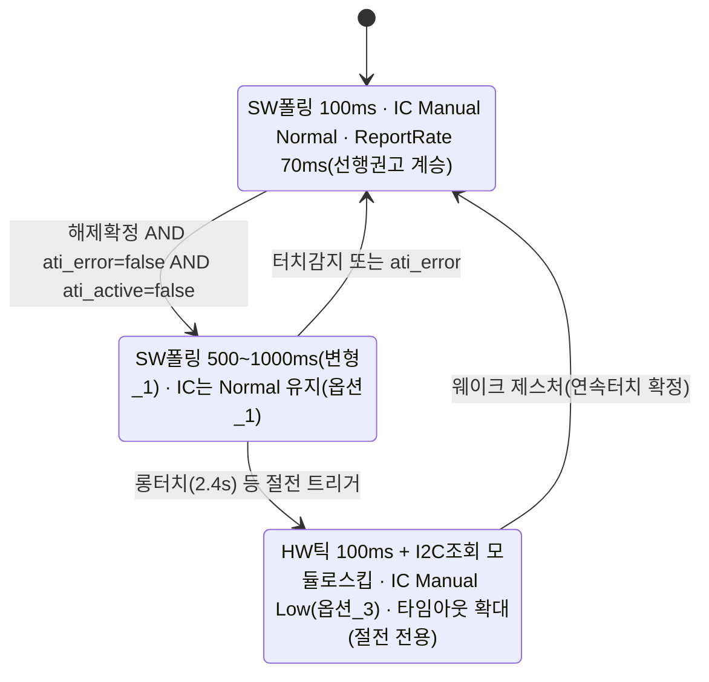

# 후보_3 — SW 폴링주기 연장과 IQS323 전력모드(NP/LP/ULP)의 관계: 대체인가 보완인가

**TL;DR**: SW 폴링주기 연장과 IQS323 자체 전력모드(NP/LP/ULP)는 서로 다른 전력원(호스트측 I2C·CM3 오버헤드 대 IC 내부 아날로그 센싱엔진 듀티사이클)을 겨냥하므로 대체가 아닌 보완 관계다. 노말모드는 실시간 오디오와 같은 루프를 공유해 SW 폴링만 늘리고 IC는 NP로 고정하되, 오디오·BLE·FPGA 전원이 꺼지는 절전모드(func_sleep)에서만 IC를 Manual Low Power로 함께 내리는 국면분리 설계를 제안한다.

---

## 0. 선행 의존성 고지 및 조사 방법

작성 시점 기준 `docs/tasks/touch/20260706_touch-power-mode-np-lp-ulp/` 폴더에는 `00_오케스트레이터-입력.md`·`요구사항.md`·`이력 및 결과.md`만 존재하고, 그라운드_1~3·후보_1(LP)·후보_2(ULP)·검증_1~4 산출물은 본 노드 작성 시점에 아직 없다. 따라서 과제가 요구한 "후보_1·2 참고"는 문서 부재로 직접 수행하지 못했고, 본 문서의 판단은 데이터시트 원문(`docs/참고/touch/iqs323_datasheet.pdf`, `pdftotext -layout` 재추출본 `docs/참고/touch/iqs323_datasheet_layout.txt` 직접 그렙)과 코드(`tdc_touch_iqs323.c`·`tdc_touch.c`·`tdc_touch_logic.c`·`tdc_touch_time.h`·`main.c` 전체 통독)를 본 노드가 독립적으로 재확인한 결과다. 그라운드_1~3·검증_1~4가 완결되면 특히 §5(과거 회귀 재구성)·§6(force communication 파워모드 무관성 전제)는 교차검증 대상임을 명시해 둔다.

선행 라운드(`20260705_touch-event-mode-adoption`)의 결론(특히 `20_C7_대안유휴폴링주기연장.md`의 후보_7 변형_1)은 이미 승인 검토 대상으로 확정된 것으로 간주하고, 본 문서는 그 위에 "IC 자체 전력모드를 추가로 활용할지"를 얹는 것이 타당한지를 검토한다.

---

## 1. 핵심 판정 — 대체 관계인가 보완 관계인가

**직답: 보완 관계다. 대체 관계가 아니다.**

두 메커니즘은 완전히 다른 전력 소비원을 겨냥한다.

| 메커니즘 | 무엇을 줄이는가 | 지배 레지스터/코드 |
|---|---|---|
| SW 폴링주기 연장(선행 후보_7 변형_1) | 호스트(CM3)측 I2C 버스 트랜잭션 수·CM3 깨어남 빈도 — `tdc_touch.c:296` 게이트 | `TDC_TOUCH_POLL_INTERVAL_MS`(SW 상수, `tdc_touch_time.h:18`) |
| IC 전력모드(NP/LP/ULP) | IQS323 내부 아날로그 센싱엔진(CTx 드라이버·비교기·Cs 충방전)의 듀티사이클 — §3.4 원문 확정 | `System Control` Power Mode 필드(0xC0 bits[6:4])·Report Rate(0xC1~0xC3) |

§3.4 전류소비표(원문 p.11, `docs/참고/touch/데이터시트/01_개요·전기·타이밍.md:176~191`, 본 노드 재확인)는 자체가 **"Interface Selection: Event mode"로 고정된 시험조건**에서 측정됐다(선행 `06_C3_ReportRate결합.md` §1.2가 이미 확인). 그런데도 Report Rate가 16ms(NP)→60ms(LP)→160ms(ULP)로 느려질수록 전류가 125µA→37.5µA→4.00µA로 정확히 비례해 줄어든다. 통신 인터페이스(호스트가 얼마나 자주 읽는가)가 고정된 채인데 전류가 이렇게 갈린다는 것은, **호스트의 읽기 빈도(SW 폴링)와 IC 내부 변환 주기(Report Rate)가 서로 독립된 축**이라는 뜻이다. 호스트가 아예 한 번도 읽지 않아도 IC는 설정된 Power Mode·Report Rate대로 계속 충전-전달 사이클을 돌며 전력을 소비한다.

따라서 은수님이 예시로 드신 두 경우를 직접 비교하면:

- **SW 폴링만 늘리고 IC는 NP 고정**: 호스트측 오버헤드만 줄어든다. IC 자체는 §3.4 기준 NP 전류(우리 1채널 구성 정확한 수치는 [미확인], 그라운드_1 소관)를 24시간 그대로 소비한다.
- **IC도 LP/ULP로 내려가게 함**: §3.4 원문이 확정하는 대로 IC 자체 전류가 NP 대비 최대 30배 이상(참고조건 기준 NP:LP≈3.3:1, NP:ULP≈31:1, NP:Halt≈62.5:1 — 3채널·500kHz 조건, 우리 1채널·1MHz 구성의 정확한 비율은 [미확인]) 줄어든다. 이 폭이 SW 폴링 절감(선행 라운드가 정량화한 것은 어디까지나 "초당 트랜잭션 수" 감소이지 IC 자체 µA 감소가 아니었다)보다 원리적으로 훨씬 크다.

**즉 전력효율 자체는 "IC도 함께 내리는 쪽"이 명백히 더 좋다.** 다만 그것이 SW 폴링 연장을 대체하지 않는다 — 오히려 두 정책은 각자의 영역에서 독립적으로 계속 유효하며, **"회귀 없이 가능한가"와 "국면(노말/절전)에 따라 실익이 다른가"** 가 실제 설계를 좌우한다(§5~§8).

---

## 2. 용어 정정 — 코드 내 "ULP"는 두 가지 완전히 다른 대상을 가리킨다

과제의 은수님 가설("ULP는 터치 발생 시에만 통신 가능")과 이번 딥다이브 전체를 다루기 전에, 반드시 짚어야 할 명칭 충돌이 코드에 있다.

| 명칭 | 실체 | 근거 |
|---|---|---|
| **IQS323 IC의 ULP** | IQS323 레지스터 `System Control` Power Mode 필드의 한 값(010, Ultra Low Power) — 칩 내부 아날로그 센싱 전력모드 | 데이터시트 §5.2·5.3, A.30 |
| **코드의 "절전 ULP"/`func_sleep()`** | CM3·오디오 FPGA·BLE·QCC·PMIC를 대부분 꺼버리는 **시스템 전체 절전 상태**. `tdc_touch_iqs323_set_ulp()`/`is_ulp()` 플래그, `TDC_TOUCH_ULP_WAKE_MS` 등 이름에 전부 "ULP"가 들어가지만 **IQS323 레지스터와 무관** | `main.c:1164~1252`(`func_sleep()`), `tdc_touch_time.h:36~49` 주석 "(B) 절전 ULP" |

직접 재확인한 근거: `tdc_touch_iqs323_set_ulp()`(`tdc_touch_iqs323.c:41~44`)는 정의만 있고 **호출부가 코드 전체에서 0건**이다(`grep -rn tdc_touch_iqs323_set_ulp` 전수 검색 결과, 정의 자체와 헤더 선언만 매치). `tdc_touch_iqs323_is_ulp()`도 호출부 0건. `tdc_touch_iqs323_clear_ulp()`만 `apply_settings()`(`tdc_touch_iqs323.c:458`)에서 부팅 시 1회 호출된다. 즉 **`g_in_ulp_mode` 플래그 전체가 죽은 코드**다 — 과거(선행 회귀 이력) 어떤 설계의 잔재로 추정되나 현재는 IQS323의 실제 전력모드를 전혀 반영하지 않는다. `beta_power_settings()`(`tdc_touch_iqs323.c:309~325`) 자체 주석도 이를 확인한다: "절전 전용 settings는 제거됨 — 절전도 노말과 동일한 IQS323 설정... 그대로 사용한다. CM3 클럭만 `ci_power_sleep()`(`main.c`)로 절감한다."(`tdc_touch_iqs323.c:497~499`)

**함의**: 코드의 "절전(ULP) 모드"는 현재 IQS323 자체 전력모드를 전혀 건드리지 않는다 — CM3 클럭만 30.72MHz→2.56MHz로 낮추고(`main.c:1218`), IQS323은 노말모드와 똑같이 항상 NP로 유지된 채 100ms마다 폴링당한다(`func_sleep()` 루프, `main.c:1228~1249`). 은수님 가설의 "ULP는 터치 시에만 통신 가능"은 **IC 레지스터 ULP**를 가리킨 것으로 이해되며, 이는 후보_2의 정밀 검증 대상이다. 본 문서는 두 "ULP"를 섞지 않도록 이하 IC 레지스터 값은 항상 "Power Mode=ULP"로, 시스템 절전은 "절전모드"/"func_sleep()"으로 구분해 부른다.

---

## 3. 현재 코드 상태 — 직접 재확인한 사실

| 항목 | 현재 값/상태 | 근거 |
|---|---|---|
| Power Mode 필드(0xC0 bits[6:4]) | **101 = Automatic No ULP** (선택은 되어 있음) | `beta_power_settings()`, `tdc_touch_iqs323.c:318` `write_register(REG_SYSTEM_CONTROL, 0x50, 0x07)` |
| Power Mode Timeout(0xC5) | **0x0000** — 강하 자체를 원천 차단 | `tdc_touch_iqs323.c:320` `write_register(REG_PM_TIMEOUT, 0x00, 0x00)` |
| CH0~2 Timeout Disable(0xC0 bits[10:8]) | **전 채널 disable**(MSB=0x07) | 0xC0 write 6곳(237·318·447·453·465·471) 전부 MSB=0x07 |
| NP Report Rate(0xC1) | **미기록 — POR 기본값 0x0000 그대로 방치** | `tdc_touch_iqs323.c` 전체에 `0xC1`/`REG_NP_REPORT_RATE` 정의·참조 0건(grep 확인) |
| LP Report Rate(0xC2) | 0x0064=100ms로 기록되어 있으나 **죽은 값**(PM Timeout=0이 LP 도달 자체를 막음) | `tdc_touch_iqs323.c:319`, 선행 `06_C3_ReportRate결합.md` §3.2가 이미 확인한 사실 재검증 |
| ULP Report Rate(0xC3) | 미기록, POR 기본값 0x0000 | 코드 내 참조 0건 |
| Interface Selection(0xC0 bit7) | **0 = Streaming** (전 6곳 write 모두 bit7=0) | 선행 `20_C7...md` §1이 이미 확인, 본 노드 재검증 |

**핵심 관찰**: "Automatic No ULP"가 이미 선택되어 있다는 것은, 이 설계가 애초에 자동 강하를 의도했었다는 뜻이다. 그런데 `PM Timeout=0`이 §5.3 원문("`Power Mode Timeout`='0x00'이면 power mode 미강하", `02_proxfusion동작.md:122`, 원문 재확인)대로 그 강하 자체를 완전히 무력화해, 결과적으로 "수동 Normal 고정"과 기능적으로 동일한 상태가 되어 있다. 즉 **현재 상태는 "IC 전력모드를 아예 안 쓰기로 결정한 상태"가 아니라 "쓰려고 배선은 해뒀는데 안전핀을 뽑아둔 상태"**에 가깝다.

또한 §5.8 각주("채널 prox/touch timeout 사용 시 ULP 모드 금지, Automatic No ULP 강제")는 CH Timeout이 **이미 전부 disable**되어 있는 우리 구성에는 해당하지 않는다 — 이 특정 제약은 ULP 채택을 막는 근거가 되지 못한다. ULP의 실제 제약은 §5.2의 "wake-up 채널 + 나머지 채널" 구조가 CH0 단일채널 구성에 어떻게 적용되는지(그라운드_2 소관, [미확인])다.

---

## 4. 과거 회귀의 재구성 — 정확한 인과사슬 가설

`beta_power_settings()` 주석(`tdc_touch_iqs323.c:320~323`) 원문: "PM timeout 0 = 자동 강하 차단 → 노말 운용 중 NP 유지. (LP 전환 시 report rate 100ms 로 RDY 윈도우가 느려져 force_window_open 45ms 폴링이 윈도우를 놓쳐 timeout 발생. 터치=이벤트→NP 복귀로 회복되던 증상의 근본 차단. DS §5.3)"

이 진단을 무비판적으로 재인용하지 않고, 지금 시점 이해로 인과사슬을 직접 재구성한다.

1. **`force_window_open()`이 실제로 하는 일**(`tdc_touch_iqs323.c:145~175`): RDY가 이미 열려 있으면 즉시 반환. 아니면 `i2c_write(&force_comm, 1)`로 **정상 주소지정 I2C 쓰기**(`i2c_startWriteData(TDC_TOUCH_IQS323_SLAVE_ADDR, ...)`, `tdc_touch_iqs323.c:155`)로 값 `0xFF` 1바이트를 전송하고, `TDC_TOUCH_IQS323_MAX_WAIT_OPEN_MS`(=45ms, `tdc_touch_iqs323.h:32`) 동안 RDY를 폴링한다.
2. **이것은 §8.13(진짜 Force Communication)이 아니다.** §8.13 원문(`05_i2c인터페이스.md:394~446`, 본 노드가 raw txt로 재확인)은 "SCL 없이 SDA만 특정 패턴으로 토글"하는 클럭리스 웨이크업 시퀀스를 규정한다 — START 조건도, 주소지정도 없는 하드웨어 트릭이다. 반면 코드가 실제로 보내는 것은 표준 I2C START+주소+데이터(0xFF)+STOP이며, 이는 오히려 §8.9(Terminate Communication)의 "`Stop Bit Disable` 상태에서 window를 닫는 0xFF 종료 커맨드"와 형태가 더 가깝다. **함수 이름(`force_window_open`)이 의도한 것과 실제 프로토콜이 정확히 일치하는지는 [미확인]** — 이는 G2·V2("force communication의 파워모드 무관성 판정")의 핵심 판정 대상과 직결되므로 본 노드가 확정하지 않고 교차검증을 명시 요청한다.
3. **그럼에도 45ms라는 상수의 유래**: `TDC_TOUCH_IQS323_MAX_WAIT_OPEN_MS=45`(`tdc_touch_iqs323.h:32`)는 §8.13 원문 "typical values of twait are 0.1ms ≤ twait ≤ 45ms"(재확인)의 **상한값과 정확히 일치**한다. 즉 이 45ms는 §8.13이 규정하는 "웨이크업 요청 후 응답 지연"을 코드에 그대로 옮긴 값으로 보인다.
4. **재구성한 가설**: §8.13의 twait(0.1~45ms) 스펙은 Azoteq가 어떤 Report Rate 조건에서 측정했는지 원문에 명시가 없다(§8.13은 "application specific... contact Azoteq"라고만 함, `05_i2c인터페이스.md:445` 재확인). 만약 실제 웨이크업 응답 지연이 **현재 설정된 Report Rate 자체에 비례**(즉 "다음 예정된 내부 변환 타이밍까지 기다려야 응답"하는 구조)한다면, Report Rate가 45ms보다 느린 값(과거 LP의 100ms)으로 설정된 순간 twait의 실측값이 45ms를 넘어설 수 있고, 이것이 정확히 코드 주석이 서술하는 "45ms 폴링이 윈도우를 놓쳐 timeout" 현상과 일치한다.
5. **이 재구성이 맞다면 함의는 크다**: 과거 회귀의 근본원인은 "LP/ULP라는 전력모드 자체"가 아니라 **"SW의 고정 45ms 타임아웃과 IC의 실제 Report Rate 값 사이의 불일치"**다. 즉 회귀는 "저전력 모드를 쓰면 무조건 깨짐"이 아니라 "저전력 모드의 Report Rate가 SW 타임아웃보다 느릴 때만 깨짐"이라는, 훨씬 좁고 다루기 쉬운 조건이다.

> [!IMPORTANT]
> 본 절 전체는 본 노드의 **독립 재구성이며 실측으로 확정되지 않았다**. 그라운드_3(과거 회귀 정밀 재구성)·검증_2(force communication 파워모드 무관성)·검증_3(과거 회귀 재현여부)의 결론이 나오면 반드시 대조해야 한다. 특히 2번(force_window_open의 실제 프로토콜 성격)은 본 노드가 코드를 읽고 발견한 사실이지 데이터시트가 직접 진술한 것이 아니므로, 할루시네이션 감사(검증_4) 대상으로 명시해 둔다.

이 재구성이 옳다면, 설계 원칙은 "Report Rate를 SW 타임아웃보다 항상 여유 있게 빠르게 유지"가 되며, 이는 선행 `06_C3_ReportRate결합.md`가 이미 NP 국면에 대해 제안한 "0xC1=70ms(<SW 폴링 100ms)" 원칙과 정확히 같은 논리를 저전력 국면에도 그대로 확장하는 것이다(§7 참조).

---

## 5. 국면 구분이 설계를 좌우한다 — 노말모드와 절전모드는 실시간 제약이 다르다

`tdc_touch_process()`(정상 폴링)와 `func_sleep()`(절전 폴링)는 같은 IQS323을 다른 실시간 제약 아래서 폴링한다. 이 차이가 "IC 전력모드를 내려도 안전한가"의 답을 국면마다 다르게 만든다.

### 국면_1 — 노말모드 (`tdc_touch_process()`, `main.c:452`)

직접 재확인: `main.c:437`의 `while(1)`이 열리고 `main.c:739`("끝, while" 주석)에서 닫힌다. 이 **동일한 루프 한 iteration 안에** `tdc_touch_process()`(:452), `systemControl()`(:492), `isd_interface()`(:506), `bleCommunication()`(:515), `stimulation_IndicatorOut()`(:517) 등 오디오/자극/BLE 실시간 처리가 전부 들어있고, 맨 끝에 `SYS_WAIT_FOR_INTERRUPT`(:738)가 있다. 즉 **터치가 유휴여도 오디오·자극·BLE 처리는 매 iteration 계속 돈다** — "터치 유휴"가 "시스템 유휴"를 의미하지 않는다.

`write_register()`/`read_register()`는 `force_window_open()` 실패 시에도 최대 `MAX_WAIT_OPEN_MS`(현재 45ms) 동안 **블로킹**한다(`tdc_touch_iqs323.c:161~174`). 이 블로킹은 같은 루프 안의 오디오/BLE/자극 처리를 지연시킨다. **이 상한을 국면_1에서 함부로 늘리면, 터치와 무관한 실시간 처리(오디오 등)가 매 폴링마다 최대 그 값만큼 지연될 위험이 생긴다** — 45ms는 이미 존재하는 위험이고 늘리지 않는 한 커지지 않지만, 만약 LP Report Rate를 300~500ms대로 설정하고 그에 맞춰 타임아웃도 늘리면 이 루프의 최악 지연이 수백 ms까지 커질 수 있다.

### 국면_2 — 절전모드 (`func_sleep()`, `main.c:1164~1252`)

직접 재확인: `func_sleep()` 진입 시 다음이 순차 실행된다(모두 본 노드가 직접 읽은 코드) —

- `write_FPGA_reset()`(:1193) — 오디오 FPGA 리셋
- `ResetNRF(); NRF_Off_Command();`(:1197~1198) — BLE 라디오 끔
- `snd_qcc_set_mode(SND_QCC_MODE_SHUTDOWN);`(:1199) — QCC(오디오 코덱/제어) 셧다운
- `Sys_GPIO_Set_Low(DIO_PIN_INDEX_for_FPGA_SLEEP);`(:1200) — FPGA sleep 핀 로우
- `OnOff_3V_PMIC_CM3_to_CFX(false);`(:1201) — **3.3V/1.2V 전원레일 자체를 차단**
- `ci_power_sleep();`(:1218) — CM3 클럭 30.72MHz→2.56MHz

이후 진입하는 루프(`main.c:1228~1249`)는 `SYS_WAIT_FOR_INTERRUPT`(:1230) → 워치독 리프레시 → 터치 read → 4개 카운터 헬퍼 호출뿐이다. **오디오·자극·BLE·FPGA가 물리적으로 꺼져 있으므로, 이 루프에서 I2C 블로킹이 수백 ms로 늘어나도 지연시킬 실시간 작업 자체가 없다.** 유일하게 지켜야 할 제약은 워치독이다 — 코드 주석이 명시한 워치독 한계는 3.28초(`tdc_touch_time.h:53` 인접 서술, `main.c:1231` 주석 "워치독 3.28s 대비")이며, `read_register()`가 내부적으로 `force_window_open()`을 2회(주소 write + 데이터 read) 호출하므로 최악 블로킹은 `2 × MAX_WAIT_OPEN_MS + 2 × MAX_WAIT_CLOSE_MS`다. 타임아웃을 500ms로 늘려도 최악 약 1.04초로 3.28초 워치독 대비 충분한 여유가 있다.

**결론**: IC 전력모드를 내리기 위해 필요한 "타임아웃 여유 확대"라는 대가를 안전하게 치를 수 있는 국면은 **국면_2(절전)뿐**이다. 국면_1(노말)은 오디오 실시간성 때문에 이 대가를 치르기 어렵다 — 그런데 공교롭게도 국면_2가 바로 그라운드_1이 정량화할 절전 시 IC 자체 전류의 상대적 비중이 가장 큰 곳이기도 하다(오디오·BLE·FPGA가 다 꺼져 있으니 터치 IC가 남은 몇 안 되는 활성 소비원 중 하나가 된다). **국면 구분이 "어디서 이득이 큰가"와 "어디서 안전한가"를 같은 방향으로 가리킨다** — 이것이 본 문서의 핵심 설계 근거다.



---

## 6. 설계 스펙트럼 — 옵션_1/2/3

낮은 결합도부터 높은 결합도 순으로 세 옵션을 제시한다. 세 옵션 모두 SW-only, HW 무수정.

| 구분 | 옵션_1(SW 전용) | 옵션_2(Automatic 유지+타임아웃만 정합) | 옵션_3(수동 동기 전환) |
|---|---|---|---|
| SW 폴링주기 | 변수화(선행 변형_1 그대로) | 변수화(동일) | 변수화(동일) |
| IC Power Mode 필드 | 손대지 않음(현재 101 유지, PM Timeout=0 유지) | 101(Automatic No ULP) 유지, **PM Timeout을 0이 아닌 값으로 변경** | SW 유휴/활성 FSM이 **000(Normal)/001(Low) 명시 전환**을 직접 커맨드 |
| 강하 판단 주체 | 해당 없음(항상 NP) | **IC 자체 내부 타이머**(PM Timeout 경과) | **SW FSM**(폴링주기 전환과 같은 엣지) |
| 두 타이머 동기화 | 필요 없음(IC는 항상 NP) | 필요 없음 — 단, IC 자체 타이머와 SW 유휴판정이 서로 다른 시계이므로 **위상은 어긋날 수 있음**(§4의 재구성이 맞다면 이 어긋남 자체는 무해 — 관건은 Report Rate<타임아웃 여유뿐) | **원천 제거**(SW가 유일한 판단 주체) |
| IC측 절전 이득 | 없음 | 있음(§3.4 규모) | 있음(§3.4 규모, 동일) |
| 구현 복잡도 | 최소(선행 라운드가 이미 승인 검토 중) | 낮음(레지스터 값 1~2곳 변경) | 중간(SW 상태전이마다 0xC0 write 추가) |
| §4 재구성이 틀렸을 때 리스크 | 없음(IC 미변경) | 중간(원인이 재구성과 다르면 재발 가능) | 낮음(SW가 매번 명시 커맨드하므로 "방치된 자동전환"류의 재발 경로가 없음) |

**옵션_2와 옵션_3의 실질적 차이**는 "누가 유휴를 판정하는가"다. 옵션_2는 IC의 내부 타이머(PM Timeout)에 강하 판단을 맡기고 SW는 그저 Report Rate·타임아웃 여유만 맞춰준다 — 구현은 더 간단하지만, IC의 "마지막 이벤트로부터 경과"와 SW의 "마지막 터치로부터 경과"가 물리적으로 다른 오실레이터를 기준으로 흐르는 **두 개의 독립 시계**라는 점에서, 선행 라운드 검증_2(V2)가 Report Rate 논의에서 이미 지적한 "에일리어싱" 유형의 우려가 구조적으로 남는다(다만 §4 재구성이 맞다면 이 어긋남 자체는 무해하고, 관건은 Report Rate가 타임아웃보다 항상 빠른가 뿐이다). 옵션_3은 SW가 유일한 유휴 판정자이므로 이 우려가 원천적으로 없다 — 대신 SW 상태전이 지점마다 `0xC0` write를 추가해야 하는 코드 변경이 늘어난다.

**본 노드 권고**: 국면_2(절전)에는 **옵션_3**을 1순위로 권고한다 — 절전모드는 이미 자체 4-카운터 상태머신(`func_sleep()`)을 갖고 있어 "유휴/활성 전환"이라는 개념이 이미 SW 쪽에 존재하므로, 그 판단에 IC 커맨드를 얹는 자연스러운 확장이다. 구현 여력이 부족하면 옵션_2(PM Timeout을 절전 진입 시점에만 유효한 값으로 조정 + 타임아웃 여유 확보)도 유효한 대안이다. 국면_1(노말)에는 §5의 실시간 제약 때문에 **옵션_1만 권고**한다(§7에서 근거 반복).

---

## 7. 국면별 권고 매핑 (구체 값 제안 — 실측 게이트 명시)

| 국면 | SW 폴링 | IC Power Mode | Report Rate | 타임아웃(`MAX_WAIT_OPEN_MS`) |
|---|---|---|---|---|
| 국면_1 활성(터치중/직후) | 100ms(불변) | Normal 고정(불변) | NP=70ms(선행 `06_C3` 제안 계승, [실측 게이트]) | 45ms(불변) |
| 국면_1 유휴 | 500~1000ms(선행 변형_1) | **Normal 유지 — 내리지 않음** | 해당 없음 | 45ms(불변) |
| 국면_2 절전 진입 | HW틱 100ms 고정(선행 §2.5 근거 계승) + I2C 조회 모듈로스킵 | **Manual Low(001)로 명시 전환** | LP=300~400ms대 제안([실측 게이트], SW 유효조회주기보다 여유 있게 빠르게 — §4 재구성 원칙 계승) | **절전 전용으로 확대**(예 500ms선, §5의 워치독 여유 계산 근거) |
| 국면_2 웨이크 감지 | 즉시 100ms 정상화 | **즉시 Manual Normal(000)로 복귀** | 해당 없음 | 즉시 45ms 정상화 |

국면_1 유휴에서 IC를 내리지 않는 이유는 §5에서 논증한 대로다 — 국면_1은 오디오/자극이 같은 루프에서 계속 도는데, IC를 LP로 내리려면 타임아웃 여유도 함께 늘려야 하고(§4 재구성), 그 확대된 타임아웃이 실시간 처리를 지연시킬 위험을 감수해야 한다. 국면_1에서 얻을 수 있는 IC측 절전 이득 자체도 [미확인](그라운드_1의 절대수치 필요)이라, 이 트레이드오프를 감수할 근거가 아직 없다.

### 7.1 구현 스케치 (분석 단계 — 코드 변경 미착수)

```c
/* tdc_touch_iqs323.c 상단, 기존 REG_LP_REPORT_RATE 인접 */
#define REG_NP_REPORT_RATE 0xC1 /* 신규 — 선행 06_C3 제안과 동일 위치 */

/* 절전 진입 시(func_sleep 초입, main.c) 1회 */
write_register(REG_SYSTEM_CONTROL, 0x10, 0x07); /* bits[6:4]=001 Manual Low, CH Timeout Disable 유지 */
write_register(REG_LP_REPORT_RATE, /* 예 0x90,0x01=400ms */ 0x90, 0x01);

/* 웨이크 감지 시(터치 확정, main.c 절전 루프 내) */
write_register(REG_SYSTEM_CONTROL, 0x00, 0x07); /* bits[6:4]=000 Manual Normal 복귀 */
```

0x10(Manual Low)·0x00(Manual Normal) 값은 기존 코드의 0x50(101, Automatic No ULP, `tdc_touch_iqs323.c:318`)·0x54(Re-ATI 트리거 포함, `:447`)와 같은 비트 배치 원칙(bits[6:4]=모드, MSB=0x07 CH Timeout Disable 유지)을 그대로 따른 것으로, 기존 0x50 값과 교차검산해 정합성을 확인했다(101→0x50, 001→0x10, 000→0x00, 계산 일관).

---

## 8. 새로 발견한 부가 회귀위험 — 폴링횟수 기반 매크로 2건

선행 `20_C7_대안유휴폴링주기연장.md` §2.5는 **절전모드(func_sleep) 4개 카운터**가 전부 "ms 경과"가 아니라 "폴링 횟수"를 센다는 것을 발견하고 안전성을 논증했다. 본 노드는 같은 문제가 **노말모드 FSM(`tdc_touch_logic.c`)에도 별도로 2건** 있음을 발견했다 — 선행 문서가 다루지 않은 범위다.

직접 재확인(`tdc_touch_time.h`·`tdc_touch_logic.c` 전체 grep):

| 매크로 | 정의 | 실제 사용 방식 | 폴링주기 변수화 시 영향 |
|---|---|---|---|
| `TDC_TOUCH_RE_ATI_COOLDOWN_CNT` | `tdc_touch_time.h:29~30` | **미사용**(사용처 0건) — 실제 로직(`tdc_touch_logic.c:160`)은 `TDC_TOUCH_RE_ATI_COOLDOWN_MS`를 `now_ms`에 직접 더하는 **타임스탬프 방식**이라 폴링주기 변화에 자동 안전 | 영향 없음 |
| `TDC_TOUCH_READ_FAIL_HOLD_CNT` | `tdc_touch_time.h:26,31~32` | **사용됨**(`tdc_touch_logic.c:100`) — `read_fail_cnt`를 매 호출 1씩 증가시켜 이 상수(컴파일타임 20, `TDC_TOUCH_POLL_INTERVAL_MS=100` 기준)와 비교하는 **순수 횟수 카운트** | 유휴 폴링이 1000ms가 되면 "20회 연속 실패"의 실제 경과시간이 2000ms→20000ms(10배)로 늘어남 |
| `TDC_TOUCH_BOOT_RELEASE_DEBOUNCE_CNT` | `tdc_touch_time.h:27,33~34` | **사용됨**(`tdc_touch_logic.c:127`) — 부팅 직후 `boot_ignore` 구간 전용 연속 not-pressed 카운트 | 부팅 직후에만 발생하는 구간이라 유휴 저속폴링과 시간상 겹치지 않는 한 무해 |

`READ_FAIL_HOLD_CNT`가 실질적 위험이다 — 이 카운트가 참조하는 `TDC_TOUCH_POLL_INTERVAL_MS`는 **컴파일타임 상수**인데, 선행 변형_1은 이 값을 **런타임 변수**(유휴 500~1000ms/활성 100ms)로 바꾸자는 제안이다. 컴파일타임에 20으로 굳어진 카운트를 런타임 가변 주기와 비교하면, 매크로 이름이 암시하는 "2000ms"라는 의미가 실제 유휴 구간에서는 최대 10배(20000ms)까지 늘어난다. 유휴 상태(터치 없음이 전제) 자체에서는 사용자 체감 피해가 적지만, **막 유휴에 진입한 직후 read 실패가 몇 차례 겹친 상태에서 실제 터치가 들어오면, 그 터치가 hold 구간 동안 `pressed` 판정 자체가 보류돼 최대 수 초까지 인지가 늦어질 수 있다**(§4의 force_window_open 실패 확률과 결합해 악화될 수 있는 지점).

> [!IMPORTANT]
> **필수 보완 권고**: `TDC_TOUCH_READ_FAIL_HOLD_CNT`를 폴링횟수 비교에서 `re_ati_cooldown_until_ms`와 동일한 **타임스탬프 방식**(`read_fail_since_ms` 같은 필드 도입, `now_ms - read_fail_since_ms >= TDC_TOUCH_READ_FAIL_HOLD_MS`)으로 리팩터링해야 한다. 이는 선행 변형_1 채택 여부·본 문서의 IC 전력모드 채택 여부와 **무관하게, SW 폴링주기를 런타임 변수화하는 순간 필요해지는 선행 조건**이다. `RE_ATI_COOLDOWN_CNT`처럼 미사용 죽은 매크로는 유지보수 부담이므로 함께 제거를 권고한다.

---

## 9. 3대 불변식 자체평가

| 불변식 | 옵션_1(국면_1 유휴) | 옵션_3(국면_2 절전) |
|---|---|---|
| INV-CTRL-1(Full ATI) | 무손상 — ATI 레지스터(0x36) 미접촉 | 무손상 — 동일 근거. §5.3 원문("전력 모드 변경은 채널 touch/prox 상태에 영향 없음")이 모드 전환과 ATI 무관성을 뒷받침 |
| INV-CTRL-2(ATI에러→Re-ATI) | 무손상, 선행 라운드가 이미 수용한 지연(≤500~900ms)만 적용 | 무손상이나 **탐지 지연이 SW 유휴주기+IC Report Rate로 복합**될 수 있음(§4·§7) — Re-ATI 호출 자체는 여전히 보장되므로 위반은 아니고 반응속도 저하 |
| INV-CTRL-3(첫 터치해제 감지) | 무손상(선행 라운드 근거 계승) | 무손상 — 단 §8의 `READ_FAIL_HOLD_CNT` 보완이 선행되지 않으면 read 실패 누적 시 인지 지연이 이론상 늘어날 수 있어, §8 보완을 INV-CTRL-3 안전성의 전제조건으로 명시 |

---

## 10. 후보_1·2에 대한 조건부 의존성

- **후보_1(LP 활용 시나리오)과 겹치는 부분**: 본 문서 §7의 국면_2 LP 채택 제안은 후보_1이 별도로 도출할 Report Rate 구체값·회귀 방지책과 **반드시 교차검증**해야 한다. 특히 §4의 "타임아웃-Report Rate 정합" 원칙이 후보_1의 결론과 다르면 본 문서의 국면_2 권고를 재검토해야 한다.
- **후보_2(ULP 활용 시나리오, 은수님 가설 검증)와 겹치는 부분**: 본 문서는 ULP를 국면_2의 "2차 검토" 대상으로만 남겨뒀다(§3의 §5.8 채널타임아웃 비저촉 확인 외에는 깊이 들어가지 않음). 후보_2가 은수님의 "ULP는 터치 시에만 통신 가능" 가설을 검증한 결과, 만약 force communication이 실제로 파워모드 무관하게 창을 열 수 있음이 확정되면(검증_2 최우선 판정), 본 문서 §6의 옵션_3을 ULP까지 확장하는 것을 재검토할 가치가 있다 — 다만 §3.4의 ULP 전류(4.00µA 참고조건)가 LP(37.5µA) 대비 추가로 약 9배 더 낮다는 점에서, 국면_2에 한해 ULP는 LP보다 더 큰 잠재이득을 가진 후속 검토 대상이다.

---

## 11. 미확인·리스크 목록

| 항목 | 상태 |
|---|---|
| 우리 실제 구성(1채널·1MHz)에서 NP/LP/ULP 절대 전류값 | **[미확인]** — §3.4는 3채널·500kHz 참고조건. 그라운드_1 소관 |
| `force_window_open()`의 0xFF 전송이 §8.13 진짜 Force Comm과 동등하게 작동하는지, 파워모드 무관하게 창을 여는지 | **[미확인]** — §4에서 §8.9(종료커맨드)와의 형태적 유사성만 발견. 그라운드_2·검증_2 최우선 판정 대상 |
| Report Rate=0(POR 기본값)의 정확한 의미 | **[미확인]** — 부록 A 전체에 전용 비트필드 설명 없음(선행 `06_C3` §4.3·§7이 이미 확인한 게이트, 본 문서도 동일 결론) |
| §4의 "twait가 Report Rate에 비례한다"는 재구성 가설 | **[미확인]** — 본 노드의 독립 추론. 그라운드_3·검증_3 교차검증 필수 |
| ULP의 "wake-up 채널+나머지 채널" 구조가 CH0 단일채널에 어떻게 적용되는지 | **[미확인]** — 그라운드_2 소관, 본 문서는 LP를 1순위로 권고해 이 게이트를 우회 |
| 국면_1에서 IC를 LP로 내렸을 때 실제 절전 이득이 타임아웃 확대의 실시간 리스크를 상쇄할 만큼 큰지 | **[미확인]** — 그라운드_1의 절대수치 없이는 §6~§7의 "국면_1은 옵션_1만" 권고를 정량적으로 재확인할 수 없음(현재는 정성적 논거만) |
| 절전모드 진입 직전(`func_sleep()` 앞부분)·국면_1 유휴 진입 시점에 boot_ignore류 구간과 겹치지 않는지 | **[미확인, 낮은 우선순위]** — §8에서 논리적으로는 겹치지 않는다고 논증했으나 실기 검증 전까지 확정 아님 |

---

## 핵심 결론

1. SW 폴링주기 연장과 IC 전력모드(NP/LP/ULP)는 서로 다른 전력 소비원(호스트측 I2C/CM3 오버헤드 대 IC 내부 아날로그 센싱엔진)을 겨냥하므로 **대체가 아닌 보완 관계**다 — §3.4 원문이 통신 인터페이스 고정 조건에서도 Report Rate에 비례해 전류가 갈린다는 것으로 이를 직접 뒷받침한다.
2. 전력효율 자체는 "IC도 함께 내리는 쪽"이 명백히 더 좋다(참고조건 기준 NP:LP≈3.3:1, NP:ULP≈31:1) — 그러나 이를 회귀 없이 누릴 수 있는지는 국면에 따라 다르다.
3. 노말모드(국면_1)는 오디오·자극·BLE 처리와 같은 루프를 공유해 블로킹 타임아웃 확대가 실시간성 리스크를 낳으므로, **SW 폴링 연장만 채택하고 IC는 Normal 고정을 권고**한다.
4. 절전모드(국면_2, `func_sleep()`)는 직접 재확인 결과 오디오·BLE·FPGA·PMIC가 물리적으로 꺼져 있어 타임아웃 확대의 실시간 리스크가 없고, 남은 소수 활성 소비원 중 하나가 터치 IC이므로 **IC를 Manual Low로 SW FSM과 동기 전환하는 옵션_3을 권고**한다 — 단 Report Rate를 SW 유효조회주기보다 여유 있게 빠르게 설정하고 타임아웃도 비례해 확대해야 과거 회귀(§4 재구성)가 재발하지 않는다.
5. 선행 라운드가 다루지 않은 새로운 회귀위험을 발견했다 — `TDC_TOUCH_READ_FAIL_HOLD_CNT`(`tdc_touch_logic.c:100`)가 폴링횟수 기반 상수라, SW 폴링주기를 런타임 변수화하는 순간(선행 변형_1 채택과 무관하게) 리팩터링이 선행되어야 한다.
6. 본 문서의 §4(과거 회귀 재구성)·§6(옵션_3)은 그라운드_2·3, 검증_2·3의 확정 결론이 나오기 전까지 **조건부**다 — 특히 force communication의 파워모드 무관성이 반증되면 국면_2 권고 전체를 재검토해야 한다.
