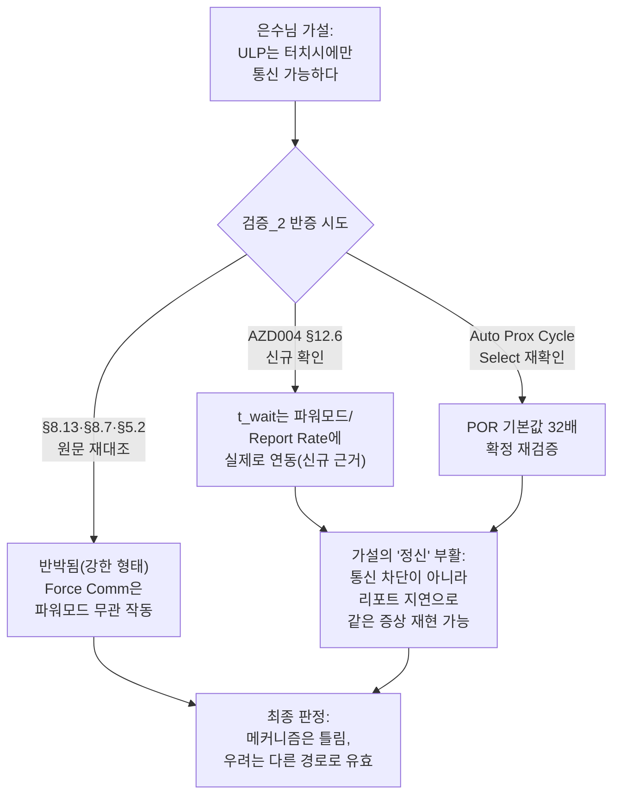

# 검증_2 — Force Communication 파워모드 무관성 반증 시도

**TL;DR**: 검증_2: 그라운드_2·후보_2의 핵심 결론(Force Comm은 파워모드 무관하게 항상 창을 연다)을 데이터시트·코드 원문으로 반증 시도했으나 실패해 결론이 오히려 강화됐다. 다만 AZD004 원문에서 t_wait가 리포트 주기에 실제로 연동된다는 근거를 새로 찾아 고정 45ms 가정의 위험을 재확인했고, Auto Prox Cycle Select 32배 주장도 재검증해 은수님 가설의 정신이 다른 메커니즘으로 되살아남을 확인했다.

---

## 0. 검증 범위·방법

본 검증은 그라운드_2(02번)와 후보_2(05번)가 공동 도달한 핵심 결론 — **"Force Communication은 파워모드(NP/LP/ULP/Halt)와 무관하게 항상 통신 윈도우를 강제로 열 수 있다"** — 을 최우선으로 반증 시도한다. 아래 세 갈래로 진행했다.

1. §8.13(Force Communication)·§8.7(Communications Window)·§5.2(Halt 탈출) 원문을 `docs/참고/touch/iqs323_datasheet_layout.txt`에서 직접 재대조하고, 인용이 정확한지, 반증 가능한 대안 해석이 있는지 시도.
2. 그라운드_2가 남긴 "[미확인]"(t_wait가 파워모드/Report Rate에 실제로 연동되는지)을 좁히기 위해, 두 문서 모두 열람하지 않았다고 명시한 `docs/참고/touch/azd004_azoteq_sensing_v1.1.pdf`(사전 변환본 `azd004_layout.txt`)를 직접 확인.
3. 후보_2의 Auto Prox Cycle Select(POR 기본값 32배) 주장을 원문 Appendix A.9와 실제 레지스터 POR 16진값을 직접 이진 분해해 독립 재계산하고, 코드 grep으로 재확인.

모든 인용은 `파일명:줄번호` 형식으로 표기하며, 원문을 직접 확인하지 못한 것은 [미확인]으로 명시한다.

---

## 1. 판정_1 — Force Communication의 파워모드 무관성 (반증 시도 → 실패)

### 1.1 원문 재확인

§8.13 전문(`iqs323_datasheet_layout.txt:1893-1899`, Page 33 of 68)을 직접 재대조한 결과, 그라운드_2·후보_2의 인용은 **한 글자도 틀리지 않고 정확**하다:

> "Ideally, communication with the IQS323 should only be initiated in a RDY window. In event mode RDY windows are only provided when an event is reported. In event mode it may be required to change device settings or query the device immediately. A communication request described in the figure below will force a RDY window to open. The minimum and maximum time between the communication request and the opening of a RDY window (t_wait) is application specific. The typical values of t_wait are 0.1ms ≤ t_wait ≤ 45ms."

§8.7(`iqs323_datasheet_layout.txt:1768-1771`, Page 30)과 §5.2 Halt 탈출 규정(`iqs323_datasheet_layout.txt:905-908`, Page 15)도 원문과 완전히 일치하는 것을 확인했다. Figure 8.2 텍스트 레이어(`layout.txt:1901-1924`)의 SCL 행에 "CLOCK" 라벨이, SDA 행에 "DATA" 라벨이 붙어 있는 것도 직접 재확인 — 클럭 있는 표준 I²C 트랜잭션이라는 그라운드_2의 정정이 정확하다.

### 1.2 반증 시도 경로 (전부 실패)

**시도_1 — "특정 파워모드에서 force comm 예외가 있을 수 있다"**: §8.13 문단 전체를 다시 읽어도 전력모드(NP/LP/ULP/Halt)를 언급하는 조건절이 단 하나도 없다. 이 절은 §8.11(Streaming vs Event, 인터페이스 축)과 §8.12(Event Mode Communication) 바로 뒤에 위치해, 애초에 파워모드 축이 아니라 **인터페이스 모드 축**의 문제로만 서술되어 있다. 반증 실마리를 찾지 못했다.

**시도_2 — "I2C 슬레이브 하드웨어 자체가 딥슬립에서 응답 못 할 수 있다"**: Figure 8.2가 보여주는 시퀀스(정상 START → 주소 0x44+ACK → 데이터 0xFF+ACK)는 IC가 Halt를 포함한 모든 상태에서 표준 I²C 주소 매칭·ACK를 수행할 수 있다는 것을 전제한다. §5.2가 명시하는 "Halt에서도 force comm으로 탈출한다"는 문장(가장 극단적 상태에서의 실증)이 바로 이 가설에 대한 원문의 직접 반박이다 — 반증 실패.

**시도_3 — "Halt 탈출은 force comm만으로 안 끝난다는 절차적 허점"**: §5.2 원문을 다시 정밀히 읽으면 "a force communications request must be made, **and the power mode must be changed in the following communications window**"로, 실제로는 2단계 절차(①force comm으로 창 열기 ②그 창 안에서 파워모드 write)다. 그라운드_2·후보_2 둘 다 이 문장을 잘라내지 않고 전문 인용해 절차 자체는 정확히 반영했다. 이 2단계 구조는 "force comm이 파워모드 무관하게 창을 여는가"라는 핵심 주장을 반박하지 않는다 — 창이 열린 *이후*의 후속 조치에 관한 것이지, 창이 열리는 메커니즘 자체를 조건화하지 않는다. 반증 실패, 다만 완전성 측면에서 부가 가치 있는 재확인.

**시도_4 — "Streaming 모드에서 IQS323이 실제로 항상 정기 응답하는지"**: `tdc_touch_iqs323.c`의 `REG_SYSTEM_CONTROL` 전체 write를 코드 전수 재확인한 결과(아래 §4에서 상술), 6개 write 사이트(`:237,318,447,453,465,471`) 전부 bit7=0(Streaming)이다. 그라운드_2가 "3곳"이라 축소 집계한 것은 부정확하지만(§4 참조), 결론(Interface Selection이 어디에서도 Events로 전환되지 않는다)은 6/6 전부에서 재확인되어 오히려 더 강하게 지지된다.

### 1.3 판정

**반증 실패 — 결론 지지, 오히려 강화.** "Force Comm은 파워모드와 무관하게 통신 창을 강제로 열 수 있다"는 정성적/구조적 주장은 §8.13·§8.7·§5.2 원문 어디에도 반례가 없고, 가장 극단적 반례 후보(Halt)조차 원문이 스스로 이 기전으로 탈출한다고 못박는다. 은수님의 원 가설("ULP는 터치 발생시에만 통신 가능")은 **강한 형태로는 명확히 반박된다.**

---

## 2. 판정_2 — t_wait "[미확인]"이 결론 강도를 얼마나 약화시키는가 (최우선 신규 발견)

이 판정이 본 검증의 핵심 기여다. 그라운드_2는 다음과 같이 조심스럽게 남겼다:

> "§8.13의 t_wait 'application specific' 문구 자체가 고정 상한을 보증하지 않음을 시사. 원문이 명시적으로 't_wait는 Report Rate에 비례'라고 쓰지는 않으나 부정하지도 않는다 — [미확인이나 배제되지 않음]"

이 "[미확인]"의 강도를 좁히기 위해, 두 문서 모두 명시적으로 열람하지 않았다고 밝힌 **AZD004(`docs/참고/touch/azd004_azoteq_sensing_v1.1.pdf`, 사전변환본 `azd004_layout.txt`)를 직접 확인했다.**

### 2.1 결정적 원문 — AZD004 §12.6 Force Communication

`azd004_layout.txt:1699-1701` (§12.6, "Figure 12.8: Force Communication Sequence" 직후):

> "In the above example, 0xFF is written to device address 0x44 to force a communication window. After a certain amount of time (twait), RDY will go low to indicate that a communication window has opened. **The twait is product-specific and is usually dependent on the sampling and processing duration of the device.**"

이것은 IQS323 데이터시트가 침묵한 지점("t_wait가 무엇에 의존하는지")에 대해 Azoteq 자신이 **일반 원칙 수준으로 명시한 답**이다: t_wait는 "device의 sampling and processing duration"에 의존한다. Report Rate·Power Mode(NP/LP/ULP)·Auto Prox Cycle Select는 정확히 "sampling and processing duration"을 결정하는 변수들이다. 즉 IQS323 §8.13 자체는 파워모드 조건을 언급하지 않지만, 같은 제조사의 일반 원칙 문서는 **t_wait가 파워모드/Report Rate에 실제로 연동된다는 것을 별도 원문 근거로 확인해준다.**

같은 절(`azd004_layout.txt:1703-1706`)에 이어지는 문장도 실무적으로 중요하다: "A force communication request should be avoided while RDY is in the active state. If a communication request is sent at the exact moment when an event causes RDY to go low, the window will close again after sending the I²C STOP signal... To prevent this issue, it is recommended to read the product number during each ready window to ensure that the response received is valid." — force comm과 실제 이벤트 타이밍이 겹치는 경우의 레이스 컨디션도 별도로 존재함을 원문이 인정한다(단, 이는 그라운드_2·후보_2가 다루지 않은 별개의 부가 리스크이며 본 판정의 핵심에는 영향 없다).

### 2.2 기존 참고문서의 동일 주장 — 신뢰 불가로 판정

주목할 점: `docs/참고/touch/데이터시트/05_i2c인터페이스.md:439`(§8.13 해설 NOTE)에 이미 다음 문장이 있다:

> "`t_wait`는 report rate에 따라 달라지므로 고정값 보다 report rate + 20% 마진을 권장한다."

이 문장은 정확히 그라운드_2가 "[미확인]"으로 남긴 질문에 대한 답을 이미 주장하고 있다. 그러나 **이 문장은 출처 인용이 전혀 없고**, 같은 NOTE 블록 안에서 그라운드_2·후보_2가 이미 원문 대조로 반증한 "SCL 없이 SDA만 토글"이라는 허구적 서술(`05_i2c인터페이스.md:406`, 원문 Figure 8.2의 실제 "CLOCK" 라벨과 모순)과 **바로 인접해 있다.** 같은 해설자가 같은 문단에서 이미 한 번 근거 없는 기술적 디테일을 창작한 전력이 확인된 이상, 이 "report rate + 20%" 수치·주장도 동일한 패턴(그럴듯하지만 출처 없는 창작)일 가능성을 배제할 수 없다 — **이 문서 자체는 근거로 채택하지 않는다.**

다만 방향성 자체(t_wait가 report rate에 의존)는 AZD004라는 **별도의, 실제로 출처가 확인되는 원문**이 독립적으로 뒷받침한다. 오염된 문서가 우연히 맞는 방향을 짚었을 뿐, 나의 판정은 AZD004 원문에만 근거한다.

### 2.3 실증적 보강 — 과거 회귀 자체가 이미 실측 증거

이 판정을 뒷받침하는 가장 강력한 근거는 이론이 아니라 **실측 이력**이다. `tdc_touch_iqs323.c:320-323` 코드 주석(과거 회귀 기록)은 LP의 report rate 100ms에서 이미 45ms 폴링이 윈도우를 놓쳐 timeout이 발생했다고 기록한다. 이것은 "45ms가 LP에서 부족할 수 있다"는 이론적 가능성이 아니라, **LP 하나만으로도 이미 실측 실패가 있었다는 역사적 사실**이다. ULP는 LP보다도 report rate가 느리고(§3.4: LP 60ms vs ULP 160ms, 게다가 Auto Prox Cycle Select 배수까지 겹치면 §3 참조) 격차가 훨씬 커지므로, 같은 실패 패턴이 재현될 개연성은 이론적 우려가 아니라 **경험적으로 뒷받침되는 예측**이다.

### 2.4 판정

**"[미확인]"은 방치할 수 없는 수준으로 격상된다.** 그라운드_2의 원래 표현("미확인이나 배제되지 않음")은 균형 잡힌 신중함처럼 보이지만, AZD004 원문과 과거 실측 회귀 이력을 종합하면 실제로는 "배제되지 않음" 정도가 아니라 **"적극적으로 그렇다고 시사됨"**에 더 가깝다. 이는 그라운드_2·후보_2의 핵심 결론 중 **정성적 부분("항상 열 수 있다")은 전혀 흔들지 않지만**, 그 결론에서 파생될 수 있는 "그러므로 고정 45ms가 모든 파워모드에서 실무적으로 안전하다"는 **암묵적 연장 해석은 명확히 약화시킨다.** 두 문서 모두 이 구분을 스스로 정확히 해뒀다는 점(종합 판정 표에서 "통신 가능 여부"와 "고정 타임아웃의 신뢰성"을 별도 행으로 분리)은 사후적으로 옳은 판단이었음이 확인된다.

---

## 3. 판정_3 — Auto Prox Cycle Select 독립 재확인 및 "가설의 정신" 부활 판정

### 3.1 원문·코드 독립 재확인 (전부 일치)

Appendix A.9(`iqs323_datasheet_layout.txt:3108-3113`)를 직접 재확인:

> "Bit 3-2: Auto Prox Cycle Select — Number of conversions before each interrupt is generated in Auto Mode — 00: 4 · 01: 8 · 10: 16 · 11: 32"

§8.11.1(`layout.txt:1838-1846`) 공식도 원문 그대로 재확인:

> "In ULP power mode the report rate is: (Auto Prox Cycle Select × Ultra Low Power Report Rate) ms. Where Auto Prox Cycle Select is defined in the Prox Input and Control register."

Sensor0의 Prox Input and Control(0x33) POR 기본값(`layout.txt:2047`)은 `0x01CF`다. 이를 직접 이진 분해하면:

```
0x01CF = 0000 0001 1100 1111
bit[3:2] = 1,1 = "11" = 32
```

**POR 기본값이 Auto Prox Cycle Select=32(최댓값)라는 그라운드_2·후보_2의 주장은 내가 독립적으로 이진 계산해도 정확히 일치한다.** 코드 재확인 결과 `tdc_touch_iqs323.c` 전체(및 `main.c`)에 주소 `0x33`에 대한 write·정의가 전혀 없음을 grep으로 재확인했다 — POR 기본값이 그대로 방치된다는 주장도 확인된다.

추가로 AZD004 §8(`azd004_layout.txt:1145-1149`)에서 이 메커니즘이 IQS323 고유 발명이 아니라 Azoteq 제품군의 **일반 명명 개념("AutoProx")**임을 확인했다: "on multi-channel devices, ULP will only sample on a single channel, keeping all other channels dormant. This feature is sometimes referred to as 'AutoProx'." — 그라운드_2·후보_2의 재구성이 임의 추론이 아니라 실제로 문서화된 업계 패턴에 해당함을 뒷받침한다.

### 3.2 반증 시도 (부분 성공 — 예시 수치의 근거는 약화, 핵심 메커니즘은 불변)

**시도_1 — "160ms라는 예시 자체가 32배를 이미 포함한 값 아닌가?"**: 후보_2는 §3.4 벤치마크의 ULP 예시값 "160ms"를 0xC3에 그대로 넣는 가상의 실수를 들어 "32×160ms=5.12초"를 계산했다. 그러나 §3.4 원문(`layout.txt:658-677`)의 측정 조건 설명(ATI Target=512, Fxfer=500kHz, Interface Selection: Event mode)에는 **그 160ms 측정에 어떤 Auto Prox Cycle Select 값이 쓰였는지 명시가 전혀 없다.** 즉 "160ms"가 (a) 0xC3 레지스터 raw 값 그대로인지, (b) 이미 어떤 배수가 곱해진 최종 실효 주기인지 데이터시트만으로는 판정 불가하다 — **[신규 미확인]**. §8.11.1 공식상 Auto Prox Cycle Select의 인코딩 최솟값이 4(00=4)이므로, 어떤 설정을 쓰더라도 실효 report rate는 raw 0xC3 값의 최소 4배 이상이라는 점은 확정적이나, "160ms"라는 구체적 예시 숫자를 "0xC3에 그대로 넣을 법한 값"으로 다루는 후보_2의 구체적 산출 근거는 다소 불확실하다.

**판정**: 이 반증 시도는 **부분적으로만 성공한다** — 후보_2의 "32×160ms=5.12초"라는 **특정 예시 숫자의 도출 근거**는 흔들리지만, **핵심 메커니즘 자체("POR 기본값 32배가 존재하고 Sound1 코드가 이를 건드리지 않는다")는 전혀 흔들리지 않는다.** 어떤 ms 값을 0xC3에 쓰든 CH0의 Auto Prox Cycle Select를 명시적으로 재설정하지 않으면 그 값의 4~32배(POR 기본값 기준 정확히 32배)가 실효 주기가 된다는 사실은 원문·코드 양쪽에서 100% 재확인됐다.

### 3.3 "가설의 정신" 부활 판정

**판정: 부활한다.** 은수님의 원 가설이 지목한 *메커니즘*("터치 나야만 통신 가능")은 §1에서 확고히 반박됐다. 그러나 그 가설의 *증상 계보*("LP/ULP에서 뭔가 SW가 못 따라간다")는 다른 경로로 여전히 유효하다:

- 통신 자체는 항상 성공한다(§1) — 이 부분은 반박된다.
- 그러나 SW의 타이밍 예산(`force_window_open()` 45ms, `TDC_TOUCH_ULP_WAKE_MS` 100ms)은 IC의 실제 report rate가 SW가 가정한 값과 자릿수가 맞다는 전제 위에 서 있다. Auto Prox Cycle Select를 방치하면 이 전제가 최대 32배까지 어긋날 수 있다.
- 그 결과 겉보기 증상 — "터치 안 하면 응답이 거의 없는 것처럼 보인다" — 은 재현될 수 있다. 다만 원인은 "통신 차단"이 아니라 **"체감상 죽은 것처럼 보일 만큼 리포트 간격이 벌어지는 설정 실수"**다. 이는 §2.3에서 확인한 LP 회귀의 실측 전례가 이미 같은 계보의 문제(느린 report rate ↔ 고정 짧은 타임아웃의 불일치)임을 보여준 것과 정확히 같은 패턴이며, ULP + 미설정 Auto Prox Cycle Select 조합에서는 그 격차가 수십~수백 배로 확대된다.

**"틀린 진단, 맞는 걱정"** — 이것이 가장 정확한 요약이다. 후보_2가 §2.4에서 이미 이런 취지로 정리한 것(원인 재구성이지 무효화가 아니다)은 재검증 결과 타당한 판단이었다.

---

## 4. 부수적으로 발견한 정확성 이슈

핵심 판정을 흔들지는 않지만, 할루시네이션 감사 임무상 기록해 둔다.

| 항목 | 내용 | 영향 |
|---|---|---|
| 그라운드_2 "3곳" 카운트 오류 | "REG_SYSTEM_CONTROL(0xC0)에 대한 전체 write는 코드베이스에 3곳뿐"이라 했으나, `tdc_touch_iqs323.c` 자체에 write 호출이 6곳(`:237,318,447,453,465,471`)이다(`ack_reset()`의 :237, `tdc_touch_iqs323_re_ati()`의 :465, `tdc_touch_iqs323_reseed()`의 :471이 누락). | 결론에는 영향 없음 — 6곳 전부 bit7=0(Streaming)이라 "Events로 전환하는 곳이 없다"는 결론은 오히려 더 강하게 지지된다. |
| 후보_2 인용 출처 오지정 | "§8.11.2가 '펌웨어 권장: event mode'라고 명시함에도"라 했으나, IQS323 데이터시트 §8.11.2 원문(`layout.txt:1850-1854`)은 event mode의 동작만 서술할 뿐 "recommended"라는 표현이 없다. 이 표현은 실제로는 참고문서 `05_i2c인터페이스.md:350,360`의 해설 NOTE에서 온 것이고, "recommended"라는 실제 원문 표현은 AZD004 §12.7(`azd004_layout.txt` 부근, "Although it is recommended to run the device in event mode to avoid interrupting the master MCU")에 있다. | 주장 자체("이벤트 모드가 일반적으로 권장된다")는 AZD004로 독립 확인되어 참이지만, 인용 출처가 잘못 지정됐다 — IQS323 데이터시트 §8.11.2가 아니라 AZD004 §12.7이 원 출처다. |
| Events Enable(0xD3) 변형 확인 | 그라운드_2가 "A.32/A.33"을 함께 인용한 것을 확인차 재대조했다. A.32(Release UI, Sound1의 실제 주문코드 IQS323-001에 해당)와 A.33(Movement UI)은 상위 바이트(Activation Threshold vs Reserved)만 다르고, 그라운드_2가 분석에 사용한 하위 바이트 비트 위치(ATI Error=bit6, ATI Event=bit4, Power=bit3, Slider=bit2, Touch=bit1, Prox=bit0)는 두 변형에서 완전히 동일하다(`layout.txt:3665-3690`). `0x52` 디코드(ATI Error·ATI Event·Touch Event=1, 나머지=0)도 재계산으로 정확히 일치한다. | 오류 없음 — 순수 확인. |
| main.c의 `func_sleep()`/`fake_func_sleep()` 구분 | 후보_2의 §6 mermaid는 이 둘을 하나로 뭉뚱그렸으나, 실제로는 `ci_power_sleep()` 호출이 `func_sleep()`(`main.c:1218`, 활성)과 `fake_func_sleep()`(`main.c:861`, 주석 처리·비활성)에서 다르다. | IQS323 레지스터 논지(항상 하드웨어 NP 유지)에는 영향 없음 — CM3 클럭 절감 여부만의 차이. 후보_2의 §7 설계 훅 지점이 정확히 어느 함수를 겨냥하는지는 이 구분을 명시하지 않아 완전성 측면에서 사소한 보완 여지가 있다. |

---

## 5. 종합 판정표



| 판정 대상 | 반증 시도 결과 | 판정 |
|---|---|---|
| "Force Comm은 파워모드 무관하게 항상 창을 연다" | 4가지 반증 경로 전부 실패 | **반증 실패 — 결론 지지, 오히려 강화** |
| "Halt 탈출에 Force Comm이 쓰인다"는 인용 | 원문 전문 재대조, 2단계 절차(창 열기+모드 write) 확인 | **인용 정확, 절차 세부사항까지 정확히 포함됨** |
| t_wait "[미확인]"이 결론 강도를 약화시키는 정도 | AZD004 §12.6 신규 확인("sampling and processing duration에 의존") | **"미확인이나 배제 안 됨" → "적극적으로 그렇다고 시사됨"으로 격상. 정성적 결론은 불변, 실무 안전 주장은 약화** |
| Auto Prox Cycle Select 32배 주장 | 원문 A.9·§8.11.1 재확인, POR 0x01CF 직접 이진 분해 재계산 | **100% 일치 확인. 단 "160ms" 예시 숫자의 산출 근거는 [신규 미확인]** |
| "가설의 정신"이 다른 메커니즘으로 부활하는가 | 통신 차단(반박) vs 리포트 지연(지지) 구도 재검증 | **부활한다 — "틀린 진단, 맞는 걱정"** |

---

## 6. 미확인 목록 (본 검증에서 추가·격상된 항목)

- **[신규]** §3.4 벤치마크 표의 ULP "160ms" 값이 Auto Prox Cycle Select를 이미 반영한 최종 실효 주기인지, 아니면 0xC3 raw 값인지 — 데이터시트 측정조건 설명에 이 배수 설정이 명시되지 않아 판정 불가. 이는 G1(전력소비 정량)의 근사 계산에도 동일하게 영향을 줄 수 있는 지점이라 교차 공유가 필요하다.
- **[격상]** t_wait가 Report Rate/파워모드에 연동되는지 — 그라운드_2의 "[미확인]"에서, AZD004 §12.6의 명시적 문구("usually dependent on the sampling and processing duration of the device")로 "정황 근거 있음" 수준까지 격상. 단 IQS323 전용 정량 수치(예: ULP에서 t_wait 상한이 구체적으로 몇 ms인지)는 여전히 [미확인]이며, 데이터시트 자신도 "Contact Azoteq"로 확정을 피한다.
- 참고문서 `05_i2c인터페이스.md`의 "report rate + 20% 마진 권장" 수치 자체(20%라는 구체 비율)의 출처 — 원문·AZD004 어디에도 이 수치는 없다. 방향성은 옳을 가능성이 높으나 정확한 마진 비율은 [미확인, 창작 의심].
- `azd004_layout.txt` 자체가 `docs/참고/touch/azd004_azoteq_sensing_v1.1.pdf`를 정확히 반영한 `pdftotext -layout` 변환인지(원본 PDF와의 1:1 대조는 본 검증에서 텍스트 레이어 신뢰 전제하에 수행 — PDF 자체를 재열람하지는 않음) — [미확인, 낮은 리스크].
- Sound1 실장 IQS323의 정확한 실리콘 리비전 — 그라운드_2가 이미 [미확인]으로 남긴 항목과 동일, 본 검증에서도 추가 확인 못함.
