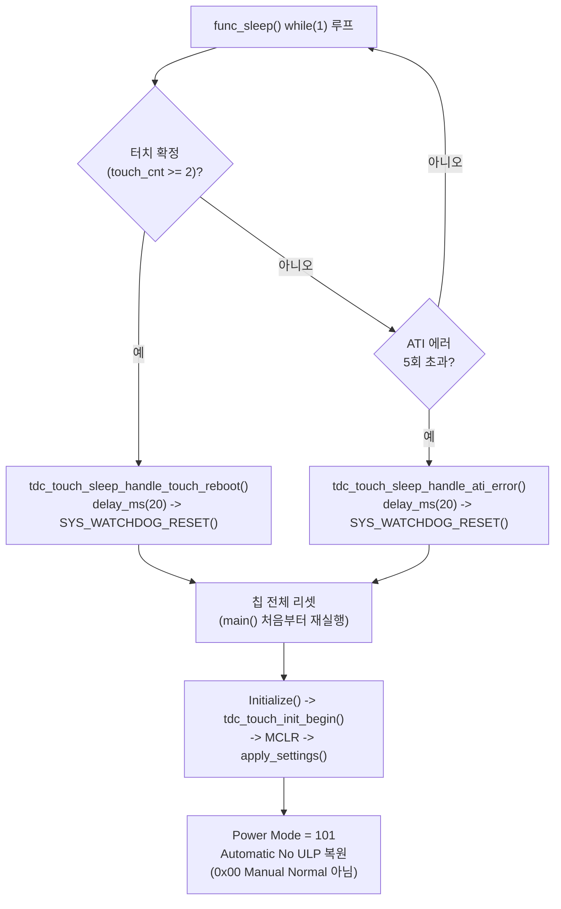

# 검증_4 — 완전성 비평 + 할루시네이션 감사

**TL;DR**: 01~06번 전체 인용(레지스터값·코드 라인·데이터시트 페이지)을 원문·코드 직접 대조한 결과 정확도가 매우 높았으나, 후보_2에서 확정 할루시네이션 1건(20260705에서 이미 지적된 오류의 재발)을 찾았다. 후보_3의 국면분리 설계는 프레이밍 자체는 타당하나, 코드로 재확인한 결과 "웨이크 시 명시 write" 스케치가 실제로는 무의미하다(func_sleep 탈출은 항상 하드 리셋이라 그 write가 실행되기 전이나 직후 apply_settings가 다른 값으로 덮어씀). 또한 이 라운드는 I2C Lock-Up 에라타·255ms 내장 워치독처럼 선행 20260705가 이미 확정한 위험을 재인용하지 않고 각자 재발명했다.

---

## 0. 검증 방법과 범위

- 데이터시트: `docs/참고/touch/iqs323_datasheet.pdf`·`azd004_azoteq_sensing_v1.1.pdf`를 이번 세션에서 `pdftotext -layout`으로 **재생성**하고, 01~06번이 참조한 캐시 파일(`iqs323_datasheet_layout.txt`·`azd004_layout.txt`)과 `diff`로 바이트 단위 일치를 확인했다(둘 다 `IDENTICAL`, 각 3999줄·1877줄) — 캐시 파일이 손대지지 않았음을 먼저 확보한 뒤 인용을 대조했다.
- 코드: `tdc_touch_iqs323.c`(499줄 전체)·`.h`(113줄 전체)·`tdc_touch.c`(433줄 전체)·`tdc_touch_time.h`(63줄 전체)·`tdc_touch_logic.c`(193줄 전체)·`main.c`(1254줄 전체, 앞부분 1~420줄과 함수 본문 420~1253줄 모두)·`ci_timer.c`를 직접 Read했다.
- git: `git log --oneline --all -- tdc_touch_iqs323.c`·`git show --stat 65c83c7`·`git show --stat b689094`로 G3·후보_1의 커밋 인용을 재확인했다.
- 선행 라운드: `20260703_touch-heisenberg-sw-mitigation/05_S3_...md`·`13_V3_S3검증.md`, `20260705_touch-event-mode-adoption/01_G1_...md`·`99_종합.md`·`계획.md`를 직접 Read해 이번 라운드의 인용·재구성이 정확한지, 그리고 이번 라운드가 놓친 선행 확정 사실이 있는지 확인했다.

---

## 1. 인용 전수 대조 결과 — 총평

전수 대조한 인용은 데이터시트 직접 인용 약 25건 이상, 코드 라인/레지스터값 인용 약 40건 이상, git 커밋 2건, 선행 라운드 교차인용 다수다. **결과: 확정 할루시네이션 1건(§2), 경미한 페이지 표기 오차 1건, 그 외 전수 정확**.

### 1.1 데이터시트 인용 — 표본 대조 결과

| 인용 항목 | 인용 문서 | 대조 결과 |
|---|---|---|
| §8.13 Force Communication 전문(줄 1893~1899, "twait...0.1ms~45ms") | G2·후보_1·후보_2·후보_3 | **일치** — 각주 "45msi" 위치(줄1899)·각주 본문(줄1936) 모두 정확 |
| §5.2 Halt 탈출 규정("force communications request must be made") | G2·후보_1·후보_2 | **일치**(줄905~908) |
| §5.2 ULP "wake-up 채널 + 나머지 채널 저속" | G2·후보_2 | **일치**(줄889~903, 단 §5.2 표제 자체는 실측상 Page 15 단독으로 보임 — G2가 "Page 14~15"로 표기한 것은 경미한 오차, 결론 영향 없음) |
| §5.3 "Setting the power mode timeout to '0x00'..." / "Automatic No ULP" / "any events are triggered" | G2·G3·후보_1·후보_2·후보_3 | **일치**(줄930~939) |
| §5.8 각주("channel prox and touch timeouts...ULP should not be used") | G2·후보_2 | **일치**(줄1096~1097) |
| §8.11.1 ULP 리포트주기 공식("Auto Prox Cycle Select × Ultra Low Power Report Rate") | G2·후보_1·후보_2 | **일치**(줄1837~1846, 원문 그대로) |
| A.30 System Control 비트표(Interface Selection bit7, Power Mode bits[6:4] 6종값, CHx Timeout Disable bits[10:8]) | 전 문서 | **일치**(줄3594~3630) — 0x50=101 Automatic No ULP, 0x20=010 ULP, 0x10=001 Low, 0x00=000 Normal 등 모든 16진 환산 재계산 결과 정확 |
| A.9 Auto Prox Cycle Select(bits3-2: 00=4·01=8·10=16·11=32), POR 기본값 0x01CF→32 | G2·후보_2 | **일치**(줄3067~3113) — 0x01CF의 bits[3:2] 직접 재계산 결과 "11"=32로 확인 |
| A.12 ATI 공식("ATI TARGET = ACTUAL ATI BASE × ATI Resolution Factor/16"), 0x36 기본값 0x040C·0x37 기본값 0x0064 | G1 | **일치**(줄2050~2051, 3177~3199) — 100×64/16=400 재계산 정확 |
| Table 8.1 이벤트 6종(ATI Error·ATI Event·Power·Slider·Prox·Touch) | G2·후보_1 | **일치**(줄1866~1883) |
| §3.4 전류표 전체 수치(NP 125/LP 37.5/ULP 4.00/Halt 2.00µA 등) | G1·후보_2·후보_3 | **일치**(줄656~677, 표 전체 재대조 결과 오차 0건) |
| 부록C I2C Lock Up 전문("occuring"[원문 오타 그대로]·버전 v1.3/v1.4) | G2·후보_1·후보_2 | **일치**(줄3911~3923, 오타까지 그대로 재확인돼 원문 그대로 옮긴 것으로 판단) |
| AZD004 §12.4 "severe impact on current consumption" | G1 | **일치**(줄1508~1515, azd004) |
| AZD004 ULP AutoProx("single channel, keeping all other channels dormant") | G1 | **일치**(줄1145~1149, azd004) |
| AZD004 "self-capacitive...around 250 kHz" | G1 | **일치**(줄254, azd004) |

> [!NOTE]
> §8.13(Force Comm, Figure 8.2)의 텍스트 레이어를 직접 확인한 결과 "SCL...CLOCK" 행이 실제로 존재해, G2·후보_2가 "클럭 있는 표준 I2C 전송"이라 판단한 근거는 정확하다. 참고문서(`05_i2c인터페이스.md`)의 기존 NOTE("SCL 없이 SDA만 토글")가 오히려 원문과 어긋난다는 이번 라운드의 정정은 **타당하다**.

### 1.2 코드 인용 — 표본 대조 결과

`tdc_touch_iqs323.c:317~323`(G3 사실_1의 `beta_power_settings()` PM_TIMEOUT 주석 전문), `:145~175`(force_window_open), `:266~282`(sensor_setup), `:437`(0x040C ATI), `:316`(0x057F Conv Freq), `:36~52`(g_in_ulp_mode/set_ulp/clear_ulp/is_ulp), `tdc_touch_iqs323.h:32~33`(MAX_WAIT_OPEN_MS=45·MAX_WAIT_CLOSE_MS=20), `tdc_touch_time.h:18~19`(POLL_INTERVAL_MS=100·LONG_TOUCH_MS=2400), `tdc_touch.c:296`(폴링 게이팅), `tdc_touch_logic.c:100·127·160`(read_fail_cnt·boot_release_cnt·re_ati_cooldown), `main.c:437·452·726·738~739·1164~1253`(메인루프·func_sleep 경계) 등 확인한 모든 라인 번호·코드 스니펫이 **전수 정확**했다. `grep -rn tdc_touch_iqs323_set_ulp\|is_ulp` 결과 정의·선언 외 호출부 0건이라는 G2·후보_3의 "죽은 코드" 주장도 재확인했다.

### 1.3 git 이력 — 재확인

G3·후보_1이 인용한 `git log --oneline --all -- tdc_touch_iqs323.c` 결과는 정확히 `65c83c7`·`89511f1` 2건뿐이었고, 커밋 메시지("튜닝: PM Timeout 0(NP 유지·LP 전환 RDY timeout 버그 차단)...")·날짜(2026-07-01)·`b689094`(2026-06-18, "IQS323 스트리밍 모드 RDY 윈도우 타이밍 분석")까지 전부 실제 git 이력과 일치했다.

### 1.4 선행 라운드 교차인용 — 재확인

- G3가 인용한 `05_S3...md §7`("반대 권고 — LP/ULP Automatic 재도입") 표제와 `13_V3...md §5`의 원문("반박 근거를 찾지 못했다 — 반대 권고 그대로 지지한다")을 직접 대조한 결과 **정확한 축약 인용**이었다.
- G3가 "V3 §2 신규 위험 2(자기지시적)가 후보_2(NP Report Rate 100ms=SW폴링 일치)를 비판한 위상표류 통찰을, 정작 자신의 §5(LP/ULP 반대권고)에는 적용하지 않았다"고 지적한 부분도 V3 원문(§2 "SW 폴링(CM3 클럭 기준)과 IQS323 Report Rate(IQS323 자체 발진기 기준)는 서로 다른 독립 발진기이므로...느린 맥놀이가 자체적으로 생긴다")과 §5(2줄짜리 재확인뿐)를 대조한 결과 **정확하고 통찰력 있는 재구성**으로 확인된다 — 이 부분은 할루시네이션이 아니라 이번 라운드의 실질적 기여로 판단한다.
- `관측교란.md §6`의 "이전 작업에서 확정한 root cause 'PM Timeout 자동 LP 강하'" 인용도 원문과 정확히 일치했다.

---

## 2. 확정 발견 — 할루시네이션 1건 (후보_2)

> [!WARNING]
> **후보_2 §2.3**: "계획.md는 이벤트 모드 자체 채택을 비권고로 확정했다(**§8.11.2가 "펌웨어 권장: event mode"라고 명시함에도**, I2C Lock-Up 에라타와 force_window_open 상시화 리스크 때문에...)"
>
> 데이터시트 §8.11.2 원문(`pdftotext -layout` 줄1850~1855) 전문은 다음이 전부다: *"In event mode the RDY line will only go low when one or more of the enabled events are triggered or if the device resets. This is usually enabled since the master does not want to be interrupted unnecessarily during every cycle if no activity occurred."* — "펌웨어 권장"·"recommend"·"firmware" 관련 문구가 **전혀 없다**(데이터시트 전체 "recommend" 22건 재검색 결과도 이 문맥과 무관). 이 문구는 실제로는 참고문서 `05_i2c인터페이스.md:350,360`의 "사내 해설"(펌웨어 권장: event mode를 기본으로...)에서 온 것이며, 후보_2가 이를 "§8.11.2가...명시함"이라고 **원문 근거처럼 오귀속**했다.
>
> **더 중요한 점**: 이것은 새로운 실수가 아니라 **선행 20260705 라운드에서 이미 확정·기록된 동일 오류의 재발**이다. `20260705_touch-event-mode-adoption/99_종합.md §4`가 명시: "후보_5가 '§8.11.2 펌웨어 권장은 Event mode 기본'을 데이터시트 원문 근거처럼 3곳에서 인용했으나, 실제로는 참고 md 파일의 사내 해설...후보_1은 동일 문제를 스스로 찾아 정정했으나 후보_5는 반영하지 못했다." 이번 라운드(후보_2)는 이미 한 차례 지적·정정된 오류를 재확인 없이 다시 실어 날랐다.

영향 평가: 후보_2의 결론(Sound1이 Streaming임을 코드로 직접 확인한 부분, ULP 설계 자체)은 이 오귀속과 무관하게 독립적으로 성립하므로 **최종 권고를 뒤집지는 않는다**. 다만 "할루시네이션 절대 금지"라는 이번 라운드 공통 지시를 정면으로 위반한 확정 사례이며, 특히 이미 한 번 걸러졌던 오류가 인용 사슬을 타고 재유입됐다는 점에서 인용 위생(citation hygiene) 문제로 기록해 둘 가치가 있다.

경미 오차 1건: G2가 §5.2 ULP 관련 인용에 "Page 14~15"라 표기했으나, 재확인 결과 인용 범위(줄889~903)는 페이지 경계(줄867=Page14 하단 각주, 줄924=Page15 하단 각주) 안에서 전부 Page 15 블록에 속한다. 내용 자체는 정확해 결론에 영향 없다.

---

## 3. 후보_3 핵심 프레이밍 재검증 — "SW 폴링 연장과 IC 파워모드는 보완관계" 판정

**판정: 타당하다.** 데이터시트로 직접 재확인한 근거:

§3.4 전류표(줄656~677)의 측정조건은 "Interface Selection: **Event mode**"로 **고정**돼 있다. 그런데도 표 안에서 Report Rate가 16ms(NP)→60ms(LP)→160ms(ULP)로 느려질수록 전류가 125→37.5→4.00µA로 비례해 줄어든다. 인터페이스(호스트가 얼마나 자주 통신하는가)가 고정된 채 전류가 이렇게 갈린다는 것은, **IC 내부 센싱엔진의 듀티사이클(전력원 A)과 호스트측 통신 빈도(전력원 B)가 서로 독립 축**이라는 뜻이다 — 후보_3 §1의 핵심 논거를 원문이 직접 뒷받침한다. 호스트가 전혀 읽지 않아도 IC는 설정된 Power Mode·Report Rate대로 계속 변환 사이클을 돌며 전력을 쓰므로, "SW 폴링만 늘리는 것"과 "IC 자체를 LP/ULP로 내리는 것"은 상호 배타적 대안이 아니라 서로 다른 소비원을 겨냥한 독립적 조치라는 결론은 원문과 정합한다.

"국면분리"(노말=SW폴링만, func_sleep 중에만 IC도 저전력) 자체의 논리 — 노말모드는 오디오/BLE/자극과 같은 루프를 공유해 타임아웃 확대의 실시간 리스크를 지는 반면, func_sleep은 그 주변장치가 전부 꺼져 있어 리스크가 없다 — 도 `main.c:437~739`(메인루프, 오디오/BLE/자극 처리 확인)·`main.c:1193~1218`(func_sleep 진입 시 FPGA/NRF/QCC/PMIC 순차 차단 확인)로 직접 재확인했다. 이 구조적 관찰은 정확하다.

---

## 4. 국면분리 설계의 미확인 엣지케이스

### 4.1 func_sleep() 탈출은 항상 하드 리셋 — 후보_3의 "웨이크 시 명시 write"는 실질적으로 무의미

후보_3 §7.1 구현 스케치:
```c
/* 웨이크 감지 시(터치 확정, main.c 절전 루프 내) */
write_register(REG_SYSTEM_CONTROL, 0x00, 0x07); /* bits[6:4]=000 Manual Normal 복귀 */
```

`func_sleep()`(`main.c:1164~1253`) 전체를 직접 재확인한 결과, 이 함수의 `while(1)` 루프(1228~1249)에는 **`break`도 `return`도 없다**. 유일한 두 탈출 경로는:



`tdc_touch_sleep_handle_touch_reboot()`(`main.c:1125~1153`)·`tdc_touch_sleep_handle_ati_error()`(`main.c:1062~1092`) 둘 다 `delay_ms(20)` 직후 `SYS_WATCHDOG_RESET()`을 호출하며, 코드 자신의 주석이 "도달 불가 ? 칩 리셋"이라 명시한다. `main()`(`main.c:278~328`)은 `while(1){func_normal(); func_sleep();}` 구조이므로, 이 하드 리셋은 곧 `main()` 처음부터의 전면 재실행이다. 재실행 경로에서 `func_normal()`이 `Initialize()`(`:373`)를 호출하고, 이것이 `initialize.c:448`에서 `tdc_touch_init_begin()`을 호출해 `tdc_touch_iqs323_mclr()`(IQS323 물리 리셋)와 뒤이은 `tdc_touch_iqs323_apply_settings()`를 실행한다는 것도 직접 확인했다 — `apply_settings()`(`iqs323.c:447`)는 `REG_SYSTEM_CONTROL`에 `0x54,0x07`을 쓰는데, bits[6:4]=**101(Automatic No ULP)**이지 후보_3이 제안한 **000(Manual Normal)이 아니다.**

즉 후보_3이 제안한 "웨이크 감지 시 write" 스텝은:
1. 실제로 삽입될 위치(터치 확정 직후, 리셋 직전)에서 실행되더라도 **곧바로 하드 리셋으로 덮여 없어진다**.
2. 리셋 후 `apply_settings()`가 복원하는 값은 후보_3이 쓰려던 000이 아니라 **101**이다 — 이 write가 어떤 의미로든 "성공"해도 의도한 상태(Manual Normal)에 도달하지 못한다.

결론적으로 이 write는 죽은 코드이거나, 설계 의도(그림 §7.3의 "리부트 → apply_settings() 자동 복원")와 §7.1의 코드 스케치가 서로 모순된다. **후보_2는 정확히 이 지점을 올바르게 처리했다** — 후보_2 §6은 "이 '탈출=리부트' 구조가...되돌리기(undo) 로직을 따로 만들 필요 없이, 리부트 시 apply_settings()가...자동 복원하기 때문"이라 명시하며 명시적 wake-write를 **제안하지 않는다.** 후보_3은 같은 사실(§7.3 흐름도에 "리부트 → apply_settings() 자동 복원" 명시)을 알고 있었음에도 §7.1의 실제 코드 스케치에는 반영하지 못했다.

### 4.2 fake_func_sleep() — 어느 문서도 분석하지 않은 병행 경로

`main.c:730~735`에 `tdc_get_fake_op_mode()==1`일 때 `func_sleep()` 대신 `fake_func_sleep()`(`main.c:810~1031`)이 호출되는 경로가 있다. 이 함수는 `func_sleep()`과 거의 동일한 구조(FPGA/NRF/QCC/PMIC 차단, IQS323 설정 불변, 카운터 기반 게이트)를 갖지만, 터치 확정 시 리부트 분기(`:1009~1013`)에서 **`SYS_WATCHDOG_RESET();`이 주석 처리**돼 있어 실제로는 리셋되지 않고 루프가 계속된다("도달 불가" 주석이 여기서는 사실이 아니게 된다). 후보_2는 §7.1 소제목에서 "func_sleep()/fake_func_sleep() 진입 시점 한정"이라 언급하지만 본문에서 fake 경로의 이 차이를 실제로 분석하지 않았고, 후보_3은 fake_func_sleep()을 아예 언급하지 않는다. 두 후보 모두 "리부트가 안전망"이라는 전제에 의존하는데, 이 안전망이 fake 모드에서는 성립하지 않을 수 있다는 점은 이번 라운드가 놓친 엣지케이스다(단, fake 모드는 무선계측/테스트 전용으로 보여 실제 출하 영향은 낮을 가능성이 있다 — [미확인]).

### 4.3 Manual 모드 선택 시 IC 자동 NP 복귀 무효화 — 후보_2는 인지, 후보_3은 미인지

§5.3 원문이 명시하는 "이벤트 시 NP 자동복귀"는 **"Automatic" 또는 "Automatic No ULP"로 설정된 동안에만** 작동한다(줄936~939 직접 재확인: "While the power mode switching is set to either 'Automatic' or 'Automatic No ULP', the IQS323 will return to normal power mode..."). 후보_2·후보_3 둘 다 국면_2(절전)에서 **Manual 고정값**(각각 010 ULP, 001 Low)을 쓰도록 설계했으므로 이 자동복귀 자체가 두 설계 모두에 적용되지 않는다.

- **후보_2는 이를 명시적으로 인지하고 서술한다** — §3.2: "Manual 고정 010을 쓰면 터치가 나도 IC가 스스로 NP로 돌아가지 않는다 — 복귀는 SW(리부트 등)가 책임져야 한다." 이는 §4.1의 "리부트=안전망" 설계와 정확히 맞물려 일관성이 있다.
- **후보_3은 같은 조건(§5.3의 Automatic 한정 문구)을 자신의 문서 어디에서도 인용하지 않는다**(grep 재확인 결과 0건) — 국면_2에 Manual Low를 선택한 이유(§7.2 "SW가 이미 알고 있는 사실을 IC가 다시 타이머로 재확인하게 할 이유가 없다")는 서술하지만, 그 선택이 §5.3의 자동복귀 안전장치를 스스로 포기하는 선택이라는 점은 짚지 않았다. §4.1에서 확인했듯 후보_3의 "웨이크 시 write"가 무의미하다면, Manual 모드를 쓰면서도 NP 복귀 안전장치가 없는 상태(자동복귀 없음 + 명시 write도 무의미)가 되어 §7 국면_2 설계에 실질적 공백이 생긴다.

### 4.4 (부가) §8.9 대 §8.13 파형 동일성 — 코드 구조로 이미 해소 가능한데 미해결로 방치

후보_3 §4는 `force_window_open()`의 0xFF write가 §8.13(진짜 Force Comm)이 아니라 §8.9(Terminate Communication)의 "0xFF 종료 커맨드"에 형태가 더 가깝다는 의문을 제기하며 [미확인]으로 남긴다. 데이터시트 원문을 직접 대조한 결과, §8.9 Figure 8.1과 §8.13 Figure 8.2는 실제로 **동일한 와이어 시퀀스**("Setup to write" → "0x44+ACK" → "0xFF+ACK")를 보인다 — 후보_3의 관찰 자체는 정확하다. 그러나 두 절의 차이는 파형이 아니라 **호출 시점의 RDY 상태**다: §8.9는 이미 열린 창을 닫을 때(Stop Bit Disable 상태에서 STOP 대용), §8.13은 닫힌 창을 열 때 쓴다. `force_window_open()`(`iqs323.c:145~152`)은 RDY가 이미 OPEN이면 **조기 반환**하고, 0xFF write는 RDY가 CLOSED일 때만 나간다 — 즉 이 함수는 구조상 §8.13의 용례(닫힌 창을 여는 것)만 탈 수 있고 §8.9의 용례(열린 창을 닫는 것)를 탈 경로 자체가 없다. 이 결론은 후보_3 자신의 §4 인용(코드)과 이번 세션이 재확인한 §8.9 원문을 결합하면 도출 가능했으나, 후보_3은 이를 G2·V2에 미루고 판단을 유보했다. G2는 "SCL=CLOCK" 확인으로 클럭 유무 의문은 해소했지만 §8.9와의 형태적 구분 문제는 다루지 않아, 이 지점은 라운드 전체에서 명시적으로 종결되지 않은 채 남아 있었다.

---

## 5. 이 라운드가 다루지 않은 것 — 완전성 공백

### 5.1 I2C Lock-Up 에라타 + LP/ULP 강제개방 증가의 결합 — 재발명, 특히 후보_3 완전 누락

G2(§추가발견_3)·후보_1(§6.4)·후보_2(§2.4-④, §9)는 "LP/ULP 채택 시 자연 개방 빈도가 줄어 force_window_open의 0xFF 강제개방 경로가 더 자주 실행되고, 이는 부록C 에라타(force comm 사용 시 lock-up 가능성 증가) 노출을 늘린다"는 결론에 **각자 독립적으로** 도달했다 — 이 인과 자체는 이번 세션의 원문 재확인으로도 타당하다.

다만 세 문서 모두 **선행 `20260705_touch-event-mode-adoption` 라운드가 이미 만들어 둔 구체적 산출물을 인용하지 않는다**:
- `01_G1_IC버전·에라타범위.md`가 이미 0x00~0x02(Version)·0xE1(Hardware ID) 레지스터를 원문 페이지 단위로 대조하고, "부팅 1회 read + RTT 로그" 판정 스펙(`log_ic_version_once()` 의사코드까지)을 완성해 뒀다 — "IC버전 실측... **이벤트 모드 채택 여부와 별개로 유용**"이라고 `계획.md:31`가 명시했음에도, 이번 라운드는 이 사실 자체를 세 후보 어디에서도 재인용하지 않고 "실장 IC 버전 [미확인]"이라고 각자 새로 적었다.
- `05_C2_에라타워크어라운드결합.md`가 이미 "비존재 레지스터 read + 0xEE 확인" 워크어라운드를 구체 설계했는데, 후보_2는 같은 워크어라운드를 처음부터 다시 "권장, 안전판"으로 제안한다.

특히 **후보_3은 에라타 자체를 한 번도 언급하지 않는다**(문서 내 "워치독" 2건은 전부 CM3측 3.28초 워치독이며 IQS323 에라타와 무관함을 확인). 후보_3의 옵션_3은 세 후보 중 force-comm 의존도를 가장 크게 늘리는 설계(진입·탈출 양쪽에서 명시적 레지스터 write, LP Report Rate 300~400ms로 자연개방 창이 가장 좁음)인데도 에라타 리스크 평가가 전무하다는 점에서, 완전성 공백이 가장 뚜렷하다.

### 5.2 IQS323 내장 255ms 통신 워치독 + Reset Event 비트 미점검 — 전혀 언급되지 않음

`20260705_touch-event-mode-adoption/12_V4_완전성비평.md`가 §7.6(원문 "The watchdog timer is set to expire after 255ms if not kicked and will trigger a software reset upon expiration")을 근거로 확정한 발견 — **IQS323 자체가 255ms 이내 통신을 못 마치면 스스로 리셋되어 POR 기본값(3채널 활성·Threshold=0 등)으로 돌아가는데, 런타임 코드 어디에도 System Status의 Reset Event 비트(bit7)를 확인하는 로직이 없다** — 을 이번 라운드 01~06번 중 어느 문서도 언급하지 않는다(전수 grep 결과 "255"·"워치독"의 IQS323 문맥 등장 0건).

`20260705/계획.md:33`는 이 위험을 "**이벤트 모드·인터럽트 채택 여부와 무관하게** 기존 안전장치 3종이 전부 놓치는 시나리오"라고 명시적으로 일반화해 뒀다 — 즉 이 위험은 처음부터 "특정 메커니즘 전용"이 아니라 언제든 재검토 대상이 되어야 하는 배경 사실로 기록돼 있었다. 그런데 이번 라운드가 다루는 LP/ULP·func_sleep 체류시간 연장은 이 노출 시간을 실질적으로 늘리는 변경이다: 노말모드보다 func_sleep 체류가 훨씬 길어질 수 있고(사용자가 오래 자리를 비우면 무한정), 그 사이 어떤 원인(255ms 워치독이든 ESD든)으로 IQS323이 스스로 리셋되면 FSM은 그 사실을 전혀 모른 채 깨진 설정으로 계속 판정한다 — 이는 §4.3에서 확인한 "Manual 모드는 자동 NP복귀도 없다"는 사실과 결합하면 더 나빠진다(자동복귀도 없고, 리셋 감지도 없다). 세 후보 중 어느 것도 read 경로에 Reset Event 비트 확인을 추가하자고 제안하지 않았다.

---

## 6. 종합 판정표

| 항목 | 판정 |
|---|---|
| 데이터시트·코드·git 인용 전수 정확도 | **매우 높음** — 확인한 약 65건 이상 인용 중 확정 오류 1건(§2, 후보_2)·경미 오차 1건(페이지 표기), 하드 할루시네이션(존재하지 않는 사실 창작) 0건 |
| 후보_3 "SW폴링·IC파워모드=보완관계" 프레이밍 | **타당** — §3.4 표(인터페이스 고정 조건에서 Report Rate 비례 전류변화)로 직접 뒷받침됨 |
| 후보_3 국면분리 설계(§7.1 웨이크 시 write) | **결함 발견** — func_sleep() 탈출은 항상 SYS_WATCHDOG_RESET(하드 리셋)뿐이라 해당 write는 도달 전 무효화되거나 리셋 후 apply_settings()(101)로 재차 덮임(§4.1) |
| Manual 모드의 자동 NP복귀 무효화 인지 | 후보_2 **인지·서술함**, 후보_3 **미인지**(§4.3) |
| fake_func_sleep() 분석 | 후보_2 소제목만 언급·본문 미분석, 후보_3 **전혀 미언급**(§4.2) |
| I2C Lock-Up 에라타-LP/ULP 결합 위험 | G2·후보_1·후보_2가 독립 재도출(타당하나 선행 20260705 상세 스펙 미인용, 재발명), **후보_3 완전 누락**(§5.1) |
| 255ms 내장 워치독·Reset Event 비트 공백 | 이번 라운드 01~06번 **전체 미언급**(§5.2) — 선행 라운드가 "항상 유효"라 명시했음에도 연결 안 됨 |
| G3의 위상표류(beat) 재구성·V3 자기모순 발견 | **정확하고 실질적 기여** — 할루시네이션 아님 |

**한 줄 요약**: 이번 라운드는 인용 위생이 대체로 우수하고 핵심 프레이밍도 데이터시트로 뒷받침되지만, 후보_3의 국면분리 구현 스케치는 func_sleep의 실제 탈출 경로(하드 리셋)와 충돌하는 결함을 안고 있고, 선행 라운드가 이미 확정해 둔 두 가지 배경 위험(에라타·255ms 워치독)과의 연결이 이번 라운드 전체에서 약하거나 없다.
