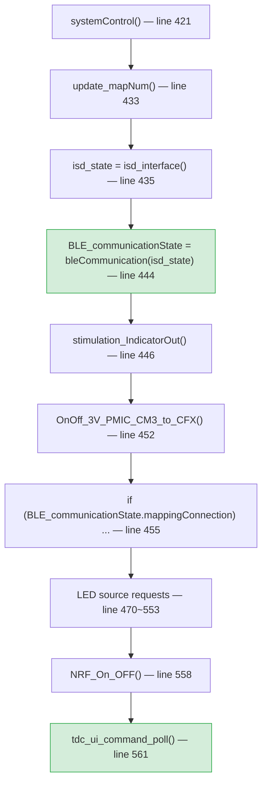

# 분석: UI 명령어로 프로그램(맵) 변경

**TL;DR**: `changeProgramMapNum()` 은 직접 호출 가능 (헤더 이미 include). ISD 상태는 `snd_isd_interface_get_state()` getter 가 이미 존재. 매핑 앱 연결 상태(`mappingProgramConnected`) 는 `mappingControl()` 함수 **내부 static** 으로 외부 직접 접근 불가 — 헤더 선언만 있는 `isMappingProgramConnected()` 는 본문 없는 스텁. **채택 = 설계 A** (main → tdc setter 한 방향 의존, 기존 `tdc_ui_command_override_*` 패턴과 일관). race 없음 (single-thread main, setter 호출이 poll 직전).

## 1. `changeProgramMapNum()` 함수

[`src/2__cm3/Cortex-M3-src/systemControl/cfx_cm3_sharedMemory.c:464`](../../../../src/2__cm3/Cortex-M3-src/systemControl/cfx_cm3_sharedMemory.c) 정의, [`src/2__cm3/Cortex-M3-src/systemControl/cfx_cm3_sharedMemory.h:312`](../../../../src/2__cm3/Cortex-M3-src/systemControl/cfx_cm3_sharedMemory.h) 선언.

```c
void changeProgramMapNum(int mapNum)
{
    if (mapNum <= 5) {
        cfx_cm3_sharedMemoryAll.userSettingValue.mapNum = mapNum;
        if (0 < mapNum) {
            fn_copy_MappingData_toCM3(mapNum, cfx_cm3_sharedMemoryAll.connected_ISD_num);
            if (cfx_cm3_sharedMemoryAll.systemShare.system_opMode == en__normalMode)
                fn_write_userSettingParameters(cfx_cm3_sharedMemoryAll.connected_ISD_num);
        }
        if (ci_fft_read_pass_bin(...) < 0) {
            ci_fft_init_pass_bin(...);
            ci_fft_read_pass_bin(...);
        }
        setCommandMapChange_Cm3ToCfx();
        set_newMapLoadeFlagForStimulParaSetting();
    }
}
```

- 가드 조건: `mapNum <= 5`. 즉 본 명령어 측에서 `1~4` 명시 검증 후 호출하면 안전.
- `mapNum > 0` 일 때 EEPROM 맵 데이터 복사 + 사용자 설정 저장
- FFT pass bin 갱신 + CFX 명령 플래그 set + CM3 측 자극 파라미터 재계산 트리거
- **이미 `tdc_ui_command.c:12` 에서 `cfx_cm3_sharedMemory.h` include 중** → 추가 include 불필요.

`MaxNumMap` 매크로 = `4` ([`src/2__cm3/processorDirective.h:171`](../../../../src/2__cm3/processorDirective.h)).

## 2. ISD 연결 상태 판별

후보 3 종 비교:

| 후보 | 정의 | 호출자 | 채택 |
|---|---|---|---|
| `isIsdConnected()` | `isd_interface.h:33` 선언, **본문 없음 (스텁)** | grep 0 | 해당없음 |
| `read_connected_ISD_Num() != 0` | `cfx_cm3_sharedMemory.c:397` (정의 OK) | 다수 | △ — ISD 번호만, 상태는 모름 |
| `snd_isd_interface_get_state()` | `isd_interface.c:138` (정의 OK) | `ble_communication.c:61` 등 사용 중 | 완료 채택 |

`snd_isd_interface_get_state()` 는 `ST__ISD_STATUS { EN__ISD_CONTROL_STATE isd_controlState; bool conneded_ISD; }` 반환.

LiveStimulationStandAlone 진입 조건은 [`isd_interface.c:223~245`](../../../../src/2__cm3/Cortex-M3-src/internalDevice/isd_interface.c):

```c
if (s_isd_state.isd_controlState == en__isdStatus_stimul_10V_Ok) {
    if (!mappingConnection) {
        // ... LiveStimulationStandAlone 흐름
    } else {
        // ... 매핑 모드
    }
}
```

본 명령 가드는 동일 조건을 외부에서 재구성:
- `conneded_ISD == true` (ISD 연결 의미)
- `isd_controlState == en__isdStatus_stimul_10V_Ok` (값 6, 자극 10V 정상)
- `mapping_connected == false` (매핑 앱 미연결)

세 조건 모두 `&&` 로 결합.

## 3. 매핑 앱 연결 상태 판별

[`src/2__cm3/Cortex-M3-src/BleCommunication/mappingControl.c:1880`](../../../../src/2__cm3/Cortex-M3-src/BleCommunication/mappingControl.c):

```c
ST__MAPPING_STATE mappingControl(ST__ISD_STATUS isd_interface_state)
{
    ...
    static int  delayCounter            = 0;
    static bool connectionCheckING_Flag = false;
    static bool mappingProgramConnected = false;  // ← 함수 내부 static
    ...
    if (mappingPacket.command == en__mapping_connect)
        mappingProgramConnected = true;
    else if (...)
        mappingProgramConnected = false;
    ...
    mappingStatus.mappingConnection = mappingProgramConnected;
    return mappingStatus;
}
```

- `mappingProgramConnected` 는 함수 내부 `static` 으로 외부 직접 접근 불가
- `mappingControl.h:135` 에 `bool isMappingProgramConnected(void);` 선언 있으나 **본문 정의 없음** (link error 회피용 스텁)
- 값은 `mappingControl()` 호출 시점에 `mappingStatus.mappingConnection` 으로 export → 호출자 `bleCommunication()` → `ble_communication.c:419` `ble_communication_state.mappingConnection = mappingState.mappingConnection;`
- main.c 측 `BLE_communicationState = bleCommunication(isd_state);` ([main.c:444](../../../../src/2__cm3/Cortex-M3-src/main.c)) 로 받아 main() 지역변수에 저장

따라서 외부에서 mapping 상태를 얻으려면:
- (A) main.c 가 매 cycle 자신이 가진 `BLE_communicationState.mappingConnection` 을 외부 모듈에 push (setter)
- (B) `mappingControl.c` 의 함수 내부 static 을 파일 정적으로 승격 + 헤더 스텁 본문 추가
- (C) `mappingControl.h` 에 신규 file-scope getter 추가 + `mappingControl()` 안에서 매 cycle 캐시 미러링

**비교**:

| 옵션 | 변경 범위 | 의존 방향 | 컨벤션 적합 |
|---|---|---|---|
| (A) | tdc_ui_command.{c,h} + main.c 1 줄 | main → tdc (기존 `tdc_ui_command_override_*` 와 동일) | 완료 |
| (B) | tdc_ui_command.{c,h} + mappingControl.{c,h} | tdc → mappingControl (역방향, UI 디버그가 BLE 매핑 모듈 침범) | 해당없음 |
| (C) | tdc_ui_command.{c,h} + mappingControl.{c,h} | 동일 역방향 + 추가 캐시 변수 | 해당없음 |

**채택 = (A) 설계 A**. 캡슐화·의존 방향·변경 줄 수 모두 우위.

## 4. main loop cycle 검증

[`src/2__cm3/Cortex-M3-src/main.c:421~561`](../../../../src/2__cm3/Cortex-M3-src/main.c) 호출 순서:



- `bleCommunication()` 호출 시점에 `mappingControl()` → `mappingProgramConnected` mutate → `mappingStatus.mappingConnection` export → `BLE_communicationState.mappingConnection` 갱신 (line 444)
- 이후 같은 iteration 내 `tdc_ui_command_poll()` 호출 (line 561) — 약 100 줄 거리, 모두 main 컨텍스트
- setter 호출은 line 561 직전 (poll 호출 블록 안) 에 끼우면 한 iteration 의 최신값을 캐시

**race condition**: 없음. main 은 single-thread, RTT 입력은 ISR 가 아닌 polling, `mappingProgramConnected` mutate 와 setter 호출 모두 같은 thread context.

## 5. 헤더 의존

`tdc_ui_command.c` 신규 include 필요:

| 헤더 | 제공 심볼 | 기존 include? |
|---|---|---|
| `cfx_cm3_sharedMemory.h` | `changeProgramMapNum()` | 완료 (line 12) |
| `isd_interface.h` | `ST__ISD_STATUS`, `snd_isd_interface_get_state()`, `en__isdStatus_stimul_10V_Ok` | 해당없음 — 신규 추가 필요 |
| `processorDirective.h` | `MaxNumMap` | 전이적 include 가능성 — `cfx_cm3_sharedMemory.h` 가 포함 가능. 분석 단계에선 직접 사용 시 explicit include 권장 |

`MaxNumMap` 의 explicit include 는 빌드 시 검증 (현 시점 `cfx_cm3_sharedMemory.h` → `processorDirective.h` 전이가 있는지 확인 미실행). 만약 미해결 심볼 에러 발생 시 `#include "processorDirective.h"` 추가.

## 6. 새 명령어 사양 — `--prog <1~4>`

| 항목 | 값 |
|---|---|
| 토큰 | `prog` (`s_tdc_commands[]` entry name) |
| 인자 | 정수 1~4 (외부에서 `MaxNumMap` 매크로) |
| 도움말 | `--prog <1~4>` |
| 성공 출력 | `OK: program = <N>\r\n` |
| 범위 오류 | `invalid: 1~MaxNumMap\r\n` (= `invalid: 1~4`) |
| ISD 미연결 | `denied: ISD not connected\r\n` |
| 자극 미활성 | `denied: ISD not in stimulation 10V state\r\n` |
| 매핑 앱 연결 | `denied: mapping app connected\r\n` |

가드 순서: 1) argc/parse → 2) 범위 → 3) ISD 연결 → 4) 자극 상태 → 5) 매핑 연결. 각 단계 fail 시 별도 메시지로 진단성 확보.

`--map on/off` override (`s_tdc_override_map_active/value`) 와는 **독립** — override 는 LED 표시용으로 main.c 의 `tdc_ui_command_override_map_*()` getter 가 LED 분기에서만 사용. 본 명령은 실 상태(`s_tdc_actual_mapping_connected`) 만 사용.

## 7. 영향 범위

| 파일 | 변경 |
|---|---|
| [`src/2__cm3/Gen1_5/ui/tdc_ui_command.h`](../../../../src/2__cm3/Gen1_5/ui/tdc_ui_command.h) | setter 1 개 선언 추가 |
| [`src/2__cm3/Gen1_5/ui/tdc_ui_command.c`](../../../../src/2__cm3/Gen1_5/ui/tdc_ui_command.c) | static 캐시 1 + setter 정의 + `handle_program()` 신규 + `s_tdc_commands[]` entry + `isd_interface.h` include |
| [`src/2__cm3/Cortex-M3-src/main.c`](../../../../src/2__cm3/Cortex-M3-src/main.c) | setter 호출 1 줄 추가 (`tdc_ui_command_poll()` 직전, `#ifdef ENABLE_UI_CMD` 가드 안) |

총 LOC 증분 (예상): tdc_ui_command.c ~50 줄, tdc_ui_command.h 1 줄, main.c 1 줄.


## 1. 현 상태 (Current State)

해당 없음

## 2. 영향 범위

해당 없음

## 3. 가설·선택지

해당 없음

## 4. 핵심 결정

해당 없음

## 5. 위험·제약

해당 없음

## 6. 관련 산출물

해당 없음

## 자체 검토

### 지침 준수 여부

| 지침 | 준수 |
|---|---|
| [`docs/지침/작업 규칙.md`](../../../../../docs/지침/작업%20규칙.md) §3 (4 단계) | 완료 ② 분석 산출 — 다음 ③ 계획 |
| [`docs/지침/코딩/네이밍 컨벤션.md`](../../../../../docs/지침/코딩/네이밍%20컨벤션.md) | 완료 public 신규 함수 = `tdc_ui_command_set_mapping_connected` (tdc_ prefix), static = `handle_program`/`s_tdc_actual_mapping_connected` (기존 패턴) |
| [`docs/지침/코딩/분석·디버깅 규칙.md`](../../../../../docs/지침/코딩/분석·디버깅%20규칙.md) | 완료 grep 호출 경로 검증 (`isMappingProgramConnected` 0 호출자, `isIsdConnected` 0 호출자), 다중 옵션 (A/B/C) cross-check 후 결정 |
| [`docs/지침/일반/계획 모드 자동 진입.md`](../../../../../docs/지침/일반/계획%20모드%20자동%20진입.md) | 완료 Plan Mode 진입·종료 절차 따름. Plan Mode 내 plan file 만 편집, 표준 산출물은 종료 후 동기 작성 |

### 논리적 정합성

| 점검 | 결과 |
|---|---|
| 사용자 의도 매핑 (`changeProgramMapNum` 호출 + ISD/StandAlone 가드) | 완료 §6 사양에 정확 매핑 |
| 가드 조건 = `isd_interface.c:223,245` 의 LiveStimulationStandAlone 진입 조건과 동등 | 완료 |
| main → tdc setter 한 방향 의존 = 기존 `tdc_ui_command_override_*` 와 일관 | 완료 |
| race 없음 (single-thread main) | 완료 |
| `MaxNumMap` 매크로 사용 (hardcoded 1~4 회피) | 완료 |

### 미해결 이슈

| 이슈 | 처리 |
|---|---|
| `processorDirective.h` explicit include 필요 여부 | ③ 계획 단계 — 빌드 후 fail 시 추가 |
| `OK` 메시지 형식 (단순 `OK: program = N` vs Map number 추가 텍스트) | ③ 계획 단계 확정 (디폴트 = 짧은 형식) |
