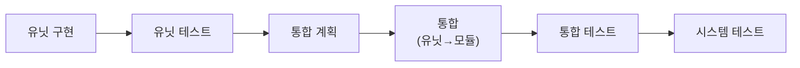

# SW 밸리데이션 계층화 방법론

**TL;DR**: 의료기기 SW 밸리데이션 관점에서 코드를 **유닛 → 모듈 → 시스템** 으로 계층 분해하고, 각 계층의 테스트 정의와 **의존성 기반 테스트 순서**("A는 B 통과 전제")를 규정한다. 핵심: ① **유닛이 다른 유닛을 사용해도 자동으로 모듈로 승격되지 않는다**(의존성은 테스트 순서로 표현), ② **통합 테스트 = 모듈 내 모든 유닛을 함께 활성화해 각 유닛이 원래대로 동작하는지 확인**, ③ 합성은 유닛+유닛=모듈, 모듈+모듈=더 큰 모듈, 전 모듈 통합=시스템. 설계는 **현 체계 특화·단순(과도 추상화 금지)** + **독립성 기준 자연 분해**.

> [!IMPORTANT]
> 본 문서는 **모든 리팩토링·모듈화 작업과 향후 세션에서 일관 적용**하는 표준이다(은수님 정의, 2026-06-26). 작업 ②분석·③계획에서 본 계층 모델로 분해하고, 검증 단계에서 본 테스트 정의를 따른다.

---

## 1. 밸리데이션 생명주기



- 좌→우 순서로 진행하며, 각 단계는 **이전 단계의 통과를 전제**로 한다.
- 리팩토링/모듈화 작업의 분석·계획·검증은 이 생명주기에 맞춰 구조화한다.

## 2. 계층 정의

### 2.1 유닛 (Unit)
- **최소의 독립 테스트 단위**. 단독으로 **자극(입력) → 응답(출력)** 검증이 가능한 것.
- 권장: **순수 로직**(HW 레지스터·전역 상태 비의존, 입력→출력이 결정론적). 예: 믹싱 수식, 지연 정렬, 버퍼 시프트 계산.
- 유닛은 다른 유닛/모듈에 **의존성(종속성)을 가질 수 있다**.

> [!IMPORTANT]
> **유닛이 다른 유닛을 사용한다고 해서 곧바로 모듈(통합)로 승격되지 않는다.**
> 의존 관계는 "**A는 B가 통과되었다는 전제로 진행**"이라는 **테스트 순서**로 표현하면 된다.

### 2.2 모듈 (Module)
- **의미 있는 유닛(들)의 묶음**(필요 시 다른 모듈 포함). 하나의 책임 단위로 함께 동작·검증되는 그룹.
- **통합 테스트의 정의**: 모듈 내 **모든 유닛을 전부 활성화한 상태에서도 각 유닛의 기능이 원래(유닛 단독 테스트 때)대로 정상 동작하는지** 확인하는 것.

### 2.3 합성 규칙
- 유닛 + 유닛 = **유닛 통합(모듈)**
- 모듈 + 모듈 = **모듈 통합(더 큰 모듈)**
- **모든 모듈의 통합 = 시스템** → 시스템 테스트.

## 3. 의존성·종속성과 테스트 순서

- 각 유닛/모듈은 다른 유닛/모듈에 **의존**할 수 있다(상태 정보 사용, 선행 처리 필요 등).
- 의존이 있으면 **테스트 순서**가 정해진다: **의존 대상이 통과된 전제 위에서** 상위 항목을 진행.
- 이 관계 명시만으로 충분한 부분도 있다(별도 추상화·코드 분리 불필요) — "A는 B 통과 전제"라는 **문서 설명**으로 갈음 가능.

## 4. 예시 (오디오 입력 ↔ 빔포밍)

```mermaid
flowchart TB
    subgraph AIM["오디오 입력 모듈"]
      DMIC["DMIC 입력 유닛"]
      I2S["I2S 유닛"]
    end
    subgraph BFM["빔포밍 모듈"]
      BUF["버퍼 조합 유닛"]
      BFM -. "I2S 유닛의 상태 정보 사용(의존)" .-> I2S
    end
    BFM -- "테스트 전제: 오디오 입력 모듈 테스트 완료" --> AIM
```

- 오디오 입력 모듈 = {DMIC 입력 유닛, I2S 유닛, …} — 통합 테스트: 두 유닛을 함께 켜도 각자 정상.
- 빔포밍 모듈 = {버퍼 조합 유닛, …} + **I2S 유닛 상태 정보 사용(의존)**.
- **빔포밍 모듈 통합 테스트는 오디오 입력 모듈 테스트가 완료된 것을 전제**로 진행.

## 5. 테스트 실현 모델 (본 프로젝트 — CFX 온타깃)

- **최종 형태 = 온타깃 CFX 테스트**: 향후 **유닛 함수의 시작 지점에 테스트 벡터를 하드코딩**해 자극-응답을 실기에서 검증.
- **현재 단계**: **테스트 코드는 삽입하지 않는다.** "**테스트가 가능한 구조**"만 준비한다(유닛 경계·의존성 격리·결정론적 입출력).
- **테스트만을 위한 불필요한 로직을 만들지 않는다.** 단순한 유닛은 **로직 설명(문서)**으로 검증을 갈음할 수 있다.

## 6. 설계 원칙 (단순·특화)

- **현 체계에 특화**한다. 불필요한 확장성·범용화·과도한 추상화 금지. "딱 이렇게 하려는 로직이구나" 하고 한눈에 보이게.
- 간단한 glue(레지스터 설정·FIFO·디스패치)는 **하드코딩**해도 된다. 빙빙 도는 함수 추출 금지.
- 유닛 분리는 **테스트를 위한 추상화가 아니라, 독립성 기준의 자연 분해**다. 독립적이면 유닛, 서로 의존하면 그 관계를 명시(통합/전제).

## 7. 작업 적용 절차 (체크리스트)

작업 ②분석·③계획 시:
- [ ] 대상 코드의 **책임·의존성·데이터흐름** 분석(실코드 정독).
- [ ] **유닛 후보** 도출(독립·결정론 입출력 우선) + 각 유닛의 **검증 방법** 라벨(유닛테스트 / 통합테스트 / 로직설명).
- [ ] **모듈 후보**(유닛 묶음)와 **의존성 그래프** 작성.
- [ ] **테스트 계층·순서**("A는 B 통과 전제") 명시 → 통합 계획.
- [ ] 설계가 **단순·특화** 원칙을 지키는지(과도 추상화·테스트용 군더더기 없는지) 자체 검토.
- [ ] 동작 보존(behavior-preserving) 전제 확인.

## 8. 용어 표기 컨벤션

- 라벨: `유닛_1`·`모듈_1`(알파벳 약어 금지, 루트 문서 규칙).
- 다이어그램: Mermaid(`flowchart`), 의존성은 점선 `-.->`, 테스트 전제는 실선 + 라벨.
- 검증 방법 라벨: **[유닛테스트]** / **[통합테스트]** / **[로직설명]** 중 하나를 각 요소에 표기.

> [!NOTE]
> 본 방법론은 [`signalProcessing/20260626_i2s-beamforming-modularize`](../tasks/signalProcessing/20260626_i2s-beamforming-modularize/)에서 처음 적용되며, 이후 전체 시스템 리팩토링으로 확대 시 동일하게 사용한다.
