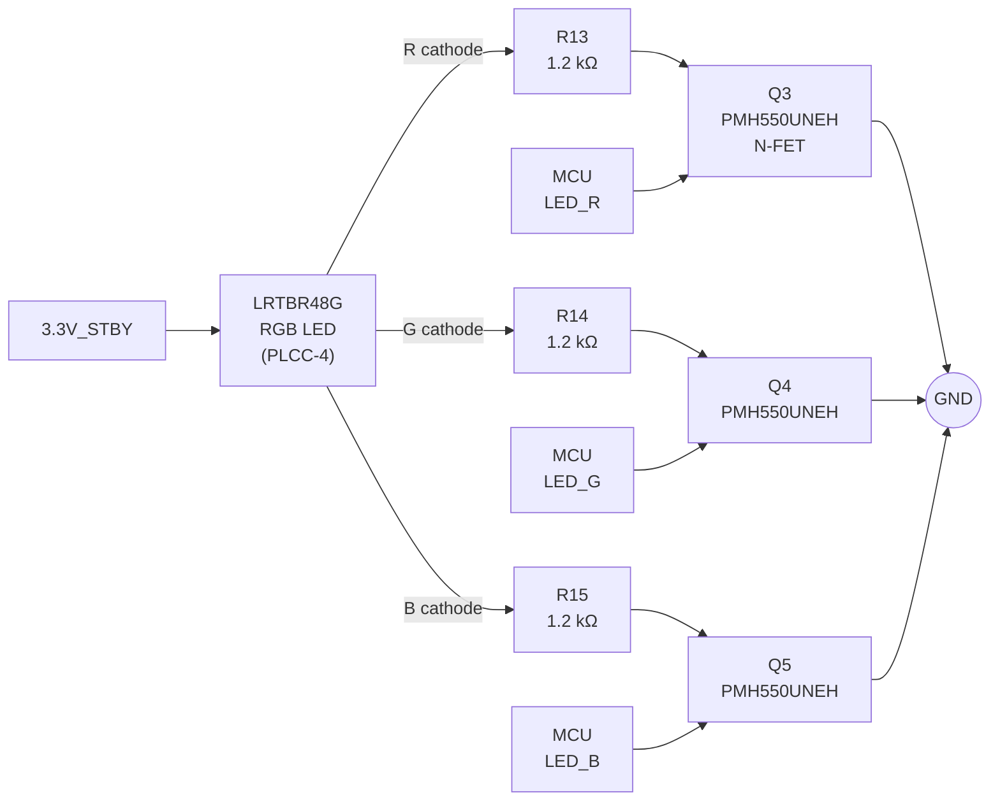
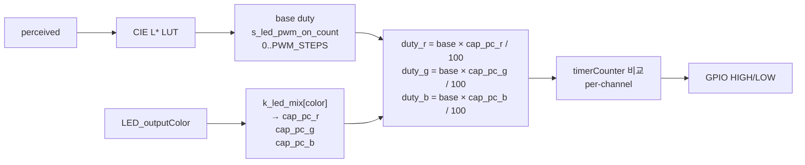

# LED 시스템 기술 문서 — 색감 관리 · 회로 보정

작성자: 김은수
최종 갱신: 2026-04-23

본 문서는 RGB LED 의 **색감 (color perception) 교정**을 다룬다. 회로 제약에서 비롯된 채널별 밝기 불균형, 조합색 편향의 원인, **색상별 R/G/B duty cap 테이블** 아키텍처, 보드 실측 기반 튜닝 절차, HW 한계와 향후 개선 방향까지 포괄.

Dimming 엔진 (fade 타이밍, LUT) 은 [`LED 시스템 — Dimming · 인지 곡선 · LUT`](LED%20시스템%20—%20Dimming%20·%20인지%20곡선%20·%20LUT.md) 참조. 전체 아키텍처는 [`LED 시스템 — 아키텍처 · 운용`](LED%20시스템%20—%20아키텍처%20·%20운용.md) 참조.

---

## 1. 하드웨어 개요

### 1.1 회로 구성 (Board_OTE_ver1_5)



**구조**:
- LED 애노드 3 개가 `3.3V_STBY` 공통 연결
- 각 캐소드 → 저항 1.2 kΩ → N-FET 드레인 → 소스 → GND (low-side switching)
- MCU GPIO HIGH → MOSFET ON → 전류 흐름 → LED 발광
- **Active HIGH** 방식 (MCU 핀 HIGH = 켜짐)

### 1.2 LED IC 스펙 — LRTBR48G

OSRAM 3-in-1 RGB LED, PLCC-4 패키지. 단일 점당 내부 3 개 다이.

**Datasheet typical (20 mA 기준)**:

| 채널 | 파장 (dom) | 기술 | Vf (typ) | Iv (typ) | 효율 (mcd/mA) |
|---|---|---|---|---|---|
| R | 625 nm | AlGaInP | 1.95 V | 560 mcd | ~28 |
| G | 528 nm | InGaN | 3.15 V | 900 mcd | ~45 |
| B | 470 nm | InGaN | 3.20 V | 200 mcd | ~10 |

**핵심 특성**:
- R (AlGaInP) 은 Vf 낮음 → 같은 전압에 전류 많이 흐름
- G (InGaN) 은 효율 최고 (sensitivity peak 528 nm 근처)
- B (InGaN) 은 효율 최저 (파장 끝 영역)
- G, B 같은 InGaN 이지만 파장별 내부 양자 효율 차이

### 1.3 현 회로에서의 DC 동작점 (datasheet typical 추정)

`I = (3.3V - Vf) / 1.2kΩ` + N-FET Vds_on ≈ 0 가정:

| 채널 | Vr (저항 양단) | I | Iv (추정) |
|---|---|---|---|
| R | ~1.35 V | **~1.2 mA** | ~34 mcd |
| G | ~0.15 V | **~0.4 mA** | ~18 mcd |
| B | ~0.10 V | **~0.3 mA** | ~3 mcd |

→ 이론상 R : G : B 밝기 비율 ≈ **11 : 6 : 1** (B 대비 R 11 배 밝음)

주의: 이 값은 **datasheet typical** 기반 추정. 실제는:
- 개체 편차 (bin 등급)
- 온도 드리프트 (특히 헤드룸 적은 G/B)
- 저전류 (< 수백 μA) 영역에서의 efficacy droop

로 인해 일치하지 않는다. **실측 튜닝 필수**.

---

## 2. 색감 불균형의 원인

사용자가 보드 실측으로 관찰한 실제 색감 분포 (초기 cap 설정 후):

| 관찰 | 현상 |
|---|---|
| GREEN 단색 | **가장 밝음** |
| RED · BLUE 단색 | 중간 (비슷) |
| ORANGE (R+G) | 녹색 (연두색) 으로 보임 — 이론 (R 우세) 과 반대 |
| SKYBLUE (G+B) | 가장 밝음 |
| WHITE (R+G+B) | 연보라 (R+B 우세) — G 기여 약함 |

이론 추정과 실측의 주요 괴리 요인:

### 2.1 Vf 편차 — 채널별 전류 대폭 차이

저항 공통 1.2 kΩ + 3.3V 공급에서 각 채널의 저항 양단 전압이 다름:

- R 1.35 V → 상당한 전류 (수 mA 가능)
- G/B 0.1~0.15 V → 극소 전류 (수백 μA)

개체 Vf 가 typical 보다 0.1 V 만 달라도 G/B 전류는 수십 % 변화. 저항 값 동일해도 **채널별 실효 전류 격차가 큼**.

### 2.2 발광 효율 (mcd/mA) 차이

데이터시트 기준으로도 G (45 mcd/mA) 가 R (28) 대비 1.6 배, B (10) 대비 4.5 배 높음. **같은 전류 흘려도 G 가 훨씬 밝게 보임**.

### 2.3 3.3V 헤드룸 부족 (G/B)

`Vsupply - Vf` 가 G/B 에선 0.1 V 수준. 이 헤드룸 범위 내에서:
- Vf 편차로 전류가 크게 흔들림
- 온도 변화 (Vf temp. coeff. ≈ -2 mV/°C) 로도 전류 몇 % ~ 수십 % 변화
- **전류 안정성 낮음**

### 2.4 눈의 색별 감도 — V(λ) 곡선

사람 눈의 명시감도 (photopic V(λ)) 곡선 peak 가 ≈ 555 nm. 채널별 거리:

| 채널 | 파장 | V(λ) 상대값 |
|---|---|---|
| R (625 nm) | peak 에서 70 nm 떨어짐 | ~0.32 |
| G (528 nm) | peak 에서 27 nm 떨어짐 | **~0.87** |
| B (470 nm) | peak 에서 85 nm 떨어짐 | ~0.08 |

→ 같은 광량 (mW) 이라도 **G 가 R 대비 ~2.7 배, B 대비 ~11 배 밝게 체감**. Iv (mcd) 는 이미 V(λ) 반영이지만, 저전류 영역 / 개체 편차까지 더해지면 이론 예측과 실제가 크게 달라짐.

### 2.5 결합 효과

위 4 요인이 **곱셈적으로 누적**되어 datasheet typical 수치와 실제 거동 사이 큰 편차. 결과:
- 수학적 예측만으로는 cap 값 결정 불가
- **반드시 해당 보드 실측 기반 튜닝 필요**

---

## 3. 아키텍처 결정 — 왜 "색상별" cap 테이블인가

### 3.1 옵션 비교

색감 교정을 위해 고려한 두 아키텍처:

**옵션 A: 채널별 단일 gain (per-channel)**

```c
#define GAIN_R 10   /* 0..100 */
#define GAIN_G 50
#define GAIN_B 100

duty_r = base × GAIN_R / 100   /* 어느 색이든 R 채널 사용 시 */
duty_g = base × GAIN_G / 100
duty_b = base × GAIN_B / 100
```

→ 한 채널 gain 이 **모든 조합색에 동일하게 적용**.

**옵션 B: 색상별 per-channel cap 테이블 (per-color × channel)**

```c
[RED]     = { 100,   0,   0 }   /* R=100, G=0,   B=0   */
[GREEN]   = {   0,  50,   0 }
[BLUE]    = {   0,   0, 100 }
[ORANGE]  = {  80,  10,   0 }   /* R=80,  G=10,  B=0   */
[WHITE]   = {  30,  30,  30 }
...
```

→ 각 색상이 **자체 R/G/B cap 독립 지정**.

### 3.2 채널별 gain 의 한계

만약 `GAIN_R = 100, GAIN_G = 50` 으로 단색 밝기를 맞춘다면:

- RED 단색: R 100% × 1.0 = 1.0 (밝기 단위)
- GREEN 단색: G 50% × 2.0 = 1.0 (G 는 per-duty 2배 밝다고 가정)
- ORANGE 조합: R 100% + G 50% = 1.0 + 1.0 = **2.0** (단색 대비 2배 밝음)

문제: ORANGE 가 2 배 밝게 나옴 → SKYBLUE · PURPLE · WHITE 도 동일하게 과밝음. 게다가 G 가 50% 여도 여전히 강해서 ORANGE 가 yellow-green 으로 보이는 문제는 해결 안 됨.

G 를 더 낮추면 (예: 20%) GREEN 단색도 같이 어두워짐 → **단색 / 조합색 둘 다 만족 불가**.

### 3.3 색상별 테이블의 자유도

- GREEN 단색 = `{0, 100, 0}` — G 풀 (단색 밝기 만족)
- ORANGE 조합 = `{80, 10, 0}` — R 우세 + G 대폭 낮춤 (주황색 재현)

→ **단색은 제 본연의 색으로, 조합색은 원하는 색감으로 독립 튜닝**. 두 요구 동시 만족.

**트레이드오프**: 테이블 공간 (8 색 × 3 채널 = 24 byte Flash) · 튜닝 포인트 수 증가 (8 × 3 = 24 개 값). 임베디드 환경에 부담 없고, 튜닝 편의성이 훨씬 높음.

---

## 4. `k_led_mix` — 색상별 cap 테이블

### 4.1 구조

`LedOutput.c`:

```c
typedef struct {
    uint8_t cap_pc_r;  /* R 채널 최대 PWM duty (%), 0..100 */
    uint8_t cap_pc_g;  /* G 채널 최대 PWM duty (%) */
    uint8_t cap_pc_b;  /* B 채널 최대 PWM duty (%) */
} tdc_led_mix_t;

static const tdc_led_mix_t k_led_mix[] = {
    [en__LED_BLACK]   = {   0,   0,   0 },
    [en__LED_RED]     = { 100,   0,   0 },
    [en__LED_GREEN]   = {   0,  50,   0 },
    [en__LED_BLUE]    = {   0,   0, 100 },
    [en__LED_ORANGE]  = {  80,  10,   0 },
    [en__LED_SKYBLUE] = {   0,  30,  40 },
    [en__LED_PURPLE]  = {  50,   0,  50 },
    [en__LED_WHITE]   = {  30,  30,  30 },
};
```

Designated initializer 로 enum 인덱스 직접 지정 → 누락·순서 바뀜 방지.

### 4.2 적용 흐름



중요 원칙: **cap 은 dimming 결과 (base duty) 에 post-LUT 적용**. Fade 동안 base duty 가 0 → max 로 진행되는 동안, 각 채널 duty 는 base × 자신의 cap 비율로 동시에 증감 → fade 곡선 자체가 왜곡되지 않음.

### 4.3 각 색상 설계 의도

**단색** — 각 채널만 켜서 원색 재현:

```c
[RED]   = { 100,   0,   0 }   // R 풀, 기준 (1.0×)
[GREEN] = {   0,  50,   0 }   // G 50% — 실측상 G 가 너무 밝아 감쇠
[BLUE]  = {   0,   0, 100 }   // B 풀, 기준 (가장 어두운 채널이라 풀)
```

**조합색** — 해당 색으로 인식되도록 R/G/B 비율 독립 설정:

```c
[ORANGE]  = {  80,  10,   0 }   // R 우세 + G 대폭 낮춤 → 주황 (yellow-green 회피)
[SKYBLUE] = {   0,  30,  40 }   // G+B 총량 대폭 감쇠 (원래 최고 밝기)
[PURPLE]  = {  50,   0,  50 }   // R+B 균형 → 마젠타/보라
[WHITE]   = {  30,  30,  30 }   // 세 채널 균등 → 연보라 편향 제거
```

**BLACK** = `{0, 0, 0}` → 모든 채널 duty 0 → LED OFF.

---

## 5. LED_OUT 리팩토링

### 5.1 이전 구조 (Rev.0 이전)

`LED_OUT()` 이 3 중 `#ifdef` 로 분기 — 약 300 줄 중복 코드:

```c
#if defined(LED_IS_ACTIVELOW)
  #if defined(LED_B_pin_CFX_test)
    void LED_OUT(void) { /* R, G 만, B 핀 없음 */ }
  #else
    void LED_OUT(void) { /* R, G, B 모두, active low */ }
  #endif
#else
  void LED_OUT(void) { /* R, G, B 모두, active high */ }
#endif
```

각 분기 내에 `switch (LED_outputColor)` 로 모든 색상별 GPIO 직접 지정 — ORANGE = R_on + G_on + B_off 등을 case 별로 반복.

### 5.2 현재 구조 — 통합

두 가지 책임 분리:

1. **색상 → R/G/B 활성 여부 및 duty**: `k_led_mix[color]` lookup
2. **GPIO 극성 + B 핀 유무**: `tdc_led_write_gpio()` helper

```c
static void tdc_led_write_gpio(bool on_r, bool on_g, bool on_b)
{
#if defined(LED_IS_ACTIVELOW)
    if (on_r) Sys_GPIO_Set_Low(DIO_PIN_INDEX_for_LED_color_R);
    else      Sys_GPIO_Set_High(DIO_PIN_INDEX_for_LED_color_R);
    if (on_g) Sys_GPIO_Set_Low(DIO_PIN_INDEX_for_LED_color_G);
    else      Sys_GPIO_Set_High(DIO_PIN_INDEX_for_LED_color_G);
  #if !defined(LED_B_pin_CFX_test)
    if (on_b) Sys_GPIO_Set_Low(DIO_PIN_INDEX_for_LED_color_B);
    else      Sys_GPIO_Set_High(DIO_PIN_INDEX_for_LED_color_B);
  #else
    (void) on_b;
  #endif
#else  /* Active HIGH — Board_OTE_ver1_5 기본 */
    if (on_r) Sys_GPIO_Set_High(DIO_PIN_INDEX_for_LED_color_R);
    else      Sys_GPIO_Set_Low(DIO_PIN_INDEX_for_LED_color_R);
    if (on_g) Sys_GPIO_Set_High(DIO_PIN_INDEX_for_LED_color_G);
    else      Sys_GPIO_Set_Low(DIO_PIN_INDEX_for_LED_color_G);
    if (on_b) Sys_GPIO_Set_High(DIO_PIN_INDEX_for_LED_color_B);
    else      Sys_GPIO_Set_Low(DIO_PIN_INDEX_for_LED_color_B);
#endif
}

void LED_OUT(void)
{
    static int timerCounter = 0;

    /* Test trigger: 강제 BLUE */
    EN__LED_COLOR color = isTestTriggerEanbled() ? en__LED_BLUE : LED_outputColor;

    /* 배열 bound 가드 */
    const tdc_led_mix_t *mix;
    if ((unsigned) color < (sizeof(k_led_mix) / sizeof(k_led_mix[0])))
        mix = &k_led_mix[color];
    else
    {
        static const tdc_led_mix_t k_off = { 0, 0, 0 };
        mix = &k_off;
    }

    /* 채널별 감쇠 duty */
    uint8_t duty_r = (uint8_t)((uint32_t) s_led_pwm_on_count * mix->cap_pc_r / 100U);
    uint8_t duty_g = (uint8_t)((uint32_t) s_led_pwm_on_count * mix->cap_pc_g / 100U);
    uint8_t duty_b = (uint8_t)((uint32_t) s_led_pwm_on_count * mix->cap_pc_b / 100U);

    /* 채널별 PWM 비교 */
    bool on_r = (timerCounter < duty_r);
    bool on_g = (timerCounter < duty_g);
    bool on_b = (timerCounter < duty_b);

    tdc_led_write_gpio(on_r, on_g, on_b);

    timerCounter++;
    if (timerCounter >= LED_DIMMING_PWM_STEPS)
        timerCounter = 0;
}
```

### 5.3 이득

- 중복 코드 300 줄 → 단일 본체 ~30 줄
- 새 색상 추가 시 `k_led_mix[]` 에 entry 1 개 추가로 끝 (GPIO 코드 수정 안 함)
- 보드별 (Active HIGH/LOW) 차이는 helper 1 곳에 격리
- Test trigger (강제 BLUE) 가 동일 경로로 처리 — 별도 분기 없음

---

## 6. 튜닝 절차

### 6.1 환경 준비

- 흰 벽 (반사용), 30 cm 거리
- 야간 또는 실내 조명 균일 (주변광 최소화)
- 기준 샘플 LED 1 개 (튜닝 대상)
- 선택: 조도계 (lux 미터) 또는 색채계
- 디버그 UI 명령 (`--led pattern N`) 으로 색상 고정 가능

### 6.2 단계적 튜닝

#### Step 1: 단색 밝기 확인

```
--led pattern 10    (BATT_READY GREEN 지속 ON)
--led pattern 11    (IN_USE WHITE — 단색 확인용으로 적합하지 않음, Step 3 에서)
```

각 단색 cap 100% 기준 체감 밝기 관찰. 제일 밝은 채널 기준으로 다른 채널 cap 낮춤.

#### Step 2: 조합색 색감 확인

사진 매핑 UI 로 각 조합색 테스트:

```
--led pattern 8     (BATT_CRITICAL ORANGE)
--led pattern 12    (PAIR BLUE 점멸)
--led pattern 5     (MAPPING_ISD_BATT_LOW PURPLE)
```

조합색이 의도한 색으로 보이는지 확인. 편향 있으면 해당 색의 R/G/B cap 조정.

**예시**:
- ORANGE 가 yellow-green 으로 보임 → `[ORANGE].cap_pc_g` 낮춤 (80,20,0 → 80,10,0 → 100,10,0)
- WHITE 가 연보라 → `[WHITE].cap_pc_g` 올림 또는 `cap_pc_r/b` 낮춤

#### Step 3: WHITE 확인

```
--led pattern 11    (IN_USE WHITE)
```

- 순백이 나와야 함 (미색 경계 OK)
- 연보라 (R+B 우세) → G cap 올림 또는 R/B cap 낮춤
- 연녹색 (G 우세) → G cap 낮춤
- 적황색 (R 우세) → R cap 낮춤

#### Step 4: 전체 균형 재조정

모든 색 (단색+조합) 다시 순회. 체감 밝기 범위가 일관되고 색감 편향 없는지 최종 확인.

### 6.3 해상도 양자화 (중요 주의)

- `LED_DIMMING_PWM_STEPS = 10` → cap 값은 **10% 단위로 양자화**
- `cap = 15%` 설정해도 실효는 `floor(10 × 0.15) = 1` (10%) 또는 `round` 에 따라 10 or 20
- **`cap = 5%` 이하는 대부분 0 으로 떨어짐** — LED 안 켜짐
- 정확한 중간값 필요 시 PWM_STEPS 해상도 향상 (§ 7) 후속 작업 필요

### 6.4 온도 · 개체 편차 고려

- 튜닝한 cap 값은 **특정 샘플의 특정 온도** 에 최적
- 다른 샘플: Vf 편차 ±0.1 V → 전류 ±수십 % → 색감 변화
- 온도 변화: Vf temp. coeff. -2 mV/°C → 20°C 차이 시 40 mV 변화
- **대량 생산에서 완벽 일치는 불가**. 평균 샘플 기준으로 튜닝하고 허용 범위 설정

### 6.5 튜닝 이력 기록 (권장)

`k_led_mix[]` 값을 바꾸면 주석이나 별도 문서에 변경 이력 남기기:

```c
static const tdc_led_mix_t k_led_mix[] = {
    /* Rev.1: 실측 기반 cap (2026-04-23, Board sample #3).
     * 이력:
     *   Rev.0 초안: datasheet typical 추정
     *   Rev.1: ORANGE 연두색 → 주황 교정, WHITE 연보라 → 백색 교정 */
    [en__LED_ORANGE] = {  80,  10,   0 },  /* (기존: 100, 20, 0) */
    ...
};
```

---

## 7. HW 한계와 향후 개선 방향

### 7.1 PWM 해상도 10 step 의 양자화

현재:
- `LED_DIMMING_PWM_STEPS = 10` → 0, 10, 20, ..., 100% 의 11 단계만
- fade 중 각 step 10% 밝기 점프
- 짧은 fade (15 ms) 에선 CFF 이하라 체감 부드러움 — 현재 OK
- 긴 fade 요구 시 개별 step 보임 (과거 "찍찍" 현상의 원인)

### 7.2 소프트웨어 PWM 해상도 향상 (후속 작업 예정)

**방법**:
- Ezairo 8300 의 사용 안 하는 TIMER0 / TIMER1 / TIMER2 중 하나를 100 μs ISR 로 설정
- 기본 클럭 SLOWCLK_DIV32 = 40 kHz (25 μs) → PRESCALE=1, TIMEOUT=3 → (3+1)×25 = 100 μs ✓
- 그 ISR 에서 `LED_OUT()` 만 호출 (PWM 카운터 + GPIO)
- arbiter / engine 은 계속 1 ms CFX ISR 에서 실행 (fade 엔진 계산)
- `LED_DIMMING_PWM_STEPS` 10 → 100

**효과**:
- 100 단계 → 1% 단위 양자화
- fade 체감 완벽히 부드러움 (CIE L\* LUT 곡선 그대로 구현)
- cap 값도 1% 단위 튜닝 가능

**CPU 부하 추가**:
- 10 kHz ISR × ~30 cycle/ISR = 300 K cycle/sec
- @ 30.72 MHz: 1.0% → 감당 가능
- @ 7.68 MHz (POR): 3.9% → 감당 가능

### 7.3 HW PWM 지원 여부

Ezairo 8300 TIMER 는 **HW PWM 출력 기능 없음** ([`Ezairo 8300 클럭·타이머·I2C 스펙 정리`](./%5B%EC%B0%B8%EA%B3%A0%5D%20Ezairo%208300%20%ED%81%B4%EB%9F%AD%C2%B7%ED%83%80%EC%9D%B4%EB%A8%B8%C2%B7I2C%20%EC%8A%A4%ED%8E%99%20%EC%A0%95%EB%A6%AC.md) §2.1 참조). 모드가 Single-shot / Multi-shot / Free-run / DIO 인터럽트 캡처 뿐 — **Output Compare / PWM 출력 핀 없음**.

HW PWM 이 꼭 필요하면:
- 외부 LED 드라이버 IC (예: PCA9685, TLC59108) 부착 → BOM 변경
- 본 프로젝트 범위 밖

### 7.4 회로 자체 개선 (BOM 수정 시)

저항 · 전압 고정이 아니라면:

**옵션 A: 저항 채널별 차등**
- R: 2.2 kΩ (전류 감쇠)
- G: 820 Ω
- B: 150 Ω (헤드룸 확보)
- → 채널별 전류 맞춤 / but B 헤드룸 여전히 문제

**옵션 B: LED 공급 전압 상향**
- 3.3V → 5V boost 또는 배터리 직결
- → G/B 헤드룸 충분 / 저항 재계산 필요

**옵션 C: 정전류 LED 드라이버**
- 각 채널 별 정전류 소스
- → 가장 이상적이지만 BOM 증가

현 Sound1 보드는 옵션 A~C 모두 HW 변경 필요. 현재는 **옵션 없음 — SW 교정으로 최대한 보정**.

---

## 8. 검증 포인트

### 8.1 정적

- `k_led_mix[]` 의 모든 `EN__LED_COLOR` entry 존재 (designated init 으로 누락 방지)
- cap 값 모두 0..100 범위
- `tdc_led_write_gpio()` 가 `#ifdef` 3 조합 (Active HIGH / Active LOW / Active LOW + CFX_test) 모두 컴파일
- `LED_OUT()` 내 `k_led_mix` bound 가드 (`< sizeof/sizeof(k_led_mix[0])`)

### 8.2 실기

| # | 시나리오 | 기대 |
|---|---|---|
| a | RED / GREEN / BLUE 단색 | 자연스러운 원색 인식, 밝기 일관 |
| b | ORANGE (BATT_CRITICAL) | **주황색** (연두색 아님) |
| c | WHITE (IN_USE) | 순백 또는 미색 (연보라 편향 없음) |
| d | SKYBLUE (POWER_ON) | 시안 (연두·청록 편향 없음) |
| e | PURPLE (MAPPING_LOW) | 보라 또는 마젠타 |
| f | Fade 전환 (GREEN → BLUE) | 부드럽게 전환, 중간 과도색 없음 |

### 8.3 육안 ↔ 정량 측정 비교 (권장)

- 조도계로 각 색 lux 측정
- 색채계로 xy 색좌표 또는 CCT 측정
- Datasheet 이론 값과 비교, 편차 기록

---

## 9. 관련 코드 파일

| 파일 | 관련 내용 |
|---|---|
| `src/2__cm3/Cortex-M3-src/systemControl/LedOutput.c` | `k_led_mix[]` 테이블, `tdc_led_write_gpio()`, `LED_OUT()` |
| `src/2__cm3/Cortex-M3-src/systemControl/LedOutput.h` | `EN__LED_COLOR` enum |
| `src/2__cm3/99_includeBoard/Board_OTE_ver1_5.h` | `LED_IS_ACTIVEHIGH` 정의 |
| `src/2__cm3/99_includeBoard/DIO_PIN_Config.h` | `DIO_PIN_INDEX_for_LED_color_R/G/B` |

---

## 참고 문서

- [`LED 시스템 — 아키텍처 · 운용.md`](LED%20시스템%20—%20아키텍처%20·%20운용.md) — 전체 아키텍처
- [`LED 시스템 — Dimming · 인지 곡선 · LUT.md`](LED%20시스템%20—%20Dimming%20·%20인지%20곡선%20·%20LUT.md) — fade · LUT 내부
- [`Ezairo 8300 클럭·타이머·I2C 스펙 정리.md`](./%5B%EC%B0%B8%EA%B3%A0%5D%20Ezairo%208300%20%ED%81%B4%EB%9F%AD%C2%B7%ED%83%80%EC%9D%B4%EB%A8%B8%C2%B7I2C%20%EC%8A%A4%ED%8E%99%20%EC%A0%95%EB%A6%AC.md) — TIMER 스펙 (후속 PWM 해상도 향상 시 참고)

## 참고 링크 (외부)

- [LRTBR48G datasheet (OSRAM Multi PLCC RGB)](https://look.ams-osram.com/m/41504eadb60aa7b1/original/LRTB-R48G.pdf) — R/G/B 효율 · Vf
- [Luminous efficacy — Wikipedia](https://en.wikipedia.org/wiki/Luminous_efficacy) — mcd/mA 단위 이해
- [Additive color mixing — Wikipedia](https://en.wikipedia.org/wiki/Additive_color) — RGB 조합 색 이론
- [Photopic vision / V(λ) function — Wikipedia](https://en.wikipedia.org/wiki/Photopic_vision) — 눈의 파장별 감도
