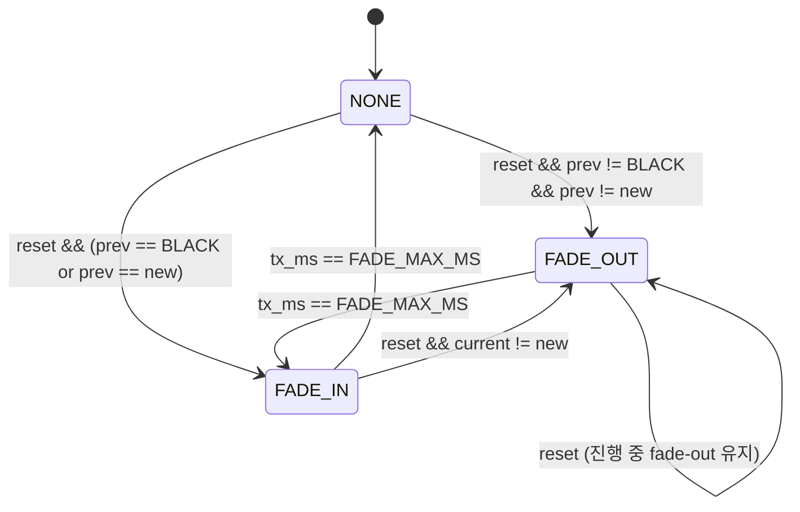

# LED 시스템 기술 문서 — Dimming · 인지 곡선 · LUT

작성자: 김은수
최종 갱신: 2026-04-23

본 문서는 LED 의 **밝기 변조 (dimming)** 엔진 내부를 다룬다. 사람 눈의 비선형 밝기 인지 이론, CIE 1931 L\* 곡선, 256 entry LUT, fade 시간 자동 조정, cross-fade Phase A/B 상태머신까지 포괄.

전체 시스템 레이어와 소스별 규칙은 [`아키텍처 · 운용`](아키텍처%20·%20운용.md) 참조. 색감 (RGB 채널별 cap) 은 [`색감 관리 · 회로 보정`](색감%20관리%20·%20회로%20보정.md) 참조.

---

## 1. 배경 — 사람 눈의 비선형 밝기 인지

### 1.1 왜 선형 PWM 은 부자연스러운가

PWM duty 0 % → 100 % 로 **시간에 대해 선형 증가** 하면, 사람 눈에는 **처음엔 빠르게 밝아지다가 후반은 거의 정체** 된 것처럼 보인다. 선형 duty ≠ 선형 밝기 인지.

원인: 사람 눈의 밝기 인지가 **대수 (logarithmic)** 또는 **거듭제곱 (power)** 함수에 가까워, **약한 빛의 차이에 민감하고 강한 빛의 차이에 둔감**. 이는 환경 적응 (dark→bright adaptation) 을 위해 진화한 생체 메커니즘.

### 1.2 주요 인지 모델

| 모델 | 식 | 발표 |
|---|---|---|
| **Weber-Fechner Law** | 인지 강도 ∝ ln(자극 강도) | 19세기 고전 |
| **Stevens' Power Law** | 밝기 인지 ∝ luminance<sup>0.33</sup> (cube-root) | 1957. 현대 표준에 근접 |
| **CIE 1931 Lightness (L\*)** | Y = ((L+16)/116)<sup>3</sup> (L > 8), Y = L/903.3 (L ≤ 8) | 1931. 색 공간 표준 |

셋 다 "약한 빛에 민감, 강한 빛에 둔감" 을 공통으로 설명. 현대 그래픽·디스플레이 표준은 대부분 CIE L\* 또는 Stevens power law 를 채택.

### 1.3 변환 모델 — 시간 → 인지 → 물리

> **시간 (선형 증가) → perceived brightness (선형) → physical luminance / PWM duty (비선형)**

핵심: 시간을 선형으로 진행하면서 **perceived 값을 직접 선형 산출**, 마지막에 **CIE L\* 역함수** 로 PWM duty 변환.


사용자가 본 fade 는 "시간에 따라 균등히 밝아짐" 으로 인식.

---

## 2. CIE 1931 Lightness (L\*) LUT

### 2.1 생성 공식

```
입력 i: 0~255 (perceived)
   L = i × 100 / 255                    // 0~100 범위로 정규화

   if L > 8:
       Y = ((L + 16) / 116)^3           // 주곡선 (비선형)
   else:
       Y = L / 903.3                    // 저영역 선형 근사

   PWM = round(Y × 255)                 // 0~255 PWM duty
```

CIE L\* 의 두 구간:
- **L > 8** 영역: 주 비선형 곡선 (거듭제곱 3)
- **L ≤ 8** 영역: 선형 근사 (매우 어두운 영역에서 수학적 편의)

### 2.2 실제 LUT 값 (256 entry, `LedOutput.c`)

```c
static const uint8_t k_perceptual_lut[256] = {
      0,   0,   0,   0,   0,   1,   1,   1,   1,   1,   1,   1,   1,   1,   2,   2,
      2,   2,   2,   2,   2,   2,   2,   3,   3,   3,   3,   3,   3,   3,   3,   4,
      /* ... 중략 ... */
    183, 185, 187, 189, 191, 193, 196, 198, 200, 202, 204, 207, 209, 211, 214, 216,
    218, 220, 223, 225, 228, 230, 232, 235, 237, 240, 242, 245, 247, 250, 252, 255,
};
```

핵심 특성:
- **`LUT[0] = 0`**, **`LUT[255] = 255`** — 경계값 보장
- **단조 증가** (monotonic non-decreasing) — 중간 역전 없음
- **저영역 완만**: `LUT[64] = 16` (25% input → 6.3% output)
- **중영역 급증**: `LUT[128] = 72` (50% input → 28% output)
- **고영역 폭증**: `LUT[192] = 157`, `LUT[255] = 255` (75% input → 62%, 100% → 100%)

### 2.3 대표값 요약

| input (perceived) | output (physical PWM) | 비율 |
|---|---|---|
| 0 | 0 | 0% |
| 32 | 4 | ~1.6% |
| 64 | 16 | ~6.3% |
| 128 | 72 | ~28% |
| 192 | 157 | ~62% |
| 255 | 255 | 100% |

→ "사람 눈에 절반 밝기 (perceived 128)" 는 PWM 28% duty 에 해당.

### 2.4 256 entry 인 이유

- `uint8_t` 로 자연스럽게 매핑 (perceived 0~255)
- Flash 256 byte — 임베디드 ROM 부담 미미
- fade 단계가 부드럽도록 (64 entry 면 jumps 발생)
- Python 으로 쉽게 재생성 가능 (§2.1 공식)

---

## 3. Perceived brightness 산출

### 3.1 점멸 패턴 내 perceived (`calc_perceived_pattern`)

점멸 패턴 내 현재 시각 `t` (0 ~ on_ms) 의 perceived 값을 산출한다. Fade-in / peak / fade-out 세 영역으로 구분:

```c
static uint8_t calc_perceived_pattern(uint16_t t, uint16_t on_ms, uint16_t period_ms)
{
    if (period_ms == 0)  return 255;  /* 지속 ON */
    if (t >= on_ms)      return 0;    /* OFF 구간 */

    uint16_t fade_ms = calc_pattern_fade_ms(on_ms);
    if (fade_ms == 0)    return 255;  /* 안전 가드 */

    /* fade-in 영역 */
    if (t < fade_ms)
        return (uint8_t) ((t * 255UL) / fade_ms);

    /* fade-out 영역 */
    if (t >= (uint16_t)(on_ms - fade_ms))
        return (uint8_t) (((on_ms - t) * 255UL) / fade_ms);

    /* 정점 */
    return 255;
}
```

시각적 프로파일:

```
 perceived
 255┤              ┌─────────────┐
    │             ╱│   peak      │╲
    │            ╱ │  (plateau)  │ ╲
    │           ╱  │             │  ╲
    │          ╱   │             │   ╲
   0┤─────────╱    │             │    ╲──────
    │        fade-in           fade-out
    └─────────┴────┴─────────────┴────┴──────── t
    0      fade_ms         on-fade_ms  on_ms
```

**반환값의 의미**: 시간 t 에서 사용자가 보는 perceived brightness (0=검정, 255=최대). 이 값은 이후 CIE L\* LUT 를 거쳐 PWM duty 로 변환됨.

### 3.2 Fade 시간 자동 조정

```c
#define LED_DIMMING_FADE_MAX_MS  15    /* fade 상한 */
#define LED_DIMMING_FADE_DIVISOR 3     /* on_ms / N 룰 */

static uint16_t calc_pattern_fade_ms(uint16_t on_ms)
{
    uint16_t one_third = on_ms / LED_DIMMING_FADE_DIVISOR;
    return (one_third < LED_DIMMING_FADE_MAX_MS) ? one_third : LED_DIMMING_FADE_MAX_MS;
}
```

**두 단계 제한**:
1. `on_ms / 3` — ON 시간의 1/3 를 fade 에 할당 (나머지 1/3 peak, 1/3 fade)
2. `FADE_MAX_MS` cap — 긴 패턴의 fade 무제한 증가 방지

짧은 패턴은 자동으로 fade 축소, 긴 패턴은 상한 적용.

### 3.3 패턴별 실제 fade 분포 (FADE_MAX_MS = 15 기준)

| 패턴 | on_ms | `on/3` | fade (결과) | peak |
|---|---|---|---|---|
| POWER_ON | 180 | 60 | **15** (cap) | 150 |
| POWER_OFF | 180 | 60 | **15** (cap) | 150 |
| MAPPING_ISD_BATT_LOW | 200 | 66 | **15** (cap) | 170 |
| MAPPING_ISD_BATT_READY | 200 | 66 | **15** (cap) | 170 |
| ERROR_\* / OTA_EZAIRO | 180 | 60 | **15** (cap) | 150 |
| PAIR | 500 | 166 | **15** (cap) | 470 |
| OTA_QCC / BATT_CRITICAL | 1100 | 366 | **15** (cap) | 1070 |

모든 패턴에서 fade 15 ms 로 일관. `on_ms ≥ 45 ms` 이면 cap 이 지배.

### 3.4 FADE_MAX_MS = 15 ms 의 설계 근거

**보드 실측 튜닝 과정**:
- 초기: 150 ms → fade 가 길어 LED 가 완전히 밝아지기 전에 꺼짐 (peak 짧음)
- 80 ms → 여전히 "약하게 찍찍" 감 남음 (peak 가 on 시간의 22% 수준)
- 60 ms → 개선되나 부족
- 40 ms → 개선, but POWER_ON on=120 에서 peak 비율 33% 만
- **15 ms → 확정**. 모든 패턴 peak 75~97% 확보, "시원하게 팍 켜지는" 체감

**기준 근거**:
- **눈의 CFF (Critical Flicker Fusion)** ≈ 16 ms (60 Hz) — 이 이하의 brightness 변화는 연속으로 인식
- **fade 15 ms 가 CFF 와 비슷한 경계** → fade 중 PWM step 변화가 개별 깜빡임으로 인식 안 됨
- **peak 시간 충분** → LED 가 max brightness 로 "깔끔하게 켜졌다" 는 체감 확보

**트레이드오프**:
- fade 짧을수록: peak 길어짐 + CFF 이하 체감 부드러움 ↑ / 전환 자연스러움 ↓
- fade 길수록: 전환 부드러움 ↑ / 짧은 패턴 peak 부족 ↓
- 15 ms 는 두 축의 교차점

### 3.5 Perceived → PWM 변환

```c
static uint8_t perceived_to_pwm(uint8_t perceived)
{
    return (uint8_t) (((uint32_t) k_perceptual_lut[perceived] * LED_DIMMING_PWM_STEPS) / 255);
}
```

2단 변환:
1. `k_perceptual_lut[perceived]` — CIE L\* 곡선 적용 → 0~255 물리 duty
2. `× LED_DIMMING_PWM_STEPS / 255` — 실제 PWM 단계 수로 스케일 (현재 `PWM_STEPS = 10`)

결과: `s_led_pwm_on_count` (0~10). LED_OUT 이 PWM 카운터와 비교해 GPIO ON/OFF 결정.

---

## 4. Cross-fade — 색상 전환 처리

### 4.1 왜 필요한가

Arbiter 가 선택한 best 가 변경될 때 (예: `BATT_READY` GREEN → `PAIR` BLUE) **색이 즉시 바뀌면** 시각적으로 끊김이 느껴짐 — "팍! 꺼진 다음 새 색 등장".

Cross-fade 는 이전 색을 **부드럽게 fade-out** 한 후 새 색을 **점진적으로 fade-in** 하는 2 단 전환.

### 4.2 상태머신



**세 상태 의미**:
- **NONE**: 평상시. 점멸 fade (calc_perceived_pattern) 만 적용
- **FADE_OUT**: Phase A. 이전 색을 perceived 255 → 0 감소 출력, `timer_ms` 진행 보류
- **FADE_IN**: Phase B. 새 색을 perceived 0 → 255 증가 출력, 패턴 timer_ms 정상 진행

### 4.3 상태 변수

```c
typedef enum {
    LED_TX_NONE = 0,
    LED_TX_FADE_OUT,
    LED_TX_FADE_IN,
} led_tx_phase_t;

static led_tx_phase_t s_tx_phase      = LED_TX_NONE;
static EN__LED_COLOR  s_tx_prev_color = en__LED_BLACK;  /* Phase A 동안 유지 */
static uint16_t       s_tx_ms         = 0;              /* Phase A/B 진행 시간 */
```

### 4.4 진입 로직 (reset 시)

```c
if (reset)
{
    timer_ms       = 0;
    burst_done_cnt = 0;

    if (s_tx_phase != LED_TX_FADE_OUT)   /* fade-out 중이면 그대로 둠 */
    {
        EN__LED_COLOR new_color = p->color;
        if (LED_outputColor != en__LED_BLACK && LED_outputColor != new_color)
        {
            /* 이전 색 있고 새 색과 다름 → Phase A 시작 */
            s_tx_phase      = LED_TX_FADE_OUT;
            s_tx_prev_color = LED_outputColor;
            s_tx_ms         = 0;
        }
        else
        {
            /* 이전 OFF 였거나 같은 색 → Phase B 직행 */
            s_tx_phase = LED_TX_FADE_IN;
            s_tx_ms    = 0;
        }
    }
}
```

### 4.5 Phase A — 이전 색 fade-out

```c
if (s_tx_phase == LED_TX_FADE_OUT)
{
    LED_outputColor = s_tx_prev_color;   /* 이전 색 유지 */

    uint8_t perceived = (uint8_t) (((LED_DIMMING_FADE_MAX_MS - s_tx_ms) * 255UL)
                                   / LED_DIMMING_FADE_MAX_MS);
    s_led_pwm_on_count = perceived_to_pwm(perceived);

    s_tx_ms++;
    if (s_tx_ms >= LED_DIMMING_FADE_MAX_MS)
    {
        s_tx_phase = LED_TX_FADE_IN;   /* 다음 tick 부터 Phase B */
        s_tx_ms    = 0;
    }
    return;   /* 패턴 진행 (timer_ms++) 는 보류 */
}
```

`LED_outputColor = s_tx_prev_color` 로 이전 색을 계속 출력하면서 perceived 만 감소. `timer_ms` 는 증가 안 함 — 새 패턴은 Phase B 시작 시점부터 카운트.

### 4.6 Phase B — 새 색 fade-in + 패턴 진행

```c
/* 색상 결정 (점멸/지속 ON 분기) */
if (p->period_ms == 0)
    LED_outputColor = p->color;
else
    LED_outputColor = (timer_ms < p->on_ms) ? p->color : en__LED_BLACK;

/* 패턴 내 perceived */
uint8_t perceived = calc_perceived_pattern(timer_ms, p->on_ms, p->period_ms);

/* Phase B fade-in ratio 곱 */
if (s_tx_phase == LED_TX_FADE_IN)
{
    uint8_t fade_in_perc = (uint8_t) ((s_tx_ms * 255UL) / LED_DIMMING_FADE_MAX_MS);
    perceived = (uint8_t) (((uint32_t) perceived * fade_in_perc) / 255);

    s_tx_ms++;
    if (s_tx_ms >= LED_DIMMING_FADE_MAX_MS)
        s_tx_phase = LED_TX_NONE;
}

/* perceived → PWM */
s_led_pwm_on_count = perceived_to_pwm(perceived);

/* 점멸 주기 진행 */
if (p->period_ms != 0)
{
    timer_ms++;
    /* burst 처리 ... */
}
```

두 perceived 값 (패턴 fade + cross-fade ratio) 을 곱셈으로 결합 — 결과 값을 1회만 LUT 에 통과시켜 이중 비선형 누적을 방지.

### 4.7 전체 타임라인 (예: GREEN → BLUE 전환, FADE_MAX = 15)

```
 t=0                    15ms                        30ms        (이후 지속)
  │--- Phase A -----------│--- Phase B ----------------│
     LED_outputColor      LED_outputColor = BLUE
     = GREEN
     perceived 255 → 0     perceived 0 → 255 (새 패턴 진행)
     timer_ms = 0 (멈춤)   timer_ms = 0, 1, 2, ... (정상 진행)
```

### 4.8 예외 케이스

- **이전 색 == BLACK**: Phase A 생략, Phase B 만. 시작 시 즉시 fade-in.
- **같은 색 전환**: Phase A 생략. brightness 만 유지.
- **Phase A 중 새 reset**: 진행 중 fade-out 그대로 끝낸 후 새 색 fade-in (Q1 결정).
- **Phase B 중 새 reset + 다른 색**: 현재 색 fade-out 부터 재시작 (현재 색이 이미 LED_outputColor).

---

## 5. `turnOffLED()` 의 수동 fade-out

ISR arbiter 가 아닌 main loop 에서 호출되는 수동 off 경로. 주로:
- 초기화 직후 ([`initialize.c:179`](../src/2__cm3/Cortex-M3-src/systemControl/initialize.c#L179))
- POWER_ON 패턴 시작 직전 ([`systemControl.c:211`](../src/2__cm3/Cortex-M3-src/systemControl/systemControl.c#L211))
- 절전 진입 후 [`main.c:673`](../src/2__cm3/Cortex-M3-src/main.c#L673)
- sharedMemory 주소 에러 시 while(1) 에러 핸들러

### 5.1 구현

```c
void turnOffLED(void)
{
    s_led_isr_suspended = true;   /* ISR engine 일시 정지 */

    for (uint16_t t = 0; t < LED_DIMMING_FADE_MAX_MS; t++)
    {
        uint8_t perceived = (uint8_t) (((uint32_t)(FADE_MAX_MS - t) * 255UL) / FADE_MAX_MS);
        s_led_pwm_on_count = perceived_to_pwm(perceived);
        LED_OUT();
        delay_ms(1);
    }

    LED_outputColor    = en__LED_BLACK;
    s_led_pwm_on_count = 0;
    LED_OUT();

    s_led_isr_suspended = false;  /* ISR 복귀 */
}
```

### 5.2 안전성

- **ISR 경쟁 방지**: `s_led_isr_suspended` 플래그로 ISR `led_arbiter_tick()` 의 engine 실행을 일시 차단 → main loop 가 `s_led_pwm_on_count`, `LED_outputColor` 를 단독 제어
- **잔상색 제거**: perceived 를 255 → 0 으로 점진 감소. duty 0 도달 후 LED_OUT 이 모든 채널 OFF base 만 실행 → 추가 GPIO 변화 없음
- **`delay_ms(1)`**: `Sys_Delay()` 기반 busy-wait — timer tick 의존 없음. 인터럽트 비활성 상태에서도 동작

---

## 6. 튜닝 가이드

### 6.1 FADE_MAX_MS 변경 시 고려사항

| 값 | 특성 | 용도 |
|---|---|---|
| 5~15 ms | CFF 이하, 부드러운 스텝 / 전환 스냅 | 빠른 알림, 현재 채택 |
| 20~40 ms | 약간 부드러운 전환 | 일반 상태 표시 |
| 50~100 ms | 긴 fade 눈에 띔 | 호흡 효과 (breathing) |
| 150+ ms | 매우 부드러움, but 짧은 패턴에서 peak 짓눌림 | 권장 안 함 (이전 버전) |

### 6.2 DIVISOR 변경 시 (현재 3)

| DIVISOR | 짧은 패턴 효과 | 평가 |
|---|---|---|
| 2 | fade 절반 차지 → peak = 0 (삼각파) | 권장 안 함 |
| **3** | fade 1/3, peak 1/3, fade 1/3 | **현재** — peak 가시성 보장 |
| 4 | fade 1/4, peak 1/2, fade 1/4 | peak 길어짐 / fade 가 더 빨라 끊기는 듯 |
| 5+ | fade 극히 짧음 | 거의 on/off 같은 감 |

### 6.3 PWM_STEPS 해상도 한계

현재 `LED_DIMMING_PWM_STEPS = 10` → 11 단계 밝기만 표현 가능. CIE L\* LUT 가 0~255 출력해도 최종 PWM 은 0~10 으로 양자화됨.

**양자화 영향**:
- `LUT[0..25]` → PWM 0 (~10% 이하 구간)
- `LUT[26..50]` → PWM 1 (10~20% 구간)
- `LUT[51..77]` → PWM 2~3
- ...
- `LUT[230..255]` → PWM 9~10

Fade 중 PWM step 11 회 변화. 각 step 1/11 brightness 점프. **짧은 fade (<15 ms) 에선 CFF 이하 속도라 부드럽게 인식**. 긴 fade 면 개별 step 보임 (기존 "찍찍" 현상).

**해상도 향상 방향** (후속 작업 — 현재 범위 외):
- PWM_STEPS 10 → 100 으로 증가
- 별도 하드웨어 타이머 (TIMER0, 현재 사용 안 함) 를 100 μs ISR 로 설정
- `LED_OUT()` 만 그 ISR 에서 호출, arbiter/engine 은 1 ms CFX 유지
- CPU 부하 추가 ~1% @ 30.72 MHz / ~6% @ 7.68 MHz (감당 가능)
- 장점: 100 단계 밝기 → CIE L\* 곡선이 양자화 없이 그대로 반영

---

## 7. 검증 포인트

### 7.1 정적

- `LUT[0] == 0`, `LUT[255] == 255`, 단조 증가 (256 entry 전부 비감소 확인)
- `calc_pattern_fade_ms(on_ms)` 로직: on_ms/3 ≥ FADE_MAX 면 cap, 아니면 on_ms/3
- `calc_perceived_pattern`: fade-in / peak / fade-out 경계 (t == fade_ms, t == on_ms - fade_ms) 에서 불연속 없음

### 7.2 실기

| 시나리오 | 기대 |
|---|---|
| POWER_ON 버스트 (on=180, fade=15) | 부드러운 fade-in · 150 ms peak · fade-out. "시원하게 팍 켜짐" |
| 색 전환 (GREEN → BLUE) | 30 ms 이내 부드러운 전환, 중간 검정 순간 체감 안 됨 |
| 긴 패턴 (BATT_CRITICAL on=1100, fade=15) | fade 짧고 peak 길게 → 안정적 인식 |
| turnOffLED 호출 | 15 ms fade-out 후 검정 유지. 잔상색 없음 |

### 7.3 육안 주관 평가

- **CFF 체감**: fade 중 step 깜빡임 없는지 (평상 속도 시선)
- **시선 이동 스캐닝**: LED 옆을 시선 이동하며 스트로보 효과 체크
- **조도 대응**: 주간 / 야간 / 어두운 방에서 peak 가시성 확인

---

## 참고 문서

- [`아키텍처 · 운용.md`](아키텍처%20·%20운용.md) — 전체 레이어, arbiter, 패턴, 소스 규칙
- [`색감 관리 · 회로 보정.md`](색감%20관리%20·%20회로%20보정.md) — 채널별 cap, 색상별 cap, 튜닝

## 참고 링크 (외부)

- [Relative luminance — Wikipedia](https://en.wikipedia.org/wiki/Relative_luminance) — CIE L\* 공식
- [Stevens' power law — Wikipedia](https://en.wikipedia.org/wiki/Stevens%27s_power_law) — 인지 지수 법칙
- [Weber–Fechner law — Wikipedia](https://en.wikipedia.org/wiki/Weber%E2%80%93Fechner_law) — 로그 인지 법칙
- [Convert LED brightness to PWM value based on CIE 1931 curve (mathiasvr gist)](https://gist.github.com/mathiasvr/19ce1d7b6caeab230934080ae1f1380e) — 256 entry LUT 레퍼런스 구현
- [Controlling LED Brightness Using PWM — mbedded.ninja](https://blog.mbedded.ninja/programming/firmware/controlling-led-brightness-using-pwm/) — 임베디드 LED 디밍 실무
- [LED Brightness to your eye, Gamma correction — HP LED Shield](https://ledshield.wordpress.com/2012/11/13/led-brightness-to-your-eye-gamma-correction-no/) — gamma 2.2 vs CIE L\* 비교
