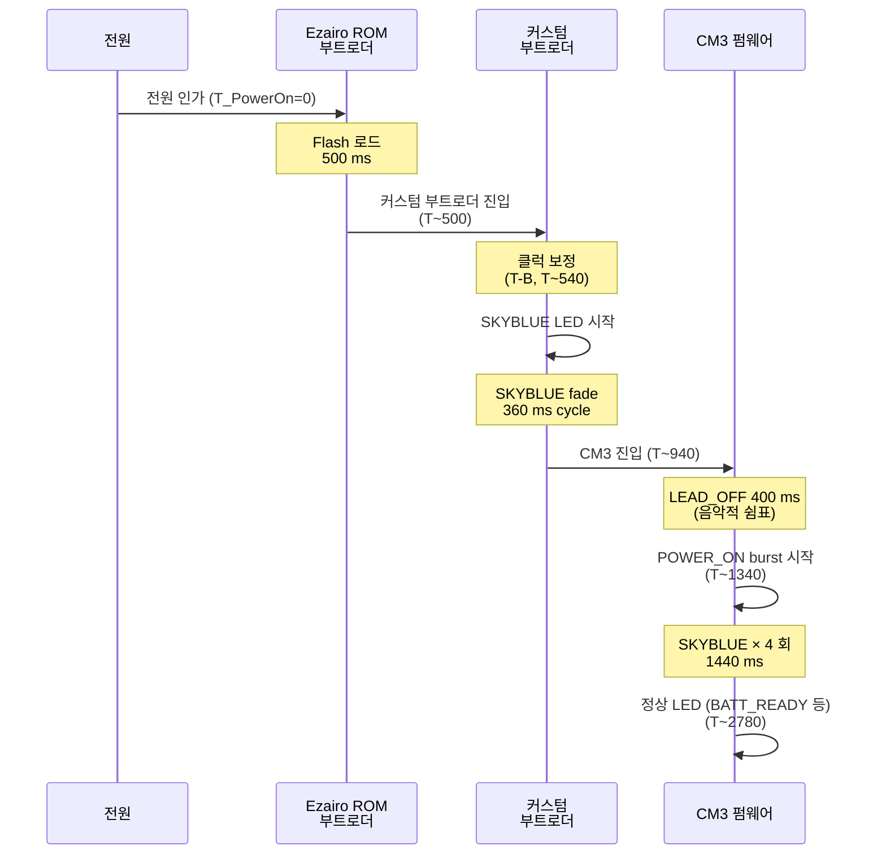

# [Sound1] Ezairo LED 패턴 사양 Rev.0

**작성**: 김은수
**모델**: Sound1 (E8300, TD20B)
**적용 범위**: Ezairo 기반 펌웨어 (Bootloader + CM3)
**Rev.0**: 2026-05-07 — 초안

---

## 목차

1. [개요](#1-개요)
2. [전체 부팅·종료 타임라인](#2-전체-부팅종료-타임라인)
3. [부트로더 단계 LED](#3-부트로더-단계-led)
4. [인계 gap (음악적 쉼표)](#4-인계-gap-음악적-쉼표)
5. [CM3 LED 패턴 카탈로그](#5-cm3-led-패턴-카탈로그)
6. [상태 전환 모델](#6-상태-전환-모델)
7. [우선순위 (arbiter)](#7-우선순위-arbiter)
8. [시각 시나리오](#8-시각-시나리오)
9. [디밍 (perceived → PWM)](#9-디밍-perceived--pwm)
10. [HW 매핑](#10-hw-매핑)
- [부록 A. 매크로 정의](#부록-a-매크로-정의)
- [부록 B. 코드 위치](#부록-b-코드-위치)
- [부록 C. 변환 가이드 (PPT/엑셀/워드)](#부록-c-변환-가이드-pp t엑셀워드)
- [참고 문서](#참고-문서)
- [개정 이력](#개정-이력)

---

## 1. 개요

### 1.1 두 단계 사용자 피드백 모델

전원 인가 ~ 정상 운용 도달까지 약 1.4 초의 부팅 시간이 있다. 이 시간 동안 사용자가 "전원이 켜졌다" 를 빨리 인지하도록 LED 가 **두 단계** 로 응답한다:

```
1단계: 부트로더 SKYBLUE fade   (전원 인가 후 ~540 ms 부터 360 ms)
       → "켜지기 시작했다" 신호
2단계: CM3 POWER_ON burst       (CM3 부팅 후 4 회 깜빡임)
       → "정상 부팅 완료" 신호
```

두 단계 사이에는 **음악적 쉼표** (~440 ms OFF) 로 시각적 분리감 보전.

### 1.2 색상·시퀀스 설계 원칙

| 원칙 | 적용 |
|---|---|
| 명확한 시퀀스 시작·종료는 _쉼표_ 로 분리 | POWER_ON / POWER_OFF 진입 시 LEAD_OFF 400 ms |
| 연속 정보 갱신은 _부드러운 cross-fade_ | LED 상태 전환 시 60 ms FADE_OUT + 60 ms FADE_IN |
| 점멸 패턴 매 cycle 은 _산뜻한 fade_ | ON 시작/종료 fade 30 ms (cap) |
| 사람 눈 인지 균등 변화 | CIE Lightness LUT 기반 디밍 |
| burst 회수는 4 회로 대칭 | POWER_ON / POWER_OFF 모두 4 회 |
| 색상 의미 일관 | RED=에러, GREEN=정상, BLUE=BLE/매핑, ORANGE=주의, SKYBLUE=부팅, PURPLE=배터리저+매핑 |

### 1.3 적용 매크로 한눈에

| 매크로 | 값 | 의미 |
|---|---|---|
| `TDC_BOOT_LED_T_TOTAL_MS` | 360 ms | 부트로더 cycle (FADE_IN 30 + PEAK 300 + FADE_OUT 30 + OFF 0) |
| `LED_DIMMING_TX_FADE_MS` | 60 ms | LED 상태 _전환_ cross-fade (1 회) |
| `LED_DIMMING_FADE_MAX_MS` | 30 ms | 점멸 패턴 매 cycle 내부 fade cap |
| `LED_POWER_LEAD_OFF_MS` | 400 ms | POWER_ON / POWER_OFF 진입 직전 leading OFF (음악적 쉼표) |
| `LED_DIMMING_PWM_STEPS` | 10 | PWM 분해능 (1 ms × 10 = 100 Hz) |

---

## 2. 전체 부팅·종료 타임라인

### 2.1 부팅 시퀀스 (전원 인가 → 정상 운용)



### 2.2 절대 시간 차트

```
T_PowerOn (ms)
  0       500      540      900    940    1340                                                    2780
  │        │        │        │      │      │                                                        │
  ▼        ▼        ▼        ▼      ▼      ▼                                                        ▼
  ┌────────┐                                                                                        
  │  ROM   │                                                                                        
  │ 500 ms │ 부트로더    ┌────────────────────┐                                                     
  └────────┘  진입       │  부트로더 SKYBLUE   │                                                     
              & 클럭     │  띠--- (360 ms)     │ ── 부트로더 잔여 ~40 ms ──                          
              보정       │  fade-in 30 ms     │                                                     
              (~40 ms)   │  + peak  300 ms    │                                                     
                         │  + fade-out 30 ms  │                                                     
                         │  + OFF 0 ms        │                                                     
                         └────────────────────┘                                                     
                                               │ CM3 진입                                           
                                               │ LEAD_OFF                                           
                                               │ 400 ms (쉼표)                                      
                                               │                                                   
                                               ┌────┐ ┌────┐ ┌────┐ ┌────┐                         
                                               │ON  │ │ON  │ │ON  │ │ON  │ → 정상 LED              
                                               │180 │ │180 │ │180 │ │180 │   (BATT_READY)          
                                               └────┘ └────┘ └────┘ └────┘                         
                                                  │  OFF │  OFF │  OFF │  OFF                      
                                                  │  180 │  180 │  180 │  180                      
                                                  └──────┴──────┴──────┴──────                     
                                                  POWER_ON SKYBLUE × 4 (1440 ms)
```

**총 부팅 시퀀스 (전원 인가 → POWER_ON 종료)**: 약 2.78 초

### 2.3 종료 시퀀스 (POWER_OFF 명령 → BLACK)

전제: 정상 운용 중 (예: BATT_READY 녹색 지속 ON) 사용자 전원 OFF 명령.

```
시간 (상대, ms)
  0    60     460                                             1900                  
  │    │      │                                                 │                   
  ▼    ▼      ▼                                                 ▼                   
  ┌─────┐                                                                           
  │GRN  │ FADE_OUT 60 ms  (녹색 perceived 255 → 0)                                  
  │지속 │ (cross-fade)                                                              
  └─────┘                                                                           
        ┌──────┐                                                                    
        │BLACK │ LEAD_OFF 400 ms (음악적 쉼표)                                      
        └──────┘                                                                    
               ┌────┐ ┌────┐ ┌────┐ ┌────┐                                          
               │ON  │ │ON  │ │ON  │ │ON  │ → BLACK (sleep 진입)                     
               │180 │ │180 │ │180 │ │180 │                                          
               └────┘ └────┘ └────┘ └────┘                                          
                  │  OFF │  OFF │  OFF │  OFF                                       
                  │  180 │  180 │  180 │  180                                       
                  └──────┴──────┴──────┴──────                                      
                  POWER_OFF BLUE × 4 (1440 ms)
```

**총 종료 시퀀스**: 약 1.9 초.

---

## 3. 부트로더 단계 LED

### 3.1 패턴

| 항목 | 값 |
|---|---|
| 색상 | SKYBLUE (G:B = 30:40) |
| FADE_IN | 30 ms (perceived 0 → 255 선형) |
| PEAK | 300 ms (perceived 255 유지) |
| FADE_OUT | 30 ms (perceived 255 → 0 선형) |
| OFF | 0 ms (cycle 종료 즉시) |
| **TOTAL** | **360 ms** |
| 반복 | 1 회 (cycle 종료 후 즉시 CM3 진입) |

### 3.2 점등 시점 (T-B)

부트로더 진입 직후가 아니라 **클럭 30.72 MHz 보정 직후** (`Sys_Trims_SetOperatingFrequency()` 호출 직후) 에 LED 시작.

```
부트로더 시작 (T_PowerOn ~500)
  ↓
NVMReadBytes (manufacturing table 256 byte 읽기, 수십 ms)
  ↓
Sys_Trims_LoadManuTable + 전압 트림
  ↓
Sys_Trims_SetOperatingFrequency(30.72 MHz)  ← T-B
  ↓
[여기서] tdc_boot_led_init() + tdc_boot_led_start()
```

**왜 T-B 인가**: T-A (시작 직후) 시 클럭이 7.68 → 30.72 MHz 로 4 배 빨라지므로 fade 시간이 1/4 로 단축되어 패턴이 깨진다. T-B 이후엔 클럭 안정.

### 3.3 SW PWM 동작

- **타이머**: Timer2 (CM3 가 Timer3 점유, Timer2 미점유)
- **ISR 주기**: 25 µs (40 kHz, 100 bin × 25 µs = 2.5 ms PWM 주기 = 400 Hz)
- **분해능**: 100 단계 (PWM bin)
- **1 ms tick**: ISR 40 회 마다 phase 카운터 증가

### 3.4 종료

부트로더 메인 작업 종료 (`bootloader_boot_cm3()` 호출 직전) 에서 `bli_get_total_elapsed_ms() >= 360` 까지 wait → `tdc_boot_led_stop()` (Timer2 정지 + NVIC disable + GPIO LOW) → CM3 점프.

부트로더 메인 작업이 360 ms 보다 _빨리_ 끝나면 cycle 종료까지 wait, _늦게_ 끝나면 작업 끝나는 시점에 즉시 CM3 진입 (LED 는 이미 OFF 상태).

---

## 4. 인계 gap (음악적 쉼표)

### 4.1 구성

부트로더 LED OFF 시작 ~ CM3 POWER_ON FADE_IN 시작 사이의 OFF 시간:

| 구간 | 시간 | 비고 |
|---|---|---|
| 부트로더 LED OFF 시작 (cycle 종료) | 0 (기준) | LED 가 BLACK |
| 부트로더 자체 잔여 작업 | ~40 ms | bootloader_boot_cm3 호출까지 |
| CM3 main 진입 | ~40 ms | t3_tick = 0 |
| CM3 LED_TX_LEAD_OFF wait | 40 ~ 440 ms | `LED_POWER_LEAD_OFF_MS = 400 ms` |
| POWER_ON FADE_IN 시작 | ~440 ms | 음악적 쉼표 종료 |
| **총 OFF gap** | **~440 ms** | burst 내부 OFF (180 ms) 의 약 2.4 배 |

### 4.2 설계 의의

- **시각적 분리감**: 부트로더 띠--- (1 회) 와 CM3 burst (4 회) 가 같은 깜빡임 시퀀스로 인식되지 않도록
- **음악적 비유**: 167 BPM (burst 360 ms 1 cycle 기준) 에서 약 1 박자 휴식
- **사람 눈 인지 한계**: 명확한 OFF 인지 ≥ 200 ms (그 이하는 잔상에 가려짐). 440 ms 는 충분한 여유

### 4.3 사용자 인지

```
띠---            ___           띠 이 띠 이 띠 이 띠 이
(부트로더)     (쉼표)         (CM3 burst 4 회)
360 ms       ~440 ms          1440 ms
```

---

## 5. CM3 LED 패턴 카탈로그

### 5.1 패턴 표

| ID | 상태 | 색상 | ON | OFF | burst | 우선순위 | source | 의미 |
|---|---|---|---|---|---|---|---|---|
| 1 | LED_ST_POWER_OFF | BLUE | 180 | 180 | 4 | **100** | POWER | 종료 시퀀스 (게이트) |
| 2 | LED_ST_POWER_ON | SKYBLUE | 180 | 180 | 4 | 95 | POWER | 부팅 시퀀스 (게이트) |
| 3 | LED_ST_ERROR_MAP | RED | 180 | 180 | ∞ | 90 | ERROR | 매핑 데이터 에러 |
| 4 | LED_ST_ERROR_MCU | RED | 180 | 180 | ∞ | 90 | ERROR | MCU 에러 |
| 5 | LED_ST_ERROR_ACCEL | RED | 180 | 180 | ∞ | 90 | ERROR | 가속도 센서 에러 |
| 6 | LED_ST_ERROR_FPGA | RED | 180 | 180 | ∞ | 90 | ERROR | FPGA 에러 |
| 7 | LED_ST_ERROR_PMIC | RED | 180 | 180 | ∞ | 90 | ERROR | RF/PMIC 에러 |
| 8 | LED_ST_OTA_QCC | GREEN | 1100 | 1100 | ∞ | 80 | BLE_IND | QCC OTA 진행 (느린 점멸) |
| 9 | LED_ST_OTA_EZAIRO | GREEN | 180 | 180 | ∞ | 80 | BLE_IND | Ezairo OTA 진행 (빠른 점멸) |
| 10 | LED_ST_MAPPING_ISD_BATT_READY | BLUE | 200 | 800 | ∞ | 75 | MAPPING | 매핑 (배터리 OK + ISD 연결) |
| 11 | LED_ST_MAPPING_NO_ISD_BATT_READY | BLUE | ∞ | 0 | ∞ | 75 | MAPPING | 매핑 (배터리 OK + ISD 미연결) — 지속 ON |
| 12 | LED_ST_MAPPING_ISD_BATT_LOW | PURPLE | 200 | 800 | ∞ | 75 | MAPPING | 매핑 (배터리 LOW + ISD 연결) |
| 13 | LED_ST_MAPPING_NO_ISD_BATT_LOW | PURPLE | ∞ | 0 | ∞ | 75 | MAPPING | 매핑 (배터리 LOW + ISD 미연결) — 지속 ON |
| 14 | LED_ST_PAIR | BLUE | 500 | 500 | ∞ | 70 | BLE_IND | BLE 페어링 모드 (+1000 ms latch) |
| 15 | LED_ST_BATT_CRITICAL | ORANGE | 1100 | 1100 | ∞ | 60 | BATTERY | 배터리 위험 임계 |
| 16 | LED_ST_IN_USE | WHITE | ∞ | 0 | ∞ | 40 | ISD | ISD 통신 활성 — 지속 ON |
| 17 | LED_ST_BATT_READY | GREEN | ∞ | 0 | ∞ | 30 | BATTERY | 배터리 정상 — 지속 ON |
| 18 | LED_ST_BATT_MID | ORANGE | ∞ | 0 | ∞ | 20 | BATTERY | 배터리 중간 — 지속 ON |
| 19 | LED_ST_IDLE | (BLACK) | - | - | - | 10 | (default) | 어떤 src 도 요청 없음 |
| 20 | LED_ST_NONE | (BLACK) | - | - | - | 0 | (clear) | 명시적 해제 |

ON·OFF 단위는 ms. ON `∞` + OFF 0 = 지속 ON (점멸 없음). burst `∞` = 무한 반복, `4` = 4 회 반복 후 자가 해제.

### 5.2 색상 정의

각 색상의 _실제 PWM duty 비율_ (R / G / B, 0~100%) 은 `k_led_mix[]` ([`LedOutput.c`](../../../src/2__cm3/Cortex-M3-src/systemControl/LedOutput.c) 의 색감·광량 보정 값) 기준:

| 색 | R % | G % | B % | 보정 의도 |
|---|---|---|---|---|
| BLACK | 0 | 0 | 0 | OFF |
| RED | 100 | 0 | 0 | 1.0× 기준 |
| GREEN | 0 | **50** | 0 | G 채널이 체감상 더 밝음 → 2× 감쇠 보정 |
| BLUE | 0 | 0 | 100 | 1.0× 기준 |
| ORANGE | **80** | **10** | 0 | R 우세 + G 최소화 → 노랑이 아닌 주황 색감 |
| SKYBLUE | 0 | **30** | **40** | 원 SKYBLUE 가 최고 밝음 → 총 광량 감쇠 |
| PURPLE | **50** | 0 | **50** | 총 광량 감쇠 (다른 색과 밝기 균형) |
| WHITE | **30** | **30** | **30** | G 비중 동등화로 연보라 색감 제거 + 광량 감쇠 |

→ duty 값은 _이상적 RGB 100% 합성_ 이 아니라 **회로 단 LED 종류별 색감·광량 차이를 보정한 실측 결과**. 같은 PWM duty 100% 일 때 G 가 R/B 보다 밝게 보이는 현상 등을 사람 눈 체감 균등으로 맞춘 값.

상세 색감 보정 결정 과정은 [`색감 관리 · 회로 보정.md`](색감%20관리%20·%20회로%20보정.md) 참조.

### 5.3 source 분류

LED 요청은 6 개 source 가 각자 1 패턴 보유:

| source | 담당 패턴 |
|---|---|
| LED_SRC_POWER | POWER_ON / POWER_OFF |
| LED_SRC_ERROR | ERROR_* (5 종) |
| LED_SRC_BLE_IND | PAIR / OTA_QCC / OTA_EZAIRO |
| LED_SRC_MAPPING | MAPPING_* (4 종) |
| LED_SRC_BATTERY | BATT_CRITICAL / BATT_MID / BATT_READY |
| LED_SRC_ISD | IN_USE |

각 source 안에서 _마지막_ 요청만 유효 (이전 요청 덮어씀). source 간 충돌은 우선순위로 해결 (§7).

---

## 6. 상태 전환 모델

LED 상태 전환은 3 가지 phase 로 처리됨 (`s_tx_phase` 상태 머신):

```
NONE      평상시 (점멸 패턴 fade-in/out 만 적용)
FADE_OUT  이전 색을 perceived 255 → 0 으로 감소 (60 ms, timer_ms 진행 보류)
LEAD_OFF  POWER_ON / POWER_OFF 진입 시 leading OFF (400 ms, timer_ms 보류)
FADE_IN   새 색을 perceived 0 → 255 로 증가 (60 ms, 패턴 진행 정상)
```

### 6.1 Cross-fade (LED 상태 _전환_ 시 1 회)

```
이전 색 perceived 255 ────FADE_OUT 60 ms────► 0 (BLACK)
                                                ↓
새 색 perceived          0 ◄────FADE_IN 60 ms──── 255 (또는 패턴값)
```

- **시간 매크로**: `LED_DIMMING_TX_FADE_MS = 60 ms` (FADE_OUT 60 + FADE_IN 60 = 총 전이 120 ms)
- **적용**: 모든 LED 상태 변경 시 1 회. 이전 색 = BLACK 인 경우 FADE_OUT 생략, FADE_IN 직행.
- **timer_ms 진행 보류**: cross-fade 동안 점멸 패턴의 timer_ms 는 0 에 고정 (FADE_IN 끝부터 패턴 정상 진행).

### 6.2 점멸 패턴 매 cycle 내부 fade

점멸 패턴 (예: BATT_CRITICAL ON 1100 / OFF 1100) 의 매 cycle 내부 ON 시작·종료 fade:

```
ON 1100 ms 분포:
  fade-in 30 ──peak 1040 ──fade-out 30 ── 다음 cycle OFF 시작
```

- **시간 매크로**: `LED_DIMMING_FADE_MAX_MS = 30 ms` (cap), `LED_DIMMING_FADE_DIVISOR = 3` (자동 계산: on_ms / 3, cap to MAX)
- **적용**: period_ms != 0 인 모든 점멸 패턴 매 cycle

각 패턴 내부 fade 분포:

| 패턴 | ON | fade (자동) | peak |
|---|---|---|---|
| BATT_CRITICAL | 1100 | 30 (cap) | 1040 |
| OTA_QCC | 1100 | 30 (cap) | 1040 |
| PAIR | 500 | 30 (cap) | 440 |
| MAPPING_ISD_* | 200 | 30 (200/3=66, cap to 30) | 140 |
| OTA_EZAIRO | 180 | 30 (cap) | 120 |
| ERROR_* | 180 | 30 (cap) | 120 |
| POWER_ON / POWER_OFF | 180 | 30 (cap) | 120 |

(MAPPING_NO_ISD_*, IN_USE, BATT_READY, BATT_MID 는 지속 ON 이라 fade 없음.)

### 6.3 LEAD_OFF (POWER_ON / POWER_OFF 진입 시 음악적 쉼표)

```
이전 색 ──FADE_OUT 60 ms──► BLACK ──LEAD_OFF 400 ms 유지──► POWER FADE_IN 60 ms ──► burst 시작
```

- **시간 매크로**: `LED_POWER_LEAD_OFF_MS = 400 ms`
- **적용**: `LED_ST_POWER_ON`, `LED_ST_POWER_OFF` 진입 시
- POWER_ON 첫 진입 시 이전 색 = BLACK 이라 FADE_OUT 생략, LEAD_OFF 직행
- POWER_OFF 진입 시 보통 직전 색 (BATT/IN_USE 등) 이 켜져 있으므로 FADE_OUT 후 LEAD_OFF

전환 흐름:
```
reset 분기:
  if   (FADE_OUT 진행 중)  → 그대로 둠
  elif (이전 색 켜짐 ∧ 새 색 다름)  → FADE_OUT 진입
  elif (POWER_ON ∨ POWER_OFF)       → LEAD_OFF 진입
  else                              → FADE_IN 직행

FADE_OUT 종료 시:
  if   (POWER_ON ∨ POWER_OFF)  → LEAD_OFF 진입
  else                          → FADE_IN 진입

LEAD_OFF 종료 시: → FADE_IN 진입
FADE_IN 종료 시:  → NONE (패턴 정상 진행)
```

---

## 7. 우선순위 (arbiter)

매 LED arbiter tick (1 ms) 마다 6 개 source 의 요청 중 _가장 높은 우선순위_ 패턴 선택 → engine 으로 전달.

### 7.1 우선순위 표

```
우선순위
   100  POWER_OFF                    ← 최우선 (사용자 종료 의도)
    95  POWER_ON                     ← 부팅 신호
    90  ERROR_* (5 종)               ← 시스템 에러
    80  OTA_QCC / OTA_EZAIRO         ← OTA 진행
    75  MAPPING_* (4 종)             ← 매핑 진행
    70  PAIR                         ← BLE 페어링
    60  BATT_CRITICAL                ← 배터리 위험
    40  IN_USE                       ← ISD 통신 활성
    30  BATT_READY                   ← 정상
    20  BATT_MID                     ← 중간
    10  IDLE                         ← 어떤 src 도 요청 없음
     0  NONE                         ← 명시적 해제
```

### 7.2 동시 요청 처리 예

**예 1**: BATT_READY (녹) + IN_USE (백) 동시 활성
- IN_USE 우선순위 40 > BATT_READY 30
- → **WHITE 지속 ON** 표시

**예 2**: PAIR (파 점멸) + BATT_CRITICAL (노 점멸) 동시 활성
- PAIR 우선순위 70 > BATT_CRITICAL 60
- → PAIR 패턴 (BLUE ON 500 / OFF 500) 표시. BATT_CRITICAL 은 PAIR 종료 후 자동 표시.

**예 3**: 부팅 직후 POWER_ON 진행 중 BATT 갱신
- POWER_ON 95 > BATT_* 모두
- → POWER_ON 4 회 burst 끝까지 진행. burst 자가 해제 후 BATT 패턴 표시.

### 7.3 특수 처리

| 항목 | 동작 |
|---|---|
| **사용자 LED off 모드** (`readLED_indicatorOnOff() == 2`) | ERROR / POWER_ON / POWER_OFF 외 모든 패턴 억제 (안전 알림은 유지) |
| **PAIR latch** | PAIR 해제 요청 후도 `s_pair_latch_until_tick` 까지 (~1000 ms) PAIR 유지 → 짧은 시점 해제·재요청 시 깜빡임 방지 |
| **burst 자가 해제** | POWER_ON / POWER_OFF 가 4 회 burst 종료 시 src 가 자동으로 NONE 으로 reset |
| **burst 진행 중 race 회피** | `s_tdc_burst_pending` flag — burst 진행 중에는 systemControl 의 burst 종료 검출 race 방지 |

---

## 8. 시각 시나리오

각 시나리오의 ASCII timeline + 설명. 시간 단위는 ms.

### 8.1 정상 부팅

```
T_PowerOn:  0       500   540    900    940      1340                                          2780
            │        │     │      │      │        │                                              │
            ▼        ▼     ▼      ▼      ▼        ▼                                              ▼
            ┌────────┐                                                                            
            │ ROM    │ BL   ┌──────────┐                                                          
            │ 500 ms │ 진입 │ SKYBLUE  │                                                          
            └────────┘ &    │ fade 360 │  ──── 잔여 + LEAD_OFF 440 ──────                         
                       클럭 │   ms     │                                                          
                       보정 └──────────┘                                                          
                                                                ┌────┐ ┌────┐ ┌────┐ ┌────┐  →   
                                                                │SKB │ │SKB │ │SKB │ │SKB │  BATT_
                                                                │180 │ │180 │ │180 │ │180 │  READY
                                                                └────┘ └────┘ └────┘ └────┘   (녹)
                                                                   180   180   180   180
```

색상 흐름:
```
OFF (500) → SKYBLUE (360) → OFF (440) → SKYBLUE × 4 (1440) → GREEN (지속)
```

### 8.2 정상 종료

전제: BATT_READY (녹색 지속 ON) → 사용자 전원 OFF 명령

```
시간(상대):  0    60     460                                            1900
            │    │      │                                                 │
            ▼    ▼      ▼                                                 ▼
            ┌─────┐                                                       
            │GRN  │ FADE_OUT 60 (perceived 255→0)                         
            └─────┘                                                       
                  ┌──────┐                                                
                  │BLACK │ LEAD_OFF 400 (음악적 쉼표)                     
                  └──────┘                                                
                         ┌────┐ ┌────┐ ┌────┐ ┌────┐                      
                         │BLU │ │BLU │ │BLU │ │BLU │ → BLACK (sleep)      
                         │180 │ │180 │ │180 │ │180 │                      
                         └────┘ └────┘ └────┘ └────┘                      
                            180   180   180   180
```

### 8.3 배터리 변화 (READY → MID → CRITICAL)

```
                cross-fade 60+60                cross-fade 60+60
GREEN 지속 ON ────────────────► ORANGE 지속 ON ────────────────► ORANGE ON 1100/OFF 1100 점멸
(BATT_READY)                    (BATT_MID)                       (BATT_CRITICAL)
prio 30                         prio 20                          prio 60
```

주의: BATT_MID 우선순위 (20) 가 BATT_READY (30) 보다 _낮은_ 이유는 BATT_MID 가 _덜 시급한 상태_ 의미 (배터리 중간이면 표시 우선순위가 낮아도 됨, 정상 BATT_READY 와 충돌 시 READY 가 우선).

```
실제 BATT 변화 시퀀스 (정상 운용 동안):
  BATT_READY (녹 지속) ─→ [BATT 가 READY → MID 갱신]
  → src=BATTERY 가 MID 로 갱신 → arbiter 가 best=MID 선택 (다른 src 요청 없을 시)
  → cross-fade 60+60 → ORANGE 지속

  BATT_MID (주황 지속) ─→ [BATT 가 MID → CRITICAL 갱신]
  → src=BATTERY 가 CRITICAL 로 갱신 → arbiter best=CRITICAL (prio 60)
  → cross-fade 60+60 → ORANGE 점멸 (1100 ON / 1100 OFF)
```

### 8.4 매핑 진입·종료

진입 (BATT_READY → MAPPING_ISD_BATT_READY):
```
GREEN 지속 ON ──cross-fade 60+60──► BLUE ON 200 / OFF 800 점멸 (1 cycle 1000 ms, 무한)
```

종료 (MAPPING 해제 → BATT 로 복귀):
```
BLUE 점멸 ──cross-fade 60+60──► GREEN 지속 ON
```

매핑 4 종 분화 (배터리 LOW 임계 + ISD 연결 여부):

```
        ISD 연결 (점멸)         ISD 미연결 (지속 ON)
배터리 OK   BLUE 200/800 점멸    BLUE 지속 ON
배터리 LOW  PURPLE 200/800 점멸   PURPLE 지속 ON
```

### 8.5 페어링

```
이전 색 ──cross-fade 60+60──► BLUE ON 500 / OFF 500 점멸 (무한)
                              (1 cycle 1000 ms)
```

PAIR latch 동작:
```
PAIR 활성 → BLE 응답 → PAIR 해제 요청 (예: 페어 완료)
  ↓
PAIR 패턴은 즉시 사라지지 않고 latch (1000 ms) 동안 BLUE 점멸 유지
  ↓
짧은 시간 안에 PAIR 재요청 시 → 깜빡임 없이 자연 유지
  ↓
latch 만료 → PAIR 종료 → 다음 best 패턴 (BATT 등)
```

### 8.6 OTA

OTA QCC (느린 점멸):
```
이전 색 ──cross-fade──► GREEN ON 1100 / OFF 1100 (무한)
                       1 cycle 2200 ms
```

OTA Ezairo (빠른 점멸):
```
이전 색 ──cross-fade──► GREEN ON 180 / OFF 180 (무한)
                       1 cycle 360 ms
```

두 OTA 패턴은 우선순위 동일 (80) — 마지막 요청만 유효.

### 8.7 에러 표시

```
이전 색 ──cross-fade──► RED ON 180 / OFF 180 (무한)
                       1 cycle 360 ms
```

에러 5 종 (MAP, MCU, ACCEL, FPGA, PMIC) 모두 _동일 패턴_ — 색·시간이 같아 종류 구분은 다른 진단 방법 필요. 우선순위 90 으로 ERROR 외 거의 모든 패턴 차단 (단 POWER_OFF, POWER_ON 만 ERROR 보다 우선).

---

## 9. 디밍 (perceived → PWM)

LED 점등 시 사람 눈은 _밝기를 비선형_ 으로 인지한다. 시간에 따라 _균등하게_ 보이는 변화를 위해 **CIE 1931 Lightness LUT** 적용.

### 9.1 변환 흐름

```
입력: perceived brightness 0 ~ 255  (시간에 비례 선형 증가)
   ↓
LUT: CIE L* → relative luminance Y (감마 곡선)
   ↓
출력: PWM duty 0 ~ LED_DIMMING_PWM_STEPS (= 10)
```

### 9.2 LUT 핵심 값

| perceived | PWM duty | 비고 |
|---|---|---|
| 0 | 0 | OFF |
| 64 (25%) | 5 | 약 5% (사람 눈에는 25% 처럼) |
| 128 (50%) | 18 | 약 18% (사람 눈에는 50% 처럼) |
| 192 (75%) | 50 | 약 50% (사람 눈에는 75% 처럼) |
| 255 (100%) | 255 | 100% |

→ 시간에 따라 perceived 를 _선형 증가_ 하면 사람 눈은 _균등 변화_ 로 인식.

### 9.3 PWM 주기

- LED_DIMMING_PWM_STEPS = 10 step
- 1 ms × 10 = 10 ms 주기 = **100 Hz**
- 사람 눈 flicker fusion (~60 Hz) 보다 빠르므로 깜빡임 인지 X

상세 LUT 표 + 인지 곡선은 [`Dimming · 인지 곡선 · LUT.md`](Dimming%20·%20인지%20곡선%20·%20LUT.md) 참조.

---

## 10. HW 매핑

### 10.1 GPIO 핀

| 색 채널 | 부트로더 핀 명 | DIO | 공유 |
|---|---|---|---|
| R | `DIO_NUM_LED_R_UART_TX_E8300` | DIO 8 | UART TX 와 공유 |
| G | `DIO_NUM_LED_G_UART_RX_E8300` | DIO 15 | UART RX 와 공유 |
| B | `DIO_NUM_LED_B` | DIO 12 | 공유 없음 |

UART 활성 시 R/G 핀 점유 → LED R/G 사용 불가. 본 시스템은 디폴트 UART 비활성 (디버그 시에만 활성).

### 10.2 출력 모드

| 항목 | 값 |
|---|---|
| 출력 모드 | GPIO_OUT |
| 극성 | **active HIGH** (`LED_IS_ACTIVELOW` 미정의) |
| 드라이브 강도 | 1X |
| 풀업·풀다운 | NO_PULL (회로 단의 풀다운 가정) |
| Low-pass filter | ENABLE |

### 10.3 자연 OFF 보장

전원 인가 직후 모든 GPIO = `DIO_MODE_DISABLE` (hi-Z). 회로 단 풀다운으로 LED 자연 OFF. 부트로더 LED init 시 `Sys_GPIO_Set_Low()` 후 `Sys_DIO_Config()` 호출 순서로 _OFF 상태에서_ 활성화 → 스파이크 없음.

---

## 부록 A. 매크로 정의

### A.1 부트로더 (`src/0__bootloader/source/led/tdc_boot_led.c`)

```c
#define TDC_BOOT_LED_T_FADE_IN_MS     30   /* fade-in 30 ms */
#define TDC_BOOT_LED_T_PEAK_MS        300  /* peak 300 ms */
#define TDC_BOOT_LED_T_FADE_OUT_MS    30   /* fade-out 30 ms */
#define TDC_BOOT_LED_T_OFF_MS         0    /* OFF 0 ms (CM3 자연 흡수) */
#define TDC_BOOT_LED_T_TOTAL_MS       360  /* cycle 360 ms */

#define TDC_BOOT_LED_PWM_RESOLUTION   100  /* PWM 100 단계 */
#define TDC_BOOT_LED_ISR_PER_MS       40   /* ISR 40 회 = 1 ms */
#define TDC_BOOT_LED_DUTY_G_MAX       30   /* SKYBLUE G duty 30% */
#define TDC_BOOT_LED_DUTY_B_MAX       40   /* SKYBLUE B duty 40% */
```

### A.2 CM3 (`src/2__cm3/Cortex-M3-src/systemControl/LedOutput.c`)

```c
#define LED_DIMMING_FADE_MAX_MS  30   /* 점멸 패턴 매 cycle fade 시간 상한 */
#define LED_DIMMING_FADE_DIVISOR 3    /* 점멸 fade 자동 조정: on_ms / N */
#define LED_DIMMING_TX_FADE_MS   60   /* 색 전환 cross-fade 전용 */
#define LED_DIMMING_PWM_STEPS    10   /* PWM 분해능 (1 ms × 10 = 100 Hz) */
#define LED_POWER_LEAD_OFF_MS    400  /* POWER_ON/OFF 진입 시 음악적 쉼표 */
```

### A.3 패턴별 burst 회수

| 패턴 | burst |
|---|---|
| LED_ST_POWER_ON | 4 |
| LED_ST_POWER_OFF | 4 |
| 그 외 점멸 패턴 | ∞ (무한 반복, 자가 해제 X) |

---

## 부록 B. 코드 위치

| 모듈 | 파일 |
|---|---|
| 부트로더 LED 본체 | [`src/0__bootloader/source/led/tdc_boot_led.c`](../../../src/0__bootloader/source/led/tdc_boot_led.c) |
| 부트로더 LED 헤더 | [`src/0__bootloader/include/led/tdc_boot_led.h`](../../../src/0__bootloader/include/led/tdc_boot_led.h) |
| 부트로더 wait 진입 | [`src/0__bootloader/source/bootloader.c`](../../../src/0__bootloader/source/bootloader.c) (`bootloader_boot_cm3` 직전) |
| 부트로더 핀 매크로 | [`src/0__bootloader/include/main.h`](../../../src/0__bootloader/include/main.h) |
| CM3 LED arbiter + engine | [`src/2__cm3/Cortex-M3-src/systemControl/LedOutput.c`](../../../src/2__cm3/Cortex-M3-src/systemControl/LedOutput.c) |
| CM3 LED 헤더 | [`src/2__cm3/Cortex-M3-src/systemControl/LedOutput.h`](../../../src/2__cm3/Cortex-M3-src/systemControl/LedOutput.h) |
| CM3 LED ISR | [`src/2__cm3/Gen1_5/common/ci_timer.c`](../../../src/2__cm3/Gen1_5/common/ci_timer.c) (`TIMER_3_IRQHandler`) |
| LED 호출처 (부팅·종료 게이트) | [`src/2__cm3/Cortex-M3-src/systemControl/initialize.c`](../../../src/2__cm3/Cortex-M3-src/systemControl/initialize.c), [`systemControl.c`](../../../src/2__cm3/Cortex-M3-src/systemControl/systemControl.c) |
| LED 호출처 (BLE 표시) | [`src/2__cm3/Cortex-M3-src/Gen1_5/ui/tdc_ui_command.c`](../../../src/2__cm3/Cortex-M3-src/Gen1_5/ui/tdc_ui_command.c) |
| Board 핀 매크로 (CM3) | [`src/2__cm3/99_includeBoard/`](../../../src/2__cm3/99_includeBoard/) (`Board_OTE_ver1_5.h` 등) |

---

## 부록 C. 변환 가이드 (PPT/엑셀/워드)

### C.1 MD → PPT (Codex 등)

- **Mermaid 다이어그램**: Codex 가 자동으로 이미지 변환 (sequenceDiagram → 슬라이드 이미지)
- **ASCII timeline**: monospace 폰트 슬라이드로 그대로 또는 PPT 표로 재구성 권장
- **표**: PPT 표 직변환

추천 분할 (슬라이드 단위):
```
슬라이드 1: 표지 + 개요 (§1)
슬라이드 2: 부팅 타임라인 (§2.1, §2.2)
슬라이드 3: 종료 타임라인 (§2.3)
슬라이드 4: 부트로더 LED (§3)
슬라이드 5: 인계 gap (§4)
슬라이드 6~7: 패턴 카탈로그 (§5)
슬라이드 8: 색상 정의 (§5.2)
슬라이드 9: 상태 전환 모델 (§6)
슬라이드 10: 우선순위 (§7)
슬라이드 11~17: 시각 시나리오 (§8.1 ~ §8.7)
슬라이드 18: 디밍 (§9)
슬라이드 19: HW 매핑 (§10)
슬라이드 20: 부록
```

### C.2 MD → 엑셀 (패턴 카탈로그)

§5.1 표를 CSV 로 추출:

```
state,color,on_ms,off_ms,burst,priority,source,meaning
LED_ST_POWER_OFF,BLUE,180,180,4,100,POWER,종료 시퀀스 (게이트)
LED_ST_POWER_ON,SKYBLUE,180,180,4,95,POWER,부팅 시퀀스 (게이트)
...
```

엑셀 import 시 열 분리 (쉼표 구분자) → pivot table 등 가공.

### C.3 MD → 워드 (docx)

- Pandoc: `pandoc "[Sound1] Ezairo LED 패턴 사양 Rev.0 by 김은수.md" -o output.docx`
- 또는 VS Code "Markdown PDF" 확장 → docx export
- Mermaid 는 사전에 이미지로 변환 후 임베드 (`@mermaid-js/mermaid-cli` 사용)

---

## 참고 문서

### 본 프로젝트 LED 도메인
- [`아키텍처 · 운용.md`](아키텍처%20·%20운용.md) — LED arbiter, ISR 책임 분리, source 구조 등 시스템 측면
- [`Dimming · 인지 곡선 · LUT.md`](Dimming%20·%20인지%20곡선%20·%20LUT.md) — CIE Lightness LUT, perceived → PWM 변환 상세
- [`색감 관리 · 회로 보정.md`](색감%20관리%20·%20회로%20보정.md) — LED 종류별 색감 차이, k_led_mix 값 결정

### 관련 작업 이력
- [`tasks/LED/bootloader-power-on-indicator/이력.md`](../../tasks/LED/bootloader-power-on-indicator/이력.md) — 부트로더 SKYBLUE LED 추가 작업
- [`tasks/LED/power-on-early-lighting/이력.md`](../../tasks/LED/power-on-early-lighting/이력.md) — POWER_ON LED 조기 점등 + cross-fade/leading OFF/burst 4 정착
- [`tasks/LED/non-blocking-fade-off/이력.md`](../../tasks/LED/non-blocking-fade-off/이력.md) — 비차단 fade-off (sleep 진입)

### 외부 표준
- CIE 1931 Lightness (L\*) 색공간 — 사람 눈 인지 균등 변화 기준
- WCAG 2.1 (참고) — 깜빡임 빈도 주의

---

## 개정 이력

| Rev | 날짜 | 작성자 | 내용 |
|---|---|---|---|
| 0 | 2026-05-07 | 김은수 | 초안. `bootloader-power-on-indicator` + `power-on-early-lighting` 작업 결과 통합. `LED_POWER_LEAD_OFF_MS = 400`, `LED_DIMMING_TX_FADE_MS = 60`, `POWER_ON burst 4` 변경 반영. |

