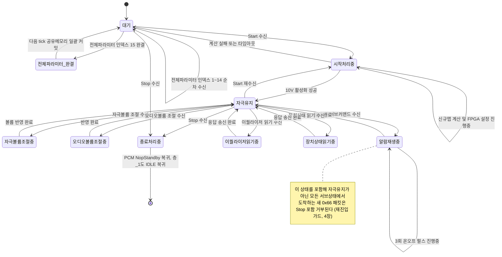
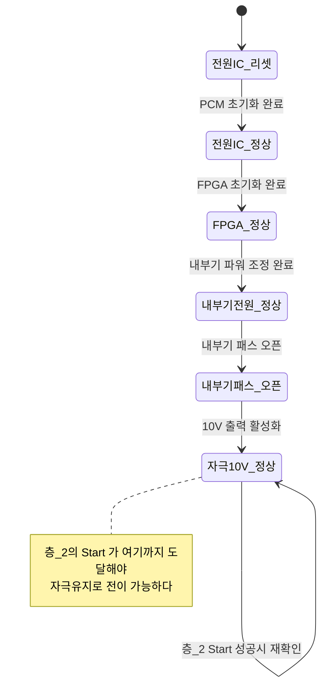
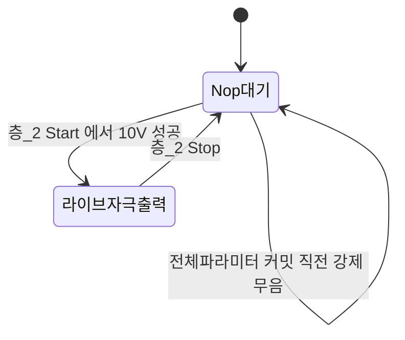
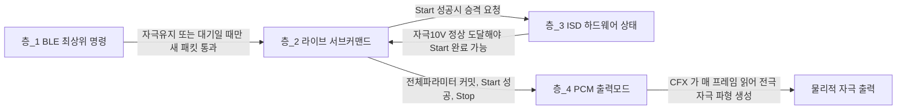

# 라이브모드 상태머신 사양

**TL;DR**: 라이브 자극(0x66) 상태는 BLE 최상위 명령·라이브 서브커맨드·ISD 하드웨어 램프업·CFX PCM 출력모드의 4개 층으로 독립 존재하며, 층간 관계는 코드 어디에도 명시돼 있지 않다. 서브커맨드 9종 중 볼륨·감도·알람은 `en__HoldOn`일 때만 수락되고, 재진입 가드는 그 외 상태에서 도착한 새 0x66 패킷을 Stop 포함 전량 거부한다.

## 1. 상태 4층 규명

라이브모드 상태는 **서로 다른 모듈이 독립적으로 관리하는 4개 층**으로 존재한다. 층 사이에는 명시적 동기화 API가 아니라 "조건부 게이팅"(한 층의 특정 값이 다른 층의 진입 조건이 됨)과 "부수효과 트리거"(한 층의 전이가 다른 층의 값을 직접 바꿈)만 있다.

| 층 | 이름 | 상태 변수 | 타입 | 정의 위치 | 소유 모듈 | 값 집합 |
|---|---|---|---|---|---|---|
| 층_1 | BLE 최상위 명령 | `mappingPacket.command` | `EN__MAPPING_COMMAND` | 필드 `tdc_ble_mapping.h:112`, 열거형 `tdc_ble_protocol.h:84-113` | `tdc_ble_mapping.c` | `en__mapping_IDLE`(0) ~ `en__mapping_testStimulation`(0x90) 등. 라이브 세션 동안은 `en__mapping_live_stimulation`(0x66)에 고정 |
| 층_2 | 라이브 서브커맨드 | `mappingPacket.tdc_isd_map_live_step.subCommand` | `EN__LIVE_STIMULATION_SUB_COMMAND` | 필드 `tdc_ble_mapping.h:116`, 열거형 `tdc_isd_map_live.h:9-19` | `tdc_ble_mapping.c`(수신) + `tdc_isd_map_live.c`(실행) | `en__Standby`(0) ~ `en__HoldOn`(9), 전수는 §2 |
| 층_3 | ISD 하드웨어 제어 상태(자극칩 램프업) | `s_isd_state.isd_controlState` | `EN__ISD_CONTROL_STATE` | 열거형 `tdc_isd.h:9-19`, 정적 변수 `tdc_isd.c:119` | `tdc_isd.c` | `en__isdStatus_NA`(0) -> `PowerIC_Reset` -> `PowerIC_OK` -> `FPGA_Ok` -> `ISD_Power_Ok` -> `ISD_pathOpen_Ok` -> `stimul_10V_Ok`(6) |
| 층_4 | PCM 출력모드(CFX 오디오 경로) | `cfx_cm3_sharedMemoryAll.cfx_PCM_interface.PCM_mode` | `int` (매크로 상수) | 매크로 `src/1__cfx/internalDevice/driver_PCM.h:27,29`(`LiveStimulation=2`, `NopStandby=4`), CM3 진입점 `tdc_shm_change_pcm_output_mode()` `tdc_shm.c:97-100` | CM3 `tdc_shm.c`가 기록, CFX `driver_PCM.c`가 소비 | `PcmBitStream_Mode_LiveStimulation`(2) / `PcmBitStream_Mode_NopStandby`(4) 등 |
| 참고(층_5) | 전극별 DAC/FPGA 레지스터 설정 마이크로스텝 | `flowControlCounter`(카운터, 이름 있는 상태 없음) | - | `tdc_isd_stim_para_setting.c:1096` `tdc_isd_stim_setting_step()` | `tdc_isd_stim_para_setting.c` | 카운터 진행, enum 없음 - 본 문서 상세 범위 밖 |

> [!IMPORTANT]
> **문제는 층이 4개라는 것이 아니다.** 계층화된 상태 자체는 정상적인 설계일 수 있다. 진짜 문제는 **층간 관계가 코드 어디에도 명시돼 있지 않다**는 점이다.
>
> 어느 층이 어느 층을 선행하는지, 한 층이 바뀔 때 다른 층이 어떻게 따라가야 하는지가 각 `case` 안에 흩어진 조건문으로만 암묵적으로 존재한다. 예컨대 "볼륨 조절(서브커맨드 3)은 층_2가 `en__HoldOn`일 때만 수락된다"(`tdc_ble_mapping.c:750`)는 규칙은 그 `case` 안에서만 확인되며, 어디에도 층간 계약(contract)으로 선언돼 있지 않다. 이 규명 자체가 `tdc_ble_mapping.c`(2,196줄)와 `tdc_isd_map_live.c` 전체를 읽고 재구성해야만 가능했다.

**층간 관계 요약**:

- 층_2의 `en__Start`는 층_3이 `en__isdStatus_stimul_10V_Ok`까지 올라가야 완료된다(`tdc_isd_map_live.c:174` `tdc_isd_change_state(en__isdStatus_stimul_10V_Ok)`). 즉 층_2가 층_3을 끌어올리는 트리거이고, 층_3의 도달 여부가 층_2의 완료 조건이다.
- 층_2(`en__allParameter` 커밋, `en__Start` 성공, `en__Stop`)가 층_4를 직접 전환한다(`tdc_shm_change_pcm_output_mode()` 호출 지점은 §3 다이어그램 근거표 참조).
- 층_1은 층_2에 대해 "누가 새 패킷을 받아도 되는가"만 게이팅한다(§4). 층_1 자체는 라이브 세션 내내 0x66에 고정되어 거의 움직이지 않는다 - `mappingPacket.command`는 최초 fetch 시 `tdc_ble_mapping_step()`(`tdc_ble_mapping.c:1803`)에서 0x66으로 세팅된 뒤, 층_2의 `en__Stop` 처리가 호출하는 `tdc_ble_mapping_clear_command()`(`tdc_ble_mapping.c:26-32`, 호출은 `tdc_isd_map_live.c:771`)가 `en__mapping_IDLE`로 되돌릴 때까지 그대로 유지된다.
- 층_5는 층_2의 `en__Start` 케이스가 내부적으로 호출하는 하위 마이크로스텝이며, 본 문서의 상세 분석 범위 밖이다(참고용 인용만).

## 2. 라이브 서브커맨드 전수표

정의: `tdc_isd_map_live.h:9-19`(`EN__LIVE_STIMULATION_SUB_COMMAND`). 와이어 상 유효 범위는 `tdc_ble_mapping.c:328`의 `(liveSubCommand < 1) || (9 < liveSubCommand)` 검사로 **1~9만 허용**된다. 0(`en__Standby`)은 프로토콜 밖 내부 전용 값이라 앱이 직접 보낼 수 없고, 9(`en__HoldOn`)는 검사를 통과해도 아래 switch에 대응 `case`가 없어 `default`로 떨어진다(`tdc_ble_mapping.c:946-949`).

| 값 | 이름 | 의미 | 수락 조건 | fetch 처리 근거(RX) | step 처리 근거(TICK) |
|---|---|---|---|---|---|
| 0 | `en__Standby` | 유휴/대기 서브상태 | 앱이 직접 보낼 수 없음(범위검사에서 차단) | `tdc_ble_mapping.c:328` | `tdc_isd_map_live.c:775-801`(300틱 주기 링크체크, §5) |
| 1 | `en__allParameter` | 전체 파라미터 전달(15개 데이터 인덱스 분할) | 조건 없음(단, 인덱스 순서 강제) | `tdc_ble_mapping.c:341-740` | `tdc_isd_map_live.c:72-122`(인덱스 15 완결 다음 tick에 일괄 커밋) |
| 2 | `en__Start` | 라이브 자극 시작 | 조건 없음(게이팅 없이 무조건 수락) | `tdc_ble_mapping.c:742-746` | `tdc_isd_map_live.c:125-214` |
| 3 | `en__StimulationVolumeAdjust` | 자극 볼륨 조절(1~4) | **`subCommand == en__HoldOn`일 때만 수락** | `tdc_ble_mapping.c:748-775`(조건 `:750`) | `tdc_isd_map_live.c:216-250` |
| 4 | `en__MicSensitivityAdjust` | 이름은 마이크 감도지만 실제로는 오디오 볼륨(1~10) 조절 | **`subCommand == en__HoldOn`일 때만 수락** | `tdc_ble_mapping.c:777-801`(조건 `:779`) | `tdc_isd_map_live.c:252-284` |
| 5 | `en__mapping_Stimul_indicator` | 알림(알람)용 자극 출력 | **`subCommand == en__HoldOn`일 때만 수락** | `tdc_ble_mapping.c:803-881`(조건 `:805`) | `tdc_isd_map_live.c:286-334` |
| 6 | `en__readEqualizer` | 자극 출력값 읽기(이퀄라이저) | **`subCommand == en__HoldOn`일 때만 수락** | `tdc_ble_mapping.c:883-932`(조건 `:885`) | `tdc_isd_map_live.c:336-426`(범위 참고) |
| 7 | `en__readDeviceStatus` | 장치 상태 읽기 | 조건 없음(무조건 수락) | `tdc_ble_mapping.c:934-938` | `tdc_isd_map_live.c:428-461`(범위 참고) |
| 8 | `en__Stop` | 라이브 자극 종료 | 조건 없음(무조건 수락, 단 §4 재진입 가드는 별도) | `tdc_ble_mapping.c:940-944` | `tdc_isd_map_live.c:753-773` |
| 9 | `en__HoldOn` | 자극 유지(안정 상태) - 앱이 직접 보낼 수 없음 | 대응 `case` 없음 -> `default`로 낙하 시 `en__Standby`로 강제 전환 | `tdc_ble_mapping.c:946-949` | 자체 `case` 없음. 서브커맨드 3/4/5/6의 게이트 조건이자, `en__Start` 완료 후 도착점 |

## 3. 층별 Mermaid 상태 다이어그램

### 3.1 층_2 - 라이브 서브커맨드 상태머신(핵심)



상태 이름과 코드 값의 대응, 그리고 전이 근거는 아래 표를 따른다(다이어그램 안에는 `파일:라인`을 넣지 않는다).

| 다이어그램 상태 | 코드 값(`EN__LIVE_STIMULATION_SUB_COMMAND`) |
|---|---|
| 대기 | `en__Standby`(0) |
| 전체파라미터_완결 | `en__allParameter`(1) - 인덱스 15 완결 직후 1틱만 유지 |
| 시작처리중 | `en__Start`(2) |
| 자극볼륨조절중 | `en__StimulationVolumeAdjust`(3) |
| 오디오볼륨조절중 | `en__MicSensitivityAdjust`(4) |
| 알람재생중 | `en__mapping_Stimul_indicator`(5) |
| 이퀄라이저읽기중 | `en__readEqualizer`(6) |
| 장치상태읽기중 | `en__readDeviceStatus`(7) |
| 종료처리중 | `en__Stop`(8) |
| 자극유지 | `en__HoldOn`(9) |

| 전이 | 근거 |
|---|---|
| 전체파라미터 인덱스 1~14 순차 수신 | `tdc_ble_mapping.c:341-737`, 인덱스 15 미만이면 `:735`에서 `subCommand = en__Standby` 유지 |
| 전체파라미터 인덱스 15 완결 | `tdc_ble_mapping.c:710`(완결 판정), `:729`(subCommand -> `en__allParameter`) |
| 다음 tick 공유메모리 일괄 커밋 | `tdc_isd_map_live.c:72-120`(커밋 후 `:120`에서 subCommand -> `en__Standby`) |
| Start 수신/재수신 | `tdc_ble_mapping.c:742-746`(게이팅 없음, 대기·자극유지 양쪽에서 가능) |
| 시작처리중 자기순환 | `tdc_isd_map_live.c:128-161`(`flowCounter <= 1000`, 신규맵 계산·FPGA 설정 진행) |
| 시작처리중 -> 대기(실패) | `tdc_isd_map_live.c:161-167`(FPGA 설정 오류), `:206-212`(`flowCounter > 1000` 타임아웃) |
| 시작처리중 -> 자극유지(성공) | `tdc_isd_map_live.c:174`(층_3 `stimul_10V_Ok` 재확인), `:193`(subCommand -> `en__HoldOn`), `:195`(층_4 -> `LiveStimulation`) |
| 자극볼륨조절중 진입/복귀 | `tdc_ble_mapping.c:750-758`(HoldOn 게이트), `tdc_isd_map_live.c:216-250`(`tdc_shm_change_stimul_volume()`, 응답 후 `:239` HoldOn 복귀) |
| 오디오볼륨조절중 진입/복귀 | `tdc_ble_mapping.c:779-787`(HoldOn 게이트), `tdc_isd_map_live.c:252-284`(`tdc_shm_change_audio_volume()`, 응답 후 `:274` HoldOn 복귀) |
| 알람재생중 진입 | `tdc_ble_mapping.c:805-871`(HoldOn 게이트, 범위검사), `tdc_isd_map_live.c:286-304`(`flowCounter==0`에 트리거) |
| 알람재생중 자기순환/복귀 | `tdc_stim_indicator.c:23-69`(독립 정적 카운터, §6), `tdc_isd_map_live.c:307-321`(트리거 해제 후 응답+HoldOn 복귀) |
| 이퀄라이저읽기중 진입/복귀 | `tdc_ble_mapping.c:885-920`(HoldOn 게이트), `tdc_isd_map_live.c:336-426` |
| 장치상태읽기중 진입/복귀 | `tdc_ble_mapping.c:934-938`(게이팅 없음), `tdc_isd_map_live.c:428-461` |
| 종료처리중 진입(양방향) | `tdc_ble_mapping.c:940-944`(게이팅 없음, 단 4장 재진입 가드는 더 바깥에서 별도 적용) |
| 종료처리중 -> 종료 | `tdc_isd_map_live.c:753-771`(층_4 -> `NopStandby`, 응답 송신, `tdc_ble_mapping_clear_command()`로 층_1도 IDLE) |

### 3.2 층_3 - ISD 하드웨어 제어 상태(자극칩 램프업)



| 다이어그램 상태 | 코드 값(`EN__ISD_CONTROL_STATE`, `tdc_isd.h:9-19`) |
|---|---|
| 전원IC_리셋 | `en__isdStatus_PowerIC_Reset` |
| 전원IC_정상 | `en__isdStatus_PowerIC_OK` |
| FPGA_정상 | `en__isdStatus_FPGA_Ok` |
| 내부기전원_정상 | `en__isdStatus_ISD_Power_Ok` |
| 내부기패스_오픈 | `en__isdStatus_ISD_pathOpen_Ok` |
| 자극10V_정상 | `en__isdStatus_stimul_10V_Ok` |

전이 근거: 상태 저장은 `s_isd_state.isd_controlState`(`tdc_isd.c:119`), 변경 함수는 `tdc_isd_change_state()`(`tdc_isd.h:30`). 층_2의 `en__Start`가 재확인 호출하는 지점은 `tdc_isd_map_live.c:174`.

### 3.3 층_4 - PCM 출력모드(CFX 오디오 경로)



| 다이어그램 상태 | 코드 값(`driver_PCM.h:27,29`) |
|---|---|
| Nop대기 | `PcmBitStream_Mode_NopStandby`(4) - 부팅 기본값 |
| 라이브자극출력 | `PcmBitStream_Mode_LiveStimulation`(2) |

전이 근거: 진입 `tdc_isd_map_live.c:195`, 해제 `tdc_isd_map_live.c:755`, 전체파라미터 커밋 직전 강제 무음은 `tdc_isd_map_live.c:74`(commit 케이스 진입 즉시 `tdc_shm_change_pcm_output_mode(PcmBitStream_Mode_NopStandby)` 호출).

### 3.4 층간 관계(개략)



근거: 층_1->층_2 게이팅은 4장, 층_2<->층_3은 3.1·3.2절 전이표, 층_2->층_4는 3.1·3.3절 전이표.

## 4. 재진입 가드 정밀 기술

위치: `tdc_ble_mapping_fetch_packet()`, `tdc_ble_mapping.c:89-112`.

```c
if (mappingPacket.command != en__mapping_IDLE)
{
    if (tempCommand == en__mapping_live_stimulation)  // header 0x66
    {
        if ((subCommand == en__HoldOn) || (subCommand == en__Standby))
            exceptionCase = true;
    }
    if (tempCommand == en__mapping_disconnect)  // header 0x61
        exceptionCase = true;

    if (!exceptionCase)
    {
        tdc_sys_error_send_to_app(tempCommand, en__EN__BLE_PROTOCOL_ERROR, en__PreviouCommnadIsNotCompleted, __LINE__);
        tempCommand = en__mapping_IDLE;
    }
}
```

**성립 조건**: `mappingPacket.command != en__mapping_IDLE`(층_1이 라이브 세션 중이라 0x66에 고정된 상태) **그리고** 현재 층_2 서브상태(`subCommand`)가 `en__HoldOn`도 `en__Standby`도 아닐 때. 이 두 조건이 동시에 성립하면, 0x61(연결 해제)을 제외한 **모든 새로 도착한 0x66 패킷이 `liveSubCommand` 바이트조차 파싱되지 않고** `en__PreviouCommnadIsNotCompleted` 에러로 거부된다. 여기에는 `en__Stop`(서브커맨드 8)도 예외 없이 포함된다 - `switch (tempCommand)` 진입 자체가 `tempCommand = en__mapping_IDLE`로 치환된 뒤 이뤄지므로, 원래 0x66 안에 담겨 있던 서브커맨드 값은 아예 읽히지 않는다.

> [!IMPORTANT]
> **과장 금지.** 정상적인 라이브 운용 중에는 층_2 서브상태가 대부분 `en__HoldOn`(자극유지)이다 - 볼륨·감도·알람이 `en__HoldOn`에서만 수락되도록 설계된 것 자체가 "라이브 스트리밍 중 서브상태는 HoldOn"이라는 설계 의도의 방증이다. 이 상태에서는 Stop을 포함한 새 0x66 패킷이 정상적으로 수락된다.
>
> 위험은 **`en__Start` 처리 중(신규맵 계산·FPGA 설정, 최대 `flowCounter > 1000`까지)** 과 **`en__mapping_Stimul_indicator`(알람) 처리 중(3회 온오프 펄스 진행 동안)** 같은 **전이 구간에 한정**된다. 이 구간에 Stop을 보내면 거부되어 정지가 지연된다. **위험 창의 실제 길이(ms)는 미확인**이다 - 메인 루프 1 tick의 정확한 주기가 코드에서 확정되지 않았고(`main.c` `tdc_normal_iteration()`이 CFX iteration 이벤트에 동기화되는 것으로 보이나 정확한 주기값 미확인), 알람 3사이클의 카운터 임계값(`counter<80`/`counter>=160`, `tdc_stim_indicator.c:45-59`)과 Start 타임아웃 임계값(`flowCounter>1000`, `tdc_isd_map_live.c:206`, 주석은 "13msec"이나 임계값이 50→1000으로 바뀐 이력이 있어 주석과 현재 값의 정합성도 미확인)을 실제 시간으로 환산할 근거가 없다.
>
> 실측 로그 2종 어디에도 이 경합 상황(전이 구간 중 새 0x66 도착)은 나타나지 않았다 - 로그2(§ [실측 로그 대조.md](실측%20로그%20대조.md))에서 알람·볼륨 명령은 항상 이전 명령이 완전히 끝난 뒤에만 순차 도착했다. 따라서 이 경로는 **코드로만 확인했고 실기 미검증**이다.

## 5. 맵 파라미터 15분할 수신의 안전성

`en__allParameter`(서브커맨드 1)는 15개 데이터 인덱스로 분할 수신된다(`Live_AllParameter_payloadNum=15`, `tdc_isd_map_live.h:21`). 인덱스는 `[2]` 바이트로 식별되며 순서가 강제된다 - 수신된 인덱스가 `prev+1`이 아니면 즉시 에러(`en__DATA_Order`)를 통지하고 인덱스 1부터 재시작한다(`tdc_ble_mapping.c:352-357`).

**안전한 이유**: 인덱스 1~14 각각의 필드값은 스테이징 구조체 `mappingPacket.tdc_isd_map_live_step`에만 순차 기록된다(`tdc_ble_mapping.c:365-690`). 이 스테이징 값을 CFX가 실제로 읽는 공유메모리(`p_mapDataSharedMemory`, `tdc_shm_get_pointer_current_map_data()`)로 옮기는 코드는 **인덱스 15가 정상 완결된 다음 tick**의 `en__allParameter` case(`tdc_isd_map_live.c:72-120`) 단 한 곳뿐이다. 인덱스 1~14 사이에는 이 커밋이 호출되지 않으므로, 중간에 연결이 끊기거나 순서가 어긋나면 subCommand가 `en__Standby`에 머물 뿐 공유메모리에는 아무 변화도 생기지 않는다. 따라서 "절반은 새 값, 절반은 이전 값"인 상태가 실제 자극 파라미터에 반영될 경로는 코드상 없다.

**남은 위험(미확인)**:
- 스테이징 구조체는 세션 간 초기화되지 않는 `static` 전역이라, 다음 시도에서 인덱스 1부터 다시 채우기 전까지 이전 시도의 잔여값을 들고 있다. 다음 완결 시 전량 덮어써지므로 실질적 영향은 없어 보이나 확정 근거는 없다.
- `en__Start`(서브커맨드 2)는 `en__allParameter` 완결 여부와 무관하게 게이팅 없이 무조건 수락된다(`tdc_ble_mapping.c:742-746`). 이론적으로 `allParameter` 전송 없이 `Start`만 단독으로 보낼 수 있으며, 이 경우 신규맵 로드 플래그가 이미 true라면 **이전에 검증되어 공유메모리에 이미 올라와 있던 구맵**으로 계산·10V 활성화가 진행된다. 이는 "틀린 맵으로 자극할 위험"일 수는 있으나 "반쪽짜리 데이터로 자극할 위험"은 아니다. 실기·로그로는 검증되지 않았다.

## 6. 알람 재생(Stimulation Indicator) 경로

경로: BLE `0x66 05 <채널> <진폭 상위바이트> <진폭 하위바이트>` 수신(`tdc_ble_mapping.c:803-881`, `subCommand==en__HoldOn` 게이트) -> 스테이징 필드 저장, 범위검사는 **현재 맵의 실측 T/C 레벨**을 스캔해 계산(`:826-858`) -> `subCommand = en__mapping_Stimul_indicator` -> 다음 tick `tdc_isd_map_live_step()`에서 `flowCounter==0`일 때 공유맵 데이터에 채널/진폭 반영 후 `tdc_stim_indicator_set_level_255()`(uA -> 255레벨 환산, `tdc_stim_indicator.c:75-124`) 호출, 반환값 `sitmulationIndicatorTrigger=true`(`tdc_isd_map_live.c:286-304`).

이 bool은 그 tick 안에 `tdc_ble_mapping_step()` -> `tdc_ble_communication_step()` -> `main.c` 메인 루프를 거쳐 `tdc_stim_indicator_out()`으로 전달된다. `tdc_stim_indicator.c:23-69`의 이 함수는 **독립 정적 변수**(`stimulationIndicatorTrigger`, `counter`, `outputPulseTrainCounter`)만으로 이후 진행을 관리한다 - `counter<80`이면 알림 출력 ON, 아니면 OFF, `counter>=160`마다 사이클 카운트 증가, 3사이클(`outputPulseTrainCounter==3`) 후 자동 해제(`:45-64`). 이 on/off 플래그는 공유메모리에 기록되고 CFX 쪽 `nonlinearMapping.c`에서 라이브 모드일 때 지시 채널의 PCM 진폭을 알림 레벨로 덮어써 실제 전극 자극을 출력한다.

**핵심**: 트리거가 한 번 세팅되면 이후 3사이클 진행은 층_2의 `subCommand`와 **완전히 분리**되어 진행된다. 알람 재생 도중 라이브 서브상태가 외부 요인으로 바뀌어도 물리적 알림 출력 자체는 끊기지 않고 끝까지 실행된다. 다만 "알람 완료" TX 응답과 subCommand의 `en__HoldOn` 복귀는 `en__mapping_Stimul_indicator` case가 다시 호출되어야 발생하므로(`tdc_isd_map_live.c:307-321`), 서브상태가 도중에 다른 값으로 바뀌면 그 완료 통지 자체는 유실될 수 있다(코드 근거, 실기 미검증).

## 7. 볼륨 변경 경로

자극 볼륨(1~4, `df_maxStimulationVloumeLevel`, `tdc_stim_definitions.h:72`)과 오디오 볼륨(1~10, `df_maxMicVloumeLevel`, `tdc_stim_definitions.h:30`)은 두 경로로 들어온다: (a) `en__allParameter` 인덱스 1로 최초 설정(§2), (b) 라이브 중 서브커맨드 3/4로 개별 조정 - 둘 다 `subCommand==en__HoldOn`일 때만 허용된다.

반영 메커니즘: `tdc_shm_change_stimul_volume()`/`tdc_shm_change_audio_volume()`(`tdc_shm.c:386-414` 부근)은 공유메모리 값을 즉시 덮어쓸 뿐이다. 실제 반영은 CFX 쪽 `Normal_PowerMode_event_both_stimulation_audio_volumeChange()`(`system_control.c:182-202`)가 **매 프레임 값 변경을 폴링**해 감지하고, 변경이 있으면 `fn_PcmBitStream_Mode_NopStandby()`로 잠깐 무음 처리한 뒤 `calculate_newStimulation_maxLevel()`/`calculate_logaritmMapping_coeff_with_audioVolume()`로 계수를 재계산한다(`:188-199`). 이 폴링 함수는 `Normal_PowerMode_isdConnected()`(`system_control.c:204-249`, 호출 `:247`)에서 매 프레임 무조건 호출되므로 라이브 스트리밍 여부와 무관하게 항상 적용된다. 즉 "즉시 반영"이되 **재계산 구간 동안 순간 무음이 발생**하는 구조다(정확한 무음 지속시간은 미확인).

## 8. 이름-동작 불일치 경고

> [!WARNING]
> 서브커맨드 4는 열거형 이름이 `en__MicSensitivityAdjust`(마이크 감도 조절)이지만, 실제 구현은 `tdc_shm_change_audio_volume()`(`tdc_isd_map_live.c:259`)을 호출해 **오디오 볼륨**을 바꾼다. 마이크 감도라는 이름과 오디오 볼륨이라는 실제 동작이 다르다 - 향후 리팩토링에서 이름을 따라 동작을 추측하면 안 된다.

## 9. 미확인 사항 목록

| 번호 | 항목 | 영향 |
|---|---|---|
| 미확인_1 | 메인 루프 1 tick의 실제 주기(ms) | §4 재진입 가드 위험 창, §6 알람 3사이클 소요시간, §5 Start 타임아웃 정량화에 필요 |
| 미확인_2 | 알람 재생 중 볼륨/감도 명령이 경합하는 실제 동작(코드상 재진입 가드로 거부됨은 확인, 실기 미검증) | §4 |
| 미확인_3 | `en__HoldOn` 중 ISD 연결이 끊겼다가 복구되는 경로(`tdc_isd_map_live.c:463-627` 부근 `needResetting` 처리) | 재연결 복구 실기 동작 |
| 미확인_4 | `en__Start` 처리의 `flowCounter>1000` 타임아웃 실기 발동 여부 | 두 실측 로그 모두 Start가 즉시 성공, 타임아웃 경로 미관측 |
| 미확인_5 | 서브커맨드 9(`en__HoldOn`)를 앱이 직접 전송하는 경우의 실기 동작(설계상 코드는 조용히 `en__Standby`로 낙하) | 두 로그 모두 미출현 |
| 미확인_6 | `en__HoldOn`(라이브 스트리밍 중) 상태에서 `en__allParameter`를 재전송해 맵을 갱신하는 경로 | 두 로그 모두 세션당 allParameter는 Start 이전 1회뿐 |
| 미확인_7 | `tdc_shm_change_program_map_num(-1)`/`(-2)` 토글(`tdc_isd_map_live.c:39,104-114`)을 매번 바꾸는 정확한 이유. 주석("맵 번호 인덱스를 마이너스 값으로 변경해 CFX가 맵데이터를 실행", `tdc_isd_map_live.c:16`)과 CFX가 값 변경 시에만 재로드하는 구조로 미루어 "변경 감지를 강제로 트리거하기 위함"으로 추정되나 CFX 쪽에서 -1과 -2를 다르게 처리하는지는 확인하지 못함 |
| 미확인_8 | 서브커맨드 5(알람) 채널 범위검사가 `en__allParameter` 인덱스1에서는 "1~32" 고정인데, 실제 트리거(§2 서브커맨드5)에서는 "1~numFrequencyBand"로 다르게 검사됨. 의도적 설계인지 불일치인지 코드만으로는 확정 불가 |
