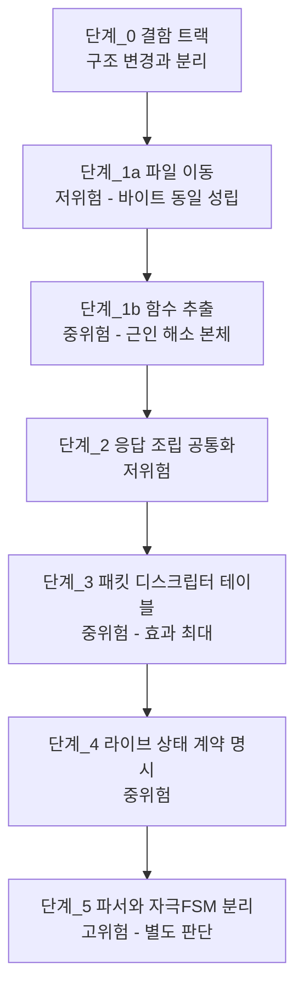

# BLE 재구조화 설계안

**TL;DR**: `ble/` 재구조화를 **6단계 로드맵**으로 정의한다. 핵심은 ① 결함 트랙 선행 분리, ② 헤더 그룹별 폴더 분할과 거대 함수 분해, ③ **패킷 디스크립터 테이블**로 데이터 인덱스 분기 흡수, ④ 라이브 상태 4층의 층간 계약 명시, ⑤ 파서와 자극 FSM 분리. **단계마다 위험도와 검증 방법이 다르며, `.elf` 바이트 동일이 성립하는 구간은 단계_1a 뿐이다.**

> [!IMPORTANT]
> 이 문서는 **설계안이며 아직 실행되지 않았다.** 근거가 된 분석은 [`docs/tasks/ble/20260727_ble-protocol-restructure/`](../../../tasks/ble/20260727_ble-protocol-restructure/) 에 있다.

## 1. 왜 재구조화가 필요한가

| 관측 | 실태 |
|---|---|
| 파일 편중 | `.c` 6개 4,637줄 중 `tdc_ble_mapping.c`(2,196) + `tdc_ble_remote.c`(1,389) 가 **77.3%** |
| 함수 분해 부재 | `tdc_ble_mapping.c` 에 함수가 **6개뿐**. `fetch_packet` 하나가 **1,724줄(78%)** |
| 상태 분산 | 라이브 상태가 **4개 층**에 흩어져 있고 층간 관계가 코드에 명시돼 있지 않음 |
| 계층 혼재 | 프로토콜 파서가 자극 FSM 의 tick 드라이버를 겸함 |

상세는 [`../코드구조/복잡도 실측.md`](../코드구조/복잡도%20실측.md) · [`../라이브모드/상태머신 사양.md`](../라이브모드/상태머신%20사양.md).

## 2. 설계 원칙

| # | 원칙 | 근거 |
|---|---|---|
| 원칙_1 | **프로토콜 규약은 불변.** 명령 코드·페이로드 레이아웃·응답 형식을 바꾸지 않는다 | 앱·리모콘과 공유. [`cm3-소스-트리-규약.md §2.1`](../../cm3-소스-트리-규약.md) |
| 원칙_2 | **데이터 인덱스 분기는 제거가 아니라 흡수.** 20바이트 MTU 제약은 사라지지 않는다 | 프로토콜 제약 |
| 원칙_3 | **동작 보존이 기본값.** 동작 변경은 별도 트랙으로 분리하고 명시 승인을 받는다 | 자극 계통 안전 |
| 원칙_4 | **결함 수정과 구조 리팩토링을 섞지 않는다** | 섞으면 회귀 원인 규명 불가 |
| 원칙_5 | **`isd/` 역결합 해소 없이는 폴더 분할이 완결되지 않는다** | `isd/` 6파일이 `ble/` 상태를 56회 참조·클리어 |
| 원칙_6 | 단계마다 **되돌릴 수 있는 크기**로 자른다 | 2차 리팩토링 노하우 |

## 3. 로드맵



### 진척 현황 (2026-07-30 기준)

| 단계 | 상태 | 작업 폴더 |
|---|---|---|
| 단계_0 결함 트랙 | **완료 · 실기 확인** | [`20260727_ble-8bit-packet-redesign`](../../../tasks/ble/20260727_ble-8bit-packet-redesign/) |
| 단계_1a · 1b | **완료 · 실기 확인** | [`20260728_ble-folder-restructure`](../../../tasks/ble/20260728_ble-folder-restructure/) |
| 단계_2 응답 조립 공통화 | **완료 · 실기 확인** | [`20260728_ble-reply-builder`](../../../tasks/ble/20260728_ble-reply-builder/) |
| 단계_3 | **완료 · 실기 확인** (2026-07-30) — **단, 아래 설계 변경 참조** | [`20260729_ble-descriptor-table`](../../../tasks/ble/20260729_ble-descriptor-table/) |
| 단계_4 라이브 상태 계약 | **완료 · 실기 확인** (2026-07-30) — **단, 아래 설계 변경 참조** | [`20260729_ble-live-state-contract`](../../../tasks/ble/20260729_ble-live-state-contract/) |
| 단계_5 파서-FSM 분리 | 미착수 (고위험, 별도 판단) | - |

> [!CAUTION]
> **아래 §단계_3 · §단계_4 본문의 설계 제안은 실제로 채택되지 않았다.** 두 단계 모두 **테이블 주도 방식을 기각**하고 다른 설계로 구현했다. 본문은 2026-07-27 설계 시점의 기록으로 보존하되, **구현의 기준으로 삼지 말 것.**
>
> | 단계 | 이 문서의 제안 | 실제 채택 | 기각 사유 |
> |---|---|---|---|
> | 단계_3 | **패킷 디스크립터 테이블** (23엔트리 + 순회 루프) | **프로토콜 계층을 함수 이름에** — `tdc_ble_cmd_0x66_subNN_idxKK_<이름>` + 명령 단위 파일 | 1차로 테이블을 실제 구현해 지표 우수(`text` **-1,276B**, 함수 409->101줄, 검증 6종 통과)했으나 **은수님 검토에서 기각** 후 `05c3a81` revert. *"배열에 숫자를 집어넣어 한참 분석해야 한다"* — 매크로 인자 `(f, 0, 17, 1, 1, 100)` 이 정의를 찾아야 뜻을 알고, 필드 배열 + 슬롯 `first` 오프셋의 **이중 관리** |
> | 단계_4 | **서브커맨드별 허용 선행 상태 테이블** | **이름 있는 가드 함수** — `tdc_ble_cmd_0x66_require_hold_on()` + 조기 반환 + 수락 조건 주석 9개 | 단계_3 에서 같은 성격의 테이블이 기각됐고, 게이트가 **4개뿐**이라 규모 이점도 없다 |
>
> **판단 기준은 지표가 아니라 "사람이 눈으로 보고 관리하기 쉬운가"** 이며, 실질 척도는 **프로토콜이 바뀌면 몇 곳을 고치는가**다(테이블 3곳 vs 계층 네이밍 1곳). 확정 구현은 크기가 오히려 **+588B 늘었으나 의도된 교환**이다.
>
> **테이블 주도 재도입은 불가침 금지 사항**이다 — 상세: [`20260729_ble-descriptor-table/구현-검증.md`](../../../tasks/ble/20260729_ble-descriptor-table/구현-검증.md).

### 단계_0 - 결함 트랙 (선행)

알려진 결함 13건을 구조 변경 **전에** 처리한다. 구조를 바꾼 뒤 고치면 회귀인지 원래 결함인지 구분할 수 없다. 목록은 [`알려진 결함 목록.md`](알려진%20결함%20목록.md).

**검증**: 결함마다 재현 절차 + 수정 후 실기 확인 + 로그 7종 대조.

### 단계_1a - 파일 이동 (저위험)

기존 파일을 폴더로 **옮기기만** 한다. 파일 내부는 건드리지 않는다.

```
ble/
├── tdc_ble_communication.c/.h      디스패치 (유지)
├── tdc_ble_protocol.h              프로토콜 정의 (유지, 불가침)
├── system/                         Ezairo_BT_30 (0x30~0x36)
├── remote/                         통신 프로토콜_40 (0x40~0x59)
│   ├── tdc_ble_remote.c/.h
│   └── tdc_ble_remote_sp_para.c/.h
├── mapping/                        매핑 프로토콜_60 (0x60~0x72, 0x91)
│   └── tdc_ble_mapping.c/.h
└── sound1/                         SOUND1_80 (0x8C·0x8F)
    ├── tdc_ble_gain_control.c/.h
    └── tdc_ble_general_debug.c/.h
```

0xC0 대역(OTA)은 이미 `dfu/` 폴더로 분리돼 있어 대상 밖이다.

**검증**: **`.elf` 바이트 동일.** 라인 보존 대조본 기법으로 md5 일치 확인.

> [!NOTE]
> **단계_1a 만 하고 멈추면 실익이 거의 없다.** 파일이 폴더로 정리될 뿐 `tdc_ble_mapping.c` 2,196줄은 그대로다. 근인 해소의 실체는 단계_1b 에 있다.

### 단계_1b - 함수 추출 (중위험)

`fetch_packet`/`step` 의 case 블록을 명령별 static 함수로 추출한 뒤 `mapping/` 을 기능별로 분할한다.

```
mapping/
├── tdc_ble_mapping.c/.h        디스패치 + 공통
├── tdc_ble_map_flash.c/.h      0x68·0x69·0x6A·0x6C·0x6D (슬롯·맵 읽기/쓰기)
├── tdc_ble_map_measure.c/.h    0x62·0x63·0x64 (임피던스·eCAP)
└── tdc_ble_map_stim.c/.h       0x65·0x66 (특정자극·라이브)
```

> [!CAUTION]
> **`.elf` 바이트 동일이 성립하지 않는다.** 함수 추출은 인라인 여부·레지스터 할당·호출 규약을 바꾼다. 검증 방식이 단계_1a 와 근본적으로 다르다.

**검증 4중**

| # | 방법 | 목적 |
|---|---|---|
| 검증_1 | **디스어셈블 대조** - 니모닉·호출 시퀀스·분기 구조를 함수 단위 비교 | 크기 증감만으로 판단하면 안 된다. `__LINE__` 이동만으로도 명령 길이가 바뀐다 |
| 검증_2 | **로그 7종 전 시나리오 재현** - 응답 바이트열·로그 문구 완전 일치 | 실동작 등가 |
| 검증_3 | **추출 함수 입출력 계약 표** 작성 후 누락 확인 | `mappingPacket` 등 전역 의존이 많아 추출 시 누락 위험 |
| 검증_4 | 브레이스 균형·전처리 깊이 검산 | `#else`/`#endif` 누락 사고 재발 방지 |

**위험 대응**

| 위험 | 대응 |
|---|---|
| 새 폴더 `-I` 누락 -> 빌드 실패 | `.cproject` 에 **컴파일러·어셈블러 각각** 등록 ([규약 §8](../../cm3-소스-트리-규약.md)) |
| 헤더명 전역 유일 규약 위반 | 신규 헤더명 사전 grep |
| `Debug/*/subdir.mk` 미갱신 | CLI 빌드 시 갱신 필요 (Eclipse 재빌드 시 자동) |
| 전역 `mappingPacket` 이 파일 경계를 넘음 | 접근자 함수로 노출하되 이 단계에서는 `extern` 유지 |

### 단계_2 - 응답 조립 공통화 (저위험)

에러 응답은 `tdc_sys_error_send_to_app()` 으로 이미 공통화돼 있으나, **정상 응답은 명령마다 손으로 조립**한다.

`tdc_ble_general_debug.c` 의 검증된 패턴("패킷 포인터 주입 + `tx_index` 반환", 2026-07-01 분리 작업에서 확립, `tdc_ble_gain_control.c` 가 재사용 중)을 응답 빌더로 승격한다.

```c
/* 개념 스케치 - 확정 시그니처 아님 */
int  tdc_ble_reply_begin(int *tx_buf, int header);   /* 헤더 에코 */
int  tdc_ble_reply_u8(int *tx_buf, int idx, int v);
int  tdc_ble_reply_u16(int *tx_buf, int idx, int v); /* 상위/하위 바이트 분해 공통화 */
void tdc_ble_reply_send(const int *tx_buf, int idx);
```

**검증**: 응답 바이트열이 로그 7종과 완전 일치.

### 단계_3 - 패킷 디스크립터 테이블 (중위험, 효과 최대)

원칙_2 의 실행. 명령 x 데이터 인덱스 조합마다 "이 위치에 이 필드가 온다"를 **데이터로 선언**하고, 파싱 코드는 테이블을 순회하는 단일 루프로 만든다.

```c
/* 개념 스케치 */
typedef struct
{
    int    data_index;    /* 0 = 인덱스 미사용 */
    int    offset;        /* 패킷 내 시작 위치 */
    int    width;         /* 1 or 2 바이트 */
    int    min, max;      /* 범위 검사 (둘 다 0 이면 검사 없음) */
    size_t field_offset;  /* 대상 구조체 필드 오프셋 */
} tdc_ble_field_desc_t;
```

> [!CAUTION]
> **타입 정합을 먼저 결정해야 한다.** 이 프로젝트의 BLE 패킷은 `int` 배열(`tdc_hal_spi.c:22`)이고 페이로드 구조체 필드도 전부 `int` 다(`tdc_ble_mapping.h:10-107`). **타입을 좁히는 것 자체가 동작 변경 위험**(부호 확장·범위 검사 경계)이므로 기존 `int` 관행 유지 여부를 착수 시 선결한다.

**효과**: 범위 검사 중첩(최대 9단)과 인덱스별 분기가 테이블로 흡수된다. `fetch_packet` 1,724줄의 대부분이 여기 해당한다.

**가독성 대응**: 테이블 주도 코드는 흐름 추적이 어려워질 수 있다. **테이블을 프로토콜 문서와 1:1 대응**시키고 각 엔트리 주석에 데이터 인덱스 번호를 명시한다. [`../프로토콜/명령 카탈로그.md`](../프로토콜/명령%20카탈로그.md) 가 그 대응표 역할을 한다.

**검증**

1. 명령 x 인덱스 전 조합에 대해 **기존 코드와 신규 테이블의 파싱 결과를 비교하는 오프라인 테스트**를 `tests/` 에 작성
2. 로그 7종의 실제 패킷을 입력으로 넣어 결과 구조체 바이트 비교
3. 실기 게이트

> [!IMPORTANT]
> **단계_3 부터는 `tests/` 인프라가 전제**다. 현재 `tests/` 는 사실상 비어 있다. 오프라인 파싱 테스트 없이 진행하는 것은 권하지 않는다.

### 단계_4 - 라이브 상태 계약 명시 (중위험)

층간 규칙을 코드로 승격한다.

| 현재 | 설계안 |
|---|---|
| "볼륨은 HoldOn 일 때만" 이 각 case 안 조건문에 흩어짐 | 서브커맨드별 **허용 선행 상태 테이블**로 선언 |
| 4층 관계가 암묵적 | 층별 상태 조회·전이 인터페이스 명시 |
| 재진입 가드가 최상위 한 덩어리(`tdc_ble_mapping.c:89-112`) | 명령별 수락 조건의 일부로 편입 |

**검증**: 로그 7종의 상태 전이 시퀀스 재현 + 알람/볼륨 경합 시나리오 신규 실측.

### 단계_5 - 파서와 자극 FSM 분리 (고위험, 별도 판단)

현재 `tdc_ble_mapping_step()` 이 매 tick `tdc_isd_map_*_step()` 4종을 직접 호출하고, 반대로 `isd/` 6파일이 `ble/` 상태를 56회 참조·클리어한다.

| 안 | 내용 | 장점 | 단점 |
|---|---|---|---|
| 안_1 | 자극 FSM tick 구동을 `main` 루프로 올리고 `ble/` 는 명령 큐만 전달 | 계층 정상화 | 호출 순서 변화 -> 타이밍 회귀 위험 |
| 안_2 | `ble/` 와 `isd/` 사이에 **중재 계층**(`tdc_map_session`) 신설 | 점진 적용 가능 | 계층 하나 추가 |
| 안_3 | **현상 유지 + 경계 문서화만** | 위험 0 | 근인 미해소 |

> [!WARNING]
> 자극 FSM 의 tick 순서·주기가 바뀌면 **실기에서만 드러나는 회귀**가 난다. 실익 대비 위험이 커서 **안_3(문서화만)도 유효한 선택지**다.

## 4. 권고 순서

| 순위 | 단계 | 위험 | 진척 | 비고 |
|---|---|---|---|---|
| 1 | 단계_0 결함 트랙 | 낮~중 | **완료** | 특히 라이브 Stop 거부 건의 위험 창 정량화 → **정량화는 미결로 이월**(결함_4) |
| 2 | 단계_1a 파일 이동 | 낮음 | **완료** | 바이트 동일로 검증. 단 이것만으론 실익 거의 없음 → `-ffile-prefix-map` 필요가 실측으로 드러남 |
| 3 | 단계_1b 함수 추출 | 중 | **완료** | 근인 해소 본체. 4중 검증 |
| 4 | 단계_2 응답 공통화 | 낮음 | **완료** | 단계_1b 와 묶어도 무방 |
| 5 | 단계_3 디스크립터 테이블 | 중 | **완료** | 효과 최대. `tests/` 선행 필요 → **테이블 기각, 계층 네이밍으로 대체**(§3 진척 현황) |
| 6 | 단계_4 상태 계약 | 중 | **완료** | 단계_3 이후 → **상태 테이블 미채택, 이름 있는 가드로 대체**(§3 진척 현황) |
| - | 단계_5 FSM 분리 | 높음 | 미착수 | 별도 판단 |

> [!NOTE]
> **단계_0~4 전부 실기 확인까지 완료**(단계_3·4 는 2026-07-30). `tests/` 선행 필요는 [`tests/20260728_tests-infra`](../../../tasks/tests/20260728_tests-infra/) 로 충족됐고, 단계_3·4 는 **커밋_1 을 테스트로 두고 기존 코드에서 통과시킨 뒤** 전환하는 방식을 확립했다.

## 5. 불가침 (재구조화 시 절대 건드리지 않는 것)

| # | 항목 | 근거 |
|---|---|---|
| 불가침_1 | `tdc_ble_protocol.h` 전체 + `ST__MAPPINGPAYLOAD_*` — **미참조여도 유지** | 앱·리모콘 통신 규약 |
| 불가침_2 | 명령 코드 값·페이로드 레이아웃·응답 바이트 순서 | 동 |
| 불가침_3 | `cfx_cm3_sharedMemoryAll` 필드 배치 | CFX·calibration 과 주소 정합하는 공유 ABI |
| 불가침_4 | 자극 FSM 4종의 호출 순서·주기 (단계_5 전까지) | 자극 타이밍 |
