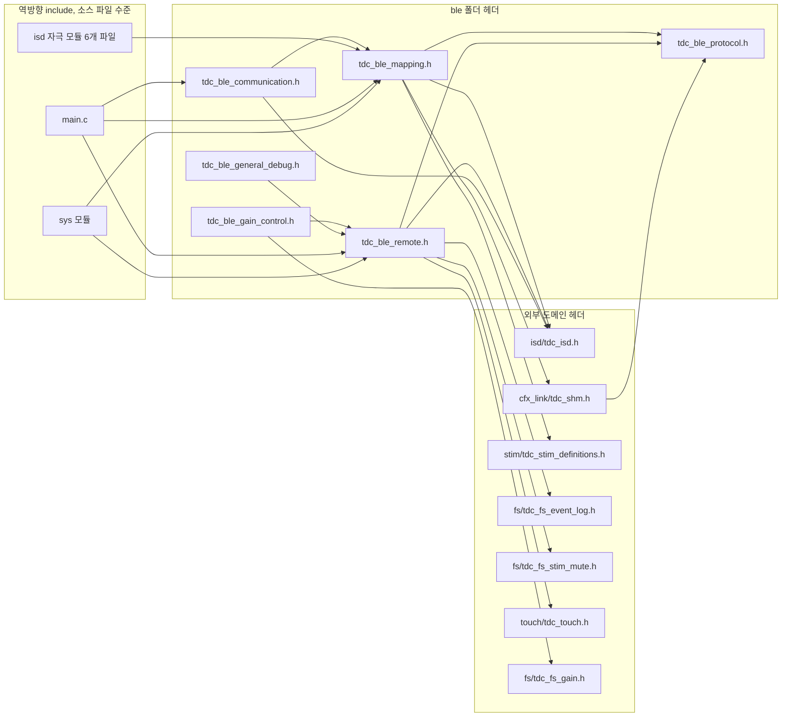

# BLE 결합도와 계층 경계

**TL;DR**: `ble/`의 외부 공개 API는 사실상 `tdc_ble_communication_step()` 하나뿐인데, 반대 방향으로 `isd/` 6개 파일이 `ble/` 내부 상태를 56회 직접 읽고 클리어한다 - `ble/`와 `isd/`가 하나의 상태머신을 두 폴더에 나눠 가진 셈이다. `ble/`는 10V·DAC 레지스터를 직접 만지지 않지만 자극 FSM 4종을 매 tick 트리거하고 라이브 자극 안전범위를 직접 계산한다. 폴더 분할은 `ble/` 내부보다 이 역결합이 최대 걸림돌이다.

## 1. 나가는 의존 (`ble` -> 외부)

호출되는 실행 횟수 기준 모듈별 결합 강도.

| 순위 | 모듈(폴더) | 호출 횟수 | 성격 / 구조적 중요도 |
|---|---|---|---|
| 1위 | `sys` | 57 | 에러 보고(56) + 조회(1). 거의 전부 `tdc_sys_error_send_to_app()`. 중요도 낮음(재구조화 위험 낮음) |
| 2위 | `util` | 46 | 로그 매크로(`TDC_PRINTF_*`). 기능 결합 아님, 중요도 낮음 |
| 3위 | `cfx_link` | 45(+ 직접 필드 접근 8곳, §4) | CFX 공유메모리 접근자. **중요도 높음** - 공유 ABI |
| 4위 | `hal` | 44 | SPI 송신(33) 등 - 전송 계층. **중요도 높음**, 프로토콜 처리에 구조적으로 필수 |
| 5위 | `isd` | 29(순방향만) | 자극/내부기 상태. 횟수는 적지만 **중요도 최고** - 양방향 상태 결합(§2·§3) |
| 6위 | `vendor_sdk`(추정) | 20 | `NVIC_*`/`Sys_*`/`SYS_WATCHDOG_*` - 레포 내 정의 미발견, HAL을 우회한 직접 접근(§5) |
| 7위 | `pwr` | 13 | 배터리/충전기 상태 |
| 8위 | `fs` | 10 | 맵 초기화·이벤트로그·게인저장·묵음설정 |
| 9위 | `touch` | 7 | 디버그 프로토콜(0x8F option1) 전용 |
| 9위 | `dfu` | 7 | OTA/부트 명령 전달 |
| 11위 | `main` | 2 | `readFirmwareInfo()`(진입점, 모듈 아님) |
| 12위 | `stim` | 1 | DAC 레지스터 조회 1회 |
| 12위 | `led` | 1 | LED 표시상태 반영 1회 |

> [!NOTE]
> 호출 빈도와 결합의 중요도는 다르다. `sys`·`util`은 횟수는 최상위지만 로그·에러보고라 재구조화 위험이 낮다. **구조적으로 가장 위험한 결합은 `cfx_link`(공유 ABI)와 `isd`(자극 트리거 + 양방향 상태 공유)**이며 아래 §2·§3에서 별도로 다룬다.

## 2. 역결합 - 재구조화 최대 걸림돌

`ble/*.h`에 선언된 함수 중 `ble/` 밖에서 실제로 호출되는 것만 골라내면, 폴더 경계를 넘는 진짜 공개 API는 6개뿐이다.

| 함수 | 호출하는 외부 파일 | 용도 |
|---|---|---|
| `tdc_ble_communication_step` | `main.c:586`(정상 tick) · `main.c:855`(크래들 절전 루프) | **유일한 정상 진입점**. main이 매 tick 호출 |
| `tdc_ble_mapping_get_packet` | `isd/` 6개 파일 | 매핑 패킷 구조체 포인터 획득 |
| `tdc_ble_mapping_clear_command` | `isd/` 5개 파일, 39곳 | 매핑 명령 상태 클리어 |
| `tdc_ble_remote_clear_command` | `isd/tdc_isd_map_data.c`, 11곳 | 리모콘 명령 상태 클리어 |
| `tdc_ble_mapping_change_command_waiting_ble_off` | `isd/tdc_isd_map_data.c:182` | 명령을 `waiting_for_BleOff`로 강제 전이 |
| `tdc_ble_gain_control_init` | `sys/tdc_sys_init.c:236` | 부팅 시퀀스 초기화 |

**`ble/`의 외부 공개 API는 사실상 `tdc_ble_communication_step()` 하나뿐이다.** 그런데 반대 방향은 이렇다.

| 함수 | isd/에서의 호출 | 횟수 |
|---|---|---|
| `tdc_ble_mapping_get_packet()` | `tdc_isd_init.c` 1 · `tdc_isd_map_data.c` 1 · `tdc_isd_map_ecap.c` 1 · `tdc_isd_map_impedance.c` 1 · `tdc_isd_map_live.c` 1 · `tdc_isd_map_specific_stim.c` 1 | 6 |
| `tdc_ble_mapping_clear_command()` | `tdc_isd_map_data.c` 13 · `tdc_isd_map_ecap.c` 13 · `tdc_isd_map_impedance.c` 9 · `tdc_isd_map_specific_stim.c` 3 · `tdc_isd_map_live.c` 1 | 39 |
| `tdc_ble_remote_clear_command()` | `tdc_isd_map_data.c` 11 | 11 |
| **합계** | | **56** |

파일별로 재집계하면 다음과 같다.

| isd/ 파일 | 호출 횟수 |
|---|---|
| `tdc_isd_map_data.c` | 25 |
| `tdc_isd_map_ecap.c` | 14 |
| `tdc_isd_map_impedance.c` | 10 |
| `tdc_isd_map_specific_stim.c` | 4 |
| `tdc_isd_map_live.c` | 2 |
| `tdc_isd_init.c` | 1 |
| **합계** | **56** |

> [!IMPORTANT]
> **`ble/`와 `isd/`는 하나의 상태머신을 두 폴더에 쪼개 갖고 있다.** `isd/`가 `ble/`의 패킷 구조체(`mappingPacket`)를 `tdc_ble_mapping_get_packet()`으로 직접 읽고, 처리를 끝내면 `tdc_ble_mapping_clear_command()`/`tdc_ble_remote_clear_command()`로 `ble/`의 명령 상태를 직접 지운다. 즉 **명령의 생성(`ble/`)과 소멸(`isd/`)이 서로 다른 폴더에서 일어난다.** `tdc_ble_mapping_get_packet()`이 `const`가 아닌 가변 포인터를 반환한다는 점(`tdc_ble_mapping.c:45-48`)이 이 결합을 구조적으로 가능하게 한다. 폴더 분할 설계는 이 사실을 전제로 세워야 한다 - 헤더 그룹만 보고 `ble/`을 나누면 `isd/`가 따라오지 않아 깨진다.

## 3. 자극 계통 접점 (안전 최중요)

**`ble/`는 10V·DAC 레지스터를 직접 만지지 않는다** - `tdc_isd_enable_stimul_10v()`·`tdc_isd_path_open()` 호출은 전수 검색 결과 0건(확인완료). 그러나 다음 3경로로 자극에 관여한다.

| 접점 | 내용 | 근거 |
|---|---|---|
| 접점_1 | **자극 FSM 4종을 매 tick 직접 구동**. `tdc_ble_mapping_step()`의 switch가 그 tick 안에서 isd의 자극 실행 함수를 직접 호출한다 | `tdc_ble_mapping.c:1902`(임피던스) · `:1919`(eCAP) · `:1943`(특정자극) · `:1956`(라이브) |
| 접점_2 | **라이브 자극 안전 경계를 직접 계산·강제**. 알림자극(0x66 하위명령5) 처리 시 CFX에 적재된 실제 T/C레벨을 읽어 `max_C_uA`/`min_T_uA`를 계산하고, 요청값이 범위 밖이면 거부한다 | `tdc_ble_mapping.c:807-871` |
| 접점_3 | **ISD 전원/10V 상태머신을 간접 재시작**. `isdControlCommand` 반환값이 `main.c`에서 다음 tick의 `tdc_isd_step()` 입력으로 전달되어 전원 시퀀스를 처음부터 다시 밟게 한다(예: `en__isdStatus_PowerIC_Reset`) | `tdc_ble_communication.c:461`, `tdc_ble_mapping.c:1878`·`:1889` |

| 구분 | 개수 |
|---|---|
| isd 자극 스텝 함수를 그 tick에 직접 호출 | 4곳(접점_1) |
| CFX 실시간 자극 데이터를 읽어 안전범위를 계산·적용 | 1곳(접점_2) |
| ISD 전원/10V 상태머신을 간접 트리거(재시작) | 2곳(접점_3) |
| 10V/DAC 레지스터 직접 조작 | **0곳(확인완료)** |

`ST__MAPPING_PACKET`의 라이브 자극 페이로드 필드명이 `tdc_isd_map_live_step` 등 isd 함수명과 동일하게 명명돼 있는 점(`tdc_ble_mapping.h:115-116`)은 우연이 아니라 "이 필드 뭉치가 그 isd 함수의 입력이다"라는 설계 의도로 읽힌다. `ST__MAPPINGPAYLOAD_LIVE_STIMULATION`(`tdc_ble_mapping.h:50-75`)과 CFX 공유메모리 구조체 `ST__CFX_CM3_SharedMemory_mapData`(`cfx_link/tdc_shm.h:114-131`)는 필드 구성이 거의 1:1 대응한다 - `ble/`의 파싱 결과 구조체가 CFX 공유메모리 구조체의 미러에 가깝다.

## 4. 계층 위반

| # | 위반 | 근거 |
|---|---|---|
| 위반_1 | BLE 코드가 SPI1/DMA/NVIC 레지스터를 `hal/` 래퍼 없이 직접 조작 | `tdc_ble_communication.c:352-391`(SPI 에러 복구 경로) - `NVIC_DisableIRQ`·`Sys_SPI_TransferConfig`·`Sys_DMA_Mode_Enable`·`NVIC_ClearPendingIRQ`·`SPI1->STATUS` 직접 대입. `tdc_ble_mapping.c:1869,2078`의 `Sys_Delay()`(강제 리셋 대기 busy-wait)도 동일 유형 |
| 위반_2 | 프로토콜 파서가 자극 실행 FSM을 구동 | §3 접점_1 |
| 위반_3 | 공유메모리 접근자(`tdc_shm_*`)를 우회한 `cfx_cm3_sharedMemoryAll` 직접 필드 접근 8곳 | 아래 표 |
| - | 파일시스템 직접 접근 | **없음**(확인완료) - `fs/tdc_fs_*` 접근자를 통해서만 접근 |

**공유메모리 접근자 우회 8곳**

| 필드 | 읽기/쓰기 | 위치 |
|---|---|---|
| `is_i2s_source_cradle` | 쓰기 | `tdc_ble_communication.c:221` |
| `is_i2s_source_cradle` | 쓰기(초기화 0) | `tdc_ble_gain_control.c:31` |
| `gain_table_index_a` | 쓰기 | `tdc_ble_gain_control.c:29,117` |
| `gain_table_index_b` | 쓰기 | `tdc_ble_gain_control.c:30,121` |
| `gain_table_index_a`/`_b` | 읽기 | `tdc_ble_gain_control.c:107,110,146,147` |
| `systemShare.system_opMode` | 읽기 | `tdc_ble_gain_control.c:132` |
| `is_enabled_mute_stimulation_under_t_level` | 읽기 | `tdc_ble_remote.c:1227,1274,1308` |
| `mute_stimulation_t_level_offset` | 읽기 | `tdc_ble_remote.c:1228,1275,1294,1309` |

`cfx_cm3_sharedMemoryAll`은 `cfx_link/tdc_shm.h:1-14`에 "공유 ABI - 단독 rename/제거 금지"로 명문화된 구조체다. 위 8곳 중 자극과 직결되는 것은 `mute_stimulation_t_level_offset`이나, `ble/`는 이 값을 읽기·응답에만 쓰고 실제 쓰기는 `tdc_fs_stim_mute_update()`(`fs` 모듈) 내부에서 이뤄진다.

## 5. 헤더 의존 그래프

**순환 include 여부**: `ble/*.h` 사이, `ble/*.h`와 외부 헤더 사이에 **헤더 레벨 순환 include는 없다**(확인완료). `isd/`의 개별 헤더(`tdc_isd_map_live.h` 등)는 `ble/`를 include하지 않는다. 다만 **.c 레벨의 상호 의존은 존재한다** - `ble/tdc_ble_mapping.c`는 `isd/` 헤더를 include해 isd 함수를 호출하고, 거꾸로 `isd/tdc_isd_map_live.c` 등은 `ble/tdc_ble_mapping.h`를 include해 `ble/` 구조체를 읽는다. 헤더 순환은 아니지만 번역단위(.c) 수준의 상호 의존이다.

타입 결합도 같은 방향이다 - `ST__ISD_STATUS`·`EN__ISD_CONTROL_STATE`(`isd/tdc_isd.h`)는 `ble/`의 반환 구조체 3종 전부의 필드 타입이라, **`isd/` 없이는 `ble/` 헤더 자체가 컴파일되지 않는다.** `EN___STIMULATION_MODE`(`cfx_link/tdc_shm.h`)는 매핑 페이로드 구조체 필드 타입으로 쓰여 `tdc_ble_mapping.h`가 `tdc_shm.h` 전체(409줄, 공유 ABI 19타입)를 include해야 한다. 역방향 사례도 있다 - `sys/tdc_sys_error.h`가 `EN__MAPPING_COMMAND`(ble 타입)를 공개 함수 파라미터로 채택해 `tdc_ble_mapping.h`를 include한다.

## 6. 분할 시 걸림돌

`ble/mapping`·`ble/remote`·`ble/system` 같은 헤더 그룹별 하위 폴더 분할을 가정했을 때 파일 단위로 깨끗이 갈라지지 않는 지점이다.

| # | 걸림돌 | 근거 |
|---|---|---|
| 걸림돌_1 | `tdc_ble_mapping.c/.h`는 `isd/` 없이 독립적으로 옮길 수 없다 | §2 - `isd/` 6개 파일이 상태를 56회 직접 조작 |
| 걸림돌_2 | `mappingPacket`의 페이로드 구조체가 `cfx_link`의 공유 ABI 구조체와 필드 미러링돼 있다 | §3 - `ST__MAPPINGPAYLOAD_LIVE_STIMULATION` ↔ `ST__CFX_CM3_SharedMemory_mapData`. `tdc_shm.h`는 CFX·calibration 프로젝트와도 공유되는 "단독 rename/제거 금지" ABI라, 매핑 그룹을 손대면 그 정합성까지 영향받을 수 있다 |
| 걸림돌_3 | `en__isdStatus_PowerIC_Reset` 반환 로직이 `communication`·`mapping` 2곳에 중복 산재 | `tdc_ble_communication.c:461`, `tdc_ble_mapping.c:1878,1889` - `system` 그룹을 분리해도 ISD 리셋 트리거 책임이 두 그룹에 걸쳐 있음을 그대로 유지하거나 재설계해야 함 |
| 걸림돌_4 | 공장초기화(0x71/0x57) 강제 리셋 루프가 `mapping`과 `remote`에 거의 동일하게 중복 구현 | `tdc_ble_mapping.c:2058-2083`, `tdc_ble_remote.c:1151-1170` - 폴더를 쪼개도 이 패턴은 두 그룹에 각각 존재해, 분할이 중복 제거를 자동으로 달성하지 못함 |
| 걸림돌_5 | `tdc_ble_communication.c`가 `mapping`·`remote` 양쪽 결과 병합과 SPI 하드웨어 에러 복구(위반_1)를 동시에 담당해 세 그룹 어디에도 깔끔히 속하지 않는다 | `tdc_ble_communication.c:291-345`(디스패치) · `:352-391`(에러 복구) · `:406-471`(상태 병합) |
| (참고) | `tdc_ble_gain_control.c`·`tdc_ble_general_debug.c`는 이미 파일 단위로 성공 분리된 선례다 | `remote_h`에서 타입만 빌려 쓰고 "패킷 포인터 주입 + `tx_index` 반환" 순수함수형 템플릿으로 독립 - 걸림돌이 아니라 재사용 가능한 템플릿 |
