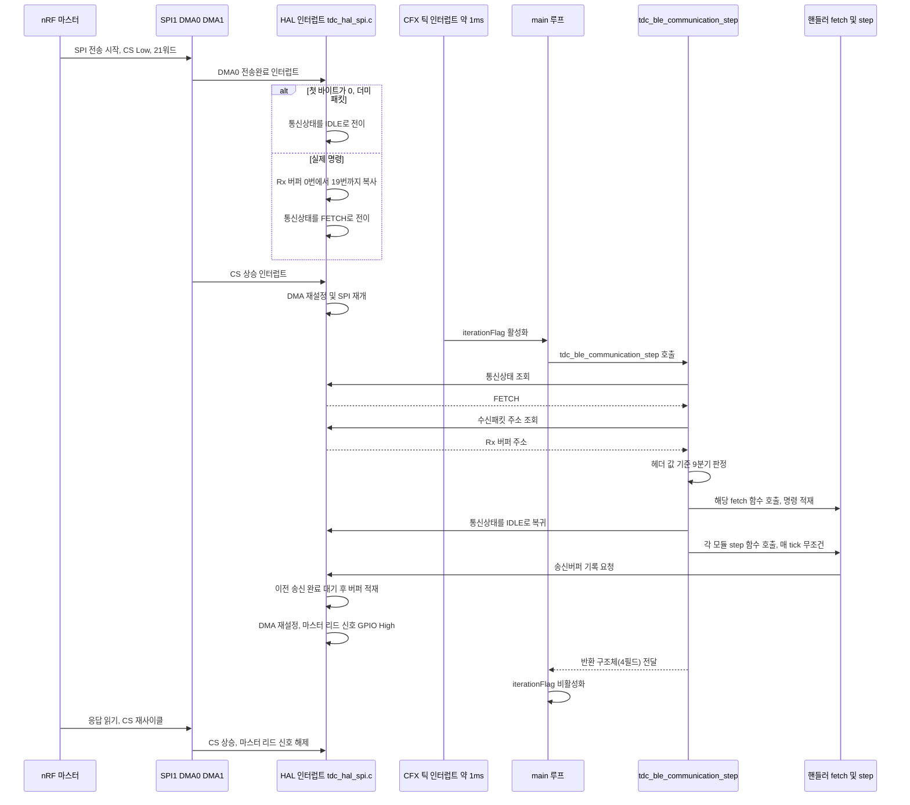

# BLE 아키텍처와 디스패치

**TL;DR**: CM3 BLE 처리는 SPI 인터럽트가 채우는 단일 수신 버퍼를, 메인 루프가 매 tick(약 1ms 추정) `tdc_ble_communication_step()`으로 폴링해 헤더 값 9분기로 디스패치하는 구조다. 각 모듈의 `fetch`가 명령을 전역 구조체에 적재하면, 같은 함수 호출 안에서 `step`이 그 상태를 소비해 응답까지 조립한다. 조용히 버려지는 헤더 구간과 반환값 4필드의 소비처를 정리한다.

## 1. fetch/step 2단 구조

BLE 명령 처리는 계층마다 역할이 분리된 2단 구조 하나로 통일돼 있다.

| 계층 | 파일 | 책임 | 근거 |
|---|---|---|---|
| HAL(하드웨어 추상화) | `tdc_hal_spi.c/.h` | SPI1/DMA0/DMA1 인터럽트, 21바이트 원시 버퍼(`SPI_Rx_Buffer`/`SPI_Tx_Buffer`) 관리, `comm_state` 플래그. 헤더 바이트의 의미는 모른다 - 순수 바이트 파이프 | `tdc_hal_spi.c:159-164`(RX 적재) |
| 프로토콜 디스패치 | `tdc_ble_communication.c` | `comm_state` 폴링, 20바이트 헤더 기반 라우팅, 각 모듈 `fetch_xxx_packet()`/`step()` 호출 | `tdc_ble_communication.c:232-474` |
| 파싱(fetch) | 명령별 `*_fetch_packet()` | Rx 20워드를 명령별로 파싱해 전역 구조체(`bleSettingPacket`/`remoteDataPacket`/`mappingPacket`)에 적재. 다중 패킷 명령은 데이터 인덱스로 재조립 | `tdc_ble_mapping.c:52-1775`, `tdc_ble_remote.c:50-619` |
| 실행(step) | 명령별 `*_step()` | 매 tick 무조건 호출되어 전역 구조체에 적재된 명령을 실행하고 응답을 조립·송신 | `tdc_ble_mapping.c:1777-2171`, `tdc_ble_remote.c:638-1389` |

핵심은 **fetch와 step이 "같은 tick, 같은 함수 호출 안에서" 순차 실행된다**는 점이다. `tdc_ble_communication_step()`은 디스패치 체인(:291-345)에서 헤더가 매치되면 해당 모듈의 `fetch_xxx_packet()`을 호출해 명령을 적재하고, 그 아래(:398, :401, :404)에서 `setting_nrf_ble_adv_info()` / `tdc_ble_remote_step()` / `tdc_ble_mapping_step()`을 **FETCH 여부와 무관하게 매 호출마다 무조건** 실행한다. 따라서:

- **단일 패킷 명령**은 명령 수신부터 응답 송신까지가 단일 `tdc_ble_communication_step()` 호출(같은 tick) 안에서 완결될 수 있다.
- **다중 패킷 명령**(데이터 인덱스 사용, 예: 0x66·0x68·0x6C·0x6D)은 여러 tick에 걸쳐 fetch가 반복 호출되며 전역 구조체에 값을 누적하고, 마지막 인덱스가 완결된 tick에야 step이 최종 커밋·응답한다.
- step은 fetch가 이번 tick에 아무것도 적재하지 않았어도 매번 호출되므로, 이전 tick에 시작된 다중-tick 작업(예: 워치독 강제 리셋 루프)을 계속 진행할 수 있다.

> [!NOTE]
> 매핑 모듈은 `fetched_command`(fetch가 채움)와 `command`(step이 소비) 이중 상태를 둬서, "ISD backtel 연결확인이 진행 중이면 명령 실행을 늦춘다"는 게이팅을 구현한다(`tdc_ble_mapping.c:1798-1817`). 이 이중 상태가 명령마다 일관되게 쓰이지 않는 문제는 [`복잡도 실측.md §7`](복잡도%20실측.md)에서 다룬다.

## 2. 전체 경로 - SPI 수신부터 응답 송신까지

근거: 수신 인터럽트(`tdc_hal_spi.c:51-167`), 디스패치·소비(`tdc_ble_communication.c:232-474`), 송신(`tdc_hal_spi.c:287-377`). 응답 송신 완료(마스터 리드 신호 해제)는 `DMA1_IRQHandler`가 아니라 `SPI1_COM_IRQHandler`의 CS 상승 분기(`tdc_hal_spi.c:122`)에서 처리되며, `DMA1_IRQHandler`의 성공 경로는 빈 블록이다(`tdc_hal_spi.c:193-195`).

> [!CAUTION]
> `Rx_DataPacket`(`tdc_hal_spi.c:22`)은 단일 전역 버퍼이고, `DMA0_IRQHandler`(`tdc_hal_spi.c:159-164`)는 소비 여부를 확인하지 않고 매 수신마다 무조건 덮어쓴다. 한 tick(약 1ms) 사이에 SPI 트랜잭션이 2회 이상 발생하면 앞선 패킷은 디스패치되지 못하고 유실된다.

## 3. 디스패치 9분기 조건 분해

`tdc_ble_communication_step()`의 if-else 체인(`tdc_ble_communication.c:291-345`). 9개 매치 조건이 커버하는 구간은 **서로 겹치지 않는다** - 순서를 바꿔도 기능은 동일하며, 순서가 영향을 주는 것은 비교 횟수(성능)뿐이다.

| 조건 | 조건식 요약 | 커버 헤더 범위(16진) | 대상 핸들러 | 근거 |
|---|---|---|---|---|
| 조건_1 | `h == en__bleSetting_ReadConnected_ISD_info` | `0x30` | `fetch_readDataForBleSetting()` | `:291-294` |
| 조건_2 | `en__remoteControl_check_isd_passKey <= h < en__mapping_connect` | `0x40~0x5F` | `tdc_ble_remote_fetch_packet()` | `:297-301` |
| 조건_3 | `(en__mapping_connect <= h <= en__mapping_waiting_for_BleOff) or h==en__mapping_testStimulation or h==en__mapping_read_Connected_ISD_id` | `0x60~0x72`, `0x90`, `0x91` | `tdc_ble_mapping_fetch_packet()` | `:304-310` |
| 조건_4 | `EN__SND_BT_CMD_SYSTEM_INFO_BATTERY <= h <= ..._CLASSIC_STATE` | `0x33~0x36` | `fetch_readDataForBleSetting()` | `:312-320` |
| 조건_5 | `h == PKT_HEADER_BOOT` | `0xC2` | `tdc_dfu_ble_fetch_boot()` | `:322-325` |
| 조건_6 | `h == OTA_START or h == OTA_END` | `0xC0`, `0xC1` | `tdc_dfu_ble_fetch_ota_start_end()` | `:326-330` |
| 조건_7 | `h == CI_BLE_OTA_COMMAND_OTA` | `0xC3` | `tdc_dfu_ble_fetch_ota()` | `:331-334` |
| 조건_8 | `h == EN__SND_BT_CMD_GAIN_CONTROL` | `0x8C` | `tdc_ble_remote_fetch_packet()` | `:335-338` |
| 조건_9 | `h == EN__SND_BT_CMD_GENERAL_DEBUG` | `0x8F` | `tdc_ble_remote_fetch_packet()` | `:339-342` |
| 조건_10(빈 else) | 위 어느 것도 아님 | §4 참조 | 없음(조용히 폐기) | `:343-345` |

값 산정 근거: `en__remoteControl_waiting_for_BleOff`는 명시적 상수 없이 이전 값(`en__remoteControl_specificSystemOperationSetting = 0x59`)에 이어지는 암묵 증가값이라 `0x5A`(`tdc_ble_protocol.h:81`). `en__mapping_waiting_for_BleOff`도 `en__mapping_recover_ALL_SlotData_ManufactureData(0x71)`의 암묵 증가값 `0x72`(`tdc_ble_protocol.h:110`).

> [!NOTE]
> 조건_8(0x8C 게인 제어)과 조건_9(0x8F 범용 디버그)는 리모콘 핸들러(`tdc_ble_remote_fetch_packet()`)로 라우팅되지만, 실제 처리는 그 안에서 각각 `tdc_ble_gain_control_handle()` · `tdc_ble_general_debug_handle()`로 즉시 위임된다(`tdc_ble_remote.c:1200-1207`, `:1186-1193`).
>
> 조건_3으로 라우팅되는 `0x90`(`en__mapping_testStimulation`)은 매핑 `fetch_packet`/`step` 어디에도 처리 case가 없어 매번 `en__UndefinedCommand` 에러 응답만 반환한다 - 디스패치 자체는 정상이지만 핸들러 부재로 응답이 무의미해지는 사례다. 상세는 [`복잡도 실측.md`](복잡도%20실측.md)를 참조.

## 4. 조용히 버려지는 헤더 값

빈 `else{}`(`:343-345`)로 떨어져 아무 핸들러도 호출되지 않는 구간이다.

| 구간(16진) | 상태 |
|---|---|
| `0x00` | 값 자체는 `en__bleSetting_IDLE`로 정의돼 있으나, **디스패치 체인에 도달조차 못 한다** - `DMA0_IRQHandler`가 첫 바이트 0을 더미 패킷으로 간주해 `IDLE`로 처리하고 FETCH로 승격시키지 않는다(`tdc_hal_spi.c:153-156`) |
| `0x01~0x2F` | 미정의 구간. 정의된 프로토콜 상수 없음 |
| `0x31` | `en__BLE_COMM_COMMAND_connecteLogDate`로 열거형에는 정의돼 있으나, 정의부 외에 참조하는 코드가 전무하다(전수 grep 확인) |
| `0x37~0x3F` | `EN__SND_BT_CMD_SYSTEM_INFO_CLASSIC_STATE`(0x36)와 리모콘 시작(0x40) 사이 미정의 구간 |
| `0x73~0x8B` | 매핑 종료(0x72)와 `EN__SND_BT_CMD_GAIN_CONTROL`(0x8C) 사이 미정의 구간 |
| `0x8D~0x8E` | `0x8C`와 `0x8F` 사이 미정의 구간 |
| `0x92~0xBF` | 매핑 확장(0x91)과 DFU 시작(0xC0) 사이 미정의 구간 |
| `0xC4~0xFF` | OTA(0xC3) 이후 미정의 구간 |

> [!IMPORTANT]
> `0x32`(`en__BLE_Disconnected_Flag`, BLE 연결 해제)는 디스패치 체인 관점에서는 else로 떨어지지만 **"조용히 버려지는" 값이 아니다** - `tdc_ble_communication_step()` 함수 후반부(`:450-471`)에서 디스패치 체인과 완전히 독립적으로, comm_state와 무관하게 매 호출마다 무조건 검사·처리된다. "헤더로 분기한다"는 디스패처의 일관된 규칙이 이 값에 대해서만 예외적으로 깨진다는 뜻이다.
>
> BLE 프로토콜 정의는 CM3 미참조 상태(`0x31` 등)여도 제거 대상이 아니다 - [`../../cm3-소스-트리-규약.md §2.1`](../../cm3-소스-트리-규약.md).

## 5. 호출 주기와 반환값의 소비

### 5.1 호출 주기

`tdc_ble_communication_step()`은 두 지점에서 호출된다.

| 호출부 | 게이팅 | 반환값 처리 |
|---|---|---|
| `main.c:586`(`tdc_normal_iteration()` 안) | `iterationFlag == true`일 때만 실행. `iterationFlag`는 `CFX_0_IRQHandler`/`FIFO_5_IRQHandler`(`tdc_hal_cfx_tick.c:8-22`)에서만 켜지고, `tdc_normal_iteration()` 끝에서 매번 꺼진다(`main.c:620`) | §5.2 표대로 각 필드가 소비됨 |
| `main.c:855`(`func_cradle_lid_closed_loop()` 안) | 크래들 뚜껑 닫힘 시의 절전 루프. `iterationFlag` 게이팅 없이 인터럽트 대기 후 즉시 재호출 | 더미 ISD 상태(`en__isdStatus_NA, false`)를 입력하고 반환값은 `(void)`로 전량 폐기 - 목적은 SPI 응답 송신 부수효과(뚜껑 상태 갱신)만 살려두는 것 |

호출 주기는 **CFX FIFO 인터럽트 1회당 1회**이며, `tdc_hal_timer.c`의 변수명(`_tdc_hal_timer_elapsed_1msec_counter`)과 `tdc_sys_control.c:108-113,346-351`의 주석 근거로 **약 1ms로 추정**된다. 정확히 1.000ms인지(오디오 클럭 설정 의존)는 CM3 소스만으로는 확인 불가 - **미확인**.

### 5.2 반환값(`ST__BLE_COMMUNICATION_STATE`) 4필드의 소비처

| 필드 | 소비 위치 | 용도 |
|---|---|---|
| `isdControlCommand` | `main.c:579` (다음 tick `tdc_isd_step()` 입력) | ISD(내부기) 제어 상태 전이. 매핑 값이 우선, 리모콘은 매핑이 `NA`일 때만 보조 반영 |
| `mappingConnection` | `main.c:500`(파워오프 게이트) · `:572`(다음 tick `tdc_sys_control_step()` 입력) · `:596`(매핑 모드 적용) · `:598`(LED 요청 갱신) · `:603`(nRF 전원 On/Off) · `:606`(UI 명령) | 매핑 앱 연결 여부에 따른 시스템 모드·LED·nRF 전원·파워오프 허용 판단 |
| `StimulationIndicatorTrigger` | `main.c:588-591` (`tdc_stim_indicator_out()`) | 자극 표시등 트리거 |
| `BLE_Off_Command` | `main.c:603` (`tdc_sys_control_nrf_on_off()`) | nRF(BLE) 전원 On/Off 판단 입력 |

`mappingConnection`/ISD 연결 상태는 **1-tick 지연 순환 구조**다 - 이번 tick의 반환값이 다음 tick의 `tdc_sys_control_step()`/`tdc_isd_step()` 입력으로 다시 들어간다(`main.c:557`, `tdc_sys_control.c:108-113,346-351` 주석). 이 지연은 "시간 누적 판정 또는 사람 조작 스케일 소비처만 있어 1ms 지연은 무해하다"고 코드 주석이 명시적으로 정당화한다.

## 6. 파일별 규모

| 파일 | 줄 수(LF 기준) | 비중 |
|---|---|---|
| `tdc_ble_mapping.c` | **2,196** | 47.4% |
| `tdc_ble_remote.c` | **1,389** | 30.0% |
| `tdc_ble_communication.c` | 474 | 10.2% |
| `tdc_ble_remote_sp_para.c` | 272 | 5.9% |
| `tdc_ble_general_debug.c` | 156 | 3.4% |
| `tdc_ble_gain_control.c` | 150 | 3.2% |
| **합계** | **4,637** | |

> [!CAUTION]
> 줄 수는 LF 개수 기준 실측이다. PowerShell `Get-Content | Measure-Object -Line`은 빈 줄을 세지 않아 최초 측정에서 약 20% 낮게 나온 전례가 있다 - 다른 도구로 측정할 때 이 함정에 유의한다.
