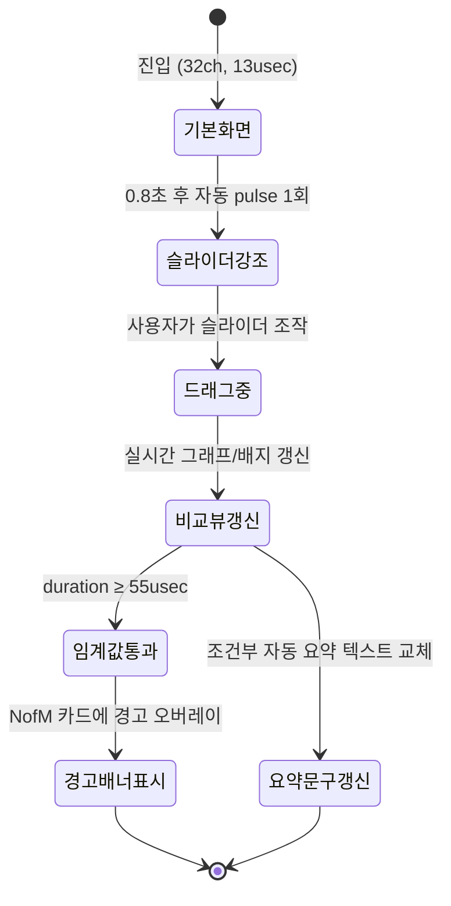

> [!CAUTION]
> 검증 결과: **"NofM 유효조건: M≥17 (M≤16이면 CIS만 사용)"은 off-by-one 오류(ISSUE, CONFIRMED)**. 실제 코드(`stimulationParaCal.c:591`)는 `numFrequencyBand < 16`일 때만 비활성 — 즉 **M=16은 정상적으로 NofM이 작동**하며, 올바른 경계는 "M≥16이면 NofM 가능 / M≤15이면 CIS 폴백"이다. 아래 본문·§0 표·§5.1·템플릿 D는 원문 그대로 보존하되, 실제 구현 시 반드시 M≥16/M≤15 기준으로 정정할 것. 나머지(duration=55usec 임계값, 온보딩/인터랙션 설계)는 CONFIRMED. §08_검증리포트.md, §09_검증반영_최종결정.md 참조.

# CIS vs NofM 자극 출력 패턴 & PCM/COLA 타이밍 뷰어 — UX/인터랙션 설계

## 0. 설계 근거 요약

| 항목 | 값 | 근거 |
|---|---|---|
| CIS 프레임 수 공식 | `frames(d) = floor((2d+14)/41) + 1` | 코드 검증 |
| CIS 채널/ms | `floor(24/frames(d))` | 코드 검증 |
| NofM 프레임/채널 수 | 3프레임·8채널/ms 고정(duration 무관) | 코드 검증 |
| NofM 유효 조건 | ~~M≥17 (M≤16이면 CIS만 사용)~~ → **정정: M≥16 (M≤15이면 CIS만 사용)** | 코드: `numFrequencyBand<16`이면 비활성 |
| NofM PPS | 500(고정) | 2ms에 16채널 전부 순환 |
| CIS PPS(예: 32채널·d=13) | 750(가변) | 24채널/ms÷32채널×1000 |
| NofM 3프레임 예산 초과 임계 | duration=55usec(초과 시작)/54usec(안전 상한) | 코드 계단함수 검증 |
| duration 유효 범위 | 13~255usec | 요구사항 원문 |

## 1. 온보딩 흐름

### 1.1 기본값과 첫 화면

- 기본값: 채널 수=32, duration=13usec. 좌우 2분할(CIS|NofM) 카드, 상단에 "PPS·idle 비율" 배지 즉시 노출.
- 헤드라인: "같은 순간, CIS는 32채널을 계속 돌리고 NofM은 절반(16채널)만 반복합니다. duration을 움직이면 무엇이 달라질까요?"
- 서브헤드: CIS "duration이 늘수록 프레임을 더 씁니다. 채널 자극 속도가 느려져요." / NofM "언제나 3프레임·8채널 고정. 대신 속도(500pps)는 절대 변하지 않아요."

### 1.2 "duration을 움직여보라" 유도 장치

1. 슬라이더 트랙 위 미니 눈금 마커(13/34/54/55/255 지점).
2. 최초 1회 스포트라이트 툴팁: "duration을 오른쪽으로 끌어보세요 — PCM 패킷 개수가 바뀌면서 COLA 전송 시간과 IDLE 구간이 함께 변합니다."
3. 프리셋 칩 버튼: `13usec(최소)`·`33usec`·`54usec(NofM 한계 직전)`·`55usec(NofM 초과 시작)`·`255usec(최대)`.

### 1.3 온보딩 상태 흐름

## 2. 인터랙션 흐름

### 2.1 갱신 방식 분리

| 갱신 대상 | 방식 | 이유 |
|---|---|---|
| 숫자 배지(프레임 수·PPS·idle%) | 드래그 중 실시간 | 즉각 반응이 "손맛" |
| SVG/Canvas 타임라인 | `requestAnimationFrame` 코얼레싱 | 매 픽셀 리드로잉 시 끊김 |
| 자동 요약 문장(§4) | 드래그 종료 후 100~150ms 디바운스 | 드래그 중 문장 변경은 읽기 불가 |
| 경고 배너 등/소멸 | 임계값 즉시(디바운스 없음) | 안전 신호는 지연 없이 |

### 2.2 강조 대상

- IDLE 슬롯 색상/패턴 전환(활성=채도 높은 실색, IDLE=사선 해칭+낮은 채도+breathing 애니메이션).
- 41usec 배수 경계(14,34,55,75...) 통과 시 새 프레임 슬롯 테두리 0.3초 노란색 flash("계단식 변화=정상"임을 인지시킴).
- NofM 고정창(3×41=123usec) 점선 기준선 — COLA 막대가 가까워질수록 초록→노랑→빨강 그라디언트.
- 좌우 동기 재생 헤드(playhead) 공유 — CIS/NofM 동시 스크러빙.

## 3. NofM 3프레임 예산 초과 경고

### 3.1 트리거 기준 (2단계: 임박→초과)

| 구간 | 배너 레벨 |
|---|---|
| duration < 48 | 표시 없음 |
| 48 ≤ duration ≤ 54 | 주의(정보성, 노랑 ⓘ) |
| duration ≥ 55 | 경고(빨강 ⚠, NofM 카드 상단 고정) |

### 3.2 배너 카피 예시

- 임박: "duration이 {d}usec으로 NofM의 3프레임 고정 예산에 가까워지고 있습니다. 55usec부터는 NofM이 정상 동작을 보장하지 못합니다."
- 초과: "duration={d}usec는 NofM이 지원하는 3프레임 예산을 초과합니다. 펌웨어에서 NofM은 프레임 수가 항상 3으로 고정돼 있어(`frameNumPerOneChannel=3`), 이 구간에서는 COLA 전송이 잘리거나 clock-rate 오류로 이어질 수 있습니다."
- 대비 강조: "CIS는 duration이 커지면 프레임 수를 자동으로 늘려 대응하지만, NofM은 8채널 동시 자극 구조(8×3프레임=24슬롯) 때문에 프레임 수를 바꿀 수 없습니다. 이 값에서 NofM 그래프는 참고용(이론치)이며 실제 펌웨어 동작과 다를 수 있습니다."

## 4. 조건부 자동 요약 문구 템플릿

- **A(정상, 13≤d≤47)**: "현재 duration={d}usec에서는 CIS가 초당 {cis_pps}회, NofM이 초당 500회(고정)로 채널을 자극합니다. 채널당 idle 비율은 NofM이 {nofm_idle}%로 CIS({cis_idle}%)보다 {높/낮}습니다."
- **B(임박, 48~54)**: "duration={d}usec는 NofM의 3프레임 한계(55usec)에 근접했습니다. 안정적인 여유 확보를 위해서는 47usec 이하 사용을 권장합니다."
- **C(초과, ≥55)**: "⚠ duration={d}usec는 NofM이 정상 지원하지 못하는 값입니다(55usec 초과). 이 구간에서는 CIS만 신뢰할 수 있는 비교 대상입니다."
- **D(NofM 자체 불가)**: ~~"선택한 채널 수(M)가 16 이하라 NofM은 의미가 없습니다"~~ → **정정: "M이 15 이하"** 기준으로 표시.
- **E(전력 종합, 항상 표시)**: "정리하면, duration={d}usec·채널 {M}개 조건에서 {승자}가 채널당 idle 비율이 더 높아, duty-cycle 관점에서 상대적으로 전력 여유가 {더/덜} 있는 것으로 추정됩니다(실측 전력값이 아닌 duty-cycle 기반 추정치)."

## 5. 에러/엣지 케이스 UX

### 5.1 채널 수 ≤ 15인데 NofM 선택 시 (※정정: 원문 "≤16"→"≤15")

- 채널 수가 15 이하로 내려가는 순간 NofM 토글 즉시 비활성화+인라인 설명.
- 인라인 카피(정정): "NofM 비활성 — 사용 가능 채널이 15개 이하입니다. N of M은 항상 16 of M 구조라 M이 16 미만이면 CIS와 다를 게 없어요."

### 5.2 duration=255(극단값)

- 에러가 아니라 "극단 구간" 안내: "duration=255usec에서는 CIS도 ms당 1채널만 처리합니다({K}개 채널을 모두 순회하는 데 약 {K}ms 소요). 자극 속도가 크게 느려지는 구간이니 참고하세요."

### 5.3 41usec 배수 경계에서 계단식 점프

- "프레임 수가 {n-1}→{n}으로 바뀌었습니다. PCM 프레임은 41usec 단위로만 늘어나기 때문에 그래프가 매끄럽지 않고 계단식으로 변합니다(정상 동작)."

### 5.4 duration 최소값 미만 입력

- "duration 최소값은 13usec입니다 — biphasic 펄스 최소 위상 길이(negative 13 + gap 4 + positive 13)로 정해진 하한입니다."

## 요약

온보딩은 "32채널·13usec 좌우 비교"로 시작해 프리셋 칩으로 임계값을 직접 체험시키고, 인터랙션은 숫자 즉시반응·그래프 rAF 코얼레싱·요약문 디바운스로 역할을 분리한다. 경고는 코드 검증 `duration=55usec` 임계값에 근거하며, 임박(48~54)·초과(55+) 2단계로 완충한다. **단, NofM 활성화 채널 수 기준은 M≥16(M≤15면 CIS)으로 정정해 구현할 것.**
