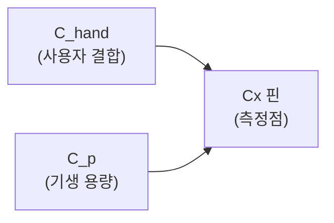

# AZD004 — 센싱 기술

> [!NOTE]
> **TL;DR**: Azoteq AZD004 v1.1(2025-03) §3의 4개 센싱 기술을 원문 기준으로 정리한다. 자기용량(접촉 시 카운트 감소, 약 250 kHz), 상호용량(접촉 시 카운트 증가, 약 1 MHz), 공진 인덕티브(LC 탱크 공진 주파수 시프트로 금속 감지), 홀 효과(전용 홀 플레이트로 자기장 측정). 수치·공식·그림 번호는 원문 그대로 인용했다.

> [!IMPORTANT]
> 본 문서는 원문 `azd004.txt`(AZD004 v1.1, 2025-03, `-layout` PDF 변환본)의 §3 "Azoteq Sensing Technologies"(원문 6~8페이지)만을 대상으로 한다. 인용 위치는 원문 추출 텍스트의 줄 번호(L)·원문 페이지·그림 번호로 표기한다. 원문에 없는 내용은 기재하지 않으며, 미명시 항목은 "원문 미명시"로 표시한다.

---

## 개요 (§3, 원문 6페이지, L234)

Azoteq의 센싱 기술은 4종으로 구성된다 (목차 §3.1~§3.4, L17~L20).

| 항목 | 절 | 원문 페이지 |
|---|---|---|
| 자기용량 센싱 (Self-Capacitive) | §3.1 | 6 |
| 상호용량 센싱 (Mutual-Capacitive) | §3.2 | 7 |
| 공진 인덕티브 센싱 (Resonant Inductive) | §3.3 | 8 |
| 홀 효과 센싱 (Hall Effect) | §3.4 | 8 |

---

## §3.1 자기용량 센싱 (Self-Capacitive Sensing) — 원문 6페이지, L236

### 원리

자기용량 기술은 평행판 커패시터 이론을 사용한다 (L237).

$$C = \frac{\epsilon_r \epsilon_o A}{d}$$

(원문 공식, L240~L242)

용량은 전극과 시스템 접지(ground) 사이에서 측정된다. 전극과 접근하는 도전체의 표면적 $A$, 그리고 둘 사이의 거리 $d$에 의존한다 (L244~L246).

### 접촉 시 동작 (원문 불릿, L248~L252)

- 손가락(또는 기타 도전체)이 전극에 접근하면 전극과 접지 사이 거리($d$)가 감소하여 사실상 용량($C$)이 증가한다.
- $Q = CV$ 공식에서 $C$가 증가하면 전송(transfer)당 전하($Q$)도 증가한다.
- 이는 기준 커패시터 $C_s$를 고정 전압까지 충전하는 데 필요한 전송 횟수를 감소시킨다. 따라서 **자기용량 응용에서 접촉 시 카운트가 감소한다**.

### 변환 주파수 (L254~L256)

- 자기용량 기술은 통상 약 **250 kHz**의 변환 주파수(conversion frequency)에서 동작한다.
- 전극의 용량이 증가하면 완전히 충전되는 데 시간이 더 걸리므로, 정확한 센싱 유지를 위해 더 낮은 변환 주파수를 요한다.

### 등가 회로 (Figure 3.1, 원문 6페이지, L258·L273)

전형적 자기용량 응용의 등가 회로 모델은 Figure 3.1에 제시된다. 구성 요소 (L263~L279):

- $C_p$: 접지 전위에 대한 전극 고유 용량 — 통상 **기생 용량(parasitic capacitance)**으로 지칭.
- $C_{hand}$: 사용자에게 결합되는 용량.
- $C_x$ 핀에서 측정되는 값은 $C_p + C_{hand}$이다.

> [!NOTE]
> Figure 3.1은 $C_{hand}$, $C_x$, $C_p$ 요소로 구성된 자기용량 회로를 보여준다 (원문 도식, L262~L273). 위 Mermaid는 원문에 기술된 측정점($C_x$ 핀에서 $C_p + C_{hand}$ 측정) 관계를 도식화한 것이다.

---

## §3.2 상호용량 센싱 (Mutual-Capacitive Sensing) — 원문 7페이지, L287

### 원리

서로 가까이 있는 전기적으로 충전된 도전체는 주위에 전기장을 형성한다. 상호용량 기술은 두 전극 사이의 용량 결합 변화(상호 용량, $C_m$)를 측정한다 (L288~L289).

상호용량 센싱은 두 전극에 의존한다 (L290~L291).

| 전극 | 기호 |
|---|---|
| 송신기(transmitter) | $C_{Tx}$ |
| 수신기(receiver) | $C_{Rx}$ |

Figure 3.2는 전극 사이 용량 $C_m$과 각 전극에 연관된 기생 용량을 보여준다 (L291~L292).

### 접촉 시 동작 (원문 불릿, L294~L299)

- 손가락(도전체)이 센서에 접근하면 전극이 손가락과 더 결합하여 전하의 일부를 사실상 "빼앗는다(steal)". 이로 인해 전극 사이 용량 $C_m$이 감소한다.
- $Q = CV$ 공식에서 $C_m$이 감소하면 전송당 전하($Q$)도 감소한다.
- 이는 기준 커패시터 $C_s$를 고정 전압까지 충전하는 데 필요한 전송 횟수를 증가시킨다. 따라서 **상호용량 응용에서 접촉 시 카운트가 증가한다**.

### 등가 회로 (Figure 3.2, 원문 7페이지, L315)

구성 요소 (L304~L315): $C_m$(전극 간 상호 용량), $Tx$, $Rx$, $C_{pTx}$·$C_{pRx}$(각 전극의 기생 용량).

### 부동(floating) 도전체 예외 (L319~L321)

> [!NOTE]
> 위 설명은 손가락이 접지(earth)에 강하게 결합된 경우를 가정한다. 접근하는 도전체가 부동(floating) 상태인 응용에서는 통상 $C_m$이 **증가**하는 것으로 관찰된다. 다만 전형적 접촉 응용에서 사용자는 접지에 밀접하게 결합된다 (원문 L319~L321).

### 변환 주파수 및 응용 (L323~L328)

- 전형적 상호용량 응용은 약 **1 MHz**의 변환 주파수에서 동작한다 (L323).
- 단일 채널 접촉 버튼, 키패드, 트랙패드에 사용 가능 (L325~L326).
- 센싱 전극들이 서로 밀접하게 결합되어 있어, 다수 전극을 인접 배치해도 전극 간 간섭이 최소화되므로 이러한 응용에 적합하다 (L326~L328).

---

## §3.3 공진 인덕티브 센싱 (Resonant Inductive Sensing) — 원문 8페이지, L339

### 원리 (L340~L344)

- 커패시터와 인덕터를 병렬 배치하면(Figure 3.3) **LC 탱크(LC tank)**가 형성된다. 이 회로는 공진 주파수 $f_{res}$를 가진다.
- 공진 주파수는 인덕터와 커패시터 값에 의존한다. 따라서 커패시터 $C$를 고정하면, 인덕턴스 $L$의 변화를 공진 주파수의 시프트로 감지할 수 있다.
- $Tx$ 노드를 공진 주파수 근처에서 구동하고 $V_{tank}$의 진폭을 측정함으로써 수행된다.

### 금속 감지 동작 (L346~L350)

- 금속 물체가 인덕터에 접근하면 물체 내에 와전류(eddy current)가 형성된다.
- 이는 LC 탱크의 주파수 응답을 시프트시키고 $V_{tank}$ 진폭의 감소를 초래한다.
- Azoteq의 ProxFusion® 및 ProxSense® IC는 $Tx$ 노드를 구동하고 $Rx$ 노드에서 $V_{tank}$ 진폭을 측정하여 인덕턴스 $L$ 변화를 측정한다. 이렇게 인덕터 근처 금속 물체의 존재를 감지한다.

### 응용 (L352~L353)

인덕티브 센서의 전형적 응용: 방수 스냅돔 버튼(waterproof snap-dome buttons), 금속 플렉스 포스 센서(metal flex force sensors).

### 회로 (Figure 3.3, 원문 8페이지, L371)

Figure 3.3은 "Inductive Sensing Mode 1"의 LC 탱크 회로를 보여준다. 구성 요소 (L355~L366): $C_{Tx}$·$R_{Tx}$($Tx$ 노드), $C_{Rx}$·$R_{Rx}$($Rx$ 노드), $C$·$L$·$V_{tank}$(탱크).

> [!NOTE]
> 이 센싱 방식의 상세 내용은 **AZD115**를 참조하라 (원문 L375).

---

## §3.4 홀 효과 센싱 (Hall Effect Sensing) — 원문 8페이지, L377

### 원리 (L378~L381)

홀 효과(Hall Effect)는 자기장 존재 시 이동하는 전하 운반자(charge carrier)가 편향되어 전위차를 생성하는 현상이다. Azoteq의 홀 센싱 IC는 이 현상을 ProxFusion® 기술과 결합하여, IC 내부의 전용 홀 플레이트(Hall plate)를 사용해 자기장 세기를 측정한다.

### 센서 구성 및 응용

| 구성 | 용도 | 응용 예 | 원문 위치 |
|---|---|---|---|
| 단일 홀 효과 센서 | 단순 자기 스위치 | 이어버드 도킹 감지 (earbud docking detection) | L383~L384 |
| 다중 홀 효과 센서 | 자기장 차분(field differential) 계산 → 이산 자석의 방향 판정 → 홀 효과 회전 인코더 | 마우스 휠, 볼륨 조절 다이얼 | L386~L388 |

> [!NOTE]
> 홀 센싱 및 회전 인코더의 상세 내용은 **AZD127**을 참조하라 (원문 L390).

---

## 부록: 4개 기술 비교 요약 (원문 §3 종합)

| 항목 | 자기용량 §3.1 | 상호용량 §3.2 | 공진 인덕티브 §3.3 | 홀 효과 §3.4 |
|---|---|---|---|---|
| 측정 대상 | 전극↔접지 간 용량 | 두 전극 간 상호 용량 $C_m$ | 인덕턴스 $L$ 변화(공진 주파수 시프트) | 자기장 세기 |
| 접촉/접근 시 카운트 | 감소 (L252) | 증가 (L299) | 원문 미명시 | 원문 미명시 |
| 변환 주파수 | 약 250 kHz (L254) | 약 1 MHz (L323) | 원문 미명시($f_{res}$ 근처 구동) | 원문 미명시 |
| 핵심 공식 | $C=\epsilon_r\epsilon_o A/d$ (L240) | $Q=CV$ (L297) | 원문 미명시 | 원문 미명시 |
| 대표 응용 | 접촉 버튼·트랙패드 (원문 §1, L90) | 단일 채널 버튼·키패드·트랙패드 (L325) | 방수 스냅돔 버튼·금속 플렉스 포스 센서 (L352) | 이어버드 도킹 감지·마우스 휠·볼륨 다이얼 (L384·L388) |
| 참조 문서 | AZD125 (원문 §1, L100) | 원문 미명시 | AZD115 (L375) | AZD127 (L390) |

> [!NOTE]
> 출처: AZD004 "Azoteq Sensing Technology Introduction", Revision v1.1, March 2025, §3(원문 6~8페이지). 본 표의 "원문 미명시" 항목은 AZD004 §3에 해당 수치·공식이 기재되지 않았음을 의미한다.
