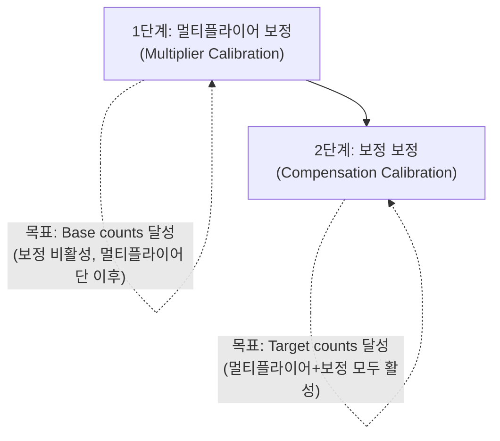

# AZD004 — 신호 조정·ATI

> [!NOTE]
> **TL;DR**: AZD004 §4(p.9~12)는 전하전송 방식의 4대 한계와 이를 보완하는 온칩 신호 조정 회로(멀티플라이어·오프셋 보정)를 다룬다. ATI(Automatic Tuning Implementation)는 Base/Target 두 파라미터로 멀티플라이어와 보정을 자동 보정하며, 민감도는 Target/Base에 비례한다. 정전용량·유도·홀 각 응용에서 ATI가 보정하는 변동 요인을 정리한다.

> [!IMPORTANT]
> 본 문서는 AZD004 (Azoteq Sensing Technology Introduction, Revision v1.1, March 2025)의 §4 Signal Conditioning(원문 p.9~12)만을 데이터시트식으로 옮긴 한국어 레퍼런스이다. 원문에 실재하는 내용만 기재하며, 수치·공식은 원문 그대로 옮긴다. 원문에 명시되지 않은 사항은 "원문 미명시"로 표기한다.

---

## 1. 신호 조정 개요 (§4 도입부, 원문 p.9)

기본 전하전송(charge transfer) 방식은 효과적인 센싱 응용을 위해 해결해야 할 여러 과제를 안고 있다 (원문 §4 도입부, lines 402~419).

| 과제 | 원문 설명 |
|---|---|
| 입력 정전용량 범위 제한 (Limited Input Capacitance Range) | 입력 정전용량 범위가 내부 기준 커패시터 크기에 의해 제약됨. 내부 기준 커패시터는 일반적으로 40 pF ~ 80 pF 수준. 다만 일부 응용은 센싱 전극에서 최대 200 pF까지의 load/parasitic 처리를 요구할 수 있음 |
| 낮은 민감도 (Low Sensitivity) | 일반적 정전용량 센싱은 미세 정전용량 변화 측정을 요구. 전극의 일반적 load/parasitic 정전용량 대비 이 작은 변화는 전체 정전용량의 1% 미만일 수 있어 터치를 신뢰성 있게 감지하기 어려움 |
| 센서 드리프트 (Sensor Drift) | 측정 정전용량이 시간에 따라 변할 수 있음. 요인: 온도·습도 변화, 기계적 변화(부품 휨 등 물리적 변화), 환경 변화(휴대 vs 탁상 등 다양한 사용 위치) |
| 통제되지 않은 측정 해상도 (Uncontrolled Measurements Resolution) | 추가 조치가 없으면 측정 해상도가 통제되지 않아 센싱 신호에 불확실성이 생김 |

이 과제를 극복하기 위해 Azoteq 디바이스는 다음 목적의 신호 조정 회로를 내장한다 (lines 421~431).

> [!NOTE]
> **온칩 신호 조정 회로의 목적** (원문)
> - **넓은 입력 신호 범위**: 기본 전하전송 방식이 처리 가능한 범위를 넘어 더 넓은 입력 신호·외부 정전용량을 수용.
> - **작은 정전용량 변화의 민감도 개선**: parasitic 정전용량을 보상하여, 터치·근접 센서 등에서 목표가 되는 매우 작은 정전용량 변화 감지에 집중.
> - **자동 튜닝**: 천천히 변하는 환경 조건을 모니터링하여 parasitic 정전용량 변화를 자동 보상하고, 내장 신호 조정 회로로 민감도를 유지.

이 온칩 보상 회로는 추가 외부 부품, 복잡한 PCB 설계 가이드라인, PCB 두께·재질·오버레이 제약의 필요성을 제거한다 (lines 433~437).

신호 조정 회로는 두 가지 주요 구조로 구성된다 (lines 439~441).
- **멀티플라이어(multipliers)**: 입력 신호의 범위/해상도를 제어.
- **오프셋 차감(offset subtraction)**: parasitic 정전용량과 DC 오프셋의 영향을 감소.

내부 아날로그 부품의 시각적 표현은 원문 Figure 4.1 (ProxSense® IC's Charge Transfer Overview, 원문 p.9, lines 453~472) 참조. 해당 그림에는 Touch Capacitance / Parasitic Capacitance가 있는 Sensing Electrode가 CX 핀으로 연결되고, Multipliers(Coarse, Fine) → Internal Compensation → Cs 순으로 구성됨이 나타난다.

---

## 2. 해상도 제어 — 멀티플라이어 (§4.1, 원문 p.10)

내부 기준 커패시터가 상대적으로 작으므로, 외부 전극에서 IC로 들어오는 전하는 분할(divide)되어 기준 커패시터를 완전히 충전하는 데 필요한 전하전송 사이클 수를 증가시킨다. 이 분할은 센서에서 보고되는 counts를 사실상 "곱하는(multiply)" 효과를 내며, "Coarse 및 Fine 멀티플라이어(Coarse and Fine Multipliers)"라 불리는 아날로그 회로 세트가 수행한다 (lines 476~480).

counts를 곱하면 센서의 측정 해상도가 증가한다 (lines 482~484).

> [!NOTE]
> **원문 예시** (line 482~484): 40 counts에 대한 10% 변화는 delta가 4 counts인 반면, 1000 counts에 대한 10% 변화는 delta가 100 counts이다.

---

## 3. 오프셋 차감 — 보정(Compensation) (§4.2, 원문 p.10)

오프셋 차감은 센싱 전극의 정적(static) parasitic 정전용량의 영향을 줄인다. 이 parasitic은 정전용량 센서의 민감도를 크게 떨어뜨릴 수 있다. 불필요한 parasitic을 차감하면 센서는 사용자 상호작용에 의한 가변 정전용량에 더 민감해진다. 즉, 신호에서 DC 성분의 일부를 제거한다. DC 신호의 일부를 제거하면 기준 커패시터로 전송되는 전하량이 더 줄어들어 counts가 증가한다 (lines 486~492).

오프셋 차감은 조정 가능한 커패시터 뱅크(adjustable capacitor bank)를 사용해 전하전송 과정 중 일정량의 고정 전하를 차감함으로써 달성된다. 차감되는 전하량은 **"보정 값(Compensation Value)"**으로 표현된다. 보정 값을 증가시키면 더 많은 parasitic 정전용량이 차감되어 센서 민감도가 증가한다 (lines 494~497).

> [!IMPORTANT]
> 보정은 두 멀티플라이어 단(stage) 이후에 수행된다 (원문 line 499: "Compensation is performed after the two multiplier stages.").

---

## 4. ATI 개요 (§4.3, 원문 p.11)

ATI(**Automatic Tuning Implementation**)는 고급 신호 처리 알고리즘을 사용해 하드웨어 센싱 회로를 자동으로 최적화한다. 자동 튜닝을 통해 설계자는 parasitic 정전용량, 환경 영향, 제조 공차 같은 설계 과제를 극복할 수 있다 (lines 511~513).

ATI는 사용자가 정의한 **"Base"**와 **"Target"** 값을 사용해 멀티플라이어와 보정을 최적 동작 범위·민감도로 보정한다. ATI는 런타임 중 자동 수행되어 다양한 환경 조건에서 최적 민감도를 유지할 수 있다 (lines 515~517).

> [!NOTE]
> **ATI의 이점** (원문 lines 519~530)
> - **민감도 증가**: 동일 센서에서 터치·근접(proximity) 이벤트 감지를 모두 개선.
> - **자동 민감도 조정**: 환경 조건이나 parasitic 정전용량 변화에 따라 민감도를 자동 조정하여 수동 개입 없이 최적 성능 보장.
> - **설계 유연성**: PCB 레이아웃, 오버레이 두께·재질의 제약을 완화하고 제조 중 보정 필요성을 단순화/제거.
> - **외부 부품·프로그래밍 불필요**: ATI는 IC 내부에서 동작하여 민감도 조정을 위한 추가 외부 부품·프로그래밍이 필요 없음.

---

## 5. ATI 단계 (§4.4, 원문 p.11~12)

Azoteq IC의 ATI 루틴은 멀티플라이어와 오프셋 보정을 보정하기 위해 두 단계로 나뉜다 (lines 533~534).

### 5.1 1단계 — 멀티플라이어 보정 (Multiplier Calibration)

원문 (lines 536~545):
- 멀티플라이어를 보정하여 원하는 수의 "Base" counts를 달성한다.
- ATI Base 값은 Coarse·Fine 멀티플라이어로 분할해 없앨 전하량을 나타낸다.
- Base 값은 멀티플라이어 단 이후이지만 보정(compensation)을 활성화하지 않은 상태에서, 내부 기준 커패시터를 채우는 데 필요한 전하전송 사이클의 목표 수를 의미한다.
- Base 값은 설계자가 지정하며, ATI 알고리즘은 측정된 결과 counts가 Base 값에 최대한 가까워질 때까지 멀티플라이어를 수정한다.
- Base 값의 일반적 범위: **100 ~ 200 counts**.

### 5.2 2단계 — 보정 보정 (Compensation Calibration)

원문 (lines 546~552):
- 오프셋 보정을 보정하여 "Target" 값에 도달한다.
- ATI target 값은 멀티플라이어와 오프셋 보정이 모두 활성화된 상태에서 내부 기준 커패시터를 충전하는 데 필요한 전하 사이클 수에 해당한다.
- 이 단계는 멀티플라이어가 이미 선택된 후에 일어난다. ATI 루틴은 센서가 Target counts에 도달할 때까지 보정 값을 조정한다.
- Target 값의 일반적 범위: **500 ~ 1000 counts**.

### 5.3 민감도 관계식

ATI는 ATI Base와 ATI Target 두 파라미터로 주로 제어된다. 두 파라미터는 다음 관계로 민감도에 영향을 준다 (lines 554~559).

$$
\text{Sensitivity} \propto \frac{\text{Target}}{\text{Base}}
$$

> [!WARNING]
> 보정을 증가시켜 센서 민감도를 높이면 센서 counts에 노이즈가 더 많아질 수 있다 (원문 line 569~570: "increasing the sensor's sensitivity by increasing compensation can result in more noise on the sensor counts").

---

## 6. 응용별 ATI 보정 대상 (§4.5~4.7, 원문 p.12)

### 6.1 정전용량 응용 (§4.5, lines 572~579)

정전용량 응용에서 ATI는 다음을 보정한다.
- parasitic 정전용량 $C_p$
- 환경(온도·습도)으로 인한 정전용량 변화
- 전극 레이아웃·라우팅의 변동
- 오버레이 두께·종류의 변화
- PCB 기판 종류 (예: FR4, FPC 등)

### 6.2 유도(Inductive) 응용 (§4.6, lines 581~587)

유도 응용에서 ATI는 다음을 보정한다.
- 환경(온도·습도)으로 인한 정전용량 변화
- 제조 중 코일의 변동
- 코일 레이아웃·라우팅의 변동
- PCB 기판 종류 (예: FR4, FPC 등)

### 6.3 홀 효과(Hall-Effect) 응용 (§4.7, lines 589~594)

홀 효과 응용에서 ATI는 다음을 보정한다.
- 자기장 변동 (Magnetic field variation)
- 환경 온도 변화
- 기계적 구현의 변동

---

## 7. 응용별 ATI 보정 대상 비교

| 보정 대상 | 정전용량 (§4.5) | 유도 (§4.6) | 홀 효과 (§4.7) |
|---|:---:|:---:|:---:|
| parasitic 정전용량 $C_p$ | O | 원문 미명시 | 원문 미명시 |
| 환경(온도·습도) 정전용량 변화 | O | O | 원문 미명시(온도만 명시) |
| 환경 온도 변화 | 원문 미명시(습도와 함께 명시) | 원문 미명시(습도와 함께 명시) | O |
| 레이아웃·라우팅 변동 | O (전극) | O (코일) | 원문 미명시 |
| 제조 중 코일 변동 | 원문 미명시 | O | 원문 미명시 |
| 오버레이 두께·종류 | O | 원문 미명시 | 원문 미명시 |
| PCB 기판 종류 (FR4·FPC 등) | O | O | 원문 미명시 |
| 자기장 변동 | 원문 미명시 | 원문 미명시 | O |
| 기계적 구현 변동 | 원문 미명시 | 원문 미명시 | O |

> [!NOTE]
> 위 비교표는 §4.5~4.7 각 목록(원문 lines 574~594)의 항목을 정리한 것이다. 원문은 정전용량·유도 응용에서 "환경(온도·습도)"으로, 홀 효과 응용에서 "환경 온도"로 표기가 다르다. 각 응용 섹션에 나열되지 않은 항목은 "원문 미명시"로 처리했다.

---

## 출처

- AZD004 — Azoteq Sensing Technology Introduction, Revision v1.1, March 2025.
- 정리 범위: §4 Signal Conditioning (도입부 및 §4.1~4.7, 원문 p.9~12).
- 인용 줄 번호는 변환 텍스트(`azd004.txt`, -layout PDF 변환본) 기준.
