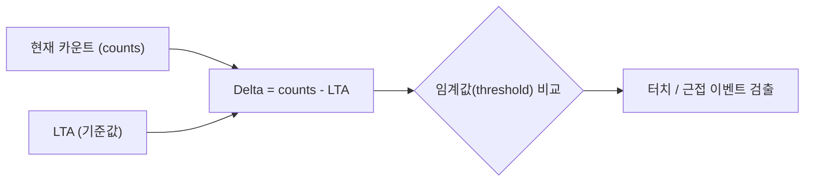

# AZD004 — 필터링·LTA

> [!NOTE]
> **TL;DR**: AZD004 §5는 IQS 센싱의 필터 체계를 다룬다. 모든 필터는 단일 베타(β) 파라미터를 쓰는 저역통과 단극 IIR 필터다. Counts(AC) 필터는 낮은 β(0~4)로 노이즈를 줄인 Filtered Counts를, LTA는 높은 β(6~10)로 느린 환경 기준값을 만든다. 터치/근접 이벤트 동안 LTA는 정지(halt)하며, halt 최대 시간 초과 시 현재 카운트로 seed되어 재보정된다. (원문 §5, pp.13~16)

원문: `azd004.txt` (AZD004: Azoteq Sensing Technology Introduction, Revision v1.1, March 2025, ProxSense® / ProxFusion® Series). 본 문서는 원문 §5 Filtering Overview(목차 라인 31~34, 본문 라인 605~891, pp.13~16)만 다룬다. 아래 인용은 모두 해당 추출 텍스트의 라인·페이지·그림·식 번호 기준이다.

## 1. 필터링 개요 (§5, 라인 605~613, p.13)

- 터치·근접 이벤트는 현재 카운트(counts)를 기준값인 **Long-Term Average(LTA)** 와 비교하여 검출한다. (라인 607~608)
- 카운트와 LTA의 차이를 **Delta**라 하며, 이 delta 값을 설정된 임계값(threshold)과 비교한다. (라인 608~609)
- LTA는 저역통과 무한 임펄스 응답(IIR) 필터로 시간에 걸쳐 천천히 갱신된다. 이를 통해 센서는 측정 신호의 작은 상대 변화를 검출하면서도 동작 환경의 미세한 변화에 최적으로 민감·적응 상태를 유지한다. (라인 611~613)

> [!NOTE]
> 위 Mermaid는 원문 라인 607~609 서술(카운트·LTA·Delta·임계값 비교 관계)을 시각화한 것으로, 원문에 동일 다이어그램이 실재하지는 않는다.

## 2. IIR("Beta") 필터 (§5.1, 라인 615~673, pp.13~14)

### 2.1 필터 구조

- IQS 디바이스가 사용하는 IIR 필터는 **"저역통과 단극 IIR 필터(low-pass single-pole IIR filter)"** 로 기술된다. (라인 616~617)
- 필터 동작은 **Figure 5.1: Beta Filter Diagram**으로 도식화된다. (라인 617, 632)

원문 Figure 5.1 다이어그램에는 다음 기호가 표기되어 있다 (라인 621~627).

| 기호 | 원문 표기 위치 |
|---|---|
| 입력 | `xk` (라인 621) |
| 출력 | `yk` (라인 621) |
| 계수 | `b0` (라인 626) |
| 계수 | `a1` (라인 627) |
| 시간 지연 피드백 | `yk-1`, `z-1` (라인 627) |

### 2.2 변수 정의 (라인 636~640)

| 변수 | 정의 (원문) |
|---|---|
| $x_k$ | 새 원시 카운트 샘플(new raw count sample) |
| $y_k$ | 필터링된 카운트 출력(filtered count output) |
| $y_{k-1}$ | 이전 필터링 카운트 값 — 1차 시간 지연 피드백(first order time delayed feedback) |

### 2.3 필터 계수·식 (라인 642~659)

필터 계수는 동일한 베타(β) 파라미터로 다음과 같이 계산된다 (라인 645~647).

$$a_1 = \frac{2^\beta - 1}{2^\beta} \qquad b_0 = \frac{1}{2^\beta}$$

따라서 필터 식은 다음과 같다 (라인 652).

$$y_k = a_1\, y_{k-1} + b_0\, x_k$$

대입·정리하면 (라인 657~659):

$$y_k = \left(1 - \frac{1}{2^\beta}\right) y_{k-1} + \frac{x_k}{2^\beta}$$

> [!NOTE]
> 원문 추출 텍스트에서 지수는 `2𝛽` 형태로 표기되어 있으나, 계수 정의(라인 645~647)와 대입식(라인 657~659)이 동일 항(`1/2𝛽`)을 가리키며 단극 IIR 필터 정의상 $2^\beta$(2의 β 거듭제곱)로 읽는 것이 정합적이다. 추출 과정에서 위첨자 서식이 소실되었을 가능성이 있다. 원문 그대로의 평문 표기는 `a1 = (2β - 1)/2β`, `b0 = 1/2β`, `yk = (1 - 1/2β)yk-1 + xk/2β` 이다.

### 2.4 베타 값의 영향 (라인 669~673)

- 새 샘플 $x_k$의 **"가중치(weight)"** 는 베타 값으로 제어된다. (라인 669)
- **베타 값이 클수록** 새 샘플에 더 적은 가중치를 두어, 필터가 원시 카운트 변화에 **더 느리게 반응**한다. 이는 필터의 응답성을 낮추는 대신 노이즈 저감 능력을 더 효과적으로 향상시킨다. (라인 669~671)
- 설계자는 특정 응용에 맞게 노이즈 저감과 응답성이 최적이 되도록 베타 값을 구성할 수 있다. (라인 671~673)

## 3. Counts("AC") 필터 (§5.2, 라인 675~689, p.14)

- 원시 측정 샘플은 일반적으로 불규칙하며 일부 노이즈를 보일 수 있어, 거짓 트리거(false trigger)나 산발적 이벤트를 유발할 수 있다. (라인 676~677)
- 노이즈를 줄이고 거짓 트리거를 피하기 위해 카운트에 베타 필터를 적용하며, 그 결과를 **"Filtered Counts(필터링된 카운트)"** 라 한다. (라인 677~678)
- 이상적으로는 **낮은 베타 값의 빠르게 반응하는 필터**로 filtered counts를 취득한다. (라인 680)

### 3.1 일반적 베타 값 범위 (라인 680~682)

| 베타 값 | 의미 (원문) |
|---|---|
| $\beta = 0$ | 필터링 없음(no filtering), 빠른 응답(rapid response) |
| $\beta = 4$ | 카운트를 느리게 추종(slowly-following counts), 일부 지연 응답(some delayed response) |

- 이 범위는 filtered counts가 사용자 상호작용에 응답성을 유지하도록 하여 이벤트 누락·지연을 방지한다. (라인 682~683)
- **Figure 5.2: Counts Filter Beta Responses**는 이 필터 베타들에 대한 정규화 계단 응답(normalised step responses)을 보여준다. (라인 683~684, 689)

## 4. Long Term Average (LTA) (§5.3, 라인 693~883, pp.14~16)

### 4.1 정의·베타 범위 (라인 693~700)

- LTA는 측정 카운트의 **필터링된 평균(filtered average)** 이다. 이를 통해 ProxSense® 및 ProxFusion® IC는 외부 환경의 느린 변화를 지능적으로 추종할 수 있다. (라인 693~695)
- **Figure 5.3: LTA Filter Beta Responses**는 전형적인 LTA 베타 값에 대한 정규화 계단 응답을 보여준다. (라인 697~698, 713)

| 베타 값 | 의미 (원문) |
|---|---|
| $\beta = 6$ | 빠른 추종(fast following) |
| $\beta = 10$ | 느린 추종(slow following) |

- 이 응답들은 카운트 필터보다 눈에 띄게 더 느리다. 이는 환경 효과가 천천히 변하는 시스템에서 기준값(reference) 또는 LTA를 확립하는 데 유리하다. (라인 698~700)

### 4.2 이벤트 시 LTA 정지(halt) (라인 717~727)

- 현재 카운트 값과 LTA가 구성 가능한 임계값보다 더 크게 차이 나면 터치 또는 근접 이벤트가 기록된다. (라인 717~718)
- 이러한 이벤트 동안 **LTA 필터는 정지(halt)** 된다. 이 시간 동안 LTA 값은 일정하게 유지되며(능동 필터링 안 함), 사용자 상호작용이 LTA의 환경 추종에 영향을 주지 못하도록 막는다. (라인 718~720)
- 터치·근접 이벤트를 벗어나면 LTA 필터가 재개되고, LTA 값이 다시 연속적으로 갱신된다. (라인 720~721)

#### Figure 5.4 예시 (라인 723~727, 820)

원문 Figure 5.4(LTA follow Counts example for small variations)의 선·구간 정의는 다음과 같다.

| 요소 | 색 (원문) | 의미 |
|---|---|---|
| Count | 파란 선(blue line) | 카운트 값 |
| LTA | 빨간 선(red line) | LTA 값 |
| Delta | 초록 선(green line) | 카운트와 LTA의 차이 |

| 구간 | 카운트–LTA 차이 | LTA 동작 (원문) |
|---|---|---|
| 영역 A, C | 작음(small) | LTA가 카운트 값을 추종(follows) |
| 영역 B | 큼(large) | LTA가 정지(halts), 카운트를 추종하지 않음 |

> [!NOTE]
> 원문 Figure 5.4의 그래프 축은 세로 Value(0~1200, 라인 730~760)와 가로 Time [s](라인 815)이며, 가로축 눈금은 1~99초 범위로 표기된다(라인 761~811).

### 4.3 필터 halt 기간·재보정(seeding) (라인 824~840)

> [!WARNING]
> LTA를 정지(halt)하면 드문 경우 센서가 근접·터치 이벤트에 **갇히는(stuck)** 현상이 생길 수 있다. 이는 환경 조건이 갑자기 변하거나 센서에 추가 부하가 더해질 때 발생할 수 있다. (라인 824~825)

- 따라서 LTA 필터는 **filter halt period(필터 halt 기간)** 라 불리는 최대 시간 동안만 정지된다. (라인 826)
- 터치·근접 이벤트가 halt 시간보다 오래 지속되면, LTA는 현재 카운트와 같아지도록 **조정(seed)** 된다. (라인 827~828)
- 이는 기존 delta를 0으로 만들어(카운트–LTA 차이 0) 활성 상태를 해제한다. (라인 828, 836)
- 이 과정은 센서 재보정을 위한 **re-ATI를 자동 트리거**할 수도 있다. (라인 836)
- 이후 센서 LTA는 새 환경 조건에 맞춰지며, 객체 도입 이전과 동일한 크기(카운트의 상대 편차)의 정전용량 변화를 등록할 수 있다. 센서는 새 환경 조건에 보정되어 이전과 동일한 정확도(민감도)로 근접을 등록할 수 있다. (라인 836~840)

#### Figure 5.5 (라인 842~870)

원문 Figure 5.5(LTA Filter Halt for Proximity and Touch Detection)는 filter halt timeout이 있는 지속적 prox·touch 상태의 예시로, 다음 요소를 포함한다 (라인 846~865).

| 요소 (원문 라벨) | 위치/의미 |
|---|---|
| LTA - - - / Counts ── | 범례: LTA는 점선, Counts는 실선 (라인 846~847) |
| Prox threshold / Touch threshold | 근접·터치 임계선 (라인 852, 854) |
| Filter halt | 필터 정지 구간 (라인 848, 863) |
| Foreign object introduced | 이물질 도입 시점 (라인 863~865) |
| Filter halt time-out & re-calibrates | halt 타임아웃 후 재보정 (라인 863~865) |
| Foreign object removed | 이물질 제거 시점 (라인 863~866) |
| LTA adjusts slowly back to initial steady state | LTA가 초기 정상 상태로 천천히 복귀 (라인 858) |
| Proximity & Touch thresholds reference to new LTA | 근접·터치 임계값이 새 LTA를 기준으로 함 (라인 859~861) |

### 4.4 상향 재조정·비대칭 추종 (라인 874~879)

- LTA는 간섭을 유발하던 객체·부하가 제거되는 즉시 **상향(근접 임계값에서 멀어지는 방향)으로 재조정**될 수도 있다. (라인 874~875)
- 부하 제거는 정전용량 감소를 유발하여 카운트 증가를 일으킨다. 사용자 상호작용은 카운트 감소를 유발하므로, LTA 위로의 카운트 증가는 예상치 못한 동작이다. (라인 875~877)
- 이를 고려해 LTA 필터는 일반적으로 **카운트가 LTA보다 위에 있을 때 더 빠르게**, **카운트가 LTA보다 아래에 있을 때 느리게(정상적으로)** 카운트를 추종하도록 구성된다. (라인 877~879)

> [!IMPORTANT]
> 정상적인 상황에서 고객은 LTA 값을 조정하면 안 된다. 일반적으로 LTA 레지스터는 읽기 전용이며, 값은 ATI 완료 후 또는 명시적 reseed 명령 시 seed된다. 특수한 경우에 한해 사용자 정의 LTA 값 쓰기가 허용될 수 있다. (라인 881~883)

## 5. 필터 베타 값 요약 비교

> [!NOTE]
> 아래 표는 §5.1~§5.3의 베타 값 서술(라인 669~700)을 한곳에 모은 것으로, 표 형태 자체는 원문에 실재하지 않는다. 각 수치·문구는 인용 라인 그대로다.

| 필터 | 전형적 β 범위 | 특성 (원문) | 원문 위치 |
|---|---|---|---|
| Counts("AC") 필터 | β = 0 ~ β = 4 | 0=필터링 없음·빠른 응답, 4=느린 추종·일부 지연 | 라인 680~682 |
| LTA 필터 | β = 6 ~ β = 10 | 6=빠른 추종, 10=느린 추종 (카운트 필터보다 느림) | 라인 697~700 |

공통 원리: 베타 값이 클수록 새 샘플 가중치가 작아져 응답이 느려지고 노이즈 저감이 강해진다 (라인 669~671).

## 6. 원문 미명시 항목

- Figure 5.1~5.5의 그래프 곡선·축 수치 세부값은 이미지로만 제시되어 텍스트 추출본에 수치가 포함되지 않음 — **원문 미명시**(텍스트 기준).
- filter halt period(필터 halt 기간)의 구체 시간 값, 임계값(threshold)의 단위·기본값 — **원문 §5 미명시**.
- 베타 값과 응답 시정수(time constant)의 정량 관계식 — **원문 §5 미명시**.
