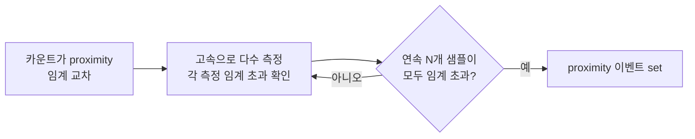
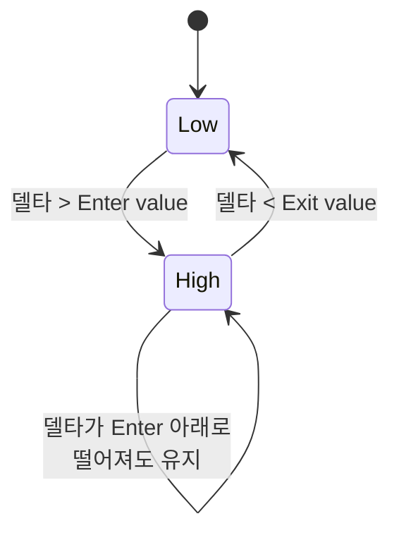

# AZD004 — 선형화·디바운스·이력

> **TL;DR**: AZD004 §6은 raw counts의 역수를 취해 신호와 선형 비례하는 Linearised Counts를 만드는 두 가지 식(선택형 Target²/Raw Counts, 핵심형 3276750/Raw Counts)과 Base·Target 선정, 델타 환산을 정리한다. §7은 false·과민 터치/릴리스를 억제하는 디바운스(연속 샘플 임계 초과 확인)와 이력(enter/exit 분리 임계)을 다룬다. 모든 수치·공식은 원문 그대로 인용.

> [!NOTE]
> 본 문서는 AZD004 "Azoteq Sensing Technology Introduction" Revision v1.1 (March 2025)의 §6(p.17~18)·§7(p.19~20)을 원문 그대로 정리한 것이다. 줄 번호는 추출 텍스트(-layout 변환본) 기준이며, 페이지 번호는 원문 푸터 기준이다. 원문에 없는 내용은 추가하지 않았다.

---

## 6. 선형화 카운트 (Linearised Counts)

원문 §6 도입부(줄 894~901): "Counts"는 내부 샘플링 커패시터 $C_s$를 충전하는 데 필요한 전하 전송 사이클(charge transfer cycle)의 횟수를 가리킨다. 정전용량 센싱 전극의 정전용량이 증가하면 커패시터 충전에 필요한 전하 전송 사이클 수가 줄어든다. 따라서 사용자가 정전용량 센서에 접근하면 측정 정전용량이 증가하고 카운트는 감소한다. 즉 카운트는 측정 신호에 **반비례(inversely proportional)** 한다. 이는 비선형 관계를 야기하며, 선형 출력이 필요한 시스템에는 이상적이지 않다.

### 6.1 카운트 선형화 (Counts Linearisation)

원문 §6.1(줄 903~933).

카운트 선형화는 측정된 "raw counts"의 역수를 취하는 것이다(줄 904).

$$\text{Signal} \propto \text{Linearised Counts} \propto \frac{1}{\text{Raw Counts}}$$

(원문 줄 906~908)

부동소수점 연산을 피하기 위해 Azoteq® 장치는 위 나눗셈에서 큰 분자(large numerator)를 사용한다. 사용되는 정확한 분자 값은 특정 제품에 따라 다르며, 해당 데이터시트를 참조해야 한다(줄 910~912).

#### 선택형 선형화 — 식 (1)

일부 장치는 선형화를 필요에 따라 켜고 끌 수 있는 **선택 기능(optional feature)** 으로 제공한다. 이들 장치는 통상 다음 계산을 사용한다(줄 914~915).

$$\text{Linearised Counts} = \frac{\text{Target}^2}{\text{Raw Counts}} \tag{1}$$

(원문 줄 917~920)

이 식은 선형화를 활성화할 때 카운트가 같은 범위에 머물도록 한다. 활성화(activation)가 없을 때 raw counts와 linearised counts는 둘 다 대략 ATI target과 같아진다(줄 922~923).

#### 핵심형 선형화 — 식 (2)

다른 Azoteq® 장치는 선형화를 센서 처리의 **기본 단계(fundamental step)** 로 수행한다. 이들 장치는 다음 식을 사용한다(줄 925~926).

$$\text{Linearised Counts} = \frac{3276750}{\text{Raw Counts}} \tag{2}$$

(원문 줄 928~930)

이 큰 분자 값은 센서의 해상도(resolution)를 극대화한다. 다만 이 방식으로 linearised counts를 사용하면 ATI Base·Target 선정 시 직관성이 떨어지는 경향이 있다(줄 932~933).

> [!NOTE]
> 식 (1)의 분자는 $\text{Target}^2$이며, 식 (2)의 분자 값은 `3276750`(원문 그대로)이다.

### 6.2 Base·Target 다루기 (Working With Base and Target)

원문 §6.2(줄 935~946).

| 구분 | 선형화 방식 | Base·Target 명시 단위 | 예시 |
|---|---|---|---|
| 선택형 선형화 | 식 (1) | "raw counts" 기준 | Base 100 counts, Target 500 counts |
| 핵심형 선형화 | 식 (2) | linearised counts 기준 | 아래 환산 참조 |

- 식 (1)처럼 선형화를 선택 기능으로 제공하는 장치는 Base·Target을 평상시처럼 사용하며, Base·Target은 "raw counts" 단위로 지정된다. 예: 전형적 정전용량 센서는 Base에 100 counts, Target에 500 counts를 사용할 수 있다(줄 936~938).
- 식 (2)처럼 선형화를 핵심 기능으로 수행하는 장치는 Base·Target을 linearised counts 단위로 지정한다. 위 예시(raw counts 기준 Base 100, Target 500)에 대해(줄 940~946):

$$\text{Base} = \frac{3276750}{100} = 32767$$

$$\text{Target} = \frac{3276750}{500} = 6553$$

### 6.3 선형화 카운트로 민감도 평가 (Evaluating Sensitivity With Linearised Counts)

원문 §6.3(줄 957~972).

채널의 민감도(Sensitivity)는 통상 터치 또는 활성화 시 **델타(Delta)** 의 크기를 평가하여 수행한다. 그러나 linearised counts에서는 델타가 raw counts의 변화를 대표하지 않으므로 델타 크기 평가가 덜 직관적이다. raw counts 기준 델타를 계산하려면 다음 식을 쓴다(줄 957~960).

$$\text{Delta Counts} = \frac{3276750}{\text{Linearised LTA}} - \frac{3276750}{\text{Linearised Counts}} \tag{3}$$

(원문 줄 962~964)

#### 계산 예시

LTA가 10000일 때 linearised counts 기준 델타가 500인 경우, "raw counts" 기준 델타는 다음과 같다(줄 966~972).

$$\text{Delta Counts} = \frac{3276750}{10000} - \frac{3276750}{10500}$$

$$= 327.67 - 312.07$$

$$= 15.6 \ \text{counts}$$

> [!NOTE]
> 원문 예시에서 두 번째 항의 분모는 10500이다(LTA 10000에 linearised 델타 500을 더한 값으로 보이나, 원문은 산출 근거를 별도로 명시하지 않으므로 그 관계는 원문 미명시).

---

## 7. 디바운스와 이력 (Debounce and Hysteresis)

### 7.1 도입 (Introduction)

원문 §7.1(줄 985~986): 디바운스(Debounce)와 이력(Hysteresis)은 false 또는 과민한(overactive) 터치·릴리스 신호를 제한하기 위해 사용하는 기법이다.

### 7.2 디바운스 동작 (Debounce Operation)

원문 §7.2(줄 988~995).

- 디바운스는 카운트가 처음으로 proximity 임계(threshold)를 교차할 때 사용된다(줄 989).
- 센서가 높은 속도(high rate)로 다수의 측정을 수행하도록 강제하며, 각 측정의 카운트가 임계를 초과하는지 확인한다(줄 989~991).
- 일정 수의 연속(consecutive) 샘플이 모두 임계를 초과했음을 장치가 읽으면 proximity 이벤트가 설정(set)된다(줄 991~992).
- 디바운스는 마스터 장치로 전송되는 정보를 제한하고 false trigger를 방지한다(Figure 7.1). 센서의 노이즈나 지터(jitter)로 발생할 수 있는 불필요한 이벤트를 회피한다(줄 994~995).

**Figure 7.1: Debounce example** (원문 줄 1019). 동일 입력에 대해 "State without Debounce"와 "State with Debounce"를 비교하는 상태 파형 그림이며, 가로축은 Samples(0~60), 상태는 0/1로 표시된다(줄 1000~1017). 그림의 수치적 세부는 원문 그래프로만 제시됨.

> [!NOTE]
> 위 Mermaid는 §7.2 본문(줄 989~992)의 흐름을 도식화한 것이다. 연속 샘플 수 "N"의 구체 값은 원문 미명시("a certain number of consecutive samples").

### 7.3 이력 동작 (Hysteresis Operation)

원문 §7.3(줄 1023~1093).

- 이력은 **터치 임계(touch threshold)** 에 적용된다(줄 1024).
- 이력은 센서가 터치 검출에 대해 서로 다른 enter·exit 임계를 사용하도록 허용하며, **exit 임계는 enter 임계보다 낮다(lower)**(줄 1024~1025).
- 이는 카운트가 터치 임계를 교차할 때 발생하는 터치 이벤트의 지터 또는 바운싱(bouncing)을 회피한다(줄 1025~1026).

#### 상태 전이 규칙 (Figure 7.2 설명, 줄 1087~1090)

- 그림의 빨간 선(red line)은 센서에서 측정된 델타의 단순 예시이다.
- enter 레벨(초록 선, green line)은 센서의 터치 임계이다.
- 델타가 이 enter(entry) 임계를 초과하는 즉시 터치 상태(touch state)가 설정(set)된다.
- 신호가 enter 레벨 아래로 떨어져도 아직 상태를 low로 만들지 않는다.
- 신호가 exit 레벨(파란 선, blue line) 아래로 떨어진 후에만 상태가 low로 간다.

| 임계 | 그림 표시(Figure 7.2) | 역할 |
|---|---|---|
| Enter value | 초록 선 | 터치 임계 — 델타가 초과 시 상태 set |
| Exit value | 파란 선 | enter보다 낮음 — 델타가 이 아래로 떨어져야 상태 low |
| Delta | 빨간 선 | 측정된 델타 신호(예시) |
| State | — | 0/1 터치 상태 |

> [!TIP]
> 신뢰성 있고 깔끔한 출력을 보장하기 위해, 가능할 때마다 터치 레벨에 이력을 추가하는 것이 권장된다(줄 1092~1093).

**Figure 7.2: Hysteresis example** (원문 줄 1083). 가로축 Samples(0~100), 세로축 Counts(0~100) 및 State(0/1)를 가지며, Enter value·Exit value·Delta·State를 함께 표시하는 그림이다(줄 1040~1081). 그림의 수치적 세부는 원문 그래프로만 제시됨.

> [!NOTE]
> 위 Mermaid는 §7.3 본문(줄 1087~1090)의 상태 전이 규칙을 도식화한 것이다. Enter·Exit의 구체 수치 값은 원문 미명시(Figure 7.2 그래프로만 제시).

---

## 출처

- AZD004 "Azoteq Sensing Technology Introduction", Revision v1.1, March 2025, ProxSense® / ProxFusion® Series, © Azoteq 2025.
- §6 Linearised Counts: 원문 p.17~18 (추출 텍스트 줄 894~972).
- §7 Debounce and Hysteresis: 원문 p.19~20 (추출 텍스트 줄 983~1093).
