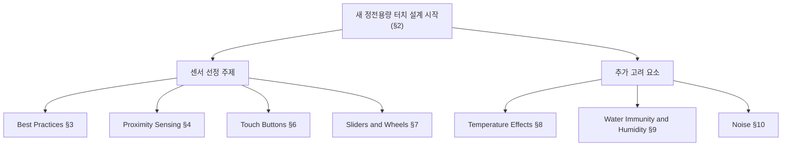

# AZD125 — 개요·설계 시작

> [!NOTE]
> **TL;DR**: Azoteq AZD125(IQ Switch ProxFusion 시리즈, Rev. v1.2, 2025-03) 정전용량 센싱 설계 가이드의 §1·§2 정리본. §1은 정전용량 터치 설계의 목적과 ProxSense 기술 통합 범위를, §2는 새 설계 착수 시 다룰 7개 주제(Best Practices·Proximity·Touch Buttons·Sliders/Wheels와 Temperature·Water/Humidity·Noise)를 제시한다. 본 문서는 두 섹션만 다루며 상세 설계는 후속 §3 이후 참조.

> [!IMPORTANT]
> 본 문서는 원문(AZD125 - Capacitive Sensing Design Guide, Revision v1.2, March 2025)의 **§1 Introduction**, **§2 Starting a New Design** 범위만 옮긴 것이다. 원문에 실재하는 내용만 기재하며, 인용 위치(섹션/페이지/줄)는 추출 텍스트 기준이다. 원문 미명시 항목은 "원문 미명시"로 표기한다.

---

## 문서 식별 정보

| 항목 | 내용 | 출처 |
|---|---|---|
| 문서 번호 | AZD125 | 원문 표지 (줄 5) |
| 제목 | Capacitive Sensing Design Guide — Design Guide for Capacitive Buttons, Sliders and Wheels | 원문 표지 (줄 5–6) |
| 시리즈 | IQ Switch ProxFusion Series | 원문 헤더 (줄 1–2) |
| 리비전 | v1.2 | 원문 푸터 (줄 59) |
| 발행 시점 | March 2025 | 원문 푸터 (줄 59) |
| 저작권 | Copyright © Azoteq 2025, All Rights Reserved | 원문 푸터 (줄 58–59) |
| 총 페이지 | 41 (Page X of 41) | 원문 푸터 (줄 58) |

---

## §1 개요 (Introduction)

> 원문 위치: §1 Introduction, Page 3, 줄 85–106

### 설계 반복(iteration)과 좋은 설계 관행

- 정전용량 센싱이라는 기술은 사양을 충족하기까지 흔히 **여러 번의 설계 반복(multiple design iterations)** 을 거치며, 이는 설계자에게 번거로운 작업이 될 수 있다. (줄 87–88)
- 따라서 **좋은 설계 관행(good design practices)** 을 따르면 설계 반복 횟수를 최소로 줄일 수 있다. (줄 88–89)
- 성공적인 터치 제품은 **좋은 센서 설계(a good sensor design)** 로 달성된다. (줄 89–90)

### 정전용량 터치의 목적과 이점

- 정전용량 터치 응용은 **큰 비용 추가 없이 대부분의 기계식 패드를 대체**하는 것을 목표로 한다. (줄 95–96)
- 대부분의 기계식 버튼·슬라이더·휠은 시간이 지나면서 열화되므로, 정전용량 터치 방식은 **더 신뢰성 있는 설계(more reliable design)** 를 제공한다. (줄 96–97)
- 또한 매끈하고 전문적인 마감으로 **심미적 가치(aesthetic value)** 를 더한다. (줄 97–98)

### 본 가이드의 적용 범위

- 본 설계 지침은 설계자가 **ProxSense 기술**을 신규 및 기존 설계에 통합하는 것을 돕는다. (줄 100–101)
- 정전용량 버튼·슬라이더·휠의 **빠른 시작(quick-start) 설계**에 대한 일반 권고를 제공한다. (줄 101–102)

> [!WARNING]
> 본 문서는 **최종 설계로 안내하는 가이드일 뿐**이며, 본 문서에서 논의된 설계를 응용에 맞게 **직접 스케일링(scale directly)** 해서는 안 되고, 모든 고려사항을 항상 염두에 두어야 한다. (원문 §1, 줄 102–104)

- 본 설계 지침은 **자기 정전용량(self-capacitive) 및/또는 상호 정전용량(mutual capacitive) 센싱**을 모두 사용하는 설계를 대상으로 한다. (줄 104–105)
- 정전용량 센싱에 대한 더 심층적인 설명은 **AZD004**를 참조한다. (줄 105–106)

> [!NOTE]
> §1 원문에는 도식·표·수식이 포함되어 있지 않다. (그림·표는 §3 이후에 등장 — 예: Figure 3.1, 줄 173)

---

## §2 새 설계 시작하기 (Starting a New Design)

> 원문 위치: §2 Starting a New Design, Page 3, 줄 109–126

### 개요

- 새 정전용량 터치 설계를 시작할 때 **몇 가지 도전 과제(challenges)** 가 발생할 수 있다. (줄 111)
- 본 설계 가이드는 응용에 사용될 수 있는 **여러 센서에 대한 기본 설계 관행(basic design practices)** 을 제공한다. (줄 111–112)
- 가이드는 응용에 **가장 적합한 센서를 식별**하도록 돕기 위해 후술 주제들을 다룬다. (줄 112–114)

### 센서 선정을 돕는 주제 (필수 다룸)

원문은 "어떤 센서가 응용에 가장 적합한지 식별"하도록 다음 항목들을 거친다고 명시한다. (줄 113–119)

| 주제 | 원문 표기 | 해당 섹션 (목차 기준) |
|---|---|---|
| 모범 설계 관행 | Best Practices | §3 (Page 4) |
| 근접 센싱 | Proximity Sensing | §4 (Page 14) |
| 터치 버튼 | Touch Buttons | §6 (Page 18) |
| 슬라이더와 휠 | Sliders and Wheels | §7 (Page 24) |

> 위 4개 항목은 §2 본문 목록(줄 116–119)에 명시. 섹션 번호·페이지는 원문 목차(Contents, 줄 16·29·38·44)와 대조한 것이다.

### 추가로 고려해야 할 요소

원문은 "또한 설계에서 다음 요소들을 고려하는 것이 중요하다(it is important to consider the following factors in your design)"고 명시한다. (줄 121–125)

| 요소 | 원문 표기 | 해당 섹션 (목차 기준) |
|---|---|---|
| 온도 영향 | Temperature Effects | §8 (Page 31) |
| 침수 내성과 습도 | Water Immunity and Humidity | §9 (Page 36) |
| 노이즈 | Noise | §10 (Page 37) |

> 위 3개 항목은 §2 본문 목록(줄 123–125)에 명시. 섹션 번호·페이지는 원문 목차(줄 51·67·69)와 대조한 것이다.

### 전체 흐름 요약

> [!NOTE]
> 위 Mermaid 다이어그램은 §2 본문(줄 116–125)에 나열된 항목과 그 섹션 매핑을 시각화한 것이며, 항목·섹션 번호는 모두 원문에 근거한다. §2 원문에는 도식·표·수식이 포함되어 있지 않다.

---

## 부록: 본 문서가 다루지 않는 범위

> [!IMPORTANT]
> 본 레퍼런스는 §1·§2만 다룬다. 아래 섹션들은 원문 목차(Contents, 줄 10–75)에 존재하나 **본 문서 범위 밖**이며, 상세 내용은 후속 레퍼런스 문서에서 다룬다.
>
> - §3 Best Practices (Mechanics·Common Layout Considerations) — Page 4
> - §4 Proximity Sensing — Page 14
> - §5 Grounding Effects — Page 15
> - §6 Touch Buttons — Page 18
> - §7 Sliders and Wheels — Page 24
> - §8 Temperature Effects — Page 31
> - §9 Water Immunity and Humidity — Page 36
> - §10 Noise — Page 37
> - §11 Revision History — Page 40

---

## 관련 문서 (원문에서 참조)

| 문서 번호 | 참조 맥락 | 원문 위치 |
|---|---|---|
| AZD004 | 정전용량 센싱의 더 심층적인 설명 | §1, 줄 106 |

> [!NOTE]
> §1·§2 범위 내에서 명시적으로 참조된 외부 문서는 AZD004뿐이다. (AZD102·AZD051·AZD052 등은 §3 이후에서 참조 — 본 문서 범위 밖.)
