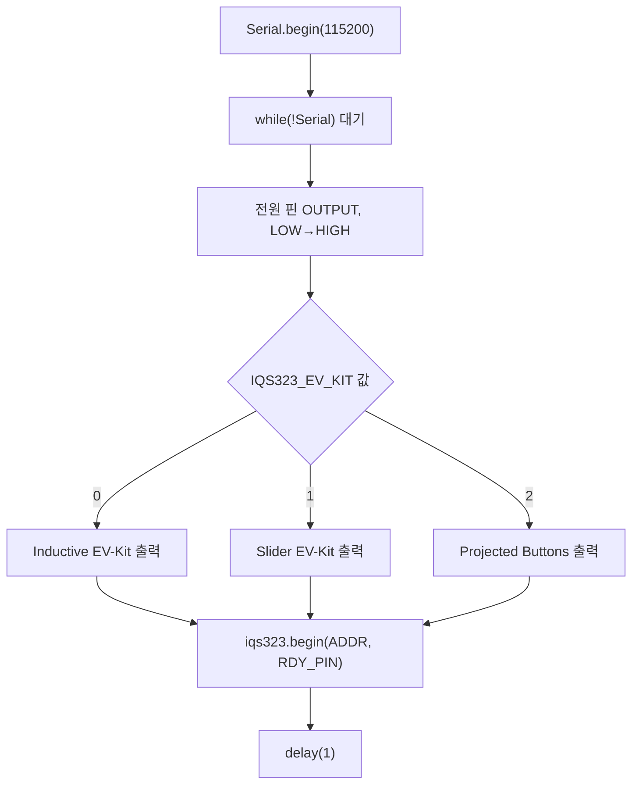
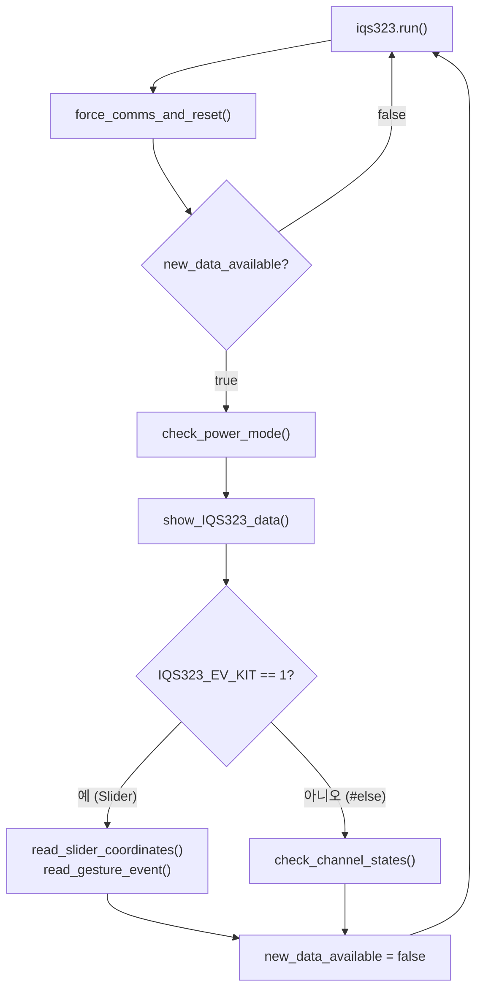

# IQS323 예제코드 — 개요·파일 구조

> [!NOTE]
> **TL;DR**: Azoteq IQS323(3채널 터치 컨트롤러) EV-KIT 예제 스케치 `iqs323-example-code.ino`(v1.5.2, 2023)의 `setup()`/`loop()` 제어 흐름과 `src/IQS323/` 라이브러리 폴더·파일 트리, README 요지를 정리한 레퍼런스. EV-KIT 3종(Inductive/Slider/Projected Buttons)을 `IQS323_EV_KIT` 매크로로 분기하며, RDY 라인 기반 신규 데이터 처리와 시리얼 강제 통신('f')·SW 리셋('r')을 다룬다.

본 문서는 다음 원문만을 근거로 작성한다. 원문에 없는 내용·추정은 기재하지 않으며, 미명시 항목은 "원문 미명시"로 표기한다.

- `docs/참고/touch/iqs323-example-code/iqs323-example-code.ino` (이하 `.ino`, 1~299줄)
- `docs/참고/touch/iqs323-example-code/src/IQS323/README.md` (이하 `README`, 1~4줄)

---

## 1. 예제 개요

`.ino` 파일 헤더 주석(12~33줄)에 명시된 내용이다.

| 항목 | 값 | 출처 |
|---|---|---|
| 파일명 | `iqs323-example-code.ino` | `.ino` 12줄 |
| 제목(brief) | IQS323 EV-KIT Variants Example code | `.ino` 13줄 |
| 목적 | 3종 IQS323 EV-Kit 변종을 사용하기 위해 IQS323에 원하는 설정을 기록하는 방법 시연 | `.ino` 14~16줄 |
| 작성자 | Azoteq PTY Ltd | `.ino` 30줄 |
| 버전 | v1.5.2 | `.ino` 31줄 |
| 날짜 | 2023 | `.ino` 32줄 |

### 1.1 EV-KIT 옵션 (3종)

`.ino` 17~21줄에 명시된 EV-KIT 옵션이다.

| 옵션 값 | EV-Kit 명칭 | 부품 번호 |
|---|---|---|
| 0 | Inductive Options EV-Kit | AZP1212A4 |
| 1 | Slider EV-Kit | AZP1209A4 |
| 2 | 3-Projected Buttons EV-Kit | AZP1210A4 |

> [!NOTE]
> 옵션 선택은 `IQS323_EV_KIT` 매크로로 결정된다. 본 예제 트리의 기본값은 `IQS323.h` 38줄에 `#define IQS323_EV_KIT   0`(Inductive Options EV-Kit)로 정의되어 있다.
>
> **모델 표기 원문 간 상이**: Inductive Options EV-Kit가 `.ino`/헤더에는 **AZP1212A4**, Arduino 가이드 PDF에는 **AZP1212A3**으로 적혀 있다(`04_Arduino가이드.md` 참조). 본 표는 코드 원문(A4) 기준이다.

### 1.2 시리얼 출력 항목

`.ino` 22~28줄에 명시된, 시리얼 통신으로 표시되는 출력 항목이다.

| 출력 항목 | 적용 대상 EV-Kit |
|---|---|
| Slider coordinates (슬라이더 좌표) | Slider EV-Kit |
| Gesture events (제스처 이벤트) | Slider EV-Kit |
| Channel states (채널 상태) | Inductive Options 및 Projected Buttons |
| Power Mode Feedback (전원 모드 피드백) | All EV-Kits |
| Forced Communication (강제 통신) | All EV-Kits |

---

## 2. 정의·인스턴스·전역 변수

### 2.1 Defines (`.ino` 38~41줄)

| 매크로 | 값 | 의미(주석 기준) |
|---|---|---|
| `DEMO_IQS323_ADDR` | `0x44` | 원문 미명시(주석 없음, 사용처는 `begin` 인자) |
| `DEMO_IQS323_POWER_PIN` | `4` | 원문 미명시(주석 없음) |
| `DEMO_IQS323_RDY_PIN` | `7` | 원문 미명시(주석 없음) |

### 2.2 인스턴스 (`.ino` 43~44줄)

| 인스턴스 | 타입 |
|---|---|
| `iqs323` | `IQS323` |

### 2.3 전역 변수 (`.ino` 46~51줄)

| 변수 | 타입 | 초기값 |
|---|---|---|
| `button_states[3]` | `iqs323_ch_states` | (원문 미명시, 미초기화 배열) |
| `show_data` | `bool` | `false` |
| `running_power_state` | `iqs323_power_modes` | `IQS323_NORMAL_POWER` |
| `slider_position` | `uint16_t` | `65535` |
| `slider_event` | `iqs323_gesture_events` | `IQS323_GESTURE_NONE` |

---

## 3. `setup()` 흐름 (`.ino` 53~80줄)

1. **시리얼 통신 시작** (55~59줄): `Serial.begin(115200)` → `while(!Serial);` 대기 → `"Start Serial communication"` 출력 → `delay(200)`.
2. **IQS323 전원 인가** (61~66줄): `DEMO_IQS323_POWER_PIN`(=4)을 OUTPUT으로 설정 → `delay(200)` → `LOW` 쓰기 → `delay(200)` → `HIGH` 쓰기.
3. **선택된 EV-Kit 출력** (68~74줄): `IQS323_EV_KIT` 값에 따라 분기 출력.
   - `== 0`: `"IQS323 Inductive EV-Kit Selected"`
   - `== 1`: `"IQS323 Slider EV-Kit Selected"`
   - `== 2`: `"IQS323 Projected Buttons EV-Kit Selected"`
4. **IQS323 초기화** (76~78줄): `iqs323.begin(DEMO_IQS323_ADDR, DEMO_IQS323_RDY_PIN)` 호출(인자: 디바이스 주소, RDY 핀) → `"IQS323 Ready"` 출력.
5. **`delay(1)`** (79줄).



---

## 4. `loop()` 흐름 (`.ino` 82~103줄)

매 루프 동작:

1. `iqs323.run();` — IQS323 프로그램 루프 실행 (84줄).
2. `force_comms_and_reset();` — 강제 통신 윈도우 초기화 함수 (86줄).
3. **신규 데이터 처리** — `if(iqs323.new_data_available)`일 때(RDY 라인 Low, 88~102줄):
   - `check_power_mode();` — 전원 모드 변경 확인 (91줄)
   - `show_IQS323_data();` — 강제 통신 윈도우 요청 시 데이터 표시 (92줄)
   - **EV-KIT 분기** (94~99줄):
     - `IQS323_EV_KIT == 1` (Slider): `read_slider_coordinates();` + `read_gesture_event();`
     - 그 외(`#else`): `check_channel_states();`
   - `iqs323.new_data_available = false;` — 처리 완료 플래그 클리어 (101줄)



---

## 5. 보조 함수 요약

`.ino`에 정의된 보조 함수와 동작이다.

| 함수 | 줄 범위 | 동작 요지(주석·코드 기준) |
|---|---|---|
| `check_power_mode(void)` | 105~134 | `iqs323.get_PowerMode()`로 현재 전원 모드 읽고, `running_power_state`와 다를 때만 출력. `NORMAL/LOW/ULP/HALT` 케이스별 메시지 출력 후 상태 갱신 |
| `check_channel_states(void)` | 136~176 | 3개 채널(`for i = 0..2`) 순회. `channel_touchState()` set → `"CHi: Touch"`, `channel_proxState()` set → `"CHi: Prox"`, 둘 다 미설정 → `"CHi: None"`. 상태 변화 시에만 출력 및 `button_states[i]` 갱신 |
| `read_slider_coordinates(void)` | 178~188 | `iqs323.sliderCoordinate()` 읽어 `slider_position`과 다르면 `slider_position` 갱신 |
| `read_gesture_event(void)` | 190~234 | `iqs323.getSliderEvent()` 참이면 `iqs323.getGestureType()` 읽어 제스처별 메시지 출력. 이벤트 처리 후 `slider_position == 65535`이면 `slider_event = IQS323_GESTURE_NONE`로 클리어 |
| `force_comms_and_reset(void)` | 236~257 | `read_message()`로 시리얼 입력 확인. `'f'` → `force_I2C_communication()` + `show_data = true`. `'r'` → `"Software Reset Requested!"` 출력 + `force_I2C_communication()` + 상태를 `IQS323_STATE_SW_RESET`으로 설정 |
| `read_message(void)` | 259~271 | `Serial.available()` 동안 `Serial.read()` 반환, 없으면 `'\n'` 반환 |
| `show_IQS323_data(void)` | 273~298 | `show_data`가 참이면 `"***** IQS323 DATA *****"`/`"Forced Communication"` 출력, 기존 상태 클리어(`button_states`→`IQS323_CH_UNKNOWN`, `running_power_state`→`IQS323_POWER_UNKNOWN`, `slider_event`→`IQS323_GESTURE_UNKNOWN`) 후 4개 점검 함수 호출, `"*************************"` 출력, `show_data = false` |

### 5.1 슬라이더 제스처 이벤트 (`read_gesture_event`, `.ino` 202~225줄)

| 제스처 상수 | 출력 메시지 |
|---|---|
| `IQS323_GESTURE_TAP` | `SLIDER: Tap` |
| `IQS323_GESTURE_SWIPE_NEGATIVE` | `SLIDER: Swipe <-` |
| `IQS323_GESTURE_SWIPE_POSITIVE` | `SLIDER: Swipe ->` |
| `IQS323_GESTURE_FLICK_NEGATIVE` | `SLIDER: Flick <-` |
| `IQS323_GESTURE_FLICK_POSITIVE` | `SLIDER: Flick ->` |
| `IQS323_GESTURE_HOLD` | `SLIDER: Hold` |
| `IQS323_GESTURE_NONE` | `SLIDER: None` |

### 5.2 전원 모드 메시지 (`check_power_mode`, `.ino` 113~129줄)

| 전원 모드 상수 | 출력 메시지 |
|---|---|
| `IQS323_NORMAL_POWER` | `NORMAL POWER Activated!` |
| `IQS323_LOW_POWER` | `LOW POWER Activated!` |
| `IQS323_ULP` | `ULP Activated!` |
| `IQS323_HALT` | `Halt Activated!` |

> [!NOTE]
> 시리얼 명령은 두 가지다. `'f'`(forced communication 윈도우 강제 개방 + 데이터 출력)와 `'r'`(SW 리셋 요청). 출처: `.ino` 242~256줄.

---

## 6. 폴더·파일 트리

예제 코드 디렉터리 실측 트리다.

```
iqs323-example-code/
├── iqs323-example-code.ino          메인 스케치 (setup/loop + 보조 함수)
├── iqs323_arduino_guide-v1.5.2.pdf  Arduino 가이드 (참고 문서)
└── src/
    └── IQS323/
        ├── IQS323.cpp               라이브러리 구현
        ├── IQS323.h                 라이브러리 헤더 (IQS323_EV_KIT 정의)
        ├── IQS323_3PROJ_BUTTONS_EV_KIT.h      3-Projected Buttons EV-Kit 설정
        ├── IQS323_INDUCTIVE_OPTIONS_EV_KIT.h  Inductive Options EV-Kit 설정
        ├── IQS323_SLIDER_EV_KIT.h             Slider EV-Kit 설정
        ├── README.md                라이브러리 README
        └── inc/
            └── IQS323_addresses.h   레지스터 주소 정의
```

| 파일 | 의미 |
|---|---|
| `iqs323-example-code.ino` | 메인 스케치 — `setup()`/`loop()` 및 6.5절의 보조 함수 정의 |
| `IQS323.h` | `#include "src\IQS323\IQS323.h"`로 포함되는 라이브러리 헤더 (`.ino` 36줄). `IQS323_EV_KIT   0` 정의(38줄) |
| `IQS323.cpp` | IQS323 라이브러리 구현 |
| `IQS323_3PROJ_BUTTONS_EV_KIT.h` / `IQS323_INDUCTIVE_OPTIONS_EV_KIT.h` / `IQS323_SLIDER_EV_KIT.h` | EV-Kit 변종별 설정 헤더 |
| `inc/IQS323_addresses.h` | 레지스터 주소 정의 헤더 |
| `README.md` | 라이브러리 설명 (7절) |

> [!NOTE]
> 위 표의 각 파일 "의미"는 파일명과 트리 위치, 그리고 `.ino`의 include 구문(36줄)·`IQS323.h`의 `IQS323_EV_KIT` 정의(38줄)에 근거한다. `IQS323.cpp`·변종 헤더·`IQS323_addresses.h`의 내부 상세는 본 문서 대상 범위가 아니므로 다루지 않는다(원문 미정독 범위).

---

## 7. 라이브러리 README 요지

`README`(`src/IQS323/README.md`, 1~4줄) 전문은 다음과 같다.

| 줄 | 내용 |
|---|---|
| 1 | `# IQS323 Library` |
| 2 | The IQS323 library allows easy setup and interaction with the Azoteq IQS323 IC, the 3-channel Touch Controller Chip. |

요지: IQS323 라이브러리는 Azoteq IQS323 IC(3채널 터치 컨트롤러 칩)의 간편한 설정과 상호작용을 제공한다.

---

## 8. 인용 색인

| 인용 대상 | 출처(파일·줄) |
|---|---|
| 파일 헤더(목적·버전·날짜) | `.ino` 12~33 |
| EV-KIT 옵션 3종 | `.ino` 17~21 |
| 시리얼 출력 항목 | `.ino` 22~28 |
| Defines | `.ino` 38~41 |
| 인스턴스·전역 변수 | `.ino` 43~51 |
| `setup()` | `.ino` 53~80 |
| `loop()` | `.ino` 82~103 |
| 보조 함수 | `.ino` 105~298 |
| include 구문 | `.ino` 36 |
| `IQS323_EV_KIT` 기본값 | `IQS323.h` 38 |
| 라이브러리 README | `README` 1~2 |
