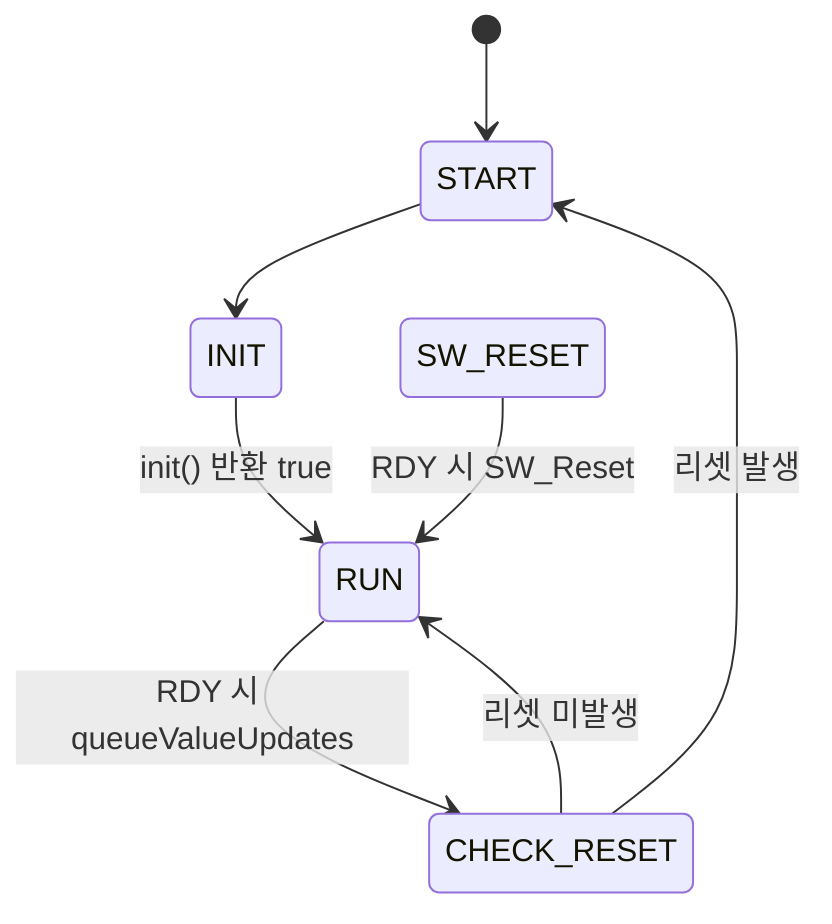

# IQS323 예제코드 — 드라이버 API

> [!NOTE]
> **TL;DR** Azoteq IQS323 Arduino 예제 드라이버(`IQS323` 클래스)의 public API·enum·메모리맵 구조체를 원문(`IQS323.h`/`IQS323.cpp` v1.5.2, 2023) 기반으로 정리했다. begin/init/run 상태머신, queueValueUpdates의 18바이트 일괄 읽기, ATI·리셋·이벤트 모드 제어, 채널 터치/근접·슬라이더·제스처 조회, I2C 저수준 메서드까지 줄 번호를 인용해 기술한다.

---

## 1. 개요 및 출처

| 항목 | 내용 | 원문 위치 |
|---|---|---|
| 대상 IC | 3채널 Self-Capacitive / 3채널 Mutual-Capacitive / 2채널 Inductive 센싱 컨트롤러 (Touch·Proximity UI) | `IQS323.cpp` 줄 15~17 |
| 클래스 | `IQS323` | `IQS323.h` 줄 179~235 |
| 버전 | v1.5.2 (2023) | `IQS323.h` 줄 17~18, `IQS323.cpp` 줄 21~22 |
| 작성자 | JN. Lochner - Azoteq PTY Ltd | `IQS323.h` 줄 16 |
| 의존 라이브러리 | `Arduino.h`, `Wire.h` (표준 Arduino) | `IQS323.h` 줄 20~22, 29~30 |
| 주소 헤더 | `./inc/iqs323_addresses.h` | `IQS323.h` 줄 31 |

> [!NOTE]
> EV-Kit 선택은 `IQS323.h` 줄 33~38의 `#define IQS323_EV_KIT` 값으로 결정된다(기본 0). 0=Inductive Options EV-Kit(AZP1212A4), 1=Slider EV-Kit(AZP1209A4), 2=3-Projected Buttons EV-Kit(AZP1210A4). 이 값에 따라 `IQS323.cpp` 줄 33~39에서 해당 설정 헤더를 include 한다.

---

## 2. 공용 정의 (Public Global Definitions)

### 2.1. I2C 통신 창 제어 매크로

| 매크로 | 값 | 의미 | 원문 위치 |
|---|---|---|---|
| `STOP` | `true` | 일부 함수에서 true 인자는 I2C 통신 창을 닫음 | `IQS323.h` 줄 41~43 |
| `RESTART` | `false` | false 인자는 I2C 통신 창을 열어 둠 | `IQS323.h` 줄 44~46 |

### 2.2. 디바이스 정보 상수

| 매크로 | 값 | 의미 | 원문 위치 |
|---|---|---|---|
| `IQS323_PRODUCT_NUM_001` | `1106` | Release UI 제품 번호 | `IQS323.h` 줄 49 |
| `IQS323_PRODUCT_NUM_A01` | `1462` | Movement UI 제품 번호 | `IQS323.h` 줄 50 |

### 2.3. Info Flags 바이트 비트

| 매크로 | 값 | 원문 위치 |
|---|---|---|
| `IQS323_SLIDER_EVENT_BIT` | `2` | `IQS323.h` 줄 53 |
| `IQS323_GESTURE_EVENT_BIT` | `6` | `IQS323.h` 줄 54, 81 (중복 정의) |
| `IQS323_POWER_EVENT_BIT_0` | `6` | `IQS323.h` 줄 55 |
| `IQS323_POWER_EVENT_BIT_1` | `7` | `IQS323.h` 줄 56 |
| `IQS323_NORMAL_POWER_BIT` | `0b00` | `IQS323.h` 줄 57 |
| `IQS323_LOW_POWER_BIT` | `0b01` | `IQS323.h` 줄 58 |
| `IQS323_ULP_BIT` | `0b10` | `IQS323.h` 줄 59 |
| `IQS323_HALT_BIT` | `0b11` | `IQS323.h` 줄 60 |

### 2.4. 시스템 이벤트 비트

| 매크로 | 값 | 원문 위치 |
|---|---|---|
| `IQS323_ATI_ACTIVE_BIT` | `5` | `IQS323.h` 줄 63 |
| `IQS323_SHOW_RESET_BIT` | `7` | `IQS323.h` 줄 64 |

### 2.5. 채널 근접·터치 비트

| 매크로 | 값 | 원문 위치 |
|---|---|---|
| `IQS323_CH0_PROX_BIT` | `0` | `IQS323.h` 줄 67 |
| `IQS323_CH0_TOUCH_BIT` | `1` | `IQS323.h` 줄 68 |
| `IQS323_CH1_PROX_BIT` | `2` | `IQS323.h` 줄 69 |
| `IQS323_CH1_TOUCH_BIT` | `3` | `IQS323.h` 줄 70 |
| `IQS323_CH2_PROX_BIT` | `4` | `IQS323.h` 줄 71 |
| `IQS323_CH2_TOUCH_BIT` | `5` | `IQS323.h` 줄 72 |

### 2.6. 슬라이더(제스처) 이벤트 비트

| 매크로 | 값 | 원문 위치 |
|---|---|---|
| `IQS323_GESTURE_TAP_BIT` | `0` | `IQS323.h` 줄 75 |
| `IQS323_GESTURE_SWIPE_POS_BIT` | `1` | `IQS323.h` 줄 76 |
| `IQS323_GESTURE_SWIPE_NEG_BIT` | `2` | `IQS323.h` 줄 77 |
| `IQS323_GESTURE_FLICK_POS_BIT` | `3` | `IQS323.h` 줄 78 |
| `IQS323_GESTURE_FLICK_NEG_BIT` | `4` | `IQS323.h` 줄 79 |
| `IQS323_GESTURE_HOLD_BIT` | `5` | `IQS323.h` 줄 80 |
| `IQS323_GESTURE_EVENT_BIT` | `6` | `IQS323.h` 줄 81 |
| `IQS323_GESTURE_BUSY_BIT` | `7` | `IQS323.h` 줄 82 |

### 2.7. 유틸리티 비트 (SYSTEM_CONTROL 제어용)

| 매크로 | 값 | 원문 위치 |
|---|---|---|
| `IQS323_ACK_RESET_BIT` | `0` | `IQS323.h` 줄 85 |
| `IQS323_SW_RESET_BIT` | `1` | `IQS323.h` 줄 86 |
| `IQS323_RE_ATI_BIT` | `2` | `IQS323.h` 줄 87 |
| `IQS323_RESEED_BIT` | `3` | `IQS323.h` 줄 88 |
| `IQS323_EVENT_MODE_BIT` | `7` | `IQS323.h` 줄 90 |

---

## 3. 열거형 (Enums)

### 3.1. `iqs323_init_e` — init 상태 열거

초기화 상태머신(`init()`)이 순회하는 상태. 첫 항목만 `0x00`으로 명시, 이후는 자동 증가.

| 상수 | 값 | 원문 위치 |
|---|---|---|
| `IQS323_INIT_NONE` | `(uint8_t) 0x00` | `IQS323.h` 줄 97 |
| `IQS323_INIT_VERIFY_PRODUCT` | (자동 증가) | `IQS323.h` 줄 98 |
| `IQS323_INIT_READ_RESET` | (자동 증가) | `IQS323.h` 줄 99 |
| `IQS323_INIT_CHIP_RESET` | (자동 증가) | `IQS323.h` 줄 100 |
| `IQS323_INIT_UPDATE_SETTINGS` | (자동 증가) | `IQS323.h` 줄 101 |
| `IQS323_INIT_CHECK_RESET` | (자동 증가) | `IQS323.h` 줄 102 |
| `IQS323_INIT_ACK_RESET` | (자동 증가) | `IQS323.h` 줄 103 |
| `IQS323_INIT_ATI` | (자동 증가) | `IQS323.h` 줄 104 |
| `IQS323_INIT_WAIT_FOR_ATI` | (자동 증가) | `IQS323.h` 줄 105 |
| `IQS323_INIT_READ_DATA` | (자동 증가) | `IQS323.h` 줄 106 |
| `IQS323_INIT_ACTIVATE_EVENT_MODE` | (자동 증가) | `IQS323.h` 줄 107 |
| `IQS323_INIT_DONE` | (자동 증가) | `IQS323.h` 줄 108 |

> [!NOTE]
> 열거 상수 `IQS323_INIT_CHECK_RESET`(줄 102)은 정의되어 있으나, `init()` 구현(`IQS323.cpp` 줄 101~249)의 `switch` 케이스에는 등장하지 않는다(원문 기준).

### 3.2. `iqs323_state_e` — 메인 상태머신 상태

| 상수 | 값 | 원문 위치 |
|---|---|---|
| `IQS323_STATE_NONE` | `(uint8_t) 0x00` | `IQS323.h` 줄 112 |
| `IQS323_STATE_START` | (자동 증가) | `IQS323.h` 줄 113 |
| `IQS323_STATE_INIT` | (자동 증가) | `IQS323.h` 줄 114 |
| `IQS323_STATE_SW_RESET` | (자동 증가) | `IQS323.h` 줄 115 |
| `IQS323_STATE_CHECK_RESET` | (자동 증가) | `IQS323.h` 줄 116 |
| `IQS323_STATE_RUN` | (자동 증가) | `IQS323.h` 줄 117 |

### 3.3. `iqs323_channel_e` — 채널 식별자

| 상수 | 값 | 원문 위치 |
|---|---|---|
| `IQS323_CH0` | `(uint8_t) 0x00` | `IQS323.h` 줄 121 |
| `IQS323_CH1` | (자동 증가) | `IQS323.h` 줄 122 |
| `IQS323_CH2` | (자동 증가) | `IQS323.h` 줄 123 |

### 3.4. `iqs323_ch_states` — 채널 상태

| 상수 | 값 | 원문 위치 |
|---|---|---|
| `IQS323_CH_NONE` | `(uint8_t) 0x00` | `IQS323.h` 줄 127 |
| `IQS323_CH_PROX` | (자동 증가) | `IQS323.h` 줄 128 |
| `IQS323_CH_TOUCH` | (자동 증가) | `IQS323.h` 줄 129 |
| `IQS323_CH_UNKNOWN` | (자동 증가) | `IQS323.h` 줄 130 |

### 3.5. `iqs323_power_modes` — 전력 모드

| 상수 | 값 | 원문 위치 |
|---|---|---|
| `IQS323_NORMAL_POWER` | `(uint8_t) 0x00` | `IQS323.h` 줄 134 |
| `IQS323_LOW_POWER` | (자동 증가) | `IQS323.h` 줄 135 |
| `IQS323_ULP` | (자동 증가) | `IQS323.h` 줄 136 |
| `IQS323_HALT` | (자동 증가) | `IQS323.h` 줄 137 |
| `IQS323_POWER_UNKNOWN` | (자동 증가) | `IQS323.h` 줄 138 |

### 3.6. `iqs323_gesture_events` — 제스처 이벤트

| 상수 | 값 | 원문 위치 |
|---|---|---|
| `IQS323_GESTURE_NONE` | `(uint8_t) 0x00` | `IQS323.h` 줄 142 |
| `IQS323_GESTURE_TAP` | (자동 증가) | `IQS323.h` 줄 143 |
| `IQS323_GESTURE_SWIPE_POSITIVE` | (자동 증가) | `IQS323.h` 줄 144 |
| `IQS323_GESTURE_SWIPE_NEGATIVE` | (자동 증가) | `IQS323.h` 줄 145 |
| `IQS323_GESTURE_FLICK_POSITIVE` | (자동 증가) | `IQS323.h` 줄 146 |
| `IQS323_GESTURE_FLICK_NEGATIVE` | (자동 증가) | `IQS323.h` 줄 147 |
| `IQS323_GESTURE_HOLD` | (자동 증가) | `IQS323.h` 줄 148 |
| `IQS323_GESTURE_UNKNOWN` | (자동 증가) | `IQS323.h` 줄 149 |

---

## 4. 메모리맵 구조체

### 4.1. `IQS323_MEMORY_MAP` (`#pragma pack(1)`)

런타임 중 사용될 수 있는 데이터만 로컬에 저장하는 구조체. 각 멤버의 I2C 주소 주석은 원문 그대로 인용한다.

| 멤버 | 타입 | 속성 | I2C 주소(원문 주석) | 원문 위치 |
|---|---|---|---|---|
| `VERSION_DETAILS` | `uint8_t[20]` | READ ONLY | `0x00 -> 0x09` | `IQS323.h` 줄 158 |
| `SYSTEM_STATUS` | `uint8_t[2]` | READ ONLY | `0x10` | `IQS323.h` 줄 159 |
| `GESTURES` | `uint8_t[2]` | READ ONLY | `0x11` | `IQS323.h` 줄 160 |
| `SLIDER_COORDINATES` | `uint8_t[2]` | READ ONLY | `0x12` | `IQS323.h` 줄 161 |
| `CH0_COUNTS_LTA` | `uint8_t[4]` | READ ONLY | `0x13 -> 0x14` | `IQS323.h` 줄 162 |
| `CH1_COUNTS_LTA` | `uint8_t[4]` | READ ONLY | `0x15 -> 0x16` | `IQS323.h` 줄 163 |
| `CH2_COUNTS_LTA` | `uint8_t[4]` | READ ONLY | `0x17 -> 0x18` | `IQS323.h` 줄 164 |
| `SYSTEM_CONTROL` | `uint8_t[2]` | READ WRITE | `0xC0` | `IQS323.h` 줄 167 |

> [!NOTE]
> 구조체는 `#pragma pack(1)`(줄 154)로 시작해 `#pragma pack(4)`(줄 169)로 복원된다. 즉 패딩 없는 1바이트 정렬로 패킹된다.

### 4.2. `iqs323_s` (`#pragma pack(1)`)

| 멤버 | 타입 | 의미 | 원문 위치 |
|---|---|---|---|
| `state` | `iqs323_state_e` | 메인 상태머신 상태 | `IQS323.h` 줄 173 |
| `init_state` | `iqs323_init_e` | 초기화 상태머신 상태 | `IQS323.h` 줄 174 |

### 4.3. 메모리맵 레지스터 주소 정의 (`iqs323_addresses.h`)

`writeMM()`·읽기 메서드가 참조하는 주소 매크로. 원문 그룹 주석 기준으로 정리한다.

| 그룹 (원문 주석) | 매크로 | 주소 | 원문 위치 |
|---|---|---|---|
| Device Information | `IQS323_MM_PROD_NUM` | `0x00` | `IQS323_addresses.h` 줄 24 |
| | `IQS323_MM_MAJOR_VERSION_NUM` | `0x01` | 줄 25 |
| | `IQS323_MM_MINOR_VERSION_NUM` | `0x02` | 줄 26 |
| System Information (0x10–0x18) | `IQS323_MM_SYSTEM_STATUS` | `0x10` | 줄 29 |
| | `IQS323_MM_GESTURES` | `0x11` | 줄 30 |
| | `IQS323_MM_SLIDER_COORDINATES` | `0x12` | 줄 31 |
| | `IQS323_MM_CH0_COUNTS` ~ `IQS323_MM_CH2_LTA` | `0x13`~`0x18` | 줄 32~37 |
| Release UI / Movement UI (0x20–0x25) | `IQS323_MM_CH0_ACT_MOVE_LTA` 외 | `0x20`~`0x25` | 줄 40~45 |
| Sensor 0 Setup (0x30–0x39) | `IQS323_MM_S0_SETUP_0` 외 | `0x30`~`0x39` | 줄 48~57 |
| Sensor 1 Setup (0x40–0x49) | `IQS323_MM_S1_SETUP_0` 외 | `0x40`~`0x49` | 줄 60~69 |
| Sensor 2 Setup (0x50–0x59) | `IQS323_MM_S2_SETUP_0` 외 | `0x50`~`0x59` | 줄 72~81 |
| Channel 0 Setup (0x60–0x64) | `IQS323_MM_CH0_SETUP_0` 외 | `0x60`~`0x64` | 줄 84~88 |
| Channel 1 Setup (0x70–0x74) | `IQS323_MM_CH1_SETUP_0` 외 | `0x70`~`0x74` | 줄 91~95 |
| Channel 2 Setup (0x80–0x84) | `IQS323_MM_CH2_SETUP_0` 외 | `0x80`~`0x84` | 줄 98~102 |
| Slider Config (0x90–0x98) | `IQS323_MM_SLIDER_SETUP_CALIBRATION` 외 | `0x90`~`0x98` | 줄 105~113 |
| Gesture Config (0xA0–0xA6) | `IQS323_MM_GESTURE_ENABLE` 외 | `0xA0`~`0xA6` | 줄 116~122 |
| Filter Betas (0xB0–0xB4) | `IQS323_MM_COUNTS_FILTER_BETA` 외 | `0xB0`~`0xB4` | 줄 125~129 |
| System Control (0xC0–0xC5) | `IQS323_MM_SYSTEM_CONTROL` 외 | `0xC0`~`0xC5` | 줄 132~137 |
| General (0xD0–0xD4) | `IQS323_MM_OUTA_MASK` 외 | `0xD0`~`0xD4` | 줄 140~144 |
| I2C Settings (0xE0–0xE1) | `IQS323_MM_I2C_SETUP`, `IQS323_MM_HARDWARE_ID` | `0xE0`, `0xE1` | 줄 147~148 |

---

## 5. Public 메서드 — 핵심 라이프사이클

### 5.1. `void begin(uint8_t deviceAddressIn, uint8_t readyPinIn)`

| 항목 | 내용 |
|---|---|
| 목적 | 디바이스 주소와 ready 핀으로 IQS323 디바이스를 초기화 (`IQS323.cpp` 줄 59~74) |
| 인자 | `deviceAddressIn`: IQS323 주소 / `readyPinIn`: ready 핀에 연결된 Arduino 핀 |
| 반환 | 없음 (선언 `IQS323.h` 줄 193) |
| 동작 | `Wire.begin()`, `Wire.setClock(400000)` (400kHz) 설정, `_deviceAddress` 저장, ready 핀에 `CHANGE` 인터럽트(`iqs323_ready_interrupt`) 연결, 상태머신 변수 초기화: `state = IQS323_STATE_START`, `init_state = IQS323_INIT_VERIFY_PRODUCT` (줄 79~88) |

> [!WARNING]
> 원문 줄 66~73(`@note`): true 반환은 초기화 성공이 아니라 디바이스가 통신 요청에 응답했음만 의미한다. false 반환은 초기화가 전혀 일어나지 않았음을 의미한다. (단, `begin()` 자체는 void 반환 — 이 note는 원문 주석 그대로 인용. 반환 관련 서술은 원문에 존재하나 구현은 void)

### 5.2. `bool init(void)`

`IQS323_init.h`의 설정으로 IQS323을 셋업하는 표준 기동 루틴 (`IQS323.cpp` 줄 91~249). `init_state`에 대한 `switch`로 구현된 상태머신.

| 반환 | 전체 기동 루틴 완료 시 `true`, 아니면 `false` (줄 95~96) |
|---|---|

> [!WARNING]
> 원문 줄 97~98(`@note`): false 반환은 발생하지 않으며, 케이스 중 하나가 완료하지 못하면 프로그램이 그 지점에서 멈춘다(stuck). ERROR 케이스는 시리얼 통신으로 확인.

각 케이스 동작과 전이(원문 줄 번호):

| init_state 케이스 | 동작 요약 | 다음 상태 | 원문 위치 |
|---|---|---|---|
| `IQS323_INIT_VERIFY_PRODUCT` | `getProductNum`/`getmajorVersion`/`getminorVersion` 호출, 제품번호 검증. `1106`이면 "Release UI", `1462`이면 "Movement UI" 확인 | 일치 시 `READ_RESET`, 불일치 시 `IQS323_INIT_NONE` | 줄 110~139 |
| `IQS323_INIT_READ_RESET` | `updateInfoFlags(STOP)` 후 `checkReset()` | 리셋 발생 시 `UPDATE_SETTINGS`, 미발생 시 `CHIP_RESET` | 줄 142~158 |
| `IQS323_INIT_CHIP_RESET` | `SW_Reset(STOP)` 수행 후 `delay(100)` | `READ_RESET` | 줄 161~172 |
| `IQS323_INIT_UPDATE_SETTINGS` | `writeMM(STOP)`로 전체 설정 기록 | `ACK_RESET` | 줄 175~182 |
| `IQS323_INIT_ACK_RESET` | `acknowledgeReset(STOP)` | `ATI` | 줄 185~192 |
| `IQS323_INIT_ATI` | `ReATI(STOP)` 호출 (ATI 재실행) | `WAIT_FOR_ATI` | 줄 195~203 |
| `IQS323_INIT_WAIT_FOR_ATI` | `readATIactive()`가 false가 될 때까지 대기 | 완료 시 `READ_DATA` | 줄 206~215 |
| `IQS323_INIT_READ_DATA` | `queueValueUpdates()` | `ACTIVATE_EVENT_MODE` | 줄 218~225 |
| `IQS323_INIT_ACTIVATE_EVENT_MODE` | `setEventMode(STOP)` | `DONE` | 줄 228~235 |
| `IQS323_INIT_DONE` | `new_data_available = true` 설정 후 `return true` | — | 줄 239~243 |

> [!NOTE]
> 모든 케이스는 `iqs323_deviceRDY`가 true일 때만(`DONE` 제외) 진입 본문을 실행한다(예: 줄 111, 143, 162 등). `init()`은 `DONE` 케이스 외에는 마지막에 `false`를 반환한다(줄 248).

### 5.3. `void run(void)`

런타임 동안 연속 호출되는 메인 상태머신 (`IQS323.cpp` 줄 251~324).

| state 케이스 | 동작 요약 | 다음 상태 | 원문 위치 |
|---|---|---|---|
| `IQS323_STATE_START` | 초기화 시작 메시지 출력 | `IQS323_STATE_INIT` | 줄 270~273 |
| `IQS323_STATE_INIT` | `init()` 호출, true 반환 시 완료 | true 시 `IQS323_STATE_RUN` | 줄 276~282 |
| `IQS323_STATE_SW_RESET` | RDY 시 `SW_Reset(STOP)` | `IQS323_STATE_RUN` | 줄 285~291 |
| `IQS323_STATE_CHECK_RESET` | `checkReset()` 확인. 리셋 시 `new_data_available=false` 후 재초기화로 복귀, 미리셋 시 `new_data_available=true` | 리셋 시 `STATE_START`(+`init_state=VERIFY_PRODUCT`), 아니면 `STATE_RUN` | 줄 295~311 |
| `IQS323_STATE_RUN` | RDY 시 `queueValueUpdates()`, `iqs323_deviceRDY=false`, `new_data_available=false` | `IQS323_STATE_CHECK_RESET` | 줄 314~322 |

> [!NOTE]
> 원문 줄 257~262(`@note`): 상태머신은 특정 이벤트를 연속 확인하며 갱신한다. 리셋 이벤트는 디바이스 재초기화를 유발한다. `queueValueUpdates`는 RDY 윈도우마다 읽을 다른 데이터가 필요하면 사용자가 편집할 수 있다.

### 5.4. `void queueValueUpdates(void)`

RDY 윈도우가 열릴 때마다 수행할 I2C 읽기 모음 (`IQS323.cpp` 줄 371~421).

| 항목 | 내용 |
|---|---|
| 동작 | `readRandomBytes(IQS323_MM_SYSTEM_STATUS, 18, transferBytes, STOP)`로 18바이트 일괄 읽기 (줄 384) |
| 매핑 | `transferBytes[0..17]`을 로컬 구조체에 분배 (줄 387~420) |

읽은 18바이트의 분배 (원문 줄 번호):

| transferBytes 인덱스 | 대상 구조체 멤버 | 원문 위치 |
|---|---|---|
| `[0]`, `[1]` | `SYSTEM_STATUS[0]`, `[1]` | 줄 387~388 |
| `[2]`, `[3]` | `GESTURES[0]`, `[1]` | 줄 391~392 |
| `[4]`, `[5]` | `SLIDER_COORDINATES[0]`, `[1]` | 줄 395~396 |
| `[6]`, `[7]` | `CH0_COUNTS_LTA[0]`, `[1]` (Counts) | 줄 399~400 |
| `[8]`, `[9]` | `CH0_COUNTS_LTA[2]`, `[3]` (LTA) | 줄 403~404 |
| `[10]`, `[11]` | `CH1_COUNTS_LTA[0]`, `[1]` (Counts) | 줄 407~408 |
| `[12]`, `[13]` | `CH1_COUNTS_LTA[2]`, `[3]` (LTA) | 줄 411~412 |
| `[14]`, `[15]` | `CH2_COUNTS_LTA[0]`, `[1]` (Counts) | 줄 415~416 |
| `[16]`, `[17]` | `CH2_COUNTS_LTA[2]`, `[3]` (LTA) | 줄 419~420 |

> [!NOTE]
> 원문 줄 377(`@note`): IQS323 메모리맵의 어떤 주소든 여기서 읽을 수 있다.

---

## 6. Public 메서드 — RDY/인터럽트 제어

### 6.1. `void clearRDY(void)`
ready 인터럽트 비트를 클리어. `iqs323_deviceRDY = false`로 설정 (`IQS323.cpp` 줄 347~356).

### 6.2. `bool getRDYStatus(void)`
디바이스 RDY 상태 반환. RDY 라인이 LOW일 때 true, HIGH일 때 false (`IQS323.cpp` 줄 358~369).

> [!NOTE]
> 인터럽트 핸들러 `iqs323_ready_interrupt()`(클래스 메서드 아님, `IQS323.cpp` 줄 326~345)는 `digitalRead(iqs323_ready_pin)`이 HIGH면 `iqs323_deviceRDY=false`, LOW면 true로 설정한다.

---

## 7. Public 메서드 — 디바이스 정보 조회

| 메서드 | 반환 | 읽는 주소 / 동작 | 원문 위치 |
|---|---|---|---|
| `uint16_t getProductNum(bool stopOrRestart)` | 제품번호(16비트) | `IQS323_MM_PROD_NUM`에서 2바이트 읽어 `low \| (high<<8)` 조합 | `IQS323.cpp` 줄 459~487 |
| `uint8_t getmajorVersion(bool stopOrRestart)` | major 버전(8비트) | `IQS323_MM_MAJOR_VERSION_NUM`에서 2바이트 읽어 `[0]` 사용 | 줄 489~509 |
| `uint8_t getminorVersion(bool stopOrRestart)` | minor 버전(8비트) | `IQS323_MM_MINOR_VERSION_NUM`에서 2바이트 읽어 `[0]` 사용 | 줄 511~530 |

> [!NOTE]
> `stopOrRestart` 인자(모든 해당 메서드 공통): 동작 후 통신 창을 유지(`RESTART`)할지 닫을지(`STOP`) 지정. `STOP`/`RESTART` 정의를 사용 (원문 각 `@param` 주석).

---

## 8. Public 메서드 — 리셋·ATI·이벤트 모드 제어

이 메서드들은 공통적으로 `SYSTEM_CONTROL`(`0xC0`) 레지스터를 read-modify-write 한다: `readRandomBytes(IQS323_MM_SYSTEM_CONTROL, 2, …, RESTART)` → `setBit` → `writeRandomBytes(…)`.

| 메서드 | 설정 비트 | 반환 | 원문 위치 |
|---|---|---|---|
| `void acknowledgeReset(bool stopOrRestart)` | `IQS323_ACK_RESET_BIT`(0) | 없음 | `IQS323.cpp` 줄 532~553 |
| `void ReATI(bool stopOrRestart)` | `IQS323_RE_ATI_BIT`(2) — ATI 강제 재실행 | 없음 | 줄 555~574 |
| `void SW_Reset(bool stopOrRestart)` | `IQS323_SW_RESET_BIT`(1) — 소프트웨어 리셋 | 없음 | 줄 576~595 |
| `void setEventMode(bool stopOrRestart)` | `IQS323_EVENT_MODE_BIT`(7) — 이벤트 모드 진입 | 없음 | 줄 597~617 |

> [!WARNING]
> `ReATI` 원문 줄 563(`@note`): ATI 과정 동안 I2C 통신이 비활성화된다.
> `setEventMode` 원문 줄 604~605(`@note`): `IQS323_MM_SYSTEM_CONTROL` 주소의 다른 비트는 모두 보존된다.

### 8.1. `bool readATIactive(void)`
ATI 루틴이 아직 활성인지 확인 (`IQS323.cpp` 줄 423~440). `updateInfoFlags(STOP)` 후 `SYSTEM_STATUS[0]`의 `IQS323_ATI_ACTIVE_BIT`(5) 반환. 비트가 클리어되면(루틴 종료) ... 원문 `@retval`(줄 427~428): "ATI_ACTIVE_BIT가 클리어면 true, 세트면 false"로 기술되나, 구현(줄 439)은 `getBit(...)` 값을 그대로 반환한다.

> [!WARNING]
> 원문 줄 429~431(`@note`): ATI 루틴 활성 중에는 채널 상태(NONE/PROX/TOUCH)가 원치 않게 거동할 수 있어, 루틴 완료까지 대기 권장.

### 8.2. `bool checkReset(void)`
디바이스 리셋 여부 반환 (`IQS323.cpp` 줄 442~457). `SYSTEM_STATUS[0]`의 `IQS323_SHOW_RESET_BIT`(7)와 비트 AND. 리셋 발생 시 true.

> [!NOTE]
> 원문 줄 448~450(`@note`): 리셋 발생 시 `begin` 함수로 디바이스 설정을 재로드하고, 재로드 후 acknowledge reset 함수로 리셋 플래그를 클리어해야 한다.

### 8.3. `void updateInfoFlags(bool stopOrRestart)`
IQS323에서 info flags를 읽어 로컬 `SYSTEM_STATUS`에 할당 (`IQS323.cpp` 줄 619~639). `IQS323_MM_SYSTEM_STATUS`에서 2바이트 읽어 `SYSTEM_STATUS[0]`, `[1]`에 대입.

### 8.4. `iqs323_power_modes get_PowerMode(void)`
로컬 `SYSTEM_STATUS` 레지스터를 읽어 현재 전력 모드 반환 (`IQS323.cpp` 줄 641~672).

동작: `SYSTEM_STATUS[1]`의 `IQS323_POWER_EVENT_BIT_0`(6)와 `IQS323_POWER_EVENT_BIT_1`(7) 비트를 합쳐 `buffer` 구성 후 비교 (줄 652~653).

| buffer 값 | 반환 | 원문 위치 |
|---|---|---|
| `IQS323_NORMAL_POWER_BIT`(0b00) | `IQS323_NORMAL_POWER` | 줄 655~658 |
| `IQS323_LOW_POWER_BIT`(0b01) | `IQS323_LOW_POWER` | 줄 659~662 |
| `IQS323_ULP_BIT`(0b10) | `IQS323_ULP` | 줄 663~666 |
| `IQS323_HALT_BIT`(0b11) | `IQS323_HALT` | 줄 667~670 |
| 그 외 | `IQS323_POWER_UNKNOWN` | 줄 671 |

> [!NOTE]
> 원문 줄 647~648(`@note`): 전력 모드 옵션·타임아웃은 데이터시트 참조. Normal Power, Low Power, Ultra Low Power(ULP).

---

## 9. Public 메서드 — 채널·슬라이더·제스처 조회

### 9.1. `bool channel_touchState(iqs323_channel_e channel)`
주어진 채널이 터치 상태인지 판정 (`IQS323.cpp` 줄 674~703). `SYSTEM_STATUS[1]`의 채널별 TOUCH 비트 반환. CH0→비트1, CH1→비트3, CH2→비트5. `default`는 `false`.

### 9.2. `bool channel_proxState(iqs323_channel_e channel)`
주어진 채널이 근접 상태인지 판정 (`IQS323.cpp` 줄 705~734). `SYSTEM_STATUS[1]`의 채널별 PROX 비트 반환. CH0→비트0, CH1→비트2, CH2→비트4. `default`는 `false`.

### 9.3. `uint16_t sliderCoordinate(void)`
로컬 `SLIDER_COORDINATES`를 읽어 슬라이더 위치 계산 (`IQS323.cpp` 줄 736~750). `[0] + ([1]<<8)`로 16비트 조합. 반환 범위는 0부터 해상도 최댓값까지 (원문 `@retval` 줄 741~742).

### 9.4. `bool getSliderEvent(void)`
`SYSTEM_STATUS[0]`의 `IQS323_SLIDER_EVENT_BIT`(2) 반환 — 슬라이더 이벤트 발생 여부 (`IQS323.cpp` 줄 752~763).

### 9.5. `bool getGestureEvent(void)`
`GESTURES[0]`의 `IQS323_GESTURE_EVENT_BIT`(6) 반환 — 제스처 이벤트 발생 여부 (`IQS323.cpp` 줄 765~775).

### 9.6. `iqs323_gesture_events getGestureType(void)`
슬라이더에서 발생한 제스처 종류 반환 (`IQS323.cpp` 줄 777~814). `GESTURES[0]`의 비트를 우선순위대로 검사.

| 검사 비트 | 반환 | 원문 위치 |
|---|---|---|
| `IQS323_GESTURE_TAP_BIT`(0) | `IQS323_GESTURE_TAP` | 줄 786~789 |
| `IQS323_GESTURE_FLICK_POS_BIT`(3) | `IQS323_GESTURE_FLICK_POSITIVE` | 줄 790~793 |
| `IQS323_GESTURE_FLICK_NEG_BIT`(4) | `IQS323_GESTURE_FLICK_NEGATIVE` | 줄 794~797 |
| `IQS323_GESTURE_SWIPE_POS_BIT`(1) | `IQS323_GESTURE_SWIPE_POSITIVE` | 줄 798~801 |
| `IQS323_GESTURE_SWIPE_NEG_BIT`(2) | `IQS323_GESTURE_SWIPE_NEGATIVE` | 줄 802~805 |
| `IQS323_GESTURE_HOLD_BIT`(5) | `IQS323_GESTURE_HOLD` | 줄 806~809 |
| 그 외 | `IQS323_GESTURE_NONE` | 줄 810~813 |

### 9.7. `uint16_t readChannelCounts(iqs323_channel_e channel)`
특정 채널의 Counts 값 반환 (`IQS323.cpp` 줄 816~859). 채널별 `CHx_COUNTS_LTA[0]`(low)·`[1]`(high)을 `low | (high<<8)`로 조합. `default`는 `false` 반환.

### 9.8. `uint16_t readChannelLTA(iqs323_channel_e channel)`
특정 채널의 LTA 값 반환 (`IQS323.cpp` 줄 861~903). 채널별 `CHx_COUNTS_LTA[2]`(low)·`[3]`(high)을 `low | (high<<8)`로 조합. `default`는 `false` 반환.

---

## 10. Advanced Public 메서드

### 10.1. `void writeMM(bool stopOrRestart)`
전체 메모리맵(쓰기 가능 레지스터)을 디바이스에 기록 (`IQS323.cpp` 줄 905~1133). 값은 선택된 EV-Kit의 init.h(GUI export)에서 가져온다 (원문 줄 917~919).

기록 순서·대상·바이트 수 (원문 줄 번호):

| 순서(시리얼 로그) | 대상 주소 매크로 | 메모리맵 위치(원문 주석) | 바이트 수 | 원문 위치 |
|---|---|---|---|---|
| 1. Sensor 0 | `IQS323_MM_S0_SETUP_0` | `0x30 - 0x39` | 20 | 줄 925~948 |
| 2. Sensor 1 | `IQS323_MM_S1_SETUP_0` | `0x40 - 0x49` | 20 | 줄 950~973 |
| 3. Sensor 2 | `IQS323_MM_S2_SETUP_0` | `0x50 - 0x59` | 20 | 줄 975~998 |
| 4. Channel 0 | `IQS323_MM_CH0_SETUP_0` | `0x60 - 0x63` | 8 | 줄 1000~1011 |
| 5. Channel 1 | `IQS323_MM_CH1_SETUP_0` | `0x70 - 0x75` | 8 | 줄 1013~1024 |
| 6. Channel 2 | `IQS323_MM_CH2_SETUP_0` | `0x80 - 0x85` | 8 | 줄 1026~1037 |
| 7. Slider Config | `IQS323_MM_SLIDER_SETUP_CALIBRATION` | `0x90 - 0x98` | 18 | 줄 1039~1060 |
| 8. Gesture Setup | `IQS323_MM_GESTURE_ENABLE` | `0xA0 - 0xA6` | 14 | 줄 1062~1079 |
| 9. Filter Betas | `IQS323_MM_COUNTS_FILTER_BETA` | `0xB0 - 0xB4` | 10 | 줄 1081~1094 |
| 10. Power mode & System | `IQS323_MM_SYSTEM_CONTROL` | `0xC0 - 0xC5` | 12 | 줄 1096~1111 |
| 11. General Settings | `IQS323_MM_OUTA_MASK` | `0xD0 - 0xD4` | 10 | 줄 1113~1126 |
| 12. I2C Settings | `IQS323_MM_I2C_SETUP` | `0xE0 - 0xDF`(원문 주석 그대로) | 1 | 줄 1128~1132 |

> [!NOTE]
> 1~11번 쓰기는 `RESTART`로 통신 창을 열어 두고, 12번(마지막)만 인자 `stopOrRestart`를 그대로 전달한다 (줄 1131). 각 단계 값은 EV-Kit별 헤더의 `S0_*`/`CHx_*`/`SLIDER_*`/`GESTURE_*`/`*_FILTER`/`SYSTEM_CONTROL`/`OUTA_MASK` 등 매크로에서 로드된다.

> [!NOTE]
> 12번 단계 주석의 `0xE0 - 0xDF`는 원문 줄 1129 표기 그대로이다(원문 주석상 범위 표기 — 검증·정정 여부 원문 미명시).

---

## 11. Private 메서드 (참고)

> [!NOTE]
> 아래는 `private` 멤버(`IQS323.h` 줄 225~234)로 외부 호출 불가. 클래스 내부 동작 이해용으로만 정리한다.

### 11.1. `void readRandomBytes(uint8_t memoryAddress, uint8_t numBytes, uint8_t bytesArray[], bool stopOrRestart)`
지정 주소에서 지정 바이트 수를 읽어 사용자 배열에 저장 (`IQS323.cpp` 줄 1139~1195). 클래스 내 모든 읽기 메서드가 사용. 동작: `beginTransmission` → `write(memoryAddress)` → `endTransmission(RESTART)` → `requestFrom`(응답 올 때까지 루프) → `Wire.read()` 적재. `stopOrRestart == STOP`이면 끝에서 `iqs323_deviceRDY = false`로 RDY 윈도우 수동 종료 (줄 1191~1194).

### 11.2. `void writeRandomBytes(uint8_t memoryAddress, uint8_t numBytes, uint8_t bytesArray[], bool stopOrRestart)`
지정 주소에 지정 바이트 수를 기록 (`IQS323.cpp` 줄 1197~1243). 클래스 내 모든 쓰기 메서드가 사용. 동작: `beginTransmission` → `write(memoryAddress)` → 배열 루프 `write` → `endTransmission(stopOrRestart)`. `STOP`이면 `iqs323_deviceRDY = false` (줄 1239~1242).

### 11.3. 비트 헬퍼

| 메서드 | 동작 | 원문 위치 |
|---|---|---|
| `bool getBit(uint8_t data, uint8_t bit_number)` | `(data & (1<<bit_number)) >> bit_number` 반환 | `IQS323.cpp` 줄 1245~1255 |
| `uint8_t setBit(uint8_t data, uint8_t bit_number)` | `data \|= 1UL << bit_number` 반환 | 줄 1257~1268 |
| `uint8_t clearBit(uint8_t data, uint8_t bit_number)` | `data &= ~(1UL << bit_number)` 반환 | 줄 1270~1281 |

---

## 12. Public 메서드 — 통신 강제

### 12.1. `void force_I2C_communication(void)`
주소 `0xFF`에 `0x00`을 써서 IQS323 통신 윈도우를 강제로 연다 (`IQS323.cpp` 줄 1283~1307).

동작: `iqs323_deviceRDY`가 false(RDY가 HIGH)일 때만 `beginTransmission` → `write(0xFF)` → `endTransmission(STOP)` 수행 후 `iqs323_deviceRDY = false` (줄 1292~1306).

---

## 13. Public 멤버 변수

| 멤버 | 타입 | 의미 | 원문 위치 |
|---|---|---|---|
| `iqs323_state` | `iqs323_s` | 디바이스 상태(state + init_state) | `IQS323.h` 줄 186 |
| `IQSMemoryMap` | `IQS323_MEMORY_MAP` | 로컬 메모리맵 캐시 | `IQS323.h` 줄 189 |
| `new_data_available` | `bool` | 신규 데이터 가용 플래그 | `IQS323.h` 줄 190 |

### 13.1. 파일 스코프 전역 변수 (클래스 외부)

| 변수 | 타입 | 의미 | 원문 위치 |
|---|---|---|---|
| `iqs323_deviceRDY` | `bool` | 디바이스 RDY 상태 (초기 false) | `IQS323.cpp` 줄 42 |
| `iqs323_ready_pin` | `uint8_t` | ready 핀 번호 | `IQS323.cpp` 줄 43 |
