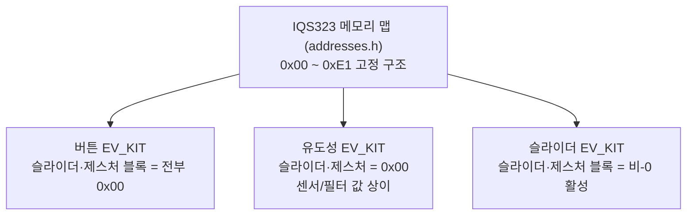

# IQS323 예제코드 — EV_KIT 설정·레지스터 주소

> [!NOTE]
> **TL;DR**: Azoteq IQS323 Arduino 예제코드의 3개 EV_KIT 초기화 헤더(`3PROJ_BUTTONS`·`INDUCTIVE_OPTIONS`·`SLIDER`)는 동일한 메모리 맵 구조에 서로 다른 `#define` 초기화 값을 담는다. 본 문서는 세 헤더의 값을 항목별로 표 비교하고, `inc/IQS323_addresses.h`의 메모리 맵 주소 상수(0x00~0xE1)를 그대로 옮긴다. 모든 수치는 원문 그대로이며 미명시는 "원문 미명시"로 표기한다.

## 1. 출처와 범위

| 항목 | 내용 |
|---|---|
| 초기화 헤더 1 (버튼) | `src/IQS323/IQS323_3PROJ_BUTTONS_EV_KIT.h` (전체 196줄) |
| 초기화 헤더 2 (유도성) | `src/IQS323/IQS323_INDUCTIVE_OPTIONS_EV_KIT.h` (전체 200줄) |
| 초기화 헤더 3 (슬라이더) | `src/IQS323/IQS323_SLIDER_EV_KIT.h` (전체 200줄) |
| 주소 상수 헤더 | `src/IQS323/inc/IQS323_addresses.h` (전체 150줄) |

> [!NOTE]
> 세 초기화 헤더 모두 파일 머리 주석(1~6줄)에 `File: IQS323_init.h`, `Author: Azoteq`로 표기되어 있고, GUI에서 변경하거나 직접 편집할 수 있다고 적혀 있다(2~3줄). 세 헤더 모두 인클루드 가드는 `IQS323_SETTINGS_H`(8~9줄)이다. 본 문서에서 헤더를 각각 "버튼"·"유도성"·"슬라이더"로 약칭한다.

---

## 2. 주소 상수 — `inc/IQS323_addresses.h`

> [!NOTE]
> 헤더 파일 머리 주석(11~16줄)에 "IQS323 - Registers & Memory Map"으로 명시되어 있고, 자세한 내용은 IQS323 데이터시트(12~13줄 링크)를 참조하도록 안내한다. 인클루드 가드는 `__IQS323_ADDRESSES_H`(18~19줄)이다. 아래 표는 헤더에 정의된 메모리 맵(`IQS323_MM_*`) 상수를 블록별로 원문 그대로 옮긴 것이다. 주석에 "Read Only"로 표기된 블록은 비고에 적었다.

### 2.1 디바이스 정보 (Read Only)

원문 주석: `Device Information - Read Only`(21줄), `VERSION DETAILS: 0x00 - 0x09`(23줄).

| 매크로 | 값 | 줄 |
|---|---|---|
| `IQS323_MM_PROD_NUM` | 0x00 | 24 |
| `IQS323_MM_MAJOR_VERSION_NUM` | 0x01 | 25 |
| `IQS323_MM_MINOR_VERSION_NUM` | 0x02 | 26 |

### 2.2 시스템 정보 — `SYSTEM INFORMATION: 0x10 - 0x18` (28줄)

| 매크로 | 값 | 줄 |
|---|---|---|
| `IQS323_MM_SYSTEM_STATUS` | 0x10 | 29 |
| `IQS323_MM_GESTURES` | 0x11 | 30 |
| `IQS323_MM_SLIDER_COORDINATES` | 0x12 | 31 |
| `IQS323_MM_CH0_COUNTS` | 0x13 | 32 |
| `IQS323_MM_CH0_LTA` | 0x14 | 33 |
| `IQS323_MM_CH1_COUNTS` | 0x15 | 34 |
| `IQS323_MM_CH1_LTA` | 0x16 | 35 |
| `IQS323_MM_CH2_COUNTS` | 0x17 | 36 |
| `IQS323_MM_CH2_LTA` | 0x18 | 37 |

### 2.3 릴리즈 UI / 이동 UI — `RELEASE UI / MOVEMENT UI: 0x20 - 0x25` (39줄)

| 매크로 | 값 | 줄 |
|---|---|---|
| `IQS323_MM_CH0_ACT_MOVE_LTA` | 0x20 | 40 |
| `IQS323_MM_CH1_ACT_MOVE_LTA` | 0x21 | 41 |
| `IQS323_MM_CH2_ACT_MOVE_LTA` | 0x22 | 42 |
| `IQS323_MM_CH0_DELTA_SNAP` | 0x23 | 43 |
| `IQS323_MM_CH1_DELTA_SNAP` | 0x24 | 44 |
| `IQS323_MM_CH2_DELTA_SNAP` | 0x25 | 45 |

### 2.4 센서 0/1/2 셋업 — `SENSOR n SETUP: 0xn0 - 0xn9` (47·59·71줄)

세 센서 블록은 동일 구조이며 주소만 0x10씩 증가한다(센서0=0x30대, 센서1=0x40대, 센서2=0x50대).

| 매크로 접미 | 센서0 (0x3n) | 센서1 (0x4n) | 센서2 (0x5n) | 줄(센서0) |
|---|---|---|---|---|
| `_SETUP_0` | 0x30 | 0x40 | 0x50 | 48 |
| `_CONV_FREQ_SETUP` | 0x31 | 0x41 | 0x51 | 49 |
| `_PROX_CONTROL` | 0x32 | 0x42 | 0x52 | 50 |
| `_PROX_INPUT_CONTROL` | 0x33 | 0x43 | 0x53 | 51 |
| `_PATTERN_DEFINITIONS` | 0x34 | 0x44 | 0x54 | 52 |
| `_PATTERN_SELECT` | 0x35 | 0x45 | 0x55 | 53 |
| `_ATI_SETUP` | 0x36 | 0x46 | 0x56 | 54 |
| `_ATI_BASE` | 0x37 | 0x47 | 0x57 | 55 |
| `_ATI_MULTI_SELECTION` | 0x38 | 0x48 | 0x58 | 56 |
| `_COMPENSATION` | 0x39 | 0x49 | 0x59 | 57 |

> [!NOTE]
> 실제 매크로 이름은 `IQS323_MM_S0_SETUP_0`, `IQS323_MM_S1_SETUP_0`, `IQS323_MM_S2_SETUP_0` 형식이다(48·60·72줄).

### 2.5 채널 0/1/2 셋업 — `CHANNEL n SETUP` (83·90·97줄)

원문 주석: `CHANNEL 0 SETUP: 0x60 - 0x64`, `CHANNEL 1 SETUP: 0x70 - 0x74`, `CHANNEL 2 SETUP: 0x80 - 0x84`.

| 매크로 접미 | 채널0 (0x6n) | 채널1 (0x7n) | 채널2 (0x8n) | 줄(채널0) |
|---|---|---|---|---|
| `_SETUP_0` | 0x60 | 0x70 | 0x80 | 84 |
| `_PROX_SETTINGS` | 0x61 | 0x71 | 0x81 | 85 |
| `_TOUCH_SETTINGS` | 0x62 | 0x72 | 0x82 | 86 |
| `_FOLLOWER_WEIGHT` | 0x63 | 0x73 | 0x83 | 87 |
| `_MOVEMENT_UI` | 0x64 | 0x74 | 0x84 | 88 |

> [!NOTE]
> 실제 매크로 이름은 `IQS323_MM_CH0_SETUP_0` 형식이다(84·91·98줄).

### 2.6 슬라이더 설정 — `SLIDER CONFIG: 0x90 - 0x98` (104줄)

| 매크로 | 값 | 줄 |
|---|---|---|
| `IQS323_MM_SLIDER_SETUP_CALIBRATION` | 0x90 | 105 |
| `IQS323_MM_SLIDER_CALIBRATION_BOT_SPEED` | 0x91 | 106 |
| `IQS323_MM_SLIDER_TOP_SPEED` | 0x92 | 107 |
| `IQS323_MM_SLIDER_RESOLUTION` | 0x93 | 108 |
| `IQS323_MM_SLIDER_EN_MASK` | 0x94 | 109 |
| `IQS323_MM_SLIDER_EN_STATUS_POINTER` | 0x95 | 110 |
| `IQS323_MM_SLIDER_DELTA_LINK_0` | 0x96 | 111 |
| `IQS323_MM_SLIDER_DELTA_LINK_1` | 0x97 | 112 |
| `IQS323_MM_SLIDER_DELTA_LINK_2` | 0x98 | 113 |

### 2.7 제스처 설정 — `GESTURE CONFIG: 0xA0 - 0xA6` (115줄)

| 매크로 | 값 | 줄 |
|---|---|---|
| `IQS323_MM_GESTURE_ENABLE` | 0xA0 | 116 |
| `IQS323_MM_GESTURE_MINIMUM_TIME` | 0xA1 | 117 |
| `IQS323_MM_GESTURE_MAX_TAP_TIME` | 0xA2 | 118 |
| `IQS323_MM_GESTURE_MAX_SWIPE_TIME` | 0xA3 | 119 |
| `IQS323_MM_GESTURE_MIN_HOLD_TIME` | 0xA4 | 120 |
| `IQS323_MM_GESTURE_MAX_TAP_DISTANCE` | 0xA5 | 121 |
| `IQS323_MM_GESTURE_MIN_SWIPE_DISTANCE` | 0xA6 | 122 |

### 2.8 필터 베타 — `FILTER BETAS: 0xB0 - 0xB4` (124줄)

| 매크로 | 값 | 줄 |
|---|---|---|
| `IQS323_MM_COUNTS_FILTER_BETA` | 0xB0 | 125 |
| `IQS323_MM_LTA_FILTER_BETA` | 0xB1 | 126 |
| `IQS323_MM_LTA_FAST_FILTER_BETA` | 0xB2 | 127 |
| `IQS323_MM_ACT_MOVE_LTA_FILTER_BETA` | 0xB3 | 128 |
| `IQS323_MM_FAST_FILTER_BAND` | 0xB4 | 129 |

### 2.9 시스템 제어 — `SYSTEM CONTROL: 0xC0 - 0xC5` (131줄)

| 매크로 | 값 | 줄 |
|---|---|---|
| `IQS323_MM_SYSTEM_CONTROL` | 0xC0 | 132 |
| `IQS323_MM_NORMAL_POWER_REPORT_RATE` | 0xC1 | 133 |
| `IQS323_MM_LOW_POWER_REPORT_RATE` | 0xC2 | 134 |
| `IQS323_MM_ULP_REPORT_RATE` | 0xC3 | 135 |
| `IQS323_MM_HALT_MODE_REPORT_RATE` | 0xC4 | 136 |
| `IQS323_MM_POWER_MODE_TIMEOUT` | 0xC5 | 137 |

### 2.10 일반 — `GENERAL: 0xD0 - 0xD4` (139줄)

| 매크로 | 값 | 줄 |
|---|---|---|
| `IQS323_MM_OUTA_MASK` | 0xD0 | 140 |
| `IQS323_MM_I2C_TRANS_TIMEOUT` | 0xD1 | 141 |
| `IQS323_MM_EVENT_TIMEOUTS` | 0xD2 | 142 |
| `IQS323_MM_EVENT_EN_ACTIVATION_THRESHOLD` | 0xD3 | 143 |
| `IQS323_MM_RELEASE_UI_MOVE_TIMEOUT` | 0xD4 | 144 |

### 2.11 I2C 설정 — `I2C SETTINGS: 0xE0 - 0xE1` (146줄)

| 매크로 | 값 | 줄 |
|---|---|---|
| `IQS323_MM_I2C_SETUP` | 0xE0 | 147 |
| `IQS323_MM_HARDWARE_ID` | 0xE1 | 148 |

---

## 3. 세 EV_KIT 초기화 값 비교

> [!IMPORTANT]
> 아래 표의 좌측 열은 초기화 헤더에 쓰인 `#define` 식별자(예: `S0_SETUP`)이며, addresses 헤더의 주소 상수(`IQS323_MM_*`)와는 별개 이름 체계다. 각 절 제목의 메모리 맵 위치는 초기화 헤더의 블록 주석에서 그대로 인용했다. 값은 세 헤더에서 동일 줄 번호를 공유한다(파일 구조가 같음). 세 헤더 간 값이 다른 항목은 비고에 "상이"로 표기했다.

### 3.1 센서 0 설정 — Memory Map Position 0x30 - 0x39 (12줄 주석 공통)

| `#define` | 버튼 | 유도성 | 슬라이더 | 줄 | 비고 |
|---|---|---|---|---|---|
| `S0_SETUP` | 0x09 | 0x29 | 0x01 | 13 | 상이 |
| `S0_TX_SELECT` | 0x08 | 0x04 | 0x02 | 14 | 상이 |
| `S0_CONV_FREQ_FRAC` | 0x7F | 0x7F | 0x7F | 15 | 동일 |
| `S0_CONV_FREQ_PERIOD` | 0x05 | 0x05 | 0x05 | 16 | 동일 |
| `S0_PRX_CTRL_0` | 0x93 | 0xBD | 0x90 | 17 | 상이 |
| `S0_PRX_CTRL_1` | 0x1A | 0x12 | 0x12 | 18 | 상이 |
| `S0_TG_CTRL` | 0xCF | 0x8F | 0xCF | 19 | 상이 |
| `S0_RX_SELECT` | 0x02 | 0x02 | 0x02 | 20 | 동일 |
| `S0_CALCAP_INACTIVE_RX` | 0x0A | 0x0A | 0x0A | 21 | 동일 |
| `S0_PATTERN_SETUP` | 0x0E | 0x0B | 0x03 | 22 | 상이 |
| `S0_PATTERN_SELECT` | 0x00 | 0x00 | 0x00 | 23 | 동일 |
| `S0_BIAS_CURRENT` | 0x00 | 0x00 | 0x00 | 24 | 동일 |
| `S0_ATI_SETUP_0` | 0x8C | 0x0C | 0xCC | 25 | 상이 |
| `S0_ATI_SETUP_1` | 0x02 | 0x02 | 0x03 | 26 | 상이 |
| `S0_ATI_BASE_0` | 0xC8 | 0xC8 | 0x96 | 27 | 상이 |
| `S0_ATI_BASE_1` | 0x00 | 0x00 | 0x00 | 28 | 동일 |
| `S0_ATI_COARSE` | 0x21 | 0x44 | 0x44 | 29 | 상이 |
| `S0_ATI_FINE` | 0x69 | 0x58 | 0x56 | 30 | 상이 |
| `S0_COMPENSATION_0` | 0xA6 | 0x10 | 0xEC | 31 | 상이 |
| `S0_COMPENSATION_1` | 0xFB | 0xFB | 0xA3 | 32 | 상이 |

### 3.2 센서 1 설정 — Memory Map Position 0x40 - 0x49 (35줄 주석 공통)

| `#define` | 버튼 | 유도성 | 슬라이더 | 줄 | 비고 |
|---|---|---|---|---|---|
| `S1_SETUP` | 0x09 | 0x29 | 0x01 | 36 | 상이 |
| `S1_TX_SELECT` | 0x08 | 0x08 | 0x01 | 37 | 상이 |
| `S1_CONV_FREQ_FRAC` | 0x7F | 0x7F | 0x7F | 38 | 동일 |
| `S1_CONV_FREQ_PERIOD` | 0x05 | 0x05 | 0x05 | 39 | 동일 |
| `S1_PRX_CTRL_0` | 0x93 | 0xBD | 0x90 | 40 | 상이 |
| `S1_PRX_CTRL_1` | 0x1A | 0x12 | 0x12 | 41 | 상이 |
| `S1_TG_CTRL` | 0xCF | 0x8F | 0xCF | 42 | 상이 |
| `S1_RX_SELECT` | 0x01 | 0x01 | 0x01 | 43 | 동일 |
| `S1_CALCAP_INACTIVE_RX` | 0x0A | 0x0A | 0x0A | 44 | 동일 |
| `S1_PATTERN_SETUP` | 0x0E | 0x0B | 0x03 | 45 | 상이 |
| `S1_PATTERN_SELECT` | 0x00 | 0x00 | 0x00 | 46 | 동일 |
| `S1_BIAS_CURRENT` | 0x00 | 0x00 | 0x00 | 47 | 동일 |
| `S1_ATI_SETUP_0` | 0x8C | 0x8C | 0xCC | 48 | 상이 |
| `S1_ATI_SETUP_1` | 0x02 | 0x02 | 0x03 | 49 | 상이 |
| `S1_ATI_BASE_0` | 0xC8 | 0xFA | 0x96 | 50 | 상이 |
| `S1_ATI_BASE_1` | 0x00 | 0x00 | 0x00 | 51 | 동일 |
| `S1_ATI_COARSE` | 0xC1 | 0x44 | 0x44 | 52 | 상이 |
| `S1_ATI_FINE` | 0x5C | 0x5E | 0x5E | 53 | 상이 |
| `S1_COMPENSATION_0` | 0x98 | 0xD5 | 0xDC | 54 | 상이 |
| `S1_COMPENSATION_1` | 0xFB | 0xFA | 0xA3 | 55 | 상이 |

### 3.3 센서 2 설정 — Memory Map Position 0x50 - 0x59 (58줄 주석 공통)

| `#define` | 버튼 | 유도성 | 슬라이더 | 줄 | 비고 |
|---|---|---|---|---|---|
| `S2_SETUP` | 0x09 | 0x00 | 0x01 | 59 | 상이 |
| `S2_TX_SELECT` | 0x08 | 0x01 | 0x04 | 60 | 상이 |
| `S2_CONV_FREQ_FRAC` | 0x7F | 0x7F | 0x7F | 61 | 동일 |
| `S2_CONV_FREQ_PERIOD` | 0x05 | 0x05 | 0x05 | 62 | 동일 |
| `S2_PRX_CTRL_0` | 0x93 | 0x90 | 0x90 | 63 | 상이 |
| `S2_PRX_CTRL_1` | 0x1A | 0x12 | 0x12 | 64 | 상이 |
| `S2_TG_CTRL` | 0xCF | 0xCF | 0xCF | 65 | 동일 |
| `S2_RX_SELECT` | 0x04 | 0x01 | 0x04 | 66 | 상이 |
| `S2_CALCAP_INACTIVE_RX` | 0x0A | 0x0A | 0x0A | 67 | 동일 |
| `S2_PATTERN_SETUP` | 0x0E | 0x03 | 0x03 | 68 | 상이 |
| `S2_PATTERN_SELECT` | 0x00 | 0x00 | 0x00 | 69 | 동일 |
| `S2_BIAS_CURRENT` | 0x00 | 0x00 | 0x00 | 70 | 동일 |
| `S2_ATI_SETUP_0` | 0x8C | 0x0C | 0xCC | 71 | 상이 |
| `S2_ATI_SETUP_1` | 0x02 | 0x04 | 0x03 | 72 | 상이 |
| `S2_ATI_BASE_0` | 0xC8 | 0x64 | 0x96 | 73 | 상이 |
| `S2_ATI_BASE_1` | 0x00 | 0x00 | 0x00 | 74 | 동일 |
| `S2_ATI_COARSE` | 0x21 | 0x4E | 0x44 | 75 | 상이 |
| `S2_ATI_FINE` | 0x69 | 0x5A | 0x58 | 76 | 상이 |
| `S2_COMPENSATION_0` | 0xB0 | 0xE9 | 0xFB | 77 | 상이 |
| `S2_COMPENSATION_1` | 0xFB | 0x63 | 0xAB | 78 | 상이 |

### 3.4 채널 0 설정 — Memory Map Position 0x60 - 0x63 (81줄 주석 공통)

| `#define` | 버튼 | 유도성 | 슬라이더 | 줄 | 비고 |
|---|---|---|---|---|---|
| `CH0_REF_UI_SETUP` | 0x00 | 0x00 | 0x00 | 82 | 동일 |
| `CH0_FOLLOWER_MASK` | 0x00 | 0x00 | 0x00 | 83 | 동일 |
| `CH0_PROX_THRESHOLD` | 0x14 | 0x14 | 0x0A | 84 | 상이 |
| `CH0_PROX_DEBOUNCE` | 0x44 | 0x44 | 0x44 | 85 | 동일 |
| `CH0_TOUCH_THRESHOLD` | 0x28 | 0x28 | 0x0F | 86 | 상이 |
| `CH0_TOUCH_HYSTERESIS` | 0x00 | 0x00 | 0x00 | 87 | 동일 |
| `CH0_FOLLOWER_WEIGHT_0` | 0x00 | 0x00 | 0x00 | 88 | 동일 |
| `CH0_FOLLOWER_WEIGHT_1` | 0x00 | 0x00 | 0x00 | 89 | 동일 |

### 3.5 채널 1 설정 — Memory Map Position 0x70 - 0x75 (92줄 주석 공통)

| `#define` | 버튼 | 유도성 | 슬라이더 | 줄 | 비고 |
|---|---|---|---|---|---|
| `CH1_REF_UI_SETUP` | 0x00 | 0x00 | 0x00 | 93 | 동일 |
| `CH1_FOLLOWER_MASK` | 0x00 | 0x00 | 0x00 | 94 | 동일 |
| `CH1_PROX_THRESHOLD` | 0x14 | 0x0A | 0x0A | 95 | 상이 |
| `CH1_PROX_DEBOUNCE` | 0x44 | 0x44 | 0x44 | 96 | 동일 |
| `CH1_TOUCH_THRESHOLD` | 0x28 | 0x0C | 0x0F | 97 | 상이 |
| `CH1_TOUCH_HYSTERESIS` | 0x00 | 0x00 | 0x00 | 98 | 동일 |
| `CH1_FOLLOWER_WEIGHT_0` | 0x00 | 0x00 | 0x00 | 99 | 동일 |
| `CH1_FOLLOWER_WEIGHT_1` | 0x00 | 0x00 | 0x00 | 100 | 동일 |

### 3.6 채널 2 설정 — Memory Map Position 0x80 - 0x85 (103줄 주석 공통)

| `#define` | 버튼 | 유도성 | 슬라이더 | 줄 | 비고 |
|---|---|---|---|---|---|
| `CH2_REF_UI_SETUP` | 0x00 | 0x00 | 0x00 | 104 | 동일 |
| `CH2_FOLLOWER_MASK` | 0x00 | 0x00 | 0x00 | 105 | 동일 |
| `CH2_PROX_THRESHOLD` | 0x14 | 0x00 | 0x0A | 106 | 상이 |
| `CH2_PROX_DEBOUNCE` | 0x44 | 0x00 | 0x44 | 107 | 상이 |
| `CH2_TOUCH_THRESHOLD` | 0x28 | 0x00 | 0x0F | 108 | 상이 |
| `CH2_TOUCH_HYSTERESIS` | 0x00 | 0x00 | 0x00 | 109 | 동일 |
| `CH2_FOLLOWER_WEIGHT_0` | 0x00 | 0x00 | 0x00 | 110 | 동일 |
| `CH2_FOLLOWER_WEIGHT_1` | 0x00 | 0x00 | 0x00 | 111 | 동일 |

### 3.7 슬라이더 설정 — Memory Map Position 0x90 - 0x98 (114줄 주석 공통)

| `#define` | 버튼 | 유도성 | 슬라이더 | 줄 | 비고 |
|---|---|---|---|---|---|
| `SLIDER_SETUP` | 0x00 | 0x00 | 0x0B | 115 | 상이 |
| `LOWER_CALIBRATION` | 0x00 | 0x00 | 0x00 | 116 | 동일 |
| `UPPER_CALIBRATION` | 0x00 | 0x00 | 0x00 | 117 | 동일 |
| `BOTTOM_SPEED` | 0x00 | 0x00 | 0x14 | 118 | 상이 |
| `TOP_SPEED_0` | 0x00 | 0x00 | 0xC8 | 119 | 상이 |
| `TOP_SPEED_1` | 0x00 | 0x00 | 0x00 | 120 | 동일 |
| `SLIDER_RESOLUTION_0` | 0x00 | 0x00 | 0x00 | 121 | 동일 |
| `SLIDER_RESOLUTION_1` | 0x00 | 0x00 | 0x08 | 122 | 상이 |
| `ENABLE_MASK_0` | 0x00 | 0x00 | 0x07 | 123 | 상이 |
| `ENABLE_MASK_1` | 0x00 | 0x00 | 0x00 | 124 | 동일 |
| `ENABLE_STATUS_POINTER_0` | 0x00 | 0x00 | 0x52 | 125 | 상이 |
| `ENABLE_STATUS_POINTER_1` | 0x00 | 0x00 | 0x05 | 126 | 상이 |
| `DELTA_LINK0_0` | 0x00 | 0x00 | 0x30 | 127 | 상이 |
| `DELTA_LINK0_1` | 0x00 | 0x00 | 0x04 | 128 | 상이 |
| `DELTA_LINK1_0` | 0x00 | 0x00 | 0x72 | 129 | 상이 |
| `DELTA_LINK1_1` | 0x00 | 0x00 | 0x04 | 130 | 상이 |
| `DELTA_LINK2_0` | 0x00 | 0x00 | 0xB4 | 131 | 상이 |
| `DELTA_LINK2_1` | 0x00 | 0x00 | 0x04 | 132 | 상이 |

> [!NOTE]
> 슬라이더 EV_KIT만 슬라이더 블록을 비-0 값으로 설정한다. 버튼·유도성 헤더는 본 블록 18개 항목 모두 0x00이다(원문 115~132줄).

### 3.8 제스처 설정 — Memory Map Position 0xA0 - 0xA6 (135줄 주석 공통)

| `#define` | 버튼 | 유도성 | 슬라이더 | 줄 | 비고 |
|---|---|---|---|---|---|
| `GESTURE_SELECT` | 0x00 | 0x00 | 0x0F | 136 | 상이 |
| `RESERVED_BYTE` | 0x00 | 0x00 | 0x00 | 137 | 동일 |
| `MINIMUM_TIME_0` | 0x00 | 0x00 | 0x0A | 138 | 상이 |
| `MINIMUM_TIME_1` | 0x00 | 0x00 | 0x00 | 139 | 동일 |
| `MAXIMUM_TAP_TIME_0` | 0x00 | 0x00 | 0xC8 | 140 | 상이 |
| `MAXIMUM_TAP_TIME_1` | 0x00 | 0x00 | 0x00 | 141 | 동일 |
| `MAXIMUM_SWIPE_TIME_0` | 0x00 | 0x00 | 0x2C | 142 | 상이 |
| `MAXIMUM_SWIPE_TIME_1` | 0x00 | 0x00 | 0x01 | 143 | 상이 |
| `MINIMUM_HOLD_TIME_0` | 0x00 | 0x00 | 0x2C | 144 | 상이 |
| `MINIMUM_HOLD_TIME_1` | 0x00 | 0x00 | 0x01 | 145 | 상이 |
| `MAXIMUM_TAP_DISTANCE_0` | 0x00 | 0x00 | 0xC8 | 146 | 상이 |
| `MAXIMUM_TAP_DISTANCE_1` | 0x00 | 0x00 | 0x00 | 147 | 동일 |
| `MINIMUM_SWIPE_DISTANCE_0` | 0x00 | 0x00 | 0x8A | 148 | 상이 |
| `MINIMUM_SWIPE_DISTANCE_1` | 0x00 | 0x00 | 0x02 | 149 | 상이 |

> [!NOTE]
> 제스처 블록도 슬라이더 EV_KIT만 비-0 값을 가진다. 버튼·유도성 헤더는 14개 항목 모두 0x00이다(원문 136~149줄).

### 3.9 필터 베타 — Memory Map Position 0xB0 - 0xB4 (152줄 주석 공통)

| `#define` | 버튼 | 유도성 | 슬라이더 | 줄 | 비고 |
|---|---|---|---|---|---|
| `NP_COUNTS_FILTER` | 0x02 | 0x02 | 0x02 | 153 | 동일 |
| `LP_COUNTS_FILTER` | 0x02 | 0x01 | 0x01 | 154 | 상이 |
| `NP_LTA_FILTER` | 0x05 | 0x08 | 0x08 | 155 | 상이 |
| `LP_LTA_FILTER` | 0x05 | 0x07 | 0x07 | 156 | 상이 |
| `NP_LTA_FAST_FILTER` | 0x03 | 0x04 | 0x04 | 157 | 상이 |
| `LP_LTA_FAST_FILTER` | 0x03 | 0x03 | 0x03 | 158 | 동일 |
| `NP_ACTIVATION_LTA_FILTER` | 0x00 | 0x00 | 0x00 | 159 | 동일 |
| `LP_ACTIVATION_LTA_FILTER` | 0x00 | 0x00 | 0x00 | 160 | 동일 |
| `FAST_FILTER_BAND_0` | 0x1E | 0x0F | 0x0F | 161 | 상이 |
| `FAST_FILTER_BAND_1` | 0x00 | 0x00 | 0x00 | 162 | 동일 |

### 3.10 전원 모드·시스템 설정 — Memory Map Position 0xC0 - 0xC5 (165줄 주석 공통)

| `#define` | 버튼 | 유도성 | 슬라이더 | 줄 | 비고 |
|---|---|---|---|---|---|
| `SYSTEM_CONTROL` | 0x50 | 0x50 | 0x50 | 166 | 동일 |
| 2번째 바이트 (주석명 상이) | 0x00 | 0x00 | 0x00 | 167 | 동일 (주석명 상이*) |
| `NP_REPORT_RATE_0` | 0x10 | 0x0A | 0x10 | 168 | 상이 |
| `NP_REPORT_RATE_1` | 0x00 | 0x00 | 0x00 | 169 | 동일 |
| `LP_REPORT_RATE_0` | 0x3C | 0x50 | 0x3C | 170 | 상이 |
| `LP_REPORT_RATE_1` | 0x00 | 0x00 | 0x00 | 171 | 동일 |
| `ULP_REPORT_RATE_0` | 0xA0 | 0xC8 | 0xA0 | 172 | 상이 |
| `ULP_REPORT_RATE_1` | 0x00 | 0x00 | 0x00 | 173 | 동일 |
| `HALT_REPORT_RATE_0` | 0xB8 | 0xB8 | 0xB8 | 174 | 동일 |
| `HALT_REPORT_RATE_1` | 0x0B | 0x0B | 0x0B | 175 | 동일 |
| `POWER_MODE_TIMEOUT_0` | 0xD0 | 0xD0 | 0xD0 | 176 | 동일 |
| `POWER_MODE_TIMEOUT_1` | 0x07 | 0x07 | 0x07 | 177 | 동일 |

> [!WARNING]
> *167줄의 `#define` 식별자는 헤더별로 다르다. 버튼 헤더는 `RESERVED_BYTE`(167줄), 유도성·슬라이더 헤더는 `CHANNEL_TIMEOUT_DISABLE`(167줄)로 명명되어 있다. 세 헤더 모두 값은 0x00이다.

### 3.11 I2C 설정·이벤트 마스크 — Memory Map Position 0xD0 - 0xD4 (179줄 주석 공통)

| `#define` | 버튼 | 유도성 | 슬라이더 | 줄 | 비고 |
|---|---|---|---|---|---|
| `OUTA_MASK_0` | 0x00 | 0x00 | 0x80 | 181 | 상이 |
| `OUTA_MASK_1` | 0x2A | 0x0A | 0x00 | 182 | 상이 |
| `I2C_TIMEOUT_0` | 0xC8 | 0xC8 | 0xC8 | 183 | 동일 |
| `I2C_TIMEOUT_1` | 0x00 | 0x00 | 0x00 | 184 | 동일 |
| `PROX_EVENT_TIMEOUT` | 0x0A | 0x14 | 0x00 | 185 | 상이 |
| `TOUCH_EVENT_TIMEOUT` | 0x14 | 0x0A | 0x00 | 186 | 상이 |
| `EVENTS_ENABLE` | 0x0B | 0x0B | 0x0F | 187 | 상이 |
| `ACTIVATION_THRESHOLD` | 0x00 | 0x00 | 0x00 | 188 | 동일 |
| `RELEASE_DELTA_PERCENTAGE` | 0x00 | 0x00 | 0x00 | 189 | 동일 |
| `DELTA_SNAP_SAMPLE_DELAY` | 0x00 | 0x00 | 0x00 | 190 | 동일 |

### 3.12 I2C 설정 — Memory Map Position 0xE0 (버튼) / 0xE0 - 0xE1 (유도성·슬라이더)

> [!WARNING]
> 본 블록은 헤더별로 항목 수와 주석이 다르다.
> - **버튼 헤더**: 블록 주석 `Memory Map Position 0xE0 - 0xDF`(193줄, 원문 그대로), 항목은 `I2C_SETUP` 0x00(194줄) 1개뿐. 인클루드 가드 닫힘 주석은 `IQS323_SETTINGS_H`(196줄).
> - **유도성·슬라이더 헤더**: 블록 주석 `Memory Map Position 0xE0 - 0xE1`(193줄), 항목은 아래 4개. 인클루드 가드 닫힘 주석은 `IQS323_INIT_H`(199줄).

| `#define` | 버튼 | 유도성 | 슬라이더 | 줄(유도성·슬라이더) | 비고 |
|---|---|---|---|---|---|
| `I2C_SETUP` | 0x00 | 0x00 | 0x00 | 194 | 동일 |
| `RESERVED_BYTE` | 원문 미명시 | 0x00 | 0x00 | 195 | 버튼 헤더에는 없음 |
| `HWID_0` | 원문 미명시 | 0xEE | 0xEE | 196 | 버튼 헤더에는 없음 |
| `HWID_1` | 원문 미명시 | 0xEE | 0xEE | 197 | 버튼 헤더에는 없음 |

---

## 4. 헤더 간 구조 차이 요약

> [!NOTE]
> 위 다이어그램은 §3의 표에서 도출한 구조 요약으로, 세 헤더가 같은 메모리 맵을 공유하되 용도(버튼/유도성/슬라이더)에 맞춰 초기화 값만 달리한다는 점을 나타낸다. 각 셀의 근거 줄 번호는 §3 해당 절에 명시되어 있다.

주요 구조 차이(원문 근거):

| 차이 항목 | 버튼 | 유도성 | 슬라이더 |
|---|---|---|---|
| 0xE0 블록 항목 수 | 1개 (`I2C_SETUP`만) | 4개 (HWID 포함) | 4개 (HWID 포함) |
| 0xE0 블록 주석 | `0xE0 - 0xDF`(193줄, 원문 표기) | `0xE0 - 0xE1`(193줄) | `0xE0 - 0xE1`(193줄) |
| 가드 닫힘 주석 | `IQS323_SETTINGS_H`(196줄) | `IQS323_INIT_H`(199줄) | `IQS323_INIT_H`(199줄) |
| 167줄 식별자 | `RESERVED_BYTE` | `CHANNEL_TIMEOUT_DISABLE` | `CHANNEL_TIMEOUT_DISABLE` |
| 슬라이더 블록(0x90~) | 전부 0x00 | 전부 0x00 | 비-0 활성 |
| 제스처 블록(0xA0~) | 전부 0x00 | 전부 0x00 | 비-0 활성 |

---

## 5. 원문 미명시 사항

> [!NOTE]
> 본 절은 본 범위(4개 헤더)에서 다루지 않거나 명시되지 않은 항목을 정리한 것이며, 추정·외부 지식을 일절 포함하지 않는다.
> - 각 `#define` 값의 비트 필드 의미·물리 단위: 헤더 파일 본문에 미명시(2~3줄 주석은 "GUI 또는 직접 편집"만 안내, IQS323 데이터시트 참조 권고는 addresses 헤더 12~13줄에만 존재).
> - 버튼 헤더 0xE0 블록 주석의 `0xE0 - 0xDF` 표기: 원문 그대로 옮겼으며 정오 판단은 원문 미명시.
> - 초기화 값이 적용되는 쓰기 순서·시퀀스: 본 4개 헤더에 미명시(`IQS323.cpp` 등 별도 소스 범위, 본 문서 범위 외).
