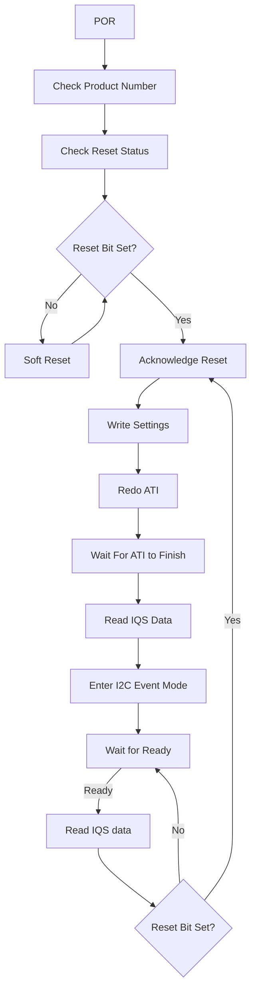

# IQS323 예제코드 — Arduino 가이드

> [!NOTE]
> **TL;DR**: IQS323(3채널 Self-Cap / 3채널 Mutual-Cap / 2채널 Inductive 센싱 컨트롤러) Arduino 예제코드의 공식 가이드를 정리. 3.3 V 로직 보드(SparkFun Pro Micro 3.3 V, 8 MHz) 기준 셋업·핀 할당·`#define` 설정, POR→ATI→I2C Event Mode 코드 흐름, SparkFun 보드 라이브러리 설치, 시리얼 통신 명령('f'/'r')을 원문 페이지·줄 번호 인용과 함께 수록.

---

## 1. 문서 개요

- 원문 제목: **IQS323 Arduino Example Code** (Azoteq, 줄 1~2)
- 시리즈: IQ Switch® ProxFusion® Series (줄 9~10)
- 저작권: © 2023 Azoteq (Pty) Ltd. All rights reserved (줄 7~8)
- 본 레퍼런스 작성 시 사용한 추출 텍스트: `iqs323_arduino_guide v1.5.2` PDF의 `-layout` 변환본
- 원문 목차(줄 11~28) 기준 구성 (페이지 번호는 원문 표기):

| 섹션 | 원문 페이지 |
|---|---|
| Introduction | 1 |
| Arduino Code Configuration | 2 |
| Example Code Flow Diagram | 3 |
| SparkFun Board Library Installation | 4 |
| Serial Communication and Interface | 7 |

---

## 2. 소개 (Introduction)

원문 페이지 1 (줄 37~44).

- 본 Arduino 예제코드는 **IQS323 IC**의 셋업과 사용 방법을 시연한다 (줄 38).
- IQS323은 **3채널 Self-Capacitive / 3채널 Mutual-Capacitive / 2채널 Inductive** 센싱 컨트롤러이며, **Touch 및 Proximity 사용자 인터페이스**를 제공한다 (줄 38~39).
- 본 예제코드는 **3개의 IQS323 Evaluation Kit 모두**를 수용한다 (줄 40).

> [!IMPORTANT]
> **로직 전압 (줄 42~44)**
> - 본 예제코드는 **3.3 V 로직을 사용하는 Arduino 호환 보드**용으로 작성되었다 (예: SparkFun의 Pro Micro 3.3 V, 8 MHz).
> - **5 V 로직 Arduino 보드**를 사용할 경우, Arduino 기반 보드와 IQS323 사이에 **로직 레벨 변환기(logic-level translator)**가 필요하다.

---

## 3. Arduino 코드 설정 (Arduino Code Configuration)

원문 페이지 2 (줄 53~91).

- Arduino 코드의 동작과 핀 할당은 `iqs323-example-code.ino` 시작 부분의 `#define` 설정으로 구성할 수 있다 (줄 54~55).

### 3.1 EV-Kit 선택

- 예제코드 폴더에서 `src/IQS323.h` 파일로 이동하여, 컴파일 대상 IQS323 EV-KIT 번호로 define 값을 변경한다 (줄 57~58).

원문 코드 블록 (줄 61~66):

```c
/* Select the EV-Kit below by changing the value of the define (default = 0):
 * 0: Inductive Options EV-Kit (AZP1212A3).
 * 1: Slider EV-Kit (AZP1209A4).
 * 2: 3-Projected Buttons EV-Kit (AZP1210A4).
 */
#define IQS323_EV_KIT 0
```

| define 값 | EV-Kit 종류 | 모델 번호 |
|---|---|---|
| 0 (기본값) | Inductive Options EV-Kit | AZP1212A3 |
| 1 | Slider EV-Kit | AZP1209A4 |
| 2 | 3-Projected Buttons EV-Kit | AZP1210A4 |

> [!NOTE]
> **모델 표기 원문 간 상이**: Inductive Options EV-Kit 모델이 본 가이드 PDF(줄 62)에는 **AZP1212A3**, 예제 코드 `.ino`(줄 18)·드라이버 헤더에는 **AZP1212A4**로 표기되어 있다. 본 문서는 가이드 원문 그대로 A3을 적었고, `01_개요·파일구조.md` 등 코드 기준 문서는 A4를 적었다(각자 출처 충실). 실제 사용 키트 리비전은 보유 보드 실물로 확인 필요.

### 3.2 핀 할당 및 파라미터

- 다음 핀 할당과 파라미터를 사용자 하드웨어에 맞게 변경한다 (줄 69).

원문 코드 블록 (줄 72~75):

```c
/*** Defines ***/
#define DEMO_IQS323_ADDR                                0x44
#define DEMO_IQS323_POWER_PIN                           4
#define DEMO_IQS323_RDY_PIN                             7
```

| define | 값 | 설명 (원문 줄 78~86) |
|---|---|---|
| `DEMO_IQS323_ADDR` | `0x44` | IQS323 I2C 슬레이브 주소. 상세는 IQS323 Product Page의 데이터시트·애플리케이션 노트 참조 |
| `DEMO_IQS323_POWER_PIN` | `4` | Arduino GPIO에서 IQS323에 직접 전원을 공급하는 데 사용 가능한 핀. **선택적 설정**으로, IQS323이 VCC 핀 또는 외부 전원으로 공급되면 제거 가능 |
| `DEMO_IQS323_RDY_PIN` | `7` | IQS323 ready 핀의 핀 할당. **외부 인터럽트를 지원해야 함**. SparkFun Pro Micro에서는 핀 0, 1, 2, 3, 7이 인터럽트를 지원 |

> [!WARNING]
> **전원 공급 주의 (원문 줄 89~91)**
> IQS 디바이스를 GPIO에서 직접 전원 공급하는 것은 **일반적으로 권장되지 않는다**. 다만 본 예제의 `DEMO_IQS323_POWER_PIN`은 전압 레귤레이터의 enable 입력으로 사용할 수 있다.

---

## 4. 예제코드 흐름 다이어그램 (Example Code Flow Diagram)

원문 페이지 3 (줄 100~170)의 플로우 다이어그램을 원문 순서대로 옮긴다.



원문에 기재된 흐름 노드·분기 (줄 인용):

| 순서 | 노드 / 분기 | 원문 줄 |
|---|---|---|
| 1 | POR | 101 |
| 2 | Check Product Number | 106 |
| 3 | Check Reset Status | 111 |
| 4 | Reset Bit Set? — No → Soft Reset | 116 |
| 5 | (Soft Reset 후) — Yes | 121 |
| 6 | Acknowledge Reset | 125 |
| 7 | Write Settings | 130 |
| 8 | Redo ATI | 135 |
| 9 | Wait For ATI to Finish | 140 |
| 10 | Read IQS Data | 145 |
| 11 | Enter I2C Event Mode | 149 |
| 12 | Wait for Ready → Ready | 154, 157 |
| 13 | Read IQS data | 160 |
| 14 | Reset Bit Set? — No / Yes | 165, 170 |

> [!NOTE]
> 위 Mermaid 다이어그램의 분기 연결(특히 `Soft Reset` 이후 경로, `Reset Bit Set? — No` 시 `Wait for Ready` 루프 복귀, `Yes` 시 `Acknowledge Reset` 복귀)은 원문 페이지 3 다이어그램의 시각적 배치를 텍스트로 재구성한 것이다. 추출 텍스트는 `-layout` 변환본이라 화살표 선의 정확한 연결 종착점은 원문 미명시(텍스트만으로는 단정 불가)이며, 노드 명칭과 등장 순서는 원문 그대로다.

---

## 5. SparkFun 보드 라이브러리 설치 (SparkFun Board Library Installation)

원문 페이지 4~6 (줄 179~227).

- SparkFun Pro Micro를 사용하려면 Arduino IDE에 **SparkFun Board Library**를 설치해야 한다 (줄 180).

### 5.1 설치 절차

1. **Preferences 열기** (File > Preferences) 후, "Additional Board Manager URLs" 텍스트 박스에 다음 URL을 붙여넣는다 (줄 182~183).

   ```text
   https://raw.githubusercontent.com/sparkfun/Arduino_Boards/master/IDE_Board_Manager/package_sparkfun_index.json
   ```

2. **"OK" 클릭** 후, Tools > Board > Boards Manager… 에서 Board Manager를 연다 (줄 191).

3. **"SparkFun"으로 검색**하여 **"SparkFun AVR Boards by SparkFun"**을 설치한다 (줄 204).

4. 이제 Board 선택 메뉴에서 **"SparkFun Pro Micro"**를 선택할 수 있다 (줄 209).

5. 또한 Tools > Processor 에서 **"3.3 V, 8 MHz"** 버전을 선택해야 한다 (줄 222).

> [!NOTE]
> 출처(Source): Pro Micro Hookup Guide (원문 줄 227).

---

## 6. 시리얼 통신 및 인터페이스 (Serial Communication and Interface)

원문 페이지 7 (줄 236~246).

- 예제코드는 시작(start-up) 및 운영(operational) 기능 시연을 돕기 위해 **상세한(verbose) 시리얼 피드백**을 제공한다 (줄 237~238).
- IQS323 기능을 시연하는 **두 가지 내장 명령**이 있으며, 사용자는 시리얼 인터페이스로 `'f'` 또는 `'r'`를 보내면 된다 (줄 238~239).

| 번호 | 명령 | 동작 (원문 줄 241~243) |
|---|---|---|
| 1 | `"f\n"` | 통신(RDY) 윈도우를 강제로 연다 (Force open a communication(RDY) window) |
| 2 | `"r\n"` | 런타임 중 소프트웨어 리셋을 요청한다 (Request a Software Reset during runtime) |

> [!IMPORTANT]
> **개행 문자 주의 (원문 줄 245~246)**
> 모든 시리얼 요청을 완료하려면 **개행 문자 `'\n'`**가 필요하다. 이는 Arduino IDE 내장 Serial 모니터에서 활성화할 수 있으며, 원문 그림에서 파란색 사각형 안에 표시되어 있다.

---

## 7. 출력 해석 (Output Interpretation)

> [!NOTE]
> 원문(v1.5.2 추출 텍스트, 줄 1~253)은 시리얼 출력의 개별 필드(예: Counts·LTA·터치/근접 플래그 등) 해석에 대한 상세 표나 예시 로그를 **명시하지 않는다(원문 미명시)**. 원문이 제공하는 출력 관련 정보는 §6의 "verbose serial feedback"(상세 시리얼 피드백)과 두 내장 명령(`'f'`, `'r'`)에 한정된다. 그 이상의 출력 필드 해석은 IQS323 Product Page의 데이터시트·애플리케이션 노트(§3.2 `DEMO_IQS323_ADDR` 설명, 줄 78~79 참조)를 따른다.

---

## 부록 A. 원문 인용 색인

| 항목 | 원문 위치 |
|---|---|
| 문서 제목 / 저작권 | 줄 1~2, 7~8 |
| 목차 | 줄 11~28 |
| Introduction | 페이지 1, 줄 37~44 |
| Arduino Code Configuration | 페이지 2, 줄 53~91 |
| EV-Kit 선택 코드 블록 | 줄 61~66 |
| 핀/파라미터 코드 블록 | 줄 72~75 |
| 전원 공급 경고 | 줄 89~91 |
| Example Code Flow Diagram | 페이지 3, 줄 100~170 |
| SparkFun Board Library Installation | 페이지 4~6, 줄 179~227 |
| Board Manager URL | 줄 186 |
| Serial Communication and Interface | 페이지 7, 줄 236~246 |
