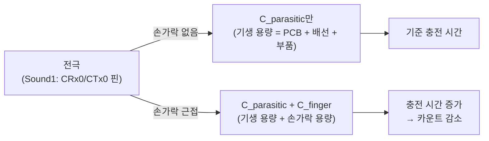
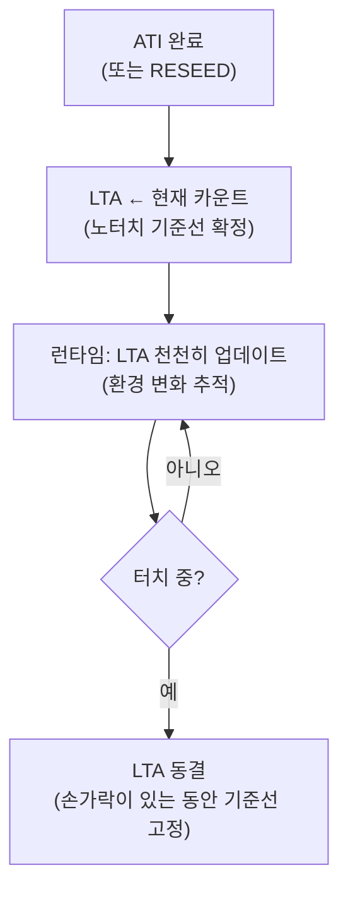
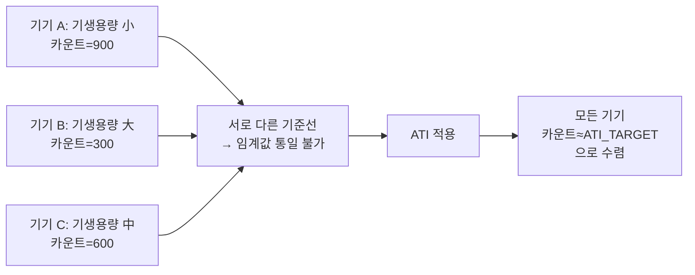
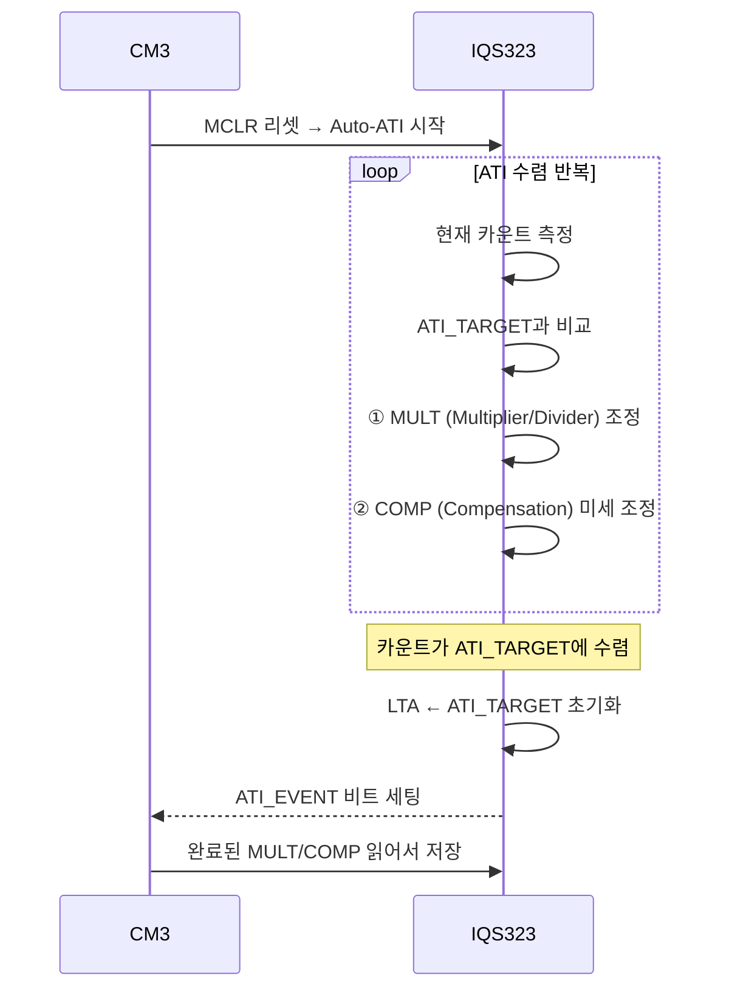
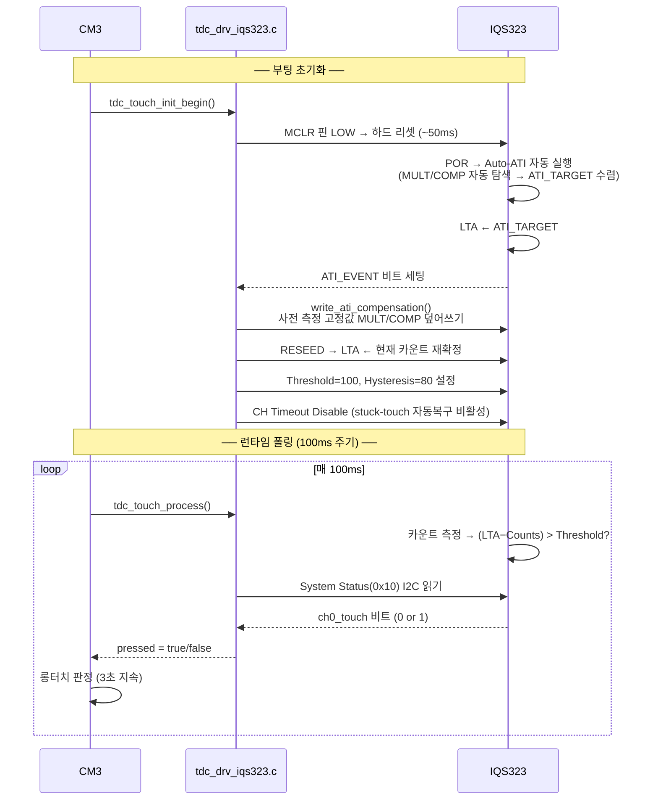
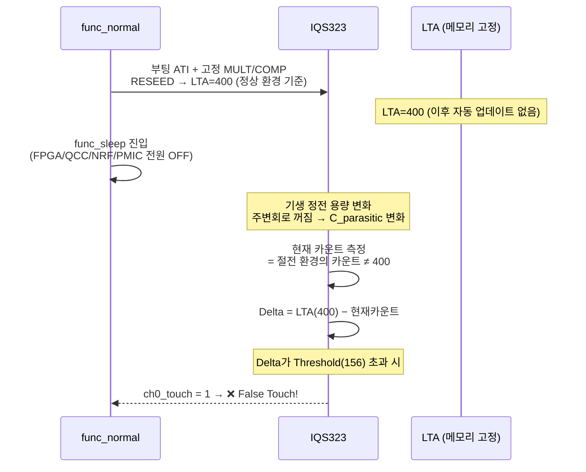
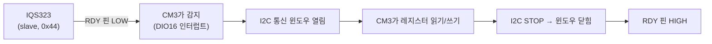

> **TL;DR**: IQS323은 정전 용량 변화를 내부 카운트로 변환하고, ATI로 개체별 편차를 자동 보정한 뒤, LTA 기준선과의 Delta가 Threshold(LTA 비율)를 넘으면 터치로 판정한다. MULT/COMP는 임계값이 아니라 캘리브레이션 보정값이다.

---

## 1. 정전 용량 터치란?

전극(금속판)에 전압을 인가하면 전하가 모입니다. 이것이 **정전 용량(Capacitance, C)** 입니다.
손가락이 전극에 가까워지면 손가락 자체도 도체 역할을 해서 추가 정전 용량이 생깁니다.



> [!NOTE]
> **Self-Capacitance 방식** (Sound1이 사용): 같은 핀을 송신(CTx)과 수신(CRx)으로 동시에 사용. 단순하고 전력 소모가 낮다.

---

## 2. 내부 카운트(Counts)

IQS323은 "일정 측정 시간 안에 충방전 사이클을 몇 번 완료했는가"를 카운트로 계산합니다.

```
측정 시간 고정 ──────────────────────────────────── 끝
│       │       │       │       │       (사이클 5회 = 카운트 5)  → 용량 작음
│───────│───────│       (사이클 2회 = 카운트 2)  → 용량 큼
```

### 핵심 규칙 (데이터시트 §5.4)

> **"Count values are inversely proportional to capacitance"**
> 카운트와 정전 용량은 **반비례**한다.

| 상태 | 정전 용량 | 카운트 |
|---|---|---|
| 노터치 | C_parasitic (낮음) | **높음** |
| 터치 | C_parasitic + C_finger (높음) | **낮음** ← |

손가락이 닿으면 카운트가 **내려간다**. 이것이 터치 감지의 출발점.

---

## 3. LTA (Long-Term Average) — 기준선

LTA는 "지금 이 센서의 노터치 상태 카운트"를 추적하는 기준선입니다.
(데이터시트 §5.5)



### LTA와 터치 판정의 관계

```
카운트 값
    │
LTA ─────────────────────── ← 노터치 상태의 기준선
    │
    │  손가락 닿음 → 카운트 감소
    ↓
현재 카운트
    │
    │← (LTA - 현재카운트) = Delta →│
```

터치 판정: **Delta = LTA − 현재카운트 > Threshold** 이면 터치로 판정

### Sound1의 LTA 설정

Sound1은 **LTA 자동 업데이트를 의도적으로 비활성화**했습니다.

- **이유**: 천천히 손가락을 올리는 동작을 LTA가 따라가면 터치를 못 잡음
- **부작용**: 절전 모드 진입으로 환경이 바뀌어도 LTA가 고정 → false touch 원인

---

## 4. ATI (Automatic Tuning Implementation) — 자동 보정

### 4-1. 왜 필요한가?

PCB마다 배선 길이, 부품 배치, 재질이 달라서 기생 정전 용량이 제각각입니다.
그대로 쓰면 제품마다 터치 감도가 다릅니다.



### 4-2. ATI 작동 과정 (데이터시트 §5.9)



### 4-3. ATI_TARGET 계산

ATI_TARGET은 ATI가 수렴할 목표 카운트 값입니다.

```
ATI_TARGET = ATI_BASE × (ATI Resolution Factor / 16)
```

Sound1 PACKAGE 설정:
- ATI_BASE (레지스터 0x37 기본값) = 100 (0x0064)
- ATI Resolution Factor = ATI_SETUP 레지스터 bits[15:4] = 64
- **ATI_TARGET = 100 × (64/16) = 400 카운트**

### 4-4. MULT와 COMP의 정확한 역할 (데이터시트 Appendix A.12, A.13, A.14)

| 파라미터 | 레지스터 | 역할 | 비유 |
|---|---|---|---|
| **ATI_MULT** (0x38) | Coarse/Fine Fractional Multiplier & Divider | 카운트 배율 — 넓은 범위 보정 | 기어 변속 |
| **ATI_COMP** (0x39) | Compensation Value + Compensation Divider | 미세 보상 용량 추가 | 미세 조향 |

```
원시 카운트
    → [MULT 적용: 배율 조정] → 중간 카운트
    → [COMP 적용: 미세 보정] → 최종 카운트
    → 최종 카운트 ≈ ATI_TARGET ✓
```

> [!IMPORTANT]
> **MULT/COMP는 "터치 임계값"이 아닙니다.**
> "노터치 상태의 카운트를 ATI_TARGET으로 맞추는 보정값"입니다.
> MULT/COMP를 보면 "이 시점의 정전 용량이 얼마였는가"를 역산할 수 있습니다.

#### MULT_MSB 측정값으로 읽는 의미

| 상태 | MULT_MSB | 해석 |
|---|---|---|
| 절전 노터치 | 0x5C | 주변회로 꺼짐 → 기생용량 小 → 카운트 높음 → MULT 적게 필요 |
| 정상 노터치 | 0x5E | 기준 환경 |
| 터치(공통) | 0x64 | 손가락 용량 추가 → 카운트 낮음 → MULT 더 필요 |

```
MULT_MSB:  0x5C    0x5E                0x64
            │       │                   │
         절전_노터치 정상_노터치         터치(공통)
            ←──────────── 용량 증가 방향 ──────────────
```

---

## 5. Threshold와 Hysteresis — 터치 판정 경계

### 5-1. 핵심: Threshold는 절대값이 아닌 LTA의 비율 (데이터시트 Appendix A.17)

```
Touch Threshold(카운트 단위) = (register값 / 256) × LTA
Touch Hysteresis(카운트 단위) = (hys_register값 / 256) × Touch Threshold
```

Sound1 현재 설정 (LTA ≈ ATI_TARGET = 400):

| 파라미터 | 레지스터 값 | 실제 카운트 임계값 |
|---|---|---|
| Threshold | 100 | (100/256) × 400 ≈ **156 카운트** |
| Hysteresis | 80 | (80/256) × 156 ≈ **49 카운트** |

### 5-2. 터치 판정 수식 (데이터시트 §5.7)

```
터치 진입: (LTA − Counts) > Touch_Threshold  →  ✅ TOUCH
터치 해제: (LTA − Counts) < (Touch_Threshold − Touch_Hysteresis)  →  ❌ RELEASE
```

### 5-3. 시각적 표현

```
카운트 값

LTA=400 ─────────────────────────────── 노터치 기준선
          ↕ Threshold = 156 카운트
  244 ─ ─ ─ ─ ─ ─ ─ ─ ─ ─ ─ ─ ─ ─ ─ 터치 감지 경계
          ↕ Hysteresis = 49 카운트
  293 ─ ─ ─ ─ ─ ─ ─ ─ ─ ─ ─ ─ ─ ─ ─ 터치 해제 경계

  200 ──● 터치 중 카운트 (LTA-200=200 > 156 → TOUCH)
  350 ──● 노터치 카운트 (LTA-350=50 < 156 → NOT TOUCH)
```

Hysteresis가 없으면 카운트가 감지 경계에서 오락가락할 때마다 TOUCH/RELEASE를 반복합니다(채터링). Hysteresis가 이를 방지합니다.

### 5-4. 방향성: Self vs Mutual Capacitance (데이터시트 §5.7, A.5)

| 방식 | 터치 시 카운트 | Invert 비트 |
|---|---|---|
| **Self-Capacitance** (Sound1) | **감소** (LTA−Counts > 0) | 0 (정방향) |
| Mutual-Capacitance | **증가** (Counts−LTA > 0) | 1 (역방향 필요) |

---

## 6. CM3 ↔ IQS323 전체 흐름



> [!NOTE]
> CM3는 터치 판단 결과(`ch0_touch` 비트)만 읽습니다. 카운트 계산과 LTA 비교는 IQS323 하드웨어가 자율 수행합니다.

### 왜 Auto-ATI 결과를 고정값으로 덮어쓰는가?

Auto-ATI는 그날의 온도·조립 편차에 따라 결과가 달라집니다. 그대로 쓰면 기기마다 LTA 위치가 달라져 터치 감도가 불일정합니다. 대표 환경에서 측정한 고정 MULT/COMP를 쓰면 모든 기기의 LTA가 같은 위치에 오도록 보장합니다.

---

## 7. 절전 모드 False Touch 메커니즘

### 7-1. 문제 구조



### 7-2. 측정 데이터 기반 분석

2026-06-08 실측값 (PACKAGE 변형):

| 상태 | MULT_MSB | COMP (16비트) | 해석 |
|---|---|---|---|
| 정상 노터치 | 0x5E | 0x63E4 | ← 현재 고정 ATI 기준점 (LTA의 위치) |
| 정상 터치 | 0x64 | 0x63F8 | COMP 소폭 증가 (+20) |
| **절전 노터치** | **0x5C** | **0x6000** | COMP -996 (터치 방향과 동일!) |
| 절전 터치 | 0x64 | 0x5800 | COMP -2048 (절전 노터치 대비) |

> [!WARNING]
> **핵심 문제**: 절전 진입 시 COMP가 0x63E4 → 0x6000으로 하락(-996)하는 방향이 터치와 동일한 방향입니다. 이 변화량이 Threshold 카운트(156)를 초과하면 false touch가 발생합니다.

---

## 8. 감도 조절 방법

### 8-1. 조절 가능한 파라미터 요약

| 파라미터 | 레지스터 | 범위 | 역할 |
|---|---|---|---|
| **Touch Threshold** | 0x62 LSB | 0-255 | 실제 감도 — **이것이 메인 손잡이** |
| **Touch Hysteresis** | 0x62 MSB | 0-255 | 해제 민감도 |
| **MULT/COMP** | 0x38/0x39 | — | LTA 기준선 위치 맞추기 |

### 8-2. Threshold 조절 효과

실제 카운트 임계 = (register/256) × LTA

```
register=80  → (80/256)×400  = 125 카운트  ← 더 민감 (가볍게 닿아도 감지)
register=100 → (100/256)×400 = 156 카운트  ← 현재 Sound1 설정
register=150 → (150/256)×400 = 234 카운트  ← 더 둔감 (세게 눌러야 감지)
```

false touch 방지: **Threshold ↑** (더 큰 Delta가 있어야 감지)
터치 감도 향상: **Threshold ↓** (작은 Delta에도 감지)

### 8-3. MULT/COMP의 올바른 용도

감도 조절이 아니라 **LTA 기준선을 실제 노터치 환경에 정확히 맞추는 것**입니다.

```
MULT/COMP가 정확할 때:
LTA=400 ────────────── 노터치 카운트와 정확히 일치
              ↕ Threshold=156 (전체 마진 사용)
244 ─ ─ ─ ─ ─ ─ ─ ─ ─ 터치 감지 경계 (최대 마진)

MULT/COMP가 틀렸을 때:
LTA=400 ──────────────
              ↕ 50 (이미 기준선에서 50 소모됨)
350 ──── 실제 노터치 카운트 (기준선과 어긋남)
              ↕ 106만 남음 (마진 감소!)
244 ─ ─ ─ ─ ─ 터치 감지 경계 → false touch 위험!
```

### 8-4. 절전 모드 false touch 해결 전략

| 전략 | 방법 | 장단점 |
|---|---|---|
| **A. Threshold 상향** | register값 80→100→150 | 빠른 적용, 정상 모드 감도 함께 낮아짐 |
| **B. ATI 기준점 이동** | MULT/COMP를 절전 노터치 기준으로 변경 | LTA가 두 모드 공통 최저점에 맞춰짐 |
| **C. 절전 진입 시 RESEED** | func_sleep 진입 직전 RESEED 실행 | 근본 해결, 코드 추가 필요 |

현재 Sound1 적용 전략: **A + B 복합** (2026-06-08)
- MULT=0x5C82, COMP=0x6000 (절전 노터치 기준)
- Threshold = 100 (80 → 100 상향)

---

## 9. 레지스터 맵 핵심 요약

| 주소 | 이름 | Sound1 설정값 | 역할 |
|---|---|---|---|
| 0x10 | System Status | 읽기 전용 | ch0_touch 비트로 터치 판정 결과 확인 |
| 0x30 | Sensor0 Setup | 0x0101 | Channel0 활성, Self-Cap(CTx0 선택) |
| 0x36 | ATI Setup | 0x0408 | Mode=Disabled, Resolution=64, Band=Large |
| 0x37 | ATI Base | 0x0064 (기본) | ATI 기준값 100 |
| 0x38 | ATI MULT | PACKAGE: 0x5C82 | Coarse/Fine 배율 보정 |
| 0x39 | ATI COMP | PACKAGE: 0x6000 | 미세 용량 보상 |
| 0x62 | Touch Settings | Thr=100, Hys=80 | 터치 임계값/히스테리시스 |
| 0xC0 | System Control | — | RESEED, Re-ATI 트리거 |

### ATI Setup (0x36) 비트 상세 (Appendix A.12)

```
bits[15:4] = ATI Resolution Factor (현재: 64)
             → ATI_TARGET = BASE × (Factor/16) = 100 × 4 = 400

bit[3]     = ATI Band
             0 = Small (±1/16 × TARGET)
             1 = Large (±1/8  × TARGET)  ← Sound1 (0x08 → bit3=1)

bits[2:0]  = ATI Mode
             000 = Disabled  ← Sound1 (run-time auto re-ATI 차단)
             001 = Compensation Only
             010 = ATI from Compensation Divider
             011 = ATI from Fine Fractional Divider
             100 = Full
```

> [!NOTE]
> Sound1은 ATI Mode를 **Disabled**로 설정합니다. MCLR 직후 한 번 Auto-ATI를 실행한 뒤, 고정 MULT/COMP를 덮어씌우고 이후에는 IQS323이 자체적으로 재-ATI를 실행하지 못하도록 막습니다. 이전 0x0C(Full mode)에서 stuck-touch 감지 시 auto re-ATI → COMP 변경 → ATI_ERROR → I2C 무응답 문제가 있었기 때문입니다.

---

## 10. I2C 통신 구조



- **RDY 핀**: IQS323이 데이터 준비되면 LOW → CM3에게 통신 요청
- **이벤트 모드**: 터치/ATI 이벤트가 있을 때만 RDY가 LOW (불필요한 폴링 없음)
- **0xEE 반환**: 윈도우가 열리지 않은 상태에서 읽기 시도 시 반환 (Sound1 코드에서 skip 처리)

---

## 11. 오개념 정리

| 오개념 | 실제 |
|---|---|
| "MULT/COMP를 크게 하면 터치 감도가 높아진다" | MULT/COMP는 노터치 기준선 보정값. 감도는 Threshold로 조절 |
| "Threshold=80은 카운트 80 이상이면 터치" | Threshold는 LTA의 비율: (80/256)×LTA ≈ 125 카운트 |
| "CM3가 카운트를 읽어서 직접 비교한다" | IQS323 내부에서 비교, CM3는 ch0_touch 비트(0/1)만 읽음 |
| "ATI를 하면 터치 감도가 자동으로 최적화된다" | ATI는 노터치 기준선만 맞춤. 감도는 Threshold로 별도 설정 |
| "절전 모드에서 MULT/COMP가 바뀌면 임계값이 달라진다" | 임계값은 LTA 기준. LTA 고정 + 환경 변화 = false touch |
